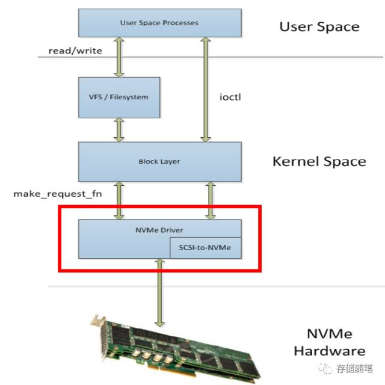
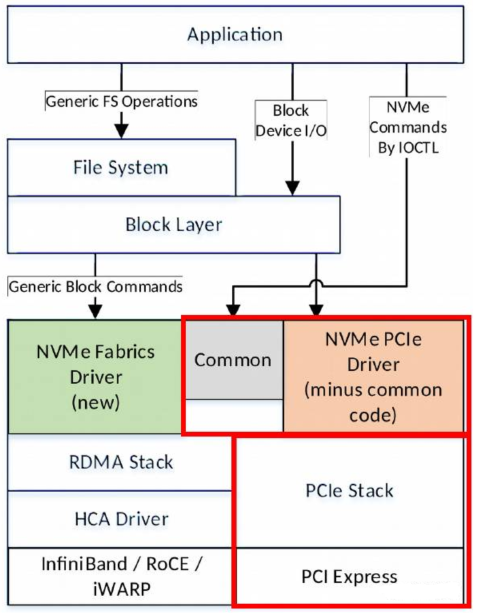
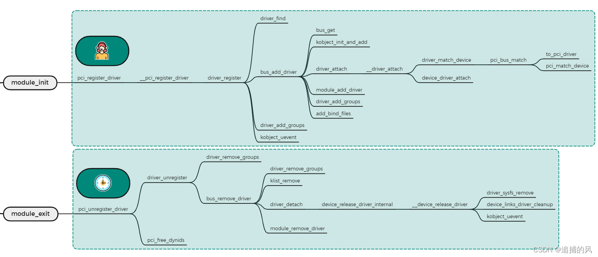

<!-- @import "[TOC]" {cmd="toc" depthFrom=1 depthTo=6 orderedList=false} -->

<!-- code_chunk_output -->

- [1. 架构](#1-架构)
- [2. 源码和编译](#2-源码和编译)
  - [2.1. 模块源码](#21-模块源码)
  - [2.2. 模块诞生](#22-模块诞生)
- [3. nvme-core 模块](#3-nvme-core-模块)
  - [3.1. 模块初始化](#31-模块初始化)
    - [3.1.1. workqueue](#311-workqueue)
    - [3.1.2. 设备号](#312-设备号)
  - [3.2. 模块注销](#32-模块注销)
- [4. nvme 模块](#4-nvme-模块)
  - [4.1. 驱动注册](#41-驱动注册)
    - [4.1.1. 入口 nvme_init 以及主要数据结构](#411-入口-nvme_init-以及主要数据结构)
    - [4.1.2. 核心 driver_register](#412-核心-driver_register)
  - [4.2. 驱动注销](#42-驱动注销)
- [5. 加载分析](#5-加载分析)
  - [5.1. debug 注册](#51-debug-注册)
  - [5.2. debug 注销](#52-debug-注销)
  - [5.3. 简化版](#53-简化版)
    - [5.3.1. 注册](#531-注册)
    - [5.3.2. 注销](#532-注销)
- [6. reference](#6-reference)

<!-- /code_chunk_output -->

# 1. 架构

先了解一下 Driver 在 Linux 架构中的位置. NVMe driver 在 Block Layer 之下, 负责与 NVMe 设备交互.



现在的 NVMe driver 已经很强大了, 也可以支持 NVMe over Fabric 相关设备,如下图. 不过, 我们这里的学习目前还主要以 NVMe over PCIe 为主.



# 2. 源码和编译

在分析一个 driver 时, 最好先看这个 driver 相关的 Kconfig 及 Makefile 文件, 了解其文件架构, 再阅读相关的 source code

Kconfig 文件的作用是:

1. 控制 make menuconfig 时,  出现的配置选项;

2. 根据用户配置界面的选择, 将配置结果保存在 `.config` 配置文件(该文件将提供给 Makefile 使用, 用以决定要编译的内核组件以及如何编译)

## 2.1. 模块源码

源码在 `drivers/nvme` 下面, 主要有两个文件夹, 一个是 host, 一个是 target.

* targets 文件夹用于将 nvme 设备作为磁盘导出, 供外部使用;

* host 文件夹实现将 nvme 设备供本系统使用, 不会对外使用, 意味着外部系统不能通过网络或者光纤来访问我们的 NVMe 磁盘.

若配置 NVME target 还需要工具 nvmetcli 工具: http://git.infradead.org/users/hch/nvmetcli.git

我们这个系列主要针对 host, 关于 target 将来有机会再做进一步分析. 所以后续所有文件都是位于 drviers/nvme/host 中.

## 2.2. 模块诞生

先来看下 `drviers/nvme/host` 目录中的 Makefile, 具体如下. 根据内核中的参数配置, 最多会有 7 个模块.

```makefile
# SPDX-License-Identifier: GPL-2.0

ccflags-y				+= -I$(src)

# 7 个模块
obj-$(CONFIG_NVME_CORE)			+= nvme-core.o
obj-$(CONFIG_BLK_DEV_NVME)		+= nvme.o
obj-$(CONFIG_NVME_FABRICS)		+= nvme-fabrics.o
obj-$(CONFIG_NVME_RDMA)			+= nvme-rdma.o
obj-$(CONFIG_NVME_FC)			+= nvme-fc.o
obj-$(CONFIG_NVME_TCP)			+= nvme-tcp.o
obj-$(CONFIG_NVME_APPLE)		+= nvme-apple.o

nvme-core-y				+= core.o ioctl.o
nvme-core-$(CONFIG_NVME_VERBOSE_ERRORS)	+= constants.o
nvme-core-$(CONFIG_TRACING)		+= trace.o
nvme-core-$(CONFIG_NVME_MULTIPATH)	+= multipath.o
nvme-core-$(CONFIG_BLK_DEV_ZONED)	+= zns.o
nvme-core-$(CONFIG_FAULT_INJECTION_DEBUG_FS)	+= fault_inject.o
nvme-core-$(CONFIG_NVME_HWMON)		+= hwmon.o
nvme-core-$(CONFIG_NVME_AUTH)		+= auth.o

nvme-y					+= pci.o

nvme-fabrics-y				+= fabrics.o

nvme-rdma-y				+= rdma.o

nvme-fc-y				+= fc.o

nvme-tcp-y				+= tcp.o

nvme-apple-y				+= apple.o
```

其中 `ccflags-y` 是**编译标记**, 会被正常的 cc 调用, 指定了 `$(CC)` **编译时候的选项**, 这里**只是**将内核源码的**头文件包含进去**.  其中 `$(src)` 是指向**内核根目录**中 Makefile 所在的目录, 包含**模块**需要的一些**头文件**.

我们看下决定模块是否编译的 7 个配置参数:

`NVME_CORE`: 这是一个被动的选项. 该选项在 `BLK_DEV_NVME`, `NVME_RDMA`, `NVME_FC` **使能**时候会**自动选上**, 是 **nvme 核心基础**.

对应的代码是 `core.c` 和 `ioctl.c`, 产生的**模块**是 `nvme-core.ko`.

需要注意的是, 如果**使能**了配置: `NVME_VERBOSE_ERRORS`, `TRACING`, `NVME_MULTIPATH`, `BLK_DEV_ZONED`, `FAULT_INJECTION_DEBUG_FS`, `NVME_HWMON`, `NVME_AUTH`, 那么**模块** `nvme-core.ko` 会合入 `constants.c`, `trace.c`, `multipath.c`, `zns.c`, `fault_inject.c`, `hwmon.c` 和 `auth.c` **文件**, 这些是 NVMe 驱动的特点**可选择是否开启**.

```
config NVME_CORE
	tristate
	select BLK_DEV_INTEGRITY_T10 if BLK_DEV_INTEGRITY
```

```makefile
# 使能后对应的 nvme-core.ko 模块, 同时产生 nvme-core-y
obj-$(CONFIG_NVME_CORE)||       |       += nvme-core.o
# nvme-core-y(nvme-core.ko 模块)依赖 core.c 和 ioctl.c
nvme-core-y				+= core.o ioctl.o
# 如果使能了其他的, nvme-core-y 也会有其他的文件依赖
nvme-core-$(CONFIG_NVME_VERBOSE_ERRORS)	+= constants.o
nvme-core-$(CONFIG_TRACING)		+= trace.o
nvme-core-$(CONFIG_NVME_MULTIPATH)	+= multipath.o
nvme-core-$(CONFIG_BLK_DEV_ZONED)	+= zns.o
nvme-core-$(CONFIG_FAULT_INJECTION_DEBUG_FS)	+= fault_inject.o
nvme-core-$(CONFIG_NVME_HWMON)		+= hwmon.o
nvme-core-$(CONFIG_NVME_AUTH)		+= auth.o
```

`BLK_DEV_NVME`: 这个**选项开启**后会**自动选上** `NVME_CORE`, 同时自身依赖 pci 和 block. 这个产生 `nvme.ko` 驱动**模块**, 用于直接**将 ssd 链接到 pci 或者 pcie**.

对应的代码是 `pci.c`, 产生的**模块**是 `nvme.ko`.

```kconfig
# drivers/nvme/host/Kconfig
config BLK_DEV_NVME
	tristate "NVM Express block device"
	depends on PCI && BLOCK # 依赖
	select NVME_CORE # 自动选上 NVME_CORE
```

```makefile
# 使能后对应的 nvme.ko 模块, 同时产生产生 nvme-y
obj-$(CONFIG_BLK_DEV_NVME)|     |       += nvme.o
# nvme-y(nvme.ko 模块)依赖 pci.c
nvme-y					+= pci.o
```

通过 modinfo 可以查看该模块信息

```
# 这是 built-in 的
# modinfo nvme
name:           nvme
filename:       (builtin)
version:        1.0
license:        GPL
file:           drivers/nvme/host/nvme
author:         Matthew Wilcox <willy@linux.intel.com>
parm:           use_threaded_interrupts:int
parm:           use_cmb_sqes:use controller's memory buffer for I/O SQes (bool)
parm:           max_host_mem_size_mb:Maximum Host Memory Buffer (HMB) size per controller (in MiB) (uint)
parm:           sgl_threshold:Use SGLs when average request segment size is larger or equal to this size. Use 0 to disable SGLs. (uint)
parm:           io_queue_depth:set io queue depth, should >= 2 and < 4096
parm:           write_queues:Number of queues to use for writes. If not set, reads and writes will share a queue set.
parm:           poll_queues:Number of queues to use for polled IO.
parm:           noacpi:disable acpi bios quirks (bool)

# 这是作为模块存在的信息
# modinfo nvme
filename:       /lib/modules/4.18.0-240.el8.x86_64/kernel/drivers/nvme/host/nvme.ko.xz
version:        1.0
license:        GPL
author:         Matthew Wilcox <willy@linux.intel.com>
rhelversion:    8.3
srcversion:     5ECFF116C5E071E6E5AAF94
alias:          pci:v0000106Bd00002005sv*sd*bc*sc*i*
......
depends:        nvme-core
intree:         Y
name:           nvme
vermagic:       4.18.0-240.el8.x86_64 SMP mod_unload modversions
                ......
parm:           use_threaded_interrupts:int
parm:           use_cmb_sqes:use controller's memory buffer for I/O SQes (bool)
parm:           max_host_mem_size_mb:Maximum Host Memory Buffer (HMB) size per controller (in MiB) (uint)
parm:           sgl_threshold:Use SGLs when average request segment size is larger or equal to this size. Use 0 to disable SGLs. (uint)
parm:           io_queue_depth:set io queue depth, should >= 2
parm:           write_queues:Number of queues to use for writes. If not set, reads and writes will share a queue set. (uint)
parm:           poll_queues:Number of queues to use for polled IO. (uint)
```

`CONFIG_NVME_FABRICS`: 是这个**被动选项**. 被 `NVME_RDMA` 和 `NVME_FC` 选择(当然, 还有一些其他条件需要满足). 主要用于**支持 FC 协议**.

对应的文件是 `fabrics.c`

```
config NVME_FABRICS
        select NVME_CORE # 自动选上 NVME_CORE
        tristate
```

```makefile
# 使能后对应的 nvme-fabrics.ko 模块, 同时产生 nvme-fabrics-y
obj-$(CONFIG_NVME_FABRICS)		+= nvme-fabrics.o
# nvme-fabrics-y(nvme-fabrics.ko 模块)依赖 fabrics.c
nvme-fabrics-y                          += fabrics.o
```

`CONFIG_NVME_RDMA`: 这个驱动使得 `NVMe over Fabric` 可以**通过 RDMA 传输**(该选项还依赖于 `CONFIG_INFINIBAND`, `INFINIBAND_ADDR_TRANS` 和 `BLOCK`). 该选项会自动使能 `NVME_FABRICS`(它又会自动使能`NVME_CORE`), `SG_POOL`

对应的文件是 `rdma.c`

```
config NVME_RDMA
        tristate "NVM Express over Fabrics RDMA host driver"
        depends on INFINIBAND && INFINIBAND_ADDR_TRANS && BLOCK
        select NVME_FABRICS
        select SG_POOL
```

```makefile
# 使能后对应的 nvme-rdma.ko 模块, 同时产生 nvme-rdma-y
obj-$(CONFIG_NVME_RDMA)                 += nvme-rdma.o
# nvme-rdma-y(nvme-rdma.ko 模块)依赖 rdma.c
nvme-rdma-y                             += rdma.o
```

`CONFIG_NVME_FC`: 这个驱动使得 `NVMe over Fabric` 可以**在 FC 传输**. 该选项会自动使能 `NVME_FABRICS`(它又会自动使能`NVME_CORE`), `SG_POOL`.

```
config NVME_FC
        tristate "NVM Express over Fabrics FC host driver"
        depends on BLOCK # 依赖
        depends on HAS_DMA # 依赖
        select NVME_FABRICS # 自动选上
        select SG_POOL # 自动选上
```

```makefile
# 使能后对应的 nvme-fc.ko 模块, 同时产生 nvme-fc-y
obj-$(CONFIG_NVME_FC)                   += nvme-fc.o
# nvme-fc-y(nvme-fc.ko 模块)依赖 fc.c
nvme-fc-y                               += fc.o
```

`CONFIG_NVME_TCP`:

<table style="width:100%">
<caption>Description</caption>
  <tr>
    <th>
    模块
    </th>
    <th>
    依赖
    </th>
    <th>
    源码文件
    </th>
  </tr>
  <tr>
    <td>
    nvme-core.ko
    </td>
    <td>
    -
    </td>
    <td>
    core.c ioctl.c constants.c trace.c multipath.c zns.c fault_inject.c hwmon.c auth.c
    </td>
  </tr>
  <tr>
    <td>
    nvme.ko
    </td>
    <td>
    CONFIG_PCI, CONFIG_BLOCK
    </td>
    <td>
    pci.c
    </td>
  </tr>
  <tr>
    <td>
    nvme-fabirc.ko
    </td>
    <td>
    -
    </td>
    <td>
    fabrics.c
    </td>
  </tr>
  <td>
    nvme-rdma.ko
    </td>
    <td>
    CONFIG_INFINIBAND, CONFIG_INFINIBAND_ADDR_TRANS, CONFIG_BLOCK
    </td>
    <td>
    rdma.c
    </td>
  </tr>
</table>

配置完毕后, 可以在内核代码根目录中执行 make 命令产生驱动.

```conf
#
# NVME Support
#
CONFIG_NVME_CORE=m
CONFIG_BLK_DEV_NVME=m
# CONFIG_NVME_MULTIPATH is not set
# CONFIG_NVME_HWMON is not set
CONFIG_NVME_FABRICS=m
# CONFIG_NVME_RDMA is not set
CONFIG_NVME_FC=m
# CONFIG_NVME_TCP is not set
CONFIG_NVME_TARGET=m
# CONFIG_NVME_TARGET_PASSTHRU is not set
CONFIG_NVME_TARGET_LOOP=m
# CONFIG_NVME_TARGET_RDMA is not set
CONFIG_NVME_TARGET_FC=m
# CONFIG_NVME_TARGET_FCLOOP is not set
# CONFIG_NVME_TARGET_TCP is not set
# end of NVME Support
```

```
# make M=drivers/nvme/host
  CC [M]  drivers/nvme/host/pci.o
  LD [M]  drivers/nvme/host/nvme.o
  MODPOST drivers/nvme/host/Module.symvers
  CC [M]  drivers/nvme/host/nvme.mod.o
  LD [M]  drivers/nvme/host/nvme.ko
```

编译后会产生所配置的驱动模块, 我们本系列只覆盖 nvme.ko 这个驱动模板, 当然另一个 `nvme-core.ko` 必须的. 编译后可以通过 `make modules_install` 来安装.

然后可以通过 `modprobe nvme` 来加载驱动.

# 3. nvme-core 模块

nvme-core 模块是 nvme 模块所依赖的, 我们可以在前面内核配置中知道, 也可以在使用 modinfo 命令查看.

这意味着在加载 nvme 模块之前会提前加载 nvme-core 模块.

看下 nvme-core 驱动的注册和注销:

```cpp
// drivers/nvme/host/core.c
module_init(nvme_core_init);
module_exit(nvme_core_exit);
```


## 3.1. 模块初始化

```cpp
// drivers/nvme/host/core.c
static int __init nvme_core_init(void)
{
	int result = -ENOMEM;

	_nvme_check_size();
    // 创建了三个工作队列
    // 工作队列 nvme-wq
    // /sys/devices/virtual/workqueue/nvme-wq
	nvme_wq = alloc_workqueue("nvme-wq",
			WQ_UNBOUND | WQ_MEM_RECLAIM | WQ_SYSFS, 0);
	if (!nvme_wq)
		goto out;
    // 工作队列 nvme-reset-wq
    // /sys/devices/virtual/workqueue/nvme-reset-wq
	nvme_reset_wq = alloc_workqueue("nvme-reset-wq",
			WQ_UNBOUND | WQ_MEM_RECLAIM | WQ_SYSFS, 0);
	if (!nvme_reset_wq)
		goto destroy_wq;
    // 工作队列 nvme-delete-wq
    // /sys/devices/virtual/workqueue/nvme-delete-wq
	nvme_delete_wq = alloc_workqueue("nvme-delete-wq",
			WQ_UNBOUND | WQ_MEM_RECLAIM | WQ_SYSFS, 0);
	if (!nvme_delete_wq)
		goto destroy_reset_wq;
    // 分配一个字符串设备的范围, 主设备号值随机, 次设备号从０开始, 范围为 NVME_MINORS, 并将第一个值(设备号)赋值给 nvme_ctrl_base_chr_devt
	result = alloc_chrdev_region(&nvme_ctrl_base_chr_devt, 0,
			NVME_MINORS, "nvme");
	if (result < 0)
		goto destroy_delete_wq;
    // 创建一个 struct class 结构体, 为后续设备注册准备
    // 会添加 sys 目录, /sys/class/nvme
	nvme_class = class_create(THIS_MODULE, "nvme");
	if (IS_ERR(nvme_class)) {
		result = PTR_ERR(nvme_class);
		goto unregister_chrdev;
	}
	nvme_class->dev_uevent = nvme_class_uevent;
    // 会添加 sys 目录, /sys/class/nvme-subsystem
	nvme_subsys_class = class_create(THIS_MODULE, "nvme-subsystem");
	if (IS_ERR(nvme_subsys_class)) {
		result = PTR_ERR(nvme_subsys_class);
		goto destroy_class;
	}
    // 分配一个字符串设备范围, 主设备号值随机, 次设备号从０开始, 范围为 NVME_MINORS, 并将第一个值(设备号)赋值给 nvme_ns_chr_devt
	result = alloc_chrdev_region(&nvme_ns_chr_devt, 0, NVME_MINORS,
				     "nvme-generic");
	if (result < 0)
		goto destroy_subsys_class;
    // 会添加 sys 目录, /sys/class/nvme-generic
	nvme_ns_chr_class = class_create(THIS_MODULE, "nvme-generic");
	if (IS_ERR(nvme_ns_chr_class)) {
		result = PTR_ERR(nvme_ns_chr_class);
		goto unregister_generic_ns;
	}

	return 0;
}
```

`alloc_workqueue`, 其实是个宏, 该宏会调用 `__alloc_workqueue_key` 创建工作队列返回 `workqueue_struct` 结构体, 而如果 flags 有 `WQ_SYSFS` 则内部还会调用 `workqueue_sysfs_register`, 将队列暴露在 sysfs 中, 过程如下:

1. 初始化 `struct wq_device` wq 设备的相关属性

其中 `wq_dev->dev.bus = &wq_subsys;` 设置了该设备的总线类型为 `wq_subsys`, **wq 总线**会有一个属性组 `per_cpu` 和 `max_active`

2. 调用 `device_register` 注册该 workqueue 设备

 * `kobject_add`, 在父节点的 sys 目录下创建了**该设备的目录**, `/sys/devices/virtual/workqueue/nvme-wq/`

 * `device_create_file(dev, &dev_attr_uevent)`, 在该设备目录下创建 uevent 属性文件, `/sys/devices/virtual/workqueue/nvme-wq/uevent`

 * `device_add_class_symlinks`, 创建了**class 相关的链接**, workqueue 设备并没有

 * `device_add_attrs`, 创建 sys 目录下设备其他属性文件(添加设备属性文件), workqueue 设备没有, 所以 sys 下没有相关文件或者链接

   * 给设备添加**class 属性**,
   * 给设备添加**设备类型 type 属性**,
   * ......

 * `bus_add_device`, 给设备添加**总线(wq_subsys)属性**

   * `device_add_groups(dev, bus->dev_groups)`, 在设备节点下创建了两个总线(`wq_subsys`)相关文件, 即上面说的 `per_cpu` 和 `max_active`

   * 给 bus 总线 sys 节点下创建了指向 该设备 的链接, `/sys/bus/workqueue/devices/nvme-wq`, 指向了 `/sys/devices/virtual/workqueue/nvme-wq/`

   * 创建 subsystem 链接, `/sys/devices/virtual/workqueue/nvme-wq/subsystem`, 指向了 `/sys/bus/workqueue`

   * 将该设备添加到了 bus 的设备链表中

 * `dpm_sysfs_add`, 电管管理相关, 会添加 `/sys/devices/virtual/workqueue/nvme-wq/power` 目录及其文件

 * `device_pm_add`, 设备添加到电源管理相关的设备列表中

 * 主设备号如果存在, 则产生 dev 属性,并在/dev 目录下产生设备节点文件, workqueue 设备没有

3. 当 flags 有 `WQ_UNBOUND` 时, 会给每个 `wq_dev` sysfs 目录下创建多个文件:
* pool_ids
* nice
* cpumask
* numa

```
# ll /sys/devices/virtual/workqueue/nvme-wq/
total 0
-rw-r--r-- 1 root root 4096 Feb  8 19:02 cpumask
-rw-r--r-- 1 root root 4096 Feb  8 19:02 max_active
-rw-r--r-- 1 root root 4096 Feb  8 19:02 nice
-rw-r--r-- 1 root root 4096 Feb  8 19:02 numa
-r--r--r-- 1 root root 4096 Feb  8 19:02 per_cpu
-r--r--r-- 1 root root 4096 Feb  8 19:02 pool_ids
drwxr-xr-x 2 root root    0 Feb  8 19:02 power
lrwxrwxrwx 1 root root    0 Feb  7 15:17 subsystem -> ../../../../bus/workqueue
-rw-r--r-- 1 root root 4096 Feb  7 15:17 uevent
```

> 实际创建的 **kobject** 都是在 **devices** 下面, 其他 **class**, **bus** 之类的里面的**具体设备**都是 **devices 目录**下**设备**的**符号链接**

### 3.1.1. workqueue

工作队列 workqueue 是延迟执行中使用最多的机制, 有两种线程池, 分为 **unbound workqueue** 和**bound workqueue**.

* `bound workqueue` 就是**绑定到 cpu** 上的(`per-cpu`), 挂入到此队列中的 work 只会在相对应的 cpu 上运行;

* `unbound workqueue` **不绑定到特定的 cpu**, 而且后台**线程池的数量**也是**动态**的.

由于 cache locality 的原因, per cpu 的线程池的性能会好一些, 但是对 power saving 有一些影响. 设计往往如此, workqueue 需要在 performance 和 power saving 之间平衡, 想要更好的性能, 那么最好让一个 cpu 上的 worker thread 来处理 work, 这样的话, cache 命中率会比较高, 性能会更好. 但是, 从电源管理的角度来看, 最好的策略是让 idle 状态的 cpu 尽可能的保持 idle, 而不是反复 idle, working, idle again.

我们来一个例子辅助理解上面的内容. 在 t1 时刻, work 被调度到 CPU A 上执行, t2 时刻 work 执行完毕, CPU A 进入 idle, t3 时刻有一个新的 work 需要处理, 这时候调度 work 到哪个 CPU 会好些呢? 是处于 working 状态的 CPU B 还是处于 idle 状态的 CPU A 呢? 如果调度到 CPU B 上运行, 那么, 由于之前处理过 work, 其 cache 内容新鲜, 处理起 work 当然是得心应手, 速度很快, 但是, 这需要将 CPU A 从 idle 状态中唤醒. 选择 CPU B 呢就不存在将 CPU 从 idle 状态唤醒, 从而获取 power saving 方面的好处.

了解了上面的基础内容之后, 我们再来检视 per cpu thread pool 和 unbound thread pool. 当 workqueue 收到一个要处理的 work, 如果该 workqueue 是 unbound 类型的话, 那么该 work 由 unbound thread pool 处理并把调度该 work 去哪一个 CPU 执行这样的策略交给系统的调度器模块来完成, 对于 scheduler 而言, 它会考虑 CPU core 的 idle 状态, 从而尽可能的让 CPU 保持在 idle 状态, 从而节省了功耗. 因此, 如果一个 workqueue 有 WQ_UNBOUND 这样的 flag, 则说明该 workqueue 上挂入的 work 处理是考虑到 power saving 的. 如果 workqueue 没有 WQ_UNBOUND flag, 则说明该 workqueue 是 per cpu 的, 这时候, 调度哪一个 CPU core 运行 worker thread 来处理 work 已经不是 scheduler 可以控制的了, 这样, 也就间接影响了功耗.

此处**三个工作队列**都是 **unbound** 模式的. 对于后续驱动使用来说, 只要定义一个 work, 然后把 work 加入到 workqueue 就可以了. 相比于 **tasklet** 机制, 工作队列可以**在不同 CPU 上同时运行**.

### 3.1.2. 设备号

一个字符设备或者块设备都有一个主设备号和次设备号. **主设备号**和**次设备号**统称为**设备号**.

**主设备号**用来表示一个**特定的驱动程序**. **次设备号**用来表示使用**该驱动**程序的**其他设备**. (**主设备号**和控制这类设备的**驱动**是**一一对应**的)

通俗的说就是**主设备号**标识设备对应的**驱动程序**, 告诉 Linux **内核**使用**哪一个驱动程序**为该设备(也就是 /dev 下的设备文件)**服务**; 而**次设备号**则用来标识**具体且唯一**的**某个设备**.

在**同一个系统**中, **同一类设备**的**主设备号**是**唯一**的. 比如: **磁盘这类**, **次设备号**只是在**驱动程序内部使用**, 系统内核直接把次设备号传递给应用程序, 由驱动程序管理. 为了保证驱动程序的通用性, 避免驱动程序移植过程中出现主设备号冲突, 系统为设备编了号, 每个设备号又分为主设备号和次设备号.

比如, 我们在 Linux 系统上挂了两块 NVMe SSD. 那么主设备号就可以自动分配一个数字(比如 8), 次设备号分别为 1 和 2.

例如, 在 32 位机子中, 设备号共 32 位, 高 12 位表示主设备号, 低 20 位表示次设备号.

主设备号用来区分不同种类的设备, 而次设备号用来区分同一类型的多个设备. 对于**常用设备**, Linux 有**约定俗成的编号**.

## 3.2. 模块注销

初始化的完全逆操作

```cpp
// drivers/nvme/host/core.c
static void __exit nvme_core_exit(void)
{
	class_destroy(nvme_ns_chr_class);
	class_destroy(nvme_subsys_class);
	class_destroy(nvme_class);
	unregister_chrdev_region(nvme_ns_chr_devt, NVME_MINORS);
	unregister_chrdev_region(nvme_ctrl_base_chr_devt, NVME_MINORS);
	destroy_workqueue(nvme_delete_wq);
	destroy_workqueue(nvme_reset_wq);
	destroy_workqueue(nvme_wq);
	ida_destroy(&nvme_ns_chr_minor_ida);
	ida_destroy(&nvme_instance_ida);
}
```

# 4. nvme 模块

现在使用的 **NVMe 设备**都是**基于 PCI 的**, 所以最后**设备**需要**连接**到内核中的 **pci 总线上**才能够使用. 这也是为什么在上篇配置 nvme.ko 时会需要 pci.c 文件, 在 Makefile 中有如下这一行的:

```
nvme-y    += pci.o
```

本篇主要针对 `pci.c` 文件的一部分内容进行分析(其实本系列涉及的代码内容就是在 `pci.c` 和 `core.c` 两个文件中).

驱动的注册和注销, 其实就是模块的初始化和退出函数

```cpp
module_init(nvme_init);
module_exit(nvme_exit);
```

nvme 驱动的注册和注销整体函数流程如下图所所示:




## 4.1. 驱动注册

### 4.1.1. 入口 nvme_init 以及主要数据结构

模块注册函数是 `nvme_init`, 非常简单, 就是一个 `pci_register_driver` 函数

```cpp
static int __init nvme_init(void)
{
	BUILD_BUG_ON(sizeof(struct nvme_create_cq) != 64);
	BUILD_BUG_ON(sizeof(struct nvme_create_sq) != 64);
	BUILD_BUG_ON(sizeof(struct nvme_delete_queue) != 64);
	BUILD_BUG_ON(IRQ_AFFINITY_MAX_SETS < 2);
	BUILD_BUG_ON(DIV_ROUND_UP(nvme_pci_npages_prp(), NVME_CTRL_PAGE_SIZE) >
		     S8_MAX);
    // 注册 pci 总线的驱动
	return pci_register_driver(&nvme_driver);
}
```

注册了 `nvme_driver` 驱动, 参数为结构体 `nvme_driver`, 该结构体类型是 `pci_driver`.

```cpp
static struct pci_driver nvme_driver = {
    // 驱动的名字
	.name		= "nvme",
    // 设备与驱动的关联表, 通过这个表内核可以知道哪些设备是通过这个驱动来工作的
	.id_table	= nvme_id_table,
    // 初始化函数, 该函数负责在驱动加载时候探测总线上的硬件设备并初始化设备
	.probe		= nvme_probe,
    // 当前驱动从内核移除时候被调用
	.remove		= nvme_remove,
    // 用于关闭设备
	.shutdown	= nvme_shutdown,
#ifdef CONFIG_PM_SLEEP
	.driver		= {
		.pm	= &nvme_dev_pm_ops,
	},
#endif
    // nvme 的 sriov 操作函数
	.sriov_configure = pci_sriov_configure_simple,
    // 错误处理句柄
	.err_handler	= &nvme_err_handler,
};
```

而 `pci_register_driver` 是个宏, 其实是 `__pci_register_driver` 函数, 该函数会通过调用 `driver_register` 将要**注册的驱动结构体**放到**总线的驱动链表**中, 将其串成了一串.

```cpp
#define pci_register_driver(driver)		\
	__pci_register_driver(driver, THIS_MODULE, KBUILD_MODNAME)
```

这里要注意的是 `pci_driver` 中包含了 `device_driver`, 而我们的驱动 `nvme_driver` 是 `pci_driver` 类型.

```cpp
struct pci_driver {
	struct list_head	node;
	const char		*name;
    ......
	struct device_driver	driver;
	struct pci_dynids	dynids;
	bool driver_managed_dma;
};
```

而 `__pci_register_driver` 函数会用 `nvme_driver` 结构体中的值赋值给 `nvme_driver` 中 `device_driver` 这个**通用结构体**

```cpp
// drivers/pci/pci-driver.c
int __pci_register_driver(struct pci_driver *drv, struct module *owner,
			  const char *mod_name)
{
	/* initialize common driver fields */
	drv->driver.name = drv->name; // 赋值为"nvme"
	drv->driver.bus = &pci_bus_type; //设置为 pci_bus_type,是个结构体 struct bus_type pci_bus_type
	drv->driver.owner = owner; //驱动的拥有者
	drv->driver.mod_name = mod_name; //device_driver 中的名字, 为系统中的 KBUILD_NAME
	drv->driver.groups = drv->groups; //驱动的属性组, 代码中并未赋值
	drv->driver.dev_groups = drv->dev_groups;

	spin_lock_init(&drv->dynids.lock); //初始化自旋锁
	INIT_LIST_HEAD(&drv->dynids.list); //初始化设备驱动中的节点元素, 用于在链表中串起来

	/* register with core */
	return driver_register(&drv->driver); //调用 driver_register 注册驱动
}
EXPORT_SYMBOL(__pci_register_driver);
```

`pci_bus_type` 是由充满玄机的, **结构体**中定义了很多**和总线相关的函数**, 这些函数其实是**由 pci 总线驱动提供**的, 位于 `drivers/pci/pci-driver.c` 文件

```cpp
// drivers/pci/pci-driver.c
struct bus_type pci_bus_type = {
	.name		= "pci",
	.match		= pci_bus_match,
	.uevent		= pci_uevent,
	.probe		= pci_device_probe,
	.remove		= pci_device_remove,
	.shutdown	= pci_device_shutdown,
	.dev_groups	= pci_dev_groups,
	.bus_groups	= pci_bus_groups,
	.drv_groups	= pci_drv_groups,
	.pm		= PCI_PM_OPS_PTR,
	.num_vf		= pci_bus_num_vf,
	.dma_configure	= pci_dma_configure,
	.dma_cleanup	= pci_dma_cleanup,
};
```

这个 `pci_register_driver` 函数主要作用就是**传递 NVMe 驱动相关参数**, 并调用 `driver_register`, 该函数实现**将 NVMe 驱动注册到总线**, 参数就是一个需要注册的 `struct device_driver`(是一个**通用结构体**, 所以在调用之前需要先给该结构体赋特定驱动的值)

### 4.1.2. 核心 driver_register

```cpp
// drivers/base/driver.c
int driver_register(struct device_driver *drv)
{
	int ret;
	struct device_driver *other;

    // 检测 device_driver->driver_private,开始应该是为 NULL,不然就 panic
	if (!drv->bus->p) {
		pr_err("Driver '%s' was unable to register with bus_type '%s' because the bus was not initialized.\n",
			   drv->name, drv->bus->name);
		return -EINVAL;
	}
    // 判断 总线 和 驱动 是否 定义了 probe,remove 和 shutdown 函数
    // 因为 总线 中已经有这三个函数的定义, 所以 驱动 中并不需要, 出现的话会打印警告
	if ((drv->bus->probe && drv->probe) ||
	    (drv->bus->remove && drv->remove) ||
	    (drv->bus->shutdown && drv->shutdown))
		pr_warn("Driver '%s' needs updating - please use "
			"bus_type methods\n", drv->name);
    // 在需要注册的总线(pci_bus_type)上查找是否已经存在相同名字的驱动
	other = driver_find(drv->name, drv->bus);
	if (other) {
		pr_err("Error: Driver '%s' is already registered, "
			"aborting...\n", drv->name);
		return -EBUSY;
	}
    // 真正实现将 驱动 添加到 总线 中
	ret = bus_add_driver(drv);
	if (ret)
		return ret;
    // 在 驱动 创建 驱动 自己的属性组
    // struct pci_driver nvme_driver 并没有赋值
	ret = driver_add_groups(drv, drv->groups);
	if (ret) {
		bus_remove_driver(drv);
		return ret;
	}
    // 通知用户驱动加载成功
	kobject_uevent(&drv->p->kobj, KOBJ_ADD);
	deferred_probe_extend_timeout();

	return ret;
}
```

`driver_find` 函数用于在特定总线上, 根据名字查找驱动

```cpp
// drivers/base/driver.c
struct device_driver *driver_find(const char *name, struct bus_type *bus)
{
	struct kobject *k = kset_find_obj(bus->p->drivers_kset, name);
	struct driver_private *priv;

	if (k) {
		/* Drop reference added by kset_find_obj() */
		kobject_put(k);
		priv = to_driver(k);
		return priv->driver;
	}
	return NULL;
}
```

其中 `bus->p` 的结构体是 `struct subsys_private`, 其中变量 `drivers_kset` 是表示**和总线相关的驱动**, 其类型是 `struct kset`,　kset 通过其中的 list 成员**组成链表**.

`kset_find_obj` 的函数如下:

```cpp
// lib/kobject.c
struct kobject *kset_find_obj(struct kset *kset, const char *name)
{
	struct kobject *k;
	struct kobject *ret = NULL;
    // 获取一个自旋锁
	spin_lock(&kset->list_lock);
    // 在列表中遍历查找, 每次获取总线中的一个代表驱动的 kobject
	list_for_each_entry(k, &kset->list, entry) {
        // 获得节点中项的名字(驱动名字),然后与要注册的驱动名字对比
		if (kobject_name(k) && !strcmp(kobject_name(k), name)) {
			ret = kobject_get_unless_zero(k);
			break;
		}
	}

	spin_unlock(&kset->list_lock);
	return ret;
}
```

到此, 如果可以继续注册, 才会真正开始**将该驱动添加到总线中**. 即 `bus_add_driver` 部分

```cpp
// drivers/base/bus.c
// 入参是 device_driver
int bus_add_driver(struct device_driver *drv)
{
	struct bus_type *bus;
	struct driver_private *priv;
	int error = 0;
    // 获取总线, pci_bus_type, 最后会将对应的 object 引用加 1
	bus = bus_get(drv->bus);
	if (!bus)
		return -EINVAL;
    // debug 打印
	pr_debug("bus: '%s': add driver %s\n", bus->name, drv->name);
    // 分配结构体 driver_private 类型变量 priv(分配的空间都置０)
	priv = kzalloc(sizeof(*priv), GFP_KERNEL);
	if (!priv) {
		error = -ENOMEM;
		goto out_put_bus;
	}
    // 初始化设备列表, 对应的将来驱动所能驱动的设备
	klist_init(&priv->klist_devices, NULL, NULL);
    // 填充 priv 和驱动结构体 drv, 从而相互指向
	priv->driver = drv;
	drv->p = priv;
    // 驱动的 设置为 总线的
	priv->kobj.kset = bus->p->drivers_kset;
    // 初始化一个 kojbect 结构体, 并加入到 kobject 架构中
    // 其中 kobject 的对象就是 priv->kobj,类型为 driver_ktype
    // /sys/bus/pci/drivers/nvme
	error = kobject_init_and_add(&priv->kobj, &driver_ktype, NULL,
				     "%s", drv->name);
	if (error)
		goto out_unregister;
    // 将 priv->knode_bus 添加到总线的 subsys_private->klist_drivers 链表中
	klist_add_tail(&priv->knode_bus, &bus->p->klist_drivers);
    // 判断总线支持自动 probe 设备, init:1
    // /sys/bus/pci/drivers_autoprobe 为 1
	if (drv->bus->p->drivers_autoprobe) {
        // 遍历总线 drv->bus(pci_bus_type)上设备,
        // 调用__driver_attach 将设备绑定到该驱动上
        // 会直接 probe 设备
        // 这是一个全局方法
		error = driver_attach(drv);
		if (error)
			goto out_del_list;
	}
    // 在驱动 sysfs 目录下创建相关文件
    // 在/sys/bus/pci/drivers/nvme 中创建 module 链接,指向/sys/module/nvme
    // /sys/bus/pci/drivers/nvme/module
    // 在目录/sys/module/nvme/drivers 中创建 pci:nvme 链接,指向/sys/bus/pci/drivers/nvme 驱动
    // /sys/module/nvme/drivers/pci:nvme
	module_add_driver(drv->owner, drv);
    // 在 driver 的 sysfs 目录下创建 uevent 文件
    // /sys/bus/pci/drivers/nvme/uevent
	error = driver_create_file(drv, &driver_attr_uevent);
	if (error) {
		printk(KERN_ERR "%s: uevent attr (%s) failed\n",
			__func__, drv->name);
	}
    // 给驱动 sysfs 目录创建总线(pci_bus_type)的一组属性(pci_drv_attrs), 目前就两个 new_id 和 remove_id
    // /sys/bus/pci/drivers/nvme/new_id
    // /sys/bus/pci/drivers/nvme/remove_id
	error = driver_add_groups(drv, bus->drv_groups);
	if (error) {
		/* How the hell do we get out of this pickle? Give up */
		printk(KERN_ERR "%s: driver_add_groups(%s) failed\n",
			__func__, drv->name);
	}
    // 如果没有设置则调用 add_bind_files 创建绑定的属性文件
	if (!drv->suppress_bind_attrs) {
        // 在驱动 sysfs 目录下创建两个文件
        // /sys/bus/pci/drivers/nvme/unbind
        // /sys/bus/pci/drivers/nvme/bind
		error = add_bind_files(drv);
		if (error) {
			/* Ditto */
			printk(KERN_ERR "%s: add_bind_files(%s) failed\n",
				__func__, drv->name);
		}
	}

	return 0;

out_del_list:
	klist_del(&priv->knode_bus);
out_unregister:
	kobject_put(&priv->kobj);
	/* drv->p is freed in driver_release()  */
	drv->p = NULL;
out_put_bus:
    // 减少引用
	bus_put(bus);
	return error;
}
```

先通过 `bus_get` 获取总线, 如下:

```cpp
// drivers/base/bus.c
static struct bus_type *bus_get(struct bus_type *bus)
{
	if (bus) {
        // 参数为 bus_type->private_subsys->kset, 是 struct kset 类型, 最后会将对应的 object 引用加 1
		kset_get(&bus->p->subsys);
		return bus;
	}
	return NULL;
}
```

会判断**总线** `drivers_autoprobe` 是否为 1(总线支持自动 probe 设备), 函数 `driver_attach()` 会遍历该驱动的所有设备, 并尝试将设备绑定到驱动上, 也就是设备的 probe, 具体见下一节

> 从下面的日志可以看到, nvme 设备在这里确实已经 probe 了

注意, 在设备 probe 后, 会:

* 在 **driver** 的 sysfs 节点目录下添加一个 **device_name 链接**;

* 在 **device** 的 sysfs 节点目录下添加名为 "driver" 链接;

* 如果 `CONFIG_DEV_COREDUMP` **使能**并且驱动有 coredump 功能, 则在 device 的 sysfs 目录下创建一个 coredump 文件

```
# ll /sys/bus/pci/drivers/nvme/
lrwxrwxrwx 1 root root    0 Feb  8 01:56 0000:04:00.0 -> ../../../../devices/pci0000:00/0000:00:11.0/0000:04:00.0

# ll /sys/bus/pci/drivers/nvme/0000\:04\:00.0/
lrwxrwxrwx 1 root root     0 Feb  7 15:17 driver -> ../../../../bus/pci/drivers/nvme
```

kobject 对应于 sysfs 中的一个目录, 到这里, nvme driver 的 sysfs 目录下所有内容已经全部涉及了

```
# ll /sys/bus/pci/drivers/nvme/
total 0
lrwxrwxrwx 1 root root    0 Feb  8 01:56 0000:04:00.0 -> ../../../../devices/pci0000:00/0000:00:11.0/0000:04:00.0
--w------- 1 root root 4096 Feb  8 01:56 bind
lrwxrwxrwx 1 root root    0 Feb  8 01:56 module -> ../../../../module/nvme
--w------- 1 root root 4096 Feb  8 01:56 new_id
--w------- 1 root root 4096 Feb  8 01:56 remove_id
--w------- 1 root root 4096 Feb  7 15:17 uevent
--w------- 1 root root 4096 Feb  8 01:56 unbind
```

驱动注册完毕. 与其说是 NVMe 驱动注册, 不如说是 PCI 设备驱动的注册.

## 4.2. 驱动注销

驱动的注销, 其实就是模块的退出函数.

```
module_exit(nvme_exit);
```

```cpp
// drivers/nvme/host/pci.c
static void __exit nvme_exit(void)
{
	pci_unregister_driver(&nvme_driver);
	flush_workqueue(nvme_wq);
}
```

注销的动作基本是注册动作的取反, 把之前创建的文件分配的资源都进行回收.


# 5. 加载分析

针对模块调试的内核选项必须使能, 否则系统不会有详细的输出. 比如, 配置参数 `CONFIG_DYNAMIC_DEBUG` 后才能使能 `dev_dbg` 输出函数

对于调试环境, 内核配置的参数参考和说明如下:

```
CONFIG_DYNAMIC_DEBUG: Enable dynamic printk() support
CONFIG_DEBUG_KERNEL: Kernel debugging
CONFIG_DEBUG_SLAB: Debug slab memory allocations
CONFIG_DEBUG_PAGEALLOC: Debug page memory allocations
CONFIG_DEBUG_SPINLOCK: Spinlock and rw-lock debugging: basic checks
CONFIG_DEBUG_INFO:Compile the kernel with debug info
CONFIG_MAGIC_SYSRQ: Magic SysRq key
CONFIG_DEBUG_STACKOVERFLOW: Check for stack overflows
CONFIG_DEBUG_STACK_USAGE: Stack utilization instrumentation
CONFIG_KALLSYMS: Load all symbols for debugging/ksymoops
CONFIG_IKCONFIG: Kernel .config support
CONFIG_IKCONFIG_PROC: Enable access to .config through /proc/config.gz
CONFIG_ACPI_DEBUG: Debug Statements
CONFIG_DEBUG_DRIVER: Driver Core verbose debug messages
CONFIG_SCSI_CONSTANTS: Verbose SCSI error reporting (kernel size += 36K)
CONFIG_INPUT_EVBUG: Event debugging
CONFIG_PROFILING: Profiling support
CONFIG_DEBUG_KOBJECT_RELEASE(这个选项可以不开, 容易死机)
```

配置完毕并重新编译内核并重启.

使用 `modprobe nvme` **加载 NVMe 驱动**(编译方式见前面), 会出现如下输出.

```
<7>[30385.621786] device: 'nvme-wq': device_add
<7>[30385.621795] bus: 'workqueue': add device nvme-wq
<7>[30385.621804] PM: Adding info for workqueue:nvme-wq
<7>[30385.624172] device: 'nvme-reset-wq': device_add
<7>[30385.624184] bus: 'workqueue': add device nvme-reset-wq
<7>[30385.624196] PM: Adding info for workqueue:nvme-reset-wq
<7>[30385.624772] device: 'nvme-delete-wq': device_add
<7>[30385.624780] bus: 'workqueue': add device nvme-delete-wq
<7>[30385.624790] PM: Adding info for workqueue:nvme-delete-wq
<7>[30385.624839] device class 'nvme': registering
<7>[30385.624864] device class 'nvme-subsystem': registering
<7>[30385.625689] bus: 'pci': add driver nvme
<7>[30385.625702] bus: 'pci': driver_probe_device: matched device 0000:00:0e.0 with driver nvme
<7>[30385.625705] bus: 'pci': really_probe: probing driver nvme with device 0000:00:0e.0
<7>[30385.625712] devices_kset: Moving 0000:00:0e.0 to end of list
<7>[30385.625862] device: 'nvme0': device_add
<7>[30385.625886] PM: Adding info for No Bus:nvme0
<6>[30385.625949] nvme nvme0: pci function 0000:00:0e.0
<7>[30385.629882] driver: 'nvme': driver_bound: bound to device '0000:00:0e.0'
<7>[30385.629913] bus: 'pci': really_probe: bound device 0000:00:0e.0 to driver nvme
<7>[30385.628129] device: 'nvme-subsys0': device_add
<7>[30385.628150] PM: Adding info for No Bus:nvme-subsys0
<7>[30385.629458] device: '259:0': device_add
<7>[30385.629479] PM: Adding info for No Bus:259:0
<7>[30385.629537] device: 'nvme0n1': device_add
<7>[30385.629556] PM: Adding info for No Bus:nvme0n1
```

使用 `modprobe –r nvme` 卸载 NVMe 驱动, 出现输出如下:

```
<7>[78541.046026] bus: 'pci': remove driver nvme
<7>[78541.048245] device: '259:0': device_unregister
<7>[78541.048262] PM: Removing info for No Bus:259:0
<7>[78541.049034] device: '259:0': device_create_release
<7>[78541.049572] PM: Removing info for No Bus:nvme0n1
<7>[78541.091916] PM: Removing info for No Bus:nvme0
<7>[78541.092007] PM: Removing info for No Bus:nvme-subsys0
<7>[78541.092067] driver: 'nvme': driver_release
<7>[78541.098693] device class 'nvme-subsystem': unregistering
<7>[78541.098773] class 'nvme-subsystem': release.
<7>[78541.098775] class_create_release called for nvme-subsystem
<7>[78541.098778] device class 'nvme': unregistering
<7>[78541.098792] class 'nvme': release.
<7>[78541.098794] class_create_release called for nvme
<7>[78541.098799] device: 'nvme-delete-wq': device_unregister
<7>[78541.098811] bus: 'workqueue': remove device nvme-delete-wq
<7>[78541.098831] PM: Removing info for workqueue:nvme-delete-wq
<7>[78541.099292] device: 'nvme-reset-wq': device_unregister
<7>[78541.099309] bus: 'workqueue': remove device nvme-reset-wq
<7>[78541.099312] PM: Removing info for workqueue:nvme-reset-wq
<7>[78541.099531] device: 'nvme-wq': device_unregister
<7>[78541.099547] bus: 'workqueue': remove device nvme-wq
<7>[78541.099549] PM: Removing info for workqueue:nvme-wq
```

这里需要注意的是并不是所有的注册注销活动都会有 debug 信息, 所以这些并不代表驱动注册和注销的全部. 很多 sysfs 的操作是没有这些输出的, 因为可以直接在系统 /sys 目录下观察的.

## 5.1. debug 注册


## 5.2. debug 注销


## 5.3. 简化版

### 5.3.1. 注册

### 5.3.2. 注销


# 6. reference

NVMe 驱动详解系列: https://blog.csdn.net/weixin_33728708/article/details/89700499