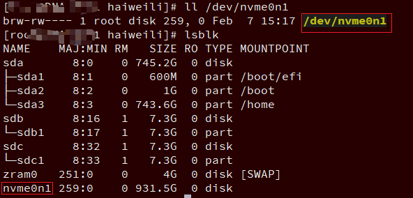

<!-- @import "[TOC]" {cmd="toc" depthFrom=1 depthTo=6 orderedList=false} -->

<!-- code_chunk_output -->

- [1. 创建 NVMe 块设备](#1-创建-nvme-块设备)
  - [1.1. PCI Bus 的识别](#11-pci-bus-的识别)
  - [1.2. NVMe 驱动加载](#12-nvme-驱动加载)
  - [1.3. PCI 总线枚举](#13-pci-总线枚举)
  - [1.4. 热插拔](#14-热插拔)
  - [1.5. 核心流程](#15-核心流程)
  - [1.6. nvme 数据结构](#16-nvme-数据结构)
  - [1.7. nvme_probe](#17-nvme_probe)
    - [1.7.1. nvme_max_io_queues](#171-nvme_max_io_queues)
    - [1.7.2. nvme_dev_map](#172-nvme_dev_map)
    - [1.7.3. nvme_setup_prp_pools](#173-nvme_setup_prp_pools)
    - [1.7.4. nvme_init_ctrl](#174-nvme_init_ctrl)
      - [1.7.4.1. IDA](#1741-ida)
    - [1.7.5. nvme_reset_ctrl](#175-nvme_reset_ctrl)
  - [1.8. nvme_reset_work](#18-nvme_reset_work)
    - [1.8.1. nvme_pci_configure_admin_queue](#181-nvme_pci_configure_admin_queue)
    - [1.8.2. nvme_setup_io_queues](#182-nvme_setup_io_queues)
      - [1.8.2.1. nvme_set_queue_count](#1821-nvme_set_queue_count)
      - [1.8.2.2. nvme_setup_irqs](#1822-nvme_setup_irqs)
      - [1.8.2.3. nvme_create_io_queues](#1823-nvme_create_io_queues)
  - [1.9. 核心实现分析](#19-核心实现分析)

<!-- /code_chunk_output -->

NVMe 本身是一个块设备, 因此 NVMe 的驱动也是遵循块设备的驱动架构. 本文通过两部分介绍 NVMe 的驱动程序, 一部分是操作系统如何创建 NVMe 块设备, 另外一部分是分析一下 NVMe 的主要流程, 包括读写流程和管理流程等.

# 1. 创建 NVMe 块设备

对于 Linux 的**块设备**来说, 其主要的是通过 `device_add_disk` 或者 `add_disk` 函数(后者是对前者的简单包装)来向操作系统**添加一个设备实例**. 其基本原理就是通过调用该函数, 就会创建在 `/dev` 目录下看到的类似 **sdX** 的块设备.

NVMe 本身也是块设备, 自然也不会跳出这个大框架.

首先从**硬件层面**上, **任何设备**必须通过**某个总线与 CPU 相连接**, NVMe 则正是通过 **PCIe 总线与 CPU 相连**.


当然, 目前 NVMe 除了可以通过 PCIe 总线与 CPU 相连外, 还可以通过**其它通道**连接, 比如**FC**或者**IB**. 后者则是一种将 NVMe 设备从计算节点独立出来的方式, 也就是此时 **NVMe** 就**不再是一个卡设备**, 而是一个**独立机箱的设备**. 无论何种方式相连接, 其本质是一样等.

然后是**操作系统**软件层面. 硬件的连通性是基础, 当硬件已经连通后, 就可以在 Linux 内核层面**发现设备**, 并**进行初始化**了. 软件层面的初始化有**两种情况**:

* 一种是计算机**启动的时候**, 操作系统会**扫描总线上的设备**, 并完成**初始化**;
* 另外一种情况是设备在**系统启动后连接的**, 此时需要**手动触发扫描**的过程.

与其它块设备类似, NVMe 设备初始化完成后会在 `/dev` 目录下出现一个文件. NVMe 设备会出现一个形如 nvmeXnY 的设备文件. 如图所示, 红色方框中的为一个 NVMe 块设备.



## 1.1. PCI Bus 的识别

那问题来了, PCI Bus 是怎么将 nvme driver 匹配到对应的 NVMe 设备的呢?

系统启动时, BIOS 会枚举整个 PCI Bus, 之后将扫描到的设备通过 ACPI tables 传给操作系统. 当操作系统加载时, PCI Bus 驱动则会根据此信息读取各个 PCI 设备的 Header Config 空间, 从 **class code 寄存器**获得一个特征值. class code 就是 **PCI bus** 用来选择**哪个驱动**加载设备的唯一根据. `PCI Code and ID Assignment Specification` 定义 NVMe 设备的 Class code=0x010802h.

在 `struct pci_driver nvme_driver` 中就定义了 `id_table = nvme_id_table`:

```cpp
// include/linux/mod_devicetable.h
struct pci_device_id {
	__u32 vendor, device;		/* Vendor and device ID or PCI_ANY_ID*/
	__u32 subvendor, subdevice;	/* Subsystem ID's or PCI_ANY_ID */
	__u32 class, class_mask;	/* (class,subclass,prog-if) triplet */
	kernel_ulong_t driver_data;	/* Data private to the driver */
	__u32 override_only;
};

// include/linux/pci.h
// class 和 class_mask 都是 0
#define PCI_VDEVICE(vend, dev) \
	.vendor = PCI_VENDOR_ID_##vend, .device = (dev), \
	.subvendor = PCI_ANY_ID, .subdevice = PCI_ANY_ID, 0, 0

#define PCI_DEVICE_CLASS(dev_class,dev_class_mask) \
	.class = (dev_class), .class_mask = (dev_class_mask), \
	.vendor = PCI_ANY_ID, .device = PCI_ANY_ID, \
	.subvendor = PCI_ANY_ID, .subdevice = PCI_ANY_ID

// include/linux/pci_ids.h
// class code
#define PCI_CLASS_STORAGE_EXPRESS      0x010802

// drivers/nvme/host/pci.c
static const struct pci_device_id nvme_id_table[] = {
    // 这个并没有 class code
	{ PCI_VDEVICE(INTEL, 0x0953),	/* Intel 750/P3500/P3600/P3700 */
		.driver_data = NVME_QUIRK_STRIPE_SIZE |
				NVME_QUIRK_DEALLOCATE_ZEROES, },
    ......
	{ PCI_DEVICE_CLASS(PCI_CLASS_STORAGE_EXPRESS, 0xffffff) },
	{ 0, }
};
MODULE_DEVICE_TABLE(pci, nvme_id_table);
```

`pci_match_device(struct pci_driver *drv, struct pci_dev *dev)` 函数提供给一个 driver, 用来判断一个 PCI 设备是否被它支持.

```cpp
// drivers/pci/pci-driver.c
static const struct pci_device_id *pci_match_device(struct pci_driver *drv,
						    struct pci_dev *dev)
{
	struct pci_dynid *dynid;
	const struct pci_device_id *found_id = NULL, *ids;

	/* When driver_override is set, only bind to the matching driver */
    // 如果该设备只绑定到指定驱动, 并且, 不是指定的驱动
    // 则返回 NULL
	if (dev->driver_override && strcmp(dev->driver_override, drv->name))
		return NULL;

	/* Look at the dynamic ids first, before the static ones */
	spin_lock(&drv->dynids.lock);
    // 遍历驱动中动态 id(dynids),找到则返回 id;动态 id 就是 sysfs 中的 new_id 文件内容
	list_for_each_entry(dynid, &drv->dynids.list, node) {
		if (pci_match_one_device(&dynid->id, dev)) {
			found_id = &dynid->id;
			break;
		}
	}
	spin_unlock(&drv->dynids.lock);

	if (found_id)
		return found_id;
    // 遍历静态 id(NVMe 驱动中的 id_table 表)
	for (ids = drv->id_table; (found_id = pci_match_id(ids, dev));
	     ids = found_id + 1) {
		/*
		 * The match table is split based on driver_override.
		 * In case override_only was set, enforce driver_override
		 * matching.
		 */
		if (found_id->override_only) {
			if (dev->driver_override)
				return found_id;
		} else {
			return found_id;
		}
	}

	/* driver_override will always match, send a dummy id */
    // 设备的 driver_override 已经设置, 并且, 设备指定的驱动等于传入的参数
    // 但是在驱动的支持列表中又没找到
    // 仍然返回一个 pci_device_id_any
	if (dev->driver_override)
		return &pci_device_id_any;
	return NULL;
}

const struct pci_device_id *pci_match_id(const struct pci_device_id *ids,
					 struct pci_dev *dev)
{
	if (ids) {
		while (ids->vendor || ids->subvendor || ids->class_mask) {
			if (pci_match_one_device(ids, dev))
				return ids;
			ids++;
		}
	}
	return NULL;
}
```

可以看到 `pci_match_one_device` 是关键

```cpp
//
static inline const struct pci_device_id *
pci_match_one_device(const struct pci_device_id *id, const struct pci_dev *dev)
{
    // vendor ID 任意 或者 相等, 并且
    // device ID 任意 或者 相等, 并且
    // subsystem vendor ID 任意 或者 相等, 并且
    // subsystem device ID 任意 或者 相等, 并且
    // class code
	if ((id->vendor == PCI_ANY_ID || id->vendor == dev->vendor) &&
	    (id->device == PCI_ANY_ID || id->device == dev->device) &&
	    (id->subvendor == PCI_ANY_ID || id->subvendor == dev->subsystem_vendor) &&
	    (id->subdevice == PCI_ANY_ID || id->subdevice == dev->subsystem_device) &&
	    !((id->class ^ dev->class) & id->class_mask))
		return id;
	return NULL;
}
```

这里注意的是 `pci_device_id` 中 **class** 和 **classmask** 合计 **32 位**, 实际有效的是 **class** 的 **16 位**, 另外 16 位是为了掩盖 `pci_device` 中 32 位 class 中无效的 16 位.

`pci_register_driver()` 函数(nvme 驱动加载)将 `nvme_driver` 注册到了 `PCI Bus`, 所以 PCI Bus 就明白了这个驱动是给 NVMe 设备(Class code=0x010802h)用的.

## 1.2. NVMe 驱动加载

> nvme 驱动加载见上篇

在 NVMe 驱动加载中(系统启动), 如果总线支持自动 probe 设备(`/sys/bus/pci/drivers_autoprobe`, PCI 总线是支持的), 则会调用 `driver_attach(struct device_driver *drv)`函数

> `driver_attach(struct device_driver *drv)` 是一个全局方法, 也就是其他驱动都可以调用, 会遍历**该驱动**的所有设备, 并尝试将设备绑定到驱动上, 即实现设备的 probe.

`driver_attach()` 会调用 `bus_for_each_dev` **遍历该总线**(`drv->bus(pci_bus_type)`)上**所有设备**, 调用 `__driver_attach` **将设备绑定到该驱动上**.

```cpp
// drivers/base/dd.c
static int __driver_attach(struct device *dev, void *data)
{
	struct device_driver *drv = data;
	bool async = false;
	int ret;

	/*
	 * Lock device and try to bind to it. We drop the error
	 * here and always return 0, because we need to keep trying
	 * to bind to devices and some drivers will return an error
	 * simply if it didn't support the device.
	 *
	 * driver_probe_device() will spit a warning if there
	 * is an error.
	 */
    // 检查这个 device 是否匹配这个驱动
	ret = driver_match_device(drv, dev);
	if (ret == 0) {
		/* no match */
		return 0;
	} else if (ret == -EPROBE_DEFER) {
		dev_dbg(dev, "Device match requests probe deferral\n");
		dev->can_match = true;
		driver_deferred_probe_add(dev);
		/*
		 * Driver could not match with device, but may match with
		 * another device on the bus.
		 */
		return 0;
	} else if (ret < 0) {
		dev_dbg(dev, "Bus failed to match device: %d\n", ret);
		return ret;
	} /* ret > 0 means positive match */

    // 驱动支持异步 probe
    // driver 的 probe_type 属性或者内核启动参数 driver_async_probe=drv_name1,drv_name2,...
	if (driver_allows_async_probing(drv)) {
		/*
		 * Instead of probing the device synchronously we will
		 * probe it asynchronously to allow for more parallelism.
		 *
		 * We only take the device lock here in order to guarantee
		 * that the dev->driver and async_driver fields are protected
		 */
		dev_dbg(dev, "probing driver %s asynchronously\n", drv->name);
		device_lock(dev);
		if (!dev->driver && !dev->p->async_driver) {
			get_device(dev);
			dev->p->async_driver = drv;
			async = true;
		}
		device_unlock(dev);
		if (async)
			async_schedule_dev(__driver_attach_async_helper, dev);
		return 0;
	}

	__device_driver_lock(dev, dev->parent);
    // 走到这里, 表明设备和驱动是匹配的
    // 将设备和驱动绑定, 也就是设备的 probe
	driver_probe_device(drv, dev);
	__device_driver_unlock(dev, dev->parent);

	return 0;
}
```

该函数其先调用 `driver_match_device`, 其调用**总线**(`struct bus_type pci_bus_type`)的 **match** 函数, **pci 总线**的就是函数 `pci_bus_match`. 用来检查一个 pci device 在 pci driver 中是否有一个匹配的 `struct pci_device_id`.

```cpp
// drivers/pci/pci-driver.c
static int pci_bus_match(struct device *dev, struct device_driver *drv)
{
    // 属于 pci 设备
    // struct device 转换成 struct pci_dev
	struct pci_dev *pci_dev = to_pci_dev(dev);
    // pci 设备自然使用 pci 驱动
	struct pci_driver *pci_drv;
	const struct pci_device_id *found_id;
    // 该设备已经和驱动匹配, 直接返回
	if (!pci_dev->match_driver)
		return 0;
    // 通用结构体 device_driver 转换成 pci_driver
	pci_drv = to_pci_driver(drv);
    // pci driver 检查一个 pci 设备是否在它支持的列表中 或 在动态 id 列表
    // 返回 id
	found_id = pci_match_device(pci_drv, pci_dev);
	if (found_id)
		return 1;

	return 0;
}
```

如果**设备还没有和驱动匹配**, 则调用 `pci_match_device` 判断 `pci_dev` **设备**是否被 `pci_drv` **驱动**支持.

回到 `__driver_attach`, 如果执行 `driver_match_device` 出错, 并且返回错误是 `-EPROBE_DEFER`, 则需要调用 `driver_deferred_probe_add`, 来**将设备**通过 `dev->p->deferred_probe` 添加到 `deferred_probe_pending_list` **推迟 probe 的 pending 链表**中, 并正常返回, 表明**驱动不匹配这个设备**, 但是驱动**可能匹配总线上的其他设备**.

继续, 当**设备和驱动是匹配的**(没有匹配直接返回), 调用 `driver_probe_device`(调用该函数需要先获取设备锁), 该函数负责**将设备和驱动绑定**. 函数先**判断设备** `dev->kobj.state_in_sysfs` **是否已经有 sysfs 节点**(没有直接返回), 然后调用 `really_probe`(这里其实还会涉及 linux 电源管理的动作, 此处为了简化问题暂时不展开).

`really_probe` 函数中:

1. 设置 `dev->driver = drv`, **设置设备的驱动**;

2. 在 **driver** 的 sysfs 节点目录下添加一个 **device_name 链接**; 在 **device** 的 sysfs 节点目录下添加名为 "driver" 链接; 如果 `CONFIG_DEV_COREDUMP` **使能**并且驱动有 coredump 功能, 则在 device 的 sysfs 目录下创建一个 coredump 文件

```
# ll /sys/bus/pci/drivers/nvme/
lrwxrwxrwx 1 root root    0 Feb  8 01:56 0000:04:00.0 -> ../../../../devices/pci0000:00/0000:00:11.0/0000:04:00.0

# ll /sys/bus/pci/drivers/nvme/0000\:04\:00.0/
lrwxrwxrwx 1 root root     0 Feb  7 15:17 driver -> ../../../../bus/pci/drivers/nvme
```

3. **调用总线**的 `probe` 函数, 如果总线没有 `probe` 函数, 则调用**设备驱动**的 `probe` 函数

```cpp
// drivers/pci/pci-driver.c
// pci 总线的 ops
struct bus_type pci_bus_type = {
    .probe       = pci_device_probe,
}

// drivers/nvme/host/pci.c
// nvme 驱动的 ops
static struct pci_driver nvme_driver = {
    .probe       = nvme_probe,
}
```

4. 同时会调用 `driver_bound` 函数, 将**设备**也绑定到**驱动相关链表**中


## 1.3. PCI 总线枚举

否则 NVMe 驱动加载只是能找到 PCI Bus 上面驱动与 NVMe 设备的对应关系. nvme_init 执行完毕后, nvme 驱动就啥事不做了, 直到 pci 总线枚举出了这个 nvme 设备, 就开始调用 `nvme_probe()` 函数开始干活.

PCI bus 上就多了一个 `pci_driver nvme_driver`. 当读到一个设备的 class code 是 010802h 时, 就会调用这个 nvme_driver 结构体的 probe 函数, 也就是说当设备和驱动匹配了之后, 驱动的 probe 函数就会被调用, 来实现驱动的加载.

## 1.4. 热插拔

当 nvme.ko 已经加载完了(注册了 nvme driver), 这时候如果有 nvme 盘插入 pcie 插槽, **pci** 会**自动识别**到, 并交给 nvme driver 去处理, 而 **nvme driver** 就是调用 `nvme_probe` 去处理这个新加入的设备.

## 1.5. 核心流程

无论是**系统启动**也好, 还是**手动触发扫描**也好, NVMe 发现设备的核心流程是一样的.


## 1.6. nvme 数据结构

在说 nvme_probe 之前, 先说一下 nvme 设备的数据结构, 首先, 内核使用一个 `nvme_dev` **结构体**来描述一个 nvme 设备, **每一个 nvme_dev** 都是**一个 PCI function**, nvme_dev 如下:

```cpp
// drivers/nvme/host/pci.c
struct nvme_dev {
    // 设备的 queue,一个 nvme 设备至少有 2 个 queue,一个 admin queue,一个 io queue
    // 实际情况一般都是一个 admin queue,多个 io queue,并且 io queue 会与 CPU 做绑定
    // 若干对 SQ&CQ 的指针数组,数组大小即 SQ&CQ 的对数
    // 其取决于 cpu 个数, 即相当于这里的分配方式一个 cpu 一对 SQ&CQ,所以默认是 cpus 数目+1 个
	struct nvme_queue *queues;
	struct blk_mq_tag_set tagset;
	struct blk_mq_tag_set admin_tagset;
    // ((void __iomem *)dev->bar) + 4096
	u32 __iomem *dbs;
    // 此 nvme 设备对应的 struct device,
	struct device *dev;
    // dma 池,主要是以 4k 为大小的 dma 块,用于 dma 分配
	struct dma_pool *prp_page_pool;
    // 也是 dma 池,但是不是以 4k 为大小的,是小于 4k 时使用
	struct dma_pool *prp_small_pool;
    // 在线可以使用的 queue 数量,跟 online cpu 有关
	unsigned online_queues;
    // 最大的 queue id
	unsigned max_qid;
    // unsigned short 的数组,每个 CPU 占一个,主要用于存放 CPU 上绑定的 io queue 的 qid,一个 CPU 绑定一个 queue,一个 queue 绑定到 1 到多个 CPU 上
	unsigned io_queues[HCTX_MAX_TYPES];
	unsigned int num_vecs;
    // nvme queue 支持的最大 cmd 数量,为((bar->cap) & 0xffff)或者 1024 的最小值
	u32 q_depth;
	int io_sqes;
    // 1 << (((bar->cap) >> 32) & 0xf),应该是每个 io queue 占用的 bar 空间
	u32 db_stride;
    // bar 的映射地址, 默认是映射 8192 字节, 当 io queue 过多时, 有可能会大于 8192
	void __iomem *bar;
    // bar 空间映射的大小
	unsigned long bar_mapped_size;
	struct work_struct remove_work;
	struct mutex shutdown_lock;
	bool subsystem;
	u64 cmb_size;
	bool cmb_use_sqes;
	u32 cmbsz;
	u32 cmbloc;
	struct nvme_ctrl ctrl;
	u32 last_ps;
	bool hmb;

	mempool_t *iod_mempool;

	/* shadow doorbell buffer support: */
    //
	u32 *dbbuf_dbs;
	dma_addr_t dbbuf_dbs_dma_addr;
	u32 *dbbuf_eis;
	dma_addr_t dbbuf_eis_dma_addr;

	/* host memory buffer support: */
	u64 host_mem_size;
	u32 nr_host_mem_descs;
	dma_addr_t host_mem_descs_dma;
	struct nvme_host_mem_buf_desc *host_mem_descs;
	void **host_mem_desc_bufs;
    // 分配的 queue 数目
    // 一共(cpus 数目+nr_write_queues+nr_poll_queues+1)对
	unsigned int nr_allocated_queues;
    // write_queue 的数量, 默认 0
	unsigned int nr_write_queues;
    // poll 模式的 queue 数量, 默认 0
	unsigned int nr_poll_queues;

	bool attrs_added;
};

// 控制 nvme 相关结体
struct nvme_ctrl {
	bool comp_seen;
	enum nvme_ctrl_state state;
	bool identified;
	spinlock_t lock;
	struct mutex scan_lock;
	const struct nvme_ctrl_ops *ops;
    //
	struct request_queue *admin_q;
	struct request_queue *connect_q;
	struct request_queue *fabrics_q;
	struct device *dev;
    // 实例的 id,第一个加入的 nvme dev,它的 instance 为 0,第二个加入的 nvme,instance 为 1,也用于做/dev/nvme%d 的显示,%d 实际就是 instance 的数值
	int instance;
	int numa_node;
	struct blk_mq_tag_set *tagset;
	struct blk_mq_tag_set *admin_tagset;
    // 其实就是块设备,一张 nvme 卡有可能会有多个块设备
	struct list_head namespaces;
	struct rw_semaphore namespaces_rwsem;
	struct device ctrl_device;
    // 字符设备
	struct device *device;	/* char device */
#ifdef CONFIG_NVME_HWMON
	struct device *hwmon_device;
#endif
	struct cdev cdev;
	struct work_struct reset_work;
	struct work_struct delete_work;
	wait_queue_head_t state_wq;

	struct nvme_subsystem *subsys;
	struct list_head subsys_entry;

	struct opal_dev *opal_dev;
    // 这个 nvme 设备的名字,为 nvme%d
	char name[12];
	u16 cntlid;

    /*    初始化设置的值
     *    dev->ctrl_config = NVME_CC_ENABLE | NVME_CC_CSS_NVM;
     *    dev->ctrl_config |= (PAGE_SHIFT - 12) << NVME_CC_MPS_SHIFT;
     *    dev->ctrl_config |= NVME_CC_ARB_RR | NVME_CC_SHN_NONE;
     *    dev->ctrl_config |= NVME_CC_IOSQES | NVME_CC_IOCQES;
     */
	u32 ctrl_config;
	u16 mtfa;
    // 一共多少对 queue
	u32 queue_count;

	u64 cap;
	u32 max_hw_sectors;
	u32 max_segments;
	u32 max_integrity_segments;
	u32 max_discard_sectors;
	u32 max_discard_segments;
	u32 max_zeroes_sectors;
#ifdef CONFIG_BLK_DEV_ZONED
	u32 max_zone_append;
#endif
	u16 crdt[3];
	u16 oncs;
	u32 dmrsl;
	u16 oacs;
	u16 sqsize;
	u32 max_namespaces;
	atomic_t abort_limit;
	u8 vwc;
	u32 vs;
	u32 sgls;
	u16 kas;
	u8 npss;
	u8 apsta;
	u16 wctemp;
	u16 cctemp;
	u32 oaes;
	u32 aen_result;
	u32 ctratt;
	unsigned int shutdown_timeout;
	unsigned int kato;
	bool subsystem;
	unsigned long quirks;
	struct nvme_id_power_state psd[32];
	struct nvme_effects_log *effects;
	struct xarray cels;
	struct work_struct scan_work;
	struct work_struct async_event_work;
	struct delayed_work ka_work;
	struct delayed_work failfast_work;
	struct nvme_command ka_cmd;
	struct work_struct fw_act_work;
	unsigned long events;

	/* Power saving configuration */
	u64 ps_max_latency_us;
	bool apst_enabled;

	/* PCIe only: */
	u32 hmpre;
	u32 hmmin;
	u32 hmminds;
	u16 hmmaxd;

	/* Fabrics only */
	u32 ioccsz;
	u32 iorcsz;
	u16 icdoff;
	u16 maxcmd;
	int nr_reconnects;
	unsigned long flags;
	struct nvmf_ctrl_options *opts;

	struct page *discard_page;
	unsigned long discard_page_busy;

	struct nvme_fault_inject fault_inject;

	enum nvme_ctrl_type cntrltype;
	enum nvme_dctype dctype;
};


/* nvme 设备描述符,描述一个 nvme 设备 */
struct nvme_dev {
    struct list_head node;
    /* 设备的 queue,一个 nvme 设备至少有 2 个 queue,一个 admin queue,一个 io queue,实际情况一般都是一个 admin queue,多个 io queue,并且 io queue 会与 CPU 做绑定 */
    struct nvme_queue __rcu **queues;
    /* unsigned short 的数组, 每个 CPU 占一个,主要用于存放 CPU 上绑定的 io queue 的 qid,一个 CPU 绑定一个 queues,一个 queues 绑定到 1 到多个 CPU 上 */
    unsigned short __percpu *io_queue;
    /* ((void __iomem *)dev->bar) + 4096 */
    u32 __iomem *dbs;
    /* 此 nvme 设备对应的 pci dev */
    struct pci_dev *pci_dev;
    /* dma 池,主要是以 4k 为大小的 dma 块,用于 dma 分配 */
    struct dma_pool *prp_page_pool;
    /* 也是 dma 池,但是不是以 4k 为大小的,是小于 4k 时使用 */
    struct dma_pool *prp_small_pool;
    /* 实例的 id,第一个加入的 nvme dev,它的 instance 为 0,第二个加入的 nvme,instance 为 1,也用于做/dev/nvme%d 的显示,%d 实际就是 instance 的数值 */
    int instance;
    /* queue 的数量, 等于 admin queue + io queue */
    unsigned queue_count;
    /* 在线可以使用的 queue 数量,跟 online cpu 有关 */
    unsigned online_queues;
    /* 最大的 queue id */
    unsigned max_qid;
    /* nvme queue 支持的最大 cmd 数量, 为((bar->cap) & 0xffff)或者 1024 的最小值 */
    int q_depth;
    /* 1 << (((bar->cap) >> 32) & 0xf), 应该是每个 io queue 占用的 bar 空间 */
    u32 db_stride;
    /*    初始化设置的值
     *    dev->ctrl_config = NVME_CC_ENABLE | NVME_CC_CSS_NVM;
     *    dev->ctrl_config |= (PAGE_SHIFT - 12) << NVME_CC_MPS_SHIFT;
     *    dev->ctrl_config |= NVME_CC_ARB_RR | NVME_CC_SHN_NONE;
     *    dev->ctrl_config |= NVME_CC_IOSQES | NVME_CC_IOCQES;
     */
    u32 ctrl_config;
    /* msix 中断所使用的 entry,指针表示会使用多个 msix 中断,使用的中断的个数与 io queue 对等,多少个 io queue 就会申请多少个中断
     * 并且让每个 io queue 的中断尽量分到不同的 CPU 上运行
     */
    struct msix_entry *entry;
    /* bar 的映射地址, 默认是映射 8192, 当 io queue 过多时, 有可能会大于 8192 */
    struct nvme_bar __iomem *bar;
    /* 其实就是块设备,一张 nvme 卡有可能会有多个块设备 */
    struct list_head namespaces;
    /* 对应的在/sys 下的结构 */
    struct kref kref;
    /* 对应的字符设备,用于 ioctl 操作 */
    struct miscdevice miscdev;
    /* 2 个 work,暂时还不知道什么用 */
    work_func_t reset_workfn;
    struct work_struct reset_work;
    struct work_struct cpu_work;
    /* 这个 nvme 设备的名字,为 nvme%d */
    char name[12];
    /* SN 号 */
    char serial[20];
    char model[40];
    char firmware_rev[8];
    /* 这些值都是从 nvme 盘上获取 */
    u32 max_hw_sectors;
    u32 stripe_size;
    u16 oncs;
    u16 abort_limit;
    u8 vwc;
    u8 initialized;
};
```

在 `nvme_dev` 结构中, 最重要的数据就是 `struct nvme_queue`, 用来表示一个 nvme 的 queue, **每一个** `nvme_queue` 会申请**自己的中断**, 也有**自己的中断处理函数**, 也就是**每个 nvme_queue** 在**驱动层面**是**完全独立的**. nvme_queue 有两种, 一种是 admin queue,一种是 io queue, 这两种 queue 都用 `struct nvme_queue` 来描述,而这两种 queue 的区别如下:

* admin queue: 用于发送控制命令的 queue, 所有非 io 命令都会通过此 queue 发送给 nvme 设备,一个 nvme 设备只有一个 admin queue,在 nvme_dev 中,使用 queues[0] 来描述.
* io queue: 用于发送 io 命令的 queue,所有 io 命令都是通过此 queue 发送给 nvme 设备,简单来说读/写操作都是通过 io queue 发送给 nvme 设备的,一个 nvme 设备有一个或多个 io queue,每个 io queue 的中断会绑定到不同的一个或多个 CPU 上. 在 nvme_dev 中,使用 queues[1~N]来描述.

以上说的 io 命令和非 io 命令都是 nvme 命令, 比如**块层**下发一个**写 request**, **nvme 驱动**就会根据此 request 构造出一个**写命令**, 将这个写命令放入**某个 io queue**中, 当 controller 完成了这个写命令后, 会通过此 io queue 的**中断**返回完成信息, 驱动再将此完成信息返回给块层. 明白了两种队列的作用, 我们看看具体的数据结构 `struct nvme_queue`

```cpp
// drivers/nvme/host/pci.c
// nvme 的命令队列, 其中包括 sq 和 cq. 一个 nvme 设备至少包含两个命令队列
// 一个是控制命令队列, 一个是 IO 命令队列
struct nvme_queue {
    // 所属的 nvme_dev
	struct nvme_dev *dev;
    // queue 的锁
	spinlock_t sq_lock;
    // sq 的虚拟地址空间, 主机需要发给设备的命令就存在这里面
	void *sq_cmds;
	 /* only used for poll queues: */
    // cq poll queue 的锁
	spinlock_t cq_poll_lock ____cacheline_aligned_in_smp;
    // cq 的虚拟地址空间, 设备返回的命令就存在这里面
	struct nvme_completion *cqes;
    // 实际就是 sq_cmds 的 dma 地址
	dma_addr_t sq_dma_addr;
    // cq 的 dma 地址, 实际就是 cqes 对应的 dma 地址, 用于 dma 传输
	dma_addr_t cq_dma_addr;
    // 当前 sq_tail 位置, 是 nvme 设备上的一个寄存器, 告知设备最新的发送命令存在哪, 存在于 bar 空间中
	u32 __iomem *q_db;
    // cq 和 sq 最大能够存放的 command 数量
	u32 q_depth;
    // 如果是 admin queue, 那么为 0, 之后的 io queue 按分配顺序依次增加, 主要用于获取对应的 irq entry, 因为所有的 queue 的 irq entry 是一个数组
	u16 cq_vector;
    // 当有新的命令存放到 sq 时, sq_tail++, 如果 sq_tail == q_depth,
    // 那么 sq_tail 会被重新设置为 0, 并且 cq_phase 翻转, 实际上就是一个环
	u16 sq_tail;
	u16 last_sq_tail;
    // 驱动已经处理完成的 cmd 位置,当 cq_head == sq_tail 时,表示 cmd 队列为空,当 sq_tail == cq_head - 1 时表示 cmd 队列已满
	u16 cq_head;
    // 此 nvme queue 在此 nvme 设备中的 queue id
    // 0: 控制命令队列
	u16 qid;
    // 初始设为 1, 主要用于判断命令是否完成, 当 cqe.status & 1 != cq_phase 时, 表示命令还没有完成
    // 当每次 sq_tail == q_depth 时,此值会取反
	u8 cq_phase;
	u8 sqes;
	unsigned long flags;
#define NVMEQ_ENABLED		0
#define NVMEQ_SQ_CMB		1
#define NVMEQ_DELETE_ERROR	2
#define NVMEQ_POLLED		3
	u32 *dbbuf_sq_db;
	u32 *dbbuf_cq_db;
	u32 *dbbuf_sq_ei;
	u32 *dbbuf_cq_ei;
	struct completion delete_done;
};
```

nvme_queue 是 nvme 驱动最核心的数据结构, 它是 nvme 驱动和 nvme 设备通信的桥梁, 重点也要围绕 nvme_queue 来说, 之前也说过, 一个 nvme 设备有多个 nvme_queue(一个 admin queue,至少一个 io queue), 每个 nvme_queue 是独立的, 它们有

* 自己对应的中断(irq)

* 自己的 submission queue(sq), 用于将 struct nvme command 发送给 nvme 设备, 并且最多能存 dev->d_depth 个 nvme command

* 自己的 completion queue(cq), 用于 nvme 设备将完成的命令信息(struct nvme_completion)发送给 host, 并且最多能存 dev->d_depth 个 nvme_completion.

* 自己的 cmdinfo, 用于描述一个 nvme command. (struct nvme_cmd_info)

可以把 sq 想象成一个 `struct nvme_command sq[dev->d_depth]` 的数组, 而 cq 为 `struct nvme_completion cq[dev->d_depth]` 的数组.

struct nvme_command 主要用于存储一个 nvme 命令, 包括 io 命令, 或者控制命令, 当初始化好一个 struct nvme_command 后, 直接将其下发给 nvme 设备, nvme 设备就会根据它来执行对应操作, 其结构如下:


## 1.7. nvme_probe

初始化 nvme 设备.

```cpp
// drivers/nvme/host/pci.c
static int nvme_probe(struct pci_dev *pdev, const struct pci_device_id *id)
{
	int node, result = -ENOMEM;
    // nvme 设备描述符
	struct nvme_dev *dev;
	unsigned long quirks = id->driver_data;
	size_t alloc_size;
    // 当前 pci_dev 所在的 numa node id
    // /sys/devices/pci0000\:00/0000\:00\:11.0/0000\:04\:00.0/numa_node
	node = dev_to_node(&pdev->dev);
	if (node == NUMA_NO_NODE)
        // 如果没有的话, 默认用 first_memory_node, 也就是第一个 numa 节点
		set_dev_node(&pdev->dev, first_memory_node);
    // 从当前 numa 节点上分配数据结构内存
    // 问题: 如果是 NUMA_NO_NODE, 应该从 first_memory_node 分配??
	dev = kzalloc_node(sizeof(*dev), GFP_KERNEL, node);
	if (!dev)
		return -ENOMEM;
    // write_queues 和 poll_queues 都是模块参数
    // /sys/module/nvme/parameters/write_queues
    // /sys/module/nvme/parameters/poll_queues
    // 如果 write_queues 没有设置, 则 read 和 write 共享
    // 默认这两个都是没有设置的, 即 0
	dev->nr_write_queues = write_queues;
	dev->nr_poll_queues = poll_queues;
    // 这里是默认值(cpus 数目+1), 加 1 是因为有 admin queue
	dev->nr_allocated_queues = nvme_max_io_queues(dev) + 1;
    // 从当前 numa 节点上分配内存, 分配 queues, 就是 nr_allocated_queues 个
    // 每个 cpu 有一个 io queue, 所有 cpu 共享一个 admin queue
    // 若干对 SQ&CQ 的指针数组,数组大小即 SQ&CQ 的对数, 一个 cpu 一对 SQ&CQ, 再加一个 admin queue
	dev->queues = kcalloc_node(dev->nr_allocated_queues,
			sizeof(struct nvme_queue), GFP_KERNEL, node);
	if (!dev->queues)
		goto free;
    // nvme_dev 对应的 struct device, 增加 struct device 的引用计数
	dev->dev = get_device(&pdev->dev);
    // 设置 pci_dev->dev(struct device)->driver_data 等于当前 nvme_dev
    // 结合上一行从而打通了 struct nvme_dev,struct pci_dev 和 struct device
	pci_set_drvdata(pdev, dev);
    // 主要进行 bar 空间的映射, 获得 bar 的虚拟地址
	result = nvme_dev_map(dev);
	if (result)
		goto put_pci;
    // 初始化两个 work 变量
	INIT_WORK(&dev->ctrl.reset_work, nvme_reset_work);
	INIT_WORK(&dev->remove_work, nvme_remove_dead_ctrl_work);
    // 初始化互斥锁
	mutex_init(&dev->shutdown_lock);
    // 设置 DMA 需要的 PRP 内存池, 方便后面的 DMA 操作
    // 要创建两个 dma pool, 一个是 4k 大小(prp list page), 一个是 256B 大小(prp list 256)
	result = nvme_setup_prp_pools(dev);
	if (result)
		goto unmap;

	quirks |= check_vendor_combination_bug(pdev);

	if (!noacpi && acpi_storage_d3(&pdev->dev)) {
		/*
		 * Some systems use a bios work around to ask for D3 on
		 * platforms that support kernel managed suspend.
		 */
		dev_info(&pdev->dev,
			 "platform quirk: setting simple suspend\n");
		quirks |= NVME_QUIRK_SIMPLE_SUSPEND;
	}

	/*
	 * Double check that our mempool alloc size will cover the biggest
	 * command we support.
	 */
	alloc_size = nvme_pci_iod_alloc_size();
	WARN_ON_ONCE(alloc_size > PAGE_SIZE);

	dev->iod_mempool = mempool_create_node(1, mempool_kmalloc,
						mempool_kfree,
						(void *) alloc_size,
						GFP_KERNEL, node);
	if (!dev->iod_mempool) {
		result = -ENOMEM;
		goto release_pools;
	}
    // 初始化 NVMe Controller 结构体,创建字符设备
	result = nvme_init_ctrl(&dev->ctrl, &pdev->dev, &nvme_pci_ctrl_ops,
			quirks);
	if (result)
		goto release_mempool;
    // 打印日志
	dev_info(dev->ctrl.device, "pci function %s\n", dev_name(&pdev->dev));
    // 重置 nvme controller
    // 修改 nvme_ctrl 结构体状态, 将 nvme_reset_work 加入工作队列 nvme_reset_wq
	nvme_reset_ctrl(&dev->ctrl);
	async_schedule(nvme_async_probe, dev);

	return 0;
}
```

### 1.7.1. nvme_max_io_queues

`nvme_max_io_queues()` 获取 nvme 的最大 io_queues, 如下. 也就说 `poll_queue` 和 `write_queue` 是单独算的(why?):

```cpp
// drivers/nvme/host/pci.c
static unsigned int nvme_max_io_queues(struct nvme_dev *dev)
{
    // 总的 cpu 数目(包括 offline 的) +
    // write_queues +
    // poll_queue
	return num_possible_cpus() + dev->nr_write_queues + dev->nr_poll_queues;
}
```

### 1.7.2. nvme_dev_map

`nvme_dev_map(struct nvme_dev *dev)` 主要将 nvme 设备 bar 空间的映射.

主要做 bar 空间的映射, 映射地址存放到 nvme_dev->bar, 并且从 bar 空间获取 nvme 设备的 d_queue, d_queue 是 queue 中允许的最大 cmd 数量

```cpp
// include/linux/nvme.h
enum {

	NVME_REG_DBS	= 0x1000,	/* SQ 0 Tail Doorbell, 4096 */
};

// drivers/nvme/host/pci.c
static int nvme_dev_map(struct nvme_dev *dev)
{
    // 转成 pci_dev
	struct pci_dev *pdev = to_pci_dev(dev->dev);
    // 获取 bar 空间并 reserve,以防被其他人使用
	if (pci_request_mem_regions(pdev, "nvme"))
		return -ENODEV;
    // 将设备的 IO 地址空间(MMIO 方式)映射到内核的虚拟地址空间上去
    // 映射大小是 8192 字节, 为什么??
    //
	if (nvme_remap_bar(dev, NVME_REG_DBS + 4096))
		goto release;

	return 0;
}

// include/linux/ioport.h
// IO resources 是有 flags
// PCI 设备会 expose 这些 flags 在自己的"resource" sysfs 中
// /sys/devices/pci0000\:00/0000\:00\:11.0/0000\:04\:00.0/resource
//
// IO 地址空间, legacy endpoint 可能会有
#define IORESOURCE_IO		0x00000100	/* PCI/ISA I/O ports */
// 内存地址空间, pcie endpoint 仅仅只支持这个
#define IORESOURCE_MEM		0x00000200

// include/linux/pci.h
static inline int
pci_request_mem_regions(struct pci_dev *pdev, const char *name)
{
    // 先获取 bars 信息, 即 IORESOURCE_MEM, 内存地址空间的 IO resource
	return pci_request_selected_regions(pdev,
			    pci_select_bars(pdev, IORESOURCE_MEM), name);
}

// drivers/pci/pci.c
int pci_select_bars(struct pci_dev *dev, unsigned long flags)
{
	int i, bars = 0;
	for (i = 0; i < PCI_NUM_RESOURCES; i++)
		if (pci_resource_flags(dev, i) & flags)
			bars |= (1 << i);
	return bars;
}

int pci_request_selected_regions(struct pci_dev *pdev, int bars,
				 const char *res_name)
{
    // 第二个参数就是 pci_select_bars 的返回
	return __pci_request_selected_regions(pdev, bars, res_name, 0);
}

static int __pci_request_selected_regions(struct pci_dev *pdev, int bars,
					  const char *res_name, int excl)
{
	int i;
    // 最多 6 个
	for (i = 0; i < PCI_STD_NUM_BARS; i++)
        // 每个 bit 代表一个 bar
		if (bars & (1 << i))
			if (__pci_request_region(pdev, i, res_name, excl))
				goto err_out;
	return 0;
}

// 访问特定 bar 的起始地址(物理地址)
// pci_dev->resource 是所有 IO regions 和 memory regions
#define pci_resource_start(dev, bar)	((dev)->resource[(bar)].start)

// drivers/nvme/host/pci.c
static int nvme_remap_bar(struct nvme_dev *dev, unsigned long size)
{
    // 转成 pci_dev
	struct pci_dev *pdev = to_pci_dev(dev->dev);

	if (size <= dev->bar_mapped_size)
		return 0;
	if (size > pci_resource_len(pdev, 0))
		return -ENOMEM;
    // 已经映射的, 需要 iounmap 掉
	if (dev->bar)
		iounmap(dev->bar);
    // ioremap,将一个 IO 地址空间映射到内核的虚拟地址空间上去.第一个参数是起始地址(物理地址),第二个参数是长度.
    // 先访问 bar0 的起始地址(物理地址)
    // ioremap,先获取一段虚拟地址空间(VMALLOC 区),然后进行物理地址和虚拟地址的映射
	dev->bar = ioremap(pci_resource_start(pdev, 0), size);
	if (!dev->bar) {
		dev->bar_mapped_size = 0;
		return -ENOMEM;
	}
	dev->bar_mapped_size = size;
	dev->dbs = dev->bar + NVME_REG_DBS;

	return 0;
}
```

可以看到 `nvme_dev_map` 的执行过程可以分为三步

第一步: 调用 `pci_select_bars`, 其返回值是 mask. 因为 pci 设备的 **header 配置空间**有 **6 个 32 位**的 **Bar 寄存器**(如下图), 所以 mark 中的**每一位**的值就代表**其中一个 Bar 是否被置起**.


第二步: 调用 `pci_request_selected_regions`, 这个函数的一个参数就是之前调用 `pci_select_bars` 返回的 mask 值, 作用就是**把对应的这个几个 bar 保留起来**, **不让别人使用**.

第三步: 调用 **ioremap**. 在 linux 中我们**无法直接访问物理地址**, 需要**映射到虚拟地址**, `ioremap` 就是这个作用. 映射完后, 我们访问 `dev->bar` 就可以**直接操作 nvme 设备上的寄存器**了. 但是代码中, 并**没有**根据 `pci_select_bars` 的**返回值**来**决定映射哪个 bar**, 而是**直接映射 bar0**, 原因是 **nvme 协议**中**强制规定**了 **bar0** 就是**内存映射的基址**.


### 1.7.3. nvme_setup_prp_pools


```cpp
// drivers/nvme/host/pci.c
static int nvme_setup_prp_pools(struct nvme_dev *dev)
{
    // dma pool, 每个元素大小是 4K
	dev->prp_page_pool = dma_pool_create("prp list page", dev->dev,
						NVME_CTRL_PAGE_SIZE,
						NVME_CTRL_PAGE_SIZE, 0);
	if (!dev->prp_page_pool)
		return -ENOMEM;

	/* Optimisation for I/Os between 4k and 128k */
    // dma pool, 每个元素大小是 256 字节
	dev->prp_small_pool = dma_pool_create("prp list 256", dev->dev,
						256, 256, 0);
	if (!dev->prp_small_pool) {
		dma_pool_destroy(dev->prp_page_pool);
		return -ENOMEM;
	}
	return 0;
}
```

主要是创建了两个 dma pool, 后面就可以通过其他 dma 函数从 dma pool 中获得 memory 了. prp_small_pool 里提供的是块大小为 256 字节的内存, prp_page_pool 提供的是块大小为 `Page_Size`(格式化时确定, 例如 4KB)的内存, 主要是为了对于不一样长度的 prp list 来做优化.


### 1.7.4. nvme_init_ctrl

填充 nvme_ctrl 结构体, 创建字符设备

主要是调用 `device_create_with_groups` 函数创建一个名字叫 **nvme0** 的**字符设备**. 这个 nvme0 中的 **0** 是通过 `ida_alloc(&nvme_instance_ida, GFP_KERNEL)` 获得的. 这个过程中, 通过 `ida_get_new` 获得唯一的索引值.

```cpp
// drivers/nvme/host/core.c
int nvme_init_ctrl(struct nvme_ctrl *ctrl, struct device *dev,
		const struct nvme_ctrl_ops *ops, unsigned long quirks)
{
	int ret;

	ctrl->state = NVME_CTRL_NEW;
	clear_bit(NVME_CTRL_FAILFAST_EXPIRED, &ctrl->flags);
	spin_lock_init(&ctrl->lock);
	mutex_init(&ctrl->scan_lock);
    // 初始化 namespace 链表
	INIT_LIST_HEAD(&ctrl->namespaces);
	xa_init(&ctrl->cels);
	init_rwsem(&ctrl->namespaces_rwsem);
	ctrl->dev = dev;
	ctrl->ops = ops;
	ctrl->quirks = quirks;
	ctrl->numa_node = NUMA_NO_NODE;
	INIT_WORK(&ctrl->scan_work, nvme_scan_work);
	INIT_WORK(&ctrl->async_event_work, nvme_async_event_work);
	INIT_WORK(&ctrl->fw_act_work, nvme_fw_act_work);
	INIT_WORK(&ctrl->delete_work, nvme_delete_ctrl_work);
	init_waitqueue_head(&ctrl->state_wq);

	INIT_DELAYED_WORK(&ctrl->ka_work, nvme_keep_alive_work);
	INIT_DELAYED_WORK(&ctrl->failfast_work, nvme_failfast_work);
	memset(&ctrl->ka_cmd, 0, sizeof(ctrl->ka_cmd));
	ctrl->ka_cmd.common.opcode = nvme_admin_keep_alive;

	BUILD_BUG_ON(NVME_DSM_MAX_RANGES * sizeof(struct nvme_dsm_range) >
			PAGE_SIZE);
	ctrl->discard_page = alloc_page(GFP_KERNEL);
	if (!ctrl->discard_page) {
		ret = -ENOMEM;
		goto out;
	}
    // IDA 是一种基于 Radix 的 ID 分配机制
    // 分配一个没有使用的 ID
	ret = ida_alloc(&nvme_instance_ida, GFP_KERNEL);
	if (ret < 0)
		goto out;
	ctrl->instance = ret;

	device_initialize(&ctrl->ctrl_device);
	ctrl->device = &ctrl->ctrl_device;
	ctrl->device->devt = MKDEV(MAJOR(nvme_ctrl_base_chr_devt),
			ctrl->instance);
	ctrl->device->class = nvme_class;
	ctrl->device->parent = ctrl->dev;
	ctrl->device->groups = nvme_dev_attr_groups;
	ctrl->device->release = nvme_free_ctrl;
	dev_set_drvdata(ctrl->device, ctrl);
    // 这里开始分配一个对应的混杂设备,可以理解为字符设备,主要用于应用层用 ioctl 接口来操作此 nvme 设备
    // 这个字符设备的名字为 nvme%d
	ret = dev_set_name(ctrl->device, "nvme%d", ctrl->instance);
	if (ret)
		goto out_release_instance;

	nvme_get_ctrl(ctrl);
    // 字符设备初始化, 注册 file operations
	cdev_init(&ctrl->cdev, &nvme_dev_fops);
	ctrl->cdev.owner = ops->module;
	ret = cdev_device_add(&ctrl->cdev, ctrl->device);
	if (ret)
		goto out_free_name;

	/*
	 * Initialize latency tolerance controls.  The sysfs files won't
	 * be visible to userspace unless the device actually supports APST.
	 */
	ctrl->device->power.set_latency_tolerance = nvme_set_latency_tolerance;
	dev_pm_qos_update_user_latency_tolerance(ctrl->device,
		min(default_ps_max_latency_us, (unsigned long)S32_MAX));

	nvme_fault_inject_init(&ctrl->fault_inject, dev_name(ctrl->device));
	nvme_mpath_init_ctrl(ctrl);
	nvme_auth_init_ctrl(ctrl);

	return 0;
}
```

#### 1.7.4.1. IDA

IDA 是一种基于 Radix 的 ID 分配机制, 通过 `DEFINE_IDA` 静态注册, 从而实现**多次获取累加的数字**.

```cpp
static DEFINE_IDA(nvme_instance_ida);
ret = ida_alloc(&nvme_instance_ida, GFP_KERNEL);
```

比如, 我们用的 pci 驱动, 底下用 12 个 pcie 设备. 换言之, 12 个 pcie 设备 device 共用一个 pcie 驱动 driver.

这个时候, 每个设备的名字编号, 就使用上面的 ida 来进行获取.

相当于有个机制, 帮你记录着编号, 下次直接获取下一个编号.


### 1.7.5. nvme_reset_ctrl

修改 `nvme_ctrl` 结构体状态, 将 `nvme_reset_work` 加入工作队列 `nvme_reset_wq`(见前一节)

```cpp
//
int nvme_reset_ctrl(struct nvme_ctrl *ctrl)
{
    // 修改 nvme 设备为 NVME_CTRL_RESETTING
	if (!nvme_change_ctrl_state(ctrl, NVME_CTRL_RESETTING))
		return -EBUSY;
    // 将 nvme_reset_work 加入工作队列 nvme_reset_wq
    // 调度执行 workqueue 的 reset work: nvme_reset_work
	if (!queue_work(nvme_reset_wq, &ctrl->reset_work))
		return -EBUSY;
	return 0;
}
```


## 1.8. nvme_reset_work

> echo 1 > /sys/block/nvme1n1/device/reset_controller, 也会触发执行

重启设备, 涉及许多 nvme 协议相关知识, 还有设备各阶段对寄存器的操作

```cpp
// drivers/nvme/host/pci.c
static void nvme_reset_work(struct work_struct *work)
{
	struct nvme_dev *dev =
		container_of(work, struct nvme_dev, ctrl.reset_work);
	bool was_suspend = !!(dev->ctrl.ctrl_config & NVME_CC_SHN_NORMAL);
	int result;

	if (dev->ctrl.state != NVME_CTRL_RESETTING) {
		dev_warn(dev->ctrl.device, "ctrl state %d is not RESETTING\n",
			 dev->ctrl.state);
		result = -ENODEV;
		goto out;
	}

	/*
	 * If we're called to reset a live controller first shut it down before
	 * moving on.
	 */
	if (dev->ctrl.ctrl_config & NVME_CC_ENABLE)
		nvme_dev_disable(dev, false);
	nvme_sync_queues(&dev->ctrl);

	mutex_lock(&dev->shutdown_lock);
	result = nvme_pci_enable(dev);
	if (result)
		goto out_unlock;
    // 初始化 admin 控制命令队列
	result = nvme_pci_configure_admin_queue(dev);
	if (result)
		goto out_unlock;

	if (!dev->ctrl.admin_q) {
		result = nvme_pci_alloc_admin_tag_set(dev);
		if (result)
			goto out_unlock;
	} else {
		nvme_start_admin_queue(&dev->ctrl);
	}

	dma_set_min_align_mask(dev->dev, NVME_CTRL_PAGE_SIZE - 1);

	/*
	 * Limit the max command size to prevent iod->sg allocations going
	 * over a single page.
	 */
	dev->ctrl.max_hw_sectors = min_t(u32,
		NVME_MAX_KB_SZ << 1, dma_max_mapping_size(dev->dev) >> 9);
	dev->ctrl.max_segments = NVME_MAX_SEGS;

	/*
	 * Don't limit the IOMMU merged segment size.
	 */
	dma_set_max_seg_size(dev->dev, 0xffffffff);

	mutex_unlock(&dev->shutdown_lock);

	/*
	 * Introduce CONNECTING state from nvme-fc/rdma transports to mark the
	 * initializing procedure here.
	 */
	if (!nvme_change_ctrl_state(&dev->ctrl, NVME_CTRL_CONNECTING)) {
		dev_warn(dev->ctrl.device,
			"failed to mark controller CONNECTING\n");
		result = -EBUSY;
		goto out;
	}

	/*
	 * We do not support an SGL for metadata (yet), so we are limited to a
	 * single integrity segment for the separate metadata pointer.
	 */
	dev->ctrl.max_integrity_segments = 1;

	result = nvme_init_ctrl_finish(&dev->ctrl);
	if (result)
		goto out;

	if (dev->ctrl.oacs & NVME_CTRL_OACS_SEC_SUPP) {
		if (!dev->ctrl.opal_dev)
			dev->ctrl.opal_dev =
				init_opal_dev(&dev->ctrl, &nvme_sec_submit);
		else if (was_suspend)
			opal_unlock_from_suspend(dev->ctrl.opal_dev);
	} else {
		free_opal_dev(dev->ctrl.opal_dev);
		dev->ctrl.opal_dev = NULL;
	}

	if (dev->ctrl.oacs & NVME_CTRL_OACS_DBBUF_SUPP) {
		result = nvme_dbbuf_dma_alloc(dev);
		if (result)
			dev_warn(dev->dev,
				 "unable to allocate dma for dbbuf\n");
	}

	if (dev->ctrl.hmpre) {
		result = nvme_setup_host_mem(dev);
		if (result < 0)
			goto out;
	}
    // // 初始化 IO 命令队列
	result = nvme_setup_io_queues(dev);
	if (result)
		goto out;

	/*
	 * Keep the controller around but remove all namespaces if we don't have
	 * any working I/O queue.
	 */
	if (dev->online_queues < 2) {
		dev_warn(dev->ctrl.device, "IO queues not created\n");
		nvme_kill_queues(&dev->ctrl);
		nvme_remove_namespaces(&dev->ctrl);
		nvme_free_tagset(dev);
	} else {
		nvme_start_queues(&dev->ctrl);
		nvme_wait_freeze(&dev->ctrl);
		if (!dev->ctrl.tagset)
			nvme_pci_alloc_tag_set(dev);
		else
			nvme_pci_update_nr_queues(dev);
		nvme_dbbuf_set(dev);
		nvme_unfreeze(&dev->ctrl);
	}

	/*
	 * If only admin queue live, keep it to do further investigation or
	 * recovery.
	 */
	if (!nvme_change_ctrl_state(&dev->ctrl, NVME_CTRL_LIVE)) {
		dev_warn(dev->ctrl.device,
			"failed to mark controller live state\n");
		result = -ENODEV;
		goto out;
	}

	if (!dev->attrs_added && !sysfs_create_group(&dev->ctrl.device->kobj,
			&nvme_pci_attr_group))
		dev->attrs_added = true;

	nvme_start_ctrl(&dev->ctrl);
	return;

 out_unlock:
	mutex_unlock(&dev->shutdown_lock);
 out:
	if (result)
		dev_warn(dev->ctrl.device,
			 "Removing after probe failure status: %d\n", result);
	nvme_remove_dead_ctrl(dev);
}
```


### 1.8.1. nvme_pci_configure_admin_queue

```cpp
static int nvme_pci_configure_admin_queue(struct nvme_dev *dev)
{
	int result;
	u32 aqa;
	struct nvme_queue *nvmeq;

	result = nvme_remap_bar(dev, db_bar_size(dev, 0));
	if (result < 0)
		return result;

	dev->subsystem = readl(dev->bar + NVME_REG_VS) >= NVME_VS(1, 1, 0) ?
				NVME_CAP_NSSRC(dev->ctrl.cap) : 0;

	if (dev->subsystem &&
	    (readl(dev->bar + NVME_REG_CSTS) & NVME_CSTS_NSSRO))
		writel(NVME_CSTS_NSSRO, dev->bar + NVME_REG_CSTS);

    // 告诉 nvme 设备禁止操作
    // 实现方法是对 bar 空间的 NVME_CC_ENABLEbit 做操作,因为当前还没有做 irq 分配和使用,只能通过寄存器的方法做设置
	result = nvme_disable_ctrl(&dev->ctrl);
	if (result < 0)
		return result;
    // 分配 admin queue(第 0 号), 深度是 32
    // 分配 cq 和 sq 的 dma 空间, 大小为 depth*(struct nvme_completion), depth*(struct nvme_command)
	result = nvme_alloc_queue(dev, 0, NVME_AQ_DEPTH);
	if (result)
		return result;

	dev->ctrl.numa_node = dev_to_node(dev->dev);
    // 获取 qid 为 0 的 nvme queue, 实际上就是 admin queue
	nvmeq = &dev->queues[0];
	aqa = nvmeq->q_depth - 1;
	aqa |= aqa << 16;
    // 初始化 sq 和 cq
	writel(aqa, dev->bar + NVME_REG_AQA);
	lo_hi_writeq(nvmeq->sq_dma_addr, dev->bar + NVME_REG_ASQ);
	lo_hi_writeq(nvmeq->cq_dma_addr, dev->bar + NVME_REG_ACQ);
    // 告诉 nvme 设备使能操作
	result = nvme_enable_ctrl(&dev->ctrl);
	if (result)
		return result;

	nvmeq->cq_vector = 0;
    // 初始化 cq 和 sq
	nvme_init_queue(nvmeq, 0);
    // 分配中断, 分配的是 cq 的中断
    // 中断名字是 nvme0q1, 0 是实例 id, 1 是 queue id
    // nvme 模块参数 use_threaded_interrupts, 中断否是让内核线程处理
    // 1, 中断处理函数为 nvme_irq_check, 线程会调用 nvme_irq
    // 0, 中断处理函数为 nvme_irq
	result = queue_request_irq(nvmeq);
	if (result) {
		dev->online_queues--;
		return result;
	}

	set_bit(NVMEQ_ENABLED, &nvmeq->flags);
	return result;
}
```

### 1.8.2. nvme_setup_io_queues

```cpp
//
static int nvme_setup_io_queues(struct nvme_dev *dev)
{
	struct nvme_queue *adminq = &dev->queues[0];
	struct pci_dev *pdev = to_pci_dev(dev->dev);
	unsigned int nr_io_queues;
	unsigned long size;
	int result;

	/*
	 * Sample the module parameters once at reset time so that we have
	 * stable values to work with.
	 */
	dev->nr_write_queues = write_queues;
	dev->nr_poll_queues = poll_queues;
    // 减去 admin 那一对, 剩下的都是 io queue 对
	nr_io_queues = dev->nr_allocated_queues - 1;
    // 此函数用于设置 controller 支持的 io queue 数量(通过发送 NVME_FEAT_NUM_QUEUES 命令), nvme driver 最优的结果是 cpus 个数个 io queue
    // 在服务器上 nvme 设备肯定不会支持那么多 io queue, 所以设置时 controller 最多只会设置自己支持的 io queue, 并返回自己支持的 io queue 个数
    // 最后我们选择最小的那个数作为 io queue 个数, 因为也有可能 CPU 很少, controller 支持的 io queue 很多
	result = nvme_set_queue_count(&dev->ctrl, &nr_io_queues);
	if (result < 0)
		return result;

	if (nr_io_queues == 0)
		return 0;

	/*
	 * Free IRQ resources as soon as NVMEQ_ENABLED bit transitions
	 * from set to unset. If there is a window to it is truely freed,
	 * pci_free_irq_vectors() jumping into this window will crash.
	 * And take lock to avoid racing with pci_free_irq_vectors() in
	 * nvme_dev_disable() path.
	 */
	result = nvme_setup_io_queues_trylock(dev);
	if (result)
		return result;
	if (test_and_clear_bit(NVMEQ_ENABLED, &adminq->flags))
		pci_free_irq(pdev, 0, adminq);

	if (dev->cmb_use_sqes) {
		result = nvme_cmb_qdepth(dev, nr_io_queues,
				sizeof(struct nvme_command));
		if (result > 0)
			dev->q_depth = result;
		else
			dev->cmb_use_sqes = false;
	}

	do {
        // 4096 + ((nr_io_queues + 1) * 8 * dev->db_stride)
		size = db_bar_size(dev, nr_io_queues);
        // 映射 bar 空间
		result = nvme_remap_bar(dev, size);
		if (!result)
			break;
		if (!--nr_io_queues) {
			result = -ENOMEM;
			goto out_unlock;
		}
	} while (1);
	adminq->q_db = dev->dbs;

 retry:
	/* Deregister the admin queue's interrupt */
	if (test_and_clear_bit(NVMEQ_ENABLED, &adminq->flags))
        // 释放 admin queue 的 irq
		pci_free_irq(pdev, 0, adminq);

	/*
	 * If we enable msix early due to not intx, disable it again before
	 * setting up the full range we need.
	 */
	pci_free_irq_vectors(pdev);
    // 根据 io queue 对的数量, 申请 nvme 中断向量
	result = nvme_setup_irqs(dev, nr_io_queues);
	if (result <= 0) {
		result = -EIO;
		goto out_unlock;
	}

	dev->num_vecs = result;
	result = max(result - 1, 1);
	dev->max_qid = result + dev->io_queues[HCTX_TYPE_POLL];

	/*
	 * Should investigate if there's a performance win from allocating
	 * more queues than interrupt vectors; it might allow the submission
	 * path to scale better, even if the receive path is limited by the
	 * number of interrupts.
	 */
    // 重新分配 admin queue 的 irq
	result = queue_request_irq(adminq);
	if (result)
		goto out_unlock;
	set_bit(NVMEQ_ENABLED, &adminq->flags);
	mutex_unlock(&dev->shutdown_lock);

	result = nvme_create_io_queues(dev);
	if (result || dev->online_queues < 2)
		return result;

	if (dev->online_queues - 1 < dev->max_qid) {
		nr_io_queues = dev->online_queues - 1;
		nvme_disable_io_queues(dev);
		result = nvme_setup_io_queues_trylock(dev);
		if (result)
			return result;
		nvme_suspend_io_queues(dev);
		goto retry;
	}
	dev_info(dev->ctrl.device, "%d/%d/%d default/read/poll queues\n",
					dev->io_queues[HCTX_TYPE_DEFAULT],
					dev->io_queues[HCTX_TYPE_READ],
					dev->io_queues[HCTX_TYPE_POLL]);
	return 0;
out_unlock:
	mutex_unlock(&dev->shutdown_lock);
	return result;
}
```


#### 1.8.2.1. nvme_set_queue_count


```cpp
//
int nvme_set_queue_count(struct nvme_ctrl *ctrl, int *count)
{
	u32 q_count = (*count - 1) | ((*count - 1) << 16);
	u32 result;
	int status, nr_io_queues;

	status = nvme_set_features(ctrl, NVME_FEAT_NUM_QUEUES, q_count, NULL, 0,
			&result);
	if (status < 0)
		return status;

	/*
	 * Degraded controllers might return an error when setting the queue
	 * count.  We still want to be able to bring them online and offer
	 * access to the admin queue, as that might be only way to fix them up.
	 */
	if (status > 0) {
		dev_err(ctrl->device, "Could not set queue count (%d)\n", status);
		*count = 0;
	} else {
		nr_io_queues = min(result & 0xffff, result >> 16) + 1;
		*count = min(*count, nr_io_queues);
	}

	return 0;
}
```


#### 1.8.2.2. nvme_setup_irqs


```cpp
static int nvme_setup_irqs(struct nvme_dev *dev, unsigned int nr_io_queues)
{
	struct pci_dev *pdev = to_pci_dev(dev->dev);
	struct irq_affinity affd = {
		.pre_vectors	= 1,
		.calc_sets	= nvme_calc_irq_sets,
		.priv		= dev,
	};
	unsigned int irq_queues, poll_queues;

	/*
	 * Poll queues don't need interrupts, but we need at least one I/O queue
	 * left over for non-polled I/O.
	 */
	poll_queues = min(dev->nr_poll_queues, nr_io_queues - 1);
	dev->io_queues[HCTX_TYPE_POLL] = poll_queues;

	/*
	 * Initialize for the single interrupt case, will be updated in
	 * nvme_calc_irq_sets().
	 */
	dev->io_queues[HCTX_TYPE_DEFAULT] = 1;
	dev->io_queues[HCTX_TYPE_READ] = 0;

	/*
	 * We need interrupts for the admin queue and each non-polled I/O queue,
	 * but some Apple controllers require all queues to use the first
	 * vector.
	 */
	irq_queues = 1;
	if (!(dev->ctrl.quirks & NVME_QUIRK_SINGLE_VECTOR))
		irq_queues += (nr_io_queues - poll_queues);
    //
	return pci_alloc_irq_vectors_affinity(pdev, 1, irq_queues,
			      PCI_IRQ_ALL_TYPES | PCI_IRQ_AFFINITY, &affd);
}
```


#### 1.8.2.3. nvme_create_io_queues

```cpp
static int nvme_create_io_queues(struct nvme_dev *dev)
{
	unsigned i, max, rw_queues;
	int ret = 0;

	for (i = dev->ctrl.queue_count; i <= dev->max_qid; i++) {
		if (nvme_alloc_queue(dev, i, dev->q_depth)) {
			ret = -ENOMEM;
			break;
		}
	}

	max = min(dev->max_qid, dev->ctrl.queue_count - 1);
	if (max != 1 && dev->io_queues[HCTX_TYPE_POLL]) {
		rw_queues = dev->io_queues[HCTX_TYPE_DEFAULT] +
				dev->io_queues[HCTX_TYPE_READ];
	} else {
		rw_queues = max;
	}

	for (i = dev->online_queues; i <= max; i++) {
		bool polled = i > rw_queues;

		ret = nvme_create_queue(&dev->queues[i], i, polled);
		if (ret)
			break;
	}

	/*
	 * Ignore failing Create SQ/CQ commands, we can continue with less
	 * than the desired amount of queues, and even a controller without
	 * I/O queues can still be used to issue admin commands.  This might
	 * be useful to upgrade a buggy firmware for example.
	 */
	return ret >= 0 ? 0 : ret;
}
```

## 1.9. 核心实现分析

在上面初始化流程中需要重点关注的是 `nvme_alloc_ns` 函数的流程. 该函数完成了块设备创建、基本信息填充和块设备注册到内核等工作. 这部分片段完成了函数指针的初始化、命令队列初始化和设备名称的初始化等工作. 具体关于 `nvme_alloc_ns` 函数源代码的逻辑请自行阅读代码, 本文不再赘述.

```cpp

```

在整个初始化流程中比较关键的是对**请求队列**(`request_queue`)中请求处理函数指针(`make_request_fn`)的初始化及**多队列函数集**(`mq_ops`)的初始化. 因为, 这里的函数正是 NVMe 区别于 SCSI 等类型设备数据处理流程的地方.


对于 request_queue, 最重要的是初始化一个 make_request_fn 的函数指针,当有进程对此 gendisk 对应的块设备进行读写时,最终都会调用到 gendisk 的 request_queue 的 make_request_fn 所指的函数.在 nvme 驱动中, 主要将 request_queue 的 make_request_fn 初始化为了 nvme_make_request()函数,未来在说 nvme 设备的读写流程时,会详细说明此函数.


