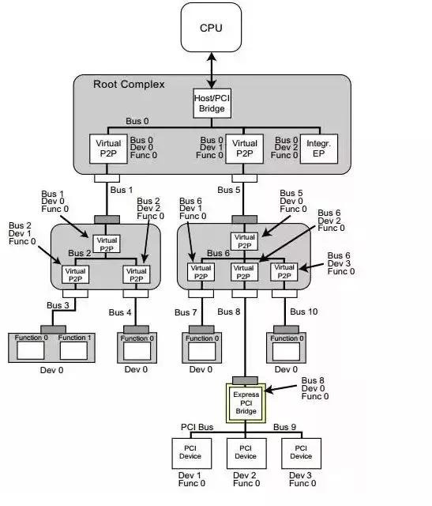
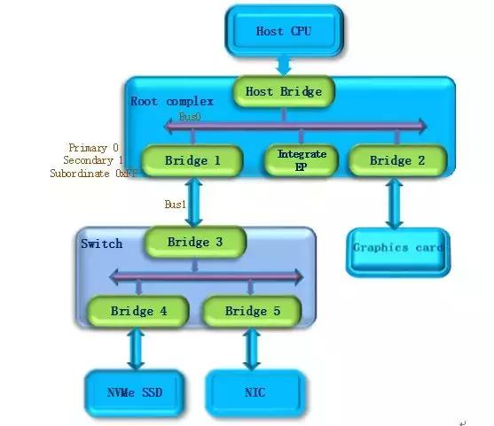
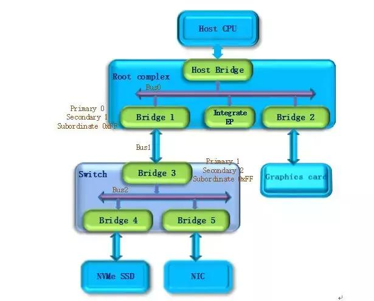
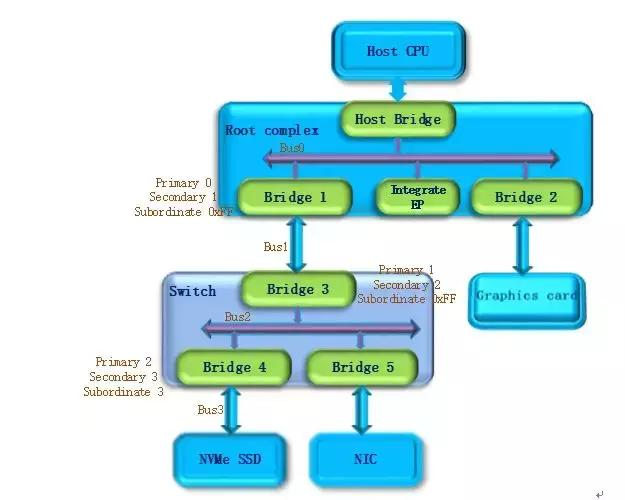
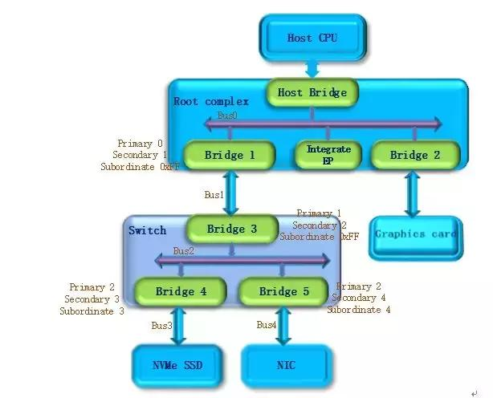
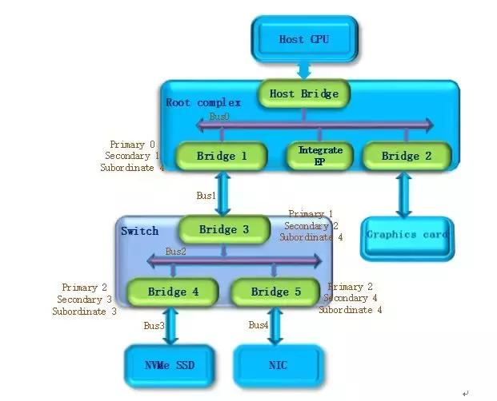
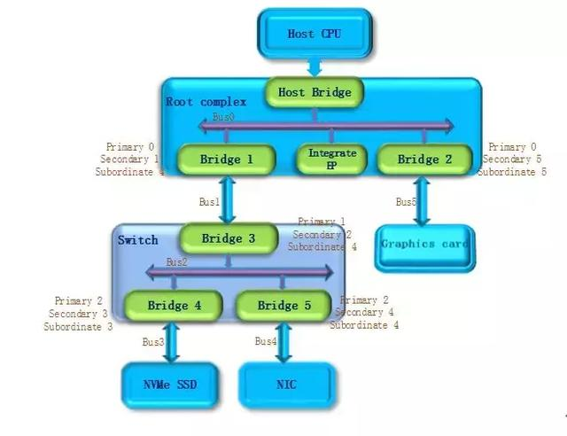
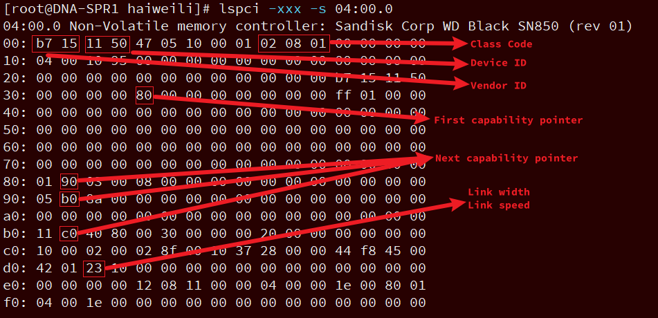
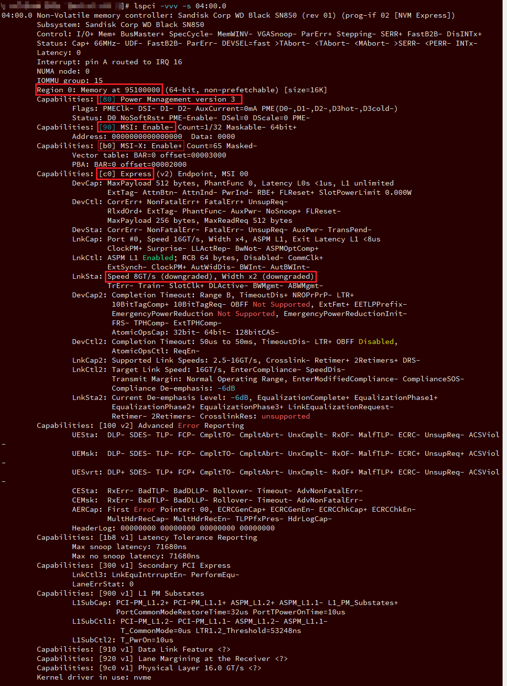
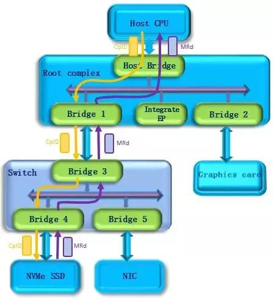

在 x86 系统中, PCIe 是什么样的一个体系架构. 下图是一个 PCIe 的拓扑结构示例, PCIe 协议支持 256 个 Bus, 每条 Bus 最多支持 32 个 Device, 每个 Device 最多支持 8 个 Function, 所以由 BDF(Bus, device, function)构成了每个 PCIe 设备节点的身份证号.



PCIe 体系架构一般由 root complex, switch, endpoint 等类型的 PCIe 设备组成, 在 root complex 和 switch 中通常会有一些 embeded endpoint(这种设备对外不出 PCIe 接口). 这么多的设备, CPU 启动后要怎么去找到并认出它们呢? Host 对 PCIe 设备扫描是采用了**深度优先算法**, 其过程简要来说是对每一个可能的分支路径深入到不能再深入为止, 而且每个节点只能访问一次. 我们一般称这个过程为 **PCIe 设备枚举**. 枚举过程中 host 通过**配置读事物包**来**获取下游设备的信息**, 通过**配置写事物包**对**下游设备**进行**设置**.

第一步, **PCI Host 主桥**扫描 **Bus 0** 上的设备(在一个处理器系统中, 一般将 Root complex 中与 Host Bridge 相连接的 PCI 总线命名为 PCI Bus 0), 系统首先会忽略 Bus 0 上的 embedded EP 等不会挂接 PCI 桥的设备, 主桥发现 Bridge 1 后, 将 **Bridge1 下面**的 **PCI Bus** 定为 **Bus 1**, 系统将初始化 **Bridge1** 的**配置空间**, 并将该桥的 `Primary Bus Number` 和 `Secondary Bus Number` 寄存器分别设置成 **0** 和 **1**, 以表明 Bridge1 的**上游总线**是 **0**, **下游总线**是 **1**, 由于还无法确定 Bridge1 下挂载设备的具体情况, 系统先**暂时**将 `Subordinate Bus Number` 设为 **0xFF**.



第二步, 系统开始**扫描 Bus 1**, 将会发现 **Bridge 3**, 并发现这是一个 **switch 设备**. 系统将 Bridge 3 下面的 PCI Bus 定为 **Bus 2**, 并将该桥的 `Primary Bus Number` 和 `Secondary Bus Number` 寄存器分别设置成 1 和 2, 和上一步一样**暂时**把 Bridge 3 的 `Subordinate Bus Number` 设为 **0xFF**.



第三步, 系统继续扫描 **Bus 2**, 将会发现 **Bridge 4**. 继续扫描, 系统会发现 Bridge 下面挂载的 **NVMe SSD** 设备, 系统将 Bridge 4 下面的 PCI Bus 定为 Bus 3, 并将该桥的 `Primary Bus Number` 和 `Secondary Bus Number` 寄存器分别设置成 2 和 3, 因为 **Bus3** 下面挂的是**端点设备**(叶子节点), 下面**不会再有下游总线**了, 因此 Bridge 4 的 `Subordinate Bus Number` 的值可以确定为 3.



第四步, 完成 Bus 3 的扫描后, 系统返回到 Bus 2 继续扫描, 会发现 Bridge 5. 继续扫描, 系统会发现下面挂载的 NIC 设备, 系统将 Bridge 5 下面的 PCI Bus 设置为 Bus 4, 并将该桥的 Primary Bus Number 和 Secondary Bus Number 寄存器分别设置成 2 和 4, 因为 NIC 同样是端点设备, Bridge 5 的 Subordinate Bus Number 的值可以确定为 4.



第五步, 除了 Bridge 4 和 Bridge 5 以外, **Bus2** 下面**没有其他设备**了, 因此返回到 Bridge 3, Bus 4 是找到的挂载在这个 Bridge 下的最后一个 bus 号, 因此将 Bridge 3 的 Subordinate Bus Number 设置为 4. Bridge 3 的下游设备都已经扫描完毕, 继续向上返回到 Bridge 1, 同样将 **Bridge 1** 的 `Subordinate Bus Number` 设置为 **4**.



第六步, 系统返回到 Bus0 继续扫描, 会发现 Bridge 2, 系统将 Bridge 2 下面的 PCI Bus 定为 **Bus 5**. 并将 Bridge 2 的 Primary Bus Number 和 Secondary Bus Number 寄存器分别设置成 0 和 5,  Graphics card 也是端点设备, 因此 Bridge 2 的 Subordinate Bus Number 的值可以确定为 5.

至此, 挂在 PCIe 总线上的所有设备都被扫描到, 枚举过程结束, Host 通过这一过程获得了一个**完整的 PCIe 设备拓扑结构**.



**系统上电**以后, **host** 会自动完成上述的**设备枚举过程**. 除一些专有系统外, 普通系统只会在开机阶段进行进行设备的扫描, 启动成功后(枚举过程结束), 即使插入一个 PCIe 设备, 系统也不会再去识别它.

在 linux 操作系统中, 我们可以通过 `lspci –v -t` 命令来查询系统上电阶段扫描到的 PCIe 设备, 执行结果会以一个树的形式列出系统中所有的 pcie 设备.

```
# lspci -t -n -v
 \-[0000:00]-+-00.0  8086:09a2
             +-00.1  8086:09a4
             +-00.2  8086:09a3
             +-00.4  8086:0b23
             +-11.0-[04]----00.0  15b7:5011
```

其中 `04:00.0` 是 SSD 设备, `15b7` 是 Sandisk 在 PCI-SIG 组织的注册码, 5011 是设备系列号.

Sandisk5011 设备的 BDF 也可以从上图中找出, 其中 bus 是 0x04, device 是 0x00, function 是 0x0, BDF 表示为 04:00.0, 与之对应的上游端口是 `00:11.0`.

可以通过 "`lspci –xxx –s 04:00.0`" 命令来列出该设备的 PCIe 详细信息. 这些内容存储在 PCIe 设备**配置空间**, 它们描述的是 PCIe 本身的特性.

如下图所示, 可以看到



* 这是一个**非易失性存储控制器**, Non-Volatile memory controller

* 0x00 起始地址是 PCIe 的 Vendor ID 和 Device ID.

  * Vendor ID: 15b7

  * Device ID: 5011

* Class code **0x010802** 表示这是一个 **NVMe 存储设备**.

* **0x80** 是**第一个 capability 的指针**, 如果你需要查看 PCIe 的 capability, 就需要从这个位置开始去查询, 在每组特征的头字段都会给出下一组特性的起始地址.

* **数据链路状态**(`LnkSta`, 属于 Express Endpoint Capability)中的一个 **0x23** 字段, 表示该设备是一个 **x2 lane** 的物理链路, 支持 PCIe Gen3 速率(单 Lane 的峰值带宽是 `8GT/s`).

查看 vendor ID 和 device ID


当然也可以使用 `lspci –vvv –s 04:00.0` 命令来查看设备特性.



Host 在**枚举设备的同时**也会**对设备进行配置**, **每个 PCIe 设备**都会指定**一段 CPU memory 访问空间**, 从上面的图中我们可以看到这个设备仅仅支持一段访问空间, 一段的大小是 16K byte, **操作系统**会指定**它的基地址**. 基地址设置完成以后, Host 就可以通过地址来对 PCIe memory 空间进行访问了.

PCIe memory 空间关联的是 **PCIe 设备物理功能**, 它的物理功能是 **NVMe**, memory 中存放的是 **NMVe 的控制与状态信息**, 对于 NMVe 的控制以及工作状态的获取, 都需要通过 memory 访问来实现.

下面以 NVMe 命令下发为例简单描述 PCIe 设备的 memory 访问. NVMe 命令下发的基本操作是 1) Host 写 doorbell 寄存器, 此时使用 PCIe memory 写请求. 如下图所示, host 发出一个 memory write(MWr)请求, 该请求经过 switch 到达要访问的 NVMe SSD 设备.

这个请求会被端点设备接收并执行 2)NVMe 读取命令操作. 如下图所示, 此时 NVMe SSD 作为请求者, 发出一个 memory read(MRd)请求, 该请求经过 Switch 到达 Host, Host 作为完成者会返回一个完成事物包(CplD), 将访问结果返回给 NVMe SSD.



这样, 一个 NVMe 的命令下发过程就完成了. 同样, NVMe 的其他操作比如各种队列操作, 命令与完成, 数据传输都是通过 PCIe memory 访问的方式进行的, 此处不再详述.

通过上面的描述, 相信能够帮助大家了解 PCIe 的设备枚举和 memory 空间访问. 以后会继续与大家探讨 PCIe 的其他内容, 比如 PCIe 的协议分层, 链路建立, 功耗管理等等.