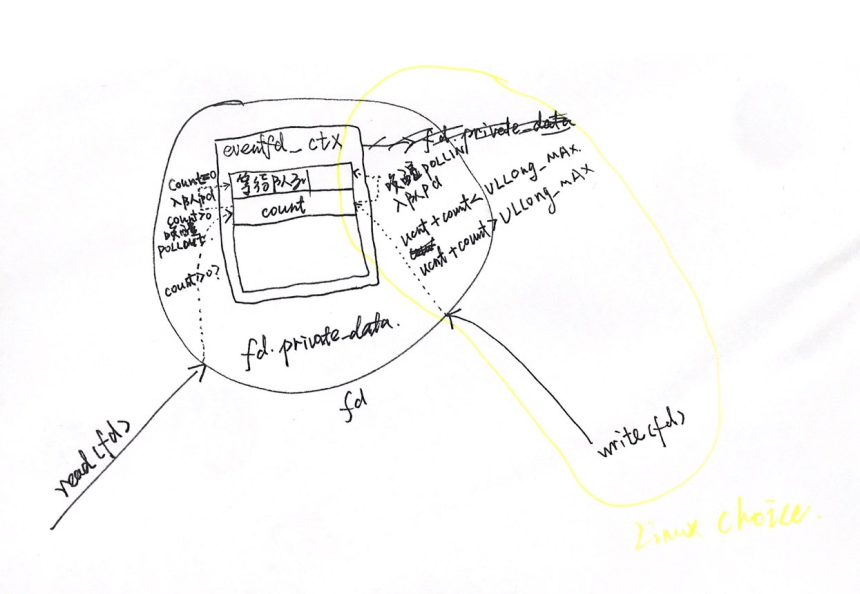
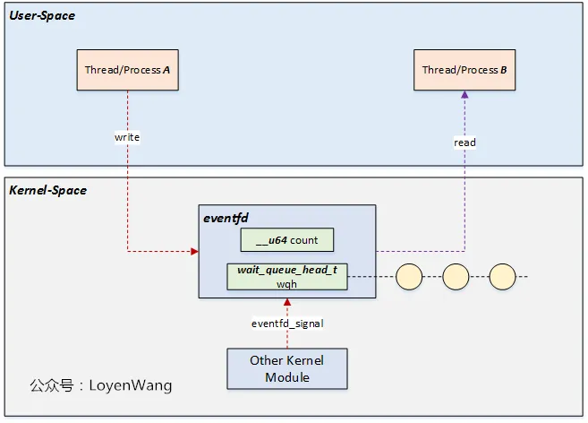
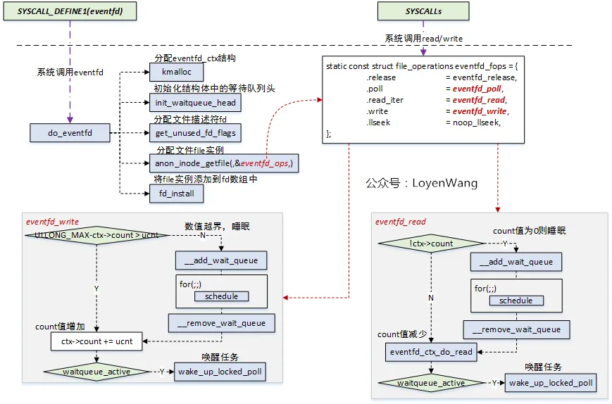

<!-- @import "[TOC]" {cmd="toc" depthFrom=1 depthTo=6 orderedList=false} -->

<!-- code_chunk_output -->

- [1. 背景](#1-背景)
  - [1.1. 事件驱动](#11-事件驱动)
  - [1.2. eventfd](#12-eventfd)
- [2. 用法](#2-用法)
  - [eventfd 的创建](#eventfd-的创建)
  - [eventfd 的写](#eventfd-的写)
  - [eventfd 的读](#eventfd-的读)
  - [示例一](#示例一)
  - [例子二](#例子二)
  - [例子三](#例子三)
- [3.1. 内核实现](#31-内核实现)
  - [3.1.1. 系统调用的定义](#311-系统调用的定义)
  - [3.2. eventfd_ctx](#32-eventfd_ctx)
    - [3.2.1. count 和 wqh](#321-count-和-wqh)
    - [3.2.2. kref](#322-kref)
    - [3.2.3. flags](#323-flags)
    - [3.2.4. id](#324-id)
  - [3.3. do_eventfd](#33-do_eventfd)
- [4. 使用 eventfd](#4-使用-eventfd)
  - [4.1. eventfd 操作方法](#41-eventfd-操作方法)
  - [4.2. 读 eventfd](#42-读-eventfd)
  - [4.3. 写 eventfd](#43-写-eventfd)
  - [4.4. poll eventfd](#44-poll-eventfd)
  - [4.5. eventfd 的通知方案](#45-eventfd-的通知方案)
- [5. reference](#5-reference)

<!-- /code_chunk_output -->



# 1. 背景

## 1.1. 事件驱动

Linux 继承了 UNIX "everything is a file" 的思想, **所有打开的文件**都有**一个 fd** 与之对应.

与 QEMU 一样, 很多**应用程序**都是**事件驱动**的, 也就是通过 `select`/`poll`/`epoll` 等**系统调用**在一组 **fd** 上进行**监听**, 当 fd 状态**发生变化**时, **应用程序**调用对应的**事件处理函数**.

**事件来源**可以有很多种, 如**普通文件**、**socket**、**pipe** 等. 但是有的时候需要的**仅仅**是一个**事件通知**, **没有**对应的**具体实体**, 这个时候就可以直接使用 **eventfd** 了.

## 1.2. eventfd

eventfd **本质**上是一个**系统调用**, 创建一个**事件通知 fd**, 在**内核**内部创建一个 **eventfd 对象**.

eventfd 可用来实现**线程**或者**父子进程间**通信, **内核**通过 eventfd 也可以向用户空间进程发消息.

* 不同线程通过读写该 fd 通知或等待对方;

* 内核通过写该 fd 通知用户程序.

其核心实现是在**内核空间**维护一个**计数器**, 向**用户空间**暴露一个与之关联的**匿名 fd**. 进程可以通过对这个文件描述符进行 `read/write` 来**读取/改变计数器的值**, 从而实现进程间通信.

# 2. 用法

eventfd 机制接口简单, 核心只有 4 个, 分别是创建 eventfd(eventfd), 写 eventfd(write), 读 eventfd(read), 监听 eventfd(poll/select).

`linux-gnu` 提供的方法:

## eventfd 的创建

通过 **eventfd** 函数, 来创建 eventfd, 该函数会返回 eventfd 所对应的文件描述符, 函数定义如下

```cpp
// 使用时引用
#include <sys/eventfd.h>

// 定义所在的文件
// /usr/include/x86_64-linux-gnu/sys/eventfd.h

/* Return file descriptor for generic event channel.  Set initial
   value to COUNT.  */
extern int eventfd (unsigned int __count, int __flags) __THROW;
```

参数 `__count`: 创建 eventfd 时**初始值**;

参数 `__flags`: eventfd 文件描述符的标志, 有下面三个:

```cpp
// 使用时引用, 因为 sys/eventfd.h 文件中引用了下面的文件
#include <sys/eventfd.h>

// 定义所在的文件
// /usr/include/x86_64-linux-gnu/bits/eventfd.h
enum
  {
    EFD_SEMAPHORE = 00000001,
#define EFD_SEMAPHORE EFD_SEMAPHORE
    EFD_CLOEXEC = 02000000,
#define EFD_CLOEXEC EFD_CLOEXEC
    EFD_NONBLOCK = 00004000
#define EFD_NONBLOCK EFD_NONBLOCK
  };
```

* `EFD_SEMAPHORE`: 表示 eventfd 作为**一个信号量**来使用

* `EFD_CLOEXEC`: 与 open 接口的 O_CLOEXEC 选项一样, 表示 eventfd 在 exec 其他程序时会自动关闭这个文件描述符

* `EFD_NONBLOCK`: 表示 eventfd **非阻塞**, 将影响read/write的调用结果

也就是说 0 是 **阻塞非信号量**

返回值: 成功时, 返回一个非负整数的文件描述符, 失败时, 返回 -1

## eventfd 的写

通过 `write` 添加 8 字节的数值到计数器中, 最大为 `MAX_U64 - 1`.

如果超出上限, **阻塞选项**下将**一直阻塞**直到计数器的值被 read 走为止, **非阻塞**选项下将会返回失败并抛 `errno = EAGAIN`.

也可通过 `eventfd_write` 来进行写入操作, 函数定义如下

```cpp
// 使用时引用
#include <sys/eventfd.h>

// 定义所在的文件
// /usr/include/x86_64-linux-gnu/sys/eventfd.h

/* Type for event counter.  */
typedef uint64_t eventfd_t;
/* Read event counter and possibly wait for events.  */
extern int eventfd_read (int __fd, eventfd_t *__value);
```

参数 `__fd`: 是 eventfd 函数创建返回的文件描述符

参数 `__value`: 要写入的值

返回值: 0 表示成功, -1 表示失败

## eventfd 的读

`read` 接口使用要求按 8 字节进行输入(u64的大小), 否则抛 EINVAL 错误.

* 如果**没有**设置 `EFD_SEMAPHORE`, read 接口表示从 eventfd 计数器读取 8 字节数据, **数据值**为**计数器现有的值**, 读取完成后**计数器将被重置成 0**.

* 如果设置 `EFD_SEMAPHORE`, read 接口 表示从 eventfd 计数器读取8字节数据, **数据值**为 **1**, 读取完成后**计数器减一**操作.

当**计数器**为 **0** 的时候, 如果设置了**阻塞选项**, read 调用将一直**阻塞**直到计数器变为**非 0** 状态, 如果是**非阻塞**选项下, 将会返回失败并抛errno=EAGAIN.

也可通过 `eventfd_read` 来进行读操作, 函数定义如下

```cpp
// 使用时引用
#include <sys/eventfd.h>

// 定义所在的文件
// /usr/include/x86_64-linux-gnu/sys/eventfd.h

/* Type for event counter.  */
typedef uint64_t eventfd_t;
/* Increment event counter.  */
extern int eventfd_write (int __fd, eventfd_t __value);
```

和写入操作差不多, 不过 `__value` 是我们提前分配好, 把内存地址传过去.


## 示例一

```cpp
#include <stdio.h>
#include <stdlib.h>
#include <sys/eventfd.h>
#include <pthread.h>
#include <unistd.h>

int efd;

void *threadFunc()
{
    uint64_t buffer;
    int rc;
    int i = 0;
    while(i++ < 2) {
        /* 如果计数器非 0, read 成功, buffer 返回计数器值. 成功后有两种行为: 信号量方式计数器每次减, 其它每次清 0.
         * 如果计数器 0, read 失败, 由两种返回方式: EFD_NONBLOCK 方式会阻塞, 反之返回 EAGAIN
         */
        rc = read(efd, &buffer, sizeof(buffer));

        if (rc == 8) {
            printf("notify success, eventfd counter = %lu\n", buffer);
        } else {
            perror("read");
        }
    }
}

static void
open_eventfd(unsigned int initval, int flags)
{
    efd = eventfd(initval, flags);
    if (efd == -1) {
        perror("eventfd");
    }
}

static void
close_eventfd(int fd)
{
    close(fd);
}

/* counter 表示写 eventfd 的次数, 每次写入值为 2 */
static void test(int counter)
{
    int rc;
    pthread_t tid;
    void *status;
    int i = 0;
    uint64_t buf = 2;

    /* create thread */
    if(pthread_create(&tid, NULL, threadFunc, NULL) < 0){
        perror("pthread_create");
    }

    while(i++ < counter){
        rc = write(efd, &buf, sizeof(buf));
        printf("signal to subscriber success, value = %lu\n", buf);

        if(rc != 8){
            perror("write");
        }
        sleep(2);
    }
    // 等待 tid 结束
    pthread_join(tid, &status);
}

int main()
{
    unsigned int initval;

    printf("NON-SEMAPHORE BLOCK way\n");
    /* 初始值为 4,  flags 为 0, 默认 blocking 方式读取 eventfd */
    initval = 4;
    open_eventfd(initval, 0);
    printf("init counter = %lu\n", initval);

    test(2);

    close_eventfd(efd);

    printf("change to SEMAPHORE way\n");

    /* 初始值为 4,  信号量方式维护 counter */
    initval = 4;
    open_eventfd(initval, EFD_SEMAPHORE);
    printf("init counter = %lu\n", initval);

    test(2);

    close_eventfd(efd);

    printf("change to NONBLOCK way\n");

    /* 初始值为 4,  NONBLOCK 方式读 eventfd */
    initval = 4;
    open_eventfd(initval, EFD_NONBLOCK);
    printf("init counter = %lu\n", initval);

    test(2);

    close_eventfd(efd);

    return 0;
}
```

demo 中创建 eventfd 使用了三种方式, 分别如下:

1) **阻塞非信号量**: 以非信号量方式创建的 eventfd, 在读 eventfd 之后, 内核的计数器**归零**, 下一次再读就会阻塞, 除非有进程再次写 eventfd.

```
NON-SEMAPHORE BLOCK way
init counter = 4
signal to subscriber success, value = 2
notify success, eventfd counter = 6
signal to subscriber success, value = 2
notify success, eventfd counter = 2
```

* 内核计数器初始值为4, 主线程第 1 次写入 2, 计数器增至 6

* 读线程返回 6, 之后计数器清 0, 读线程阻塞

* 下一次主线程写入 2, 计数器增至 2, 读线程返回 2

2) **阻塞信号量**: 以信号量方式创建的 eventfd, 在读 eventfd 之后, 内核的计数器**减 1**

```
change to SEMAPHORE way
init counter = 4
signal to subscriber success, value = 2
notify success, eventfd counter = 1
notify success, eventfd counter = 1
signal to subscriber success, value = 2
```

* 内核计数器初始值为 4, 主线程第一次写入 2, **计数器**增至 **6**

* **读**线程**返回 1**, 计数器减 1 变成 5, 读线程循环读返回 1, 计数器再减 1 变成 4

* 主线程写入 2 计数器增至 6

3) **非阻塞非信号量**: 读 eventfd 之后, 计数器清 0, 再次读 eventfd 返回 EAGAIN

```
change to NONBLOCK way
init counter = 4
signal to subscriber success, value = 2
notify success, eventfd counter = 6
read: Resource temporarily unavailable
signal to subscriber success, value = 2
```

* 内核计数器初始值为 4, 主线程第一次写入 2, 计数器增至 6

* 读线程返回 6, **计数器清 0**, 读线程循环非阻塞读返回错误码 EAGAIN

* 主线程写入 2 计数器增至 2

## 例子二

实现写入和读取的基本操作

```cpp
#include <stdio.h>
#include <sys/eventfd.h>

int main(int argc, char* argv[]) {
    int fd, write_ret, read_ret;
    uint64_t value;
    //初始值为1
    //在Linux 2.6.26版本之前, flags参数是未使用的, 并且必须指定为零
    fd = eventfd(1, EFD_NONBLOCK);
    if(fd ==-1){
        printf("eventfd create failed\n");
        return 0;
    }

    write_ret = eventfd_write(fd, 20);
    write_ret = eventfd_write(fd, 30);
    if(write_ret == -1){
        printf("eventfd write failed\n");
        return 0;
    }


    read_ret = eventfd_read(fd, &value);
    if(read_ret == -1){
        printf("eventfd read failed\n");
        return 0;
    }
    printf("value %ld\n", value);
    //read_ret = eventfd_read(fd, &value); //此代码会阻塞
    //printf("value %ld\n", value);
    return 0;
}
```

在代码中我进行了两次写入操作, 最后读出的结果为 51, 可以看出在写入时, 会把每次的写入结果还有初始值进行**累加处理**,

使用 `eventfd_read` 进行读取, **读完后**在进行**读操作**会**阻塞**直到**新的数据写入**. 当设置 flags 为 `EFD_NONBLOCK`, 在进行读取才操作会直接返回失败, 不会阻塞.

## 例子三

**父进程**每隔 1 秒**写**入一次数据, **子进程**读取数据

```cpp
#include <sys/eventfd.h>
#include <sys/types.h>
#include <stdio.h>
#include <unistd.h>

int main(int argc, char* argv[]){
    int fd, read_ret, write_ret;
    uint64_t value;
    pid_t pid;
    //初始值为1
    //在Linux 2.6.26版本之前, flags参数是未使用的, 并且必须指定为零
    fd = eventfd(1, 0);
    if (fd ==-1) {
        printf("eventfd create failed\n");
        return 0;
    }

    pid = fork();
    if (pid < 0) {
        printf("fork error\n");
    // 子进程
    } else if(pid == 0){
        while(1) {
            read_ret = eventfd_read(fd, &value);
            if (read_ret == -1) {
                printf("eventfd read failed\n");
                return 0;
            }
            printf("value %ld\n", value);
        }
    // 父进程本身
    } else {
        while(1) {
            write_ret = eventfd_write(fd, 20);
            if (write_ret == -1) {
                printf("eventfd write failed\n");
                return 0;
            }
            sleep(1); //睡眠1秒
        }
    }
    return 0;
}
```

编译运行:

```
# ./eventfd_test
value 21
value 20
value 20
value 20
value 20
...
```

查看进程相关关系:

```
# ps auxf | grep -i "eventfd_test"
root       25560  0.0  0.0   2644   960 pts/1    S+   01:04   0:00  |       \_ ./eventfd_test
root       25561  0.0  0.0   2776   960 pts/1    S+   01:04   0:00  |           \_ ./eventfd_test

# pstree -p 25560
eventfd_test(25560)───eventfd_test(25561)
```

# 3.1. 内核实现

eventfd 的机制比较简单, 大体框架如下图:



* 内核中创建了一个struct eventfd_ctx结构体, 该结构体中维护一个count计数, 以及一个等待队列头;

* 线程/进程在读eventfd时, 如果count值等于0时, 将当前任务添加到等待队列中, 并进行调度, 让出CPU. 读过程count值会进行减操作;

* 线程/进程在写eventfd时, 如果count值超过最大值时, 会将当前任务添加到等待队列中(特殊情况), 写过程count值会进行加操作, 并唤醒在等待队列上的任务;

* 内核的其他模块也可以通过eventfd_signal接口, 将count值加操作, 并唤醒在等待队列上的任务;

代码实现如下图:



eventfd机制对用户层提供的系统调用接口包括eventfd(), write(), read(), select/poll等;

通过eventfd来创建文件描述符, 从代码中可以看出, 该接口的实现为 do_eventfd, 完成的工作包括:

1) 在内核中分配struct eventfd_ctx结构体来维护上下文;

2) 初始化等待队列头用于存放睡眠等待的任务;

3) 分配未使用的文件描述符fd, 创建file实例(该实例会绑定操作函数集), 将文件描述符fd与file实例建立连接等;

最终系统调用 read/write 时, 便会分别调用到 eventfd_read/eventfd_write 函数:

eventfd_read: 如果count值为0, 将自身添加到等待队列中, 设置任务的状态后调用schedule让出CPU, 等待被唤醒. 读操作中会对count值进行减操作, 最后再判断等待队列中是否有任务, 有则进行唤醒;

eventfd_write: 判断count值在增加ucnt后是否会越界, 越界则将自身添加到等待队列中, 设置任务的状态后调用schedule让出CPU, 等待被唤醒. 写操作会对count值进行加操作, 最后再判断等待队列中是否有任务, 有则进行唤醒;

此外, 还有eventfd_signal接口, 比较简单, 完成的工作就是对count值进行加操作, 并唤醒等待任务;

## 3.1.1. 系统调用的定义

内核定义了 2 种 eventfd **相关的系统调用**, 分别为 `eventfd` 和 `eventfd2`, 二者的区别在于, eventfd 系统调用的 flags 参数为 0.

```cpp
// fs/eventfd.c
SYSCALL_DEFINE2(eventfd2, unsigned int, count, int, flags)
{
    return do_eventfd(count, flags);
}

SYSCALL_DEFINE1(eventfd, unsigned int, count)
{
    return do_eventfd(count, 0);
}
```

两个系统调用都调用了 `do_eventfd`. 其实就是对 `struct eventfd_ctx` 的初始化, 创建一个匿名文件实例 fd 并设置`fd->private_data` 为 **eventfd_ctx**, 然后返回这个 fd 给用户态

## 3.2. eventfd_ctx

该结构如下:

```cpp
struct eventfd_ctx {
    struct kref kref;
    wait_queue_head_t wqh;
    __u64 count;
    unsigned int flags;
    int id;
};
```

> 没有对应的事件来源实体(普通文件、socket、pipe 等), 仅仅是创建了一个匿名的 inode(秉承"一切即文件")

### 3.2.1. count 和 wqh

* 在**一个 eventfd** 上执行 **write 系统调用**, 会向 `count` **加上！！！被写入的值**, 并**唤醒等待队列 wqh** 中的元素;
* **内核**中的 `eventfd_signal` 函数**也**会**增加** count 的值并**唤醒** wqh 中的元素;
* 用户态在 eventfd 上执行 **read 系统调用**, 内核会向 **用户空间！！！** 返回 count 的值, 并且该 eventfd 对应的 `eventfd_ctx` 结构中的 **count 会被清 0**.

### 3.2.2. kref

`eventfd_ctx` 中的 kref 是一个内核中的**通用变量**, 一般插入到结构体中, 用于记录**该结构体**被**内核**各处**引用的次数**, 当 `kref->refcount` 为 0 时, 该结构体**不再被引用**, 需要**进行释放**.

`kref_init(&ctx->kref)` 将 `eventfd_ctx->kref.refcount` 值**初始化为了 1**, 表明 `eventfd_ctx` 正在一处代码中使用.

### 3.2.3. flags

flags 由**系统调用 eventfd2** 的调用者传入(eventfd 的 flags 恒为 0), 可能取值为 `EFD_CLOEXEC`、`EFD_NONBLOCK`、`EFD_SEMAPHORE` 三者的任意或组合.

```cpp
// include/linux/eventfd.h
#define EFD_SEMAPHORE (1 << 0)
#define EFD_CLOEXEC O_CLOEXEC
#define EFD_NONBLOCK O_NONBLOCK

#define EFD_SHARED_FCNTL_FLAGS (O_CLOEXEC | O_NONBLOCK)
#define EFD_FLAGS_SET (EFD_SHARED_FCNTL_FLAGS | EFD_SEMAPHORE)
```

* `EFD_CLOEXEC`

```cpp
#define EFD_CLOEXEC O_CLOEXEC
```

`EFD_CLOEXEC` flag 本质上为 `O_CLOEXEC`, `close-on-exec`.

`O_CLOEXEC` 即**执行时关闭**标志. 进程中**每个打开的文件描述符！！！** 都有一个**执行时关闭标志**, 如果设置此标志, 则在**进程**调用 **exec** 时**关闭该文件描述符**.

O_CLOEXEC 可以方便我们**关闭无用的文件描述符**.

例如, 当**父进程** **fork** 出一个**子进程**时, **子进程**是父进程的**副本**, 获得父进程的**数据空间**、**堆**和**栈**的**副本**, 当然也包括**父进程打开的文件描述符**. 一般情况下, fork 之后我们会**调用 exec 执行另一个程序**, 此时会用全新的程序**替换**子进程的 **context**(即**堆**、**栈**、**数据空间**等), 此时之前运行父/子进程打开的文件描述符肯定也不存在了, 我们丢失了这些文件描述符的 reference, 但**之前被打开的文件依旧处于 open 状态**, 成了系统的负担.

通常在简单系统中, 我们可以在 fork 出一个子进程之后, 在**子进程**中**关闭**这些已经打开但不需要的文件描述符. 但是, 在复杂系统中, 在我们 fork 出子进程的那一刻, 我们并**不知道**已经有**多少文件处于 open 状态**, 一一在子进程中清理难度很大, 如果能**在 fork 出子进程前**, **父进程打开某个文件时**就约定好, 在我 fork 出一个子进程后, 执行 exec 时, 就关闭该打开的文件, 因此 `close-on-exec`,也就是 `O_CLOEXEC` flag, 是打开的文件描述符中的一个标志位.

返回到 eventfd 话题中, 因为 **eventfd** 本质上是一个**文件描述符**, 打开后也会**占用系统资源**, 因此也拥有与 O_CLOEXEC 相同的 `EFD_CLOEXEC` 标志.

* `EFD_NONBLOCK`

```cpp
#define EFD_NONBLOCK O_NONBLOCK
```

`EFD_NONBLOCK` 的实质为 `O_NONBLOCK`, 对于设置该 flag 的文件描述符, **任何打开文件并返回文件描述符**的**系统调用**都**不会阻塞进程**, 即如果**无法获取文件描述符**则**立即返回**.

在 eventfd 机制中, 使用该 flag 的目的是能够让 **fcntl 系统调用**作用于文件文件描述符上时得到与相关系统调用的相同的结果.

* `EFD_SEMAPHORE`

提供一种**类似于信号量的机制**, 用于当从 eventfd **读取内容**时的**机制保护**.

### 3.2.4. id

id 即 eventfd 的 id, 用于**唯一标识**一个 **eventfd**.

## 3.3. do_eventfd

```cpp
do_eventfd(count,flags)
```

`do_eventfd` 的主要框架.

```cpp
do_eventfd
=> ctx = kmalloc(sizeof(*ctx), GFP_KERNEL)
=> kref_init(&ctx->kref)
=> init_waitqueue_head(&ctx->wqh)
=> ctx->count = count;
=> ctx->flags = flags;
=> ctx->id = ida_simple_get(&eventfd_ida, 0, 0, GFP_KERNEL);
=> fd = anon_inode_getfd("[eventfd]", &eventfd_fops, ctx, O_RDWR | (flags & EFD_SHARED_FCNTL_FLAGS));
=> return fd;
```

通过以上的知识铺垫, eventfd 和 eventfd2 系统调用的处理过程就很清晰了.

1. 分配一个 `eventfd_ctx` 结构用于存储 eventfd 相关信息
2. 设置 `eventfd_ctx->kref` 中的值为 1, 表明**内核正在引用该 eventfd**
3. 初始化 `eventfd_ctx` 结构中的等待队列
4. 为 `eventfd_ctx` 结构中的 **count**(读写 eventfd 时要操作的量)**赋上**系统调用**传入的 count**
5. 为 `eventfd_ctx` 结构中的 id 通过 Linux 提供的 **ida 机制**申请一个 id
6. 最后通过 `anon_inode_getfd` 创建一个**匿名文件实例**, **该文件**的**操作方法**为 `eventfd_fops`, `fd->private_data` 为 **eventfd_ctx**, **文件实例名**为 `eventfd`
7. 返回该文件实例的**文件描述符**

# 4. 使用 eventfd

## 4.1. eventfd 操作方法

在 eventfd 初始化的过程中, 为 eventfd 注册了一组**操作函数**.

```cpp
// fs/eventfd.c
static const struct file_operations eventfd_fops = {
#ifdef CONFIG_PROC_FS
    .show_fdinfo	= eventfd_show_fdinfo,
#endif
    .release	= eventfd_release,
    .poll		= eventfd_poll,
    .read		= eventfd_read,
    .write		= eventfd_write,
    .llseek		= noop_llseek,
};
```

## 4.2. 读 eventfd

`ssize_t read(int fd, void *buf, size_t count)`: 读 eventfd, 如果计数器非 0, 信号量方式返回 1, 否则返回计数器的值. 如果计数器为 0, 读失败, 阻塞模式下会阻塞直到计数器非 0, 非阻塞模式下返回 EAGAIN 错误.

读 eventfd 动作由 `eventfd_read` 函数提供支持, 只有在 `eventfd_ctx->count` **大于 0** 的情况下, eventfd **才是可读的**, 然后调用 `eventfd_ctx_do_read` 对 `eventfd_ctx` 的 **count** 进行处理:

* 如果 `eventfd_ctx->flags` 中的 `EFD_SEMAPHORE` **置位**, 就将 `eventfd_ctx->count` **减一**(因为 semaphore 只有 0 和 1 **两个值**, 因此该操作即为**置 0 操作**);
* 如果 `eventfd_ctx->flags` 中的 `EFD_SEMAPHORE` 为**0**, 就将 `eventfd_ctx->count` **减去自身**, 即**置** `eventfd_ctx->count` 为 **0**.

如果 `eventfd_ctx->count` 等于**0**, 即该 eventfd **当前不可读**, 此时如果检查 `eventfd_ctx->flags` 中的 `O_NONBLOCK` **没有置位**, 那么将发起读 eventfd 动作的进程放入属于 `eventfd_ctx` 的**等待队列**, 并**重新调度新的进程**运行.

如果 `eventfd_ctx->count` **大于 0**, 就将该 count 置 0, 激活正在等待队列中等待的 EPOLLOUT 进程.

如果 `eventfd_ctx->count` 等于 0 且该 eventfd 提供阻塞标志, 就将读进程放入等待队列中.

## 4.3. 写 eventfd

`ssize_t write(int fd, const void *buf, size_t count)`: 写 eventfd, 传入一个 8 字节的 buffer, buffer 的值增加到内核维护的计数器中.

写 eventfd 动作由 eventfd_write 函数提供支持, 该函数中, **ucnt** 获得了想要写入 eventfd 的值, 通过判断 `ULLONG_MAX - eventfd_ctx->count` 与 ucnt 的值大小, 确认 eventfd 中还有足够空间用于写入, 如果有足够空间用于写入, 就在 `eventfd_ctx->count` 的基础上**加上** ucnt 变为新的 `eventfd_ctx->count`, 并**激活**在等待队列中等待的 读/POLLIN 进程.

如果没有足够空间用于写入, 则将写进程放入属于 `eventfd_ctx` 的等待队列.

## 4.4. poll eventfd

`int poll(struct pollfd *fds, nfds_t nfds, int timeout)`: 监听 eventfd 是否可读

Poll(查询) eventfd 动作由 `eventfd_poll` 函数提供支持, 该函数中定义了一个 poll 结构的 events, 如果 eventfd 的 count 大于 0, 则 eventfd 可读, 且 events 中的 POLLIN 置位. 如果 eventfd 的 count 与 ULLONG_MAX 之间的差使 eventfd 至少能写入 1, 则该 eventfd 可写, 且 events 中的 POLLOUT 置位.

## 4.5. eventfd 的通知方案

从上面的 eventfd 操作方法可以看出有两种通知方案:

1. 进程 poll eventfd 的 **POLLIN** 事件, 如果在某个时间点, **其它**进程或内核向 eventfd **写入**一个值, 即可让 poll eventfd 的进程返回.

2. 进程 poll eventfd 的 **POLLOUT** 事件, 如果在某个时间点, **其它**进程或内核**读取** eventfd, 即可让 poll eventfd 的进程返回.

Linux 内核使用第一种通知方案, 即进程 poll eventfd 的 POLLIN 事件, Linux 提供了功能与 `eventfd_write` 类似的 `eventfd_signal` 函数, 用于触发对 poll eventfd 的进程的通知.


# 5. reference

source: https://www.cnblogs.com/haiyonghao/p/14440737.html

关于文件描述符的 close-on-exec 标志位: https://blog.csdn.net/Leeds1993/article/details/52724428

IDA 原理: https://biscuitos.github.io/blog/IDA/

eventfd——用法与原理(有 demo): https://blog.csdn.net/huang987246510/article/details/103751172 (none)

内核实现: https://blog.csdn.net/huang987246510/article/details/103751172 (todo)