<!-- @import "[TOC]" {cmd="toc" depthFrom=1 depthTo=6 orderedList=false} -->

<!-- code_chunk_output -->

- [1. 概述](#1-概述)
- [2. 什么是 FirewallD](#2-什么是-firewalld)
- [3. 什么是 iptables](#3-什么是-iptables)
- [4. FirewallD 服务的基本操作](#4-firewalld-服务的基本操作)
- [5. iptables 服务的基本操作](#5-iptables-服务的基本操作)
- [6. 理解网络区](#6-理解网络区)
  - [6.1. zone 使用原则](#61-zone-使用原则)
- [7. 命令行工具 firewall-cmd](#7-命令行工具-firewall-cmd)
  - [7.1. 状态](#71-状态)
  - [7.2. 动作中的查看操作](#72-动作中的查看操作)
  - [7.3. 更改区域操作:](#73-更改区域操作)
  - [7.4. 新建或删除规则:](#74-新建或删除规则)
  - [7.5. 应用示例](#75-应用示例)
- [8. 处理运行时区域](#8-处理运行时区域)
- [9. 处理永久区域](#9-处理永久区域)
- [10. Rich 规则](#10-rich-规则)
- [11. 理解直接接口](#11-理解直接接口)
- [12. 改用 iptables 服务](#12-改用-iptables-服务)
- [13. 启动图形化防火墙设置工具](#13-启动图形化防火墙设置工具)
- [14. 参考](#14-参考)

<!-- /code_chunk_output -->

# 1. 概述

**防火墙**是一种位于**内部网络**与**外部网络**之间的**网络安全系统**. 一项信息安全的防护系统, 依照特定的规则, 允许或是限制传输的数据通过. 防火墙通常工作在**网络层**, 也即 **IPv4 或 IPv6 的 IP 包**上.

是否允许包通过防火墙, 取决于**防火墙配置的规则**. 这些规则既可以是内建的, 也可以是用户自定义的. 每一个包要进出防火墙, 均需要满足防火墙配置的规则.

**每一条规则**均有**一个目标动作**, 具有**相同动作的规则**可以**分组在一起**.

RHEL7 中有几种防火墙共存: **firewalld**、**iptables**、**ebtables**等等, **默认**使用 **firewalld** 作为防火墙, **管理工具**是**firewall\-cmd**. 使用 **firewalld** 来管理**netfilter**, 不过底层调用的命令仍然是 iptables 等.

最常用的防火墙有: FirewallD 或 iptables. Linux 的发行版种类极多, 但是公认的仍然是这两种.

RedhatEnterprise Linux7 已经默认使用 firewalld 作为防火墙, 其使用方式已经变化. 基于 iptables 的防火墙被默认不启动, 但仍然可以继续使用.

因为这几种是冲突的, 所以建议禁用其他几种服务.

# 2. 什么是 FirewallD

FirewallD 即**Dynamic Firewall Manager of Linux systems**, Linux 系统的**动态防火墙管理器**. 是 redhat7 系统中对于 netfilter 内核模块的管理工具.

**iptables** service 管理防火墙规则的模式(**静态**): 用户将新的防火墙规则添加进 /**etc/sysconfig/iptables** 配置文件当中, 再执行命令 /etc/init.d/**iptables reload** 使变更的规则生效. 在这整个过程的背后, iptables service 首先**对旧的防火墙规则进行了清空**, 然后**重新完整地加载**所有新的防火墙规则, 如果加载了防火墙的模块, 需要在重新加载后进行手动加载防火墙的模块;

**firewalld** 管理防火墙规则的模式(**动态**): 任何规则的变更都**不需要**对整个防火墙规则列表进行**重新加载**, 只需要将**变更部分**保存并更新到运行中的 **iptables** 即可. 还有命令行和图形界面配置工具, 它仅仅是替代了 iptables service 部分, 其底层还是使用 iptables 作为防火墙规则管理入口.

firewalld 使用 python 语言开发, 在新版本中已经计划使用 c\+\+ 重写 daemon 部分(见下图).

**FirewallD**是一个服务, 用于**配置网络连接**, 从而那些内外部网络的数据包可以允许穿过网络或阻止穿过网络.

**FirewallD**允许**两种类型的配置**: **永久类型**和**运行时类型**.

- 运行时类型的配置在**防火墙被重启后会丢失**相应的规则配置;
- 而永久类型的配置即使遇到系统重启, 也会保留生效.

对应于上面两种类型的配置, FirewallD 相应的有两个目录:

- 针对**运行时**类型配置的目录/**usr/lib/firewall**;
- 以及针对**永久类型**配置的目录/**etc/firewall**.

在 RHEL/CentOS 7 或 Fedora 18 的默认服务可以看到.

防火墙栈的整体图如下:

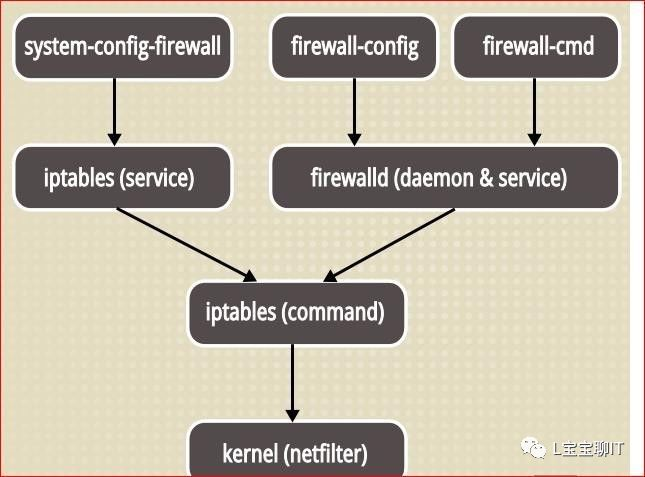

Firewalld 提供了支持**网络/防火墙区域(zone**)定义**网络链接**以及**接口安全等级**的**防火墙管理工具**. 拥有运行时配置和永久配置选项. 它也支持允许服务或者应用程序直接添加防火墙规则的接口. 以前的 system\-config\-firewall 防火墙模型是**静态**的, 每次修改都要求**防火墙完全重启**. 这个过程包括**内核 netfilter 防火墙模块**的**卸载**和新配置所需模块的**装载**等. 相反, firewalldaemon 动态管理防火墙, 不需要重启整个防火墙便可应用更改. 因而也就没有必要重载所有内核防火墙模块了.


查看防火墙几种服务的运行状态:

# 3. 什么是 iptables

iptables 是另一种服务, 它可以决定是否允许、删除或返回 IP 数据包. iptables 服务管理 IPv4 数据包, 而 ip6tables 则管理 IPv6 数据包. 此服务管理了一堆规则表, 其中每个表分别用于维护不同的目的, 比如过滤表(filter table)为防火墙规则, NAT 表供新连接查询使用, mangle 表用于数据包的转换等.

更进一步, 每个表还具有规则链, 规则链可以是内建的或是用户自定义的, 它表示适用于一个数据包的规则集合, 从而决定数据包应该执行哪些目标动作, 比如允许 ALLOWED、阻塞 BLOCKED 或返回 RETURNED. iptables 服务在 RHEL/CentOS 6/5、Fedora、ArchLinux、Ubuntu 等 Linux 发行版中是系统默认的服务.

# 4. FirewallD 服务的基本操作

对于 CentOS/RHEL 7 或 Fedora 18 以上版本的系统, 要管理 FirewallD 服务, 使用如下命令.

启动 FirewallD 服务

```
# systemctl firewalld start
```

停止 FirewallD 服务

```
# systemctl firewalld stop
```


检查 FirewallD 服务的状态

```
# systemctl status firewalld
```

检查 FirewallD 服务的状态

```
# firewall-cmd --state
```

可能会返回 running, 表示正在运行.

还可以禁用 FirewallD 服务, 关闭那些规则.

禁用 FirewallD 服务

```
# systemctl disable firewalld
```

启用 FirewallD 服务

```
# systemctl enable firewalld
```

屏蔽 FirewallD 服务

```
# systemctl mask firewalld
```

还可以通过创建一个 firewall.service 到/dev/null 的符号连接来屏蔽防火墙服务.

反屏蔽 FirewallD 服务

```
# systemctl unmask firewalld
```

这是反屏蔽 FirewallD 服务, 它会移除屏蔽 FirewallD 服务时创建的符号链接, 故能重新启用服务.

检查是否已安装防火墙

```
# yum install firewalld firewall-config
```

# 5. iptables 服务的基本操作

在 RHEL/CentOS 6/5/4 系统和 Fedora 12-18 系统中, iptables 是默认的防火墙, 如果服务不存在, 可以这样安装:

```
# yum install iptables-services
```

然后就可以对 iptables 服务进行启动、停止、重启等操作了.

启动 iptables 服务

```
# systemctl start iptables
```

或

```
# service iptables start
```

停止 iptables 服务

```
# systemctl stop iptables
```

或
```
# service iptables stop
```

禁用 iptables 服务

```
# systemctl disable iptables
```

或
```
# service iptables save
# service iptables stop
```

启用 iptables 服务
```
# systemctl enable iptables
```

或

```
# service iptables start
```

检查 iptables 服务的状态

```
# systemctl status iptables
```
或

```
# service iptables status
```

在 Ubuntu 及其它 Linux 发行版中, ufw 是用于管理 iptables 防火墙服务的工具. ufw 提供了一个简易的界面让用户可以很方便的处理 iptables 防火墙服务.

启用 ufw iptables 防火墙服务

```
$ sudo ufw enable
```

禁用 ufw iptables 防火墙服务

```
$ sudo ufw disable
```

检查 ufw iptables 防火墙服务的状态

```
$ sudo ufw status
```

但是, 如果想列出 iptables 包含的所有规则链列表, 应使用如下命令:

```
$ iptables -L -n -v
```

# 6. 理解网络区

网络区域定义了网络连接的可信等级.


**数据包**要进入到**内核**必须要通过**这些 zone 中的一个**, 而**不同的 zone**里定义的**规则不一样**(即信任度不一样, 过滤的强度也不一样). 可以根据网卡所连接的网络的安全性来判断, 这张网卡的流量到底使用哪个 zone, 比如上图来自 eth0 的流量全部使用 zone1 的过滤规则, eth1 的流量使用 zone2. **一张网卡同时只能绑定到一个 zone**

在 CentOS/RHEL 7 系统中, 基于用户对网络中**设备和通信**所给与的**信任程度**, 防火墙可用于将**网络划分成不同的区域**, 区域类型如下:

- 丢弃区域(Drop Zone):

如果使用丢弃区域, 任何进入的数据包将被丢弃. 这个类似与我们之前使用 iptables -j drop. 使用丢弃规则意味着将不存在响应.

任何接收的网络数据包都被丢弃, 没有任何回复. 仅能有发送出去的网络连接.

- 阻塞区域(Block Zone):

阻塞区域会拒绝进入的网络连接, 返回 icmp-host-prohibited, 只有服务器已经建立的连接会被通过即只允许由该系统初始化的网络连接.

任何接收的网络连接都被 IPv4 的 icmp-host-prohibited 信息和 IPv6 的 icmp6-adm-prohibited 信息所拒绝.

- 公共区域(Public Zone):

只接受那些被选中的连接, 默认只允许 ssh 和 dhcpv6-client. 这个 zone 是缺省 zone

在公共区域内使用, 不能相信网络内的其他计算机不会对您的计算机造成危害, 只能接收经过选取的连接.

- 外部区域(External Zone):

这个区域相当于路由器的启用伪装(masquerading)选项. 只有指定的连接会被接受, 即 ssh, 而其它的连接将被丢弃或者不被接受.

特别是为路由器启用了伪装功能的外部网. 您不能信任来自网络的其他计算机, 不能相信它们不会对您的计算机造成危害, 只能接收经过选择的连接.

- dmz(非军事区) 隔离区域(DMZ Zone):

如果想要只允许给部分服务能被外部访问, 可以在 DMZ 区域中定义. 它也拥有只通过被选中连接的特性, 即 ssh.

用于您的非军事区内的电脑, 此区域内可公开访问, 可以有限地进入您的内部网络, 仅仅接收经过选择的连接.

- 工作区域(Work Zone):

在这个区域, 我们只能定义内部网络. 比如私有网络通信才被允许, 只允许 ssh, ipp-client 和 dhcpv6-client.

用于工作区. 您可以基本相信网络内的其他电脑不会危害您的电脑. 仅仅接收经过选择的连接.

- 家庭区域(Home Zone):

这个区域专门用于家庭环境. 它同样只允许被选中的连接, 即 ssh, ipp-client, mdns, samba-client 和 dhcpv6-client.

用于家庭网络. 您可以基本信任网络内的其他计算机不会危害您的计算机. 仅仅接收经过选择的连接.

- 内部区域(Internal Zone):

这个区域和工作区域(Work Zone)类似, 只有通过被选中的连接, 和 home 区域一样.

用于内部网络. 您可以基本上信任网络内的其他计算机不会威胁您的计算机. 仅仅接受经过选择的连接.

- 信任区域(Trusted Zone):

信任区域允许所有网络通信通过. 记住: 因为 trusted 是最被信任的, 即使没有设置任何的服务, 那么也是被允许的, 因为 trusted 是允许所有连接的

可接受所有的网络连接.

以上是系统定义的所有的 zone, 但是这些 zone 并不是都在使用. 只有活跃的 zone 才有实际操作意义.

对于区域的修改, 可使用网络管理器 NetworkManager 搞定.

不同的区域之间的差异是其对待数据包的默认行为不同, firewalld 的默认区域为 public;

## 6.1. zone 使用原则

Firewalld 的原则:

如果一个**客户端访问服务器**, 服务器根据**以下原则**决定使用**哪个 zone** 的策略去匹配

1. 如果一个**客户端数据包**的**源 IP 地址**匹配 **zone** 的 **sources**, 那么**该 zone** 的规则就**适用这个客户端**; **一个源**只能属于**一个 zone**, 不能同时属于多个 zone.

2. 如果一个**客户端数据包**进入服务器的**某一个接口(如 eth0**)区配 **zone** 的 interfaces, 则么**该 zone 的规则**就适用这个客户端; 一个接口只能属于一个 zone, 不能同时属于多个 zone.

3. 如果上述两个原则都不满足, 那么**缺省的 zone** 将被应用

你可以使用任何一种 firewalld 配置工具来配置或者增加区域, 以及修改配置.

工具有例如 firewall\-config 这样的图形界面工具,  firewall\-cmd 这样的命令行工具, 或者你也可以在配置文件目录中创建或者拷贝**区域文件**, /**usr/lib/firewalld/zones** 被用于**默认和备用配置**, /**etc/firewalld/zones**被用于**用户创建和自定义**配置文件.

文件:

- /usr/lib/firewalld/services/ : firewalld**服务默认**在此目录下定义了 70\+种服务供我们使用, 格式: 服务名.xml;
- /etc/firewalld/zones/ : 自定义区域配置文件, 配置文件中指定了编写完成的规则(规则中的服务名必须与上述文件名一致);

分为多个文件的优点 :

第一, 通过服务名字来管理规则更加人性化,

第二, 通过服务来组织端口分组的模式更加高效, 如果一个服务使用了若干个网络端口, 则服务的配置文件就相当于提供了到这些端口的规则管理的批量操作快捷方式;

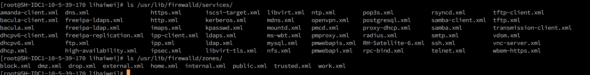

# 7. 命令行工具 firewall-cmd

命令行工具 firewall-cmd 支持全部防火墙特性, 基本应用如下:

```
firewall-cmd [--zone=zone] 动作 [--permanent]
```

注: 如果不指定\-\-zone 选项, 则为当前所在的默认区域, \-\-permanent 选项为是否将改动写入到区域配置文件中

## 7.1. 状态

- \-\-state \#\#查看防火墙的状态

- \-\-reload \#\#重新加载防火墙, 中断用户的连接, 将临时配置清掉, 加载配置文件中的永久配置

- \-\-complete\-reload \#\#重新加载防火墙, 不中断用户的连接(防火墙出严重故障时使用)

- \-\-panic\-on \#\#紧急模式, 强制关闭所有网络连接,\-\-panic\-off 是关闭紧急模式

## 7.2. 动作中的查看操作

- \-\-get\-icmptypes \#\#查看支持的所有 ICMP 类型

- \-\-get\-zones \#\#查看所有区域

- \-\-get\-default\-zone \#\#查看当前的默认区域

- \-\-get\-active\-zones \#\#查看当前正在使用的区域

- \-\-get\-services \#\#查看当前区域支持的服务

- \-\-list\-services \#\#查看当前区域开放的服务列表

- \-\-list\-all \#\#查看此区域内的所有配置, 类似与 iptables \-L \-n

## 7.3. 更改区域操作:

\-\-set\-default\-zone=work \#\#更改默认的区域

## 7.4. 新建或删除规则:

- \-\-add\-interface=eth0 \#\#将网络接口添加到默认的区域内
- \-\-add\-port=12222/tcp \-\-permanent \#\#添加端口到区域开放列表中
- \-\-add\-port=5000\-10000/tcp \-\-permanent \#\#将端口范围添加到开放列表中;
- \-\-add\-service=ftp \-\-permanent \#\#添加服务到区域开放列表中(注意服务的名称需要与此区域支持的服务列表中的名称一致)
- \-\-add\-source=192.168.1.1 \#\#添加源地址的流量到指定区域
- \-\-remove\-source=192.168.1.1 \#\#删除源地址的流量到指定区域
- \-\-change\-interface=eth1 \#\#改变指定的接口到其他区域
- \-\-remove\-service=http \#\#在 home 区域内将 http 服务删除在开放列表中删除
- \-\-add\-masquerade \#\#开启 SNAT(源地址转换)
- \-\-query\-masquerade \#\#查询 SNAT 的状态
- \-\-remove\-interface=eth0 \#\#将网络接口在默认的区域内删除
- \-\-query\-interface=eth0 \#\#确定该网卡接口是否存在于此区域
- \-\-add\-forward\-port=port=513:proto=tcp:toport=22:toaddr=192.168.100.101 ##端口转发

## 7.5. 应用示例

1、获取 firewalld 状态

```
firewall-cmd  --state
```

2、在**不改变状态**的条件下**重新加载防火墙**:

```
firewall-cmd  --reload
```

如果你使用\-\-complete\-reload, **状态信息将会丢失**.

3、获取支持的区域

```
firewall-cmd  --get-zones
```

这条命令输出用空格分隔的列表

4、获取**所有支持的服务**

```
firewall-cmd  --get-services
```

这条命令输出用空格分隔的列表.

**服务**是 firewalld 所使用的有关端口和选项的**规则集合**. 被启动的服务会在 firewalld 服务开启或者运行时自动加载. 默认情况下, 很多服务是有效的. 使用下面命令可列出有效的服务.

想要列出**默认有效的服务**, 也可以进入下面的目录也能够取得.

```
/usr/lib/firewalld/services/
```

想要创建自己的服务, 需要在下面的目录下定义它. 比如, 现在我想添加一个 rhmp 服务,  端口号 1935. 首先, 任选一个服务复制过来.

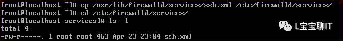

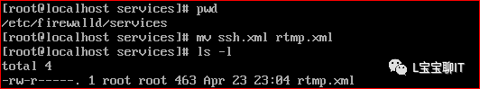

接下来打开并编辑文件的头部、描述、协议和端口号, 以供 RTMP 服务使用, 如下图所示.

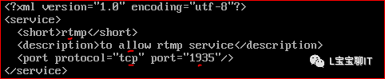

重启 firewalld 服务或者重新加载设置, 以激活这些设置.

```
# firewall-cmd --reload
```

为确认服务是否已经启动, 运行下面的命令获取有效的服务列表.

```
# firewall-cmd --get-services
```

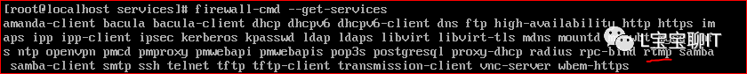

5、获取所有支持的 ICMP 类型

```
firewall-cmd  --get-icmptypes
```

这条命令输出用空格分隔的列表.

6、列出全部启用的区域的特性(即查询当前防火墙策略)

解释: 特性可以是定义的防火墙策略, 如: 服务、端口和协议的组合、端口/数据报转发、伪装、ICMP 拦截或自定义规则等

```
firewall-cmd  --list-all-zones
```

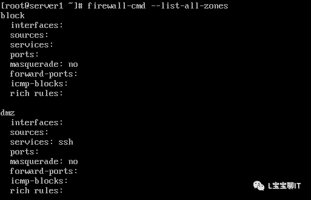

上面的命令将会列出每种区域如 block、dmz、drop、external、home、internal、public、trusted

以及 work. 如果区域还有其它详细规则(rich-rules)、启用的服务或者端口, 这些区域信息也会分别被罗列出来

7、输出区域全部启用的特性. 如果省略区域, 将显示默认区域的信息.

```
firewall-cmd [--zone=] --list-all
```

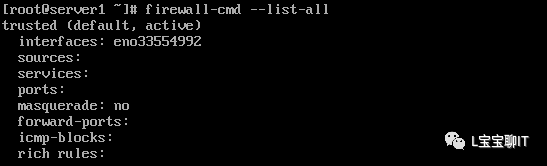

输出指定区域启动的特性

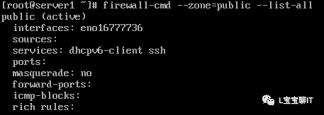

8、查看默认区域


public 区域是默认区域.

在文件/etc/firewalld/firewalld.conf 中定义成 DefaultZone=public.

9、设置默认区域

```
firewall-cmd --set-default-zone=区域名
```

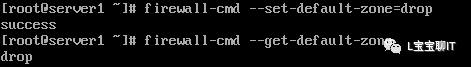

流入默认区域中配置的接口的新访问请求将被置入新的默认区域. 当前活动的连接将不受影响.

10、获取活动的区域

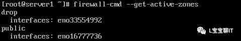

11、根据接口获取区域即需要查看哪个区域和这个接口绑定即查看某个接口是属于哪个 zone 的:

```
firewall-cmd --get-zone-of-interface=接口名
```


12、将接口(网卡)增加到区域


```
firewall-cmd [--zone=] --add-interface=接口名
```


如果接口不属于区域, 接口将被增加到区域. 如果区域被省略了, 将使用默认区域. 接口在重新加载后将重新应用.

13、修改接口所属区域

```
firewall-cmd [--zone=] --change-interface=接口名
```

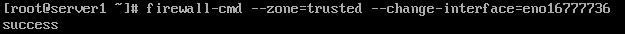

这个选项与 \-\-add\-interface 选项相似, 但是当接口已经存在于另一个区域的时候, 该接口将被添加到新的区域.

14、从区域中删除一个接口

```
firewall-cmd [--zone=] --remove-interface=接口名
```


注: 如果某个接口不属于任何 Zone, 那么这个接口的所有数据包使用默认的 Zone 的规则

15、查询区域中是否包含某接口

```
firewall-cmd [--zone=] --query-interface=接口名
```


如果区域被省略了, 将使用默认区域

16、列举区域中启用的服务

```
firewall-cmd [ --zone= ] --list-services
```


如果区域被省略了, 将使用默认区域查看 home 区域中启用服务

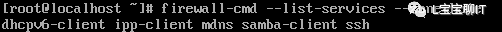

17、启用应急模式阻断所有网络连接, 以防出现紧急状况


18、禁用应急模式、

```
firewall-cmd  –panic-off
```
19、查询应急模式

```
firewall-cmd  --query-panic
```

其他相关的配置项可以查看 firewall-cmd 的手册页:

```
#man firewall-cmd
```

# 8. 处理运行时区域

**运行时**模式下对区域进行的**修改不是永久有效**的. 重新加载或者重启后修改将失效.

1、启用区域中的一种服务即给某个区域开启某个服务

```
firewall-cmd [--zone=区域]  --add-service=服务  [--timeout=秒数]
```

此操作启用区域中的一种服务. 如果未指定区域, 将使用默认区域. 如果设定了超时时间, 服务将只启用特定秒数.

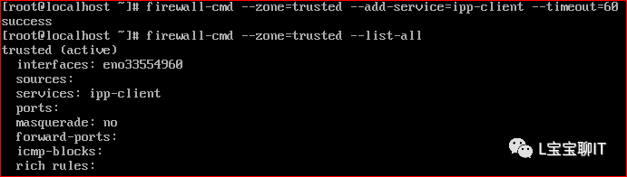

使区域中的 ipp\-client 服务生效 60 秒:

启用默认区域中的 http 服务:

```
firewall-cmd --add-service=http
```

2、禁用区域中的某种服务即关闭某个服务

```
firewall-cmd [--zone=区域]  --remove-service=服务
```
此举禁用区域中的某种服务. 如果未指定区域, 将使用默认区域.

例:禁止默认区域中的 http 服务:

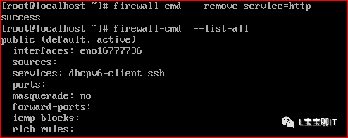

3、查询区域中是否启用了特定服务

```
firewall-cmd [--zone=区域] --query-service=服务
```


Yes 表示服务启用, no 表示服务关掉了.

4、启用区域端口和协议组合

```
firewall-cmd [--zone=区域] --add-port=portid[-portid]/protocol [--timeout=seconds]
```

此操作将启用端口和协议的组合. 端口可以是一个单独的端口或者是一个端口范围 - . 协议可以是 tcp 或 udp.

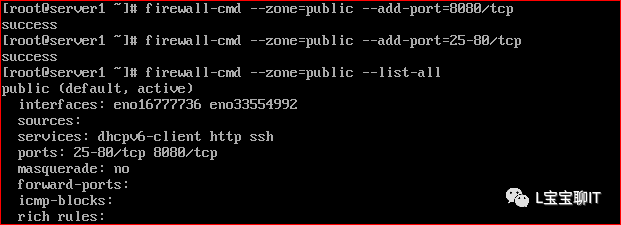

5、禁用端口和协议组合

```
firewall-cmd [--zone=区域] --remove-port=portid[-portid]/protocol
```


6、查询区域中是否启用了端口和协议组合

```
firewall-cmd [--zone=区域] --query-port=portid[-portid]/protocol
```


7、启用区域中的 IP 伪装功能

```
firewall-cmd [--zone=区域]  --add-masquerade
```
此操作启用区域的伪装功能. 私有网络的地址将被隐藏并映射到一个公有 IP. 这是地址转换的一种形式, 常用于路由. 由于内核的限制, 伪装功能仅可用于 IPv4.

8、禁用区域中的 IP 伪装

```
firewall-cmd [--zone=区域]  --remove-masquerade
```
9、查询区域的伪装状态

```
firewall-cmd [--zone=区域]  --query-masquerade
```
注意: 启用伪装功能的主机同时也需要开启转发服务:

```
# echo 1 > /proc/sys/net/ipv4/ip_forward
```
或

```
#vi   /etc/sysctl.conf    添加如下内容

net.ipv4.ip_forward  =   1
```

保存退出并执行\#sysctl  -p 使修改生效

10、启用区域的 ICMP 阻塞功能

```
firewall-cmd [--zone=区域] --add-icmp-block=icmp 类型
```
例:

```
firewal-cmd   --add-icmp-block=echo-request
```

此操作将启用选中的 Internet 控制报文协议(ICMP)报文进行阻塞.  ICMP 报文可以是请求信息或者创建的应答报文, 以及错误应答.

11、禁止区域的 ICMP 阻塞功能

```
firewall-cmd [--zone=区域]  --remove-icmp-block=icmp 类型
```
12、查询区域的 ICMP 阻塞功能

```
firewall-cmd[--zone=区域] --query-icmp-block=icmp 类型
```
13、在区域中启用端口转发或映射

```
firewall-cmd  [--zone=区域] --add-forward-port=port=portid[-portid]:proto=protocol[:toport=portid[-portid]][ :toaddres s=address [/mask]]
```

端口可以映射到另一台主机的同一端口, 也可以是同一主机或另一主机的不同端口. 端口号可以是一个单独的端口或者是端口范围 - . 协议可以为 tcp 或 udp. 目标端口可以是端口号或者是端口范围 - . 目标地址可以是 IPv4 地址. 受内核限制, 端口转发功能仅可用于 IPv4.

意思是凡是来从 external 进来的 22 端口的数据包全部转发到 211.106.65.50

```
firewall-cmd --zone=external --add-forward-port=port=22:proto=tcp:toaddress=211.106.65.50

```
14、禁止区域的端口转发或者端口映射

```
firewall-cmd [--zone=] --remove-forward-port=port=portid[-portid]:proto=protocol[:toport=portid[-portid]][ :toad dress=address [/mask]]
```
15、查询区域的端口转发或者端口映射

```
firewall-cmd [--zone=] --query-forward-port=port=portid[-portid]:proto=protocol[:toport=portid[-portid]] [ :toaddress=address[/mask]]
```

# 9. 处理永久区域

永久选项不直接影响运行时的状态. 这些选项仅在重载或者重启服务时可用. 为了使用运行时和永久设置, 需要分别设置两者. 选项--permanent 需要是永久设置的第一个参数.
1、获取永久选项所支持的服务

```
firewall-cmd --permanent --get-services
```
2、获取永久选项所支持的 ICMP 类型列表

```
firewall-cmd --permanent --get-icmptypes
```
3、获取支持的永久区域

```
firewall-cmd --permanent --get-zones
```
4、配置防火墙在 public 区域打开 http 协议, 并保存, 以致重启有效

```
firewall-cmd --permanent --zone=public --add-service=http
```
查看永久模式下 public 区域是否打开 http 服务.

```
firewall-cmd --permanent --zone=public --query-service=http
```
5、防火墙开放 8080 端口在 public 区域

```
firewall-cmd --permanent --zone=public --add-port=8080/tcp
```
6、命令行配置富规则:

查看富规则:

```
# firewall-cmd --list-rich-rules
```

创建富规则:

```
firewall-cmd--add-rich-rule 'rule family=ipv4 source address=10.35.89.0/24 service name=ftplog prefix="ftp" level=info accept' --permanent

firewall-cmd --add-rich-rule 'rule family=ipv4 sourceaddress=10.35.89.0/24 port port=80 protocol=tcp log prefix="80"level=info accept' --permanent

firewall-cmd --add-rich-rule rule family="ipv4" sourceaddress="192.168.10.30" forward-port port="808"protocol="tcp" to-port="80" to-addr="10.10.10.2"
```
富规则中使用伪装功能可以更精确详细的限制:

```
firewall-cmd --add-rich-rule 'rule family=ipv4 source address=10.10.10.2/24 masquerade'
```
仅允许部分 IP 访问本机服务配置

```
firewall-cmd --permanent --zone=public --add-rich-rule="rulefamily="ipv4" source address="192.168.0.0/24" servicename="http" accept"
```
禁止远程 IP 访问 ssh

```
firewall-cmd--permanent --zone=public --add-rich-rule='rule family=ipv4 sourceaddress=192.168.0.0/24 service name=sshreject'
```
7、删除 rich 规则

```
firewall-cmd --permanent --zone=public --remove-rich-rule='rule family=ipv4 sourceaddress=192.168.0.0/24 service name=sshreject'
```
8、仅允许部分 IP 访问本机端口配置

```
firewall-cmd --permanent --zone=public--add-rich-rule="rule family="ipv4" sourceaddress="192.168.0.0/24"port protocol="tcp"port="8080" accept"
```
9、创建 rich 规则, 可以指定日志的前缀和输出级别

```
firewall-cmd --permanent --zone=public --add-rich-rule="rulefamily="ipv4" source address="192.168.0.4/24"port port=8080protocol="tcp" log prefix=proxy level=warning accept"
```

可以通过查看/var/log/messages 日志文件

10、端口转发. 实验环境下, desktop 访问 server 的 5423 端口, 将访问 server 的 80 端口.

Server 上的操作: (172.25.0.10 是 desktop 的 IP 地址)

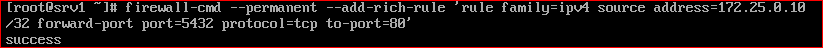

11、172.25.1.0/24 网段内的客户端不能访问主机的 SSH

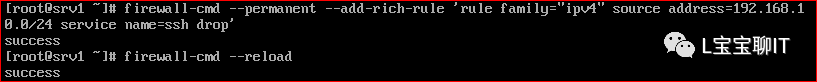

12、也可通过配置以下 XML 文件, 进行对防火墙的配置修改

```
#cat /etc/firewalld/zones/public.xml

<?xmlversion="1.0" encoding="utf-8"?>
<zone>
    <short>Public</short>
    <description>Foruse in public areas. You do not trust the other computers on networks to not harmyour computer. Only selected incoming connections areaccepted.</description>
    <servicename="dhcpv6-client"/>
    <servicename="ssh"/>
    <rulefamily="ipv4">
        <sourceaddress="192.168.0.4/24"/>
        <servicename="http"/>
        <accept/>
    </rule>
</zone>
```

netfilter 防火墙总是容易受到规则顺序的影响, 因为一条规则在链中没有固定的位置. 在一条规则之前添加或者删除规则都会改变此规则的位置. 在静态防火墙模型中, 改变防火墙就是重建一个干净和完善的防火墙设置, 默认链通常也没有安全的方式添加或删除规则而不影响其他规则.

动态防火墙有附加的防火墙功能链. 这些特殊的链按照已定义的顺序进行调用, 因而向链中添加规则将不会干扰先前调用的拒绝和丢弃规则. 从而利于创建更为合理完善的防火墙配置. 下面是一些由守护进程创建的规则, 过滤列表中启用了在公共区域对 ssh , mdns 和 ipp\-client 的支持:

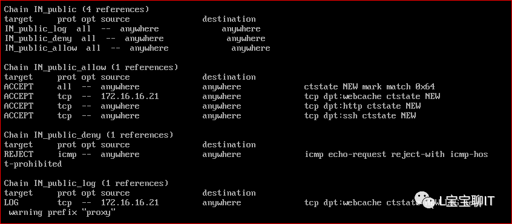

图形化配置工具

firewall  daemon 主要的配置工具是 firewall-config. 它支持防火墙的所有特性. 管理员也可以用它来改变系统或用户策略.

命令行客户端

firewall-cmd 是命令行下提供大部分图形工具配置特性的工具.

注: 要想了解更多 firewall 防火墙更多知识可以查看 firewall 的相关手册页:

man  -k  firewalld

若要查看 rich\-rule 手册页

man  firewalld.richlanguage

# 10. Rich 规则

当基本 firewalld 语法规则不能满足要求时, 可以使用以下更复杂的规则

\.rich\-rules 富规则, 功能强,表达性语言,查看帮助: man 5 firewalld.richlanguage

\.rich 规则比基本的 firewalld 语法实现更强的功能, 不仅实现允许/拒绝, 还可以实现**日志 syslog**和 auditd, 也可以实现端口转发, 伪装和限制速率

rich 规则实施顺序有以下四点

a. 该区域的端口转发, 伪造规则

b. 该区域的日志规则

c. 该区域的允许规则

d. 该区域的拒绝规则

每个匹配的规则都生效, 所有规则都不匹配, 该区域默认规则生效;

Rich 规则语法:

Rich 规则选项:
```
--add-rich-rule='rule' ##新建 rich 规则
--remove-rich-rule='rule' ##删除 rich 规则
--query-rich-rule='rule' ##查看单条 rich 规则
--list-rich-rules ##查看 rich 规则列表
```


Rich 规则示例:
```
#拒绝从 192.168.0.11 的所有流量
firewall-cmd --permanent --zone=cla***oom --add-rich-rule='rule family=ipv4 source address=192.168.0.11/32 reject'
```

```
#限制每分钟只有两个连接到 ftp 服务
firewall-cmd --add-rich-rule='rule service name=ftp limitvalue=2/m accept'
```

```
#抛弃 esp 协议的所有数据包
firewall-cmd --permanent --add-rich-rule='rule protocol value=esp drop'
```
```
#接受所有 192.168.1.0/24 子网端口范置 7900-7905 的 TCP 流量
firewall-cmd --permanent --zone=vnc --add-rich-rule='rule family=ipv4 source address=192.168.1.0/24 port port=7900-7905 protocol=tcp accept'
```

```
##开启 SNAT
firewall-cmd --permanent --add-rich-rule='rule family=ipv4 source address=192.168.0.0/24 masquerade'
```

```
##使用 rule 规则实现端口转发, to-addr 选项如果不指定默认转发到本机
firewall-cmd --permanent --add-rich-rule='rule family=ipv4 source address=192.168.100.0/24 forward-port port=80 protocol=tcp to-port=8080 to-addr=192.168.100.100'
```

# 11. 理解直接接口

FirewallD 包含了一个名为直接接口(direct interface)的概念, 意思是可以直接通过 iptables、ip6tables 和 ebtables 的规则. 直接接口适用于应用程序, 不适用于用户. 如果不熟悉 iptables, 那么使用直接接口是很危险的, 因为可能会导致防火墙被入侵.

FirewallD 保持对所增加规则项的追踪, 所以能质询 FirewallD, 发现由使用直接端口模式的程序造成的更改. 要使用直接端口, 增加–direct 选项到 firewall-cmd 命令来使用.

# 12. 改用 iptables 服务

在 CentOS/RHEL 7 系统中, 要用 iptables 和 ip6tables 服务代替 FirewallD 服务, 需要以 root 身份运行以下命令, 先禁用 FirewallD:

```
# systemctl disable firewalld
# systemctl stop firewalld
```

然后安装 iptables-services 程序包, 以 root 身份输入以下命令:

```
# yum install iptables-services
```

iptables-services 程序包包含了 iptables 和 ip6tables 服务. 然后, 以 root 身份运行 iptables 和 ip6tables 命令:

```
# systemctl start iptables
# systemctl start ip6tables
# systemctl enable iptables
# systemctl enable ip6tables
```

# 13. 启动图形化防火墙设置工具

用命令行启动图形化防火墙配置工具, 则以 root 用户身份输入以下命令:

```
# firewall-config
```

# 14. 参考

- Linux 基础——Firewalld 防火墙: https://cloud.tencent.com/developer/article/1152579
- CentOS 7 防火墙服务 FirewallD 指南: https://www.linuxidc.com/Linux/2016-10/136431.htm
- Centos7-----firewalld 详解: https://blog.51cto.com/11638832/2092203