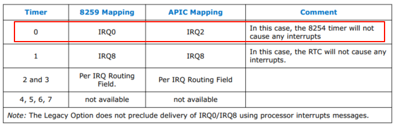

<!-- @import "[TOC]" {cmd="toc" depthFrom=1 depthTo=6 orderedList=false} -->

<!-- code_chunk_output -->

- [1. IRQ](#1-irq)
- [2. Pin](#2-pin)
- [3. GSI](#3-gsi)
- [4. Vector](#4-vector)
- [5. 小结](#5-小结)

<!-- /code_chunk_output -->

# 1. IRQ

IRQ 是 PIC (8259A) 时代的产物, 但是如今可能还会见到 **IRQ 线** 或者 **IRQ 号** 等各种说法.

在 PIC (8259A) 中断架构下, 通常将两块 8259A 芯片级联, 支持 16 个中断, 由于 **ISA 设备**通常连接到**固定的** PIC (8259A) **中断引脚**, 因此设备的 IRQ 号通常是指它所连接的固定的 8259A 引脚号. 8259A 有 8 个中断引脚 (`IR0 ~ IR7`), 那么连接到这些**主 8259A 芯片** `IR0 ~ IR7` 引脚的设备中断号分别对应 `IRQ0 ~ IRQ7`, 连接到**从 8259A 芯片** `IR0 ~ IR7` 引脚的设备对应的中断号为 `IRQ8 ~ IRQ15`. 而 **IRQ 线**可以理解为设备与这些引脚的连线, 命名方式通常也为 **IRQx**, 它们通常与中断控制器引脚一一对应, 故使用 IRQ 时应当注意相应的情境.

IRQ 暗示着**中断优先级**, 例如 IRQ 0 比 IRQ 3 有着更高的优先级. 在传统的 x86 系统中, **IRQ 是有限的**, 通常有 16 个 (IRQ0 - IRQ15), 这会导致所谓的 IRQ 共享问题, 即多个设备可能需要使用同一个 IRQ.

当前进到 APIC 时代后, 或许是出于习惯, 人们仍习惯用 **IRQ** 表示**一个设备的中断号**, 变成了一个**纯软件概念**, 但对于 **16 以下的 IRQ**, 它们可能**不再与 I/O APIC 的管脚对应**, 例如 PIT 此时接的是 2 号管脚.

# 2. Pin

Pin 是 **中断控制器** 的 **中断引脚号**,

* 对于 8259A 而言, 其 Pin 取值为 0 ~ 7;

* 对于 IOAPIC, 其 Pin 取值为 0 ~ 23.

通常它表示 IOAPIC 的管脚 (前面说了, PIC 时代我们用 IRQ). Pin 的最大值受 IOAPIC 管脚数限制, 目前取值范围是 `[0, 23]`.

# 3. GSI

GSI 是 ACPI (Advanced Configuration and Power Interface, 高级配置和电源管理接口) 引入的概念, 全称是 Global System Interrupt, 它为系统中**每个中断控制器的输入引脚(！！！**)指定了一个**全局统一的唯一的编号**.

例如系统中有多个 IO APIC, **每个 IOAPIC** 都会被 **BIOS** 分配一个**基础 GSI** (`GSI Base`), 每个 IOAPIC 中断引脚对应的 GSI 为 **基础 GSI + Pin**. 比如有 3 个 IOAPIC: IOAPIC 0 ~ 2.

* IOAPIC 0 的基础 GSI 为 0, 有 24 个引脚, 每个管脚的 GSI = GSI base + pin, 故 IOAPIC0 的 GSI 范围为 `[0~23]`.

* IOAPIC 1 有 16 个管脚, GSI base 为 24, GSI 范围为 `[24, 39]`, 依次类推.

在 APIC 系统中,

* **IRQ** 和 **GSI** 通常会被混用, **15 号以上**的 IRQ 号与 GSI **相等**;

* 而 **15 号以下**的 IRQ 号与 ISA 设备高度耦合, **只有**当相应的 **ISA 设备**按照对应的 **IRQ** 号连接到 **IOAPIC 0 的 1~15 引脚**时, IRQ 才和 GSI 相等, 这种情况称为一致性映射. 而若 IRQ 与 GSI 引脚不一一对应, **ACPI** 将会维护一个 **ISO** (Interrupt Source Override, 中断源覆盖) 结构描述 **IRQ 与 GSI** 的**映射**.

如 PIT (Programmable Interrupt Timer, 可编程中断时钟) 接 **PIC** 的 **IR0** 引脚, 因此其 IRQ 为 0; 但当接 **IOAPIC** 时, 它通常接在 **2 号中断引脚**, 所以其 GSI 为 2. 而在 QEMU/KVM 中, **GSI** 和 **IRQ** 完全等价, 不符合前述基础 GSI + Pin 的映射关系.

# 4. Vector

Vector 是 CPU/OS 的概念, 是中断在 IDT 表中的索引. 每个 IRQ (或 GSI) 都对应一个 Vector.

* 在 **PIC** 模式下, IRQ 对应的 vector = start vector + IRQ;

* 在 **APIC** 模式下, IRQ/GSI 的 vector 由操作系统分配.

x86 中通常包含 256 个中断向量号, 0~31 号中断向量号是 x86 预定义的, 32~255 号则由软件定义.

# 5. 小结

IRQ, GSI 和 Vector 都可以唯一标识系统中的中断来源, 

* **IRQ** 和 **GSI** 的**映射关系**以及 **GSI** 和 **Pin** 的映射关系由 **ACPI** 设置,

* **IRQ** 和 **Vector** 的映射关系由**操作系统**设置.

