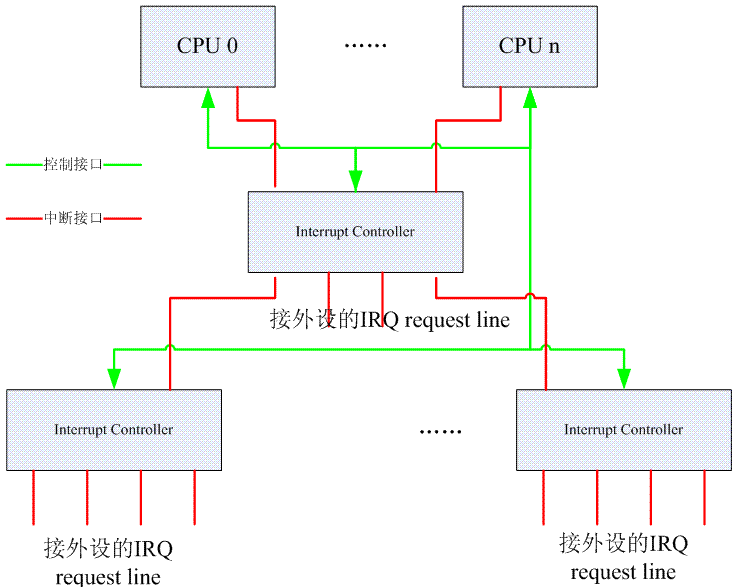

<!-- @import "[TOC]" {cmd="toc" depthFrom=1 depthTo=6 orderedList=false} -->

<!-- code_chunk_output -->

- [1 前言](#1-前言)
- [2 中断系统相关硬件描述](#2-中断系统相关硬件描述)
  - [2.1 HW 中断系统的逻辑 block 图](#21-hw-中断系统的逻辑-block-图)
  - [2.2 多个 Interrupt controller 和多个 cpu 之间的拓扑结构](#22-多个-interrupt-controller-和多个-cpu-之间的拓扑结构)
  - [2.3 Interrupt controller 把中断事件送给哪个 CPU?](#23-interrupt-controller-把中断事件送给哪个-cpu)
  - [2.4 更多的思考](#24-更多的思考)
- [3 中断子系统相关的软件框架](#3-中断子系统相关的软件框架)
- [4 中断子系统文档规划](#4-中断子系统文档规划)

<!-- /code_chunk_output -->

# 1 前言

一个合格的 linux 驱动工程师需要对 kernel 中的中断子系统有深刻的理解, 只有这样, 在写具体 driver 的时候才能:

1、**正确的使用 linux kernel 提供的的 API**, 例如最著名的**request\_threaded\_irq**(**request\_irq**)接口

2、正确使用**同步机制**保护驱动代码中的**临界区**

3、正确的使用 kernel 提供的**softirq、tasklet、workqueue 等机制**来完成具体的中断处理

基于上面的原因, 我希望能够通过一系列的文档来描述清楚 linux kernel 中的中断子系统方方面面的知识. 一方面是整理自己的思绪, 另外一方面, 希望能够对其他的驱动工程师(或者想从事 linux 驱动工作的工程师)有所帮助.

# 2 中断系统相关硬件描述

中断硬件系统主要有**三种器件参与**, 各个**外设**、**中断控制器**和**CPU**. 各个**外设**提供**irq request line**, 在**发生中断事件**的时候, 通过 irq request line 上的**电气信号**向 CPU 系统请求处理. **外设的 irq request line 太多**, CPU 需要一个小伙伴帮他, 这就是**Interrupt controller**. Interrupt Controller 是**连接外设中断系统**和**CPU 系统的桥梁**. 根据外设 irq request line 的多少, Interrupt Controller 可以级联. **CPU**的主要功能是**运算**, 因此**CPU 并不处理中断优先级**, 那是 Interrupt controller 的事情.

对于 CPU 而言, 一般有**两种中断请求**, 例如: 对于 ARM, 是 IRQ 和 FIQ 信号线, 分别让 ARM 进入 IRQ mode 和 FIQ mode. 对于 X86, 有可屏蔽中断和不可屏蔽中断.

本章节不是描述具体的硬件, 而是使用了 HW block 这样的概念. 例如 CPU HW block 是只 ARM core 或者 X86 这样的实际硬件 block 的一个逻辑描述, 实际中, 可能是任何可能的 CPU block.

## 2.1 HW 中断系统的逻辑 block 图

系统中有**若干个 CPU block**用来**接收中断事件并进行处理**, **若干个 Interrupt controller**形成**树状的结构**, **汇集**系统中**所有外设的 irq request line**, 并将**中断事件分发**给**某一个 CPU block**进行处理. 从**接口层面**看, 主要有**两类接口**, 一种是**中断接口**. 有的实现中, 具体中断接口的形态就是**一个硬件的信号线**, 通过**电平信号**传递**中断事件**(ARM 以及 GIC 组成的中断系统就是这么设计的). 有些系统采用了**其他的方法**来传递中断事件, 比如**x86＋APIC**(Advanced Programmable Interrupt Controller)组成的系统, 每个 x86 的核有一个 Local APIC, 这些**Local APIC 们**通过**ICC(Interrupt Controller Communication)bus**连接到**IO APIC**上. **IO APIC**收集**各个外设的中断**, 并**翻译成总线上的 message**, 传递给**某个 CPU**上的**Local APIC**. 因此, 上面的红色线条也是逻辑层面的中断信号, 可能是实际的 PCB 上的铜线(或者 SOC 内部的铜线), 也可能是一个 message 而已. 除了中断接口, CPU 和 Interrupt Controller 之间还需要有控制信息的交流. Interrupt Controller 会开放一些寄存器让 CPU 访问、控制.

## 2.2 多个 Interrupt controller 和多个 cpu 之间的拓扑结构

Interrupt controller 有的是支持**多个 CPU core 的(例如 GIC、APIC 等**), 有的**不支持**(例如 S3C2410 的中断控制器, X86 平台的**PIC**等).

如果硬件平台中**只有一个 GIC**的话, 那么通过**控制该 GIC 的寄存器**可以将**所有的外设中断**, 分发给**连接在该 interrupt controller**上的**CPU**.

如果有多个 GIC 呢(或者级联的 interrupt controller 都支持 multi cpu core)?假设我们要设计一个非常复杂的系统, 系统中有**8 个 CPU**, 有**2000 个外设中断**要处理, 这时候你如何设计系统中的 interrupt controller?如果使用**GIC**的话, 我们需要**两个 GIC(一个 GIC 最多支持 1024 个中断源**), 一个是**root GIC**, 另外一个是**secondary GIC**. 这时候, 你有两种方案:

(1)把**8 个 cpu**都连接到**root GIC**上, secondary GIC 不接 CPU. 这时候原本挂接在 secondary GIC 的外设中断会输出到某个 cpu, 现在, 只能是(通过某个 cpu interface 的 irq signal)输到 root GIC 的某个 SPI 上. 对于软件而言, 这是一个比较简单的设计, secondary GIC 的 cpu interface 的设定是固定不变的, 永远是从一个固定的 CPU interface 输出到 root GIC. 这种方案的坏处是: 这时候 secondary GIC 的 PPI 和 SGI 都是没有用的了. 此外, 在这种设定下, 所有连接在 secondary GIC 上的外设中断要送达的 target CPU 是统一处理的, 要么送去 cpu0, 要么 cpu 5, 不能单独控制.

(2)当然, 你也可以让每个 GIC 分别连接 4 个 CPU core, root GIC 连接 CPU0\~CPU3, secondary GIC 连接 CPU4\~CPU7. 这种状态下, 连接在 root GIC 的中断可以由 CPU0\~CPU3 分担处理, 连接在 secondary GIC 的中断可以由 CPU4\~CPU7 分担处理. 但这样, 在中断处理方面看起来就体现不出 8 核的威力了.

注: 上一节中的逻辑 block 示意图采用的就是方案一.

## 2.3 Interrupt controller 把中断事件送给哪个 CPU?

毫无疑问, 只有支持 multi cpu core 的中断控制器才有这种幸福的烦恼. 一般而言, 中断控制器可以把中断事件上报给一个 CPU 或者一组 CPU(包括广播到所有的 CPU 上去). 对于**外设类型的中断**, 当然是送到一个 cpu 上就 OK 了, 我看不出来要把这样的中断送给多个 CPU 进行处理的必要性. 如果送达了多个 cpu, 实际上, 也**应该只有一个 handler 实际和外设进行交互**, 另外**一个 cpu 上的 handler**的动作应该是这样的: 发现该**irq number 对应的中断**已经被**另外一个 cpu 处理**了, 直接**退出 handler**, 返回**中断现场**. IPI 的中断不存在这个限制, **IPI**更像一个**CPU 之间通信的机制**, 对这种中断广播应该是毫无压力.

实际上, 从用户的角度看, 其需求是相当复杂的, 我们的目标可能包括:

(1)让**某个 IRQ number**的中断由**某个特定的 CPU**处理

(2)让**某个**特定的中断由**几个 CPU 轮流处理**

......

当然, 具体的需求可能更加复杂, 但是如何**区分软件和硬件的分工**呢?让硬件处理那么复杂的策略其实是不合理的, 复杂的逻辑如果由硬件实现, 那么就意味着更多的晶体管, 更多的功耗. 因此, 最普通的做法就是为 Interrupt Controller 支持的**每一个中断**设定一个**target cpu 的控制接口**(当然应该是**以寄存器形式**出现, 对于**GIC**, 这个寄存器就是**Interrupt processor target register**). 系统有多个 cpu, 这个控制接口就有多少个 bit, 每个 bit 代表一个 CPU. 如果该 bit 设定为 1, 那么该 interrupt 就上报给该 CPU, 如果为 0, 则不上报给该 CPU. 这样的硬件逻辑比较简单, 剩余的控制内容就交给软件好了. 例如如果系统有两个 cpu core, 某中断想轮流由两个 CPU 处理. 那么当 CPU0 相应该中断进入 interrupt handler 的时候, 可以将 Interrupt processor target register 中本 CPU 对应的 bit 设定为 0, 另外一个 CPU 的 bit 设定为 1. 这样, 在下次中断发生的时候, interupt controller 就把中断送给了 CPU1. 对于 CPU1 而言, 在执行该中断的 handler 的时候, 将 Interrupt processor target register 中 CPU0 的 bit 为设置为 1, disable 本 CPU 的比特位, 这样在下次中断发生的时候, interupt controller 就把中断送给了 CPU0. 这样软件控制的结果就是实现了特定中断由 2 个 CPU 轮流处理的算法.

## 2.4 更多的思考

面对这个 HW 中断系统之逻辑 block diagram, 我们其实可以提出更多的问题:

(1)中断控制器发送给 CPU 的中断是否可以收回?重新分发给另外一个 CPU?

(2)系统中的中断如何分发才能获得更好的性能呢?

(3)中断分发的策略需要考虑哪些因素呢?

......

很多问题其实我也没有答案, 慢慢思考, 慢慢逼近真相吧.

# 3 中断子系统相关的软件框架

linux kernel 的中断子系统相关的软件框架图如下所示:

由上面的 block 图, 我们可知 linux kernel 的中断子系统分成 4 个部分:

(1)硬件无关的代码, 我们称之 Linux kernel**通用中断处理模块**. 无论是哪种 CPU, 哪种 controller, 其中断处理的过程都有一些相同的内容, 这些相同的内容被抽象出来, 和 HW 无关. 此外, **各个外设的驱动代码中**, 也希望能用一个统一的接口实现 irq 相关的管理(不和具体的中断硬件系统以及 CPU 体系结构相关)这些"通用"的代码组成了 linux kernel interrupt subsystem 的核心部分.

(2)**CPU architecture 相关的中断处理**.  和系统使用的具体的 CPU architecture 相关.

(3)**Interrupt controller 驱动代码**. 和系统使用的 Interrupt controller 相关.

(4)**普通外设的驱动**. 这些驱动将使用 Linux kernel**通用中断处理模块的 API**来实现自己的驱动逻辑.

# 4 中断子系统文档规划

中断相关的文档规划如下:

1、linux kernel 的中断子系统之(一), 也就是本文, 其实是一个导论, 没有实际的内容, 主要是给读者一个大概的软硬件框架.

2、linux kernel 的中断子系统之(二): irq domain 介绍. 主要描述如何将一个 HW interrupt ID 转换成 IRQ number.

3、linux kernel 的中断子系统之(三): IRQ number 和中断描述符. 主要描述中断描述符相关的数据结构和接口 API.

4、linux kernel 的中断子系统之(四): high level irq event handler.

5、linux kernel 的中断子系统之(五): driver API. 主要以一个普通的驱动程序为视角, 看待 linux interrupt subsystem 提供的 API, 如何利用这些 API, 分配资源, 是否资源, 如何处理中断相关的同步问题等等.

6、linux kernel 的中断子系统之(六): ARM 中断处理过程, 这份文档以 ARM CPU 为例, 描述 ARM 相关的中断处理过程

7、linux kernel 的中断子系统之(七): GIC 代码分析, 这份文档是以一个具体的 interrupt controller 为例, 描述 irq chip driver 的代码构成情况.

8、linux kernel 的中断子系统之(八): softirq

9、linux kernel 的中断子系统之(九): tasklet