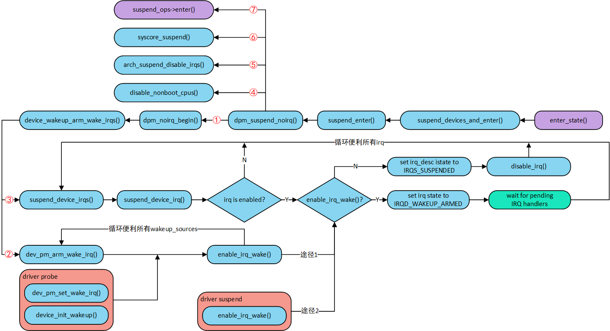
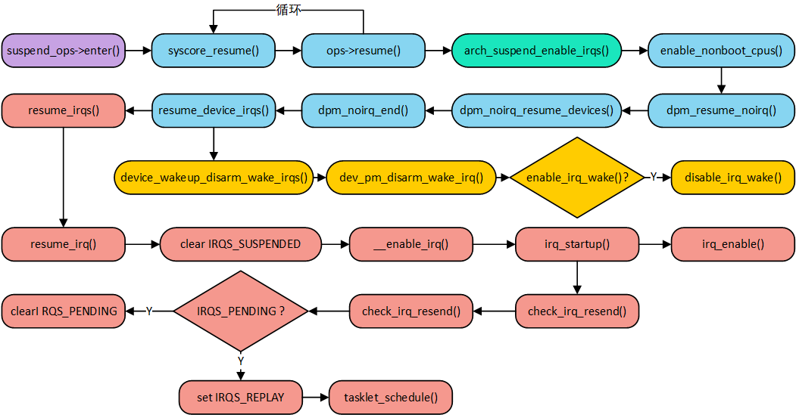
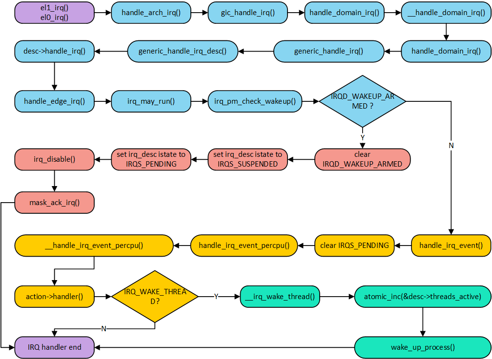

<!-- @import "[TOC]" {cmd="toc" depthFrom=1 depthTo=6 orderedList=false} -->

<!-- code_chunk_output -->

- [前言](#前言)
- [中断唤醒流程](#中断唤醒流程)
  - [enable_irq_wake](#enable_irq_wake)
  - [Suspend to RAM 流程](#suspend-to-ram-流程)
  - [resume 流程](#resume-流程)
  - [system core operations 有什么用?](#system-core-operations-有什么用)
  - [gic interrupt controller 中断执行流程](#gic-interrupt-controller-中断执行流程)
  - [dpm_resume_noirq()](#dpm_resume_noirq)
- [reference](#reference)

<!-- /code_chunk_output -->

# 前言

曾几何时, 不知道你是否想过**外部中断是如何产生**的呢? 又是**如何唤醒系统**的呢? 在项目中, 一般具有**中断唤醒**的**设备**会有**一个 interrupt pin 硬件**连接到 SoC 的 **gpio pin**. 一般来说, 当**设备需要唤醒系统**的时候, 会通过**改变 interrupt pin 电平状态**, 而 SoC 会检测到这个变化, 将 **SoC** 从睡眠中唤醒, 该设备通过相关的子系统通知上层应用做出相应的处理. 这就是中断唤醒的过程. 说起来很简洁, 可以说是涵盖了软硬件两大块. 是不是?

为了**使能设备的唤醒能力**, 设备**驱动**中会在系统 **suspend** 的时候通过 `enable_irq_wake(irq)` 接口**使能**设备 SoC 引脚的**中断唤醒能力**. 然后呢? 然后当然是万事大吉了, 静静的等待设备中断的到来, 最后唤醒系统. 假设我们做一款手机, 手机有一个压感传感器, 重压点亮屏幕, 轻压在灭屏的时候无响应, 在亮屏的时候作为 home 键功能, 压力值通过 i2c 总线读取(描述挺像 iPhone8 的 home 键！). 假如有一天, 你突然发现重压按键, 屏幕不亮. 于是你开始探究所以然, 聪明的你一定会先去用示波器测量 irq pin 的波形, 此时你发现了重压按键, 的确产生了一个电平信号的变化, 此时可就怪不得硬件了. 而你又发现插入 USB 使用 **ADB** 工具抓取 log 的情况下(Android 的 adb 工具需要通过 USB 协议通信, 一般不会允许系统休眠), 重压可以亮屏. 此时, 我觉得就很有可能是唤醒系统了, 但是系统醒来后又睡下去了, 而你注册的中断服务函数中的代码没有执行完成就睡了. 什么情况下会出现呢? 试想一下, 你通过 `request_irq` 接口注册的 handle 函数中 queue work 了一个延迟工作队列(主要干活的, 类似下半部吧), 由于时间太长, 还没来得及调度呢, 系统又睡下了, 虽然你不愿意, 但是事情就是可能这样发生的. 那这一切竟然是为什么呢?作为驱动工程师最关注的恐怕就是如何避开这些问题呢?

1) **设备唤醒 cpu 之后**是立即跳转**中断向量表**指定的**位置**吗? 如果不是, 那么是什么时候才会跳转呢?

2) 已经跳转到**中断服务函数**开始执行代码, 后续就会调用你注册的**中断 handle 代码**吗? 如果不是, 那中断服务函数做什么准备呢? 而你注册的中断 handle 又会在什么时候才开始执行呢?

3) 假如 `register_thread_irq` 方式注册的 threaded irq 中调用 msleep(1000), 睡眠 1 秒, 请问系统此时会继续睡下去而不调度回来吗? 因此导致 msleep 后续的操作没有执行.

4) 如果在**注册的中断 handle** 中把主要的操作都放在 **delayed work** 中, 然后 queue delayed work, work 延时 1 秒执行, 请问系统此时会继续睡下去而没调度 delayed work 吗? 因此导致 delayed work 中的操作没有执行呢?

5) 如果 4) 成立的话, 我们该如何编程避免这个问题呢?

好了, 本片文章就为你解答所有的疑问.

注: 文章代码分析基于 linux-4.15.0-rc3.

# 中断唤醒流程

现在还是假设你有一个上述的设备, 现在你开始编写 driver 代码了. 假设部分代码如下:

```c
static irqreturn_t smcdef_event_handler(int irq, void *private)
{
    /* do something you want, like report input events through input subsystem */

    return IRQ_HANDLED;
}

static int smcdef_suspend(struct device *dev)
{
    enable_irq_wake(irq);
}

static int smcdef_resume(struct device *dev)
{
    disable_irq_wake(irq);
}

static int smcdef_probe(struct i2c_client *client,
        const struct i2c_device_id *id)
{
    /* ... */
    request_thread_irq(irq,
            smcdef_event_handler,
            NULL,
            IRQF_TRIGGER_FALLING,
            "smcdef",
            pdata);

    return 0;
}

static int smcdef_remove(struct i2c_client *client)
{
    return 0;
}

static const struct of_device_id smcdef_dt_ids[] = {
    {.compatible = "wowo,smcdef" },
    { }
};
MODULE_DEVICE_TABLE(of, smcdef_dt_ids);

static SIMPLE_DEV_PM_OPS(smcdef_pm_ops, smcdef_suspend, smcdef_resume);

static struct i2c_driver smcdef_driver = {
    .driver = {
        .name             = "smcdef",
        .of_match_table = of_match_ptr(smcdef_dt_ids),
        .pm                = &smcdef_pm_ops,
    },
    .probe  = smcdef_probe,
    .remove = smcdef_remove,
};
module_i2c_driver(smcdef_driver);

MODULE_AUTHOR("smcdef");
MODULE_DESCRIPTION("IRQ test");
MODULE_LICENSE("GPL");
```

在 probe 函数中通过 `request_thread_irq` 接口**注册**驱动的**中断服务函数** `smcdef_event_handler`, 注意这里 `smcdef_event_handler` 的执行环境是**中断上下文**, `thread_fn` 的方式下面也会介绍.

## enable_irq_wake

当系统睡眠(`echo "mem" > /sys/power/state`)的时候, 回想一下 suspend 的流程就会知道, 最终会调用 `smcdef_suspend` **使能中断唤醒功能**. `enable_irq_wake` 主要工作是在 `irq_set_irq_wake` 中完成, 代码如下:

```c
int irq_set_irq_wake(unsigned int irq, unsigned int on)
{
    unsigned long flags;
    struct irq_desc *desc = irq_get_desc_buslock(irq, &flags, IRQ_GET_DESC_CHECK_GLOBAL);
    int ret = 0;

    /* wakeup-capable irqs can be shared between drivers that
     * don't need to have the same sleep mode behaviors.
     */
    if (on) {
        if (desc->wake_depth++ == 0) {
            // 第一
            ret = set_irq_wake_real(irq, on);
            if (ret)
                desc->wake_depth = 0;
            else
                // 第二
                irqd_set(&desc->irq_data, IRQD_WAKEUP_STATE);
        }
    } else {
        if (desc->wake_depth == 0) {
            WARN(1, "Unbalanced IRQ %d wake disable\n", irq);
        } else if (--desc->wake_depth == 0) {
            ret = set_irq_wake_real(irq, on);
            if (ret)
                desc->wake_depth = 1;
            else
                irqd_clear(&desc->irq_data, IRQD_WAKEUP_STATE);
        }
    }
    irq_put_desc_busunlock(desc, flags);
    return ret;
}
```

1) 首先在 `set_irq_wake_real` 函数中通过 `irq_chip` 的 `irq_set_wake` 回调函数设置 **SoC 相关 wakeup 寄存器使能中断唤醒功能**, 如果不使能的话, 即使设备在那疯狂的产生中断 signal, SoC 可不会理睬你哦！

2) 设置 irq 的 state 为 `IRQD_WAKEUP_STATE`, 这步很重要, suspend 流程会用到的.

## Suspend to RAM 流程

先画个图示意一下系统 Suspend to RAM 流程. 从 `enter_state` 开始到 `suspend_ops->enter()` 结束. 对于 `suspend_ops->enter()` 调用, 我的理解是 CPU 停在这里了, 待到醒来的时候, 就从这里开始继续前行的脚步.



1) `enable_irq_wake()` 可以有**两种途径**, 一是在 **driver** 的 `suspend()` 函数中由**驱动开发者主动调用**; 二是在 **driver** 的 `probe` 函数中调用 `dev_pm_set_wake_irq()` 和 `device_init_wakeup()`. 因为 suspend 的过程中会通过 `dev_pm_arm_wake_irq()` 打开所有 wakeup source 的 irq wake 功能. 我更推荐途径 1, 因为系统已经帮我们做了, 何必重复造轮子呢！

2) 对于已经 enable 并且使能 wakeup 的 irq, 置位 `IRQD_WAKEUP_ARMED`, 然后等待 IRQ handler 和 threaded handler 执行完成. 后续详细分析这一块.

3) 针对仅仅 enable 的 irq, 设置 `IRQS_SUSPENDED` 标志位, 并 **disable irq**.

4) 图中第4)步关闭 noboot cpu, 紧接着第5)步 **diasble boot cpu 的 irq**, 即 **cpu 不再响应中断**.

5) 在 cpu sleep 之前进行最后一步操作就是 syscore suspend. 既然是最后 suspend, 那一定是其他 device 都依赖的系统核心驱动. 后面说说什么的设备会注册 syscore suspend.

## resume 流程

假设我们使用的是 gic-v3 代码, **边沿触发中断设备**. 现在**设备**需要**唤醒**系统了, 产生一个**边沿电平触发中断**. 此时会**唤醒 boot cpu**(因为 noboot cpu 在 suspend 的时候已经被 disable). 你以为此时就开始跳转中断服务函数了吗? no！还记得上一节说的吗? suspend 之后已经 **diasble boot cpu 的 irq**, 因此**中断不会立即执行**. 什么时候会执行呢? 当然是等到 `local_irq_enable()` 之后. resume 流程如下图.



1) 首先执行 **syscore resume**, 马上为你讲解 syscore 的用意.

2) `arch_suspend_enable_irqs()` 结束后就会进入**中断服务函数**, 因为**中断打开**了, **中断控制器**(`interrupt controller`) 的 **pending 寄存器没有清除**, 因此**触发中断**. 你以为此时会调用到你注册的中断 handle 吗? 错了！此时中断服务函数还没执行你注册的 handle 就返回了. 马上为你揭晓为什么. 先等等.

先看看什么是 syscore.

## system core operations 有什么用?

先想一想**为什么**要等到 `syscore_resume` **之后**才 `arch_suspend_enable_irqs()` 呢?

试想一下, **系统刚被唤醒**, 最重要的事情是不是**先打开**相关的**时钟**以及**最基本 driver**(例如: `gpio`、`irq_chip` 等)呢? 因此 `syscore_resume` 主要是 **clock** 以及 **gpio** 的**驱动 resume**, 因为这是其他设备依赖的最基本设备.

回想一下上一节中 Susoend to RAM 流程中, `syscore_suspend` 也同样是**最后 suspend** 的, 毕竟人家是大部分设备的基础, 当然最后才能 suspend. 可以通过 `register_syscore_ops()` 接口**注册 syscore operation**.

## gic interrupt controller 中断执行流程

接下来 `arch_suspend_enable_irqs()` 之后就是**中断流程**了, 其函数执行流程如下.



图片中是**一个中断从汇编开始到结束**的流程. 假设我们的设备是**边沿触发中断**, 那么一定会执行到 `handle_edge_irq()`, 如果你不想追踪代码, 或者对中断流程不熟悉, 我教你个方法, 在注册的中断 handle 中加上一句 `WARN_ON(1);` 语句, 请查看 log 信息即可. `handle_edge_irq()` 代码如下:

```c
void handle_edge_irq(struct irq_desc *desc)
{
    raw_spin_lock(&desc->lock);

    desc->istate &= ~(IRQS_REPLAY | IRQS_WAITING);
    // 第一
    if (!irq_may_run(desc)) {
        desc->istate |= IRQS_PENDING;
        mask_ack_irq(desc);
        goto out_unlock;
    }

    /*
     * If its disabled or no action available then mask it and get
     * out of here.
     */
    if (irqd_irq_disabled(&desc->irq_data) || !desc->action) {
        desc->istate |= IRQS_PENDING;
        mask_ack_irq(desc);
        goto out_unlock;
    }

    kstat_incr_irqs_this_cpu(desc);

    /* Start handling the irq */
    desc->irq_data.chip->irq_ack(&desc->irq_data);

    do {
        if (unlikely(!desc->action)) {
            mask_irq(desc);
            goto out_unlock;
        }

        /*
         * When another irq arrived while we were handling
         * one, we could have masked the irq.
         * Renable it, if it was not disabled in meantime.
         */
        if (unlikely(desc->istate & IRQS_PENDING)) {
            if (!irqd_irq_disabled(&desc->irq_data) &&
                irqd_irq_masked(&desc->irq_data))
                unmask_irq(desc);
        }

        handle_irq_event(desc);

    } while ((desc->istate & IRQS_PENDING) &&
         !irqd_irq_disabled(&desc->irq_data));

out_unlock:
    raw_spin_unlock(&desc->lock);
}
```

1) `irq_may_run()` 判断 irq **是否**有 `IRQD_WAKEUP_ARMED` 标志位, 当然这里是有的. 随后调用 `irq_pm_check_wakeup()` 清除 `IRQD_WAKEUP_ARMED flag` 顺便置位 `IRQS_SUSPENDED` 和 `IRQS_PENDING flag`, 又 `irq_disable` **关闭了中断**.

2) `irq_may_run()` 返回 false, 因此这里直接返回了, 所以你注册的中断 handle 并没有执行. 你绝望, 也没办法. 当然这里也可以知道, **唤醒系统**的这次中断注册的 handle 的执行环境**不是硬件中断上下文**.

## dpm_resume_noirq()

我们来继续分析 resume 的后续流程, 把图继续搬过来.


1) 继续 enable 所有的 noboot cpu 之后, 开始 `dpm_resume_noirq()`. 这里为什么起名 noirq 呢? 中断已经可以响应了, 我猜测是这样的: 虽然可以响应中断, 但是也是仅限于 suspend 之前的 `enable_irq_wake` 的 irq, 因为其他 irq 已经被 disable. 并且具有唤醒功能的 irq 也仅仅是进入中断后设置一些 flag 就立即退出了, 没有执行 irq handle, 因此相当于 noirq.

2) `dpm_noirq_resume_devices()` 会调用 "noirq" resume callbacks, 这个就是 `struct dev_pm_ops` 结构体的 resume_noirq 成员. 那么什么的设备驱动需要填充 resume_noirq 成员呢? 我们考虑一个事情, 到现在为止唤醒系统的 irq 的 handle 还没有执行, 如果注册的中断 handle 是通过 spi、i2c 等方式通信, 那么在即将执行之前, 我们是不是应该首先 resume spi、i2c 等设备呢！所以说, 很多设备依赖的设备, 尽量填充 resume_noirq 成员, 这样才比较合理. 毕竟唤醒的设备是要使用的嘛！而 gpio 驱动就适合 syscore resume, 因为这里 i2c 设备肯定依赖 gpio 设备. 大家可以看看自己平台的 i2c、spi 等设备驱动是不是都实现 resume_noirq 成员. 当然了, 前提是这个设备需要 resume 操作, 如果不需要 resume 就可以使用, 那么完全没有必要 resume_noirq. 所以, 写 driver 也是要考虑很多问题的, driver 应该实现哪些 dev_pm_ops 的回调函数?

3) `resume_device_irqs` 中会帮我们把已经 `enable_irq_wake` 的设备进行 `disable_irq_wake`, 但是前提是 driver 中通过 2.2 节中途径 1 的方式.

4) `resume_irqs` 继续调用, 最终会 enable 所有在 suspend 中关闭的 irq.

5) `check_irq_resend` 才是**真正触发**你注册的**中断 handle 执行**的真凶.

`check_irq_resend` 代码如下:

```cpp
void check_irq_resend(struct irq_desc *desc)
{
    /*
     * We do not resend level type interrupts. Level type
     * interrupts are resent by hardware when they are still
     * active. Clear the pending bit so suspend/resume does not
     * get confused.
     */
    if (irq_settings_is_level(desc)) {
        desc->istate &= ~IRQS_PENDING;
        return;
    }
    if (desc->istate & IRQS_REPLAY)
        return;
    if (desc->istate & IRQS_PENDING) {
        desc->istate &= ~IRQS_PENDING;
        desc->istate |= IRQS_REPLAY;
 
        if (!desc->irq_data.chip->irq_retrigger ||
            !desc->irq_data.chip->irq_retrigger(&desc->irq_data)) {
 
            unsigned int irq = irq_desc_get_irq(desc);
 
            /* Set it pending and activate the softirq: */
            set_bit(irq, irqs_resend);
            tasklet_schedule(&resend_tasklet);
        }
    }
}
```

由于在之前分析已经设置了 `IRQS_PENDING flag`, 因此这里会 `tasklet_schedule(&resend_tasklet)` 并且置位 `irqs_resend` 变量中相应的 bit 位, 代表**软中断触发**. 然后就开始 `tasklet_schedule()` 最终会唤醒 ksoftirqd 线程, 在 ksoftirqd 线程中会调用你注册的中断 handle. 

这里我们也可以得出**中断 handle 执行**的上下文环境是**软中断上下文**的结论. 当然我们还是有必要分析一下 tasklet 最后一步 `resend_irqs()` 函数的作用, 代码如下: 

```cpp

```


# reference

参照: Linux\Power\系统学习\Linux电源管理子系统\系统休眠和设备中断处理.md

http://www.wowotech.net/irq_subsystem/irq_handle_procedure.html