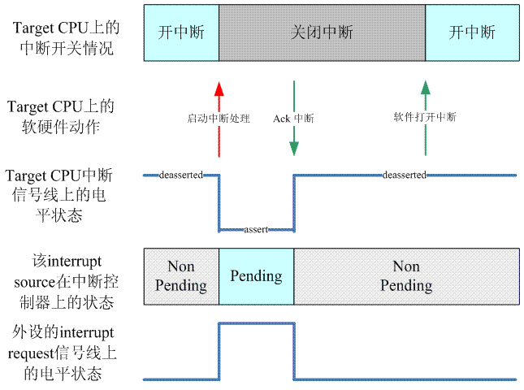
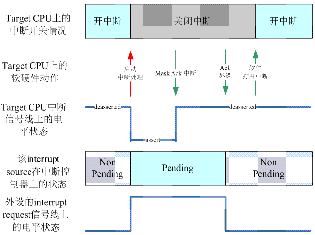

<!-- @import "[TOC]" {cmd="toc" depthFrom=1 depthTo=6 orderedList=false} -->

<!-- code_chunk_output -->

- [0 前言](#0-前言)
- [1 如何进入 high level irq event handler](#1-如何进入-high-level-irq-event-handler)
  - [1.1 从具体 CPU architecture 的中断处理到 machine 相关的处理模块](#11-从具体-cpu-architecture-的中断处理到-machine-相关的处理模块)
  - [1.2 interrupt controller 相关的代码](#12-interrupt-controller-相关的代码)
  - [1.3 调用 high level handler](#13-调用-high-level-handler)
- [2 理解 high level irq event handler 需要的知识准备](#2-理解-high-level-irq-event-handler-需要的知识准备)
  - [2.1 自动探测 IRQ](#21-自动探测-irq)
  - [2.2 resend 一个中断](#22-resend-一个中断)
  - [2.3 unhandled interrupt 和 spurious interrupt](#23-unhandled-interrupt-和-spurious-interrupt)
- [3 和 high level irq event handler 相关的硬件描述](#3-和-high-level-irq-event-handler-相关的硬件描述)
  - [3.1 CPU layer 和 Interrupt controller 之间的接口](#31-cpu-layer-和-interrupt-controller-之间的接口)
  - [3.2 Interrupt controller 和 Peripheral device 之间的接口](#32-interrupt-controller-和-peripheral-device-之间的接口)
- [4 几种典型的 high level irq event handler](#4-几种典型的-high-level-irq-event-handler)
  - [4.1 边缘触发的 handler](#41-边缘触发的-handler)
  - [4.2 电平触发的 handler](#42-电平触发的-handler)
  - [4.3 支持 EOI 的 handler](#43-支持-eoi-的-handler)

<!-- /code_chunk_output -->

# 0 前言

当**外设触发一次中断**后, 一个大概的**处理过程**是:

1、具体**CPU architecture**相关的模块会进行**现场保护**, 然后调用**machine driver(！！！这是 platform driver<位于 drivers/of/platform.c>??**)对应的**中断处理 handler**

2、machine driver 对应的中断处理 handler 中会根据**硬件的信息**获取**HW interrupt ID**, 并且通过**irq domain 模块**翻译成**IRQ number**

3、调用该**IRQ number**对应的**high level irq event handler**, 在这个 high level 的 handler 中, 会通过**和 interupt controller 交互**, 进行中断处理的**flow control(处理中断的嵌套、抢占等**), 当然最终会**遍历该中断描述符**的**IRQ action list**, 调用**外设的 specific handler**来处理该中断

4、具体**CPU architecture**相关的模块会进行**现场恢复**.

上面的**1、4 这两个步骤**在 linux kernel 的中断子系统之(**六**): ARM 中断处理过程中已经有了较为细致的描述, **步骤 2**在 linux kernel 的中断子系统之(**二**): irq domain 介绍中介绍, 本文主要描述**步骤 3**, 也就是 linux 中断子系统的 high level irq event handler.

注: 这份文档充满了猜测和空想, 很多地方描述可能是有问题的, 不过我还是把它发出来, 抛砖引玉, 希望可以引发大家讨论.

# 1 如何进入 high level irq event handler

## 1.1 从具体 CPU architecture 的中断处理到 machine 相关的处理模块

说到具体的 CPU, 我们还是用 ARM 为例好了. 对于 ARM, 我们在 ARM 中断处理文档中已经有了较为细致的描述. 这里我们看看如何从从**具体 CPU 的中断处理**到**machine 相关的处理模块** , 其具体代码如下:

```assembly
    .macro    irq_handler
#ifdef CONFIG_MULTI_IRQ_HANDLER
    ldr    r1, =handle_arch_irq
    mov    r0, sp
    adr    lr, BSYM(9997f)
    ldr    pc, [r1]
#else
    arch_irq_handler_default
#endif
9997:
    .endm
```

其实, **直接**从**CPU 的中断处理**跳转到**通用中断处理模块**是**不可能(！！！**)的, **中断处理**不可能越过**interrupt controller**这个层次. 一般而言, **通用中断处理模块**会提供一些**通用的中断代码处理库**, 然后由**interrupt controller**这个层次的代码**调用这些通用中断处理**的完成整个的中断处理过程. "**interrupt controller 这个层次的代码**"是和**硬件中断系统设计相关**的,

例如: 系统中有**多少个 interrupt contrller**, 每个 interrupt controller 是**如何控制**的?它们是**如何级联**的?我们称这些相关的**驱动模块**为**machine interrupt driver**.

在上面的代码中, 如果配置了**MULTI\_IRQ\_HANDLER**(该标志允许**每个机器在运行时指定 IRQ 处理程序！！！**)的话, **ARM 中断处理**则直接跳转到一个叫做**handle\_arch\_irq(！！！**)函数, 如果系统中只有**一种类型**的 interrupt controller(可能是**多个**interrupt controller, 例如使用**两个级联的 GIC**), 那么**handle\_arch\_irq**可以在**interrupt controller 初始化的时候设定(！！！**). 代码如下:

```c
[drivers/irqchip/irq-gic.c]
void __init gic_init_bases(unsigned int gic_nr, int irq_start,
			   void __iomem *dist_base, void __iomem *cpu_base,
			   u32 percpu_offset, struct device_node *node)
{
    ...
    if (gic_nr == 0) {
        set_handle_irq(gic_handle_irq);
    }
    ...
}

[arch/arm/kernel/irq.c]
void __init set_handle_irq(void (*handle_irq)(struct pt_regs *))
{
	if (handle_arch_irq)
		return;

	handle_arch_irq = handle_irq;
}
```

**gic\_nr 是 GIC 的编号**, linux kernel 初始化过程中, 每发现一个**GIC**, 都是会指向 GIC driver 的初始化函数的, 不过对于**第一个 GIC**, gic\_nr 等于**0**, 对于第二个 GIC, gic\_nr 等于 1. 当然**handle\_arch\_irq**这个函数指针**不是 per CPU 的变量**, 是**全部 CPU 共享**的, 因此, 初始化一次就 OK 了.

当使用**多种类型**的 interrupt controller 的时候(例如 HW 系统使用了 S3C2451 这样的 SOC, 这时候, 系统有两种 interrupt controller, 一种是**GPIO type**, 另外一种是**SOC 上的 interrupt controller**), 则**不适合在 interrupt controller 初始化中进行设定**, 这时候, 可以考虑在**machine driver 中设定**. 在这种情况下, **handle\_arch\_irq** 这个函数是在**setup\_arch**函数中根据**machine driver 设定(！！！**), 具体如下:

```c
[arch/arm/kernel/setup.c]
handle_arch_irq = mdesc->handle_irq;
```

关于**MULTI\_IRQ\_HANDLER 这个配置项**, 我们可以再多说几句. 当然, 其实这个配置项的名字已经出卖它了. multi irq handler 就是说系统中有**多个 irq handler(不同平台使用不同的 irq handler！！！**), 可以在**run time 的时候指定**. 为何要 run time 的时候, 从**多个 handler 中选择一个(！！！**)呢?HW interrupt block 难道不是固定的吗?我的理解(猜想)是: **一个 kernel 的 image**支持**多个 HW platform**, 对于**不同的 HW platform**, 在**运行**时**检查 HW platform 的类型**, 设定**不同的 irq handler(！！！**).

## 1.2 interrupt controller 相关的代码

我们还是以**2 个级联的 GIC**为例来描述 interrupt controller 相关的代码. 代码如下:

```c
[drivers/irqchip/irq-gic.c]
static asmlinkage void __exception_irq_entry gic_handle_irq(struct pt_regs *regs)
{
    u32 irqstat, irqnr;
    struct gic_chip_data *gic = &gic_data[0];－－－获取 root GIC 的硬件描述符
    void __iomem *cpu_base = gic_data_cpu_base(gic); 获取 root GIC mapping 到 CPU 地址空间的信息

    do {
        irqstat = readl_relaxed(cpu_base + GIC_CPU_INTACK);－－－获取 HW interrupt ID
        irqnr = irqstat & ~0x1c00;

        if (likely(irqnr > 15 && irqnr < 1021)) {－－－－SPI 和 PPI 的处理
            irqnr = irq_find_mapping(gic->domain, irqnr);－－－将 HW interrupt ID 转成 IRQ number
            handle_IRQ(irqnr, regs);－－－处理该 IRQ number
            continue;
        }
        if (irqnr < 16) {－－－IPI 类型的中断处理
            writel_relaxed(irqstat, cpu_base + GIC_CPU_EOI);
#ifdef CONFIG_SMP
            handle_IPI(irqnr, regs);
#endif
            continue;
        }
        break;
    } while (1);
}
```

更多关于 GIC 相关的信息, 请参考 linux kernel 的中断子系统之(七): **GIC 代码分析**. 对于 ARM 处理器, **handle\_IRQ**代码如下:

```c
void handle_IRQ(unsigned int irq, struct pt_regs *regs)
{
......
    generic_handle_irq(irq);
......
}
```

## 1.3 调用 high level handler

调用 high level handler 的代码逻辑非常简单, 如下:

```c
[kernel/irq/irqdesc.c]
int generic_handle_irq(unsigned int irq)
{
    struct irq_desc *desc = irq_to_desc(irq); －－－通过 IRQ number 获取该 irq 的描述符

    if (!desc)
        return -EINVAL;
    generic_handle_irq_desc(irq, desc);－－－－调用 high level 的 irq handler 来处理该 IRQ
    return 0;
}

[include/linux/irqdesc.h]
static inline void generic_handle_irq_desc(unsigned int irq, struct irq_desc *desc)
{
    desc->handle_irq(irq, desc);
}
```

先通过**IRQ number**获取该**irq 的中断描述符**, 然后调用**该中断描述符**的 handler\_irq(即**high level handler！！！**)

# 2 理解 high level irq event handler 需要的知识准备

## 2.1 自动探测 IRQ

原理:

第一步, 调用 probe\_irq\_on. 扫描整个中断描述符, 将**空闲(没人用**并且**允许自动探测**)的设为**正在测探**和**等待态**, 忙等待 100ms(中间可能会有中断清除描述符的等待状态), 遍历中断描述符表的**正在探测状态**的, 将**等待态**的描述符**加入可用**并返回.

第二步, 使外设**发出中断**, 会清除某个描述符的**等待状态**

第三步, 调用 probe\_irq\_off(其中的参数没有使用). 扫描整个中断描述符, 找到处于探测状态, 并且 IRQS\_WAITING 标志被清除的 irq number 并返回(如果多个说明失败).

一个**硬件驱动**可以通过下面的方法进行**自动**探测**它能够使用的 IRQ**:

```c
unsigned long irqs;
int irq;

irqs = probe_irq_on();－－启动 IRQ 自动探测
驱动那个打算自动探测 IRQ 的硬件产生中断
irq = probe_irq_off(irqs);－－结束 IRQ 自动探测
```

如果能够自动探测到 IRQ, 上面程序中的**irq(probe\_irq\_off 的返回值**)就是自动探测的结果. 后续程序可以通过**request\_threaded\_irq 申请该 IRQ(！！！**). probe\_irq\_on 函数主要的目的是返回一个**32 bit 的掩码**, 通过该掩码可以知道**可能使用的 IRQ number**有哪些, 具体代码如下:

```c
unsigned long probe_irq_on(void)
{
......
    for_each_irq_desc_reverse(i, desc) { －－－scan 从 nr_irqs-1 到 0 的中断描述符
        raw_spin_lock_irq(&desc->lock);
        if (!desc->action && irq_settings_can_probe(desc)) {－－－(1)
            desc->istate |= IRQS_AUTODETECT | IRQS_WAITING;－－－(2)
            if (irq_startup(desc, false))
                desc->istate |= IRQS_PENDING;
        }
        raw_spin_unlock_irq(&desc->lock);
    }
    msleep(100); －－－(3)

    for_each_irq_desc(i, desc) {
        raw_spin_lock_irq(&desc->lock);

        if (desc->istate & IRQS_AUTODETECT) {－－－－(4)
            if (!(desc->istate & IRQS_WAITING)) {
                desc->istate &= ~IRQS_AUTODETECT;
                irq_shutdown(desc);
            } else
                if (i < 32)－－－(5)
                    mask |= 1 << i;
        }
        raw_spin_unlock_irq(&desc->lock);
    }
    return mask;
}
```

(1)那些能**自动探测 IRQ**的**中断描述符**需要具有**两个条件**:

a、该中断描述符还**没有通过 request\_threaded\_irq**或者**其他方式申请该 IRQ 的 specific handler(也就是 irqaction 数据结构**)

b、该中断描述符**允许自动探测**(不能设定**IRQ\_NOPROBE(！！！**))

(2)如果满足上面的条件, 那么该中断描述符属于**备选描述符**. 设定其**internal state(！！！**)为**IRQS\_AUTODETECT** | **IRQS\_WAITING**. IRQS\_AUTODETECT 表示**本 IRQ 正处于自动探测**中.

(3)在**等待过程**中, 系统仍然允许, **各种中断依然会触发(！！！**). 在各种**high level irq event handler**中, 总会有如下的代码:

```c
desc->istate &= ~(IRQS_REPLAY | IRQS_WAITING);
```

也就是**中断触发**后**high level irq event handler**会**清除 IRQS\_WAITING 状态(清除等待状态！！！**).

(4)遍历中断描述符表的**正在探测状态**的, 将**非等待态**的描述符**取消探测态**并**shutdown**; 将**等待态**的描述符**加入可用**并返回.

这时候, 我们还**没有**控制那个想要自动探测 IRQ 的**硬件产生中断**, 因此**处于自动探测(状态！！！**)中, 并且 IRQS\_WAITING 并清除的**一定不是我们期待的 IRQ**(可能是**spurious interrupts**导致的), 这时候, **clear IRQS\_AUTODETECT**, **shutdown 该 IRQ**.

(5)最大探测的 IRQ 是 31(**mask 是一个 32 bit 的 value！！！**), mask 返回的是可能的**irq 掩码**.

我们再来看看**probe\_irq\_off**的代码:

```c
int probe_irq_off(unsigned long val)
{
    int i, irq_found = 0, nr_of_irqs = 0;
    struct irq_desc *desc;

    for_each_irq_desc(i, desc) {
        raw_spin_lock_irq(&desc->lock);

        if (desc->istate & IRQS_AUTODETECT) {－－－只有处于 IRQ 自动探测中的描述符才会被处理
            if (!(desc->istate & IRQS_WAITING)) {－－－找到一个潜在的中断描述符
                if (!nr_of_irqs)
                    irq_found = i;
                nr_of_irqs++;
            }
            desc->istate &= ~IRQS_AUTODETECT; －－－IRQS_WAITING 没有被清除, 说明该描述符不是自动探测的那个, shutdown 之
            irq_shutdown(desc);
        }
        raw_spin_unlock_irq(&desc->lock);
    }
    mutex_unlock(&probing_active);

    if (nr_of_irqs > 1) －－－如果找到多于 1 个的 IRQ, 说明探测失败, 返回负的 IRQ 个数信息
        irq_found = -irq_found;

    return irq_found;
}
```

因为在**调用 probe\_irq\_off**已经**触发**了自动探测 IRQ 的那个**硬件中断**, 因此在**该中断的 high level handler 的执行过程**中, 该硬件对应的**中断描述符**的**IRQS\_WAITING**标志应该**已经被清除(上面(3)中有描述！！！**), 因此 probe\_irq\_off 函数**scan 中断描述符 DB**, 找到**处于 auto probe 中**, 而且**IRQS\_WAITING 标致被清除的那个 IRQ(！！！**). 如果找到一个, 那么探测 OK, **返回该 IRQ number**, 如果找到**多个**, 说明**探测失败**, 返回负的 IRQ 个数信息, 没有找到的话, 返回 0.

## 2.2 resend 一个中断

一个**ARM** SOC 总是有**很多的 GPIO**, 有些 GPIO 可以提供**中断功能**, 这些 GPIO 的中断**可以配置**成**level trigger**或者**edge trigger**. 一般而言, 大家都更喜欢用 level trigger 的中断. **有的 SOC**只能是**有限个数的 GPIO**可以配置成**电平中断**, 因此, 在项目初期进行 pin define 的时候, 大家都在争抢电平触发的 GPIO.

**电平触发的中断**有什么好处呢?电平触发的中断很**简单**、直接, **只要硬件检测到硬件事件！！！**(例如有**数据到来**), 其 assert 指定的电平信号, **CPU ack 该中断**后, **电平信号消失**. 但是对于**边缘触发**的中断, 它是用一个上升沿或者下降沿告知硬件的状态, 这个状态**不是一个持续的状态**, 如果**软件处理不好, 容易丢失中断**.

什么时候会**resend 一个中断**呢?我们考虑一个简单的例子:

(1)**CPU A**上正在处理**x 外设**的中断

(2)x 外设的中断**再次**到来(**CPU A 已经 ack 该 IRQ！！！**, 因此 x 外设的中断可以**再次触发**), 这时候**其他 CPU**会处理它(**mask and ack！！！**), 并设置**该中断描述符是 pending 状态(！！！**), 并**委托 CPU A(！！！**)处理**该 pending 状态的中断**. 需要注意的是**CPU 已经 ack 了该中断**, 因此该中断的**硬件状态已经不是 pending 状态(！！！**), 但是**被 mask**掉了, 所以**无法可以触发中断**了, 这里中断描述符的**pending 状态**是指**中断描述符的软件状态(！！！**).

(3)**CPU B**上由于**同步**的需求, **disable 了 x 外设的 IRQ**, 这时候, CPU A**没有处理**pending 状态的 x 外设中断就**离开了中断处理过程**.

(4)当**enable x 外设的 IRQ(！！！很重要！！！**)的时候, 需要**检测 pending 状态**以便**resend 该中断**, 否则, 该**中断会丢失**的

注意: **电平触发不会存在需要 resend 的问题！！！**

具体代码如下:

```c
enable_irq(kernel/irq/manage.c) -> __enable_irq(kernel/irq/manage.c) -> check_irq_resend()

[kernel/irq/resend.c]
void check_irq_resend(struct irq_desc *desc, unsigned int irq)
{
    //电平中断不存在 resend 的问题
    if (irq_settings_is_level(desc)) {
        desc->istate &= ~IRQS_PENDING;
        return;
    }
    // 如果已经设定 resend 的 flag, 退出就 OK 了, 这个应该和 irq 的 enable disable 能多层嵌套相关
    if (desc->istate & IRQS_REPLAY)
        return;
    // 如果有 pending 的 flag 则进行处理
    if (desc->istate & IRQS_PENDING) {
        desc->istate &= ~IRQS_PENDING;
        // 设置 retrigger 标志
        desc->istate |= IRQS_REPLAY;
        //调用底层 irq chip 的 callback
        if (!desc->irq_data.chip->irq_retrigger ||
            !desc->irq_data.chip->irq_retrigger(&desc->irq_data)) {
#ifdef CONFIG_HARDIRQS_SW_RESEND
也可以使用软件手段来完成 resend 一个中断, 具体代码省略, 有兴趣大家可以自己看看
#endif
        }
    }
}
```

主要工作就是**将 istate 设置为 IRQS\_REPLAY**, 表明这次是**重新触发**的, 然后**重新触发一个中断(！！！**).

所以在各种**high level irq event handler(！！！**)中, 总会有如下的代码:

```c
desc->istate &= ~(IRQS_REPLAY | IRQS_WAITING);
```

这里会**清除 IRQS\_REPLAY 状态**, 表示**该中断已经被 retrigger**, 一次 resend interrupt 的过程结束.

## 2.3 unhandled interrupt 和 spurious interrupt

在**中断处理的最后**, 总会有一段代码如下:

```c
irqreturn_t
handle_irq_event_percpu(struct irq_desc *desc, struct irqaction *action)
{

......

    if (!noirqdebug)
        note_interrupt(irq, desc, retval);
    return retval;
}
```
**note\_interrupt**就是进行**unhandled interrupt**和 spurious interrupt 处理的. 对于这类中断, linux kernel 有一套复杂的机制来处理, 你可以通过 command line 参数(noirqdebug)来控制开关该功能.

当**发生了一个中断**, 但是**没有被处理**(有两种可能, 一种是根本**没有注册**的 specific handler, 第二种是**有 handler**, 但是 handler 否认是自己对应的设备触发的中断), 怎么办?毫无疑问这是一个异常状况, 那么 kernel 是否要立刻采取措施将该 IRQ disable 呢?也不太合适, 毕竟**interrupt request 信号线是允许共享**的, **直接 disable 该 IRQ**有可能会下手太狠, **kernel**采取了这样的策略: 如果**该 IRQ 触发了 100,000**次, 但是**99,900 次没有处理**, 在这种条件下, 我们就是**disable 这个 interrupt request line**. 多么有情有义的策略啊！相关的控制数据在中断描述符中, 如下:

```c
struct irq_desc {
......
    unsigned int irq_count;－－－－记录发生的中断的次数, 每 100,000 则回滚
    unsigned long last_unhandled;－－上一次没有处理的 IRQ 的时间点
    unsigned int irqs_unhandled;－－没有处理的次数
......
}
```
irq\_count 和 irqs\_unhandled 都是比较直观的, 为何要记录 unhandled interrupt 发生的时间呢?我们来看具体的代码. 具体的相关代码位于**note\_interrupt**中, 如下:

```c
[kernel/irq/spurious.c]
void note_interrupt(unsigned int irq, struct irq_desc *desc,  irqreturn_t action_ret)
{
    if (desc->istate & IRQS_POLL_INPROGRESS ||  irq_settings_is_polled(desc))
        return;


    if (action_ret == IRQ_WAKE_THREAD)－－－－handler 返回 IRQ_WAKE_THREAD 是正常情况
        return;

    if (bad_action_ret(action_ret)) {－－－－－报告错误, 这些是由于 specific handler 的返回错误导致的
        report_bad_irq(irq, desc, action_ret);
        return;
    }

    if (unlikely(action_ret == IRQ_NONE)) {－－－－是 unhandled interrupt
        if (time_after(jiffies, desc->last_unhandled + HZ/10))－－－(1)
            desc->irqs_unhandled = 1;－－－重新开始计数
        else
            desc->irqs_unhandled++;－－－判定为 unhandled interrupt, 计数加一
        desc->last_unhandled = jiffies;－－－－保存本次 unhandled interrupt 对应的 jiffies 时间
    }

if (unlikely(try_misrouted_irq(irq, desc, action_ret))) {－－－是否启动 Misrouted IRQ fixup
    int ok = misrouted_irq(irq);
    if (action_ret == IRQ_NONE)
        desc->irqs_unhandled -= ok;
}

    desc->irq_count++;
    if (likely(desc->irq_count < 100000))－－－－－(2)
        return;

    desc->irq_count = 0;
    if (unlikely(desc->irqs_unhandled > 99900)) {－－－－(3)

        __report_bad_irq(irq, desc, action_ret);－－－报告错误

        desc->istate |= IRQS_SPURIOUS_DISABLED;
        desc->depth++;
        irq_disable(desc);

        mod_timer(&poll_spurious_irq_timer,－－－－(4)
              jiffies + POLL_SPURIOUS_IRQ_INTERVAL);
    }
    desc->irqs_unhandled = 0;
}
```
(1)是否是一次有效的 unhandled interrupt 还要根据时间来判断. 一般而言, 当硬件处于异常状态的时候往往是非常短的时间触发非常多次的中断, 如果距离上次 unhandled interrupt 的时间超过了 10 个 jiffies(如果 HZ＝100, 那么时间就是 100ms), 那么我们要把 irqs\_unhandled 重新计数. 如果不这么处理的话, 随着时间的累计, 最终 irqs\_unhandled 可能会达到 99900 次的, 从而把这个 IRQ 错误的推上了审判台.

(2)irq\_count 每次都会加一, 记录 IRQ 被触发的次数. 但只要大于 100000 才启动 step (3)中的检查. 一旦启动检查, irq\_count 会清零, irqs\_unhandled 也会清零, 进入下一个检查周期.

(3)如果满足条件(IRQ 触发了 100,000 次, 但是 99,900 次没有处理), disable 该 IRQ.

(4)启动 timer, 轮询整个系统中的 handler 来处理这个中断(轮询啊, 绝对是真爱啊). 这个 timer 的 callback 函数定义如下:

```c
static void poll_spurious_irqs(unsigned long dummy)
{
    struct irq_desc *desc;
    int i;

    if (atomic_inc_return(&irq_poll_active) != 1)－－－－确保系统中只有一个 excuting thread 进入临界区
        goto out;
    irq_poll_cpu = smp_processor_id(); －－－－记录当前正在 polling 的 CPU

    for_each_irq_desc(i, desc) {－－－－－－遍历所有的中断描述符
        unsigned int state;

        if (!i)－－－－－－－－－－－－－越过 0 号中断描述符. 对于 X86, 这是 timer 的中断
             continue;

        /* Racy but it doesn't matter */
        state = desc->istate;
        barrier();
        if (!(state & IRQS_SPURIOUS_DISABLED))－－－－名花有主的那些就不必考虑了
            continue;

        local_irq_disable();
        try_one_irq(i, desc, true);－－－－－－－－－OK, 尝试一下是不是可以处理
        local_irq_enable();
    }
out:
    atomic_dec(&irq_poll_active);
    mod_timer(&poll_spurious_irq_timer,－－－－－－－－一旦触发了该 timer, 就停不下来
          jiffies + POLL_SPURIOUS_IRQ_INTERVAL);
}
```

# 3 和 high level irq event handler 相关的硬件描述

## 3.1 CPU layer 和 Interrupt controller 之间的接口

从**逻辑层面**上看, **CPU**和**interrupt controller**之间的接口包括:

(1)**触发中断的 signal**. 一般而言, 这个(些)信号是**电平触发**的. 对于 ARM CPU, 它是 nIRQ 和 nFIQ 信号线, 对于**X86**, 它是**INT**和**NMI 信号线**, 对于 PowerPC, 这些信号线包括 MC(machine check)、CRIT(critical interrupt)和 NON\-CRIT(Non critical interrupt). 对于**linux kernel 的中断子系统**, 我们**只使用其中一个信号线！！！这个指的是给 CPU 传递中断的线只有一根！！！**(例如对于 ARM 而言, 我们只使用 nIRQ 这个信号线). 这样, 从**CPU 层面**看, 其**逻辑动作**非常的简单, **不区分优先级**, 触发中断的那个**信号线一旦 assert**, 并且**CPU 没有 mask 中断**, 那么软件就会转到一个异常向量执行, 完毕后返回现场.

**触发中断的信号线只有一个**！！！在 x86 中, **外部硬件中断**有 Local APIC 的 LINT0(可以连接 8259A 的 INTR), LINT1(外部 NMI), 通过 System Bus 接收的 IO APIC 的 Interrupt Message. 而 IO APIC 的 IRQ0 可以连接 8259 中断控制器. 这里应该指的是 LINT0 或者 IO APIC 的 IRQ0, 和 IO APIC 的 system bus 没关系

(2)**Ack 中断的 signal**. 这个 signal 可能是**物理上**的一个**连接 CPU 和 interrupt controller**的铜线, 也可能不是. 对于**X86＋8259**这样的结构, Ack 中断的 signal 就是**nINTA 信号线**, 对于 ARM＋GIC 而言, 这个信号就是总线上的一次访问(读 Interrupt Acknowledge Register 寄存器). CPU ack 中断标识 cpu 开启启动中断服务程序(specific handler)去处理该中断. 对于**X86**而言, **ack 中断**可以让**8259**将**interrupt vector 数据**送到**数据总线**上, 从而让**CPU**获取了足够的处理**该中断的信息**. 对于**ARM**而言, **ack 中断**的同时也就是获取了发生**中断的 HW interrupt ID**, 总而言之, **ack 中断后**, CPU 获取了足够开启执行**中断处理的信息(！！！**).

(3)**结束中断(EOI, end of interrupt)的 signal**. 这个**signal**用来标识 CPU 已经完成了对该中断的处理(specific handler 或者 ISR, interrupt serivce routine 执行完毕). 实际的物理形态这里就不描述了, 和 ack 中断 signal 是类似的.

(4)**控制总线和数据总线接口**. 通过这些接口, CPU 可以访问(读写)interrupt controller 的寄存器.

## 3.2 Interrupt controller 和 Peripheral device 之间的接口

所有的系统中, **Interrupt controller**和**Peripheral device(外围设备**)之间的接口都是**一个 Interrupt Request 信号线**. **外设**通过这个**信号线**上的电平或者边缘向 CPU(实际上是通过 interrupt controller)申请中断服务.

# 4 几种典型的 high level irq event handler

本章主要介绍几种典型的 high level irq event handler, 在进行**high level irq event handler 的设定**的时候需要注意, 不是外设使用电平触发就选用 handle\_level\_irq, 选用什么样的 high level irq event handler 是和**Interrupt controller 的行为**以及**外设电平触发方式决定**的. 介绍每个典型的 handler 之前, 我会简单的描述该**handler 要求的硬件行为**, 如果该外设的中断系统符合这个硬件行为, 那么可以选择该 handler 为该中断的 high level irq event handler.

## 4.1 边缘触发的 handler

总结:

(1) 对中断描述符加锁

(2) 清除等待状态(和探测有关)和 IRQS\_REPLAY(retigger 中断)

(3) 当前中断事件已经有 CPU 处理(！！！已经有 CPU 在处理的, 说明当前 CPU 是新触发 controller 调度过来的, 所以设置 pending 等, 相当于告诉正在执行的 CPU, 这个的处理委托给它了！！！), 或中断被其他 CPU disable(enable 时候处理！！！), 设为**pending**, 并**mask 和 ack 该中断(mask 不再考虑 pending 嵌套！！！**), 然后释放锁, **结束(！！！**)

(4) ack 中断, 允许硬件触发下一次中断. 不过会被调度到其他 CPU 上.

(5) 若中断描述符是 pending 状态, 说明其他 CPU 上又触发了中断并委托当前 CPU 处理, 所以需要 unmask, 允许后续中断

(6) 处理**该中断请求事件**: **清理 pending**, 设定**inprogress 状态**(就是上面(3)说的正在处理), 释放描述符锁(因为不修改), 遍历 action list, 调用 specific handler, 继续加锁, 清除 inprogress 状态

(7) 只要有 pending 标志, 说明还有. 当然, 如果有**其他 CPU disable**了, 那么就**结束(！！！**).

使用**handle\_edge\_irq**这个 handler 的**硬件中断系统行为**如下:



我们以**上升沿**为例描述边缘中断的处理过程(下降沿的触发是类似的). 当**interrupt controller**检测到了**上升沿信号**, 会将**该上升沿状态(pending**)锁存在**寄存器**中, 并通过**中断的 signal 向 CPU 触发中断**. 需要注意: 这时候, **外设和 interrupt controller**之间的 interrupt request**信号线(！！！外设和 controller 的 IRQ line**)会保持**高电平**, 这也就意味着**interrupt controller 不可能检测到新的中断信号！！！这个指的只是不会检测到这个设备的信号, 不影响其他的外设！！！**(本身是高电平, **无法形成上升沿**). 这个**高电平信号**会一直保持到**软件 ack 该中断**(调用 irq chip 的**irq\_ack callback 函数！！！对于 x86, 修改外设对应的 delivery status 寄存器位 idle 状态??**). ack 之后, 中断控制器**才有可能继续探测上升沿(！！！**), 触发下一次中断.

ARM＋GIC 组成的系统不符合这个类型. 虽然**GIC**提供了**IAR(Interrupt Acknowledge Register**)寄存器来让**ARM 来 ack 中断**, 但是, 在调用 high level handler 之前, 中断处理程序需要通过读取 IAR 寄存器获得 HW interrpt ID 并转换成 IRQ number, 因此实际上, 对于 GIC 的 irq chip, 它是无法提供本场景中的 irq\_ack 函数的. 很多 GPIO type 的 interrupt controller 符合上面的条件, 它们会提供 pending 状态寄存器, 读可以获取 pending 状态, 而向 pending 状态寄存器写 1 可以 ack 该中断, 让 interrupt controller 可以继续触发下一次中断.

**handle\_edge\_irq**代码如下:

```c
[kernel/irq/chip.c]
void handle_edge_irq(unsigned int irq, struct irq_desc *desc)
{
    raw_spin_lock(&desc->lock); －－－－(0)

    desc->istate &= ~(IRQS_REPLAY | IRQS_WAITING);－－－－参考上一章的描述

    if (unlikely(irqd_irq_disabled(&desc->irq_data) ||－－－－－(1)
             irqd_irq_inprogress(&desc->irq_data) || !desc->action)) {
        if (!irq_check_poll(desc)) {
            desc->istate |= IRQS_PENDING;
            mask_ack_irq(desc);
            goto out_unlock;
        }
    }
    kstat_incr_irqs_this_cpu(irq, desc); －－－更新该 IRQ 统计信息


    desc->irq_data.chip->irq_ack(&desc->irq_data); －－－－－－－－－(2)

    do {
        if (unlikely(!desc->action)) { －－－－－－－－－－－－－－－－－(3)
            mask_irq(desc);
            goto out_unlock;
        }


        if (unlikely(desc->istate & IRQS_PENDING)) { －－－－－－－－－(4)
            if (!irqd_irq_disabled(&desc->irq_data) &&
                irqd_irq_masked(&desc->irq_data))
                unmask_irq(desc);
        }

        handle_irq_event(desc); －－－－－－－－－－－－－－－－－－－(5)

    } while ((desc->istate & IRQS_PENDING) &&
         !irqd_irq_disabled(&desc->irq_data)); －－－－－－－－－－－－－(6)

out_unlock:
    raw_spin_unlock(&desc->lock); －－－－－－－－－－－－－－－－－(7)
}
```

(0) 这时候, **中断仍然是关闭的**, 因此不会有来自本 CPU 的并发, 使用 raw spin lock 就**防止其他 CPU**上对该 IRQ 的**中断描述符的访问**. 针对该 spin lock, 我们直观的感觉是 raw\_spin\_lock 和(7)中的 raw\_spin\_unlock 是成对的, 实际上并不是, **handle\_irq\_event**中的代码是这样的:

```c
irqreturn_t handle_irq_event(struct irq_desc *desc)
{

    raw_spin_unlock(&desc->lock); －－－－－－－和上面的(0)对应

    处理具体的 action list

    raw_spin_lock(&desc->lock);－－－－－－－－和上面的(7)对应

}
```

实际上, 由于在**handle\_irq\_event**中**处理 action list**的耗时还是**比较长**的, 因此处理具体的 action list 的时候并**没有持有中断描述符的 spin lock(！！！**). 在如果那样的话, **其他 CPU**在对**中断描述符进行操作**的时候需要 spin 的时间会很长的.

(1)判断**是否需要执行下面的 action list**的处理. 这里分成几种情况:

a、该中断事件已经**有其他的 CPU 处理**了

b、该中断**被其他的 CPU disable**了

c、该中断描述符**没有注册 specific handler**. 这个比较简单, 如果没有 irqaction, 根本**没有必要调用 action list 的处理**

如果该中断事件已经**有其他的 CPU 处理(！！！**)了, 那么我们仅仅是**设定 pending 状态**(**为了委托正在处理的该中断的那个 CPU 进行处理！！！注意这是 pending 状态主要使用！！！**), **mask\_ack\_irq(！！！会 mask！！！**)该中断并退出就 OK 了, 并不做具体的处理. 另外**正在处理该中断的 CPU 会检查 pending 状态**, 并**进行处理(！！！do while 循环！！！**)的.

同样的, 如果该中断被其他的 CPU disable 了, 本就**不应该**继续执行该中断的**specific handler**, 我们也是**设定 pending 状态**, **mask and ack 中断(会 mask！！！**)就退出了. 当**其他 CPU**的**代码离开临界区**, **enable 该中断(！！！见上面 resend 部分**)的时候, 软件会检测 pending 状态并 resend 该中断.

也就是**上面 a 和 b 情况会 mask 和 ack 该中断！！！**

这里的**irq\_check\_poll**代码如下:

```c
static bool irq_check_poll(struct irq_desc *desc)
{
    if (!(desc->istate & IRQS_POLL_INPROGRESS))
        return false;
    return irq_wait_for_poll(desc);
}
```

IRQS\_POLL\_INPROGRESS 标识了**该 IRQ 正在被 polling**(上一章有描述), 如果没有被轮询, 那么返回 false, 进行正常的设定 pending 标记、mask and ack 中断. 如果正在被轮询, 那么需要等待 poll 结束.

(2)**ack 该中断**. 对于**中断控制器**, 一旦被 ack, 表示该**外设的中断被 enable**, **硬件**上已经准备好**触发下一次中断(！！！**)了. **再次触发的中断**会被**调度到其他的 CPU(！！！**)上. 现在, 我们可以再次回到步骤(1)中, 为什么这里用**mask and ack**而**不是单纯的 ack**呢?如果**单纯的 ack**则意味着**后续中断还是会触发**, 这时候怎么处理?在 pending＋in progress 的情况下, 我们要怎么处理?记录 pending 的次数, 有意义吗?由于**中断是完全异步**的, 也有可能**pending 的标记**可能在**另外的 CPU 上已经修改为 replay**的标记, 这时候怎么办?当事情变得复杂的时候, 那一定是本来方向就错了, 因此, mask and ack 就是最好的策略, 我已经记录了 pending 状态, **不再考虑 pending 嵌套的情况(！！！**).

(3)在调用**specific handler**处理**具体的中断**的时候, 由于**不持有中断描述符的 spin lock**, 因此**其他 CPU 上有可能会注销其 specific handler**, 因此 do while 循环之后, **desc->action 有可能是 NULL**, 如果是这样, 那么 mask irq, 然后退出就 OK 了

(4)如果**中断描述符处于 pending 状态**, 那么一定是**其他 CPU 上**又**触发了该 interrupt source 的中断**, 并**设定了 pending 状态**, "**委托"本 CPU 进行处理(！！！**), 这时候, 需要把**之前 mask 住的中断**进行**unmask 的操作**. 一旦 unmask 了该 interrupt source, **后续的中断可以继续触发**, 由其他的 CPU 处理(仍然是设定中断描述符的 pending 状态, 委托当前正在处理该中断请求的那个 CPU 进行处理).

(5)**处理该中断请求事件**

```c
irqreturn_t handle_irq_event(struct irq_desc *desc)
{
    struct irqaction *action = desc->action;
    irqreturn_t ret;

    desc->istate &= ~IRQS_PENDING;－－－－CPU 已经准备处理该中断了, 因此, 清除 pending 状态
    irqd_set(&desc->irq_data, IRQD_IRQ_INPROGRESS);－－设定 INPROGRESS 的 flag
    raw_spin_unlock(&desc->lock);

    ret = handle_irq_event_percpu(desc, action); －－－遍历 action list, 调用 specific handler

    raw_spin_lock(&desc->lock);
    irqd_clear(&desc->irq_data, IRQD_IRQ_INPROGRESS);－－－处理完成, 清除 INPROGRESS 标记
    return ret;
}
```

(6)**只要有 pending 标记**, 就说明**该中断还在 pending 状态**, 需要继续处理. 当然, 如果有**其他的 CPU disable 了该 interrupt source**, 那么本次中断结束处理.

## 4.2 电平触发的 handler

总结:

(1) mask 并 ack 该中断, mask 为了防止持续中断.

(2) 清除等待状态(和探测有关)和 IRQS\_REPLAY(retigger 中断)

(3)

使用**handle\_level\_irq**这个 handler 的硬件中断系统行为如下:



我们以高电平触发为例. 当**interrupt controller 检测到了高电平信号**, 并通过**中断的 signal 向 CPU 触发中断**. 这时候, 对**中断控制器**进行**ack 并不能改变 interrupt request signal 上的电平状态**, 一直要等到**执行具体的中断服务程序(specific handler**), 对**外设进行 ack(！！！**)的时候, 电平信号才会**恢复成低电平**. 在**对外设 ack 之前**, 中断状态一直是**pending**的, 如果**没有 mask 中断**, 那么**中断控制器就会 assert CPU**.

handle\_level\_irq 的代码如下:

```c
void handle_level_irq(unsigned int irq, struct irq_desc *desc)
{
    raw_spin_lock(&desc->lock);
    mask_ack_irq(desc); －－－－(1)

    if (unlikely(irqd_irq_inprogress(&desc->irq_data)))－－－－(2)
        if (!irq_check_poll(desc))
            goto out_unlock;

    desc->istate &= ~(IRQS_REPLAY | IRQS_WAITING);－－和 retrigger 中断以及自动探测 IRQ 相关
    kstat_incr_irqs_this_cpu(irq, desc);


    if (unlikely(!desc->action || irqd_irq_disabled(&desc->irq_data))) {－－－－(3)
        desc->istate |= IRQS_PENDING;
        goto out_unlock;
    }

    handle_irq_event(desc);

    cond_unmask_irq(desc); －－－－(4)

out_unlock:
    raw_spin_unlock(&desc->lock);
}
```

(1)考虑 CPU<------>interrupt controller<------>device 这样的连接方式中, 我们认为**high level handler(！！！无论是哪种 high levelhandler！！！)主要是和 interrupt controller 交互**, 而**specific handler(request\_irq 注册的那个**)是和**device 进行交互(！！！**).

**Level 类型的中断**的特点就是只要**外设 interrupt request line 的电平状态是有效状态**, 对于**interrupt controller**, 该**外设的 interrupt 总是 active**的. 由于外设检测到了事件(比如数据到来了), 因此 assert 了指定的电平信号, 这个**电平信号会一直保持**, 直到**软件清除了外设的状态寄存器(！！！**). 但是, **high level irq event handler**这个层面**只能操作 Interrupt controller(！！！**), 不能操作**具体外设的寄存器**(那应该属于**具体外设的 specific interrupt handler**处理内容, 该**handler 会挂入中断描述符**中的**IRQ action list**). 直到在**具体的中断服务程序(！！！specific handler**中)操作**具体外设的寄存器(对于 x86, 修改外设对应的 delivery status 寄存器为 idle 状态??**), 才能让这个**asserted 电平信号消失**.

正是因为 level trigger 的这个特点, 因此, 在**high level handler 中首先 mask 并 ack 该 IRQ(！！！**). 这一点和边缘触发的 high level handler 有显著的不同, 在**handle\_edge\_irq**中, 我们**仅仅是 ack 了中断**, 并**没有 mask**, 因为边缘触发的中断稍纵即逝, 一旦**mask 了该中断**, 容易**造成中断丢失**. 而对于**电平中断**, 我们**不得不 mask**住该中断, 如果**不 mask 住**, 只有**CPU ack 中断**, 中断控制器将**持续的 assert CPU 中断(因为有效电平状态一直保持**). 如果我们**mask 住该中断**, 中断控制器将**不再转发该 interrupt source 来的中断**, 因此, 所有的 CPU 都不会感知到该中断, 直到**软件 unmask**. 这里的 ack 是针对**interrupt controller 的 ack**, 本身 ack 就是为了**clear interrupt controller 对该 IRQ 的状态寄存器**, 不过由于外部的电平仍然是有效信号, 其实未必能清除 interrupt controller 的中断状态, 不过这是和中断控制器硬件实现相关的.

(2)对于电平触发的 high level handler, 我们**一开始就 mask 并 ack 了中断**, 因此**后续 specific handler 因该是串行化执行**的, 为何要判断 in progress 标记呢?不要忘记 spurious interrupt, 那里会直接调用 handler 来处理 spurious interrupt.

(3)这里有两个场景

a、**没有注册 specific handler**. 如果没有注册 handler, 那么保持 mask 并设定 pending 标记(这个 pending 标记有什么作用还没有想明白).

b、该**中断被其他的 CPU disable**了. 如果该中断被其他的 CPU disable 了, 本就不应该继续执行该中断的 specific handler, 我们也是设定 pending 状态, mask and ack 中断就退出了. 当其他 CPU 的代码离开临界区, enable 该中断的时候, 软件会检测 pending 状态并 resend 该中断.

(4)为何是有条件的 unmask 该 IRQ?正常的话当然是 umask 就 OK 了, 不过有些 threaded interrupt(这个概念在下一份文档中描述)要求是 one shot 的(首次中断, specific handler 中开了一枪, wakeup 了 irq handler thread, 如果允许中断嵌套, 那么在 specific handler 会多次开枪, 这也就不是 one shot 了, 有些 IRQ 的 handler thread 要求是 one shot, 也就是不能嵌套 specific handler).

## 4.3 支持 EOI 的 handler