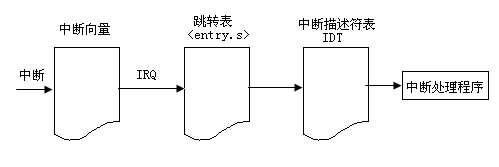

中断:

- 可屏蔽中断: 所有有 I/O 设备请求的中断都是, 被屏蔽的中断会一直被 CPU 忽略, 直到屏蔽位被重置.
- 不可屏蔽中断: 非常危险的事件引起(如硬件失败).

异常:
- 处理器产生的(Fault, Trap, Abort)异常
- programmed exceptions(软中断): 由程序员通过 INT 或 INT3 指令触发, 通常当做 trap 处理, 用处: 实现系统调用.

中断描述符表(IDT): 256 项, 其中的每一项关联一个中断/异常处理过程, 有三种类型:

- Task Gate Descriptor. Linux 未使用该类型的描述符.
- Interrupt Gate Descriptor.用于处理中断.
- Trap Gate Descriptor. 用于处理异常.

- 中断门: 用于硬件中断, DPL 为 0, 不允许用户态直接使用 int 指令访问, 硬件中断免去这一判断, 因此可以在用户态响应中断, 见 set\_intr\_gate
- **DPL3 陷阱门**: 用于**系统调用**, DPL 为 3, 允许**用户态直接使用 int 指令**访问, 这样才能**通过 int80**访问系统调用, 只有 80 号向量属于此门, 见 set\_system\_gate
- **DPL0 陷阱门**: 用于 CPU 异常, **不允许用户态直接使用 int 指令访问**, 硬件中断免去这一判断, 因此可以在用户产生 CPU 异常, 见 set\_trap\_gate

在指令执行过程中控制单元检测是否有中断/异常发生, 如果有, 等待该条指令执行完成以后, 硬件按如下过程执行:

1. 确定 中断向量的编号 i.
2. 从 IDT 表中得到第 i 个门描述符. (idtr 指向 IDT)
3. 由第 i 项中的选择符和 gdtr 查到位于 GDT 中的段描述符, 从而得到中断处理程序的基地址, 而偏移量位于门描述符中.
4. 做权限检查: 比较 cs 中的 CPL 和 GDT 中 段描述符的 DPL, 确保中断处理程序的特权级不低于调用者. 对于 programed exception 还需检查 CPL 与门描述符的 DPL, 还应确保 CPL 大于等于门的 DPL. Why?因为 INT 指令允许用户态的进程产生中断信号, 其向量值 可以为 0 到 255 的任一值, 为了避免用户通过 INT 指令产生非法中断, 在初始化的时候, 将向量值为 80H 的门描述符(系统调用使用该门)的 DPL 设为 3,  将其他需要避免访问的门描述符的 DPL 值设为 0, 这样在做权限检查的时候就可以检查出来非法的情况.
5. 检查是否发 生了特权级的变化, 一般指是否由用户态陷入了内核态. 如果是由用户态陷入了内核态, 控制单元必须开始使用与新的特权级相关的堆栈
    - 读 tr 寄存器, 访问运行进程的 tss 段. why?因为任何进程从用户态陷入内核态都必须从 TSS 获得内核堆栈指针.
    - 用与新特权级相关的栈段和栈指针装载 ss 和 esp 寄存器. 这些值可以在进程的 tss 段中找到.
    - 在新的栈(内核栈)中保存用户态的 ss 和 esp, 这些值指明了用户态相关栈的逻辑地址.

6. 若发生的是故障, 用引起异常的指令 地址修改 cs 和 eip 寄存器的值, 以使得这条指令在异常处理结束后能被再次执行
7. 在栈中保存 eflags、cs 和 eip 的内容
8. 如果异常带有一个硬件出错码, 则将它保存在栈中
9. 装载 cs 和 eip 寄存器, 其值分别是在 GDT 中找到的段描述符段基址和 IDT 表中第 i 个门的偏移量. 这样就得到了中断/异常处理程序第一条指令的逻辑地址.

从中断/异常返回:

中断/异常处理完后, 相应的处理程序会执行一条 iret 指令, 做了如下事情:

1)用保存在 栈中的值装载 cs、eip 和 eflags 寄存器. 如果一个硬件出错码曾被压入栈中, 那么弹出这个硬件出错码

2)检查处理程序的特权级是否等于 cs 中最低两位的值(这意味着进程在被中断的时候是运行在内核态还是用户态). 若是内核态, iret 终止执行; 否则, 转入 3

3) 从栈中装载 ss 和 esp 寄存器. 这步意味着返回到与旧特权级相关的栈.

4)检查 ds、es、fs 和 gs 段寄存器的内容, 如果其中一个寄 存器包含的选择符是一个段描述符, 并且特权级比当前特权级高, 则清除相应的寄存器. 这么做是防止怀有恶意的用户程序利用这些寄存器访问内核空间.

关于硬件中断和异常的原理简单描述为: 当中断到到来时, 由硬件触发中断引脚, 通过引脚号找到中断号, 然后通过中断号从中断描述符表(IDT)中找到对应的项. 从 gdtr 寄存器中获得 GDT 的基地址, 并在 GDT 中查找, 以读取 IDT 表项中的选择符所标识的段描述符. 这个描述符指定中断或异常处理程序所在段的基地址. 权限检查. 保存现场. 装载 cs 和 eip 寄存器, 其值分别是 IDT 表中第 i 想们描述符的段选择符和偏移量字段. 这些值给出了中断或者异常处理程序的第一条指令的逻辑地址. 中断或异常返回后, 相应的处理程序必须产生一条 iret 指令, 把控制权转交给被中断的进程.

中断流:



中断描述符表的初始化

在**内核初始化**过程中, **setup\_idt 汇编**语言函数用**同一个中断门**(即指向**ignore\_int 中断处理程序**)来填充**所有这 256 个表项**

```assembly
/*
 *  setup_idt
 *
 *  sets up a idt with 256 entries pointing to
 *  ignore_int, interrupt gates. It doesn't actually load
 *  idt - that can be done only after paging has been enabled
 *  and the kernel moved to PAGE_OFFSET. Interrupts
 *  are enabled elsewhere, when we can be relatively
 *  sure everything is ok.
 *
 *  Warning: %esi is live across this function.
 */
setup_idt:
	lea ignore_int,%edx
	movl $(__KERNEL_CS << 16),%eax
	movw %dx,%ax		/* selector = 0x0010 = cs */
	movw $0x8E00,%dx	/* interrupt gate - dpl=0, present */

	lea idt_table,%edi
	mov $256,%ecx
rp_sidt:
	movl %eax,(%edi)
	movl %edx,4(%edi)
	addl $8,%edi
	dec %ecx
	jne rp_sidt

.macro	set_early_handler handler,trapno
	lea \handler,%edx
	movl $(__KERNEL_CS << 16),%eax
	movw %dx,%ax
	movw $0x8E00,%dx	/* interrupt gate - dpl=0, present */
	lea idt_table,%edi
	movl %eax,8*\trapno(%edi)
	movl %edx,8*\trapno+4(%edi)
.endm

	set_early_handler handler=early_divide_err,trapno=0
	set_early_handler handler=early_illegal_opcode,trapno=6
	set_early_handler handler=early_protection_fault,trapno=13
	set_early_handler handler=early_page_fault,trapno=14

	ret
```

在 start\_kernel 中**调用 trap\_init 函数**向 idt 表中添加项(主要是异常处理)