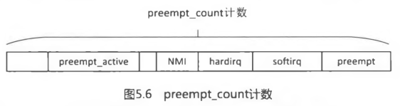
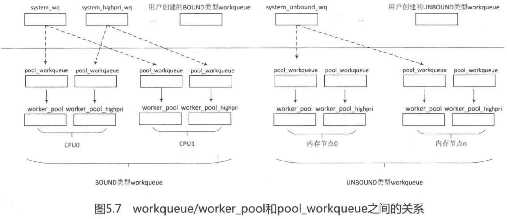
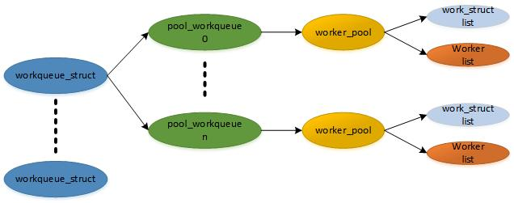
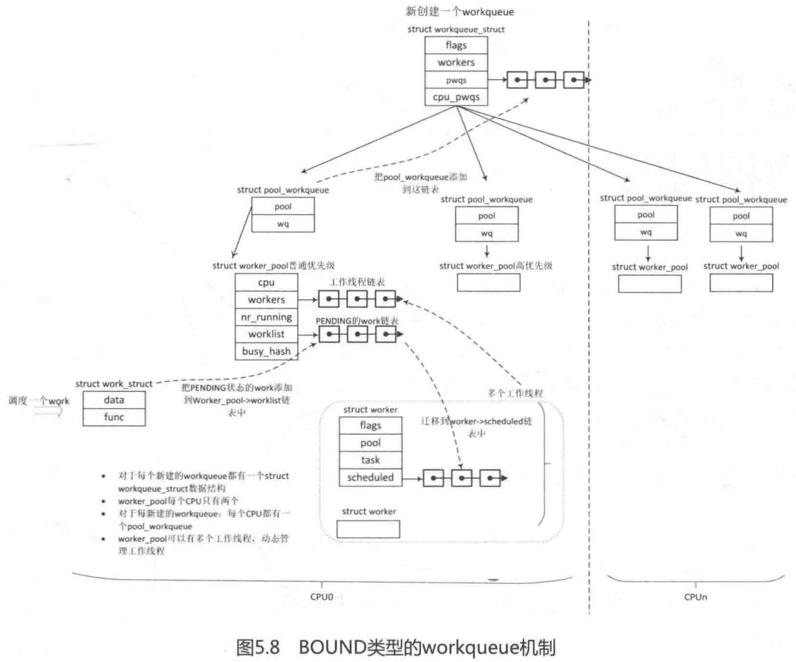

<!-- @import "[TOC]" {cmd="toc" depthFrom=1 depthTo=6 orderedList=false} -->

<!-- code_chunk_output -->

- [1. Linux 整体机制](#1-linux-整体机制)
  - [1.1. 中断初始化](#11-中断初始化)
    - [1.1.1. 中断处理接口 interrupt 数组](#111-中断处理接口-interrupt-数组)
  - [1.2. 硬件中断号和软件中断号映射](#12-硬件中断号和软件中断号映射)
  - [1.3. 注册中断](#13-注册中断)
  - [1.4. 底层中断处理](#14-底层中断处理)
  - [1.5. 高层中断处理](#15-高层中断处理)
  - [1.6. 中断线程执行过程](#16-中断线程执行过程)
- [2. 软中断和 tasklet](#2-软中断和-tasklet)
  - [2.1. SoftIRQ 软中断](#21-softirq-软中断)
  - [2.2. tasklet](#22-tasklet)
  - [2.3. local_bh_disable/local_bh_enable 下半部临界区](#23-local_bh_disablelocal_bh_enable-下半部临界区)
  - [2.4. 中断上下文](#24-中断上下文)
- [3. workqueue](#3-workqueue)
  - [3.1. 背景和原理](#31-背景和原理)
  - [3.2. 数据结构](#32-数据结构)

<!-- /code_chunk_output -->

# 1. Linux 整体机制

中断在那个 CPU 上执行, 取决于在**那个 CPU 上申请了 vector**并**配置了对应的中断控制器(比如 local APIC**). 如果想要**改变一个中断的执行 CPU**, 必须**重新申请 vector 并配置中断控制器**. 一般通过 `echo xxx > /proc/irq/xxx/affinity` 来完成调整, 同时 irq\_balance 一类软件可以用于完成中断的均衡.

当外设触发一次中断后, 一个大概的处理过程是:

1. 具体 CPU architecture 相关的模块会进行现场保护

2. 通过 IDT 中的中断描述符, 调用 common_interrupt;

3. 通过 common\_interrupt, 调用 do\_IRQ, 完成 vector 到 irq\_desc 的转换(根据硬件的信息获取 HW interrupt ID, 并且通过 irq domain 模块翻译成 IRQ number), 进入 Generic interrupt layer(调用处理函数`generic_handle_irq_desc`);

4. 调用在**中断初始化的时候**, 按照**中断特性**(level 触发, edge 触发等. simple 等)初始化的 irq\_desc:: handle\_irq, 执行不同的通用处理接口, 比如 handle\_simple\_irq; 调用该 IRQ number 对应的 high level irq event handler, 在这个 high level 的 handler 中, 会通过和 interupt controller 交互, 进行中断处理的 flow control(处理中断的嵌套. 抢占等), 当然最终会遍历该中断描述符的 IRQ action list, 调用外设的 specific handler 来处理该中断

5. 这些通用处理接口会调用中断初始化的时候注册的外部中断处理函数; 完成 EOI 等硬件相关操作; 并完成中断处理的相关控制.

6. 具体 CPU architecture 相关的模块会进行现场恢复.

## 1.1. 中断初始化

对 X86 CPU, Linux 内核使用全局 idt\_table 来表达当前的 IDT, 该变量定义在 traps.c

```cpp
//[arch/x86/kernel/traps.c]
gate_desc idt_table[NR_VECTORS] __page_aligned_bss;
```

对中断相关的初始化, 内核主要有以下工作:

1. 设置 used\_vectors, 确保外设不能分配到 X86 保留使用的 vector(**预留的 vector 范围为[0,31**], 另外还有其他通过 apic\_intr_init 等接口预留的系统使用的 vector);

2. 设置 X86CPU 保留使用的 vector 对应的 IDT entry;这些 entry 使用特定的中断处理接口;

3. 设置外设 (包括 ISA 中断)使用的中断处理接口, 这些中断处理接口都一样.

4. 设置 ISA IRQ 使用的 irq_desc;

5. 把 IDT 的首地址加载到 CPU 的 IDTR(Interrupt Descriptor Table Register);

6. 初始化中断控制器(下一章描述)

以上工作主要在以下函数中完成:

```cpp
start_kernel
    trap_init
        使用 set_intr_gate 等接口初始化保留 vector
        used_vectors 中[0,0x1f]对应的 vector 被置 1, 表示已经预留不能再使用
        cpu_init
            load_idt((const struct desc_ptr *)&idt_descr) 把&idt_descr 的地址加载到 idtr
                native_load_idt()
    init_IRQ
        初始化 0 号 CPU 的 vector_irq: 其 vector[0x30-0x3f]和 irq 号[0-15](ISA 中断)对应
        x86_init.irqs.intr_init(native_init_IRQ)
            x86_init.irqs.pre_vector_init(init_ISA_irqs)
                init_ISA_irqs:初始化 ISA, 设置 irq 号[0,15] (ISA 中断)的 irq_desc
            apic_intr_init 设置 APIC 相关中断(使用的 alloc_intr_gate 会设置 used_vectors)
            使用 interrupt 数组初始化设置外设中断 idt entry
```

这个过程会完成每个中断 vector 对应的 idt entry 的初始化, 系统把这些中断 vector 分成以下几种:

1. **X86 保留 vector**, 这些**vector 包括[0,0x1f**]和**APIC 等系统部件占用的 vector**,对这些 vector, 会**记录在 bitmap used\_vectors 中**, 确保**不会被外设分配使用**; 同时这些 vector 都使用**各自的中断处理接口(!!!**), 其中断处理过程相对简单(没有 generic interrupt layer 的参与, CPU 直接调用到各自的 ISR).

2. **ISA irqs**, 对这些中断, 在初始化过程中已经完成了**irq\_desc**. **vector\_irq**. 以及**IDT 中对应 entry 的分配和设置**, 同时可以发现**ISA 中断**, 在初始化的时候都被设置为**运行在 0 号 CPU**.  0x30\-0x3f 是 ISA 的

3. **其它外设的中断**, 对这些中断, 在初始化过程中**仅设置了对应的 IDT**, 和**ISA 中断一样**, 其**中断处理接口都来自 interrupt 数组**.

### 1.1.1. 中断处理接口 interrupt 数组

interrupt 数组是内核中外设中断对应的 IDT entry, 其在`arch/x86/entry/entry_64.S`中定义, 定义如下:

```assembly
[arch/x86/include/asm/irq_vectors.h]
#define FIRST_EXTERNAL_VECTOR		0x20
#define LOCAL_TIMER_VECTOR		0xef

#define NR_VECTORS			 256

#ifdef CONFIG_X86_LOCAL_APIC
#define FIRST_SYSTEM_VECTOR		LOCAL_TIMER_VECTOR
#else
#define FIRST_SYSTEM_VECTOR		NR_VECTORS
#endif

[arch/x86/entry/entry_64.S]
ENTRY(irq_entries_start)
    vector=FIRST_EXTERNAL_VECTOR
    .rept (FIRST_SYSTEM_VECTOR - FIRST_EXTERNAL_VECTOR)
    /* 代码段内容*/
	pushq	$(~vector+0x80)			/* Note: always in signed byte range */
    vector=vector+1
	jmp	common_interrupt
	.align	8
    .endr
END(irq_entries_start)
```

这段汇编的效果是: 在**代码段**, 生成了一个**符号`irq_entries_start`**, 该符号对应的内容是一组可执行代码.

X86 CPU 在准备好了中断执行环境后, 会调用**中断描述符定义的中断处理入口**;

对于**用户自定义中断**, 中断处理入口都是(对系统预留的, 就直接执行定义的接口了)`common_interrupt`

## 1.2. 硬件中断号和软件中断号映射

Linux 维护了一个位图 `allocated_irqs` 用来管理软中断号,

系统初始化阶段会注册所有的中断控制器(包括虚拟的)irq\_domain(中断域), 并添加到全局链表 irq\_domain\_list(通过 irq\_domain 的 link 成员), 如果线性映射的话, 初始化线性相关数据并根据当前控制器能支持的中断源的个数分配一个数组; 树存储, 初始化一个 R 树.

```cpp
[include/linux/irqdomain.h]

struct irq_domain {
	struct list_head link;
	const char *name;
	const struct irq_domain_ops *ops;
	void *host_data;
	unsigned int flags;

	/* Optional data */
	struct device_node *of_node;
	struct fwnode_handle *fwnode;
	enum irq_domain_bus_token bus_token;
	struct irq_domain_chip_generic *gc;
#ifdef	CONFIG_IRQ_DOMAIN_HIERARCHY
	struct irq_domain *parent;
#endif

	/* reverse map data. The linear map gets appended to the irq_domain */
	irq_hw_number_t hwirq_max;
	unsigned int revmap_direct_max_irq;
	unsigned int revmap_size;
	struct radix_tree_root revmap_tree;
	unsigned int linear_revmap[];
};
```

- link: 用于将**irq domain**连接到**全局链表 irq\_domain\_list**中.
- name:  irq domain 的**名称**.
- ops: irq domain 映射**操作使用的方法集合**.
- of\_node:对应**中断控制器的 device node**.
- hwirq\_max: 该**irq domain**支持**中断数量的最大值**.
- revmap\_size: **线性映射的大小**.
- revmap\_tree: **Radix Tree 映射的根节点**.
- linear\_revmap:**线性映射用到的 lookup table**.

系统初始化解析设备信息, 得到外设硬件中断号和触发类型, 通过全局 allocated\_irqs 位图分配一个空闲比特位(外设和中断控制器的 request line 有且仅有一条)从而获得一个 IRQ 号, 分配一个中断描述符 irq\_desc, 配置 CONFIG\_SPARE\_IRQ 使用 R 树存储, 否则是全局数组, 将硬件中断号设置到中断描述符, 从而建立硬件中断号和软件中断号的映射关系.

## 1.3. 注册中断

request\_irq()和线程化注册函数 request\_threaded\_irq()

```c
[kernel/irq/manage.c]
int request_threaded_irq(unsigned int irq, irq_handler_t handler,
			 irq_handler_t thread_fn, unsigned long irqflags,
			 const char *devname, void *dev_id)
```

- irq: IRQ 中断号, 注意这里使用的是**软件中断号**, 而**不是硬件中断号**.
- handler: 指 **primary handler**, 有些类似于旧版本 API 函数 request\_irq()的中断处理函数 handler. 中断发生时会**优先执行 primary handler**. 如果**primary handler 为 NULL**且**thread\_fn 不为 NULL**, 那么会执行系统**默认的 primary handler**: **irq\_default\_primary\_handler**()函数.
- thread\_fn: 中断**线程化的处理程序**. 如果**thread\_fn 不为 NULL**, 那么会**创建一个内核线程**. primary handler 和 thread\_fn**不能同时为 NULL**.
- irqflags: 中断**标志位**, 如表 5.2 所示.
- devname: 该**中断名称**.
- dev\_id: 传递给**中断处理程序的参数**.

注册的不是中断号, 而是一个 irqaction. 然后唤醒内核线程, 但线程会很快调用 schedule(), 换出等待,

如果启用中断线程化, 则 primary handler 应该返回 IRQ\_WAKE\_THREAD 来唤醒中断线程.

(1) 共享中断必须传入 dev\_id.

(2) 通过 IRQ 获取中断描述符(系统初始化已经分配好了).

(3) primary handler 和 thread\_fn 不能同时为 NULL. primary 为 NULL, 设为默认的 irq\_default\_primary\_handler.

(4) 分配一个 irqaction(这是中断描述符的 aciton 链表中的当前设备对应的 irqaction, 里面有 primary handler 和 thread\_fn, 注意和中断描述符的 handler\<high level event handler\>区分)

(5) 有 thread\_fn 的创建一个内核线程, 设为实时线程, SCHED\_FIFO 调度策略, 优先级 50, 线程名 irq/中断号\-中断名, 执行函数为 irq\_thread, 参数为当前 irqaction. 增加线程 usage 计数, 确保线程异常不释放 task\_struct, 防止中断线程访问空指针, 将当前设备中断的 irqaction 的 thread 指向它

(6) 将当前 irqaction 加到中断描述符的 action 链表

(7) 有 thread\_fn, 则唤醒创建的内核线程, 该线程会很快睡眠, 详见下面线程执行

## 1.4. 底层中断处理

具体看体系结构

## 1.5. 高层中断处理

common\_interrupt 在 entry\_64.S 中定义, 其中关键步骤为: 调用**do\_IRQ**, 完成后会根据**环境**判断**是否需要执行调度**, 最后执行**iretq 指令**完成中断处理, iret 指令的重要功能就是**恢复中断函数前的 EFLAGS(执行中断入口前被入栈保存, 并清零 IF 位关中断**), 并恢复执行被中断的程序(这里不一定会恢复到之前的执行环境, 可能执行软中断处理, 或者执行调度).

do_IRQ 的基本处理过程如下, 其负责中断执行环境建立. vector 到 irq 的转换等, 调用内核代码继续处理

(1) irq\_enter(): 增加当前进程 thread\_info 的 preempt\_count 中的 HARDIRQ 域值, 表明进入硬件中断上下文

(2) irq\_find\_mapping()通过硬件中断号查找 IRQ 中断号(irq domain 模块中 R 树或数组)

(3) 获得中断描述符, 调用 desc\-\>**handle\_irq**(), 即 high level event handler, 不同触发类型不同 high level event handler. 基本操作都是中断响应相关, 然后遍历中断描述符的 action 链表, 依次执行每个 action 的 primary handler, 一般而言, primary handler 编写最开始要通过 dev\_id 确认是否是自己的设备产生了中断

(4) primary handler 如果返回 IRQ\_WAKE\_THREAD(默认 primary 就是直接返回这个),设置 aciton 的 flags 为 IRQTF\_RUNTHREAD(已经置位说明已经唤醒, 直接退出), 唤醒 action\-\>thread 中断线程

(5) irq\_exit(): 减少当前进程 thread\_info 的 preempt\_count 中的 HARDIRQ 域值, 退出硬件中断上下文; 如果不在中断上下文, 并且本地 CPU 的\_\_softirq\_pending 有 pending 等待的软中断则处理, 详细见软中断

## 1.6. 中断线程执行过程

(1) 如果 aciton 的 flags 没设置为 IRQTF\_RUNTHREAD, 设置线程为 TASK\_INTERRUPTIBLE, 调用 schedule(), 换出 CPU, 进入睡眠等待

(2) 设置线程为 TASK\_RUNNING, 执行 action\-\>thread\_fn

# 2. 软中断和 tasklet

中断线程化属于下半部范畴, 这个机制合并前, 已经有了下半部机制, 例如**软中断**, **tasklet**和**工作队列**.

## 2.1. SoftIRQ 软中断

对时间要求最严格和最重要的下半部, 目前驱动只有块设备和网络子系统在使用.

**软中断**是 Linux 内核中最常见的一种**下半部机制**, 适合系统对**性能和实时响应要求很高**的场合, 例如**网络子系统**. **块设备**. **高精度定时器**. **RCU**等.

- **软中断**类型是**静态定义**的, Linux 内核**不希望**驱动开发者**新增软中断类型**.

- 软中断的**回调函数**在**开中断环境下**执行.

- **同一类型的软中断**可以在**多个 CPU**上并行执行. 以 **TASKLET\_SOFTIRQ** 类型的软中断为例, 多个 CPU 可以同时 tasklet\_schedule, 并且多个 CPU 也可能同时从中断处理返回, 然后同时触发和执行 `TASKLET_SOFTIRQ` 类型的软中断.

- 假如有驱动开发者要新增一个软中断类型, 那软中断的处理函数需要考虑同步问题.

- 软中断的**回调函数不能睡眠**.

- 软中断的**执行时间点**是在**中断返回前**, 即**退出硬中断上下文**时, 首先检查**是否有 pending 的软中断**, 然后才检查**是否需要抢占当前进程**. 因此, **软中断上下文总是抢占进程上下文(!!!**).

10 种静态定义的软中断类型, 通过枚举实现, 索引号越小, 软中断优先级越高

描述软中断 `softirq_action`, 一个**全局软中断描述符数组**, 每种软中断一个

```cpp
// [include/linux/interrupt.h]
struct softirq_action
{
	void	(*action)(struct softirq_action *);
};

[kernel/softirq.c]
static struct softirq_action softirq_vec[NR_SOFTIRQS] __cacheline_aligned_in_smp;
```

每个 CPU 定义一个软中断状态信息 `irq_cpustat_t`

```cpp
[include/asm-generic/hardirq.h]
typedef struct {
	unsigned int __softirq_pending;
} ____cacheline_aligned irq_cpustat_t;

[kernel/softirq.c]
#ifndef __ARCH_IRQ_STAT
irq_cpustat_t irq_stat[NR_CPUS] ____cacheline_aligned;
EXPORT_SYMBOL(irq_stat);
#endif
```

每个 CPU 有一个执行软中断的守护进程 `ksoftirqd`(Per\-CPU 变量)

注册软中断: 在全局的软中断描述符数组中, 指定相应软中断的 action. open\_softirq()

触发软中断: 将本地 CPU 的软中断状态信息 irq\_stat 中相应软中断位置为 1, 如果不在中断上下文, 唤醒软中断守护进程 ksoftirqd, 中断上下文, 退出. raise\_softirq()和 raise\_softirq\_irqoff(), 前面主动关闭本地中断, 所以后者允许进程上下文调用

软中断的执行:

(1) 中断退出阶段执行(`irq_exit()`): 在**非中断上下文(!interrupt()**), 以及有**pending** 情况下才继续.

`__do_softirq()`:

获取本地 CPU 的软中断状态 irq\_stat, 增加当前进程 struct thread\_info 中的 preempt\_count 成员里的 SOFTIRQ 域的值**SOFTIRQ\_OFFSET(!!!加的值是 2 的 8 次方, preempt\_count[8:15]表示软中断, 刚好将 bit[8]设为 1**), 表明在软中断上下文; 清除本地 CPU 的所有软中断状态, 因为会一次全部处理; 循环处理软中断, 从索引小的开始, 调用 action()函数指针; 如果又有新软中断, 软中断处理时间没超过 2 毫秒并且没有进程要求调度, 则再处理一次软中断, 否则唤醒 ksoftirqd 处理 ;退出软中断上下文

中断退出**不能**处于**硬件中断上下文**和**软中断上下文**. 硬中断处理过程一般是关中断的, 中断退出也就退出了硬件中断上下文, 这里肯定会满足; 另一个场景, 本次**中断点**发生在**软中断过程中**, 那中断退出会返回到软中断上下文, 这时候不允许重新调度软中断. 因为软中断在一个 CPU 上总是串行执行.

(2) ksoftirqd(两个来源\<irq\_exit()\>和主动): 和上面动作类似

## 2.2. tasklet

**tasklet**是基于**软中断**的一种下半部机制, 所以还是运行在软中断上下文.

- tasklet 可以**静态定义**, 也可以**动态初始化**.
- tasklet 是**串行执行**的. 一个**tasklet**在**tasklet\_schedule**()时会绑定某个 CPU 的**tasklet\_vec 链表**, 它必须要在该 CPU 上**执行完 tasklet 的回调函数**才会和该 CPU**松绑**.
- **TASKLET\_STATE\_SCHED**和**TASKLET\_STATE\_RUN 标志位**巧妙地构成了**串行执行**.
- 同一个 tasklet 只能同时在一个 cpu 上执行, 但不同的 tasklet 可以同时在不同的 cpu 上执行;
- 一旦 tasklet\_schedule 被调用, 内核会保证 tasklet 一定会在某个 cpu 上执行一次;
- 如果 tasklet\_schedule 被调用时, tasklet 不是出于正在执行状态, 则它只会执行一次;
- 如果 tasklet\_schedule 被调用时, tasklet 已经正在执行, 则它会在稍后被调度再次被执行;
- 两个 tasklet 之间如果有资源冲突, 应该要用自旋锁进行同步保护;

tasklet\_struct 数据结构:

```cpp
[include/linux/interrupt.h]
struct tasklet_struct
{
    //多个 tasklet 串成一个链表
	struct tasklet_struct *next;
	// 该 tasklet 当前状态.
	unsigned long state;
	// 为 0 表示 tasklet 处于激活状态; 不为 0 表示该 tasklet 被禁止, 不允许执行
	atomic_t count;
	// tasklet 处理程序, 类似软中断中的 action 函数指针.
	void (*func)(unsigned long);
	// 传递参数给 tasklet 处理函数
	unsigned long data;
};

enum
{
    // 表示 tasklet 己经被调度, 正准备运行
	TASKLET_STATE_SCHED,	/* Tasklet is scheduled for execution */
	// 表示 tasklet 正在运行中
	TASKLET_STATE_RUN	/* Tasklet is running (SMP only) */
};
```

每个 CPU(实际上是每个 logical processor, 即每个 cpu thread)维护两个 tasklet 链表, 一个用于普通优先级的 tasklet\_vec, 另一个用于高优先级的 tasklet\_hi\_vec, 它们都是 Per-CPU 变量(!!!). 链表中每个 tasklet\_struct 代表一个 tasklet.

```cpp
[kernel/softirq.c]
struct tasklet_head {
	struct tasklet_struct *head;
	struct tasklet_struct **tail;
};

static DEFINE_PER_CPU(struct tasklet_head, tasklet_vec);
static DEFINE_PER_CPU(struct tasklet_head, tasklet_hi_vec);
```

其中, tasklet\_vec 使用软中断中的 TASKLET\_SOFTIRQ 类型, 它的优先级是 6; 而 tasklet\_hi\_vec 使用的软中断中的 HI\_SOFTIRQ, 优先级是 0, 是所有软中断中优先级最高的.

系统初始化会初始化这两个链表(softirq\_init()), 会注册 TASKLET\_SOFTIRQ 和 HI\_SOFTIRQ 这两个软中断(!!!), 回调函数分别是**tasklet\_action**和**tasklet\_hi\_action**(网络驱动用的多).

```cpp
[start_kernel()->softirq_init()]
[kernel/softirq.c]
void __init softirq_init(void)
{
	int cpu;

	for_each_possible_cpu(cpu) {
		per_cpu(tasklet_vec, cpu).tail =
			&per_cpu(tasklet_vec, cpu).head;
		per_cpu(tasklet_hi_vec, cpu).tail =
			&per_cpu(tasklet_hi_vec, cpu).head;
	}

	open_softirq(TASKLET_SOFTIRQ, tasklet_action);
	open_softirq(HI_SOFTIRQ, tasklet_hi_action);
}
```

以普通优先级为例.

初始化一个 tasklet: 静态(如下)或动态初始化(tasklet\_init())

```c
[include/linux/interrupt.h]
#define DECLARE_TASKLET(name, func, data) \
struct tasklet_struct name = { NULL, 0, ATOMIC_INIT(0), func, data }

#define DECLARE_TASKLET_DISABLED(name, func, data) \
struct tasklet_struct name = { NULL, 0, ATOMIC_INIT(1), func, data }
```

调度 tasklet 的执行: tasklet\_schedule(). 设置 tasklet 的 state 为 TASKLET\_STATE\_SCHED, 原来已经是 TASKLET\_STATE\_SCHED, 说明已经在链表, 退出; 否则将 tasklet 挂载到 tasklet\_vec 链表, raise\_softirq\_irqoff()触发软中断

tasklet 的执行: 基于软中断机制, 当循环到 TASKLET\_SOFTIRQ 类型软中断时, 回调函数是 tasklet\_action().

(1) 获取当前 CPU 的 tasklet 链表到一个临时链表, 然后清除当前 CPU 的, 允许新 tasklet 进入待处理链表

(2) **遍历临时链表**, tasklet\_trylock 判断**当前 tasklet**是否已经在其他 CPU 运行或被禁止

- 没有运行, 也没有禁止, 清除 TASKLET\_STATE\_SCHED, 执行回调函数
- 已经在运行或被禁止, 将该 tasklet 重新添加当当前 CPU 的待处理 tasklet 链表, 然后触发 TASKLET\_SOFTIRQ 序号(6)的软中断, 等下次软中断再执行

**软中断上下文优先级高于进程上下文**, 因此**软中断包括 tasklet 总是抢占进程(!!!**)的运行. 当**进程 A 在运行时发生中断**, 在**中断返回**时**先判断本地 CPU 上有没有 pending 的软中断**, 如果有, 那么首先**执行软中断包括 tasklet**, 然后**检查是否有高优先级任务需要抢占中断点的进程**, 即进程 A. 如果在执行软中断和 tasklet 过程时间很长, 那么高优先级任务就长时间得不到运行, 势必会影响系统的实时性, 这也是 RT Linux 社区里有专家一直**要求用 workqueue 机制来替代 tasklet 机制**的原因.


目前 Linux 内核中有大量的驱动程序使用 tasklet 机制来实现下半部操作, 任何一个 tasklet 回调函数执行时间过长, 都会影响系统实时性, 可以预见在不久的将来**tasklet 机制**有可能会被 Linux 内核社区**舍弃**.

## 2.3. local_bh_disable/local_bh_enable 下半部临界区

内核中提供的关闭软中断的锁机制, 它们组成的临界区**禁止本地 CPU**在**中断返回前(!!!**)夕**执行软中断**, 这个临界区简称 BH 临界区(bottom half critical region).

local\_bh\_disable: **关闭软中断**. 将当前进程 preempt\_count 加上 SOFTIRQ\_DISABLE\_OFFSET(该值为 512, 2 的 9 次方, 参考 preempt\_count 结构, bit[8:15]表示软中断, 该域还表示软中断嵌套深度, 所以 9 次方, bit[9]是 1, 在软中断这里是 2, 两层嵌套), 表明进入了**软中断上下文**, 这样中断返回前 irq\_exit()不能调用执行 pending 状态的软中断

local\_bh\_enable: 打开软中断. preempt\_count 先减去(SOFTIRQ\_DISABLE\_OFFSET \- 1), 表明**退出了软中断上下文(bit[8:15]已经是 0 了**), 剩 1 表示**关闭本地 CPU 抢占(参见 preempt\_count 组成**), 因为不希望被其他高优先级任务抢占当前; 在**非中断上下文**执行**软中断处理**, 走上面软中断流程

在**进程上下文调用建立临界区**, 此时来了**外部中断**后, 当*中断返回*时, 发现处于**软中断上下文**, 那么就**不执行, 延迟**了.

## 2.4. 中断上下文

**中断上下文**包括**硬中断上下文**(hardirq context)和**软中断上下文**(softirq context).

- **硬件中断上下文**表示**硬件中断处理过程**.
- **软中断上下文**包括**三部分**
    - 一是在**下半部执行的软中断处理包括 tasklet**, 调用过程是**irq\_exit()\->invoke\_softirq**();
    - 二是**ksoftirqd 内核线程执行的软中断**, 例如系统使能了**强制中断线程化**force\_irqthreads (见 invoke\_softirq()函数), 还有一种情况是**软中断执行时间太长**, 在\_do\_softirq()中**唤醒 ksoftirqd 内核线程**;
    - 三是**进程上下文(!!!**)中调用**local\_bh\_enable**()时也会去**执行软中断处理**, 调用过程是**local\_bh\_enable()-〉do\_softirq**().

软中断上下文中前者**调用在中断下半部**中, 属于传统意义上的**中断上下文**, 而**后两者(!!!)调用在进程上下文中**, 但是 Linux 内核统一把它们归纳到软中断上下文范畴里.

preempt\_count 成员在第 3.1 节中(进程管理)介绍过, 如图 5.6 所示.



**中断上下文(!!!**)包括**硬件中断处理过程**. **关 BH 临界区**. **软中断处理过程(!!!**)和**NMI 中断**处理过程. 在内核代码中经常需要判断当前状态是否处于进程上下文中, 也就是希望确保当前不在任何中断上下文中, 这种情况很常见, 因为代码需要做一些睡眠之类的事情. **in\_interrupt**()宏返回 false,则此时内核处于**进程上下文**中, 否则处于**中断上下文**中.

Linux 内核中有几个宏来描述和判断这些情况:

```cpp
[include/linux/preempt_mask.h]

#define hardirq_count()	(preempt_count() & HARDIRQ_MASK)
#define softirq_count()	(preempt_count() & SOFTIRQ_MASK)
#define irq_count()	(preempt_count() & (HARDIRQ_MASK | SOFTIRQ_MASK \
				 | NMI_MASK))

#define in_irq()		(hardirq_count())
#define in_softirq()		(softirq_count())
#define in_interrupt()		(irq_count())
#define in_serving_softirq()	(softirq_count() & SOFTIRQ_OFFSET)
```

- in\_irq()判断当前是否在**硬件中断上下文**中;
- in\_softirq()判断当前是否在**软中断上下文**中或者**处于关 BH 的临界区(!!!**)里;
- in\_serving\_softirq()判断当前是否正在**软中断处理(!!!**)中, 包括前文提到的**三种情况**.
- in\_interrupt()则包括所有的**硬件中断上下文**. **软中断上下文**和**关 BH 临界区**.

# 3. workqueue

## 3.1. 背景和原理

工作队列的基本原理是把 work(需要推迟执行的函数)交由一个**内核线程**来执行, 它总是在**进程上下文**中执行. 工作队列的优点是利用进程上下文来执行中断下半部操作, 因此工作队列允许**重新调度**和**睡眠**, 是**异步执行的进程上下文**, 另外它还能解决**软中断**和**tasklet**执行**时间过长**导致系统**实时性下降**等问题.

早起 workqueue 比较简单, 由多线程(Multi threaded, 每个 CPU 默认一个工作线程)和单线程(Single threaded, 用户可以自行创建工作线程)组成. 容易导致1)内核线程数量太多 2)并发性差(工作线程和 CPU 是绑定的) 3)死锁(同一个队列上的数据有依赖容易死锁)

concurrency\-managed workqueues(CMWQ): BOUND 类型(Per\-CPU, 每个 CPU 一个)和 UNBOUND 类型, **每种**都有**两个工作线程池(worker\-pool**): 普通优先级的工作(work)使用和高优先级的工作(work)使用. 工作线程池(worker\-pool)中线程数量是动态管理的. 工作线程睡眠时, 检查是否需要唤醒更多工作线程, 有需要则唤醒同一个工作线程池中 idle 状态的工作线程.

## 3.2. 数据结构

工作任务 struct work\_struct

```c
[include/linux/workqueue.h]
struct work_struct {
    //低比特位是标志位, 剩余存放上一次运行的 worker_pool 的 ID 或 pool_workqueue 的指针(由 WORK_STRUCT_PWQ 标志位来决定)
	atomic_long_t data;
	// 把 work 挂到其他队列上
	struct list_head entry;
	// 工作任务处理函数
	work_func_t func;
};
```

工作线程 struct worker

```c
[kernel/workqueue_internal.h]
struct worker {
	/* on idle list while idle, on busy hash table while busy */
	union {
		struct list_head	entry;	/* L: while idle */
		struct hlist_node	hentry;	/* L: while busy */
	};
    // 正在被处理的 work
	struct work_struct	    *current_work;	/* L: work being processed */
	// 正在执行的 work 回调函数
	work_func_t		        current_func;	/* L: current_work's fn */
	// 当前 work 所属的 pool_workqueue
	struct pool_workqueue	*current_pwq;   /* L: current_work's pwq */
	// 所有被调度并正准备执行的 work 都挂入该链表
	struct list_head	    scheduled;	    /* L: scheduled works */
    // 挂入到 worker_pool->workers 链表
    struct list_head	    node;		    /* A: anchored at pool->workers */
						                    /* A: runs through worker->node */
	// 工作线程的 task_struct
	struct task_struct	    *task;		    /* I: worker task */
	// 该工作线程所属的 worker_pool
	struct worker_pool	    *pool;		    /* I: the associated pool */
	// 该工作线程的 ID 号
	int			            id;		        /* I: worker id */
    ...
};
```

工作线程池 struct worker\_pool

```c
[kernel/workqueue.c]
struct worker_pool {
    // 保护 worker-pool 的自旋锁
	spinlock_t		lock;		/* the pool lock */
	// BOUND 类型的 workqueue, cpu 表示绑定的 CPU ID; UNBOUND 类型, 该值为-1
	int			    cpu;		/* I: the associated cpu */
	// UNBOUND 类型的 workqueue, 表示该 worker-pool 所属内存节点的 ID 编号
	int			    node;		/* I: the associated node ID */
	// ID 号
	int			    id;		    /* I: pool ID */
	unsigned int	flags;		/* X: flags */
    // pending 状态的 work 会挂入该链表
	struct list_head	worklist;	/* L: list of pending works */
	// 工作线程的数量
	int			        nr_workers;	/* L: total number of workers */
	// idle 状态的工作线程的数量
	int			        nr_idle;	/* L: currently idle ones */
    // idle 状态的工作线程挂入该链表
	struct list_head	idle_list;	/* X: list of idle workers */
	// 被管理的工作线程会挂入该链表
	struct list_head	workers;	/* A: attached workers */
	// 工作线程的属性
	struct workqueue_attrs	*attrs;		/* I: worker attributes */
	// 正在运行中的 worker 数量
	atomic_t		nr_running ____cacheline_aligned_in_smp;
	// rcu 锁
	struct rcu_head		rcu;
	...
} ____cacheline_aligned_in_smp;
```

连接**workqueue(工作队列**)和**worker\_pool(工作线程池**)的桥梁**struct pool\_workqueue**

```c
[kernel/workqueue.c]
struct pool_workqueue {
    // worker_pool 指针
	struct worker_pool	    *pool;		/* I: the associated pool */
	// 工作队列
	struct workqueue_struct *wq;		/* I: the owning workqueue */
	// 活跃的 work 数量
	int			            nr_active;	/* L: nr of active works */
	// 活跃的 work 最大数量
	int			            max_active;	/* L: max active works */
	// 被延迟执行的 works 挂入该链表
	struct list_head	    delayed_works;	/* L: delayed works */
	struct rcu_head		    rcu;
	...
} __aligned(1 << WORK_STRUCT_FLAG_BITS);
```

工作队列 struct workqueue\_struct

```c
[kernel/workqueue.c]
struct workqueue_struct {
    // 所有的 pool-workqueue 数据结构都挂入链表
	struct list_head	pwqs;		/* WR: all pwqs of this wq */
	// 链表节点. 当前 workqueue 挂入全局的链表 workqueues
	struct list_head	list;		/* PL: list of all workqueues */
    // 所有 rescue 状态下的 pool-workqueue 数据结构挂入该链表
	struct list_head	maydays;	/* MD: pwqs requesting rescue */
	// rescue 内核线程. 创建 workqueue 时设置 WQ_MEM_RECLAIM, 那么内存紧张而创建新的工作线程失败会被该线程接管
	struct worker		*rescuer;	/* I: rescue worker */
    // UNBOUND 类型属性
	struct workqueue_attrs	*unbound_attrs;	/* WQ: only for unbound wqs */
	// UNBOUND 类型的 pool_workqueue
	struct pool_workqueue	*dfl_pwq;	/* WQ: only for unbound wqs */
    // workqueue 的名字
	char			name[WQ_NAME_LEN]; /* I: workqueue name */

	/* hot fields used during command issue, aligned to cacheline */
	unsigned int		flags ____cacheline_aligned; /* WQ: WQ_* flags */
	//Per-CPU 类型的 pool_workqueue
	struct pool_workqueue __percpu *cpu_pwqs; /* I: per-cpu pwqs */
	...
};
```

关系图:

**一个 work 挂入 workqueue**中, 最终还要**通过 worker\-pool**中的**工作线程来处理其回调函数**, worker-pool 是**系统共享的(!!!**), 因此**workqueue**需要查找到一个**合适的 worker\-pool**, 然后从 worker\-pool 中分派一个**合适的工作线程**, pool\_workqueue 数据结构在其中起到**桥梁**作用. 这有些类似 IT 类公司的人力资源池的概念, 具体关系如图 5.7 所示.






- **work\_struct**结构体代表的是**一个任务**, 它指向一个待异步执行的函数, 不管驱动还是子系统什么时候要执行这个函数, 都必须把**work**加入到一个**workqueue**.

- **worker**结构体代表一个**工作者线程(worker thread**), 它主要**一个接一个的执行挂入到队列中的 work**, 如果没有 work 了, 那么工作者线程就挂起, 这些工作者线程被 worker\-pool 管理.

对于**驱动和子系统**的开发人员来说, 接触到的**只有 work**, 而背后的处理机制是管理 worker\-pool 和处理挂入的 work.

- **worker\_pool**结构体用来**管理 worker**, 对于**每一种 worker pool**都分**两种情况**: 一种是处理**普通 work**, 另一种是处理**高优先级的 work**.

- **workqueue\_struct**结构体代表的是**工作队列**, 工作队列分**unbound workqueue**和**bound workqueue**. bound workqueue 就是**绑定到 cpu**上的, **挂入到此队列中的 work**只会在**相对应的 cpu**上运行. **unbound workqueue 不绑定到特定的 cpu**, 而且**后台线程池的数量也是动态**的, 具体**workqueue 关联到哪个 worker pool**, 这是由**workqueue\_attrs 决定**的.

系统初始化阶段(init\_workqueue()): 为**所有 CPU(包括离线**的)创建**两个工作线程池 worker\_pool**(普通优先级和高优先级); 为每个在线 CPU 的每个工作线程池(每个 CPU 有两个)创建一个工作线程(create\_worker); 创建 UNBOUND 类型和 ordered 类型的 workqueue 属性, 分别两个, 对应普通优先级和高优先级, 供后续使用; alloc\_workqueue()创建几个默认的 workqueue

- **普通优先级 BOUND 类型**的**工作队列 system\_wq**, 名称为"**events**", 可以理解为**默认工作队列**.
- **高优先级 BOUND 类型**的工作队列**system\_highpri\_wq** , 名称为"**events\_highpri**".
- **UNBOUND 类型**的工作队列**system\_unbound\_wq**, 名称为"**system\_unbound\_wq**".
- **Freezable 类型**的工作队列**system\_freezable\_wq**, 名称为"**events\_freezable**".
- **省电类型**的工作队列**system\_freezable\_wq**, 名称为 "**events\_power\_efficient**".

创建工作线程 worker(参数是 worker\_pool): 获取一个 ID; 工作线程池对应的内存节点分配一个 worker; 在工作线程池对应的 node 创建一个内核线程, 名字("**kworker/u \+ CPU\_ID \+ : \+ worker\_idH**", 高优先级的才有 H, UNBOUND 类型的才有 u); 设置线程(worker->task->flags)的 PF\_NO\_SETAFFINITY 标志位(防止修改 CPU 亲和性); 工作线程池没有绑定到 CPU 上, 那么设置 worker 标志位不绑定 CPU; 将 worker 加到工作线程池的 workers 链表; 使 worker 进入 idle 状态; 唤醒 worker 的内核线程; 返回该 worker

**创建工作队列 workqueue**: API 很多, 3 个参数 name, flags 和 max\_active.

(1) **分配一个 workqueue\_struct**并初始化, 对于 UNBOUND 类型, 创建一个 UNBOUND 类型的 workqueue 属性

(2) **分配 pool\_workqueue**并初始化 alloc\_and\_link\_pwqs()

BOUND 类型的 workqueue:

- 给**每个 CPU**分配一个 Per\-CPU 的**pool\_workqueue**,
- 遍历每个 CPU, 通过**这个 pwq**将系统静态定义的 Per\-CPU 类型的**高优先级的 worker\_pool**(也就是 init\_workqueues()初始化的)和**workqueue**连接起来, 并将这个 pool\_workqueue 添加到传入的 workqueue\-\>pwqs 链表.

UNBOUND 类型和 ORDERED 类型的 workqueue: 都是调用 apply\_workqueue\_attrs 实现, 不同在于传入的属性一个是 ordered\_wq\_attrs[highpri], 一个是 unbound\_std\_wq\_attrs[highpri], 这两个不同在于属性里面的 no\_numa 在 ordered 中是 true, 这两个属性系统初始化阶段完成的.

- 通过系统**全局哈希表 unbound\_pool\_hash**(管理所有 UNBOUND 类型的 work\_pool)根据属性查找**worker\_pool**, 找到将其引用计数加 1, 并返回, 没有的话重新分配并初始化一个(创建 pool, 为 pool 创建一个**工作线程 worker**<会唤醒线程>), 将新 pool 加入哈希表
- 分配一个 pool\_workqueue
- 初始化该 pwq, 将 worker\_pool 和 workqueue\_struct 连接起来, 为 pool\_workqueue 初始化一个**工作 work**(通过 INIT\_WORK()), 回调函数是 pwq\_unbound\_release\_workfn(), 该 work 执行: 从 work 中找到相应的 pwq, 该 work 只对 UNBOUND 类型的 workqueue 有效, 如果 work\-\>pwq\-\>wq\-\>pwqs(所有 pool\_workqueue 都在这个链表)中当前 pool\_workqueue 是最后一个, 释放 pool\_workqueue 相关结构

**初始化一个 work**: 宏 INIT\_WORK(work, func)

**调度一个 work**: schedule\_work(work\_struct), 将 work 挂入系统默认的 BOUND 类型的 workqueue 工作队列 system\_wq, queue\_work(workqueue, work)

(1) 关中断

(2) 设置 work 标志位 WORK\_STRUCT\_PENDING\_BIT, 已经有说明正在 pending, 已经在队列中, 不用重复添加

(3) 找一个合适的 pool\_workqueue. 优先本地 CPU 或本地 CPU 的 node 节点对应的 pwq, 如果该 work**上次执行的 worker\_pool**和刚选择的 pwq\-\>pool 不等, 并且**该 work**正在其**上次执行的工作线程池中运行**, 而且运行**这个 work 的 worker 对应的 pwq**对应的 workqueue 等于调度**传入的 workqueue**(worker\-\>current\_pwq\-\>wq == wq), 则优先选择这个正在运行的 worker\-\>current\_pwq. 利用其**缓存热度**.

(4) 判断当前 pwq 活跃的 work 数量, 少于最高限值, 加入 pwq\-\>pool\-\>worklist(pool 的 pending 链表), 否则加入 pwq\-\>delayed\_works(pwq 的被延迟执行的 works 链表)

(5) 当前 pwq\-\>pool 工作线程池存在 pending 状态的 work 并且 pool 中正运行的 worker 数量为 0 的话, 找到 pool 中第一个 idle 的 worker 并唤醒 worker\-\>task

(6) 开中断

工作线程处理函数 worker\_thread():

```c
worker_thread()
{
recheck:
    if(不需要更多的工作线程?)
        goto 睡眠;

    if(需要创建更多的工作线程? && 创建线程)
        goto recheck;

    do{
        处理工作;
    }(还有工作待完成 && 活跃的工作线程 <= 1) // 这儿就是 keep_working(pool)

睡眠:
    schedule();
}
```

- 动态地创建和管理一个工作线程池中的工作线程. 假如发现有 PENDING 的 work 且当前工作池中没有正在运行的工作线程(worker\_pool\-\>nr\_running = 0), 那就唤醒 idle 状态的线程, 否则就动态创建一个工作线程.
- 如果发现一个 work 己经在同一个工作池的另外一个工作线程执行了, 那就不处理该 work.
- 动态管理活跃工作线程数量, 见 keep\_working()函数. 如果 pool\-\>worklist 中还有工作需要处理且工作线程池中活跃的线程小于等于 1, 那么保持当前工作线程继续工作, 此功能可以防止工作线程泛滥. 也就是限定活跃的工作线程数量小于等于 1.

和调度器交互:

CMWQ 机制会动态地调整一个线程池中工作线程的执行情况, 不会因为某一个 work 回调函数执行了阻塞操作而影响到整个线程池中其他 work 的执行.

某个 work 的回调函数 func()中执行了睡眠操作(设置当前进程 state 为 TASK\_INTERRUPTIBLE, 然后执行 schedule()切换), 在**schedule**()中, 判断**进程的 flags 是否有 PF\_WQ\_WORKER(属于 worker 线程**), 有的话:

(1) 将**当前 worker 的 worker\_pool 中 nr\_running 引用计数减 1**, 如果为 0 则说明**当前线程池没有活跃的工作线程**, 而**当前线程池的等待队列 worklist**有 work, 那么从**pool\-\>idle\_list**链表**拿一个 idle 的工作线程**

(2) 唤醒该工作线程, 增加 worker\_pool 中 nr\_running 引用计数

- **工作线程进入执行**时会增加 nr\_running 计数, 见**worker\_thread**()\-〉worker\_clr\_flags()函数.
- 工作线程**退出执行**时会减少 nr\_running 计数, 见 worker\_thread()\-〉worker\_set\_flags()函数.
- **工作线程进入睡眠**时会减少 nr\_running 计数, 见\_\_**schedule**()函数.
- 工作线程**被唤醒时**会增加 nr\_running 计数, 见 ttwu\_activate()函数.

在驱动开发中使用 workqueue 是比较简单的, 特别是**使用系统默认的工作队列 system\_wq**, 步骤如下.

- 使用**INIT\_WORK**()宏声明一个 work 和该 work 的回调函数.
- **调度一个 work**: **schedule\_work**().
- **取消一个 work**: **cancel\_work\_sync**()

此外, 有的驱动程序还**自己创建一个 workqueue**, 特别是**网络子系统**. **块设备子系统**等.

- 使用**alloc\_workqueue**()创建**新的 workqueue**.
- 使用**INIT\_WORK**()宏声明一个**work**和**该 work 的回调函数**.
- 在**新 workqueue**上**调度一个 work**: **queue\_work**()
- **flush workqueue**上**所有 work**: flush\_workqueue()

Linux 内核还提供一个**workqueue 机制**和**timer 机制**结合的**延时机制 delayed\_work**

要**理解 CMWQ 机制**, 首先要明白旧版本的 workqueue 机制遇到了哪些问题, 其次要清楚 CMWQ 机制中几个重要数据结构的关系. **CMWQ 机制**把**workqueue**划分为**BOUND 类型**和**UNBOUND 类型**.

如图 5.8 所示是**BOUND 类型 workqueue 机制**的架构图, 对于**BOUND 类型的 workqueue**归纳如下.

- **每个**新建的 workqueue, 都有一个 struct **workqueue\_struct**数据结构来描述.
- 对于**每个新建的(!!!)workqueue**, **每个 CPU**有**一个 pool\_workqueue(!!!**)数据结构来**连接 workqueue**和**worker\_pool**.
- **每个 CPU 只有两个 worker\_pool**数据结构来描述**工作池**, 一个用于**普通优先级工作线程**, 另一个用于**高优先级工作线程**.
- **worker\_pool**中可以有**多个工作线程**, 动态管理工作线程.
- **worker\_pool**和**workqueue**是**1:N(!!!**)的关系, 即**一个 worker\_pool**可以对应**多个 workqueue**.
- pool\_workqueue 是 worker\_pool 和 workqueue 之间的桥梁枢纽.
- **worker\_pool(!!!**)和**worker 工作线程(!!!**)也是**1:N(!!!**)的关系.



**BOUND 类型的 work**是在**哪个 CPU**上运行的呢?有几个 API 接口可以把**一个 work**添加到**workqueue**上运行, 其中**schedule\_work**()函数**倾向于使用本地 CPU**, 这样有利于利用**CPU 的局部性原理**提高效率, 而**queue\_work\_on**()函数可以**指定 CPU**的.

对于**UNBOUND 类型的 workqueue**来说, 其**工作线程没有绑定到某个固定的 CPU**上. 对于**UMA**机器, 它可以在**全系统的 CPU**内运行; 对于**NUMA**机器, **每一个 node**节点**创建一个 worker\_pool**.

在**驱动开发**中, **UNBOUND 类型**的**workqueue 不太常用**, 举一个典型的例子, Linux 内核中有一个**优化启动时间(boot time**)的新接口 Asynchronous functioncalls, 实现是在 kernel/asyn.c 文件中. 对于一些**不依赖硬件时序**且不需要串行执行的初始化部分, 可以采用这个接口, 现在电源管理子系统中有一个选项可以把一部分外设在 suspend/resume 过程中的操作用异步的方式来实现, 从而优化其 suspend/resume 时间, 详见 kemel/power/main.c 中关于"pm\_async\_enabled" 的实现.

对于**长时间占用 CPU 资源**的一些负载(标记**WQ\_CPU\_INTENSIVE**), Linux 内核倾向于**使用 UNBOUND 类型的 workqueue**, 这样可以利用**系统进程调度器**来优化选择在哪个 CPU 上运行, 例如**drivers/md/raid5.c**驱动.

如下动态管理技术值得读者仔细品味.

- 动态管理**工作线程数量**, 包括**动态创建工作线程**和**动态管理活跃工作线程**等.
- 动态**唤醒工作线程**.