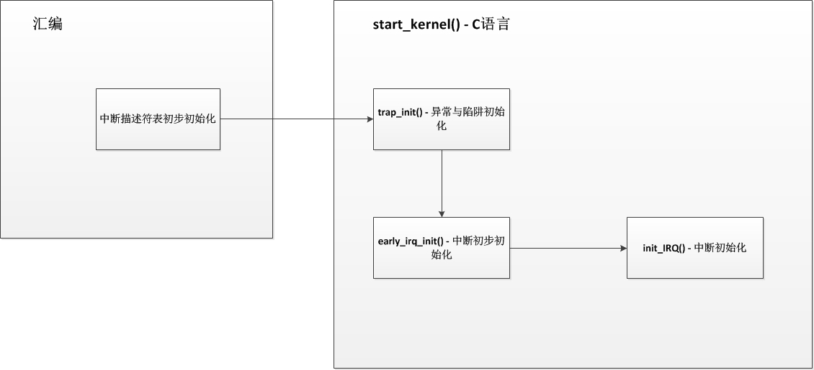

<!-- @import "[TOC]" {cmd="toc" depthFrom=1 depthTo=6 orderedList=false} -->

<!-- code_chunk_output -->

- [回顾](#回顾)
- [初始化中断描述符表](#初始化中断描述符表)
- [初始化异常向量](#初始化异常向量)
- [初始化中断](#初始化中断)
- [总结](#总结)

<!-- /code_chunk_output -->

# 回顾

在上一篇概述中, 介绍了几个对于中断来说非常重要的数据结构, 分别是: **中断描述符表**, **中断描述符数组**, **中断描述符**, **中断控制器描述符**, **中断服务例程**. 可以说这几个结构组成了整个内核中断框架主体, 所以内核对整个中断的初始化工作大多集中在了这几个结构上.

在系统中, 当**一个中断产生**时, 首先**CPU**从 vector\_irq 表获取相应的**中断向量**, 并根据**中断向量的权限位判断是否处于该权限**, 之后跳转至**中断处理函数**, 在中断处理函数中会**根据中断向量号获取中断描述符**, 并通过**中断描述符**获取此中断对应的**中断控制器描述符**, 然后**对中断控制器执行应答操作**, 最后执行此**中断描述符中的中断服务例程链表**, 最后**执行软中断**.

而整个初始化的过程与中断处理过程相应, 首先先**初始化中断描述符表**, 再**初始化中断描述符数组**和**中断描述符**. **中断控制器描述符**是**系统预定编写好的静态变量**, 如 i8259A 中断控制器对应的变量就是 `i8259A_chip`. 这时一个中断已经初始化完毕, 之后**驱动**需要使用此中断时系统会将**驱动中的中断处理**加入到**该中断的中断服务例程链表**中. 如下图


# 初始化中断描述符表

虽然称之为中断描述符表, 其实对于 CPU 来说只是一个起始地址, 此地址开始每向上 9 个字节为一个中断向量. 我们的 CPU 上有一个 idtr 寄存器, 它专门用于保存中断描述符表地址, 当产生一个中断时, CPU 会自动从 idtr 寄存器保存的中断描述符表地址处获取相应的中断向量, 然后判断权限并跳转至中断处理函数. 当计算机刚启动时, 首先会启动引导程序(BIOS), 在 BIOS 中会把中断描述符表存放在内存开始位置(0x00000000). BIOS 会有自己的一些默认中断处理函数, 而当 BIOS 处理完后, 会将计算机控制器转交给 linux, 而 linux 会在使用 BIOS 的中断描述符表的同时重新设置新的中断描述符表(新的地址保存在配置中的**CONFIG\_VECTORS\_BASE**), 之后会完全使用新的中断描述符表.

一般的, 我们也把中断描述符表中的中断向量称为门描述符, 其大小为 64 位, 其主要保存了段选择符、权限位和中断处理程序入口地址. **CPU**主要将门分为三种: **任务门, 中断门, 陷阱门**. 虽然 CPU 把门描述符分为了三种, 但是 linux 为了处理更多种情况, 把门描述符分为了五种, 分别为**中断门, 系统门, 系统中断门, 陷阱门**, 任务门; 但其存储结构与 CPU 定义的门不变. 结构如下:


**门描述符**的**初始化**主要分为**两部分**, 我们知道, **中断描述符表**中保存的是**中断**和**异常**, 所以**整个中断描述符表**的初始化需要分为**中断初始化**和**异常初始化**.

而中断描述符表的初始化情况是, 第一部分是经过**一段汇编代码**对**整个中断描述符表**进行初始化, 第二部分是在**系统进入 start\_kernel**()函数后分别对**异常和中断进行初始化**.

在 linux 中, **中断描述符表**用`idt_table[NR_VECTORS]`数组进行描述, **中断向量(门描述符**)在系统中用**struct desc\_struct**结构表示, 具体我们可以往下看.

```assembly
/*
 *  setup_once
 *
 *  The setup work we only want to run on the BSP.
 *
 *  Warning: %esi is live across this function.
 */
__INIT
setup_once:
    # idt_table 就是中断描述符表, 地址保存到 edi 中
    movl $idt_table,%edi
    # early_idt_handlers 地址保存到 eax 中, early_idt_handlers 是二维数组, 每行 9 个字符
    movl $early_idt_handlers,%eax
    # NUM_EXCEPTION_VECTORS 地址保存到 ecx 中, ecx 用于循环, NUM_EXCEPTION_VECTORS 为 32
    movl $NUM_EXCEPTION_VECTORS,%ecx
1:
    # 将 eax 的值保存到 edi 保存的地址中
    movl %eax,(%edi)
    # 将 eax 的值保存到 edi 保存的地址+4 中
    movl %eax,4(%edi)
    /* interrupt gate, dpl=0, present */
    # 将(0x8E000000 + __KERNEL_CS)一共 4 个字节保存到 edi 保存的地址+2 的位置中
    movl $(0x8E000000 + __KERNEL_CS),2(%edi)
    # eax += 9, 指向 early_idt_handlers 数组下一列
    addl $9,%eax
    # edi += 8, 就是下一个门描述符地址
    addl $8,%edi
    # 根据 ecx 是否为 0 进行循环
    loop 1b

    # 前 32 个中断向量初始化结果:
    # |63                         48|47    32|31         16|15                          0|
    # |early_idt_handlers[i](高 16 位)| 0x8E00 | __KERNEL_CS |early_idt_handlers[i](低 16 位)|

    # 256 - 32 保存到 ecx, 进行新一轮的循环
    movl $256 - NUM_EXCEPTION_VECTORS,%ecx
    # ignore_int 保存到 edx
    movl $ignore_int,%edx
    # (__KERNEL_CS << 16)保存到 eax
    movl $(__KERNEL_CS << 16),%eax
    movw %dx,%ax
    movw $0x8E00,%dx 2:
    movl %eax,(%edi)
    movl %edx,4(%edi)
    # edi += 8, 就是下一个门描述符地址
    addl $8,%edi
    loop 2b

    # 其他中断向量初始化结果:
    #  |63              48|47       32|31         16|15                 0|
    #  |ignore_int(高 16 位)|   0x8E00  | __KERNEL_CS | ignore_int(低 16 位) |
```

如果 CPU 是 486, 之后会通过 lidt  idt\_descr 命令将**中断描述符表(idt\_descr**)地址放入**idtr 寄存器**; 如果不是, 则暂时不会将 idt\_descr 放入 idtr 寄存器(在 trap\_init()函数再执行这步操作). idtr 寄存器一共是 48 位, 低 16 位保存的是中断描述符表长度, 高 32 位保存的是中断描述符表基地址. 我们可以看看 idt\_descr 的形式, 如下:

```c
idt_descr:
    .word IDT_ENTRIES*8-1   # 这里放入的是表长度,  256 * 8 - 1
    .long idt_table         # idt_table 地址放在这, idt_table 定义在/arch/x86/kernel/trap.h 中


/* 我们再看看 idt_table 是怎么定义的, idt_table 代表的就是中断描述符表 */
/* 代码地址: arch/x86/kernel/Traps.c */
gate_desc idt_table[NR_VECTORS] __page_aligned_bss;


/* 继续, 看看 gate_desc , 用于描述一个中断向量 */
#ifdef CONFIG_X86_64
typedef struct gate_struct64 gate_desc;
#else
typedef struct desc_struct gate_desc;
#endif

/* 我们看看 32 位下的 struct desc_struct, 此结构就是一个中断向量(门描述符)  */
struct desc_struct {
    union {
        struct {
            unsigned int a;
            unsigned int b;
        };
        struct {
            u16 limit0;
            u16 base0;
            unsigned base1: 8, type: 4, s: 1, dpl: 2, p: 1;
            unsigned limit: 4, avl: 1, l: 1, d: 1, g: 1, base2: 8;
        };
    };
} __attribute__((packed));
```

可以看出, 在**汇编代码初始化**部分, 所有的**门描述符的 DPL 权限位都设置为 0**(用户态不可访问), 段选择符设置为\_\_KERNEL\_CS 内核代码段. 而对于中断处理函数设置则不同, **前 32 个门描述符**的中断处理函数为**early\_idt\_handlers**, 之后的门描述符的中断处理函数为**ignore\_int**. 而在 linux 中, **0\~19**的**中断向量**是用于**异常和陷阱**. 20\~31 的中断向量是 intel 保留使用的.

# 初始化异常向量

**异常向量**作为在中断描述符表中的**前 20 个向量**(0\~19), 在**汇编代码**中已经将其的**处理函数**设置为**early\_idt\_handlers**, 而**进入 start\_kernel()函数后**, 系统会在**trap\_init**()函数中**重新设置它们的处理函数(！！！**), 由于异常和陷阱的特殊性, 它们并没有像中断这样复杂的数据结构, 单纯的, **每个异常和陷阱**有它们自己的中断处理函数, 系统只是简单地把中断处理函数放入异常和陷阱的门描述符中. 在了解 trap\_init()函数之前, 我们需要先了解如下几个函数:

```c
/* 设置一个中断门
  * n: 中断号
  * addr:中断处理程序入口地址
  */
#define set_intr_gate(n, addr)                        \
    do {                                \
        BUG_ON((unsigned)n > 0xFF);                \
        _set_gate(n, GATE_INTERRUPT, (void *)addr, 0, 0,    \
              __KERNEL_CS);                    \
        _trace_set_gate(n, GATE_INTERRUPT, (void *)trace_##addr,\
                0, 0, __KERNEL_CS);            \
    } while (0)


/* 设置一个系统中断门 */
static inline void set_system_intr_gate(unsigned int n, void *addr)
{
    BUG_ON((unsigned)n > 0xFF);
    _set_gate(n, GATE_INTERRUPT, addr, 0x3, 0, __KERNEL_CS);
}


/* 设置一个系统门 */
static inline void set_system_trap_gate(unsigned int n, void *addr)
{
    BUG_ON((unsigned)n > 0xFF);
    _set_gate(n, GATE_TRAP, addr, 0x3, 0, __KERNEL_CS);
}


/* 设置一个陷阱门 */
static inline void set_trap_gate(unsigned int n, void *addr)
{
    BUG_ON((unsigned)n > 0xFF);
    _set_gate(n, GATE_TRAP, addr, 0, 0, __KERNEL_CS);
}


/* 设置一个任务门 */
static inline void set_task_gate(unsigned int n, unsigned int gdt_entry)
{
    BUG_ON((unsigned)n > 0xFF);
    _set_gate(n, GATE_TASK, (void *)0, 0, 0, (gdt_entry<<3));
}
```

这几个函数用于设置不同门的 API 函数, 他们的参数 n 都为中断号, 而他们都会调用\_set\_gate()函数, 只是参数不同, \_set\_gate()函数如下:

```cpp
/* 设置一个门描述符, 并写入中断描述符表
 * gate: 中断号
 * type: 门类型
 * addr: 中断处理程序入口
 * dpl:  权限位
 * ist:  64 位系统才使用
 * seg:  段选择符
 */
static inline void _set_gate(int gate, unsigned type, void *addr,
                 unsigned dpl, unsigned ist, unsigned seg)
{
    gate_desc s;

    /* 生成一个门描述符 */
    pack_gate(&s, type, (unsigned long)addr, dpl, ist, seg);
    /*
     * does not need to be atomic because it is only done once at
     * setup time
     */
    /* 将新的门描述符写入中断描述符表中的 gate 项, 使用 memcpy 进行写入 */
    write_idt_entry(idt_table, gate, &s);
    /* 用于跟踪? 暂时还不清楚这个 trace_idt_table 的用途 */
    write_trace_idt_entry(gate, &s);
}
```

了解了以上的设置门描述符的函数, 我们再看看 trap_init()函数:

```c
void __init trap_init(void)
{
    int i;

/* 使用了 EISA 总线 */
#ifdef CONFIG_EISA
    void __iomem *p = early_ioremap(0x0FFFD9, 4);

    if (readl(p) == 'E' + ('I'<<8) + ('S'<<16) + ('A'<<24))
        EISA_bus = 1;
    early_iounmap(p, 4);
#endif

/* Interrupts/Exceptions */
//enum {
//    X86_TRAP_DE = 0,    /*  0, 除 0 操作 Divide-by-zero */
//    X86_TRAP_DB,        /*  1, 调试使用 Debug */
//    X86_TRAP_NMI,        /*  2, 非屏蔽中断 Non-maskable Interrupt */
//    X86_TRAP_BP,        /*  3, 断点 Breakpoint */
//    X86_TRAP_OF,        /*  4, 溢出 Overflow */
//    X86_TRAP_BR,        /*  5, 越界异常 Bound Range Exceeded */
//    X86_TRAP_UD,        /*  6, 无效操作码 Invalid Opcode */
//    X86_TRAP_NM,        /*  7, 无效设备 Device Not Available */
//    X86_TRAP_DF,        /*  8, 双重故障 Double Fault */
//    X86_TRAP_OLD_MF,    /*  9, 协处理器段超限 Coprocessor Segment Overrun */
//    X86_TRAP_TS,        /* 10, 无效任务状态段(TSS) Invalid TSS */
//    X86_TRAP_NP,        /* 11, 段不存在 Segment Not Present */
//    X86_TRAP_SS,        /* 12, 栈段错误 Stack Segment Fault */
//    X86_TRAP_GP,        /* 13, 保护错误 General Protection Fault */
//    X86_TRAP_PF,        /* 14, 页错误 Page Fault */
//    X86_TRAP_SPURIOUS,    /* 15, 欺骗性中断 Spurious Interrupt */
//    X86_TRAP_MF,        /* 16, X87 浮点数异常 Floating-Point Exception */
//    X86_TRAP_AC,        /* 17, 对齐检查 Alignment Check */
//    X86_TRAP_MC,        /* 18, 设备检查 Machine Check */
//    X86_TRAP_XF,        /* 19, SIMD 浮点数异常 Floating-Point Exception */
//    X86_TRAP_IRET = 32,    /* 32, 汇编指令异常 IRET Exception */
//};

    set_intr_gate(X86_TRAP_DE, divide_error);
    /* 在 32 位系统上其效果等同于 set_intr_gate  */
    set_intr_gate_ist(X86_TRAP_NMI, &nmi, NMI_STACK);
    /* int4 can be called from all */
    set_system_intr_gate(X86_TRAP_OF, &overflow);
    set_intr_gate(X86_TRAP_BR, bounds);
    set_intr_gate(X86_TRAP_UD, invalid_op);
    set_intr_gate(X86_TRAP_NM, device_not_available);
#ifdef CONFIG_X86_32
    set_task_gate(X86_TRAP_DF, GDT_ENTRY_DOUBLEFAULT_TSS);
#else
    set_intr_gate_ist(X86_TRAP_DF, &double_fault, DOUBLEFAULT_STACK);
#endif
    set_intr_gate(X86_TRAP_OLD_MF, coprocessor_segment_overrun);
    set_intr_gate(X86_TRAP_TS, invalid_TSS);
    set_intr_gate(X86_TRAP_NP, segment_not_present);
    set_intr_gate(X86_TRAP_SS, stack_segment);
    set_intr_gate(X86_TRAP_GP, general_protection);
    set_intr_gate(X86_TRAP_SPURIOUS, spurious_interrupt_bug);
    set_intr_gate(X86_TRAP_MF, coprocessor_error);
    set_intr_gate(X86_TRAP_AC, alignment_check);
#ifdef CONFIG_X86_MCE
    set_intr_gate_ist(X86_TRAP_MC, &machine_check, MCE_STACK);
#endif
    set_intr_gate(X86_TRAP_XF, simd_coprocessor_error);

    /* 将前 32 个中断号都设置为已使用状态 */
    for (i = 0; i < FIRST_EXTERNAL_VECTOR; i++)
        set_bit(i, used_vectors);

#ifdef CONFIG_IA32_EMULATION
    /* 设置 0x80 系统调用的系统中断门 */
    set_system_intr_gate(IA32_SYSCALL_VECTOR, ia32_syscall);
    set_bit(IA32_SYSCALL_VECTOR, used_vectors);
#endif

#ifdef CONFIG_X86_32
    /* 设置 0x80 系统调用的系统门 */
    set_system_trap_gate(SYSCALL_VECTOR, &system_call);
    set_bit(SYSCALL_VECTOR, used_vectors);
#endif

    /*
     * Set the IDT descriptor to a fixed read-only location, so that the
     * "sidt" instruction will not leak the location of the kernel, and
     * to defend the IDT against arbitrary memory write vulnerabilities.
     * It will be reloaded in cpu_init() */
    /* 将中断描述符表设置在一个固定的只读的位置,以便"sidt"指令不会泄漏内核的位置,和保护中断描述符表可以处于任意内存写的漏洞. 它将会在 cpu_init() 中被加载到 idtr 寄存器 */
    __set_fixmap(FIX_RO_IDT, __pa_symbol(idt_table), PAGE_KERNEL_RO);
    idt_descr.address = fix_to_virt(FIX_RO_IDT);

    /* 执行 CPU 的初始化, 对于中断而言, 在 cpu_init() 中主要是将 idt_descr 放入 idtr 寄存器中 */
    cpu_init();

    /* x86_init 是一个定义了很多 x86 体系上的初始化操作, 这里执行的另一个 trap_init()函数为空函数, 什么都不做 */
    x86_init.irqs.trap_init();

#ifdef CONFIG_X86_64
    /* 64 位操作 */
    /* 将 idt_table 复制到 debug_idt_table 中 */
    memcpy(&debug_idt_table, &idt_table, IDT_ENTRIES * 16);
    set_nmi_gate(X86_TRAP_DB, &debug);
    set_nmi_gate(X86_TRAP_BP, &int3);
#endif
}
```

在代码中, **used\_vectors 变量(！！！**)是一个**bitmap**, 它用于记录**中断描述符表**中**哪些中断**已经**被系统注册和使用**, 哪些**未被注册**使用. trap\_init()已经完成了**异常和陷阱的初始化**. 对于**linux**而言, **中断号 0\~19**是专门用于**陷阱和故障使用**的, 以上代码也表明了这一点, 而**20\~31**一般是**intel 用于保留**的. 而我们的**外部 IRQ 线**使用的**中断为 32\~255**(代码中 32 号中断被用作汇编指令异常中断). 所以, 在**trap\_init**()代码中, 专门对**0\~19 号中断的门描述符**进行了**初始化**, 最后将**新的中断描述符表起始地址**放入**idtr 寄存器**中. 在**trap\_init**()中我们看到**每个异常和陷阱**都有他们自己的处理函数, 不过它们的处理函数的处理方式都大同小异, 如下:

```c
#代码地址: arch/x86/kernel/entry_32.S

# 11 号异常处理函数入口
ENTRY(segment_not_present)
    RING0_EC_FRAME
    ASM_CLAC
    pushl_cfi $do_segment_not_present
    jmp error_code
    CFI_ENDPROC
END(segment_not_present)

# 12 号异常处理函数入口
ENTRY(stack_segment)
    RING0_EC_FRAME
    ASM_CLAC
    pushl_cfi $do_stack_segment
    jmp error_code
    CFI_ENDPROC
END(stack_segment)

# 17 号异常处理函数入口
ENTRY(alignment_check)
    RING0_EC_FRAME
    ASM_CLAC
    pushl_cfi $do_alignment_check
    jmp error_code
    CFI_ENDPROC
END(alignment_check)

# 0 号异常处理函数入口
ENTRY(divide_error)
    RING0_INT_FRAME
    ASM_CLAC
    pushl_cfi $0            # no error code
    pushl_cfi $do_divide_error
    jmp error_code
    CFI_ENDPROC
END(divide_error)
```

这些函数具体细节我们下篇文章分析.

在**trap\_init**()函数中调用了**cpu\_init**()函数, 在此函数中会**将新的中断描述符表地址**放入**idtr 寄存器**中, 而具体内核是如何实现的呢, 之前已经说明, **idtr 寄存器**的**低 16 位**保存的是**中断描述符表长度**, **高 32 位**保存的是**中断描述符表基地址**, 相对于的, 内核定义了一个**struct desc\_ptr 结构**专门用于**保存 idtr 寄存器内容**, 其如下:

```c
/* 代码地址: arch/x86/include/asm/Desc_defs.h */
struct desc_ptr {
    unsigned short size;
    unsigned long address;
} __attribute__((packed)) ;


/* 代码地址: arch/x86/kernel/cpu/Common.c */
/* 专门用于保存需要写入 idtr 寄存器值的变量, 这里可以看出, 中断描述符表长度为 256 * 16 - 1, 地址为 idt_table */
struct desc_ptr idt_descr = { NR_VECTORS * 16 - 1, (unsigned long) idt_table };
```

在**cpu\_init**()中, 会调用**load\_current\_idt**()函数进行写入, 如下:

```c
static inline void load_current_idt(void)
{
    if (is_debug_idt_enabled())
        /* 开启了中断调试, 用的是 debug_idt_descr 和 debug_idt_table */
        load_debug_idt();
    else if (is_trace_idt_enabled())
        /* 开启了中断跟踪, 用的是 trace_idt_descr 和 trace_idt_table */
        load_trace_idt();
    else
        /* 普通情况, 用的是 idt_descr 和 idt_table */
        load_idt((const struct desc_ptr *)&idt_descr);
}

/* load_idt()的定义 */
#define load_idt(dtr)                native_load_idt(dtr)

/* native_load_idt()的定义 */
static inline void native_load_idt(const struct desc_ptr *dtr)
{
    asm volatile("lidt %0"::"m" (*dtr));
}
```

到这, **异常和陷阱已经初始化**完毕, 内核也已经开始使用新的中断描述符表了, BIOS 的中断描述符表就已经遗弃, 不再使用了.

# 初始化中断

内核是在**异常和陷阱初始化完成**的情况下才会进行**中断的初始化**, 中断的初始化也是处于 `start_kernel()` 函数中, 分为两个部分, 分别是`early_irq_init()` 和 `init_IRQ()`.

**early\_irq\_init**() 是第一步的初始化, 其工作主要是跟**硬件无关的一些初始化**, 比如一些变量的初始化, **分配必要的内存**等.

**init\_IRQ**()是第二步, 其主要就是关于**硬件部分的初始化**了.

首先我们先看看**中断描述符数组 irq\_desc[NR\_IRQS**]:

```c
/* 中断描述符数组 */
struct irq_desc irq_desc[NR_IRQS] __cacheline_aligned_in_smp = {
    [0 ... NR_IRQS-1] = {
        .handle_irq    = handle_bad_irq,
        .depth        = 1,
        .lock        = __RAW_SPIN_LOCK_UNLOCKED(irq_desc->lock),
    }
};
```

可以看到, irq\_desc 数组有 **NR\_IRQS 个元素**, **NR\_IRQS 并不是 256\-32(！！！**), 实际上, 虽然**中断描述符表**中一共有 **256 项**(**前 32 项用作异常和 intel 保留**), 但并**不是所有中断向量**都会使用到, 所以中断描述符数组也不一定是 256\-32 项, **CPU 可以使用多少个中断**是由**中断控制器(PIC、APIC**)或者**内核配置**决定的, 我们看看 NR\_IRQS 的定义:

```c
/* IOAPIC 为外部中断控制器 */
#ifdef CONFIG_X86_IO_APIC
#define CPU_VECTOR_LIMIT        (64 * NR_CPUS)
#define NR_IRQS                    \
    (CPU_VECTOR_LIMIT > IO_APIC_VECTOR_LIMIT ?    \
        (NR_VECTORS + CPU_VECTOR_LIMIT)  :    \
        (NR_VECTORS + IO_APIC_VECTOR_LIMIT))
#else /* !CONFIG_X86_IO_APIC: NR_IRQS_LEGACY = 16 */
#define NR_IRQS            NR_IRQS_LEGACY
#endif
```

这时我们可以先看看 early\_irq\_init()函数:

```c
int __init early_irq_init(void)
{
    int count, i, node = first_online_node;
    struct irq_desc *desc;

    /* 初始化 irq_default_affinity 变量, 此变量用于设置中断默认的 CPU 亲和力 */
    init_irq_default_affinity();

    printk(KERN_INFO "NR_IRQS:%d\n", NR_IRQS);

    /* 指向中断描述符数组 irq_desc */
    desc = irq_desc;
    /* 获取中断描述符数组长度 */
    count = ARRAY_SIZE(irq_desc);

    for (i = 0; i < count; i++) {
        /* 为 kstat_irqs 分配内存, 每个 CPU 有自己独有的 kstat_irqs 数据, 此数据用于统计 */
        desc[i].kstat_irqs = alloc_percpu(unsigned int);
        /* 为 desc->irq_data.affinity 和 desc->pending_mask 分配内存 */
        alloc_masks(&desc[i], GFP_KERNEL, node);
        /* 初始化中断描述符的锁 */
        raw_spin_lock_init(&desc[i].lock);
        /* 设置中断描述符的锁所属的类, 此类用于防止死锁 */
        lockdep_set_class(&desc[i].lock, &irq_desc_lock_class);
        /* 一些变量的初始化 */
        desc_set_defaults(i, &desc[i], node, NULL);
    }

    return arch_early_irq_init();
}
```

更多的初始化在 desc\_set\_defaults()函数中:

```c
static void desc_set_defaults(unsigned int irq, struct irq_desc *desc, int node,
        struct module *owner)
{
    int cpu;

    /* 中断号 */
    desc->irq_data.irq = irq;
    /* 中断描述符的中断控制器芯片为 no_irq_chip  */
    desc->irq_data.chip = &no_irq_chip;
    /* 中断控制器的私有数据为空 */
    desc->irq_data.chip_data = NULL;
    desc->irq_data.handler_data = NULL;
    desc->irq_data.msi_desc = NULL;
    /* 设置中断状态 desc->status_use_accessors 为初始化状态_IRQ_DEFAULT_INIT_FLAGS */
    irq_settings_clr_and_set(desc, ~0, _IRQ_DEFAULT_INIT_FLAGS);
    /* 中断默认被禁止, 设置 desc->irq_data->state_use_accessors = IRQD_IRQ_DISABLED */
    irqd_set(&desc->irq_data, IRQD_IRQ_DISABLED);
    /* 设置中断处理回调函数为 handle_bad_irq, handle_bad_irq 作为默认的回调函数, 此函数中基本上不做什么处理, 就是在屏幕上打印此中断信息, 并且 desc->kstat_irqs++ */
    desc->handle_irq = handle_bad_irq;
    /* 嵌套深度为 1, 表示被禁止 1 次 */
    desc->depth = 1;
    /* 初始化此中断发送次数为 0 */
    desc->irq_count = 0;
    /* 无法处理的中断次数为 0 */
    desc->irqs_unhandled = 0;
    /* 在/proc/interrupts 所显名字为空 */
    desc->name = NULL;
    /* owner 为空 */
    desc->owner = owner;

    /* 初始化 kstat_irqs 中每个 CPU 项都为 0 */
    for_each_possible_cpu(cpu)
        *per_cpu_ptr(desc->kstat_irqs, cpu) = 0;

    /* SMP 系统才使用的初始化, 设置
     * desc->irq_data.node = first_online_node
     * desc->irq_data.affinity = irq_default_affinity
     * 清除 desc->pending_mask
     */
    desc_smp_init(desc, node);
}
```

整个 `early_irq_init()` 在这里就初始化完毕了, 相对来说比较简单, 可以说 `early_irq_init()` 只是**初始化了中断描述符数组中的所有元素**.

在看 `init_IRQ()` 前需要看看 **legacy\_pic 这个变量**, 它其实就是 CPU 内部的中断控制器 i8259A, 定义了与 i8259A 相关的一些处理函数和中断数量, 如下:

```c
struct legacy_pic default_legacy_pic = {
    .nr_legacy_irqs = NR_IRQS_LEGACY,
    .chip  = &i8259A_chip,
    .mask = mask_8259A_irq,
    .unmask = unmask_8259A_irq,
    .mask_all = mask_8259A,
    .restore_mask = unmask_8259A,
    .init = init_8259A,
    .irq_pending = i8259A_irq_pending,
    .make_irq = make_8259A_irq,
};

struct legacy_pic *legacy_pic = &default_legacy_pic;
```

在 X86 体系下, CPU 使用的内部中断控制器是 i8259A, 内核就定义了这个变量进行使用, 在 `init_IRQ()` 中会将所有的中断描述符的中断控制器芯片指向 i8259A, 具体我们先看看 `init_IRQ()` 代码:

```cpp
// init/main.c
void start_kernel(void)
{
    ...
	init_IRQ();
    ...
}
// arch/x86/kernel/irqinit.c
void __init init_IRQ(void)
{
    int i;

    /*
     * On cpu 0, Assign IRQ0_VECTOR..IRQ15_VECTOR's to IRQ 0..15.
     * If these IRQ's are handled by legacy interrupt-controllers like PIC,
     * then this configuration will likely be static after the boot. If
     * these IRQ's are handled by more mordern controllers like IO-APIC,
     * then this vector space can be freed and re-used dynamically as the
     * irq's migrate etc.
     */
    /* nr_legacy_irqs() 返回 legacy_pic->nr_legacy_irqs, 为 16
     * vector_irq 是一个 int 型的数组, 长度为中断描述符表长, 其保存的是中断向量对应的中断号(如果中断向量是异常则没有中断号)
     * i8259A 中断控制器使用 IRQ0~IRQ15 这 16 个中断号, 这里将这 16 个中断号设置到 CPU0 的 vector_irq 数组的 0x30~0x3f 上.
     */
    for (i = 0; i < nr_legacy_irqs(); i++)
        per_cpu(vector_irq, 0)[IRQ0_VECTOR + i] = i;

    /* x86_init 是一个结构体, 里面定义了一组 X86 体系下的初始化函数 */
    x86_init.irqs.intr_init();
}
```

`x86_init.irqs.intr_init()` 是一个函数指针, 其指向 `native_init_IRQ()`, 我们可以直接看看 `native_init_IRQ()`:

```cpp
// arch/x86/kernel/irqinit.c
void __init native_init_IRQ(void)
{
    int i;

    /* Execute any quirks before the call gates are initialised: */
    /* 这里又是执行 x86_init 结构中的初始化函数, pre_vector_init()指向 init_ISA_irqs  */
    x86_init.irqs.pre_vector_init();

    /* 初始化中断描述符表中的中断控制器中默认的一些中断门初始化 */
    apic_intr_init();

    /*
     * Cover the whole vector space, no vector can escape
     * us. (some of these will be overridden and become
     * 'special' SMP interrupts)
     */
    /* 第一个外部中断, 默认是 32 */
    i = FIRST_EXTERNAL_VECTOR;

    /* 在 used_vectors 变量中找出所有没有置位的中断向量, 我们知道, 在 trap_init()中对所有异常和陷阱和系统调用中断都置位了 used_vectors, 没有置位的都为中断
     * 这里就是对所有中断设置门描述符
     */
    for_each_clear_bit_from(i, used_vectors, NR_VECTORS) {
        /* IA32_SYSCALL_VECTOR could be used in trap_init already. */
        /* interrupt[]数组保存的是外部中断的中断门信息
         * 这里将中断描述符表中空闲的中断向量设置为中断门,interrupt 是一个函数指针数组, 其将 31~255 数组元素指向 interrupt[i]函数
         */
        set_intr_gate(i, interrupt[i - FIRST_EXTERNAL_VECTOR]);
    }

    /* 如果外部中断控制器需要, 则安装一个中断处理例程 irq2 到中断 IRQ2 上 */
    if (!acpi_ioapic && !of_ioapic && nr_legacy_irqs())
        setup_irq(2, &irq2);

#ifdef CONFIG_X86_32
    /* 在 x86_32 模式下, 会为当前 CPU 分配一个中断使用的栈空间 */
    irq_ctx_init(smp_processor_id());
#endif
}
```

在 `native_init_IRQ()` 中, 又使用了 `x86_init` 变量中的 `pre_vector_init` 函数指针, 其指向 `init_ISA_irqs()` 函数:

```cpp
// arch/x86/kernel/irqinit.c
void __init init_ISA_irqs(void)
{
    /* CHIP 默认是 i8259A_chip */
    struct irq_chip *chip = legacy_pic->chip;
    int i;

#if defined(CONFIG_X86_64) || defined(CONFIG_X86_LOCAL_APIC)
    /* 使用了 CPU 本地中断控制器 */
    /* 尽可能早开启 virtual wire mode via Local APIC */
    init_bsp_APIC();
#endif
    /* 其实就是调用 init_8259A(), 进行 8259A 硬件的初始化 */
    legacy_pic->init(0);

    for (i = 0; i < nr_legacy_irqs(); i++)
        /* i 为中断号, chip 是 irq_chip 结构, 最后是中断回调函数
         * 设置了中断号 i 的中断描述符的 irq_data.irq_chip = i8259A_chip
         * 设置了中断回调函数为 handle_level_irq
         */
        irq_set_chip_and_handler(i, chip, handle_level_irq);
}
```

在 `init_ISA_irqs()` 函数中, 最主要的就是将内核使用的**外部中断**的**中断描述符的中断控制器设置为 i8259A\_chip**, 中断回调函数为 `handle_level_irq`.

回到 `native_init_IRQ()` 函数, 当执行完 `x86_init.irqs.pre_vector_init()` 之后, 会执行 `apic_intr_init()` 函数, 这个函数中会初始化一些中断控制器特定的中断函数(这些中断游离于之前描述的中断体系中, 它们没有自己的中断描述符, 中断向量中直接保存它们自己的中断处理函数, 类似于异常与陷阱的调用情况), 具体我们看看:

```c
static void __init apic_intr_init(void)
{
    smp_intr_init();

#ifdef CONFIG_X86_THERMAL_VECTOR
    /* 中断号为: 0xfa, 处理函数为: thermal_interrupt */
    alloc_intr_gate(THERMAL_APIC_VECTOR, thermal_interrupt);
#endif
#ifdef CONFIG_X86_MCE_THRESHOLD
    alloc_intr_gate(THRESHOLD_APIC_VECTOR, threshold_interrupt);
#endif

#if defined(CONFIG_X86_64) || defined(CONFIG_X86_LOCAL_APIC)
    /* self generated IPI for local APIC timer */
    alloc_intr_gate(LOCAL_TIMER_VECTOR, apic_timer_interrupt);

    /* IPI for X86 platform specific use */
    alloc_intr_gate(X86_PLATFORM_IPI_VECTOR, x86_platform_ipi);
#ifdef CONFIG_HAVE_KVM
    /* IPI for KVM to deliver posted interrupt */
    alloc_intr_gate(POSTED_INTR_VECTOR, kvm_posted_intr_ipi);
#endif

    /* IPI vectors for APIC spurious and error interrupts */
    alloc_intr_gate(SPURIOUS_APIC_VECTOR, spurious_interrupt);
    alloc_intr_gate(ERROR_APIC_VECTOR, error_interrupt);

    /* IRQ work interrupts: */
# ifdef CONFIG_IRQ_WORK
    alloc_intr_gate(IRQ_WORK_VECTOR, irq_work_interrupt);
# endif

#endif
}
```

在 apic\_intr\_init()函数中, 使用了 alloc\_intr\_gate()函数进行处理, 这个函数的处理也很简单, 置位该中断号所处 used\_vectors 位置, 调用 set\_intr\_gate()设置一个中断门描述符.

到这里整个中断及异常都已经初始化完成了.

# 总结

总结一下.

- 在 linux 系统中, 中断一共有 256 个, `0~19` 主要用于异常与陷阱, `20~31` 是 intel 保留, 未使用. `32~255` 作为外部中断进行使用. 特别的, 0x80 中断用于系统调用.
- 机器上电时, BIOS 会初始化一个中断描述符表, 当交接给 linux 内核后, 内核会自己新建立一个中断描述符表, 之后完全使用自己的中断描述符表, 舍弃 BIOS 的中断描述符表.
- 在 x86 上系统默认使用的中断控制器为 **i8259A**.
- 中断描述符的初始化过程中, 内核会将**中断描述符的默认中断控制器设置为 i8259A**, 中断处理回调函数为 `handle_level_irq()`.
- **外部中断**的门描述的**中断处理函数**都为 `interrupt[i]`.

中断的初始化大体上分为两个部分, 第一个部分为汇编代码的中断描述符表的初次初始化, 第二部分为 C 语言代码, 其又分为异常与陷阱的初始化和中断的初始化. 如图:



在汇编的中断描述符表初始化过中, 其主要对整个中断描述符表进行了初始化, 其主要工作是:

- 所有的门描述符的权限位为 0;
- 所有的门描述符的段选择符为 `__KERNEL_CS`;
- 0\~31 的门描述符的中断处理程序为 `early_idt_handlers[i](0 <= i <= 31)`;
- 其他的门描述符的中断处理程序为 `ignore_int`;

而 `trap_init()` 所做的异常与陷阱初始化, 就是修改中断描述符表的前 19 项(异常和中断), 主要修改他们的中断处理函数入口和权限位, 特殊的如任务门还会设置它们的段选择符. 在 `trap_init()` 中就已经把所有的异常和陷阱都初始化完成了, 并会把新的中断描述符表地址放入 idtr 寄存器, 开始使用新的中断描述符表.

在 `early_irq_init()` 中, 主要工作是初始化整个中断描述符数组, 将数组中的每个中断描述符中的必要变量进行初始化.

最后在 `init_IRQ()` 中, 主要工作是初始化中断描述符表中的所有中断门描述符, 对于一般的中断, 内核将它们的中断处理函数入口设置为 `interrupt[i]`, 而一些特殊的中断会在 `apic_intr_init()` 中进行设置. 之后, `init_IRQ()` 会初始化内部和外部的中断控制器, 最后将一般的中断使用的中断控制器设置为 i8259A, 中断处理函数为 `handle_level_irq` (电平触发).