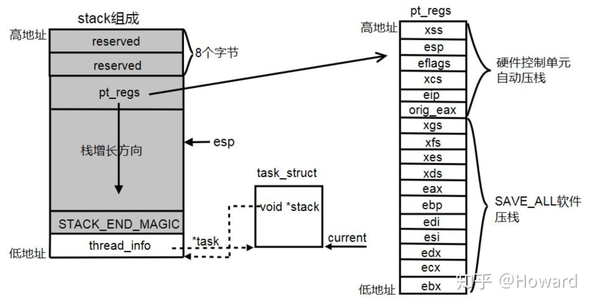

# 回顾

上篇文章 linux 中断源码分析 - 初始化 (二) 已经描述了中断描述符表和中断描述符数组的初始化, 由于在初始化期间系统关闭了中断(通过设置 CPU 的 EFLAGS 寄存器的 IF 标志位为 0), 当整个中断和异常的初始化完成后, 系统会开启中断(设置 CPU 的 EFLAGS 寄存器的 IF 标志位为 1), 此时整个系统的中断已经开始可以使用了. 本篇文章我们具体研究一次典型中断发生时的运行流程.

# 禁止调度和抢占

首先我们需要了解, 当系统处于中断上下文时, 是禁止发生调度和抢占的. 进程的 thread_info 中有个 preempt_count 成员变量, 其作为一个变量, 包含了 3 个计数器和一个标志位, 如下:

位 | 描述 | 解释
---------|----------|---------
 0~7 | 抢占计数器 | 也可以说是锁占有数
 8~15 | 软中断计数器 | 记录软中断被禁用次数, 0 表示可以进行软中断
 16~27 | 硬中断计数器 | 表示中断处理嵌套次数, irq_enter()增加它, irq_exit()减少它
 28 | PREEMPT_ACTIVE 标志 | 表明正在进行内核抢占, 设置此标志也禁止了抢占

当进入到中断时, 中断处理程序会调用 irq_enter()函数禁止抢占和调度. 当中断退出时, 会通过 irq_exit()减少其硬件计数器. 我们需要清楚的就是, 无论系统处于硬中断还是软中断, 调度和抢占都是被禁止的.

# 中断产生

我们需要先明确一下, 中断控制器与 CPU 相连的三种线: INTR, 数据线, INTA.

在硬件电路中, 中断的产生发生一般只有两种, 分别是: 电平触发方式和边沿触发方式. 当一个外部设备产生中断, 中断信号会沿着中断线到达中断控制器. 中断控制器接收到该外部设备的中断信号后首先会检测自己的中断屏蔽寄存器是否屏蔽该中断. 如果没有, 则设置中断请求寄存器中中断向量号对应的位, 并将 INTR 拉高用于通知 CPU,CPU 每当执行完一条指令时都会去检查 INTR 引脚是否有信号(这是 CPU 自动进行的), 如果有信号, CPU 还会检查 EFLAGS 寄存器的 IF 标志位是否禁止了中断(IF = 0), 如果 CPU 未禁止中断, CPU 会自动通过 INTA 信号线应答中断控制器. CPU 再次通过 INTA 信号线通知中断控制器, 此时中断控制器会把中断向量号送到数据线上, CPU 读取数据线获取中断向量号. 到这里实际上中断向量号已经发送给 CPU 了, 如果中断控制器是 AEIO 模式, 则会自动清除中断向量号对应的中断请求寄存器的位, 如果是 EIO 模式, 则等待 CPU 发送的 EIO 信号后在清除中断向量号对应的中断请求寄存器的位.

用步骤描述就是:

* 中断控制器收到中断信号
* 中断控制器检查中断屏蔽寄存器是否屏蔽该中断, 若屏蔽直接丢弃
* 中断控制器设置该中断所在的中断请求寄存器位
* 通过 INTR 通知 CPU
* CPU 收到 INTR 信号, 检查是否屏蔽中断, 若屏蔽直接无视
* CPU 通过 INTA 应答中断控制器
* CPU 再次通过 INTA 应答中断控制器, 中断控制器将中断向量号放入数据线
* CPU 读取数据线上的中断向量号
* 若中断控制器为 EIO 模式, CPU 发送 EIO 信号给中断控制器, 中断控制器清除中断向量号对应的中断请求寄存器位

# SMP 系统

在 SMP 系统, 也就是多核情况下, 外部的中断控制器有可能会于多个 CPU 相连, 这时候当一个中断产生时, 中断控制器有两种方式将此中断送到 CPU 上, 分别是静态分发和动态分发. 区别就是静态分发设置了指定中断送往指定的一个或多个 CPU 上. 动态分发则是由中断控制器控制中断应该发往哪个 CPU 或 CPU 组.

CPU 已经接收到了中断信号以及中断向量号. 此时 CPU 会自动跳转到中断描述符表地址, 以中断向量号作为一个偏移量, 直接访问中断向量号对应的门描述符. 在门描述符中, 有个特权级(DPL), 系统会先检查这个位, 然后清除 EFLAGS 的 IF 标志位(这也说明了发发生中断时实际上 CPU 是禁止其他可屏蔽中断的), 之后转到描述符中的中断处理程序中. 在上一篇文章我们知道, 所有的中断门描述符的中断处理程序都被初始化成了 interrupt[i], 它是一段汇编代码.

# 中断和异常发生时 CPU 自动完成的工作

我们先注意看一下中断描述符表, 里面的每个中断描述符都有一个段选择符和一个偏移量以及一个 DPL(特权级), 而偏移量其实就是中断处理程序的入口地址, 当中断或异常发生时:

* CPU 首先会确定是中断或异常的向量号, 然后根据这个向量号作为偏移量, 通过读取 idtr 中保存的中断向量表 (IDT) 的基地址获取相应的门描述符. 并从门描述符中拿出其中的段选择符
* 根据段选择符从 GDT 中获取这个段的段描述符(为什么只从 GDT 中获取? 因为初始化所有中段描述符时使用的段选择符几乎都是__USER_CS,__KERNEL_CS,TSS, 这几个段选择符对应的段描述符都保存在 GDT 中). 而这几个段描述符中的基地址都是 0x00000000, 所以偏移量就是中断处理程序入口地址.
* 这时还没有进入到中断处理程序, CPU 会先使用 CS 寄存器的当前特权级 (CPL) 与中断向量描述符中对应的段描述符的 DPL 进行比较, 如果 DPL 的值 <= CPL 的值, 则通过检查, 而 DPL 的值 > CPL 的值时, 会产生一个 "通用保护" 异常. 这种情况发生的可能性很小, 因为在上一篇初始化的文章中也可以看出来, 中断初始化所用的段选择符都是__KERNEL_CS, 而异常的段选择符几乎也都是__KERNEL_CS, 只除了极特殊的几个除外. 也就是大多数中断和异常的段选择符 DPL 都是 0,CPL 无论是在内核态 (CPL = 0) 或者是用户态(CPL = 3), 都可以执行这些中断和异常. 这里的检查可以理解为检查是否需要切换段.
* 如果是用户程序的异常(非 CPU 内部产生的异常), 这里还需要再进行多一步的检查(中断和 CPU 内部异常则不用进行这步检查), 我们回忆一下中断初始化的文章, 里面介绍了门描述符, 在门描述符中也有一个 DPL 位, 用户程序的异常还要对这个位进行检查, 当前特权级 CPL 的值 <= DPL 的值时, 则通过检查, 否则不能通过检查, 而只有系统门和系统中断门的 DPL 是 3, 其他的异常门的 DPL 都为 0. 这样做的好处是避免了用户程序访问陷阱门, 中断门和任务门. (这里可以理解为进入此 "门" 的权限, 所以只有系统门和系统中断门是程序能够主动进入的, 也就是我们做系统调用走的门)
* 如果以上检查都通过, 并且 CS 寄存器的特权级发生变化(用户态陷入内核), 则 CPU 会访问此 CPU 的 TSS 段(通过 tr 寄存器), 在 TSS 段中读取当前进程的 SS 和 ESP 到 SS 和 ESP 寄存器中, 这样就完成了用户态栈到内核态栈的切换. 之后把之前的 SS 寄存器和 ESP 寄存器的值保存到当前内核栈中.
* 将 eflags,CS,EIP 寄存器的值压入内核栈中. 这样就保存了返回后需要执行的上下文.
* 最后将刚才获取到的段选择符加载到 CS 寄存器(CS 段切换), 段描述符加载到 CS 对应的非编程寄存器中, 也就是 CS 寄存器保存的是__KERNEL_CS,CS 寄存器的非编程寄存器中保存的是对应的段描述符. 而根据段描述符中的段基址 + 段内偏移量(保存在门描述符中), 则得到了处理程序入口地址, 实际上我们知道段基址是 0x00000000, 段内偏移量实际上就是处理程序入口地址, 这个门描述符的段内偏移量会被放到 IP 寄存器中.

# interrupt[i]

interrupt[i]的每个元素都相同, 执行相同的汇编代码, 这段汇编代码实际上很简单, 它主要工作就是将中断向量号和被中断上下文 (进程上下文或者中断上下文) 保存到栈中, 最后调用 do_IRQ 函数.

```assembly
# 代码地址: arch/x86/kernel/entry_32.S

# 开始
1:    pushl_cfi $(~vector+0x80)    /* Note: always in signed byte range */ # 先会执行这一句, 将中断向量号取反然后加上 0x80 压入栈中
      .if ((vector-FIRST_EXTERNAL_VECTOR)%7) <> 6
    jmp 2f                                                     # 数字定义的标号为临时标号, 可以任意重复定义, 例如:"2f" 代表正向第一次出现的标号 "2:",3b 代表反向第一次出现的标号 "3:"
      .endif
      .previous                                             # .previous 使汇编器返回到该自定义段之前的段进行汇编, 则回到上面的数据段
    .long 1b                                                 # 在数据段中执行标号 1 的操作
      .section .entry.text, "ax"                             # 回到代码段
vector=vector+1 
    .endif 
  .endr
2:    jmp common_interrupt


common_interrupt:
    ASM_CLAC
    addl $-0x80,(%esp)       # 此时栈顶是(~vector + 0x80), 这里再加上 - 0x80, 实际就是中断向量号取反, 用于区别系统调用, 系统调用是正数, 中断向量是负数
    SAVE_ALL                 # 保存现场, 将寄存器值压入栈中
    TRACE_IRQS_OFF           # 关闭中断跟踪
    movl %esp,%eax           # 将栈指针保存到 eax 寄存器, 供 do_IRQ 使用
    call do_IRQ              # 调用 do_IRQ
    jmp ret_from_intr        # 跳转到 ret_from_intr, 进行中断返回的一些处理
ENDPROC(common_interrupt)
    CFI_ENDPROC
```

需要注意这里面有一个 SAVE_ALL 是用于保存用户态寄存器值的, 在上面的文章中有提到 CPU 会自动保存原来特权级的段和栈到内核栈中, 但是通用寄存器并不会保存, 所以这里会有个 SAVE_ALL 来保存通用寄存器的值. 所以当 SAVE_ALL 执行完后, 所有的上下文都已经保存完毕, 最后结果如下:



# do_IRQ

这是中断处理的核心函数, 来到这里时, 系统已经做了两件事

* 系统屏蔽了所有可屏蔽中断(清除了 CPU 的 IF 标志位, 由 CPU 自动完成)
* 将中断向量号和所有寄存器值保存到内核栈中

在 do_IRQ 中, 首先会添加硬中断计数器, 此行为导致了中断期间禁止调度发送, 此后会根据中断向量号从 vector_irq[]数组中获取对应的中断号, 并调用 handle_irq()函数出来该中断号对应的中断出来例程.

```cpp
__visible unsigned int __irq_entry do_IRQ(struct pt_regs *regs)
{
    /* 将栈顶地址保存到全局变量__irq_regs 中, old_regs 用于保存现在的__irq_regs 值, 这一行代码很重要, 实现了嵌套中断情况下的现场保存与还原 */
    struct pt_regs *old_regs = set_irq_regs(regs);

    /* 获取中断向量号, 因为中断向量号是以取反方式保存的, 这里再次取反 */
    unsigned vector = ~regs->orig_ax;
    /* 中断向量号 */
    unsigned irq;

    /* 硬中断计数器增加, 硬中断计数器保存在 preempt_count */
    irq_enter();
    /* 这里开始禁止调度, 因为 preempt_count 不为 0 */

    /* 退出 idle 进程(如果当前进程是 idle 进程的情况下) */
    exit_idle();

    /* 根据中断向量号获取中断号 */
    irq = __this_cpu_read(vector_irq[vector]);

    /* 主要函数是 handle_irq, 进行中断服务例程的处理 */
    if (!handle_irq(irq, regs)) {
        /* EIO 模式的应答 */
        ack_APIC_irq();

        /* 该中断号并没有发生过多次触发 */
        if (irq != VECTOR_RETRIGGERED) {
            pr_emerg_ratelimited("%s: %d.%d No irq handler for vector (irq %d)\n",
                         __func__, smp_processor_id(),
                         vector, irq);
        } else {
            /* 将此中断向量号对应的 vector_irq 设置为未定义 */
            __this_cpu_write(vector_irq[vector], VECTOR_UNDEFINED);
        }
    }
    /* 硬中断计数器减少 */
    irq_exit();
    /* 这里开始允许调度 */

    /* 恢复原来的__irq_regs 值 */
    set_irq_regs(old_regs);
    return 1;
}
```

do_IRQ()函数中最重要的就是 handle_irq()处理了, 我们看看

```cpp
bool handle_irq(unsigned irq, struct pt_regs *regs)
{
    struct irq_desc *desc;
    int overflow;

    /* 检查栈是否溢出 */
    overflow = check_stack_overflow();

    /* 获取中断描述符 */
    desc = irq_to_desc(irq);
    /* 检查是否获取到中断描述符 */
    if (unlikely(!desc))
        return false;

    /* 检查使用的栈, 有两种情况, 如果进程的内核栈配置为 8K, 则使用进程的内核栈, 如果为 4K, 系统会专门为所有中断分配一个 4K 的栈专门用于硬中断处理栈, 一个 4K 专门用于软中断处理栈, 还有一个 4K 专门用于异常处理栈 */
    if (user_mode_vm(regs) || !execute_on_irq_stack(overflow, desc, irq)) {
        if (unlikely(overflow))
            print_stack_overflow();
        /* 执行 handle_irq */
        desc->handle_irq(irq, desc);
    }

    return true;
}
```

好的, 最后执行中断描述符中的 handle_irq 指针所指函数, 我们回忆一下, 在初始化阶段, 所有的中断描述符的 handle_irq 指针指向了 handle_level_irq()函数, 文章开头我们也说过, 中断产生方式有两种: 一种电平触发, 一种是边沿触发. handle_level_irq()函数就是用于处理电平触发的情况, 系统内建了一些 handle_irq 函数, 具体定义在 include/linux/irq.h 文件中, 我们罗列几种常用的:

* handle_simple_irq()　　简单处理情况处理函数
* handle_level_irq()  　　 电平触发方式情况处理函数
* handle_edge_irq()        边沿触发方式情况处理函数
* handle_fasteoi_irq()     用于需要 EOI 回应的中断控制器
* handle_percpu_irq()     此中断只需要单一 CPU 响应的处理函数
* handle_nested_irq()     用于处理使用线程的嵌套中断

我们主要看看 handle_level_irq()函数函数, 有兴趣的朋友也可以看看其他的, 因为触发方式不同, 通知中断控制器, CPU 屏蔽, 中断状态设置的时机都不同, 它们的代码都在 kernel/irq/chip.c 中.

```cpp
/* 用于电平中断, 电平中断特点:
 * 只要设备的中断请求引脚 (中断线) 保持在预设的触发电平, 中断就会一直被请求, 所以, 为了避免同一中断被重复响应, 必须在处理中断前先把 mask irq, 然后 ack irq, 以便复位设备的中断请求引脚, 响应完成后再 unmask irq
 */
void
handle_level_irq(unsigned int irq, struct irq_desc *desc)
{
    raw_spin_lock(&desc->lock);
    /* 通知中断控制器屏蔽该中断线, 并设置中断描述符屏蔽该中断 */
    mask_ack_irq(desc);

    /* 检查此 irq 是否处于运行状态, 也就是检查 IRQD_IRQ_INPROGRESS 标志和 IRQD_WAKEUP_ARMED 标志. 大家可以看看, 还会检查 poll */
    if (!irq_may_run(desc))
        goto out_unlock;

    desc->istate &= ~(IRQS_REPLAY | IRQS_WAITING);
    /* 增加此中断号所在 proc 中的中断次数 */
    kstat_incr_irqs_this_cpu(irq, desc);

    /*
     * If its disabled or no action available
     * keep it masked and get out of here
     */
    /* 判断 IRQ 是否有中断服务例程 (irqaction) 和是否被系统禁用 */
    if (unlikely(!desc->action || irqd_irq_disabled(&desc->irq_data))) {
        desc->istate |= IRQS_PENDING;
        goto out_unlock;
    }

    /* 在里面执行中断服务例程 */
    handle_irq_event(desc);
    /* 通知中断控制器恢复此中断线 */
    cond_unmask_irq(desc);

out_unlock:
    raw_spin_unlock(&desc->lock);
}
```

这个函数还是比较简单, 看 handle_irq_event()函数:

```cpp
irqreturn_t handle_irq_event(struct irq_desc *desc)
{
    struct irqaction *action = desc->action;
    irqreturn_t ret;

    desc->istate &= ~IRQS_PENDING;
    /* 设置该中断处理正在执行, 设置此中断号的状态为 IRQD_IRQ_INPROGRESS */
    irqd_set(&desc->irq_data, IRQD_IRQ_INPROGRESS);
    raw_spin_unlock(&desc->lock);

    /* 主要, 具体看 */
    ret = handle_irq_event_percpu(desc, action);

    raw_spin_lock(&desc->lock);
    /* 取消此中断号的 IRQD_IRQ_INPROGRESS 状态 */
    irqd_clear(&desc->irq_data, IRQD_IRQ_INPROGRESS);
    return ret;
}
```

再看 handle_irq_event_percpu()函数:

```cpp
irqreturn_t
handle_irq_event_percpu(struct irq_desc *desc, struct irqaction *action)
{
    irqreturn_t retval = IRQ_NONE;
    unsigned int flags = 0, irq = desc->irq_data.irq;

    /* desc 中的 action 是一个链表, 每个节点包含一个处理函数, 这个循环是遍历一次 action 链表, 分别执行一次它们的处理函数 */
    do {
        irqreturn_t res;

        /* 用于中断跟踪 */
        trace_irq_handler_entry(irq, action);
        /* 执行处理, 在驱动中定义的中断处理最后就是被赋值到中断服务例程 action 的 handler 指针上, 这里就执行了驱动中定义的中断处理 */
        res = action->handler(irq, action->dev_id);
        trace_irq_handler_exit(irq, action, res);

        if (WARN_ONCE(!irqs_disabled(),"irq %u handler %pF enabled interrupts\n",
                  irq, action->handler))
            local_irq_disable();

        /* 中断返回值处理 */
        switch (res) {
        /* 需要唤醒该中断处理例程的中断线程 */
        case IRQ_WAKE_THREAD:
            /*
             * Catch drivers which return WAKE_THREAD but
             * did not set up a thread function
             */
            /* 该中断服务例程没有中断线程 */
            if (unlikely(!action->thread_fn)) {
                warn_no_thread(irq, action);
                break;
            }
            /* 唤醒线程 */
            __irq_wake_thread(desc, action);

            /* Fall through to add to randomness */
        case IRQ_HANDLED:
            flags |= action->flags;
            break;

        default:
            break;
        }

        retval |= res;
        /* 下一个中断服务例程 */
        action = action->next;
    } while (action);

    add_interrupt_randomness(irq, flags);
    
    /* 中断调试会使用 */
    if (!noirqdebug)
        note_interrupt(irq, desc, retval);
    return retval;
}
```

其实代码上很简单, 我们需要注意几个屏蔽中断的方式: 清除 EFLAGS 的 IF 标志, 通知中断控制器屏蔽指定中断, 设置中断描述符的状态为 IRQD_IRQ_INPROGRESS. 在上述代码中这三种状态都使用到了, 我们具体解释一下:

* 清除 EFLAGS 的 IF 标志: CPU 禁止中断, 当 CPU 进入到中断处理时自动会清除 EFLAGS 的 IF 标志, 也就是进入中断处理时会自动禁止中断. 在 SMP 系统中, 就是单个 CPU 禁止中断.
* 通知中断控制器屏蔽指定中断: 在中断控制器处就屏蔽中断, 这样该中断产生后并不会发到 CPU 上. 在 SMP 系统中, 效果相当于所有 CPU 屏蔽了此中断. 系统在执行此中断的中断处理函数才会要求中断控制器屏蔽该中断, 所以没必要在此中断的处理过程中中断控制器再发一次中断信号给 CPU.
* 设置中断描述符的状态为 IRQD_IRQ_INPROGRESS: 在 SMP 系统中, 同一个中断信号有可能发往多个 CPU, 但是中断处理只应该处理一次, 所以设置状态为 IRQD_IRQ_INPROGRESS, 其他 CPU 执行此中断时都会先检查此状态 (可看 handle_level_irq() 函数).

所以在 SMP 系统下, 对于 handle_level_irq 而言, 一次典型的情况是: 中断控制器接收到中断信号, 发送给一个或多个 CPU, 收到的 CPU 会自动禁止中断, 并执行中断处理函数, 在中断处理函数中 CPU 会通知中断控制器屏蔽该中断, 之后当执行中断服务例程时会设置该中断描述符的状态为 IRQD_IRQ_INPROGRESS, 表明其他 CPU 如果执行该中断就直接退出, 因为本 CPU 已经在处理了.

