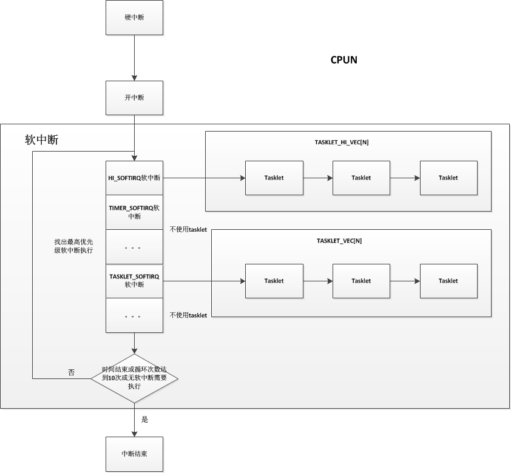

在上一篇文章中, 我们看到中断实际分为了两个部分, 俗称就是一部分是硬中断, 一部分是软中断. 软中断是专门用于处理中断过程中费时费力的操作, 而为什么系统要分硬中断和软中断呢? 问得明白点就是为什么需要软中断. 我们可以试着想想, 如果只有硬中断的情况下, 我们需要在中断处理过程中执行一些耗时的操作, 比如浮点数运算, 复杂算法的运算时, 其他的外部中断就不能得到及时的响应, 因为在硬中断过程中中断是关闭着的, 甚至一些很紧急的中断会得不到响应, 系统稳定性和及时性都受到很大影响. 所以 linux 为了解决上述这种情况, 将中断处理分为了两个部分, 硬中断和软中断. 首先一个外部中断得到响应时, 会先关中断, 并进入到硬中断完成较为紧急的操作, 然后开中断, 并在软中断执行那些非紧急, 可延时执行的操作; 在这种情况下, 紧急操作可以立即执行, 而其他的外部中断也可以获得一个较为快速的响应. 这也是软中断存在的必要性. 在软中断过程中是不可以被抢占也不能被阻塞的, 也不能在一个给定的 CPU 上交错执行.

# 软中断

软中断是在中断框架中专门用于处理非紧急操作的, 在 SMP 系统中, 软中断可以并发地运行在多个 CPU 上, 但在一些路径在需要使用自旋锁进行保护. 在系统中, 很多东西都分优先级, 软中断也不例外, 有些软中断要求更快速的响应运行, 在内核中软中断一共分为 10 个, 同时也代表着 10 种不同的优先级, 系统用一个枚举变量表示:

```cpp
enum
{
    HI_SOFTIRQ=0,                     /* 高优先级 tasklet */                              /* 优先级最高 */
    TIMER_SOFTIRQ,                    /* 时钟相关的软中断 */
    NET_TX_SOFTIRQ,                   /* 将数据包传送到网卡 */
    NET_RX_SOFTIRQ,                   /* 从网卡接收数据包 */
    BLOCK_SOFTIRQ,                    /* 块设备的软中断 */
    BLOCK_IOPOLL_SOFTIRQ,             /* 支持 IO 轮询的块设备软中断 */
    TASKLET_SOFTIRQ,                  /* 常规 tasklet */
    SCHED_SOFTIRQ,                    /* 调度程序软中断 */
    HRTIMER_SOFTIRQ,                  /* 高精度计时器软中断 */
    RCU_SOFTIRQ,                      /* RCU 锁软中断, 该软中断总是最后一个软中断 */ 　　　　  /* 优先级最低 */

    NR_SOFTIRQS                       /* 软中断数, 为 10 */
};
```

注释中的 tasklet 我们之后会说明, 这里先无视它. 每一个优先级的软中断都使用一个 struct softirq_action 结构来表示, 在这个结构中, 只有一个成员变量, 就是 action 函数指针, 因为不同的软中断它的处理方式可能不同, 从优先级表中就可以看出来, 有块设备的, 也有网卡处理的. 系统将这 10 个软中断用 `softirq_vec[10]` 的数组进行保存.

```cpp
/* 用于描述一个软中断 */
struct softirq_action
{
    /* 此软中断的处理函数 */        
    void    (*action)(struct softirq_action *);
};

/* 10 个软中断描述符都保存在此数组 */
static struct softirq_action softirq_vec[NR_SOFTIRQS] __cacheline_aligned_in_smp;
```

系统一般使用 open_softirq() 函数进行软中断描述符的初始化, 主要就是将 action 函数指针指向该软中断应该执行的函数. 在 start_kernel() 进行系统初始化中, 就调用了 softirq_init() 函数对 HI_SOFTIRQ 和 TASKLET_SOFTIRQ 两个软中断进行了初始化

```cpp
void __init softirq_init(void)
{
    int cpu;

    for_each_possible_cpu(cpu) {
        per_cpu(tasklet_vec, cpu).tail =
            &per_cpu(tasklet_vec, cpu).head;
        per_cpu(tasklet_hi_vec, cpu).tail =
            &per_cpu(tasklet_hi_vec, cpu).head;
    }

    /* 开启常规 tasklet */
    open_softirq(TASKLET_SOFTIRQ, tasklet_action);
    /* 开启高优先级 tasklet */
    open_softirq(HI_SOFTIRQ, tasklet_hi_action);
}


/* 开启软中断 */
void open_softirq(int nr, void (*action)(struct softirq_action *))
{
    softirq_vec[nr].action = action;
}
```

可以看到, TASKLET_SOFTIRQ 的 action 操作使用了 tasklet_action() 函数, HI_SOFTIRQ 的 action 操作使用了 tasklet_hi_action() 函数, 这两个函数我们需要结合 tasklet 进行说明. 我们也可以看看其他的软中断使用了什么函数:

```cpp
open_softirq(TIMER_SOFTIRQ, run_timer_softirq);
    open_softirq(NET_TX_SOFTIRQ, net_tx_action);
    open_softirq(NET_RX_SOFTIRQ, net_rx_action);
    open_softirq(BLOCK_SOFTIRQ, blk_done_softirq);
    open_softirq(BLOCK_IOPOLL_SOFTIRQ, blk_iopoll_softirq);
    open_softirq(SCHED_SOFTIRQ, run_rebalance_domains);
    open_softirq(HRTIMER_SOFTIRQ, run_hrtimer_softirq);
    open_softirq(RCU_SOFTIRQ, rcu_process_callbacks);
```

其实很明显可以看出, 除了 TASKLET_SOFTIRQ 和 HI_SOFTIRQ, 其他的软中断更多地是用于特定的设备和环境, 对于我们普通的 IO 驱动和设备而已, 使用的软中断几乎都是 TASKLET_SOFTIRQ 和 HI_SOFTIRQ, 而系统为了对这些不同 IO 设备进行统一的处理, 就在 TASKLET_SOFTIRQ 和 HI_SOFTIRQ 的 action 函数中使用到了 tasklet.

对于每个 CPU, 都有一个 irq_cpustat_t 的数据结构, 里面有一个__softirq_pending 变量, 这个变量很重要, 用于表示该 CPU 的哪个软中断处于挂起状态, 在软中断处理时可以根据此值跳过不需要处理的软中断, 直接处理需要处理的软中断. 内核使用 local_softirq_pending() 获取此 CPU 的__softirq_pending 的值.

当使用 open_softirq 设置好某个软中断的 action 指针后, 该软中断就会开始可以使用了, 其实更明了地说, 从中断初始化完成开始, 即使所有的软中断都没有使用 open_softirq() 进行初始化, 软中断都已经开始使用了, 只是所有软中断的 action 都为空, 系统每次执行到软中断都没有软中断需要执行罢了.

在每个 CPU 上一次软中断处理的一个典型流程是:

1. 硬中断执行完毕, 开中断.
2. 检查该 CPU 是否处于嵌套中断的情况, 如果处于嵌套中, 则不执行软中断, 也就是在最外层中断才执行软中断.
3. 执行软中断, 设置一个软中断执行最多使用时间和循环次数 (10 次).
4. 进入循环, 获取 CPU 的__softirq_pending 的副本.
5. 执行此__softirq_pending 副本中所有需要执行的软中断.
6. 如果软中断执行完毕, 退出中断上下文.
7. 如果还有软中断需要执行 (在软中断期间又发发生了中断, 产生了新的软中断, 新的软中断记录在 CPU 的__softirq_pending 上, 而我们的__softirq_pending 只是个副本).
8. 检查此次软中断总共使用的时间和循环次数, 条件允许继续执行软中断, 循环次数减一, 并跳转到第 4 步.

我们具体看一下代码, 首先在 irq_exit() 中会检查是否需要进行软中断处理:

```cpp
void irq_exit(void)
{
#ifndef __ARCH_IRQ_EXIT_IRQS_DISABLED
    local_irq_disable();
#else
    WARN_ON_ONCE(!irqs_disabled());
#endif

    account_irq_exit_time(current);
    /* 减少 preempt_count 的硬中断计数器 */
    preempt_count_sub(HARDIRQ_OFFSET);
    
    /* in_interrupt() 会检查 preempt_count 上的软中断计数器和硬中断计数器来判断是否处于中断嵌套中 */
    /* local_softirq_pending() 则会检查该 CPU 的__softirq_pending 变量, 是否有软中断挂起 */
    if (!in_interrupt() && local_softirq_pending())
        invoke_softirq();

    tick_irq_exit();
    rcu_irq_exit();
    trace_hardirq_exit(); /* must be last! */
}
```

我们再进入到 invoke_softirq():

```cpp
static inline void invoke_softirq(void)
{

    if (!force_irqthreads) {
#ifdef CONFIG_HAVE_IRQ_EXIT_ON_IRQ_STACK
        /*
         * We can safely execute softirq on the current stack if
         * it is the irq stack, because it should be near empty
         * at this stage.
         */
        /* 软中断处理函数 */
        __do_softirq();
#else
        /*
         * Otherwise, irq_exit() is called on the task stack that can
         * be potentially deep already. So call softirq in its own stack
         * to prevent from any overrun.
         */
        do_softirq_own_stack();
#endif
    } else {
        /* 如果强制使用软中断线程进行软中断处理, 会通知调度器唤醒软中断线程 ksoftirqd */
        wakeup_softirqd();
    }
}
```

重头戏就在__do_softirq() 中.

```cpp
asmlinkage __visible void __do_softirq(void)
{
    /* 为了防止软中断执行时间太长, 设置了一个软中断结束时间 */
    unsigned long end = jiffies + MAX_SOFTIRQ_TIME;
    /* 保存当前进程的标志 */
    unsigned long old_flags = current->flags;
    /* 软中断循环执行次数: 10 次 */
    int max_restart = MAX_SOFTIRQ_RESTART;
    /* 软中断的 action 指针 */
    struct softirq_action *h;
    bool in_hardirq;
    __u32 pending;
    int softirq_bit;

    /*
     * Mask out PF_MEMALLOC s current task context is borrowed for the
     * softirq. A softirq handled such as network RX might set PF_MEMALLOC
     * again if the socket is related to swap
     */
    current->flags &= ~PF_MEMALLOC;

    /* 获取此 CPU 的__softirq_pengding 变量值 */
    pending = local_softirq_pending();
    /* 用于统计进程被软中断使用时间 */
    account_irq_enter_time(current);

    /* 增加 preempt_count 软中断计数器, 也表明禁止了调度 */
    __local_bh_disable_ip(_RET_IP_, SOFTIRQ_OFFSET);
    in_hardirq = lockdep_softirq_start();

/* 循环 10 次的入口, 每次循环都会把所有挂起需要执行的软中断执行一遍 */
restart:
    /* 该 CPU 的__softirq_pending 清零, 当前的__softirq_pending 保存在 pending 变量中 */
    /* 这样做就保证了新的软中断会在下次循环中执行 */
    set_softirq_pending(0);

    /* 开中断 */
    local_irq_enable();

    /* h 指向软中断数组头 */
    h = softirq_vec;

    /* 每次获取最高优先级的已挂起软中断 */
    while ((softirq_bit = ffs(pending))) {
        unsigned int vec_nr;
        int prev_count;
        /* 获取此软中断描述符地址 */
        h += softirq_bit - 1;

        /* 减去软中断描述符数组首地址, 获得软中断号 */
        vec_nr = h - softirq_vec;
        /* 获取 preempt_count 的值 */
        prev_count = preempt_count();

        /* 增加统计中该软中断发生次数 */
        kstat_incr_softirqs_this_cpu(vec_nr);

        trace_softirq_entry(vec_nr);
        /* 执行该软中断的 action 操作 */
        h->action(h);
        trace_softirq_exit(vec_nr);

        /* 之前保存的 preempt_count 并不等于当前的 preempt_count 的情况处理, 也是简单的把之前的复制到当前的 preempt_count 上, 这样做是防止最后软中断计数不为 0 导致系统不能够执行调度 */
        if (unlikely(prev_count != preempt_count())) {
            pr_err("huh, entered softirq %u %s %p with preempt_count %08x, exited with %08x?\n",
                   vec_nr, softirq_to_name[vec_nr], h->action,
                   prev_count, preempt_count());
            preempt_count_set(prev_count);
        }
        /* h 指向下一个软中断, 但下个软中断并不一定需要执行, 这里只是配合 softirq_bit 做到一个处理 */
        h++;
        pending >>= softirq_bit;
    }

    rcu_bh_qs();
    /* 关中断 */
    local_irq_disable();

    /* 循环结束后再次获取 CPU 的__softirq_pending 变量, 为了检查是否还有软中断未执行 */
    pending = local_softirq_pending();
    /* 还有软中断需要执行 */
    if (pending) {
        /* 在还有软中断需要执行的情况下, 如果时间片没有执行完, 并且循环次数也没到 10 次, 继续执行软中断 */
        if (time_before(jiffies, end) && !need_resched() &&
            --max_restart)
            goto restart;
        /* 这里是有软中断挂起, 但是软中断时间和循环次数已经用完, 通知调度器唤醒软中断线程去执行挂起的软中断, 软中断线程是 ksoftirqd, 这里只起到一个通知作用, 因为在中断上下文中是禁止调度的 */
        wakeup_softirqd();
    }

    lockdep_softirq_end(in_hardirq);
    /* 用于统计进程被软中断使用时间 */
    account_irq_exit_time(current);
    /* 减少 preempt_count 中的软中断计数器 */
    __local_bh_enable(SOFTIRQ_OFFSET);
    WARN_ON_ONCE(in_interrupt());
    /* 还原进程标志 */
    tsk_restore_flags(current, old_flags, PF_MEMALLOC);
}
```

流程就和上面所说的一致, 如果还有不懂, 可以去内核代码目录 / kernel/softirq.c 查看源码.

# tasklet

软中断有多种, 部分种类有自己特殊的处理, 如从 NET_TX_SOFTIRQ 和 NET_RT_SOFTIRQ,BLOCK_SOFTIRQ 等, 而如 HI_SOFTIRQ 和 TASKLET_SOFTIRQ 则是专门使用 tasklet. 它是在 I/O 驱动程序中实现可延迟函数的首选方法, 如上一句所说, 它建立在 HI_SOFTIRQ 和 TASKLET_SOFTIRQ 这两种软中断之上, 多个 tasklet 可以与同一个软中断相关联, 系统会使用一个链表组织他们, 而每个 tasklet 执行自己的函数处理. 而 HI_SOFTIRQ 和 TASKLET_SOFTIRQ 这两个软中断并没有什么区别, 他们只是优先级上的不同而已, 系统会先执行 HI_SOFTIRQ 的 tasklet, 再执行 TASKLET_SOFTIRQ 的 tasklet. 同一个 tasklet 不能同时在几个 CPU 上执行, 一个 tasklet 在一个时间上只能在一个 CPU 的软中断链上, 不能同时在多个 CPU 的软中断链上, 并且当这个 tasklet 正在执行时, 其他 CPU 不能够执行这个 tasklet. 也就是说, tasklet 不必要编写成可重入的函数.

系统会为每个 CPU 维护两个链表, 用于保存 HI_SOFTIRQ 的 tasklet 和 TASKLET_SOFTIRQ 的 tasklet, 这两个链表是 tasklet_vec 和 tasklet_hi_vec, 它们都是双向链表, 如下:

```cpp
struct tasklet_head {
    struct tasklet_struct *head;
    struct tasklet_struct **tail;
};

static DEFINE_PER_CPU(struct tasklet_head, tasklet_vec);
static DEFINE_PER_CPU(struct tasklet_head, tasklet_hi_vec);
```

在 softirq_init() 函数中, 会将每个 CPU 的 tasklet_vec 链表和 tasklet_hi_vec 链表进行初始化, 将他们的头尾相连, 实现为一个空链表. 由于 tasklet_vec 和 tasklet_hi_vec 处理方式几乎一样, 只是软中断的优先级别不同, 我们只需要理解系统如何对 tasklet_vec 进行处理即可. 需要注意的是, tasklet_vec 链表都是以顺序方式执行, 并不会出现后一个先执行, 再到前一个先执行 (在软中断期间被中断的情况), 之后的代码我们详细说明.

介绍完 tasklet_vec 和 tasklet_hi_vec 链表, 我们来看看 tasklet,tasklet 简单来说, 就是一个处理函数的封装, 类似于硬中断中的 irqaction 结构. 一般来说, 在一个驱动中如果需要使用 tasklet 进行软中断的处理, 只需要一个中断对应初始化一个 tasklet, 它可以在每次中断产生时重复使用. 系统使用 tasklet_struct 结构进行描述一个 tasklet, 而且对于同一个 tasklet_struct 你可以选择放在 tasklet_hi_vec 链表或者 tasklet_vec 链表上. 我们来看看:

```cpp
struct tasklet_struct
{
    struct tasklet_struct *next;      /* 指向链表下一个 tasklet */
    unsigned long state;              /* tasklet 状态 */
    atomic_t count;                   /* 禁止计数器, 调用 tasklet_disable() 会增加此数, tasklet_enable() 减少此数 */
    void (*func)(unsigned long);      /* 处理函数 */
    unsigned long data;               /* 处理函数使用的数据 */
};
```

tasklet 状态主要分为以下两种:

* TASKLET_STATE_SCHED: 这种状态表示此 tasklet 处于某个 tasklet 链表之上 (可能是 tasklet_vec 也可能是 tasklet_hi_vec).
* TASKLET_STATE_RUN: 表示此 tasklet 正在运行中.

这两个状态主要就是用于防止 tasklet 同时在几个 CPU 上运行和在同一个 CPU 上交错执行.

而 func 指针就是指向相应的处理函数. 在编写驱动时, 我们可以使用 tasklet_init() 函数或者 DECLARE_TASKLET 宏进行一个 task_struct 结构的初始化, 之后可以使用 tasklet_schedule() 或者 tasklet_hi_schedule() 将其放到相应链表上等待 CPU 运行. 我们使用一张图描述一下软中断和 tasklet 结合运行的情况:



我们知道, 每个软中断都有自己的 action 函数, 在 HI_SOFTIRQ 和 TASKLET_SOFTIRQ 的 action 函数中, 就用到了它们对应的 TASKLET_HI_VEC 链表和 TASKLET_VEC 链表, 并依次顺序执行链表中的每个 tasklet 结点.

在 SMP 系统中, 我们会遇到一个问题: 两个 CPU 都需要执行同一个 tasklet 的情况, 虽然一个 tasklet 只能放在一个 CPU 的 tasklet_vec 链表或者 tasklet_hi_vec 链表上, 但是这种情况是有可能发生的, 我们设想一下, 中断在 CPU1 上得到了响应, 并且它的 tasklet 放到了 CPU1 的 tasklet_vec 上进行执行, 而当中断的 tasklet 上正在执行时, 此中断再次发生, 并在 CPU2 上进行了响应, 此时 CPU2 将此中断的 tasklet 放到 CPU2 的 tasklet_vec 上, 并执行到此中断的 tasklet.

实际上, 为了处理这种情况, 在 HI_SOFTIRQ 和 TASKLET_SOFTIRQ 的 action 函数中, 会先将对应的 tasklet 链表取出来, 并把对应的 tasklet 链表的 head 和 tail 清空, 如果在执行过程中, 某个 tasklet 的 state 为 TASKLET_STATE_RUN 状态, 说明其他 CPU 正在处理这个 tasklet, 这时候当前 CPU 则会把此 tasklet 加入到当前 CPU 已清空的 tasklet 链表的末尾, 然后设置__softirq_pending 变量, 这样, 在下次循环软中断的过程中, 会再次检查这个 tasklet. 也就是如果其他 CPU 的这个 tasklet 一直不退出, 当前 CPU 就会不停的置位 tasklet 的 pending, 然后不停地循环检查.

我们可以看看 TASKLET_SOFTIRQ 的 action 处理:

```cpp
static void tasklet_action(struct softirq_action *a)
{
    struct tasklet_struct *list;

    local_irq_disable();
    /* 将 tasklet 链表从该 CPU 中拿出来 */
    list = __this_cpu_read(tasklet_vec.head);
    /* 将该 CPU 的此软中断的 tasklet 链表清空 */
    __this_cpu_write(tasklet_vec.head, NULL);
    __this_cpu_write(tasklet_vec.tail, this_cpu_ptr(&tasklet_vec.head));
    local_irq_enable();

    /* 链表已经处于 list 中, 并且该 CPU 的 tasklet_vec 链表为空 */
    while (list) {
        struct tasklet_struct *t = list;

        list = list->next;

        /* 检查并设置该 tasklet 为 TASKLET_STATE_RUN 状态 */
        if (tasklet_trylock(t)) {
            /* 检查是否被禁止 */
            if (!atomic_read(&t->count)) {
                /* 清除其 TASKLET_STATE_SCHED 状态 */
                if (!test_and_clear_bit(TASKLET_STATE_SCHED,
                            &t->state))
                    BUG();
                /* 执行该 tasklet 的 func 处理函数 */
                t->func(t->data);
                /* 清除该 tasklet 的 TASKLET_STATE_RUN 状态 */
                tasklet_unlock(t);
                continue;
            }
            tasklet_unlock(t);
        }

        /* 以下为 tasklet 为 TASKLET_STATE_RUN 状态下的处理 */
        /* 禁止中断 */
        local_irq_disable();
        /* 将此 tasklet 添加的该 CPU 的 tasklet_vec 链表尾部 */
        t->next = NULL;
        *__this_cpu_read(tasklet_vec.tail) = t;
        __this_cpu_write(tasklet_vec.tail, &(t->next));
        /* 设置该 CPU 的此软中断处于挂起状态, 设置 irq_cpustat_t 的__sofirq_pending 变量, 这样在软中断的下次执行中会再次执行此 tasklet */
        __raise_softirq_irqoff(TASKLET_SOFTIRQ);
        /* 开启中断 */
        local_irq_enable();
    }
}
```

# 软中断处理线程

当有过多软中断需要处理时, 为了保证进程能够得到一个满意的响应时间, 设计时给定软中断一个时间片和循环次数, 当时间片和循环次数到达但软中断又没有处理完时, 就会把剩下的软中断交给软中断处理线程进行处理, 这个线程是一个内核线程, 其作为一个普通进程, 优先级是 120. 其核心处理函数是 run_ksoftirqd(), 其实此线程的处理也很简单, 就是调用了上面的__do_softirq() 函数, 我们可以具体看看:

```cpp
/* 在 smpboot_thread_fun 的一个死循环中被调用 */
static void run_ksoftirqd(unsigned int cpu)
{
    /* 禁止中断, 在__do_softirq() 中会开启 */
    local_irq_disable();
    /* 检查该 CPU 的__softirq_pending 是否有软中断被挂起 */
    if (local_softirq_pending()) {
        /*
         * We can safely run softirq on inline stack, as we are not deep
         * in the task stack here.
         */
        /* 执行软中断 */
        __do_softirq();
        rcu_note_context_switch(cpu);
        /* 开中断 */
        local_irq_enable();
        /* 检查是否需要调度 */
        cond_resched();
        return;
    }
    /* 开中断 */
    local_irq_enable();
}
```