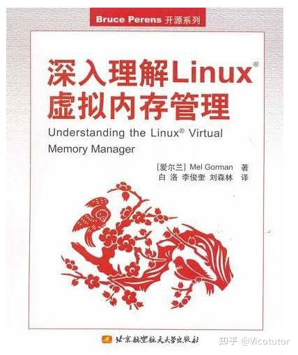
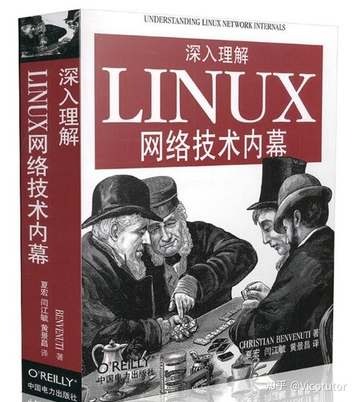
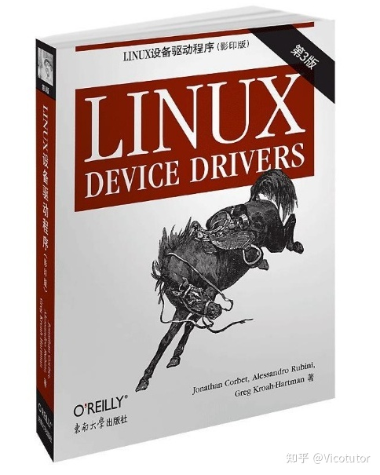

<!-- @import "[TOC]" {cmd="toc" depthFrom=1 depthTo=6 orderedList=false} -->

<!-- code_chunk_output -->

- [1. 在线资料](#1-在线资料)
- [2. 内核书籍](#2-内核书籍)
  - [2.1. 开发环境](#21-开发环境)
  - [2.2. 操作实践](#22-操作实践)
  - [2.3. 实践开发](#23-实践开发)
  - [2.4. Linux 内核源码](#24-linux-内核源码)
  - [2.5. 其他书籍参考](#25-其他书籍参考)
- [3. 内核调试](#3-内核调试)
- [4. 子系统学习](#4-子系统学习)
  - [4.1. 书籍](#41-书籍)
  - [4.2. 内核文档](#42-内核文档)
  - [4.3. 代码阅读](#43-代码阅读)
- [5. feature 学习](#5-feature-学习)
  - [5.1. 初始实现](#51-初始实现)
    - [5.1.1. 最初合入的 patch/patchset](#511-最初合入的-patchpatchset)
    - [5.1.2. 了解初始背景](#512-了解初始背景)
      - [5.1.2.1. pwclient 工具](#5121-pwclient-工具)
      - [5.1.2.2. 利用 mail list archive](#5122-利用-mail-list-archive)
    - [5.1.3. 研究初始的代码实现](#513-研究初始的代码实现)
  - [5.2. 最新版代码](#52-最新版代码)
  - [5.3. 中间版本](#53-中间版本)
- [6. 特性回合](#6-特性回合)
- [performance](#performance)

<!-- /code_chunk_output -->

# 1. 在线资料

http://lxr.free-electrons.com/

>
>LXR (Linux Cross Reference)是比较流行的 linux 源代码查看工具, 而这里集成了全版本的 linux 源码的索引

# 2. 内核书籍

## 2.1. 开发环境

安装一个开发环境用于调试源码, 推荐用 docker 建立一个本地镜像, 你在本地的所有操作都会同步到容器中, 这样你可以一边在本地用 ide 操作源码, 一边在 docker 环境中进行编译、执行.

你肯定会需要 debug, 因此可以了解一下 gdb, 至少基本操作要会.

一切准备就绪, 就可以开始鼓捣 Linux 了, 你可以像 xv6 的文档中的引导顺序一样去弄明白 Linux 是怎么玩的, 也可以找到 Linux 的文档或书籍.

推荐为 Linux 的内核增加一些自己的东西, 比如最简单的, 添加一个 system call, 然后成功调用它、改一改它的 timer interruption 等等

看下 Linux 内核是怎么实现的, 最好的方式是看书, 书的脉络理得很清晰.

## 2.2. 操作实践

先会用, 再研究

操作系统的命令使用, 都有什么功能等等

《鸟哥的 Linux 私房菜》

## 2.3. 实践开发

系统开发的经验吧, 推荐看《UNIX 环境高级编程》

## 2.4. Linux 内核源码

1. 《Linux 内核设计与实现》

简称 LKD, 比较薄, 从入门开始, 介绍了 进程管理、系统调用、中断和中断处理、内核同步、时间管理、内存管理、地址空间、调试技术等, 内容比较浅显易懂, 新人入门必看书籍.

提纲挈领

2. 《深入理解 Linux 内核》

简称 ULK, 深入且全面很多.

全面深入

3. 《Linux 内核源代码情景分析》

根据某一个实际的场景, 比如我们应用的一个读文件 api 从上层到内核最底层直到磁盘驱动是怎么实现的, 一步步的给你分析清楚, 这个就非常有针对性, 学起来也很有意思

4. 《Professional Linux Kernel Architecture》, 《深入 Linux 内核架构》

详细的源码以及设计理念

其中 1 必看, 2/3/4 选择一个即可

## 2.5. 其他书籍参考

1. 《Linux 内核深度解析》

2019-05, 基于 Linux 内核 4.12 版本, ARM64 处理器架构


# 3. 内核调试


# 4. 子系统学习

## 4.1. 书籍

内存管理子系统: 《深入理解 Linux 虚拟内存管理》



网络: 《深入理解 Linux 网络内幕》



驱动开发: 《Linux 设备驱动程序》



## 4.2. 内核文档

学习内核文档, `Documentation/`下, 一般包含背景介绍、实现原理和实践案例. 所以一定要先看下相应的 Doc.

## 4.3. 代码阅读

注: git 可以用 tig

1. 手册为核心

以手册为核心阅读代码, 最起码两遍

看手册的描述, 然后找代码的对应实现, 可以对比多个实现, 比如 vmx 相关实现, 可以对比看 kvm、xen 和 ACRN(https://github.com/projectacrn/acrn-hypervisor)

手册中涉及的指令, 一般在系统指令部分会专门描述该指令行为的伪代码.

2. 代码为核心

git log 某个文件, 按时间线从头看 git commit

```
git log arch/x86/kvm/lapic.c

tig arch/x86/kvm/lapic.c
```

代码为主, google 搜索 patch 的讨论

# 5. feature 学习

每个 feature 整理一个 PPT, 分享讲出来.

feature 从最开始的实现代码(一般从定义的新的变量查看相应 commit)看起来, 能了解整个思想

核心思想: 以不变找万变

## 5.1. 初始实现

### 5.1.1. 最初合入的 patch/patchset

* 第一步: 获取特性相关的最初合入的 patch/patchset.

一般从变量/模块参数入手(变量不会改, 往往能查到最初的 patch)

通过`tig blame $file_name`查看结构体成员或者模块参数的 commit, 就能确定**最初的 patch set**的某一个**commit**.

### 5.1.2. 了解初始背景

* 第二步: 确定最初 author 提交给社区的**真正第一版 patchset/RFC**, 甚至第一次有人提出的疑问(从而引发的 patchset).

因为这里面往往体现了 author 提出这个 patch set 的**最初的原因**且实现比较简单; 而且有些人只有在最初的 patchset 才有写使用方法

有两种手段

#### 5.1.2.1. pwclient 工具

> pwclient 工具, 这个往往不靠谱

使用 pwclient 工具, 确定最初合入的 patch set, 具体参照`Study repo: Linux/Community/3. 从邮件列表获取 patch.md`

还有一个工具: b4

#### 5.1.2.2. 利用 mail list archive

> 通过 mail list archive 查找

通过第一步找到的 commit 的 subject, 在 mail list archive 中找到最初的 patchset/RFC 并了解当时的讨论

mail list archive, 官方的是
* https://patchwork.kernel.org/, 功能完善
* https://lore.kernel.org/lists.html,

> 具体参见`Study repo: Linux/Community/1. 邮件列表.md`, 那里面有个示例参考

### 5.1.3. 研究初始的代码实现

直接 reset 回当时版本, 查看系统中的调用情况等等, 从而进行代码分析

## 5.2. 最新版代码

然后看一下最新的代码的实现, 如果核心思想没有变, 这样子就结束了. 如果有方案有更新, 那同样参照上面的方法追踪下新的方案的初始版本, 再看最新代码的实现.

## 5.3. 中间版本

`tig mm/memcontrol.c`, tig 查看某个文件, 从最开始的 commit 记录开始看, 因为一般文件名不会变化.

注: 但是内核代码往往涉及的 commit 太多, 所以可能会比较多

# 6. 特性回合

先对比下 upstream 的 feature 流程和产品的 feature 流程, 心里大概清楚差异点.

方法一(推荐):

盯着某个 feature 的核心实现文件

`tig arch/x86/kvm/lapic.c`

从最开始的 commit 逐个 backport

然后提交时候, 回合一个 patch 便提交一个, 不要嫌麻烦最后整个作为一个 patch.

方法二:

以最初的那个 feature 的 patch set 为核心逐个 backport, 先把 patch set 中每个 patch 给 backport 了, 然后再逐行核对目前 upstream 的代码, 决定是否要 backport 修改(一般 bug 肯定要 backport).

如果有 feature 依赖, 先 backport 被依赖的 feature.

# performance

Linux 性能优化实战: 来源: 极客时间, 倪鹏飞, https://time.geekbang.org/column/intro/140


不用看各处的资料, 专注官方资料即可

1. 内核文档, `Document/*`, 这肯定是最新的
2. 官方 wiki: https://wiki.kernel.org/
3. feature 的相关 commit, 很多 commit 会介绍很多, 包括背景、原理以及使用方式等等


* LKML 的主要列表: http://vger.kernel.org/vger-lists.htm
* 下载内核的源代码和补丁、跟踪内核 bug 等: http://www.kernel.org/ 可以通过这个网站上.
* Linux 新闻站点: http://lwn.net/ Linux weekly news, 创建于 1997 年底的一个.


- 重要！！！很多内核的用户态实现等: https://github.com/BiscuitOS/HardStack
* Linux 博客: http://ilinuxkernel.com/?cat=3
* Kernel 网站: https://kernelnewbies.org/
* 如何加入 Linux 内核开发社区: https://tonybai.com/2012/03/27/how-to-participate-linux-community-section-1/

https://www.jeanleo.com/

* 博客站: http://www.kerneltravel.net/

- 代码阅读

Linux 源码查看工具: https://elixir.bootlin.com/linux/v4.17-rc2/source

- 博客:

http://ilinuxkernel.com/?cat=3

http://blog.csdn.net/q1007729991

http://0xffffff.org/

http://blog.csdn.net/ztguang

http://blog.chinaunix.net/uid/14735472/list/1.html

Linux 专栏: [http://zhuanlan.zhihu.com/LearningLinux](http://zhuanlan.zhihu.com/LearningLinux)

http://blog.csdn.net/unclerunning/article/category/6189110

https://segmentfault.com/u/wuyangchun/articles?page=2&sort=vote

https://blog.csdn.net/chenyu105

http://www.360doc.com/userhome/12892305

https://blog.csdn.net/wjlkoorey

http://blog.chinaunix.net/uid/23769728/list/1.html

https://blog.csdn.net/ljy1988123/article/category/1490573

Linux 工程导论: https://blog.csdn.net/column/details/linux-kernel-no-code.html

https://blog.csdn.net/younger_china/article/category/960611

重要: http://www.360doc.com/userhome/12892305#

各种管理: https://blog.csdn.net/bullbat

https://blog.csdn.net/younger_china/article/category/960611

http://kernel.meizu.com/slab-allocator-and-kmalloc.html

全:https://blog.csdn.net/dc_726/article/category/939232

http://abcdxyzk.github.io/blog/cats/kernel/

各种子系统: https://blog.csdn.net/droidphone/article/category/788233

https://www.cnblogs.com/tolimit/category/697314.html

https://blog.csdn.net/yayong/article/category/6083072

- 书籍资料:

赵炯书籍网站: http://www.oldlinux.org/

Linux story: https://linuxstory.org/

陈振文网站: http://zhwen.org/?cat=3

- 网站:

https://www.zhihu.com/question/38836382?sort=created

Unix/Linux/BSD 命令和任务: http://cb.vu/unixtoolbox_zh_CN.xhtml

Arch Linux: https://www.archlinux.org/

Linux 多种资源网站(important): https://kernelnewbies.org/

Linux 论坛: https://lkml.org/

蜗窝: http://www.wowotech.net/

http://blog.csdn.net/u012398362

各模块详细讲解: http://blog.csdn.net/gatieme/article/details/52384965

Linux inside: https://github.com/0xAX/linux-insides

Linux inside 中文: https://xinqiu.gitbooks.io/linux-insides-cn/content/index.html

Linux 等等信息包括调试工具等: https://biscuitos.github.io/blog/BiscuitOS_Catalogue/

Linux 内核之旅: http://www.kerneltravel.net/

Linux 内核初学者仓库: git@github.com:ljrkernel/LearningLinuxKernel.git

Linux 全功能学习: https://github.com/cirosantilli/linux-kernel-module-cheat

kthread_worker 和 kthread_work: https://blog.csdn.net/qqliyunpeng/article/details/53931350


Linux 学习笔记: https://github.com/Second222None/learn-linux

BiscuitOS Blog 2.0 从点都面再到线将知识做到全面整合, 完整的实践文档以及深入的专题研究专, 彻底的开源免费, 让知识自由共享. 全新实践专题 "E820 内存管理器", 从 QEMU/KVM 虚拟化出发, 完整分析 BIOS 中的细节, 最终到达 Kernel/Userspace, 让 E820 内存分配器的每行代码有理可依, 让涉及的每个知识点都串通实践化, 无论是知识研究还是工程部署, 值得每位开发者入手, 需要的请戳: https://biscuitos.github.io/blog/MMU-E820/

这周分享专题是 X86 的 Early_Res 内存分配器, 该分配器用于 boot-time 阶段为内核其他子系统分配、回收和预留物理内存, 其与 bootmem/MEMBLOCK 是互斥存在, 需要的小伙伴请戳 https://biscuitos.github.io/blog/Early_Res/

https://github.com/BiscuitOS/HardStack/tree/BiscuitOS

用 Rust 重写 Linux 内核模块体验: https://zhuanlan.zhihu.com/p/137077998