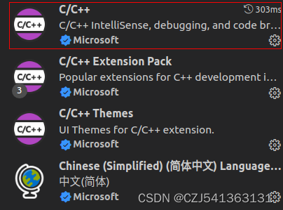

# 现状

使用简单的文本浏览工具 + grep 进行代码搜索浏览, 这种方法最简单, 效率也最低.
使用 source insight 进行代码浏览, 使用这种方法的人应该很多, 但是在浏览内核代码的时候有个缺点就是内核下有多个平台的头文件, 源码, 如果不做排除的话在代码跳转的时候往往能找到很多个同名函数或变量的定义, 还得一个一个去确认, 非常麻烦. 虽然可以手动排除目录但仍然比较麻烦, 之前好像看到网上有大神弄了一个脚本还是插件啥的可以根据内核中编译出的. o 自动排除未编译的文件, 这种相对方便点, 但是头文件可能还是得手动排除. 另外最重要的是 source insight 是收费软件.

使用 vim + ctags, 这种方法就比较高大上了, 比较适合大神使用, 咱 vim 都没玩的很透的人一般用不了.

使用 VSCode 加上 C++ Intellisense 插件或者 global 插件, 类似 source insight, 需要手动排除未编译文件减小索引范围, 代码定位不准.

# 新方法

VSCode + Remote SSH + clangd 插件来阅读 linux 内核代码

clangd 插件用于代码语义分析, 代码补全, 跳转等. 该方案克服了上面列举的几种方案的几乎各种缺点, 能做到代码精准跳转, 精准自动补全, 其他默认一些如代码着色自动缩进之类的 VSCode 自带.

除 VSCode IDE 以外, 该方法的核心是 clangd 插件, clangd 默认通过读取工程编译自动生成的 compile_commands.json 文件来索引其中包含的源文件和关联的头文件, 因此能避免索引非编译的代码造成解析时语义混乱.

该文件就是由每个源文件的编译参数、路径等信息组成的一个json文件，clangd通过这个文件可以准确定位源文件需要引用的头文件从而准确的找到各种宏定义、函数、变量声明的准确值了。

# 安装

安装 vscode

vscode 中安装 clangd 插件

禁用 "C/C++ IntelliSense" 插件



"C/C++ IntelliSense" 插件和 clangd 有冲突, 需要禁用掉.(可以只禁用当前 workspace, 这样不影响阅读其他工程的代码)

也可以通过配置文件禁用

linux远程服务器上的clangd默认是安装到 `~/.vscode-server/` 目录下, 对应的配置文件是 `/home/lihaiwei/.vscode-server/data/Machine/settings.json` 文件

配置如下:

```json
{
    "C_Cpp.default.intelliSenseMode": "linux-gcc-arm64",
    "C_Cpp.intelliSenseEngine": "disabled",
    "clangd.path": "/usr/bin/clangd",
    "clangd.arguments": [
        "--log=verbose",
        "--compile-commands-dir=${workspaceFolder}",
        "--background-index",
        "--completion-style=detailed",
        "--header-insertion=never"
    ],
    "clangd.checkUpdates": true
}
```

# 远程 linux

确认Ubuntu中有clangd

```
apt install bear
```

为 linux 生成 compile_commands.json 文件

编译完内核后, 到内核目录执行下面命令:

```
python3 ./scripts/clang-tools/gen_compile_commands.py -o <kernel 编译的 output 目录, 例如 out/target/product/sm6150/obj/KERNEL_OBJ/>
```

gen_compile_commands.py 在 5.x 版本的内核才加入, 如果是低版本的内核, 可以从高版本的内核中拷贝过来.

也可以使用 bear 工具生成 compile_commands.json 文件.

```
make ARCH=arm64 CROSS_COMPILE=aarch64-linux-gnu- O=build menuconfig

make ARCH=arm64 CROSS_COMPILE=aarch64-linux-gnu- mrproper

bear -- make ARCH=arm64 CROSS_COMPILE=aarch64-linux-gnu- O=build -j128
```

# 效果

结构体成员自动补全

<div align='center'>

</div>

指针悬停自动查看函数、变量原型，宏定义值等

<div align='center'>

</div>

精确查找变量、函数被引用的地方。这里查找的是vin_pipe_ops结构体的close函数指针被引用的地方，可以看到查找的结果是非常准确的，没有查找到其他驱动或内核代码的close指针。

<div align='center'>

</div>

# Q&A

用 vscode 打开根目录带有 compile_commands.json 的 linux 代码, clangd 会自动解析 compile_commands.json, 之后就可以丝滑跳转了.

## 重新生成索引

删除源码目录下 `.cache/clangd`, 重启vs code 即可

## invalid AST

类似:

```
reply:textDocument/inlayHint(24) 0 ms, error: invalid AST
```

在源码目录下添加文件 `.clangd`

```
$ cat .clangd
CompileFlags:
  Remove: [-march=*, -mabi=*, -mcpu=*]
```

删除旧的 index, 让重建索引即可

## ssh 免密

```
chmod 700 ~/.ssh
chmod 600 ~/.ssh/authorized_keys
```