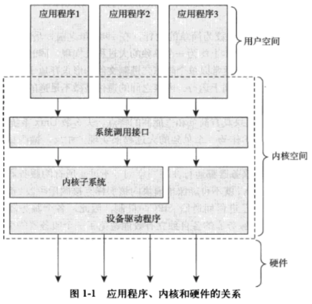

<!-- @import "[TOC]" {cmd="toc" depthFrom=1 depthTo=6 orderedList=false} -->

<!-- code_chunk_output -->

- [1. Unix 历史](#1-unix-历史)
- [2. Linux](#2-linux)
- [3. 操作系统和内核](#3-操作系统和内核)
- [4. Linux 内核和传统 Unix 内核](#4-linux-内核和传统-unix-内核)
  - [4.1. 单内核和微内核](#41-单内核和微内核)
- [5. Linux 内核版本](#5-linux-内核版本)
- [6. Linux 内核开发者社区](#6-linux-内核开发者社区)

<!-- /code_chunk_output -->

# 1. Unix 历史

1969 年, Dennis Ritchie 和 Ken Thompson. 1971 年, C 语言重写. 第一个被广泛使用的是第 6 版, V6.

1977 年, 贝尔实验室推出了 Unix System III; 1983 年, AT&T 推出了 System V.

加州大学伯克利分校推出了变体 Berkeley Software Distribution(BSD).

Unix 强大的原因.

1. Unix 很简洁: 仅仅几百个系统调用并有明确的设计目的;

2. 所有东西都被当做文件. 使得对数据和对设备的操作时一套相同的系统结构进行: `open()`、`read()`、`write()`、`lseek()` 和 `close()`;

3. 内核和系统软件通过 C 语言编写. 很强的移植能力;

4. 进程创建迅速, 并且有一个独特的 fork() 系统调用;

5. 提供了一套简单又稳定的进程间通信元语;

6. 策略与机制分离的设计理念, 确保 Unix 具备清晰的层次化结构.

# 2. Linux

由于 Minix 不能轻易修改和发布源码(许可证问题)等, Linus Torvals 在 1991 年推出了 Linux.

Linux 是类 Unix 系统, 但它不是 Unix.

# 3. 操作系统和内核

通常一个内核由负责响应中断的中断服务程序, 负责管理多个进程从而分享处理器时间的调度程序, 负责管理进程地址空间的内存管理程序和网络、进程间通信等系统服务程序共同组成.

应用程序通过系统调用在内核空间运行, 内核被称为运行于进程上下文中.

内核还要负责管理系统的硬件设备. 几乎所有体系结构都提供了中断机制. 设备发出一个中断信号打断处理器的运行, 继而打断内核的执行. 内核通过中断号找到中断服务程序, 并调用这个程序响应和处理中断. 比如, 敲击键盘, 键盘控制器发送中断信号给系统, 键盘缓冲区有数据到来. 内核注意到这个中断对应的中断号, 调用相应的中断服务程序. 这个程序处理键盘数据然后通知键盘控制器可以继续输入数据. 许多操作系统的中断服务程序, 包括 Linux, 都不在进程上下文执行. 它们在一个与所有进程无关的、专门的中断上下文中运行. 这个专门的环境, 为了保证中断服务程序能第一时间响应和处理中断请求, 然后快速退出.

可以将每个处理器在任何时间点上的活动必然为下面三者之一:

* 运行于用户空间, 执行用户进程;

* 运行于内核空间, 处于进程上下文, 代表某个特定的进程执行;

* 运行于内核空间, 处于中断上下文, 与任何进程无关, 处理某个特定的中断.

# 4. Linux 内核和传统 Unix 内核

Linux 可以运行在没有 MMU 的系统上. 但现在连简单的嵌入式系统都提供内存管理单元(MMU)硬件支持, 所以重点关注支持 MMU 的 Linux.

## 4.1. 单内核和微内核

单内核: 整体作为一个单独的大过程来实现, 同时也运行在一个单独的地址空间上. 所以通常是一个静态二进制文件形式. 内核中通信可以直接调用函数. 多数 Unix 系统都是单内核. 简单并且性能高.

微内核: 内核功能被划分为多个独立的过程, 每个过程叫做一个服务器. 理想情况下, 只有强烈请求特权服务的服务器才运行在特权模式下, 其他服务器运行在用户空间. 所有的服务器都保持独立并运行在各自的地址空间上. 各个服务器采用了进程间通信(IPC)机制来互通消息. 服务器的独立避免一个的失效祸及另一个.

IPC 机制的开销多于函数调用, 而且涉及内核空间和用户空间的上下文切换. 所以, 所有实际应用的基于微内核的系统都让大部分或全部服务器处于内核, 这样就可以直接调用函数, 减少频繁的上下文切换. Windows NT 内核(XP、Vista 和 7 等基于此)和 Mach 是微内核, 但都不让任何微内核服务器运行在用户空间, 这其实违背了微内核设计的初衷.

Linux 是一个单内核, 即运行在单独的内核地址空间中. 不过, Linux 汲取了微内核的精华: 模块化设计、抢占式内核、支持内核线程以及动态状态内核模块.

Linux 内核与传统的 Unix 系统之间的一些差异:

* Linux 支持动态加载内核模块;

* Linux 支持对称多处理器(SMP). 许多 Unix 变种也支持, 但传统 Unix 不支持;

* Linux 内核可以抢占(preemptive). 允许在内核运行的任务优先执行;

* Linux 不区分线程和进程;

* Linux 提供具有设备类的面向对象的设备模型、热插拔事件, 以及用户空间的设备文件系统(sysfs);

* Linux 忽略了一些被认为设计很拙劣的 Unix 特性(STREAMS 等), 忽略了过时标准;

* Linux 自由.

# 5. Linux 内核版本

内核的版本号主要有四个数组组成. 比如版本号: 2.6.26.1  其中,

* 2  - 主版本号

* 6  - 从版本号或副版本号

* 26 - 修订版本号

* 1  - 稳定版本号

副版本号表示这个版本是稳定版(偶数)还是开发版(奇数), 上面例子中的版本号是稳定版.

稳定的版本可用于企业级环境.

修订版本号的升级包括 BUG 修正, 新的驱动以及新的特性的追加.

稳定版本号主要是一些关键性 BUG 的修改.

# 6. Linux 内核开发者社区

Linux kernel mailing list, 简称 lkml. 可以在 http://vger.kernel.org 上订阅邮件.