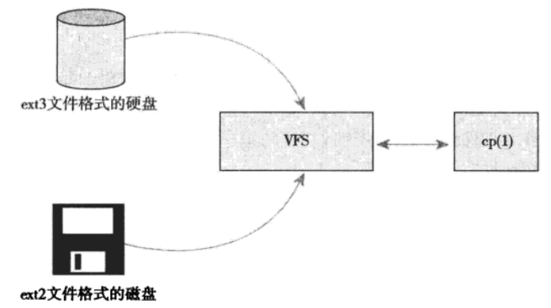
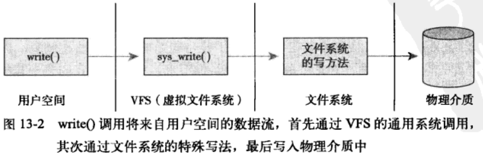
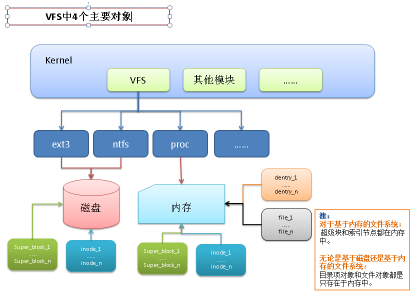
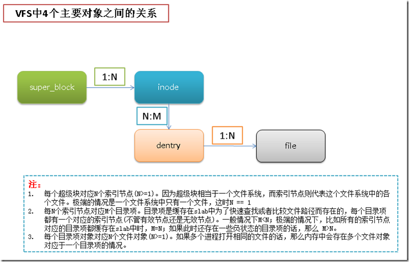

<!-- @import "[TOC]" {cmd="toc" depthFrom=1 depthTo=6 orderedList=false} -->

<!-- code_chunk_output -->

- [1. 定义](#1-定义)
- [2. 内容和作用](#2-内容和作用)
  - [2.1. 通用的文件系统接口](#21-通用的文件系统接口)
  - [2.2. 文件系统抽象层](#22-文件系统抽象层)
  - [2.3. 示例](#23-示例)
- [3. Unix 风格文件系统](#3-unix-风格文件系统)
  - [3.1. 四个抽象概念](#31-四个抽象概念)
  - [3.2. 物理磁盘布局](#32-物理磁盘布局)
- [4. VFS 对象及其数据结构](#4-vfs-对象及其数据结构)
  - [4.1. 四个主要对象类型](#41-四个主要对象类型)
  - [4.2. 操作对象](#42-操作对象)
  - [4.3. 其他对象](#43-其他对象)
- [5. 超级块对象](#5-超级块对象)
  - [5.1. 超级块操作对象](#51-超级块操作对象)
- [6. 索引节点对象](#6-索引节点对象)
  - [6.1. 索引节点操作](#61-索引节点操作)
- [7. 目录项对象](#7-目录项对象)
  - [7.1. 目录项三种状态](#71-目录项三种状态)
  - [7.2. 目录项缓存](#72-目录项缓存)
    - [7.2.1. 举例](#721-举例)
  - [7.3. 索引项缓存](#73-索引项缓存)
  - [7.4. 目录项操作](#74-目录项操作)
- [8. 文件对象](#8-文件对象)
  - [8.1. 文件对象操作](#81-文件对象操作)
- [9. 四个对象之间的关系](#9-四个对象之间的关系)
- [10. 文件系统相关的数据结构](#10-文件系统相关的数据结构)
  - [10.1. 文件系统类型](#101-文件系统类型)
  - [10.2. 安装点](#102-安装点)
- [11. 进程相关的数据结构](#11-进程相关的数据结构)
  - [11.1. 打开的文件对象](#111-打开的文件对象)
  - [11.2. 所在的文件系统信息](#112-所在的文件系统信息)
  - [11.3. 单进程命名空间](#113-单进程命名空间)

<!-- /code_chunk_output -->

# 1. 定义

虚拟文件系统(VFS)为用户空间提供了文件和文件系统相关的接口.

系统中所有文件系统不但依赖 VFS 共存, 而且也依靠 VFS 系统协同工作.

通过 VFS, 程序可以利用标准 Unix 系统调用对不同文件系统, 甚至不同介质上的文件系统进行访问.



> cp 命令从 ext3 文件系统格式的硬盘拷贝数据到 ext2 文件系统格式的可移动磁盘. 两种不同的文件系统, 两种不同的介质, 连接到同一个 VFS.

# 2. 内容和作用

## 2.1. 通用的文件系统接口

> 简化了应用的开发

VFS 和块 I/O 相结合, 用户态可以直接使用 open()、read() 和 write() 这样统一的系统调用, 而无需考虑具体的文件系统和实际物理介质.

## 2.2. 文件系统抽象层

> 简化了新文件系统的实现

为了可以提供这种通用接口, 内核在底层文件系统接口之上建立了一个抽象层.

VFS 抽象层为了衔接底层的多种文件系统, 它提供了一个通用文件系统模型, 该模型定义了任何文件系统都支持的、基本的、概念上的接口和数据结构. 该模型偏重于 Unix 风格的文件系统.

实际文件系统通过编程提供 VFS 期望的抽象接口和数据结构.

这样, 内核可以和任何文件系统协同工作, 并且提供给用户空间的接口, 也可以和任何文件系统无缝连接在一起.

## 2.3. 示例

用户程序执行如下操作:

```cpp
ret = write(fd, buf, len);
```

这个系统调用将 buf 指针指向的长度为 len 字节的数据写入文件描述符 fd 对应的文件的当前位置.

1. 首先被一个通用系统调用 `sys_write()` 处理, sys_write() 要找到 fd 所在的实际文件系统的写操作, 然后执行该操作;

2. 实际文件系统的写方法是文件系统实现的一部分, 数据最终通过该操作写入介质.



# 3. Unix 风格文件系统

## 3.1. 四个抽象概念

Unix 使用了四种文件系统相关的抽象概念: **文件**、**目录项**、**索引节点**(`inode`)和**安装点**(`mount point`).

本质上讲, 文件系统是特殊的**数据分层存储结构**, 它包含**文件**、**目录**和**相关的控制信息**. 文件系统的通用操作包括创建、删除和安装等. 在 Unix 中, 文件系统被安装在一个特定的安装点上, 该安装点在**全局层次结构**中被称为**命名空间**, 所有已安装的文件系统都作为根文件系统树的叶子出现.

> Linux 已经引入了进程级命名空间, 每个进程指定唯一的命名空间. 因为每个进程都会继承父进程的命名空间(除非特别声明), 所以所有进程往往都只有一个全局命名空间.

**文件**就是一个有序字节串, 第一个字节是文件头, 最后一个字节是文件尾. Unix 文件的概念与面向记录的文件系统中文件对比:

* 面向记录的文件系统提供更丰富、更结构化的表示;

* 面向字节流的 Unix 文件则简单.

文件通过目录组织. 目录层层嵌套, 形成文件路径. 路径中每一个部分都被称为目录条目. "`/home/wolfman/butter`" -- **根目录** `/`, **目录** `home`、`wolfman` 和 **文件** `butter` 都是目录条目, 统称**目录项**. Unix 中, 目录属于普通文件.

Unix 将**文件的相关信息**和**文件本身**区分开. **文件相关信息**, 也称**文件元数据**, 被存储在一个**单独的数据结构**中, 即**索引节点**(inode, index node).

> inode 的意义是用来索引, 所以单独存储.

**文件系统的控制信息**存储在**超级块数据结构**中.

**文件系统的控制信息**和**文件信息**统称**文件系统数据元**.

## 3.2. 物理磁盘布局

Unix 文件系统在**物理磁盘**布局**往往**也是按照上面概念来的.

比如在磁盘上,
* **文件**(目录也是文件)**信息**按照**索引节点**(inode)形式存储在**单独的块**中;
* **文件系统控制信息**被集中存储在**磁盘的超级块**中, 等等.

# 4. VFS 对象及其数据结构

VFS 采用面向对象的设计思路, 使用一系列**数据结构**表示. **结构体**包含**数据**的同时也包含这些数据的**函数操作**, 其中操作函数由具体文件系统实现.

## 4.1. 四个主要对象类型

* 超级块对象, 代表一个**具体的已安装文件系统**;

* 索引节点对象, 代表一个**具体文件**;

* 目录项对象, 代表一个**目录项**, 是**路径的一个组成部分**;

* 文件对象, 代表由**进程打开的文件**.

注, VFS 将目录作为文件, 所以不存在目录对象. **目录项**代表路径中的一个组成部分, 它**可能包含一个普通文件**. 总之, 目录项不同于目录, 但是目录却是另一种形式的文件.

## 4.2. 操作对象

**每个主要对象**都包含**一个操作对象**, 描述了内核可以使用的操作函数:

* super_operations 对象, 包含内核针对特定文件系统能调用的方法, 比如 write_inode() 和 sync_fs() 等;

* inode_operations 对象, 包含内核对特定文件能调用的方法, 比如 create() 和 link() 等;

* dentry_operations 对象, 包含内核针对特定目录项所能调用的方法, 比如 d_compare() 和 d_delete() 等方法;

* file_operations 对象, 包含进程针对已打开文件能调用的方法, 比如 read() 和 write() 等方法.

操作对象通过一个个**结构体指针**来实现, 此结构体包含指向操作其父对象的函数指针. 很多方法可以继承使用 VFS 提供的通用方法.

## 4.3. 其他对象

VFS 使用了大量结构体对象. 还有其他的, 比如:

* 每个注册的文件系统都由 file_system_type 结构体表示, 描述了某种文件系统;

* 每个安装点(mount point)都用 vfsmount 结构体表示, 描述安装点的相关信息, 如位置和安装标志等.

* 与进程相关的结构体, 比如 fs_struct  结构体和 file 结构体.

# 5. 超级块对象

各种文件系统都必须实现.

用于存储**特定文件系统的信息**, 通常对应于存放在**磁盘特定扇区**中的**文件系统超级块**或**文件系统控制块**. 而基于**非磁盘的文件系统**(比如内存文件系统, sysfs 等), 会创建超级块并将其保存在内存中.

超级块对象由 super_block 结构体表示.

```cpp
struct super_block {
    struct list_head    	s_list;			/* 指向所有超级块的链表 */
    dev_t			s_dev;			/* 设备标识符 */
    unsigned long 		s_blocksize; 		/* 以字节为单位的块大小 */
    unsigned char 		s_blocksize_bits;	/* 以位为单位的块大小 */
    unsigned char 		s_dirt;			/* 修改(脏)标志 */
    unsigned long long 		s_maxbytes;		/* 文件大小上限 */
    struct file_system_type	s_type;			/* 文件系统类型 */
    struct super_operations    	s_op; 			/* 超级块方法 */
    struct dquot_operations	*dq_op;			/* 磁盘限额方法 */
    struct export_operations	*s_export_op;		/* 导出方法 */
    unsigned long		s_flags;		/* 挂载标志 */
    unsigned long		s_magic;		/* 文件系统魔数 */
    struct dentry        	*s_root;           	/* 目录挂载点 */
    struct rw_semaphore		s_umount;		/* 卸载信号量 */
    struct semaphore        	s_lock;            	/* 超级块信号量 */
    int            		s_count;           	/* 超级块引用计数 */
    int				s_need_sync;		/* 尚未同步标志 */
    atomic_t			s_active;		/* 活动引用计数 */
    void			*s_security;		/* 安全模块 */
    struct xattr_handler	**s_xattr;		/* 扩展的属性操作 */
    struct list_head    	s_inodes;           	/* inode 链表 */
    struct list_head		s_dirty;		/* 脏数据链表 */
    struct list_head		s_io;			/* 回写链表 */
    struct list_head		s_more_io;		/* 更多回写链表 */
    struct hlist_head		s_anon;			/* 匿名目录项 */
    struct list_head		s_files;		/* 被分配文件链表 */
    struct list_head		s_dentry_lru;		/* 未被使用目录项链表 */
    int 			s_nr_dentry_unused;	/* 上面链表中目录项的数据 */
    struct block_device		*s_bdev;		/* 相关的块设备 */
    struct mtd_info        	*s_mtd;            	/* 存储磁盘信息 */
    struct list_head		s_instance;		/* 该类型文件系统 */
    struct quota_info		s_dquota;		/* 限额相关选项 */
    int				s_frozen;		/* frozen 标志位 */
    wait_queue_head_t		s_wait_unfrozen;	/* 冻结的等待队列 */
    char			s_id[32];		/* 文本名字 */
    void			*s_fs_info;		/* 文件系统特殊信息 */
    fmode_t            		s_mode;               	/* 安装权限 */
    struct semaphore		s_vfs_rename_sem;	/* 重命名信号量 */
    u32				s_time_gran;		/* 时间戳粒度 */
    char			*s_subtype;		/* 子类型名称 */
    char			*s_options;		/* 已存安装选项 */
};
```

**超级块对象**通过 `alloc_super()` **创建并初始化**. 在**文件系统安装**时, 文件系统会调用该函数, 然后从磁盘读取文件系统超级块, 并将其信息填充到内存中的超级块对象中.

## 5.1. 超级块操作对象

由于 C 语言不支持面向对象, 无法得到操作函数的父对象, 所以很多函数需要将超级块对象作为参数进行传递. 比如:

```cpp
// C
sb->s_op->write_super(sb);

// C++
sb.write_super();
```

超级块对象中的 s_op 指向超级块的操作函数表.

```cpp
struct super_operations {
    struct inode *(*alloc_inode)(struct super_block *sb); 	/* 创建和初始化一个索引节点对象 */
    void (*destroy_inode)(struct inode *inode);              	/* 释放给定的索引节点 */

    void (*dirty_inode)(struct inode *inode);          		/* VFS 在索引节点被修改时会调用这个函数 */
    int (*write_inode)(struct inode *, int wait);   		/* 将索引节点写入磁盘, wait 表示写操作是否需要同步 */
    void (*drop_inode)(struct inode *inode);                  	/* 最后一个指向索引节点的引用被删除后, VFS 会调用这个函数 */
    void (*delete_inode)(struct inode *inode);                	/* 从磁盘上删除指定的索引节点 */
    void (*put_super)(struct super_block *inode);             	/* 卸载文件系统时由 VFS 调用, 用来释放超级块 */
    void (*write_super)(struct super_block *inode);           	/* 用给定的超级块更新磁盘上的超级块 */
    int (*sync_fs)(struct super_block *sb, int wait);     /* 使文件系统中的数据与磁盘上的数据同步 */
    int (*statfs)(struct super_block *sb, struct statfs *statfs);    /* VFS 调用该函数获取文件系统状态 */
    int (*remount_fs)(struct super_block *sb, int *flags, char *data); /* 指定新的安装选项重新安装文件系统时, VFS 会调用该函数 */
    void (*clear_inode)(struct inode *inode);                 /* VFS 调用该函数释放索引节点, 并清空包含相关数据的所有页面 */
    void (*umount_begin)(struct super_block *sb);          /* VFS 调用该函数中断安装操作, 网络文件系统使用 */
};
```

所有函数都是由 VFS 在进程上下文中调用.

# 6. 索引节点对象

包含了内核在操作文件或目录时候需要的全部信息. 一个索引节点代表文件系统中的一个文件(这里的文件不仅是指我们平时所认为的普通的文件, 还包括目录, 特殊设备文件等等).

前面提到, Unix 风格的文件系统, 这些信息可以从**磁盘索引节点**直接读. 而没有索引节点的文件系统通常将文件的描述信息作为**文件的一部分**来存放. 这些文件系统与 Unix 风格的文件系统不同, 没有将数据与控制信息分开存放.

无论哪种方式, **索引节点**和**超级块**一样是**实际存储在磁盘**上的, 当**被应用程序访问文件时**才在**内存**中创建.

```cpp
struct inode {
    struct hlist_node    	i_hash;     	/* 散列表, 用于快速查找 inode */
    struct list_head    	i_list;        	/* 索引节点链表 */
    struct list_head    	i_sb_list;  	/* 超级块链表超级块  */
    struct list_head    	i_dentry;   	/* 目录项链表 */
    unsigned long        	i_ino;      	/* 节点号 */
    atomic_t        		i_count;        /* 引用计数 */
    unsigned int        	i_nlink;    	/* 硬链接数 */
    uid_t            		i_uid;          /* 使用者 id */
    gid_t            		i_gid;          /* 使用组 id */
    kdev_t			i_rdev;		/* 实际设备标识符 */
    u64				i_version;	/* 版本号 */
    loff_t			i_size;		/* 以字节为单位的文件大小 */
    seqcount_t			i_size_seqcount; /* 对 i_size 进行串行计数 */
    struct timespec        	i_atime;    	/* 最后访问时间 */
    struct timespec        	i_mtime;    	/* 最后修改时间 */
    struct timespec        	i_ctime;    	/* 最后改变时间 */
    unsigned int		i_blkbits;	/* 以位为单位的块大小 */
    blkcnt_t			i_blocks;	/* 文件的块数 */
    unsigned short		i_bytes;	/* 使用的字节数 */
    umode_t			i_mode;		/* 访问权限 */
    spinlock_t			i_lock;		/* 自旋锁 */
    struct rw_semaphore		i_alloc_sem;	/* 嵌入 i_sem 内部 */
    struct semaphore		i_sem;		/* 索引节点信号量 */
    struct inode_operations    	*i_op;  	/* 索引节点操作函数 */
    struct file_operations    	*i_fop;    	/* 缺省的索引节点操作 */
    struct super_block    	*i_sb;       	/* 相关的超级块 */
    struct file_lock		*i_flock;	/* 文件锁链表 */
    struct address_space    	*i_mapping;     /* 相关的地址映射 */
    struct address_space    	i_data;         /* 设备地址映射 */
    struct dquot		*i_dquot[MAXQUOTAS]; /* 索引节点的磁盘限额 */
    struct list_head		i_devices;	/* 块设备链表 */
    union {
        struct pipe_inode_info	*i_pipe;	/* 管道信息 */
	struct block_device	*i_bdev;	/* 块设备信息 */
	struct cdev		*i_cdev;	/* 字符设备驱动 */
    };
    unsigned long		i_dnotify_mask;	/* 目录通知掩码 */
    struct dnotify_struct	*i_dnotify;	/* 目录通知 */
    struct list_head		inotify_watches; /* 索引节点通知检测链表 */
    struct mutex		inotify_mutex;	/* 保护上面的链表 */
    unsigned long 		i_state;	/* 状态标志 */
    unsigned long		dirtied_when;	/* 第一次弄脏数据的时间 */
    unsigned int        	i_flags;  	/* 文件系统标志 */
    atomic_t			i_writecount;	/* 写者计数 */
    void			*i_security;	/* 安全模块 */
    void            		*i_private;  	/* fs 私有指针 */
};
```

一个索引节点代表文件系统中的一个文件, 它也可以是设备或管道这样的特殊文件. 通过 union 体现.

## 6.1. 索引节点操作

描述了 VFS 用以操作索引节点对象的所有方法, 由文件系统实现.

```cpp
struct inode_operations {
    /* 系统调用 create() 和 open()会调用, 为 dentry 对象创造一个新的索引节点 */
    int (*create) (struct inode *dir,struct dentry *dentry,int mode, struct nameidata *);
    /* 在特定文件夹中寻找索引节点, 该索引节点要对应于 dentry 中给出的文件名 */
    struct dentry * (*lookup) (struct inode *,struct dentry *, struct nameidata *);
    /* 创建硬链接, 名称由 dentry 指定 */
    int (*link) (struct dentry *old_dentry,struct inode *dir,struct dentry *dentry);
    /* 从目录 dir 中删除由目录项 dentry 指定的索引节点对象 */
    int (*unlink) (struct inode *dir,struct dentry *dentry);
    /* 创建符号链接 */
    int (*symlink) (struct inode *,struct dentry *,const char *);
    /* 创建一个新目录 */
    int (*mkdir) (struct inode *, struct dentry *, int);
    /* 删除 dir 目录中 dentry 目录项代表的文件 */
    int (*rmdir) (struct inode *dir, struct dentry *);
    /* 创建特殊文件(设备文件、命名管道或套接字), 文件放在 dir 目录下, 其目录项为 dentry */
    int (*mknod) (struct inode *dir,struct dentry *,int,dev_t);
    /* 移动文件 */
    int (*rename) (struct inode *old_dir, struct dentry *old_dentry,
    		   struct inode *new_dir, struct dentry *new_dentry);
    /* 拷贝数据到特定的缓冲 buffer */
    int (*readlink) (struct dentry *, char __user *, int);
    /* 从一个符号链接查找它指向的索引节点 */
    void * (*follow_link) (struct dentry *, struct nameidata *);
    /* 在 follow_link 调用之后, 该函数由 VFS 调用进行清除工作 */
    void (*put_link) (struct dentry *, struct nameidata *, void *);
    /* 修改文件的大小 */
    void (*truncate) (struct inode *);
    /* 检查给定的 inode 文件是否允许特定的访问模式 */
    int (*permission) (struct inode *,int);
    /* 被 notify_change() 调用, 在修改索引节点后, 通知发生了 "改变事件" */
    int (*setattr) (struct dentry *, struct iattr *);
    /* 在通知索引节点需要从磁盘中更新时调用 */
    int (*getattr) (struct vfsmount *mnt, struct dentry *, struct kstat *);
    /* 给 dentry 指定的文件设置扩展属性 */
    int (*setxattr) (struct dentry *, const char *,const void *,size_t,int);
    /* 拷贝给定文件的扩展属性 name 对应的数值 */
    ssize_t (*getxattr) (struct dentry *, const char *,void *,size_t);
    /* 将特定文件的所有属性拷贝到一个缓冲列表 */
    ssize_t (*listxattr) (struct dentry *, char *, size_t);
    /* 删除属性 */
    int (*removexattr) (struct dentry *,const char *);
    void (*truncate_range) (struct inode *,loff_t,loff_t);
    long (*fallocate) (structinode *inode, int mode, loff_t offset,
    		       loff_t len);
    int (*filemap) (struct inode *,struct filemap_extent_info *,u64 start,
    	 	    u64 len);
};
```

这里面 inode 参数很多都是指目录文件, 新的都是 dentry.

# 7. 目录项对象

路径 `/bin/vi` 中, bin 和 vi 都属于文件, 路径中的**每个组成部分**都由一个**索引节点对象**表示. 虽然可以统一用索引节点表示, 但索引节点对象的属性非常多, 在查找, 比较文件时, 直接用索引节点效率不高, 所以引入了目录项的概念.

每个 dentry 代表路径中一个特定部分. `/`, `bin` 和 `vi` 都属于目录项对象. 即: 在路径中(包括普通文件), 每个部分都是目录项对象.

和超级块和索引节点不同, 目录项并不是实际存在于磁盘上的. VFS 在执行目录操作时会在内存中创建目录项对象.

```cpp
struct dentry {
    atomic_t 			d_count;       			/* 使用计数 */
    unsigned int 		d_flags;   			/* 目录项标识 */
    spinlock_t 			d_lock;        			/* 单目录项锁 */
    int 			d_mounted;          		/* 是否登录点的目录项 */
    struct inode 		*d_inode;    			/* 相关联的索引节点 */
    struct hlist_node 		d_hash;    			/* 散列表 */
    struct dentry 		*d_parent;    			/* 父目录的目录项对象 */
    struct qstr 		d_name;         		/* 目录项名称 */
    struct list_head 		d_lru;        			/* 未使用的链表 */
    /*
     * d_child and d_rcu can share memory
     */
    union {
        struct list_head 	d_child;   	 		/* 目录项内部形成的链表 */
         struct rcu_head 	d_rcu;				/* RCU 加锁 */
    } d_u;
    struct list_head 		d_subdirs;    			/* 子目录链表 */
    struct list_head 		d_alias;    			/* 索引节点别名链表 */
    unsigned long 		d_time;        			/* 重置时间 */
    struct dentry_operations 	*d_op; 				/* 目录项操作相关函数 */
    struct super_block 		*d_sb;    			/* 文件的超级块 */
    void 			*d_fsdata;            		/* 文件系统特有数据 */
    unsigned char 		d_iname[DNAME_INLINE_LEN_MIN];	/* 短文件名 */
};
```

由于并非真正保存在磁盘上, 所以目录项结构体没有是否被修改等标志(是否为脏, 是否需要写回磁盘).

## 7.1. 目录项三种状态

* 被使用: 对应一个有效的索引节点(d_inode 指向), 且该对象存在多个使用者(d_count 为正). 正被使用且指向有效的数据, 不能被丢弃

* 未被使用: 对应一个有效的索引节点(d_inode 指向), 但该对象未被使用(d_count 为 0). 未被使用但指向有效数据, 被保留在缓存中可以再使用. 内存回收时可撤销.

* 负状态: 没有对应的有效索引节点(d_inode 为 NULL), 索引节点被删除或路径不再正确. 目录项还被保留, 有需要随时撤销.

目录项对象释放后也可以保存在 slab 对象缓存中. 此时, 任何 VFS 或文件系统代码都**没有**指向该**目录项对象**的有效引用.

目录项的目的就是提高文件查找、比较的效率, 所以访问过的目录项都会缓存在 slab 中.

slab 中缓存的名称一般就是 dentry, 可以通过如下命令查看:

```
# cat /proc/slabinfo | grep dentry
dentry            643085 729330    192   21    1 : tunables    0    0    0 : slabdata  34730  34730      0
```

## 7.2. 目录项缓存

VFS 遍历路径名中所有元素并逐个解析成目录项对象, 还要到最深层目录, 很浪费时间. 所以引入了**目录项缓存**(**dcache**).

目录项缓存包括三个主要部分:

* "**被使用的**" **目录项链表**. 通过**索引节点**(`inode`)对象中的 `i_dentry` 项连接**相关的目录项对象**, 因为**一个给定的索引节点**可能有**多个链接**(软链接/硬链接?), 所以可能有**多个目录项对象**, 因此用一个链表来连接它们.

* "**最近被使用的**" **双向链表**. 包含**未被使用**和**负状态**的**目录项对象**. 头部插入, 从链尾删除.

* **散列表**和相应的**散列函数**. 用来**快速**地将给定路径解析为**相关目录项对象**.

散列表由数组 dentry_hashtable 表示, 每个元素指向具有相同键值的目录项对象链表的指针.

散列值由 d_hash() 函数计算, 文件系统唯一的一个散列函数.

查找散列表要通过 d_lookup() 函数.

### 7.2.1. 举例

文件`/home/dracula/src/the_sun_sucks.c`, 每次访问文件, VFS 必须依次解析全部路径: `/`、`home`、`dracula`、`src`和`the_sun_sucks.c`.

VFS 会先在目录项缓存中搜索**路径名**; 该目录项在缓存中不存在, 遍历文件系统为每个路径分量解析路径, 完成后再将目录项对象加入 dcache 中.

## 7.3. 索引项缓存

dcache 一定意义上也提供了对索引节点的缓存, 即 icache. 和目录项对象(dentry)相关的索引节点对象(inode)不会释放, 因为目录项会让**相关索引节点**的**使用计数**为正, 从而确保索引节点留在内存中. 只要目录项被缓存, 其相应的索引节点也就被缓存.

所以只要路径名在缓存中找到, 相应的索引节点也肯定在内存中缓存.

## 7.4. 目录项操作

```cpp
struct dentry_operations {
    /* 该函数判断目录项对象是否有效. VFS 准备从 dcache 中使用一个目录项时会调用这个函数 */
    /* 多数为 NULL, 因为 dcache 中的目录项对象总是有效的 */
    int (*d_revalidate)(struct dentry *, struct nameidata *);
    /* 为目录项对象生成 hash 值. 目录项加入散列表时被调用. */
    int (*d_hash) (struct dentry *, struct qstr *);
    /* 比较 qstr 类型的 2 个文件名 */
    int (*d_compare) (struct dentry *, struct qstr *, struct qstr *);
    /* 当目录项对象的 d_count 为 0 时, VFS 调用这个函数 */
    int (*d_delete)(struct dentry *);
    /* 当目录项对象将要被释放时, VFS 调用该函数 */
    void (*d_release)(struct dentry *);
    /* 当目录项对象丢失其索引节点时(也就是磁盘索引节点被删除了), VFS 会调用该函数 */
    void (*d_iput)(struct dentry *, struct inode *);
    char *(*d_dname)(struct dentry *, char *, int);
};
```

d_compare() 比较文件名. 多数文件系统使用 VFS 默认操作, 即仅字符串比较. 有些文件系统, 比如 FAT, 不区分大小写, 所以需要单独实现.

# 8. 文件对象

表示进程已经打开的文件, 即**文件对象**是**已打开的文件**在**内存**中的表示.

从用户角度来看, 代码中操作的就是一个文件对象, 该对象(不是物理文件)由 open() 系统调用创建, 由 close() 系统调用撤销.

文件对象反过来指向目录项对象, 再反过来指向了索引节点. 其实只有**目录项对象**才表示**已打开的实际文件**.

> 索引节点可能有多个链接, 也就是多个目录项对象?

一个文件对应的文件对象不是唯一的, 但对应的索引节点和目录项对象对象是唯一的.

```cpp
struct file {
    union {
        struct list_head    	fu_list;    		/* 文件对象链表 */
        struct rcu_head     	fu_rcuhead; 		/* 释放之后的 RCU 链表 */
    } f_u;
    struct path        		    f_path; 		    /* 包含的目录项 */
    struct file_operations    *f_op; 			    /* 文件操作函数 */
    spinlock_t			          f_lock;			    /* 单个文件结构锁 */
    atomic_t        		      f_count;        /* 文件对象引用计数 */
    unsigned int		          f_flags;		    /* 当打开文件时所指定的标志 */
    mode_t			              f_mode;			    /* 文件的访问模式 */
    loff_t			              f_pos;			    /* 文件当前的位移量(文件指针) */
    struct fown_struct		    f_owner;		    /* 拥有者通过信号进行异步 I/O 数据的传送 */
    const struct cred		      *f_cred;		    /* 文件的信任状 */
    struct file_ra_state	    f_ra;			      /* 预读状态 */
    u64				                f_version;		  /* 版本号 */
    void			                *f_security;		/* 安全模块 */
    void			                *private_data;  /* tty 设备驱动的钩子 */
    struct list_head		      f_ep_links;		  /* 事件池链表 */
    spinlock_t			          f_ep_lock;		  /* 事件池锁 */
    struct address_space	    *f_mapping;		  /* 页缓存映射 */
    unsigned long		          f_mnt_write_state;	/* 调试状态 */
};
```

类似于目录项对象, 文件对象实际上没有对应的磁盘数据. 所以其结构体也不需要是否为脏、是否需要写回磁盘的标志.

通过 f_dentry 指针指向了相关的目录项对象, 目录项对象指向相关的索引节点, 索引节点会记录文件是否是脏的.

## 8.1. 文件对象操作

```cpp
struct file_operations {
    /* 用于更新偏移量指针,由系统调用 lleek()调用它 */
    loff_t (*llseek) (struct file *, loff_t, int);
    /* 由系统调用 read()调用它 */
    ssize_t (*read) (struct file *, char __user *, size_t, loff_t *);
    /* 由系统调用 write()调用它 */
    ssize_t (*write) (struct file *, const char __user *, size_t, loff_t *);
    /* 由系统调用 aio_read() 调用它 */
    ssize_t (*aio_read) (struct kiocb *, const struct iovec *, unsigned long, loff_t);
    /* 由系统调用 aio_write() 调用它 */
    ssize_t (*aio_write) (struct kiocb *, const struct iovec *, unsigned long, loff_t);
    /* 将给定文件映射到指定的地址空间上,由系统调用 mmap 调用它 */
    int (*mmap) (struct file *, struct vm_area_struct *);
    /* 创建一个新的文件对象,并将它和相应的索引节点对象关联起来 */
    int (*open) (struct inode *, struct file *);
    /* 当已打开文件的引用计数减少时,VFS 调用该函数 */
    int (*flush) (struct file *, fl_owner_t id);
};
```

# 9. 四个对象之间的关系





# 10. 文件系统相关的数据结构

除了上面的, VFS 还提供了 2 个数据结构来管理文件系统的其他相关数据.

* file_system_type. 描述各种特定文件系统类型的功能和行为, 比如 ext3、ext4 或 UDF 等.

* vfsmount. 描述了一个安装文件系统的实例.

## 10.1. 文件系统类型

```cpp
struct file_system_type {
    const char 			*name;   	/* 文件系统名称 */
    int 			fs_flags;    	/* 文件系统类型标志 */
    /* 从磁盘中读取超级块,并且在文件系统被安装时,在内存中组装超级块对象 */
    int (*get_sb) (struct file_system_type *, int,
               	   const char *, void *, struct vfsmount *);

    void (*kill_sb) (struct super_block *);	/* 终止访问超级块 */
    struct module 		*owner;        	/* 文件系统模块 */
    struct file_system_type 	*next; 		/* 链表中下一个文件系统类型 */
    struct list_head 		fs_supers;     	/* 超级块对象链表 */

    /* 下面都是运行时使锁生效 */
    struct lock_class_key 	s_lock_key;
    struct lock_class_key 	s_umount_key;
    struct lock_class_key 	i_lock_key;
    struct lock_class_key 	i_mutex_key;
    struct lock_class_key 	i_mutex_dir_key;
    struct lock_class_key	i_alloc_sem_key;
};
```

每种文件系统, 不管由多少个实例安装到系统中, 还是根本没有安装到系统中, 都只有一个 file_system_type 结构.

## 10.2. 安装点

当文件系统**被实际安装**时, 会创建一个 vfsmount 结构体, 代表文件系统的实例, 即代表**一个安装点**.

```cpp
struct vfsmount {
    struct list_head 		mnt_hash;      		/* 散列表 */
    struct vfsmount 		*mnt_parent;    	/* 父文件系统, 也就是要挂载到哪个文件系统 */
    struct dentry 		*mnt_mountpoint;    	/* 安装点的目录项 */
    struct dentry 		*mnt_root;        	/* 该文件系统的根目录项 */
    struct super_block 		*mnt_sb;        	/* 该文件系统的超级块 */
    struct list_head 		mnt_mounts;    		/* 子文件系统链表 */
    struct list_head 		mnt_child;        	/* 子文件系统链表 */
    int 			mnt_flags;  		/* 安装标志 */
    const char 			*mnt_devname;        	/* 设备文件名 e.g. /dev/dsk/hda1 */
    struct list_head 		mnt_list;      		/* 描述符链表 */
    struct list_head 		mnt_expire;    		/* 到期链表的入口 */
    struct list_head 		mnt_share;        	/* 共享安装链表的入口 */
    struct list_head 		mnt_slave_list;		/* 从安装链表 */
    struct list_head 		mnt_slave;        	/* 从安装链表的入口 */
    struct vfsmount 		*mnt_master;    	/* 从安装链表的主人 */
    struct mnt_namespace	*mnt_ns;    		/* 相关的命名空间 */
    int 			mnt_id;            	/* 安装标识符 */
    int 			mnt_group_id;        	/* 组标识符 */
    atomic_t 			mnt_count;         	/* 使用计数 */
    int 			mnt_expiry_mark;	/* 如果标记为到期, 则为 True */
    int 			mnt_pinned;             /* "钉住"进程计数 */
    int 			mnt_ghosts;             /* "镜像"引用计数 */
    atomic_t 			*mnt_writers;           /* 写者引用计数 */
};
```

结构体代表**文件系统的实例**, 也就是文件系统被安装几次, 就会创建几个 vfsmount

安装时指定的标志信息, 存储在 mnt_flags. 下面是标准的安装标志:

标志 | 描述
---------|----------
 MNT_NOSUID | 禁止该文件系统的可执行文件设置 setuid 和 setgid 标志
 MNT_MODEV | 禁止访问该文件系统上的设备文件
 MNT_NOEXEC | 禁止执行该文件系统上的可执行文件

# 11. 进程相关的数据结构

每个进程有自己的一组打开的文件, 像根文件系统、当前工作目录、安装点等.

3 个数据结构将 VFS 和进程联系起来

* files_struct. 进程描述符中的 files 目录项指向, 所有与**单个进程相关的信息**(比如**打开的文件**和**文件描述符**)都包含在其中.

* fs_struct. 进程描述符中的 fs 域指向, 包含**文件系统**和**进程相关的信息**.

* namespace. 进程描述符中的 mmt_namespace 域指向.

```cpp
struct task_struct {
	struct fs_struct 	*fs;
	struct files_struct 	*files;
	struct mmt_namespace	*mmt_namespace;
}
```

对多数进程来说, 都指向唯一的 files_struct 和 fs_struct. 但使用克隆标志 CLONE_FILES 或 CLONE_FS 创建的进程会共享这两个结构体. 即多个进程描述符指向同一个 files_struct 或 fs_struct. 所以都有一个 count 域, 防止结构被撤销.

默认, 所有进程共享同样的命名空间, 即从相同的挂载表中看到同一个文件系统层次结构. 在 clone() 时使用 CLONE_NEWS 标志, 才会给进程一个**唯一的命名空间结构体的拷贝**. 要不然会继承其父进程的命名空间.

## 11.1. 打开的文件对象

```cpp
struct files_struct {
    atomic_t 			count;      			/* 结构的使用计数 */
    struct fdtable 		*fdt; 				/* 指向其他 fd 表的指针 */
    struct fdtable 		fdtab;				/* 基 fd 表 */
    spinlock_t 			file_lock; 			/* 单个文件的锁 */
    int 			next_fd;                       	/* 缓存下一个可用的 fd */
    struct embedded_fd_set 	close_on_exec_init;         	/* exec()时关闭的文件描述符链表 */
    struct embedded_fd_set 	open_fds_init;              	/* 打开的文件描述符链表 */
    struct file 		*fd_array[NR_OPEN_DEFAULT];	/* 缺省的文件对象数组 */
};
```

fd_array 指向已打开的文件对象. NR_OPEN_DEFAULT 在 64 位机器上是 64. 一个进程打开的文件对象超过 64 个, 内核将分配一个新数组, 通过 fdt 指针指向它.

## 11.2. 所在的文件系统信息

```cpp
struct fs_struct {
    int 	users;      	/* 用户数目 */
    rwlock_t 	lock;           /* 保护该结构体的读写锁 */
    int 	umask;        	/* 掩码 */
    int 	in_exec;       	/* 当前正在执行的文件 */
    struct path	root, pwd;   	/* 根目录路径和当前工作目录路径 */
};
```

## 11.3. 单进程命名空间

每个进程在系统中都看到**唯一**的**安装文件系统**, 即**唯一的根目录**和**唯一的文件系统层次结构**.

```cpp
struct mmt_namespace {
    atomic_t		count;	/* 结构体的使用计数 */
    struct vfsmount	*root;	/* 根目录的安装点对象 */
    struct list_head	list;	/* 安装点链表 */
    wait_queue_head_t	poll;	/* 轮询的等待队列 */
    int			event;	/* 事件计数 */
}
```

list 是已安装文件系统(一种类型可能有多个)的双向链表, 它包含的元素组成了全体命名空间.

