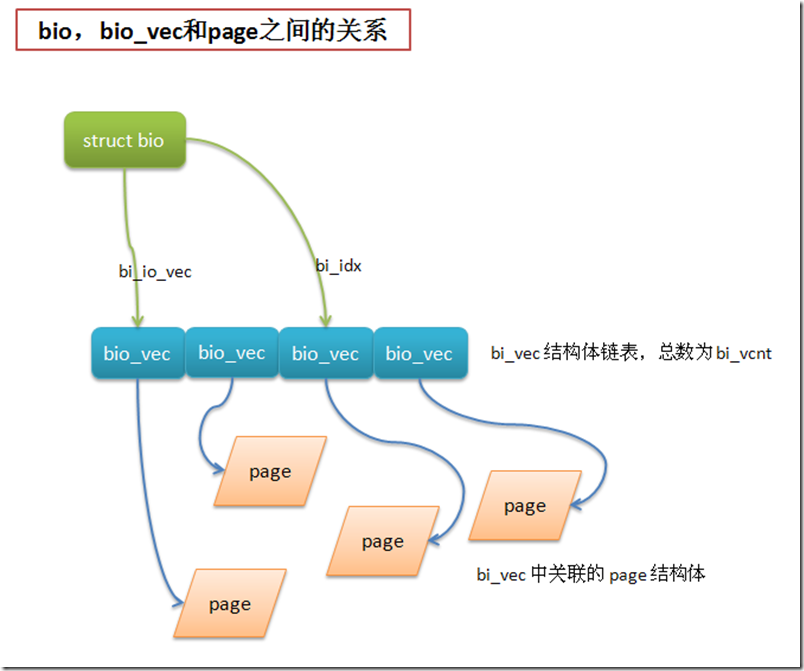
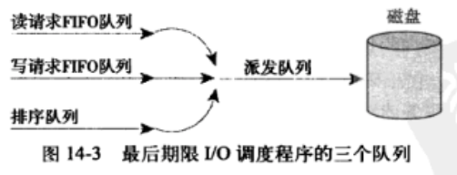

<!-- @import "[TOC]" {cmd="toc" depthFrom=1 depthTo=6 orderedList=false} -->

<!-- code_chunk_output -->

- [1. 背景](#1-背景)
- [2. 扇区和块](#2-扇区和块)
- [3. 缓冲区和缓冲区头: 一个块](#3-缓冲区和缓冲区头-一个块)
- [4. bio 结构体: 一次块 I/O 操作](#4-bio-结构体-一次块-io-操作)
  - [4.1. I/O 向量](#41-io-向量)
  - [4.2. 小结](#42-小结)
  - [4.3. 新老方法对比](#43-新老方法对比)
- [5. 请求队列](#5-请求队列)
- [6. I/O 调度程序](#6-io-调度程序)
  - [6.1. Linus 电梯](#61-linus-电梯)
  - [6.2. deadline (最终期限)](#62-deadline-最终期限)
  - [6.3. Anticipatory (预测)](#63-anticipatory-预测)
  - [6.4. Complete Fair Queuing(CFQ, 完全公平排队)](#64-complete-fair-queuingcfq-完全公平排队)
  - [6.5. Noop(空操作)](#65-noop空操作)
  - [6.6. I/O 调度程序的选择](#66-io-调度程序的选择)

<!-- /code_chunk_output -->

# 1. 背景

两种基本设备类型:

* 字符设备: 按**字节流**的顺序**有序读写**. 串口和键盘等. 键盘输入字符串 "wolf", 对键盘进行读操作得到**字符流**, 先 "w", 然后 "o", 再是 "l", 最后是 "x".

* 块设备: **随机**(不需要按顺序)读写**固定大小数据片**(chunks)的硬件设备, 固定大小的数据片就叫**块**. 硬盘、软盘驱动器、蓝光光驱和闪存等.

字符设备是顺序访问, 仅仅需要控制一个位置: 当前位置. 所以**不必**提供一个**专门子系统**管理.

块设备随机访问, 在介质的不同区间前后移动. 有**专门的子系统**: 块设备的**复杂性**; 块设备对**执行性能**要求很高.

# 2. 扇区和块

块设备最小的可寻址单元是扇区, 即对块设备的 I/O 无法比对扇区还小的单元进行寻址和操作. 扇区大小一般是 2 的整数倍, 最常见是 512 字节.

块是文件系统的一种抽象 -- 只能基于块来访问文件系统. 即内核执行的**所有磁盘操作**都是按照**块**进行的, 虽然物理磁盘寻址是按扇区级进行的.

由于扇区是物理设备的最小可寻址单元, 而逻辑上最小的可寻址单元是块, 所以**块大小**只能**数倍于扇区大小**; 内核还要求块大小是 **2 的整数倍**, 而且**不能超过一个页**的长度(见 12 章和 19 章).

**块大小**最终要求: 必须是**扇区大小的整数倍**; 必须是 2 的倍数; 必须**小于页面大小**. 通常块大小是 512 字节、1KB 或 4KB.

* **扇区**, **物理设备**的最小可寻址单元, 也被称为 "**硬扇区**" 或 "**设备块**"

* **块**, **文件系统**的最小可寻址单元, 也被称为 "**文件块**" 或 "**I/O 块**"

```
#sudo fdisk -l
Disk /dev/sda: 500.1 GB, 500107862016 bytes, 976773168 sectors
Units = sectors of 1 * 512 = 512 bytes
Sector size (logical/physical): 512 bytes / 4096 bytes
I/O size (minimum/optimal): 4096 bytes / 4096 bytes
Disk identifier: 0x00000000
```

* Sector size: 扇区大小值. 逻辑大小是为了兼容以前的软件; 物理大小才是实际扇区大小

* I/O size: 块大小值.

# 3. 缓冲区和缓冲区头: 一个块

内核通过文件系统访问块设备, 需要将**块**读入到**内存**时, 它要存储在一个缓冲区中. **每个缓冲区**与**一个块**对应, 它相当于是**块在内存中的表示**.

> 块是文件系统的最小寻址单元, 这个块对应磁盘上的多个扇区

块设备中的**一个或多个扇区**组成**一个块**, 一个块大小不超过一个页面, 所以**一个页**可以容纳一个或**多个**内存中的**块**(**缓冲区**).

**每个缓冲区**有一个对应的**描述符**, buffer_head 结构体, 称为**缓冲区头**, 包含内核操作缓冲区所需要的全部信息.

```cpp
struct buffer_head {
    unsigned long 		    b_state;	        /* 表示缓冲区状态 */
    struct buffer_head 		*b_this_page;	    /* 当前页中缓冲区 */
    struct page 		    *b_page;     	    /* 当前缓冲区所在内存页 */

    sector_t 			    b_blocknr;   	    /* 物理磁盘起始块号, 扇区号? */
    size_t 			        b_size;      	    /* buffer 在内存中的大小 */
    char 			        *b_data;    	    /* 块映射在内存页中的数据 */

    struct block_device 	*b_bdev; 	        /* 关联的块设备 */
    bh_end_io_t 		    *b_end_io;  	    /* I/O 完成方法 */
    void 			        *b_private;   	    /* 保留的 I/O 完成方法 */
    struct list_head 	    b_assoc_buffers;    /* 关联的其他缓冲区 */
    struct address_space	*b_assoc_map;	    /* 相关的地址空间 */
    atomic_t 			    b_count;      	    /* 引用计数 */
};
```

b_state 表示缓冲区的状态, 可以是 bh_state_bits 枚举中多个的组合.

```cpp
enum bh_state_bits {
    BH_Uptodate,    	/* 包含可用数据 */
    BH_Dirty,    	    /* 该缓冲区是脏的(说明缓冲的内容比磁盘中的内容新, 需要回写磁盘) */
    BH_Lock,    	    /* 该缓冲区正在被 I/O 使用, 锁住以防止并发访问 */
    BH_Req,        	    /* 该缓冲区有 I/O 请求操作 */
    BH_Uptodate_Lock,   /* 由内存页中的第一个缓冲区使用, 使得该页中的其他缓冲区 */
    BH_Mapped,    	    /* 该缓冲区是映射到磁盘块的可用缓冲区 */
    BH_New,        	    /* 缓冲区是通过 get_block() 刚刚映射的, 尚且不能访问 */
    BH_Async_Read,    	/* 该缓冲区正通过 end_buffer_async_read() 被异步 I/O 读操作使用 */
    BH_Async_Write,    	/* 该缓冲区正通过 end_buffer_async_read() 被异步 I/O 写操作使用 */
    BH_Delay,    	    /* 缓冲区还未和磁盘关联 */
    BH_Boundary,    	/* 该缓冲区处于连续块区的边界, 下一个块不在连续 */
    BH_Write_EIO,    	/* 该缓冲区在写的时候遇到 I/O 错误 */
    BH_Ordered,    	    /* 顺序写 */
    BH_Eopnotsupp,    	/* 该缓冲区发生 "不被支持" 错误 */
    BH_Unwritten,    	/* 该缓冲区在磁盘上的位置已经被申请, 但还有实际写入数据 */
    BH_Quiet,    	    /* 该缓冲区禁止错误 */

    BH_PrivateStart,	/* 不是表示状态, 分配给其他实体的私有数据区的第一个 bit */
};
```

块 I/O 层不会使用 BH_PrivateStart 或更高位. 可被其他程序使用.

操作缓冲区之前, 应先使用 get_bh() 增加引用计数, 确保该缓冲区头不再被分配出去; 完成操作后, 调用 put_bh() 减少引用计数.

与缓冲区对应的**磁盘物理块**(扇区?)由 `b_blocknr` 指向, 该值是 b_bdev 指明的块设备中的**逻辑块号**(扇区?).

与缓冲区对应的**内存物理页**由 b_page 表示, b_data 直接指向**相应的块**(位于 b_page 指向的**页面的某个位置**上), **块大小**由 b_size 域表示. 所以块在内存汇总的**起始位置**在 **b_data** 处, **结束位置**是 (`b_data + b_size`) 处.

**缓冲区头**目的: 仅仅是一个**描述符**, 说明**内存缓冲区**(在**特定页面上的字节序列**)和**块**的**映射关系**.

> 这个块就是磁盘上的物理块, 是一个逻辑概念, 对应多个连续的扇区

**2.6 内核以前**, 缓冲区头作为内核中的 **I/O 操作单元**, 不仅描述了块和物理内存的映射, 还是**所有块 I/O 操作的容器**.

通过缓冲区头来管理内核的所有块 I/O 操作有 2 个弊端:

1. 内核更倾向于**操作页面结构**, 因为简单且高效. 所以 2.6 中, 很多 I/O 操作都是通过内核直接对页面或地址空间进行操作的, 不再使用缓冲区头; **每个块**对应**一个缓冲区头**, 太耗内存(原来结构体巨大).

2. **每个缓冲区头**只能表示一个块, 内核对**大块数据**的 I/O 操作会被分解为**多个对 buffer_head 结构体**进行操作. 不必要的负担和空间浪费.

# 4. bio 结构体: 一次块 I/O 操作

为改善上面缓冲区头的 2 个弊端, 引入了 bio, 它表示**一次块 I/O 操作**涉及的**所有内存页**.

块 I/O 操作的基本容器由 bio 结构体表示. 代表了正在现场的(**活动的**)以**片段**(segment)**链表**形式组织的块 I/O 操作. 不需要保证单个缓冲区一定要连续. **一个片段**就是**一小块连续的内存缓冲区**, 即让**一个缓冲区**分散在**内存的多个位置**上.

```cpp
/*
 * I/O 操作的主要单元, 针对 I/O 块和更低级的层 (ie drivers and
 * stacking drivers)
 */
struct bio {
    sector_t      	    bi_sector;    	/* 磁盘上相关扇区 */
    struct bio        	*bi_next;    	/* 请求列表 */
    struct block_device	*bi_bdev; 	    /* 相关的块设备 */
    unsigned long     	bi_flags;    	/* 状态和命令标志 */
    unsigned long	    bi_rw;        	/* 读还是写 */

    unsigned short   	bi_vcnt;    	/* bio_vecs 的数目 */
    unsigned short   	bi_idx;        	/* bio_io_vect 的当前索引 */

    /* Number of segments in this BIO after
     * physical address coalescing is performed.
     * 结合后的片段(segment)数目
     */
    unsigned int	    bi_phys_segments;
    unsigned int        bi_size;    	/* 剩余 I/O 计数 */

    /*
     * To keep track of the max segment size, we account for the
     * sizes of the first and last mergeable segments in this bio.
     * 第一个和最后一个可合并的段的大小
     */
    unsigned int        bi_seg_front_size;
    unsigned int        bi_seg_back_size;

    unsigned int        bi_max_vecs; 	/* bio_vecs 数目上限 */
    unsigned int        bi_comp_cpu;    /* 结束 CPU */

    atomic_t        	bi_cnt;    	    /* 使用计数 */
    struct bio_vec   	*bi_io_vec;	    /* bio_vec 链表(i/o 向量) */
    bio_end_io_t        *bi_end_io; 	/* I/O 完成方法 */
    void            	*bi_private;    /* bio 结构体创建者的私有方法 */
    bio_destructor_t    *bi_destructor; /* bio 撤销方法 */
    /*
     * We can inline a number of vecs at the end of the bio, to avoid
     * double allocations for a small number of bio_vecs. This member
     * MUST obviously be kept at the very end of the bio.
     * 内嵌在结构体末尾的 bio 向量, 主要为了防止出现二次申请少量的 bio_vecs
     */
    struct bio_vec 	    bi_inline_vecs[0];
};
```

* bi_io_vec 指向一个 **bio_vec 结构体链表**, **每个**表示 I/O 操作的**一个片段**(segment);

* bi_vcnt 表示这个**链表的个数**;

* bi_idx 表示**数组的当前索引**.



bi_cnt 代表了使用计数, 为 0 就应该释放该结构体内存. bio_get() 增加计数; bio_put() 减少计数.

## 4.1. I/O 向量

整个 bio_io_vec 结构体数组表示了一个完整的缓冲区.

每个 bio_vec 结构都是一个 `<page, offset, len>` 的向量, 描述了**一个特定的片段**: <片段所在的物理页, 块在物理页中的偏移量, 从给定偏移量开始的块长度>.

```cpp
struct bio_vec {
    struct page     *bv_page;   /* 这个片段所在的物理页 */
    unsigned int    bv_len;     /* 这个片段以字节为单位的大小 */
    unsigned int    bv_offset;  /* 这个片段在所在的物理页中以字节为单位的偏移量 */
}
```

## 4.2. 小结

总之, 每一个块 I/O 请求都是通过一个 bio 结构体表示; 每个请求包括一个或多个块, 这些块存储在 bio_vec 结构体数组中; 每个结构体数组项代表一个片段, 结构体会描述这个片段在物理页中的实际位置, 通过 I/O 向量形式表示: `<page, offset, len>`; I/O 操作的第一个片段由 bi_io_vec 结构体指向, 其他片段在其后依次放置, 共 bi_vcnt 个片段; 当块 I/O 请求使用各个片段时, bi_idx 域会更新, 从而总是指向当前片段.

## 4.3. 新老方法对比

缓冲区头和 bio 并不是相互矛盾的, bio 只是缓冲区头的一种改善, 将以前缓冲区头完成的一部分工作移到 bio 中来完成.

bio 结构体代表 I/O 操作, 对应的是**内存中的一个或多个页**.

buffer_head 结构体代表一个内存缓冲区, 描述的仅仅是**磁盘中的一个块**.

> 这里的块是文件系统块, 会包含磁盘上多个扇区, 对磁盘而言, 这个块是逻辑概念

对内核来说, 配合使用 bio 和缓冲区头 比 只使用缓冲区头更加的方便高效

bio 相当于在缓冲区上又封装了一层, 使得内核在 I/O 操作时只要针对一个或多个内存页即可, 不用再去管理磁盘块的部分

因为 buffer_head 关联的是单独页中的单独磁盘块, 所以会将请求按块进行划分, 只能以后再重新组合. bio 是轻量的, 描述的块可以不需要连续存储区, 并且不需要分割 I/O 操作.

bio 其他好处:

* bio 很容易处理高端内存, 因为它处理的是物理页而不是直接指针

* bio 结构体既可以代表普通页 I/O, 也可以代表直接 I/O

* bio 结构体便于执行分散-集中(矢量化的)块 I/O 操作, 操作中的数据可以取自多个物理页面

# 5. 请求队列

**挂起的块 I/O 请求**会保存在**请求队列**中, 由 reques_queue 结构体表示, 包含一个双向请求链表以及相关控制信息.

内核, 比如文件系统, 将 I/O 请求加入到队列中, 队列只要不为空, 块设备驱动程序会从队列头获取请求, 然后将其送入对应的块设备. 队列中每一项都是一个单独的请求, 由 reques 结构体表示.

每个单独的请求可能要操作多个连续的磁盘块, 所以每个请求由多个 bit 结构体组成. 虽然磁盘上的块必须连续, 但是内存中这些块并不一定要连续 -- 每个 bio 结构体可以描述多个片段(片段是内存中连续的小区域), 而每个请求也可以包含多个 bio 结构体.

# 6. I/O 调度程序

按内核请求次序直接发向块设备的话, 性能会比较差. 磁盘寻址(定位到硬盘磁头到特定块上的某个位置)是整个计算机中最慢的操作之一.

内核中负责**管理块设备 I/O 请求队列**的子系统称为 I/O 调度程序, 负责将**磁盘 I/O 资源**分配给系统中所有挂起的块 I/O 请求.

进程调度程序和 I/O 调度程序都是将一个资源虚拟给多个对象.

* 进程调度程序. 处理器被虚拟并被系统中运行程序共享.

* I/O 调度程序. 虚拟块设备给多个磁盘请求.

I/O 调度程序决定队列中的请求排列顺序以及在什么时刻派发请求到块设备. 减少磁盘寻址时间, 从而提高全局吞吐量.

两种方法: 合并和排序.

* 合并. 将多个请求合并成一个新请求. 比如, 合并磁盘扇区相邻的多个请求, 减少了磁盘寻址次数.

* 排序. 整个请求队列将按照扇区增长方向有序排列. 通过保持磁盘头以直线方向移动, 缩短了所有请求的磁盘寻址时间. 类似于电梯调度, 向一个方向移动, 当抵达同一个方向上的最后一层后, 再掉头. 所以又称电梯调度.

## 6.1. Linus 电梯

2.4 内核中默认的 I/O 调度程序. 2.6 内核被取代.

linus 电梯调度主要是对 I/O 请求进行**合并**和**排序**. 通过最小化寻址, 提供更好的系统吞吐量.

当一个新请求加入 I/O 请求队列时, 可能会发生以下 4 种操作:

* 如果队列中已存在一个对相邻磁盘扇区操作的请求, 那么新请求将和这个已存在的请求合并成一个请求;

> 文件的分布特点(扇区号增长存放)和 I/O 操作执行方式(一般从头读向尾, 很少反向), 所以向后合并(新请求在现存请求后)比向前请求(新请求在现存请求前)多很多.

* 如果队列中存在一个驻留时间过长的请求, 那么新请求直接插到队列尾部, 防止旧的请求发生饥饿;

> 仅仅是经过一定时间后停止 插入-排序, 改善了等待时间, 但还是会导致饥饿现象.

* 如果队列中以扇区方向为序存在合适的插入位置, 那么新请求将被插入该位置, 保证队列中的请求是以被访问磁盘物理位置为序进行排列的;

* 如果队列中不存在合适的请求插入位置, 请求将被插入到队列尾部.

## 6.2. deadline (最终期限)

Linus 电梯的缺陷.

* 饥饿问题(starving). 对磁盘同一个位置操作的请求流可以导致较远位置的请求永远无法运行;

* 写-饥饿-读(write-starving-read). 写操作往往是异步的; 读操作往往同步的, 应用会阻塞直到读请求被满足; 所以读操作响应时间很重要.

读请求往往相互依靠. 比如读大量的文件, 每次都是针对一块很小的缓冲区进行读操作, 而应用只有将上一个数据区从磁盘中读取并返回后, 才能继续读取下一个数据区. 不管是读或者写, 二者都需要读取像索引节点这样的元数据. 从磁盘进一步读取这些块会使 I/O 操作串行化. 所以每一次请求都发生饥饿的话, 那对应用而言会有很长的等待时间. 综上, 读操作具有同步性, 并且往往互相依靠, 所以读请求响应时间直接影响系统性能.

注意, 减少请求饥饿必须以降低全局吞吐量为代价.

deadline I/O 调度程序会减少请求饥饿现象, 特别是读请求饥饿.

deadline 调度中, 每个请求都有一个超时时间. 默认情况下, 读请求的超时时间 500ms, 写请求的超时时间是 5s.

执行合并和插入请求类似于 Linus 电梯, 但一个新请求加入到 I/O 请求队列时, 最终期限 I/O 调度多出了以下操作:

* 新请求加入到 排序队列(`order-FIFO`), 加入的方法类似 linus 电梯新请求加入的方法;

> 向前合并是一个可选项, 因为读操作请求很少需要向前合并.

* 根据新请求的类型, 同时将其加入 **读队列**(read-FIFO) 或者**写队列**(wirte-FIFO) 的尾部(读写队列是按加入时间排序的, 所以新请求都是加到尾部)

* 调度程序首先判断 读、写队列头的请求是否超时, 如果超时, 从读, 写队列头取出请求, 加入到派发队列(dispatch-FIFO)

* 如果没有超时请求, 从 排序队列(order-FIFO)头取出一个请求加入到 派发队列(dispatch-FIFO)

* 派发队列(dispatch-FIFO)按顺序将请求提交到磁盘驱动, 完成 I/O 操作



最终期限 I/O 调度 算法也不能严格保证响应时间, 但是它可以保证不会发生请求在明显超时的情况下仍得不到执行.

## 6.3. Anticipatory (预测)

deadline I/O 调度算法优先考虑读请求的响应时间, 但系统处于写操作繁重的状态时, 会大大降低系统的吞吐量.

> 因为读请求的超时时间比较短, 所以每次有读请求时, 都会打断写请求, 让磁盘寻址到读的位置, 完成读操作后再回来继续写. 保证了读请求的响应速度, 但两次寻址操作(一次读定位, 一次返回来进行写定位)却损害了系统的全局吞吐量

预测 I/O 调度算法是为了解决上述问题而提出的, 它是基于最终期限 I/O 调度算法的.

但有一个新请求加入到 I/O 请求队列时, 预测 I/O 调度与最终期限 I/O 调度相比, 多了以下操作:

1. 新的读请求提交后, 并不立即进行请求处理, 而是有意等待片刻(默认是 6ms)

2. 等待期间如果有其他对磁盘相邻位置进行读操作的读请求加入, 会立刻处理这些读请求

3. 等待期间如果没有其他读请求加入, 那么等待时间相当于浪费掉

4. 等待时间结束后, 继续执行以前剩下的请求

预测 I/O 调度算法中最重要的是保证等待期间不要浪费, 也就是提高预测的准确性,

目前这种预测是依靠一系列的启发和统计工作, 预测 I/O 调度程序会跟踪并统计每个应用程序的 I/O 操作习惯, 以便正确预测应用程序的读写行为.

如果预测的准确率足够高, 那么预测 I/O 调度和最终期限 I/O 调度相比, 既能提高读请求的响应时间, 又能提高系统吞吐量.

注: 预测 I/O 调度是 linux 2.6 内核中缺省的调度程序.

## 6.4. Complete Fair Queuing(CFQ, 完全公平排队)

完全公正的排队(Complete Fair Queuing, CFQ)I/O 调度 是为专有工作负荷设计的, 它和之前提到的 I/O 调度有根本的不同.

CFQ I/O 调度 算法中, 每个进程都有自己的 I/O 队列,

CFQ I/O 调度程序以时间片轮转调度队列, 从每个队列中选取一定的请求数(默认 4 个), 然后进行下一轮调度

## 6.5. Noop (空操作)

空操作(noop)I/O 调度几乎不做什么事情, 这也是它这样命名的原因.

空操作 I/O 调度只做一件事情, 当有新的请求到来时, 把它与任一相邻的请求合并.

空操作 I/O 调度主要用于闪存卡之类的块设备, 这类设备没有磁头, 没有寻址的负担

## 6.6. I/O 调度程序的选择

2.6 内核中内置了上面 4 种 I/O 调度, 可以在启动时通过命令行选项 elevator=xxx 来启用任何一种

elevator 选项参数如下

<table>
 <caption><b><br>elevator</br></b></caption>
    <tr>
        <th>参数</th>
        <th>I/O 调度程序</th>
    </tr>
    <tr>
        <td>as</td>
        <td>
            预测
        </td>
    </tr>
    <tr>
        <td>cfq</td>
        <td>完全公正排队</td>
    </tr>
    <tr>
        <td>deadline</td>
        <td>最终期限</td>
    </tr>
    <tr>
        <td>noop</td>
        <td>空操作</td>
    </tr>
</table>