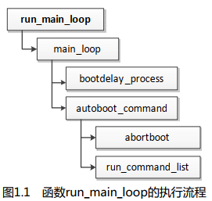
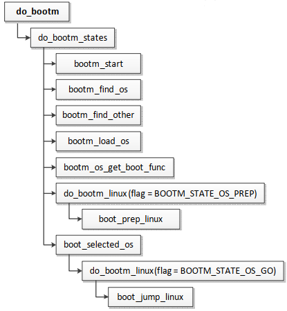
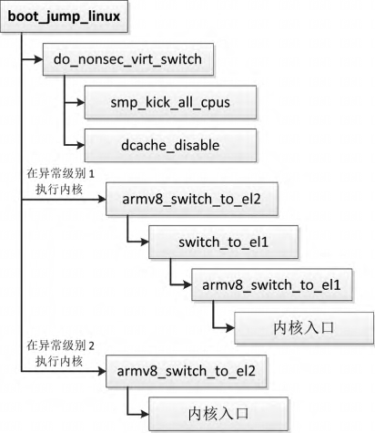

U-Boot 程序初始化完成后, 准备**处理命令**, 这是通过数组 `init_sequence_r` 的最后一个函数 `run_main_loop` 实现的.

函数 `run_main_loop` 的执行流程如图 1.1 所示, 把主要工作委托给函数 `main_loop`, 函数 `main_loop` 的执行过程如下.

( 1) 调用 `bootdelay_process` 以读取**环境变量** bootdelay 和 bootcmd, 环境变量 **bootdelay** 定义**延迟时间**, 即等待用户按键的时间长度; 环境变量 **bootcmd** 定义要**执行的命令**.

> U-Boot 程序到哪里读取环境变量?
>
> 通常我们把 NOR 闪存分成多个分区, 其中第一个分区存放 U-Boot 程序, 第二个分区存放环境变量. U-Boot 程序里面的 NOR 闪存驱动程序对分区信息硬编码, 指定每个分区的偏移和长度. U-Boot 程序从环境变量分区读取环境变量.

(2) 调用函数 `autoboot_command`. 函数 `autoboot_command` 先调用函数 abortboot, 等待用户按键. 如果在等待时间内用户没有按键, 就调用函数 `run_command_list`, 自动执行环境变量 bootcmd 定义的命令. 假设环境变量 bootcmd 定义的命令是 "bootm", 函数 `run_command_list` 查找命令表, 发现命令 "bootm" 的处理函数是 `do_bootm`.

函数 `do_bootm` 的执行流程如图 1.2 所示, 把主要工作委托给函数 `do_bootm_states`, 函数 `do_bootm_states` 的执行过程如下.

(1) 函数 `bootm_start` 负责初始化全局变量 "`bootm_headers_t images`".

(2) 函数 `bootm_find_os` 把**内核镜像**从存储设备读到**内存**.

( 3) 函数 `bootm_find_other` 读取其他信息, 对于 ARM64 架构, 通常是**扁平设备树** (Flattened Device Tree, FDT) **二进制文件**, 该文件用来传递**硬件信息**给内核.

(4) 函数 `bootm_load_os` 把内核加载到正确的位置, 如果**内核镜像**是被压缩过的, 需要**解压缩**.

(5) 函数 `bootm_os_get_boot_func` 根据**操作系统类型**在数组 `boot_os` 中查找引导函数, Linux 内核的引导函数是 `do_bootm_linux`.

(6) 第一次调用函数 `do_bootm_linux` 时, 参数 flag 是 `BOOTM_STATE_OS_PREP`, 为执行 Linux 内核做准备工作. 函数 `do_bootm_linux(flag=BOOTM_STATE_OS_PREP)` 把工作委托给函数 `boot_prep_linux`, 主要工作如下.

  1) 分配一块内存, 把**扁平设备树二进制文件**复制过去.

  2) **修改扁平设备树二进制文件**, 例如: 如果环境变量 "bootargs" 指定了内核参数, 那么把节点 "`/chosen`" 的属性 "**bootargs**" 设置为**内核参数字符串**; 如果多处理器系统使用**自旋表启动方法**, 那么针对每个处理器对应的节点 "cpu", 把属性 "`enable-method`" 设置为 "`spin-table`", 把属性 "`cpu-release-addr`" 设置为全局变量 `spin_table_cpu_release_addr` 的地址.

(7) 函数 `boot_selected_os` 调用函数 `do_bootm_linux`, 这是第二次调用函数 `do_bootm_linux`, 参数 flag 是 `BOOTM_STATE_OS_GO`. 函数 `do_bootm_linux(flag=BOOTM_STATE_OS_GO)` 调用函数 `boot_jump_linux`, 该函数跳转到**内核的入口**, 第一个参数是**扁平设备树二进制文件的起始地址**, 后面 3 个参数现在没有使用.

函数 `boot_jump_linux` 负责跳转到 Linux 内核, 执行流程如图 1.3 所示.

(1) 调用函数 `smp_kick_all_cpus`, 如果打开了配置宏 `CONFIG_GICV2` 或者 `CONFIG_GICV3`, 即使用通用中断控制器版本 2 或者版本 3, 那么发送中断请求以**唤醒所有从处理器**.

(2) 调用函数 `dcache_disable`, **禁用**处理器的**缓存**和**内存管理单元**.

(3) 如果开启配置宏 `CONFIG_ARMV8_SWITCH_TO_EL1`, 表示在异常级别 1 执行 Linux 内核, 那么先从异常级别 3 切换到异常级别 2, 然后切换到异常级别 1, 最后跳转到内核入口.

(4) 如果在异常级别 2 执行 Linux 内核, 那么先从异常级别 3 切换到异常级别 2, 然后跳转到内核入口.
