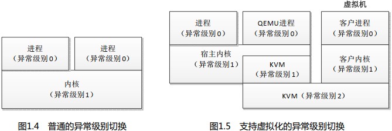
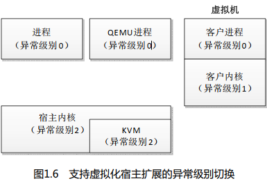

ARM64 架构的内核的入口是标号 `_head`, 直接跳转到标号 stext.

```
// arch/arm64/kernel/head.S
1  _head:
2  #ifdef CONFIG_EFI
3   add x13, x18, #0x16
4   b stext
5  #else
6   b stext // 跳转到内核起始位置
7   .long0 // 保留
8  #endif
```

配置宏 CONFIG_EFI 表示提供 UEFI 运行时支持, UEFI(Unified Extensible Firmware Interface)是统一的可扩展固件接口, 用于取代 BIOS.

标号 stext 开始的代码如下:

```
// arch/arm64/kernel/head.S
1 ENTRY(stext)
2  bl preserve_boot_args
3  bl el2_setup // 降级到异常级别 1, 寄存器 w0 存放 cpu_boot_mode
4  adrp x23, __PHYS_OFFSET
5  and x23, x23, MIN_KIMG_ALIGN - 1 // KASLR 偏移, 默认值是 0
6  bl set_cpu_boot_mode_flag
7  bl __create_page_tables
8  /*
9   * 下面调用设置处理器的代码, 请看文件 "arch/arm64/mm/proc.S"
10  * 了解细节.
11  * 返回的时候, 处理器已经为开启内存管理单元做好准备,
12  * 转换控制寄存器已经设置好.
13  */
14  bl __cpu_setup // 初始化处理器
15  b __primary_switch
16 ENDPROC(stext)
```

第 2 行代码, 调用函数 preserve_boot_args, 把引导程序传递的 4 个参数保存在全局数组 boot_args 中.

第 3 行代码, 调用函数 el2_setup: 如果处理器当前的异常级别是 2, 判断是否需要降级到异常级别 1.

第 6 行代码, 调用函数 set_cpu_boot_mode_flag, 根据处理器进入内核时的异常级别设置数组 `__boot_cpu_mode[2]`. `__boot_cpu_mode[0]` 的初始值是 `BOOT_CPU_MODE_EL2`, `__boot_cpu_mode[1]` 的初始值是 `BOOT_CPU_MODE_EL1`. 如果异常级别是 1, 那么把`__boot_cpu_mode[0]` 设置为 `BOOT_CPU_MODE_EL1`; 如果异常级别是 2, 那么把 `_boot_cpu_mode[1]` 设置为 `BOOT_CPU_MODE_EL2`.

第 7 行代码, 调用函数__create_page_tables, 创建页表映射.

第 14 行代码, 调用函数__cpu_setup, 为开启处理器的内存管理单元做准备, 初始化处理器.

第 15 行代码, 调用函数__primary_switch, 为主处理器开启内存管理单元, 搭建 C 语言执行环境, 进入 C 语言部分的入口函数 start_kernel.

1. 函数 el2_setup

进入内核的时候, ARM64 处理器的异常级别可能是 1 或者 2, 函数 el2_setup 的主要工作如下.

(1) 如果异常级别是 1, 那么在异常级别 1 执行内核.

(2) 如果异常级别是 2, 那么根据处理器是否支持虚拟化宿主扩展(Virtualization Host Extensions, VHE), 决定是否需要降级到异常级别 1.

  a. 如果处理器支持虚拟化宿主扩展, 那么在异常级别 2 执行内核.

  b. 如果处理器不支持虚拟化宿主扩展, 那么降级到异常级别 1, 在异常级别 1 执行内核.

下面介绍 ARM64 处理器的异常级别和虚拟化宿主扩展.

如图 1.4 所示, 通常 ARM64 处理器在异常级别 0 执行进程, 在异常级别 1 执行内核.

虚拟机是现在流行的虚拟化技术, 在计算机上创建一个虚拟机, 在虚拟机里面运行一个操作系统, 运行虚拟机的操作系统称为宿主操作系统(host OS), 虚拟机里面的操作系统称为客户操作系统(guest OS).

现在常用的虚拟机是基于内核的虚拟机(Kernel-based Virtual Machine, KVM), KVM 的主要特点是直接在处理器上执行客户操作系统, 因此虚拟机的执行速度很快. KVM 是内核的一个模块, 把内核变成虚拟机监控程序. 如图 1.5 所示, 宿主操作系统中的进程在异常级别 0 运行, 内核在异常级别 1 运行, KVM 模块可以穿越异常级别 1 和 2; 客户操作系统中的进程在异常级别 0 运行, 内核在异常级别 1 运行.

<div align='center'>

</div>

常用的开源虚拟机管理软件是 QEMU, QEMU 支持 KVM 虚拟机. 使用 QEMU 创建一个 KVM 虚拟机, 和 KVM 的交互过程如下.

(1) 打开 KVM 字符设备文件.

```
fd = open("/dev/kvm", O_RDWR);
```

(2) 创建一个虚拟机, QEMU 进程得到一个关联到虚拟机的文件描述符.

```
vmfd = ioctl(fd, KVM_CREATE_VM, 0);
```

(3) QEMU 为虚拟机模拟多个处理器, 每个虚拟处理器就是一个线程, 调用 KVM 提供的命令 KVM_CREATE_VCPU, KVM 为每个虚拟处理器创建一个 kvm_vcpu 结构体, QEMU 进程得到一个关联到虚拟处理器的文件描述符.

```
vcpu_fd = ioctl(vmfd, KVM_CREATE_VCPU, 0);
```

从 QEMU 切换到客户操作系统的过程如下.

(1) QEMU 进程调用 "ioctl(vcpu_fd, KVM_RUN, 0)", 陷入到内核.

(2) KVM 执行命令 KVM_RUN, 从异常级别 1 切换到异常级别 2.

(3) KVM 首先把调用进程的所有寄存器保存在 kvm_vcpu 结构体中, 然后把所有寄存器设置为客户操作系统的寄存器值, 最后从异常级别 2 返回到异常级别 1, 执行客户操作系统.

如图 1.6 所示, 为了提高切换速度, ARM64 架构引入了虚拟化宿主扩展, 在异常级别 2 执行宿主操作系统的内核, 从 QEMU 切换到客户操作系统的时候, KVM 不再需要先从异常级别 1 切换到异常级别 2.

<div align='center'>

</div>

2. 函数 __create_page_tables

函数__create_page_tables 的主要工作如下.

(1)创建恒等映射( identity mapping).

(2)为内核镜像创建映射.

恒等映射的特点是虚拟地址和物理地址相同, 是为了在开启处理器的内存管理单元的一瞬间能够平滑过渡. 函数__enable_mmu 负责开启内存管理单元, 内核把函数__enable_mmu 附近的代码放在恒等映射代码节 ( .idmap.text) 里面, 恒等映射代码节的起始地址存放在全局变量 `__idmap_text_start` 中, 结束地址存放在全局变量__idmap_text_end 中.

恒等映射是为恒等映射代码节创建的映射, idmap_pg_dir 是恒等映射的页全局目录(即第一级页表)的起始地址.

在内核的页表中为内核镜像创建映射, 内核镜像的起始地址是 `_text`, 结束地址是 `_end`, `swapper_pg_dir` 是内核的页全局目录的起始地址.

3. 函数__primary_switch

函数 `__primary_switch` 的主要执行流程如下.

(1) 调用函数 `__enable_mmu` 以开启内存管理单元.

(2) 调用函数 `__primary_switched`.

函数 `__enable_mmu` 的主要执行流程如下.

(1) 把转换表基准寄存器 0(TTBR0_EL1)设置为恒等映射的页全局目录的起始物理地址.

(2) 把转换表基准寄存器 1(TTBR1_EL1)设置为内核的页全局目录的起始物理地址.

(3) 设置系统控制寄存器(SCTLR_EL1), 开启内存管理单元, 以后执行程序时内存管理单元将会把虚拟地址转换成物理地址.

函数 `__primary_switched` 的执行流程如下.

(1) 把当前异常级别的栈指针寄存器设置为 0 号线程内核栈的顶部(init_thread_union +
THREAD_SIZE).

(2) 把异常级别 0 的栈指针寄存器 (SP_EL0) 设置为 0 号线程的结构体 `thread_info` 的地址(`init_task.thread_info`).

(3) 把向量基准地址寄存器 (VBAR_EL1) 设置为异常向量表的起始地址(vectors).

(4) 计算内核镜像的起始虚拟地址 (kimage_vaddr) 和物理地址的差值, 保存在全局变量 kimage_voffset 中.

(5) 用 0 初始化内核的未初始化数据段.

(6) 调用 C 语言函数 start_kernel.
