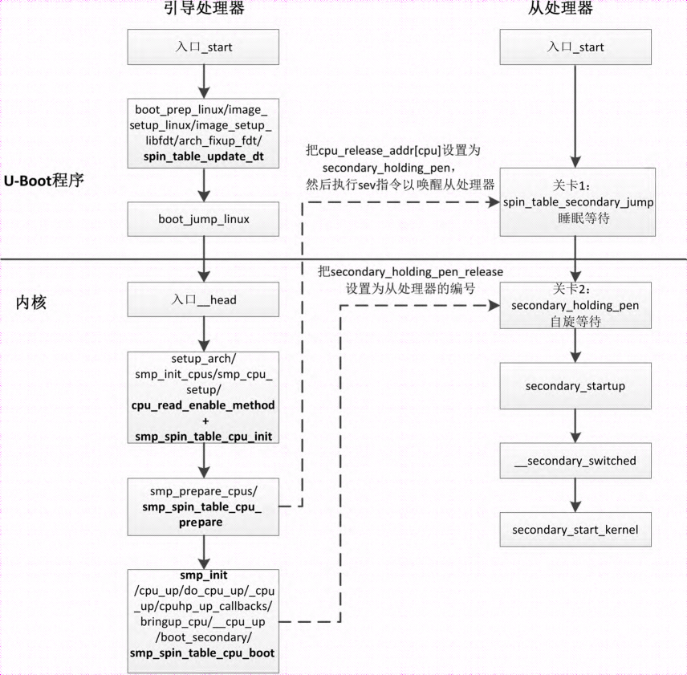

对称多处理器 (Symmetric Multi-Processor, SMP) 系统包含多个处理器, 并且每个处理器的地位平等. 在启动过程中, 处理器的地位不是平等的, **0 号处理器**称为**引导处理器**(主处理器), 负责执行引导程序和初始化内核; 其他处理器称为从处理器, 等待引导处理器完成初始化. 引导处理器初始化内核以后, 启动从处理器.

**引导处理器**启动**从处理器**的方法有 3 种.

(1) **自旋表**(spin-table).

(2) **电源状态协调接口**(`Power State Coordination Interface`, PSCI).

(3) **ACPI 停车协议**(`parking-protocol`), ACPI 是高级配置与电源接口(Advanced Configuration and Power Interface).

引导处理器怎么获取从处理器的启动方法呢? 读者可以参考函数 `cpu_read_enable_method`, 获取方法如下.

(1) 不支持 ACPI 的情况: 引导处理器从**扁平设备树二进制文件**中 "cpu" 节点的属性 "`enable-method`" 读取从处理器的启动方法, 可选的方法是自旋表或者 PSCI.

(2) 支持 ACPI 的情况: 如果固定 ACPI 描述表(Fixed ACPI Description Table, FADT) 设置了**允许 PSCI 的引导标志**, 那么使用 PSCI, 否则使用 ACPI 停车协议.

假设使用自旋表启动方法, 编译 U-Boot 程序时需要开启配置宏 `CONFIG_ARMV8_SPIN_TABLE`. 如下图所示, SMP 系统的引导过程如下.

ARM64 架构下 SMP 系统的自旋表引导过程:

<div align='center'>

</div>

(1) 从处理器的第一个关卡是 U-Boot 程序中的函数 `spin_table_secondary_jump`, 从处理器睡眠等待, 被唤醒后, 检查全局变量 `spin_table_cpu_release_addr` 的值是不是 0, 如果是 0, 继续睡眠等待. 引导处理器将会把全局变量 `spin_table_cpu_release_addr` 的值设置为一个函数的地址.

(2) U-Boot 程序: 引导处理器执行函数 `boot_prep_linux`, 为执行内核做准备工作, 其中一项准备工作是调用函数 `spin_table_update_dt`, 修改扁平设备树二进制文件如下.

1) 为每个处理器的 "cpu" 节点插入一个属性 "`cpu-release-addr`", 把属性值设置为全局变量 `spin_table_cpu_release_addr` 的地址, 称为处理器放行地址.

2) 在内存保留区域 (memory reserve map, 对应扁平设备树源文件的字段 "`/memreserve/`") 添加全局变量 `spin_table_cpu_release_addr` 的地址.

(3) 引导处理器在内核函数 smp_cpu_setup 中, 首先调用函数 `cpu_read_enable_method` 以获取从处理器的启动方法, 然后调用函数 `smp_spin_table_cpu_init`, 从扁平设备树二进制文件中 "cpu" 节点的属性 "`cpu-release-addr`" 得到从处理器的放行地址.

(4) 引导处理器执行内核函数 `smp_spin_table_cpu_prepare`, 针对每个从处理器, 把放行地址设置为函数 `secondary_holding_pen`, 然后唤醒从处理器.

(5) 从处理器被唤醒, 执行函数 `secondary_holding_pen`, 这个函数设置了第二个关卡, 当引导处理器把全局变量 `secondary_holding_pen_release` 设置为从处理器的编号时, 才会放行.

(6) 引导处理器完成内核的初始化, 启动所有从处理器, 针对每个从处理器, 调用函数 `smp_spin_table_cpu_boot`, 把全局变量 `secondary_holding_pen_release` 设置为从处理器的编号.

(7) 从处理器发现引导处理器把全局变量 `secondary_holding_pen_release` 设置为自己的编号, 通过第二个关卡, 执行函数 `secondary_startup`.

(8) 从处理器执行函数 `__secondary_switched`: 把向量基准地址寄存器(VBAR_EL1)设置为异常向量表的起始地址, 设置栈指针寄存器, 调用 C 语言部分的入口函数 `secondary_start_kernel`.

(9) 从处理器执行 C 语言部分的入口函数 `secondary_start_kernel`.

下面是扁平设备树源文件的一个片段, 可以看到每个处理器对应一个 "cpu" 节点, 属性 "enable-method" 指定启动方法, 属性 "cpu-release-addr" 指定放行地址. 需要通过字段 "`/memreserve/`" 把放行地址设置为内存保留区域, 两个参数分别是起始地址和长度.

```
/memreserve/ 0x80000000 0x00010000;

/ {
    ...
    cpus {
        #address-cells = <2>;
        #size-cells = <0>;

        cpu@0 {
            device_type = "cpu";
            compatible = "arm,armv8";
            reg = <0x0 0x0>;
            enable-method = "spin-table"; // highlight
            cpu-release-addr = <0x0 0x8000fff8>; // highlight
            next-level-cache = <&L2_0>;
        };
        cpu@1 {
            device_type = "cpu";
            compatible = "arm,armv8";
            reg = <0x0 0x1>;
            enable-method = "spin-table"; // highlight
            cpu-release-addr = <0x0 0x8000fff8>; // highlight
            next-level-cache = <&L2_0>;
        };

        L2_0: l2-cache0 {
            compatible = "cache";
        };
    };
    ...
};
```
