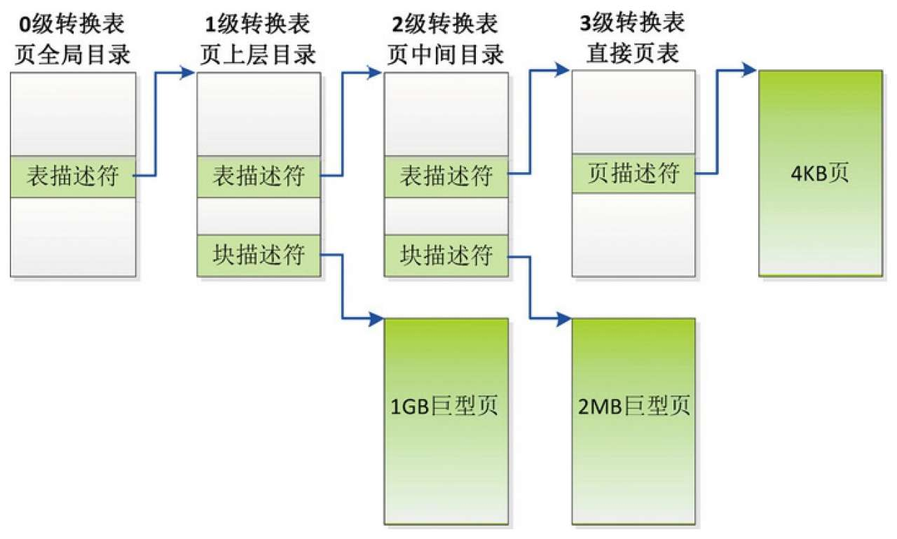
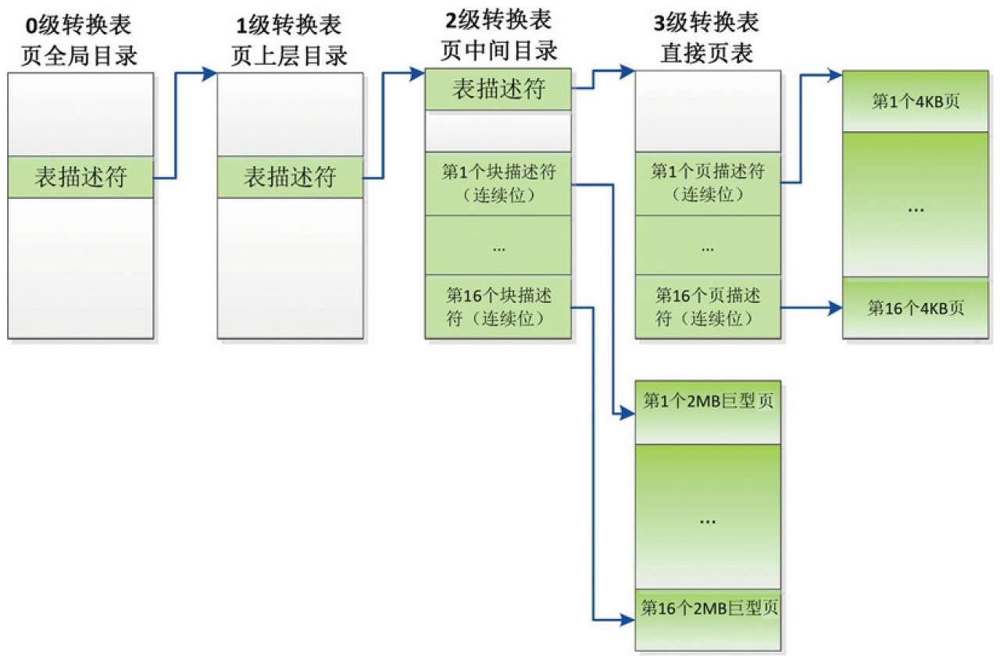

ARM64 处理器支持大页的方式有两种.

(1)通过**块描述符**支持.

(2)通过**页/块描述符**的**连续位**支持.

# 1. 通过块描述符支持大页

如果**页长度**是 **4KB**, 那么使用 **4 级转换表**, **0 级转换表不能使用块描述符**, **1 级转换表**的**块描述符**指向 **1GB 大页**, **2 级转换表**的**块描述符**指向 **2MB 大页**.

页长度为 4KB 时通过块描述符支持大页:

如果**页长度**是 **16KB**, 那么使用 4 级转换表, 0 级转换表不能使用块描述符, 1 级转换表不能使用块描述符, 2 级转换表的块描述符指向 32MB 大页.

如果**页长度**是 **64KB**, 那么使用 3 级转换表, 1 级转换表不能使用块描述符, 2 级转换表的块描述符指向 512MB 大页.

# 2. 通过页/块描述符的连续位支持大页

**页/块描述符**中的**连续位**指示**表项**是**一个连续表项集合**中的**一条表项**, **一个连续表项集合**可以**被缓存在一条 TLB 表项**里面.

通俗地说, **进程**申请了**n 页**的**虚拟内存区域**, 然后申请了**n 页**的**物理内存区域**, 使用**n 个连续的页表项**把每个虚拟页映射到物理页, **每个页表项**设置了**连续标志位**, 当**处理器**的内存管理单元遍历内存中的页表时, 访问到 n 个页表项中的任何一个页表项, 发现页表项设置了连续标志位, 就会把**n 个页表项合并**以后填充到**一个 TLB 表项**. 当然, n 不是随意选择的, 而且 n 页的虚拟内存区域的起始地址必须是 n 页的整数倍, n 页的物理内存区域的起始地址也必须是 n 页的整数倍.

如果页长度是 4KB, 那么使用 4 级转换表, 1 级转换表的块描述符不能使用连续位; 2 级转换表的块描述符支持**16 个连续块**, 即支持(`16 × 2MB =32MB`)大页; 3 级转换表的页描述符支持 16 个连续页, 即支持(`16 × 4KB =64KB`)大页. 如图 3.65 所示

图 3.65 页长度为 4KB 时通过页/块描述符的连续位支持大页:

如果页长度是 16KB, 那么使用 4 级转换表, 2 级转换表的块描述符支持 32 个连续块, 即支持(32 × 32MB = 1GB)大页; 3 级转换表的页描述符支持 128 个连续页, 即支持(128 × 16KB = 2MB)大页.

如果页长度是 64KB, 那么使用 3 级转换表, 2 级转换表的块描述符不能使用连续位; 3 级转换表的页描述符支持 32 个连续页, 即支持(32 × 64KB = 2MB)大页.