<!-- @import "[TOC]" {cmd="toc" depthFrom=1 depthTo=6 orderedList=false} -->

<!-- code_chunk_output -->

- [1. 大页](#1-大页)
  - [1.1. 永久大页](#11-永久大页)
  - [1.2. 临时大页](#12-临时大页)
  - [1.3. 大页池](#13-大页池)
- [2. 内核编译](#2-内核编译)
- [3. 内核启动参数](#3-内核启动参数)
  - [3.1. hugepagesz](#31-hugepagesz)
  - [3.2. hugepages](#32-hugepages)
  - [3.3. default_hugepagesz](#33-default_hugepagesz)
  - [3.4. hugetlb_free_vmemmap](#34-hugetlb_free_vmemmap)
- [4. 总的 HugePages](#4-总的-hugepages)
  - [4.1. 整体使用情况查看](#41-整体使用情况查看)
  - [4.2. 整体设置接口](#42-整体设置接口)
    - [4.2.1. 永久 nr_hugepages](#421-永久-nr_hugepages)
    - [4.2.2. 分配策略 nr_hugepages_mempolicy](#422-分配策略-nr_hugepages_mempolicy)
    - [4.2.3. 超发 nr_overcommit_hugepages](#423-超发-nr_overcommit_hugepages)
  - [4.3. 不同场景的信息示例](#43-不同场景的信息示例)
  - [4.4. 参数之间的关系](#44-参数之间的关系)
  - [4.5. 不同大小的设置或查看](#45-不同大小的设置或查看)
- [5. NUMA node 的 HugePages](#5-numa-node-的-hugepages)
  - [5.1. 单个 NUMA node 的设置接口](#51-单个-numa-node-的设置接口)
  - [5.2. 单个 NUMA node 的使用情况查看](#52-单个-numa-node-的使用情况查看)
  - [5.3. 不同场景的信息示例](#53-不同场景的信息示例)
- [6. 使用方法](#6-使用方法)
  - [6.1. 配置](#61-配置)
  - [6.2. 内存映射](#62-内存映射)
    - [6.2.1. mmap() 函数](#621-mmap-函数)
    - [6.2.2. mmap、SYSV 共享内存异同](#622-mmap-sysv-共享内存异同)
    - [6.2.3. 匿名映射](#623-匿名映射)
    - [6.2.4. 基于文件的映射](#624-基于文件的映射)
      - [6.2.4.1. 挂载 hugetlbfs](#6241-挂载-hugetlbfs)
      - [6.2.4.2. 创建文件和创建内存映射](#6242-创建文件和创建内存映射)
    - [6.2.5. shm](#625-shm)
    - [6.2.6. hugetlbfs 库](#626-hugetlbfs-库)
- [7. 实现原理](#7-实现原理)
  - [7.1. 大页池 struct hstate](#71-大页池-struct-hstate)
  - [7.2. 预先分配永久大页](#72-预先分配永久大页)
    - [7.2.1. 内核参数 hugepages](#721-内核参数-hugepages)
    - [7.2.2. HugePage 分配器初始化](#722-hugepage-分配器初始化)
    - [7.2.3. 写 nr_hugepages 文件](#723-写-nr_hugepages-文件)
  - [7.3. 写超发 nr_overcommit_hugepages](#73-写超发-nr_overcommit_hugepages)
  - [7.4. 挂载 hugetlbfs 文件系统](#74-挂载-hugetlbfs-文件系统)
  - [7.5. 创建文件](#75-创建文件)
  - [7.6. 创建内存映射](#76-创建内存映射)
    - [7.6.1. 申请预留大页](#761-申请预留大页)
  - [7.7. 分配和映射到大页](#77-分配和映射到大页)
  - [7.8. 写时复制](#78-写时复制)
- [8. 性能对比](#8-性能对比)
- [9. reference](#9-reference)

<!-- /code_chunk_output -->

# 1. 大页

## 1.1. 永久大页

> persistent hugepage

**写文件** "`/proc/sys/vm/nr_hugepages`" 指定**大页池**中**永久大页**的**数量**, **预先分配指定数量的永久大页**到大页池中.

另一种方法是在**引导内核时**指定**内核参数** "`hugepages=N`" 以分配永久大页, 这是分配大页最可靠的方法, 因为**内存还没有碎片化**.

## 1.2. 临时大页

> surplus hugepage

在 Hugetlb 大页机制中, 系统可以**提前分配**指定数量的大页用于 hugetlbfs 或者匿名大页使用, 系统同时也支持超发大页, 所谓超发大页就是系统设置一个超发的上限, 当系统**可用大页没有**的时候, 可以**动态**的从 Buddy 中分配内存充当大页, 只要分配大页的数量不超过系统允许超发的上限就行, 这种方式称为大页的超发. `alloc_surplus_huge_page()` 函数的作用就是**动态的分配超发的大页**, 其底层逻辑是: 函数首先调用 `hstate_is_gigantic()` 函数判断大页是否 1Gig 大页, 如果是, 那么函数**不支持动态分配 1Gig 大页**, 函数直接返回 NULL; 反之函数继续动态分配 2MiB 的大页.

通过写文件 "`/proc/sys/vm/nr_overcommit_hugepages`" 指定**大页池**中**最大临时大页的数量**.

当**永久大页用完**的时候, 可以从页分配器**申请临时大页**.

## 1.3. 大页池

> hugepage pool

`nr_hugepages` 是**大页池**的**最小数量**(大小), (`nr_hugepages + nr_overcommit_hugepages`) 是**大页池**的**最大数量**(大小). 这两个参数的默认值都是 0, 至少要设置一个, 不然分配大页会失败.

# 2. 内核编译

> kernel config

编译内核时需要打开配置宏 `CONFIG_HUGETLBFS` 和`CONFIG_HUGETLB_PAGE`.

打开配置宏 `CONFIG_HUGETLBFS` 的时候会自动打开.

# 3. 内核启动参数

HugePages 内存页是不会被系统交换出去(swapped out)的.

由于 HugePages 需要更大的**连续物理内存**, 所以在**系统启动**时**更容易**获得更多的 HugePages 内存, 并且还能尽量保证这些 HugePages 内存页**连续**.

可以通过添加对应的内核启动参数来实现:

<table style="width:100%">
  <tr>
    <th>参数</th>
    <th>描述</th>
  </tr>
  <tr>
    <td>hugepagesz</td>
    <td>单个 HugePages 字节大小</td>
  </tr>
  <tr>
    <td>hugepages</td>
    <td>预分配(永久)的 HugePages 个数</td>
  </tr>
  <tr>
    <td>default_hugepagesz</td>
    <td>默认 HugePages 字节大小</td>
  </tr>
  <tr>
    <td>hugetlb_free_vmemmap</td>
    <td></td>
  </tr>
</table>

如果系统**不支持**设置的**默认** HugePages **内存页大小**, **实际的 HugePages** 内存页大小会保持**2M**.

> hugepagesz=2M hugepages=5 hugepagesz=1G hugepages=4

## 3.1. hugepagesz

有些平台支持**多种大页长度**. 如果要分配特定长度的大页, 必须在内核参数 "`hugepages`" 前面添加选择**大页长度的参数** "`hugepagesz=<size>[kKmMgG]`".

一种大小的 hugepagesz 只能声明一次. 通常后面接 hugepages 参数来预分配大页.

> hugepagesz=2M hugepages=512

## 3.2. hugepages

通常在 hugepagesz 或者 default_hugepagesz 参数的后面.

如果 hugepages 是**第一个参数**或者**唯一参数**, 它隐式地(implicitly)指定要分配的**默认大小大页**的**数量**. 如果**默认大小大页的数量**是隐式指定的(上面的**第一个参数**方法), 那就**不能**通过 `hugepagesz,hugepages` 参数**覆写**.

> hugepages=256 hugepagesz=2M hugepages=512

这里隐式指定了默认大小大页是 256 个, 后面两个参数对默认大小页的设置会被忽略.

同时支持 node 格式的参数

> hugepagesz=2M hugepages=0:1,1:2

在 node0 分配 1 个 2M 大小的 hugepage; 在 node1 分配 2 个 2M 大小的 hugepage.

## 3.3. default_hugepagesz

"`default_hugepagesz=<size>[kKmMgG]`" 用于选择**默认的大页长度**. 这个参数仅能出现一次.

在 `default_hugepagesz` **后面**可以选择跟 **hugepages** 参数, 以**预分配特定数量**的默认大小的大页. 默认大小的**大页数量**也可以**隐式指定**(前面 hugepages 部分).

在默认 2M 大页的架构中, 下面几种方式都能设置 256 个默认 2M 大页

> hugepages=256
> default_hugepagesz=2M hugepages=256
> hugepages=256 default_hugepagesz=2M

## 3.4. hugetlb_free_vmemmap

当 `CONFIG_HUGETLB_PAGE_FREE_VMEMMAP` 设置后, 就能释放 HugeTLB page 关联的 unused vmemmap pages.

---

在支持**多种 size 大页**的系统中, "`/proc/sys/vm/nr_hugepages`" 表示**当前系统中默认长度的永久大页的数量**.

如果系统**不支持**设置的默认 HugePages 内存页大小, **实际的 HugePages** 内存页大小会保持**2M**.

# 4. 总的 HugePages

获取当前系统使用页面大小命令:

```cpp
getconf PAGESIZE
```

假设内核启动参数是 `hugepagesz=2M hugepages=5 hugepagesz=1G hugepages=4`

## 4.1. 整体使用情况查看

`/proc/meminfo` 有总的内存信息, 可以通过查找 Huge 关键字

```
# cat /proc/meminfo | grep -i huge
AnonHugePages:    151552 kB
ShmemHugePages:        0 kB
FileHugePages:         0 kB
HugePages_Total:       5
HugePages_Free:        5
HugePages_Rsvd:        0
HugePages_Surp:        0
Hugepagesize:       2048 kB
Hugetlb:         4204544 kB
```

> 这里显示的是默认 size 大页的信息

<table style="width:100%">
  <tr>
    <th>项目</th>
    <th>描述</th>
  </tr>
  <tr>
    <td>HugePages_Total</td>
    <td>系统当前总共拥有的 HugePages 个数</td>
  </tr>
  <tr>
    <td>HugePages_Free</td>
    <td>系统当前总共拥有的<b>空闲</b> HugePages 个数</td>
  </tr>
  <tr>
    <td>HugePages_Rsvd</td>
    <td>(reserved)系统当前总共<b>预留</b>的 HugePages 个数</td>
  </tr>
  <tr>
    <td>HugePages_Surp</td>
    <td>(surplus)<b>实际使用</b>的超发 HugePages 个数</td>
  </tr>
  <tr>
    <td>Hugepagesize</td>
    <td>每一页 HugePages 的字节大小</td>
  </tr>
  <tr>
    <td>Hugetlb</td>
    <td>Hugetlb 子系统所占内存的字节大小</td>
  </tr>
</table>

(1) `HugePages_Total`: **大页池**的**大小**.

(2) `HugePages_Free`: 大页池中**没有分配**的大页的**数量**(空闲).

> 只要没有读写, 都算 free 计数

(3) `HugePages_Rsvd`: "Rsvd"是"Reserved"的缩写, 意思是"预留的", 是**已经承诺从大页池中分配**但是**还没有分配**的大页的**数量**. 预留的大页保证**应用程序**在**发生缺页异常**的时候能够从大页池中分配一个大页.

程序**已经**向系统**申请**, 但是由于**程序**还**没有**对 HugePages 实质的**读写**操作, 系统**尚未实际分配**给程序的 HugePages 个数

(4) `HugePages_Surp`: "Surp"是"Surplus"的缩写, 意思是"**多余的**", 是大页池中**已经使用**的**临时大页**的数量. 临时大页的最大数量由"`/proc/sys/vm/nr_overcommit_hugepages`"控制.

> 这是实际使用的, `nr_overcommit_hugepages` 设置了但是没使用这里不会计数

(5) Hugepagesize: 大页的大小(每一页 HugePages 的字节大小).

## 4.2. 整体设置接口

`/proc/sys/vm`, **调节系统中 HugePages 参数**.

<table style="width:100%">
<caption>/proc/sys/vm</caption>
  <tr>
    <th>文件</th>
    <th>描述</th>
    <th>权限</th>
  </tr>
  <tr>
    <td>nr_hugepages</td>
    <td>写入或读取实际的永久大页个数</td>
    <td><b>读写</b></td>
  </tr>
  <tr>
    <td>nr_hugepages_mempolicy</td>
    <td>NUMA node 的 HugePages 个数</td>
    <td><b>读写</b></td>
  </tr>
  <tr>
    <td>nr_overcommit_hugepages</td>
    <td>临时大页的最大个数</td>
    <td><b>读写</b></td>
  </tr>
</table>

```
# ll /proc/sys/vm/*huge*
-rw-r--r-- 1 root root 0 Feb 26 09:54 /proc/sys/vm/hugetlb_shm_group
-rw-r--r-- 1 root root 0 Feb 26 09:54 /proc/sys/vm/nr_hugepages
-rw-r--r-- 1 root root 0 Feb 26 09:54 /proc/sys/vm/nr_hugepages_mempolicy
-rw-r--r-- 1 root root 0 Feb 26 09:54 /proc/sys/vm/nr_overcommit_hugepages

# grep . /proc/sys/vm/*huge*
/proc/sys/vm/hugetlb_shm_group:0
/proc/sys/vm/nr_hugepages:5
/proc/sys/vm/nr_hugepages_mempolicy:5
/proc/sys/vm/nr_overcommit_hugepages:0
```

### 4.2.1. 永久 nr_hugepages

`/proc/sys/vm/nr_hugepages` 用于设定**永久 HugePages 个数**, 可读可写.

1. 设定的之前先清零, 重新生成 HugePages 页面.
2. 设定的时候, 系统会根据当前**可用物理内存**计算出可以组成的 HugePages 个数.
3. 读取, 就可以得到**实际分配**的 HugePages 个数.

```
# 清零
echo 0 > /proc/sys/vm/nr_hugepages

# 设置 100 个 `HugePages`
echo 100 > /proc/sys/vm/nr_hugepages

# 查询实际`HugePages`的个数
cat /proc/sys/vm/nr_hugepages
100
```

### 4.2.2. 分配策略 nr_hugepages_mempolicy

> 注意: 这个接口相对落后, 请使用单个 NUMA node 的 HugePages 的分配代替.

`/proc/sys/vm/nr_hugepages_mempolicy` 用于设定**多个 NUMA node 的 HugePages 个数**, 可读可写.

* **默认**情况下系统**所有 NUMA node 平均分配**所有 HugePages.
* 除非 **NUMA node** 本身**没有足够的内存**来生成 HugePages, 那么将由**另外一个生成**.
* **指定 NUMA node** 分配 HugePages, 需要配合 `numactl -m` 一起使用.

```
# 所有`NUMA node`平均分配所有`HugePages`
echo ${huge_page_count} > /proc/sys/vm/nr_hugepages_mempolicy

# 指定`${node-list}`分配`HugePages`
numactl -m ${node-list} echo ${huge_page_count} > /proc/sys/vm/nr_hugepages_mempolicy
```

例子:

```
# 清零
echo 0 > /proc/sys/vm/nr_hugepages

# 从`NUMA node0`分配. 总数 40 个`HugePages`
numactl -m 0 echo 40 > /proc/sys/vm/nr_hugepages_mempolicy

# 查看所有分配
cat /sys/devices/system/node/node*/meminfo | grep Huge
>	# `NUMA node0`分配 新增 40 个`HugePages`
>   Node 0 HugePages_Total:    40
>   Node 0 HugePages_Free:     40
>   Node 0 HugePages_Surp:      0
>	# `NUMA node1`保持 `HugePages` 不变
>   Node 1 HugePages_Total:     0
>   Node 1 HugePages_Free:      0
>   Node 1 HugePages_Surp:      0

# 从`NUMA node1`分配. 总数 60 个`HugePages`
numactl -m 1 echo 60 > /proc/sys/vm/nr_hugepages_mempolicy
# 查看所有分配
cat /sys/devices/system/node/node*/meminfo | grep Huge
>	# `NUMA node0`保持 `HugePages` 不变
>   Node 0 HugePages_Total:    40
>   Node 0 HugePages_Free:     40
>   Node 0 HugePages_Surp:      0
>	# `NUMA node1`分配 新增 20 个`HugePages`
>   Node 1 HugePages_Total:    20
>   Node 1 HugePages_Free:     20
>   Node 1 HugePages_Surp:      0

# 所有`NUMA node`平均分配. 总数 80 个`HugePages`
echo 80 >/proc/sys/vm/nr_hugepages_mempolicy
# 查看所有分配
cat /sys/devices/system/node/node*/meminfo | grep Huge
>	# `NUMA node0`分配 新增 10 个`HugePages`
>   Node 0 HugePages_Total:    50
>   Node 0 HugePages_Free:     50
>   Node 0 HugePages_Surp:      0
>	# `NUMA node1`分配 新增 10 个`HugePages`
>   Node 1 HugePages_Total:    30
>   Node 1 HugePages_Free:     30
>   Node 1 HugePages_Surp:      0

# 所有`NUMA node`平均分配. 总数 100 个`HugePages`
# 注意`/proc/sys/vm/nr_hugepages`无法配合`numactl`使用
numactl -m 1 echo 100 > /proc/sys/vm/nr_hugepages
# 查看所有分配
cat /sys/devices/system/node/node*/meminfo | grep Huge
>	# `NUMA node0`分配 新增 10 个`HugePages`
>   Node 0 HugePages_Total:    60
>   Node 0 HugePages_Free:     60
>   Node 0 HugePages_Surp:      0
>	# `NUMA node1`分配 新增 10 个`HugePages`
>   Node 1 HugePages_Total:    40
>   Node 1 HugePages_Free:     40
>   Node 1 HugePages_Surp:      0

# 所有`NUMA node`平均分配. 总数 80 个`HugePages`
# 注意`/proc/sys/vm/nr_hugepages`无法配合`numactl`使用
numactl -m 1 echo 80 > /proc/sys/vm/nr_hugepages
# 查看所有分配
cat /sys/devices/system/node/node*/meminfo | grep Huge
>	# `NUMA node0`分配 减少 10 个`HugePages`
>   Node 0 HugePages_Total:    50
>   Node 0 HugePages_Free:     50
>   Node 0 HugePages_Surp:      0
>	# `NUMA node1`分配 减少 10 个`HugePages`
>   Node 1 HugePages_Total:    30
>   Node 1 HugePages_Free:     30
>   Node 1 HugePages_Surp:      0

# 从`NUMA node1`分配. 总数 60 个`HugePages`
numactl -m 1 echo 60 > /proc/sys/vm/nr_hugepages_mempolicy
# 查看所有分配
cat /sys/devices/system/node/node*/meminfo | grep Huge
>	# `NUMA node0`保持 `HugePages` 不变
>   Node 0 HugePages_Total:    50
>   Node 0 HugePages_Free:     50
>   Node 0 HugePages_Surp:      0
>	# `NUMA node1`分配 减少 20 个`HugePages`
>   Node 1 HugePages_Total:    10
>   Node 1 HugePages_Free:     10
>   Node 1 HugePages_Surp:      0

# 从`NUMA node0`分配. 总数 30 个`HugePages`
numactl -m 0 echo 30 > /proc/sys/vm/nr_hugepages_mempolicy
# 查看所有分配
cat /sys/devices/system/node/node*/meminfo | grep Huge
>	# `NUMA node0`分配 减少 20 个`HugePages`
>   Node 0 HugePages_Total:    20
>   Node 0 HugePages_Free:     20
>   Node 0 HugePages_Surp:      0
>	# `NUMA node1`保持 `HugePages` 不变
>   Node 1 HugePages_Total:    10
>   Node 1 HugePages_Free:     10
>   Node 1 HugePages_Surp:      0
```
### 4.2.3. 超发 nr_overcommit_hugepages

`/proc/sys/vm/nr_overcommit_hugepages`, 表示**最大超发**的 HugePages **个数**, 可读可写.

```
# 清零
echo 0 > /proc/sys/vm/nr_hugepages
echo 0 > /proc/sys/vm/nr_overcommit_hugepages

# 设置常驻`HugePages`个数是 4
echo 4 > /proc/sys/vm/nr_hugepages
# 设置超发`HugePages`个数是 4
echo 4 > /proc/sys/vm/nr_overcommit_hugepages
```

## 4.3. 不同场景的信息示例

```
# [没有使用`HugePages`]
cat /proc/meminfo | grep HugePages_
>	HugePages_Total:       4
>	HugePages_Free:        4
>	HugePages_Rsvd:        0
>	HugePages_Surp:        0
```

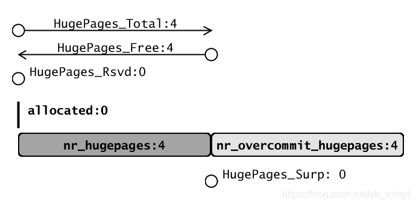

---

```
# [合计使用了 3 个`HugePages`. 但是没有读写]
cat /proc/meminfo | grep HugePages_
>	HugePages_Total:       4	# 总共分配了 4 个`HugePages`
>	HugePages_Free:        4	# 由于没有读写. 所以空闲 4 个`HugePages`
>	HugePages_Rsvd:        3	# 由于没有读写. 所以保留 3 个`HugePages`
>	HugePages_Surp:        0	# 实际超发了 0 个`HugePages`
```

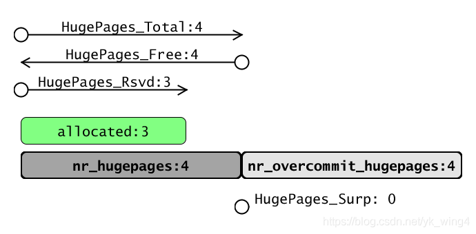

---

```
# [合计用了 3 个`HugePages`. 并且已经读写]
cat /proc/meminfo | grep HugePages_
>	HugePages_Total:       4	# 总共分配了 4 个`HugePages`
>	HugePages_Free:        1	# 由于已经读写. 所以空闲 1 个`HugePages`
>	HugePages_Rsvd:        0	# 由于已经读写. 所以没有保留`HugePages`
>	HugePages_Surp:        0	# 实际超发了 0 个`HugePages`
```

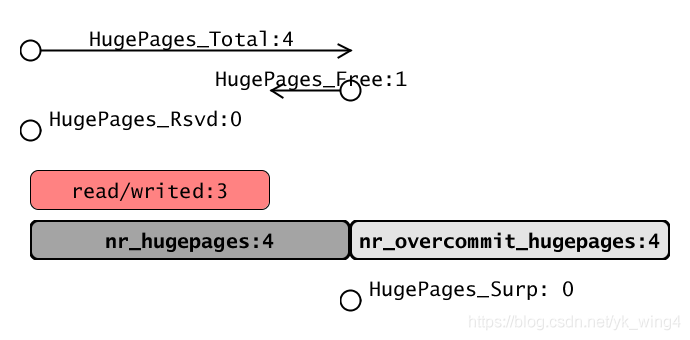

---

```
# [合计用了 6 个`HugePages`. 但是没有读写]
cat /proc/meminfo | grep HugePages_
>	HugePages_Total:       6	# 总共分配了 6 个`HugePages`
>	HugePages_Free:        6	# 由于没有读写. 所以空闲 6 个`HugePages`
>	HugePages_Rsvd:        6	# 由于没有读写. 所以保留 6 个`HugePages`
>	HugePages_Surp:        2	# 实际超发了 2 个`HugePages`
```

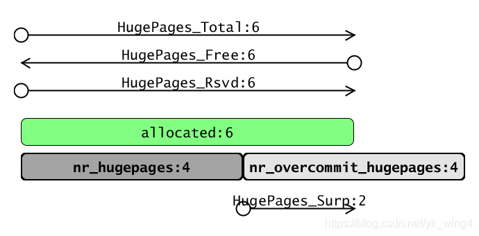

---

```
# [合计用了 6 个`HugePages`. 并且已经读写]
cat /proc/meminfo | grep HugePages_
>	HugePages_Total:       6	# 总共分配了 6 个`HugePages`
>	HugePages_Free:        0	# 由于已经读写. 所以没有空闲`HugePages`
>	HugePages_Rsvd:        0	# 由于已经读写. 所以没有保留`HugePages`
>	HugePages_Surp:        2	# 实际超发了 2 个`HugePages`
```

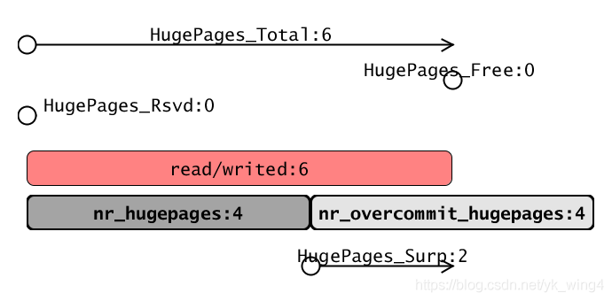

## 4.4. 参数之间的关系

`nr_hugepages <= HugePages_Total <= (nr_hugepages + nr_overcommit_hugepages)`

`HugePages_Rsvd <= HugePages_Free <= HugePages_Total`

`HugePages_Surp == (HugePages_Total - nr_hugepages) <= nr_overcommit_hugepages`

## 4.5. 不同大小的设置或查看

如果系统支持**多种大小**的 HugePages, 就会有**多个** `/sys/kernel/mm/hugepages/hugepages-${huge_page_size}` **目录**.

`${huge_page_size}`为 HugePages 的字节数. 默认是**2048kB**.

每一个目录下存在相同的的一些 HugePages 系统文件. 可用于**设置或者查看系统信息**.

<table style="width:100%">
<caption> /sys/kernel/mm/hugepages/hugepages-${huge_page_size} </caption>
  <tr>
    <th>文件</th>
    <th>描述</th>
    <th>权限</th>
  </tr>
  <tr>
    <td>nr_hugepages</td>
    <td>写入或读取实际的永久大页个数</td>
    <td>读写</td>
  </tr>
  <tr>
    <td>nr_hugepages_mempolicy</td>
    <td>NUMA node 的 HugePages 个数</td>
    <td>读写</td>
  </tr>
  <tr>
    <td>nr_overcommit_hugepages</td>
    <td>临时大页的最大个数</td>
    <td>读写</td>
  </tr>
  <tr>
    <td>free_hugepages</td>
    <td>系统中空闲的 persistent Huge Page 个数</td>
    <td><b>只读</b></td>
  </tr>
  <tr>
    <td>resv_hugepages</td>
    <td>已经被分配但是未被实际使用的 Huge Page 个数</td>
    <td><b>只读</b></td>
  </tr>
  <tr>
    <td>surplus_hugepages</td>
    <td>实际使用中的超发 HugePages 个数</td>
    <td><b>只读</b></td>
  </tr>
</table>

假设系统启动参数如下:

> hugepagesz=2M hugepages=5 hugepagesz=1G hugepages=4

```
# 打印`HugePages`系统文件
# ll /sys/kernel/mm/hugepages/ -R
/sys/kernel/mm/hugepages/:
total 0
drwxr-xr-x 4 root root 0 Feb 26 20:17 ./
drwxr-xr-x 6 root root 0 Feb 26 20:17 ../
drwxr-xr-x 2 root root 0 Feb 27 19:32 hugepages-1048576kB/
drwxr-xr-x 2 root root 0 Feb 27 19:32 hugepages-2048kB/

/sys/kernel/mm/hugepages/hugepages-1048576kB:
total 0
drwxr-xr-x 2 root root    0 Feb 27 19:32 ./
drwxr-xr-x 4 root root    0 Feb 26 20:17 ../
--w------- 1 root root 4096 Feb 27 19:32 demote
-rw-r--r-- 1 root root 4096 Feb 27 19:32 demote_size
-r--r--r-- 1 root root 4096 Feb 27 19:32 free_hugepages
-rw-r--r-- 1 root root 4096 Feb 27 19:32 nr_hugepages
-rw-r--r-- 1 root root 4096 Feb 27 19:32 nr_hugepages_mempolicy
-rw-r--r-- 1 root root 4096 Feb 27 19:32 nr_overcommit_hugepages
-r--r--r-- 1 root root 4096 Feb 27 19:32 resv_hugepages
-r--r--r-- 1 root root 4096 Feb 27 19:32 surplus_hugepages

/sys/kernel/mm/hugepages/hugepages-2048kB:
total 0
drwxr-xr-x 2 root root    0 Feb 27 19:32 ./
drwxr-xr-x 4 root root    0 Feb 26 20:17 ../
-r--r--r-- 1 root root 4096 Feb 27 19:32 free_hugepages
-rw-r--r-- 1 root root 4096 Feb 27 19:32 nr_hugepages
-rw-r--r-- 1 root root 4096 Feb 27 19:32 nr_hugepages_mempolicy
-rw-r--r-- 1 root root 4096 Feb 27 19:32 nr_overcommit_hugepages
-r--r--r-- 1 root root 4096 Feb 27 19:32 resv_hugepages
-r--r--r-- 1 root root 4096 Feb 27 19:32 surplus_hugepages

# 打印`HugePages`系统文件的数值
# grep . -r /sys/kernel/mm/hugepages/
/sys/kernel/mm/hugepages/hugepages-2048kB/free_hugepages:5
/sys/kernel/mm/hugepages/hugepages-2048kB/resv_hugepages:0
/sys/kernel/mm/hugepages/hugepages-2048kB/surplus_hugepages:0
/sys/kernel/mm/hugepages/hugepages-2048kB/nr_hugepages_mempolicy:5
/sys/kernel/mm/hugepages/hugepages-2048kB/nr_hugepages:5
/sys/kernel/mm/hugepages/hugepages-2048kB/nr_overcommit_hugepages:0
/sys/kernel/mm/hugepages/hugepages-1048576kB/demote_size:2048kB
/sys/kernel/mm/hugepages/hugepages-1048576kB/free_hugepages:4
/sys/kernel/mm/hugepages/hugepages-1048576kB/resv_hugepages:0
/sys/kernel/mm/hugepages/hugepages-1048576kB/surplus_hugepages:0
/sys/kernel/mm/hugepages/hugepages-1048576kB/nr_hugepages_mempolicy:4
grep: /sys/kernel/mm/hugepages/hugepages-1048576kB/demote: Permission denied
/sys/kernel/mm/hugepages/hugepages-1048576kB/nr_hugepages:4
/sys/kernel/mm/hugepages/hugepages-1048576kB/nr_overcommit_hugepages:0
```

# 5. NUMA node 的 HugePages

**单个 NUMA node** 的 HugePages 的 `/sys` 接口, 可以提供**更加准确的配置和查看功能**.

注:

* **无法配置** `nr_overcommit_hugepages`
* **无法查看** `resv_hugepages`

## 5.1. 单个 NUMA node 的设置接口

如果系统支持**多种大小**的 HugePages, **每个 NUMA node** 就会有**多个** `/sys/devices/system/node/node${numa_node_id}/hugepages/hugepages-${huge_page_size}` 目录.

* `${numa_node_id}` 的数值范围为整数, 计数从零开始.
* `${huge_page_size}` 为 HugePages 的字节数. 默认是 2048kB.

每一个目录下存在相同的的一些 HugePages 系统文件. 可用于设置或者查看系统信息

<table style="width:100%">
<caption> /sys/devices/system/node/node${id}/hugepages/hugepages-${size} </caption>
  <tr>
    <th>文件</th>
    <th>描述</th>
    <th>权限</th>
  </tr>
  <tr>
    <td>nr_hugepages</td>
    <td>写入或读取实际的永久大页个数</td>
    <td>读写</td>
  </tr>
  <tr>
    <td>free_hugepages</td>
    <td>空闲的 HugePages 个数</td>
    <td>读写</td>
  </tr>
  <tr>
    <td>surplus_hugepages</td>
    <td>实际使用的超发 HugePages 个数</td>
    <td>读写</td>
  </tr>
</table>

例子:

```
# l -R /sys/devices/system/node/node*/hugepages/
--- noed0 ---
/sys/devices/system/node/node0/hugepages/:
hugepages-1048576kB/  hugepages-2048kB/

/sys/devices/system/node/node0/hugepages/hugepages-1048576kB:
demote  demote_size  free_hugepages  nr_hugepages  surplus_hugepages

/sys/devices/system/node/node0/hugepages/hugepages-2048kB:
free_hugepages  nr_hugepages  surplus_hugepages

--- node1 ---
/sys/devices/system/node/node1/hugepages/:
hugepages-1048576kB/  hugepages-2048kB/

/sys/devices/system/node/node1/hugepages/hugepages-1048576kB:
demote  demote_size  free_hugepages  nr_hugepages  surplus_hugepages

/sys/devices/system/node/node1/hugepages/hugepages-2048kB:
free_hugepages  nr_hugepages  surplus_hugepages


# grep . -r /sys/devices/system/node/node*/hugepages/
--- node0 ---
/sys/devices/system/node/node0/hugepages/hugepages-2048kB/free_hugepages:3
/sys/devices/system/node/node0/hugepages/hugepages-2048kB/surplus_hugepages:0
/sys/devices/system/node/node0/hugepages/hugepages-2048kB/nr_hugepages:3
/sys/devices/system/node/node0/hugepages/hugepages-1048576kB/demote_size:2048kB
/sys/devices/system/node/node0/hugepages/hugepages-1048576kB/free_hugepages:2
/sys/devices/system/node/node0/hugepages/hugepages-1048576kB/surplus_hugepages:0
grep: /sys/devices/system/node/node0/hugepages/hugepages-1048576kB/demote: Permission denied
/sys/devices/system/node/node0/hugepages/hugepages-1048576kB/nr_hugepages:2
--- node1 ---
/sys/devices/system/node/node1/hugepages/hugepages-2048kB/free_hugepages:2
/sys/devices/system/node/node1/hugepages/hugepages-2048kB/surplus_hugepages:0
/sys/devices/system/node/node1/hugepages/hugepages-2048kB/nr_hugepages:2
/sys/devices/system/node/node1/hugepages/hugepages-1048576kB/demote_size:2048kB
/sys/devices/system/node/node1/hugepages/hugepages-1048576kB/free_hugepages:2
/sys/devices/system/node/node1/hugepages/hugepages-1048576kB/surplus_hugepages:0
grep: /sys/devices/system/node/node1/hugepages/hugepages-1048576kB/demote: Permission denied
/sys/devices/system/node/node1/hugepages/hugepages-1048576kB/nr_hugepages:2
```

例子:

```
# 清零
echo 0 > /sys/devices/system/node/node0/hugepages/hugepages-2048kB/nr_hugepages

# `NUMA node0`分配 4 个 `HugePages`
echo 4 > /sys/devices/system/node/node0/hugepages/hugepages-2048kB/nr_hugepages

# 超发`HugePages`为 4
echo 4 > /sys/kernel/mm/hugepages/hugepages-2048kB/nr_overcommit_hugepages
```

## 5.2. 单个 NUMA node 的使用情况查看

`/sys/devices/system/node/node${numa_node_id}/meminfo`, 可以查看 `${numa_node_id}` 的 HugePages 内存信息.

例子:

```
# grep Huge /sys/devices/system/node/node*/meminfo
--- node0 ---
/sys/devices/system/node/node0/meminfo:Node 0 AnonHugePages:    188416 kB
/sys/devices/system/node/node0/meminfo:Node 0 ShmemHugePages:        0 kB
/sys/devices/system/node/node0/meminfo:Node 0 FileHugePages:        0 kB
/sys/devices/system/node/node0/meminfo:Node 0 HugePages_Total:     3
/sys/devices/system/node/node0/meminfo:Node 0 HugePages_Free:      3
/sys/devices/system/node/node0/meminfo:Node 0 HugePages_Surp:      0
--- node1 ---
/sys/devices/system/node/node1/meminfo:Node 1 AnonHugePages:     10240 kB
/sys/devices/system/node/node1/meminfo:Node 1 ShmemHugePages:        0 kB
/sys/devices/system/node/node1/meminfo:Node 1 FileHugePages:        0 kB
/sys/devices/system/node/node1/meminfo:Node 1 HugePages_Total:     2
/sys/devices/system/node/node1/meminfo:Node 1 HugePages_Free:      2
/sys/devices/system/node/node1/meminfo:Node 1 HugePages_Surp:      0
```

以下的 `free_hugepages` 和 `surplus_hugepages` 也可以用于查看单个 NUMA node 的 HugePages 内存信息.

```
/sys/devices/system/node/node${numa_node_id}/hugepages/hugepages-${huge_page_size}/free_hugepages

/sys/devices/system/node/node${numa_node_id}/hugepages/hugepages-${huge_page_size}/surplus_hugepages
```

> `${huge_page_size}` 为 `HugePages` 的**字节数**. 默认是 2048kB.

## 5.3. 不同场景的信息示例

```
# [没有使用`HugePages`]
grep . -r /sys/kernel/mm/hugepages/
>	/sys/kernel/mm/hugepages/hugepages-2048kB/nr_hugepages:4
>	/sys/kernel/mm/hugepages/hugepages-2048kB/nr_overcommit_hugepages:4
>	/sys/kernel/mm/hugepages/hugepages-2048kB/free_hugepages:4
>	/sys/kernel/mm/hugepages/hugepages-2048kB/resv_hugepages:0
>	/sys/kernel/mm/hugepages/hugepages-2048kB/surplus_hugepages:0
>	/sys/kernel/mm/hugepages/hugepages-2048kB/nr_hugepages_mempolicy:4

grep . -r /sys/devices/system/node/node*/hugepages/
>	/sys/devices/system/node/node0/hugepages/hugepages-2048kB/nr_hugepages:4
>	/sys/devices/system/node/node0/hugepages/hugepages-2048kB/free_hugepages:4
>	/sys/devices/system/node/node0/hugepages/hugepages-2048kB/surplus_hugepages:0
```

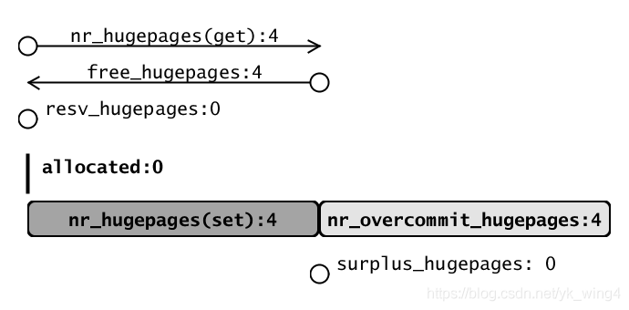

---

```
# [合计使用了 3 个`HugePages`. 但是没有读写]
grep . -r /sys/kernel/mm/hugepages/
>	/sys/kernel/mm/hugepages/hugepages-2048kB/nr_hugepages:4
>	/sys/kernel/mm/hugepages/hugepages-2048kB/nr_overcommit_hugepages:4
>	/sys/kernel/mm/hugepages/hugepages-2048kB/free_hugepages:4
>	/sys/kernel/mm/hugepages/hugepages-2048kB/resv_hugepages:3
>	/sys/kernel/mm/hugepages/hugepages-2048kB/surplus_hugepages:0
>	/sys/kernel/mm/hugepages/hugepages-2048kB/nr_hugepages_mempolicy:4

grep . -r /sys/devices/system/node/node*/hugepages/
>	/sys/devices/system/node/node0/hugepages/hugepages-2048kB/nr_hugepages:4
>	/sys/devices/system/node/node0/hugepages/hugepages-2048kB/free_hugepages:4
>	/sys/devices/system/node/node0/hugepages/hugepages-2048kB/surplus_hugepages:0
```

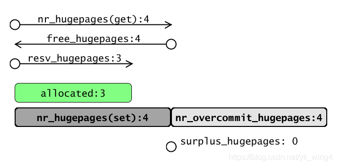

---

```
# [合计用了 3 个`HugePages`. 并且已经读写]
grep . -r /sys/kernel/mm/hugepages/
>	/sys/kernel/mm/hugepages/hugepages-2048kB/nr_hugepages:4
>	/sys/kernel/mm/hugepages/hugepages-2048kB/nr_overcommit_hugepages:4
>	/sys/kernel/mm/hugepages/hugepages-2048kB/free_hugepages:1
>	/sys/kernel/mm/hugepages/hugepages-2048kB/resv_hugepages:0
>	/sys/kernel/mm/hugepages/hugepages-2048kB/surplus_hugepages:0
>	/sys/kernel/mm/hugepages/hugepages-2048kB/nr_hugepages_mempolicy:4

grep . -r /sys/devices/system/node/node*/hugepages/
>	/sys/devices/system/node/node0/hugepages/hugepages-2048kB/nr_hugepages:4
>	/sys/devices/system/node/node0/hugepages/hugepages-2048kB/free_hugepages:1
>	/sys/devices/system/node/node0/hugepages/hugepages-2048kB/surplus_hugepages:0
```

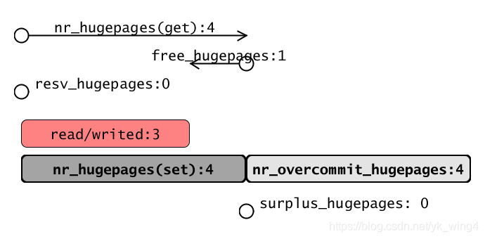

---

```
# [合计用了 6 个`HugePages`. 但是没有读写]
grep . -r /sys/kernel/mm/hugepages/
>	/sys/kernel/mm/hugepages/hugepages-2048kB/nr_hugepages:6
>	/sys/kernel/mm/hugepages/hugepages-2048kB/nr_overcommit_hugepages:4
>	/sys/kernel/mm/hugepages/hugepages-2048kB/free_hugepages:6
>	/sys/kernel/mm/hugepages/hugepages-2048kB/resv_hugepages:6
>	/sys/kernel/mm/hugepages/hugepages-2048kB/surplus_hugepages:2
>	/sys/kernel/mm/hugepages/hugepages-2048kB/nr_hugepages_mempolicy:6

grep . -r /sys/devices/system/node/node*/hugepages/
>	/sys/devices/system/node/node0/hugepages/hugepages-2048kB/nr_hugepages:6
>	/sys/devices/system/node/node0/hugepages/hugepages-2048kB/free_hugepages:6
>	/sys/devices/system/node/node0/hugepages/hugepages-2048kB/surplus_hugepages:2
```

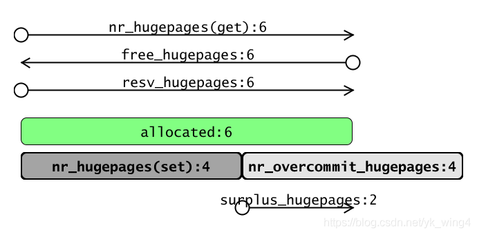

---

```
# [合计用了 6 个`HugePages`. 并且已经读写]
grep . -r /sys/kernel/mm/hugepages/
>	/sys/kernel/mm/hugepages/hugepages-2048kB/nr_hugepages:6
>	/sys/kernel/mm/hugepages/hugepages-2048kB/nr_overcommit_hugepages:4
>	/sys/kernel/mm/hugepages/hugepages-2048kB/free_hugepages:0
>	/sys/kernel/mm/hugepages/hugepages-2048kB/resv_hugepages:0
>	/sys/kernel/mm/hugepages/hugepages-2048kB/surplus_hugepages:2
>	/sys/kernel/mm/hugepages/hugepages-2048kB/nr_hugepages_mempolicy:6

grep . -r /sys/devices/system/node/node*/hugepages/
>	/sys/devices/system/node/node0/hugepages/hugepages-2048kB/nr_hugepages:6
>	/sys/devices/system/node/node0/hugepages/hugepages-2048kB/free_hugepages:0
>	/sys/devices/system/node/node0/hugepages/hugepages-2048kB/surplus_hugepages:2
```

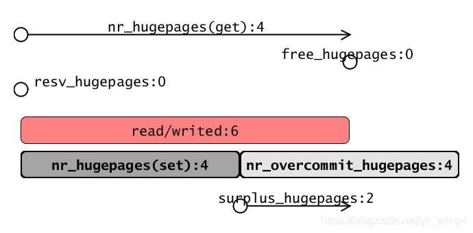

# 6. 使用方法

## 6.1. 配置

方式一: 通过在 bootargs 传参在系统启动过程中预留大页.

bootargs 参数: 预分配大页数量 hugepages= 和 预分配大页的大小 hugepagesz= , 更详细的使用可参看内核文档 kernel-parameters.txt

方法一相对于方法二的优点是开机时就通过 bootmem 分配大页, 不存在因为内存碎片导致分不出大页的情况, 从而保证预留的成功性.

方式二: 通过 sysfs 下的文件节点申请和释放大页

```
echo 5 > /sys/kernel/mm/hugepages/hugepages-2048kB/nr_hugepages
```

含义: 保持系统中 2MB 的大页有 5 个. 若已经存在 5 个大页则什么都不做; 若少于 5 个则分配够 5 个; 若多于 5 个则释放多余的大页(前提是未被使用).

```
echo 5 > /sys/devices/system/node/node[0-9]*/hugepages/hugepages-2048kB/nr_hugepages
```

含义: 在指定的 numa node 上分配 5 个指定大小(2MB)的大页.

```
cat /sys/kernel/mm/hugepages/hugepages-2048kB/free_hugepages
```

含义: 查看系统中空闲的的 2MB 大页的数量

## 6.2. 内存映射

内存映射, 简而言之就是将**内核空间**的**一段内存区域**映射到**用户空间**. 映射成功后, 用户对**这段内存区域的修改**可以直接反映到**内核空间**, 同时, 内核空间对这段区域的修改也**直接反映用户空间**. 那么对于内核空间与用户空间两者之间需要大量数据传输等操作的话效率是非常高的. 当然, 也可以将**内核空间**的一段内存区域**同时映射**到**多个进程**, 这样还可以实现**进程间的共享内存通信**.

### 6.2.1. mmap() 函数

用户空间 `mmap()` 函数

```
void *mmap(void *start, size_t length, int prot, int flags,int fd, off_t offset)
```

* start: 用户进程中要映射的**用户空间**的**起始地址**, 通常为 NULL(由**内核来指定**)
* length: 要映射的内存区域的大小
* prot: 期望的内存保护标志
* flags: 指定映射对象的类型
* fd: 文件描述符(由 open 函数返回), 表示这个是一个**文件映射**, fd 是打开**文件的句柄**.
* offset: 设置在内核空间中已经分配好的的内存区域中的偏移, 例如文件的偏移量, 大小为 PAGE_SIZE 的整数倍
* 返回值: mmap() 返回被映射区的指针, 该指针就是需要映射的内核空间在用户空间的**虚拟地址**

参数 fd 可以看出 mmap 映射是否和文件相关联, 因此在 Linux 内核中**映射**可以分成**匿名映射**和**文件映射**.

- **匿名映射**: 没有文件支持的内存映射, 把**物理内存**映射到**进程的虚拟地址空间**, 没有数据源, 这种映射的**内存区域的内容会被初始化为 0**.

- **文件映射**: 映射和实际文件相关联, 通常是把**文件的内容**映射到**进程地址空间**, 这样**应用程序**就可以像**操作进程地址空间**一样**读写文件**.

### 6.2.2. mmap、SYSV 共享内存异同

mmap 有名和匿名, 以及 SysV 共享内存都使用内核中 HugePage.

有名 mmap 需要借助 hugetlbfs 文件系统; 匿名 mmap 和 SysV 共享内存只需要使用特殊标志位(`MAP_HUGETLB/SHM_HUGETLB`).

有名 mmap 和 SYSV 共享内存都可以跨进程访问; 匿名 mmap 只能本进程访问.

### 6.2.3. 匿名映射

```
#define MAP_LENGTH (10 * 1024 * 1024)
addr = mmap(0, MAP_LENGTH, PROT_READ | PROT_WRITE, MAP_ANONYMOUS | MAP_HUGETLB, -1, 0);
```

创建**匿名的大页映射**, 代码参见 `tools/testing/selftests/vm/map_hugetlb.c`

---

mmap 匿名映射: `mmap.anonymous.c`

输出:

```
Returned address is 0x7ff600200000
First hex is 0
First hex is 3020100
```

查看进程的 maps 如下:

```
...
7ff600200000-7ff610200000 rw-p 00000000 00:0f 10940472                   /anon_hugepage (deleted)
...
```

### 6.2.4. 基于文件的映射

创建**基于文件的大页映射**, 代码参见 `tools/testing/selftests/vm/hugepage-mmap.c`

---

附件 `mmap.fs.c`

输出:

```
Returned address is 0x7f2d8ba00000
First hex is 0
First hex is 3020100
```

查看进程 maps 如下:

```
...
7f2d8ba00000-7f2d9ba00000 rw-s 00000000 00:9b 10940003                   /home/al/hugepage/huge/hugepagefile
...
```

查看文件系统:

```
-rwxr-xr-x 1 root root 258M 11 月 29 23:06 hugepagefile
```

#### 6.2.4.1. 挂载 hugetlbfs

1. 首先管理员需要在**某个目录**下**挂载 hugetlbfs 文件系统**:

```
mount -t hugetlbfs \
-o uid=<value>,gid=<value>,mode=<value>,pagesize=<value>,size=<value>, \
min_size=<value>,nr_inodes=<value> none <目录>
```

各选项的意思如下.

(1) 选项 uid 和 gid 指定**文件系统的根目录**的**用户**和**组**, 默认取**当前进程的用户和组**.

(2) 选项 mode 指定文件系统的根目录的模式, 默认值是 0755.

(3) 如果**平台支持多种大页长度**, 可以使用选项 pagesize 指定大页长度和关联的大页池. 如果不使用选项 pagesize, 表示使用**默认的大页长度**.

(4) 选项 size 指定允许文件系统使用的**大页**的**最大数量**. 如果不指定选项 size, 表示没有限制.

(5) 选项 `min_size` 指定允许文件系统使用的**大页**的**最小数量**. 挂载文件系统的时候, 申请大页池为这个文件系统**预留**选项 `min_size` 指定的大页数量. 如果不指定选项`min_size`, 表示没有限制.

(6) 选项 `nr_inodes` 指定文件系统中文件(一个文件对应一个索引节点) 的最大数量. 如果不指定选项 nr_inodes, 表示没有限制.

#### 6.2.4.2. 创建文件和创建内存映射

假设在**目录** "`/mnt/huge`" 下**挂载**了 **hugetlbfs** 文件系统, **应用程序**在 hugetlbfs 文件系统中**创建文件**, 然后**创建基于文件的内存映射**, 这个内存映射就会使用大页.

```
#define MAP_LENGTH (10 * 1024 * 1024)
fd = open("/mnt/huge/test", O_CREAT | O_RDWR, S_IREXU);
addr = mmap(0, MAP_LENGTH, PROT_READ | PROT_WRITE, MAP_SHARED, fd, 0);
```

> 两个进程针对同一个文件创建共享的内存映射, 实现共享内存.

### 6.2.5. shm

参见文件 `shm.1.c`

初始化并查看系统的 hugepages 信息

```
# 整个系统使用情况
# cat /proc/meminfo | grep -i huge
AnonHugePages:    196608 kB
ShmemHugePages:        0 kB
FileHugePages:         0 kB
HugePages_Total:      10
HugePages_Free:       10
HugePages_Rsvd:        0
HugePages_Surp:        0
Hugepagesize:       2048 kB
Hugetlb:           20480 kB

# 整个系统设置情况
# grep . /proc/sys/vm/*huge*
/proc/sys/vm/hugetlb_shm_group:0
/proc/sys/vm/nr_hugepages:10
/proc/sys/vm/nr_hugepages_mempolicy:10
/proc/sys/vm/nr_overcommit_hugepages:4

# 整个系统不同 size 的设置情况
# grep . -r /sys/kernel/mm/hugepages/
/sys/kernel/mm/hugepages/hugepages-2048kB/free_hugepages:10
/sys/kernel/mm/hugepages/hugepages-2048kB/resv_hugepages:0
/sys/kernel/mm/hugepages/hugepages-2048kB/surplus_hugepages:0
/sys/kernel/mm/hugepages/hugepages-2048kB/nr_hugepages_mempolicy:10
/sys/kernel/mm/hugepages/hugepages-2048kB/nr_hugepages:10
/sys/kernel/mm/hugepages/hugepages-2048kB/nr_overcommit_hugepages:4
/sys/kernel/mm/hugepages/hugepages-1048576kB/demote_size:2048kB
/sys/kernel/mm/hugepages/hugepages-1048576kB/free_hugepages:0
/sys/kernel/mm/hugepages/hugepages-1048576kB/resv_hugepages:0
/sys/kernel/mm/hugepages/hugepages-1048576kB/surplus_hugepages:0
/sys/kernel/mm/hugepages/hugepages-1048576kB/nr_hugepages_mempolicy:0
grep: /sys/kernel/mm/hugepages/hugepages-1048576kB/demote: Permission denied
/sys/kernel/mm/hugepages/hugepages-1048576kB/nr_hugepages:0
/sys/kernel/mm/hugepages/hugepages-1048576kB/nr_overcommit_hugepages:0

-----------------------------------

# 不同 node 的设置情况
# grep . -r /sys/devices/system/node/node*/hugepages/
/sys/devices/system/node/node0/hugepages/hugepages-2048kB/free_hugepages:5
/sys/devices/system/node/node0/hugepages/hugepages-2048kB/surplus_hugepages:0
/sys/devices/system/node/node0/hugepages/hugepages-2048kB/nr_hugepages:5
/sys/devices/system/node/node0/hugepages/hugepages-1048576kB/demote_size:2048kB
/sys/devices/system/node/node0/hugepages/hugepages-1048576kB/free_hugepages:0
/sys/devices/system/node/node0/hugepages/hugepages-1048576kB/surplus_hugepages:0
grep: /sys/devices/system/node/node0/hugepages/hugepages-1048576kB/demote: Permission denied
/sys/devices/system/node/node0/hugepages/hugepages-1048576kB/nr_hugepages:0
/sys/devices/system/node/node1/hugepages/hugepages-2048kB/free_hugepages:5
/sys/devices/system/node/node1/hugepages/hugepages-2048kB/surplus_hugepages:0
/sys/devices/system/node/node1/hugepages/hugepages-2048kB/nr_hugepages:5
/sys/devices/system/node/node1/hugepages/hugepages-1048576kB/demote_size:2048kB
/sys/devices/system/node/node1/hugepages/hugepages-1048576kB/free_hugepages:0
/sys/devices/system/node/node1/hugepages/hugepages-1048576kB/surplus_hugepages:0
grep: /sys/devices/system/node/node1/hugepages/hugepages-1048576kB/demote: Permission denied
/sys/devices/system/node/node1/hugepages/hugepages-1048576kB/nr_hugepages:0

# 不同 node 的使用情况
# grep Huge /sys/devices/system/node/node*/meminfo
/sys/devices/system/node/node0/meminfo:Node 0 AnonHugePages:     57344 kB
/sys/devices/system/node/node0/meminfo:Node 0 ShmemHugePages:        0 kB
/sys/devices/system/node/node0/meminfo:Node 0 FileHugePages:        0 kB
/sys/devices/system/node/node0/meminfo:Node 0 HugePages_Total:     5
/sys/devices/system/node/node0/meminfo:Node 0 HugePages_Free:      5
/sys/devices/system/node/node0/meminfo:Node 0 HugePages_Surp:      0
/sys/devices/system/node/node1/meminfo:Node 1 AnonHugePages:    143360 kB
/sys/devices/system/node/node1/meminfo:Node 1 ShmemHugePages:        0 kB
/sys/devices/system/node/node1/meminfo:Node 1 FileHugePages:        0 kB
/sys/devices/system/node/node1/meminfo:Node 1 HugePages_Total:     5
/sys/devices/system/node/node1/meminfo:Node 1 HugePages_Free:      5
/sys/devices/system/node/node1/meminfo:Node 1 HugePages_Surp:      0
```

在执行过程中可以查看系统信息.

---

`tools/testing/selftests/vm/hugepage-shm.c`

---

附件: `shm.2.c`

执行结果如下:

```
shmid: 32407590
shmaddr: 0x7f1fc2c00000
Starting the writes:
................................................................................................................................................................................................................................................................
Starting the Check...Done.
```

查看进程 maps 如下:

```
...
7f1fc2c00000-7f1fd2c00000 rw-s 00000000 00:0f 32407590                   /SYSV12345678 (deleted)
...
```

共享内存使用情况如下:

```
------ Shared Memory Segments --------
key        shmid      owner      perms      bytes      nattch     status
...
0x12345678 32407590   root       600        268435456  1
```

### 6.2.6. hugetlbfs 库

源码: https://github.com/libhugetlbfs/libhugetlbfs

**应用程序**可以使用**开源**的 **hugetlbfs 库**, 这个库**对 hugetlbfs 文件系统做了封装**.

使用 hugetlbfs 库的好处如下:

(1) **启动程序**时使用**环境变量** "`LD_PRELOAD=libhugetlbfs.so`" 把 **hugetlbfs 库**设置成优先级最高的**动态库**, `malloc()` **使用大页**, 对应用程序完全透明, **应用程序不需要修改代码**.

(2) 可以把代码段、数据段和未初始化数据段都放在大页中.

《HOWTO》对 libhugetlbfs 做了详细介绍:

1. 通过 libhugetlbfs 对使用 hugetlbfs 提供了一套方便的应用程序接口; 使用 libhugetblfs 替代目前库中 malloc()函数, 使内存分配在 HugePage 上进行; libhugetlbfs 能使进程 test/data/bss 段在 HugePage 上分配.
2. 支持 libhugetlbfs 的硬件、内核、工具链、配置.
3. 如何编译安装 libhugetlbfs.
4. 如何使用 libhugetlbfs: 替代 malloc()、共享内存、进程 text/data/bss 段.

安装 libhugetlgfs:

```
sudo apt-get install libhugetlbfs libhugetlbfs-tests
```

建立挂载点:

```
sudo mount none /home/al/hugepage/huge -t hugetlbfs
```

使用 hugeadm 查看挂载情况:

```
hugeadm --list-all-mounts:
libhugetlbfs: ERROR: Line too long when parsing mounts
Mount Point            Options
/dev/hugepages         rw,relatime,pagesize=2M
/home/al/hugepage/huge rw,relatime,pagesize=2M
hugeadm --pool-list:
libhugetlbfs: ERROR: Line too long when parsing mounts
      Size  Minimum  Current  Maximum  Default
   2097152      512      512      512        *
1073741824        0        0        0
```

使用如下脚本进行测试:

```
sudo /usr/lib/libhugetlbfs/tests/run_tests.py
```

执行结果:

```
run_tests.py: The 32 bit word size is not compatible with 2M pages
zero_filesize_segment (2M: 64):    PASS
test_root (2M: 64):    PASS
meminfo_nohuge (2M: 64):    PASS
gethugepagesize (2M: 64):    PASS
gethugepagesizes (2M: 64):    PASS
HUGETLB_VERBOSE=1 empty_mounts (2M: 64):    PASS
HUGETLB_VERBOSE=1 large_mounts (2M: 64):    PASS
find_path (2M: 64):    PASS
unlinked_fd (2M: 64):    PASS
readback (2M: 64):    PASS
truncate (2M: 64):    PASS
shared (2M: 64):    PASS
mprotect (2M: 64):    PASS
mlock (2M: 64):    PASS
misalign (2M: 64):    PASS
ptrace-write-hugepage (2M: 64):    PASS
icache-hygiene (2M: 64):    PASS
slbpacaflush (2M: 64):    PASS (inconclusive)
straddle_4GB_static (2M: 64):    PASS
huge_at_4GB_normal_below_static (2M: 64):    PASS
huge_below_4GB_normal_above_static (2M: 64):    PASS
map_high_truncate_2 (2M: 64):    PASS
misaligned_offset (2M: 64):    PASS (inconclusive)
truncate_above_4GB (2M: 64):    PASS
brk_near_huge (2M: 64):    brk_near_huge: malloc.c:2401: sysmalloc: Assertion `(old_top == initial_top (av) && old_size == 0) || ((unsigned long) (old_size) >= MINSIZE && prev_inuse (old_top) && ((unsigned long) old_end & (pagesize - 1)) == 0)' failed.
...
```

# 7. 实现原理

## 7.1. 大页池 struct hstate

在内核中有一个全局的大页内存池, 它管理着系统上所有节点上的、各种大小的、已使用的、未使用的大页. 当池中的页面不够时, 则会通过系统分配大页填充池子, 当池中的页面盈余(盈余的概念见我下面对 surplus_huge_pages 的注释)时, 则会从池子中释放一部分的空闲页面.

大页池的**数据结构**是结构体 `hstate`.

```cpp
struct hstate {
        int next_nid_to_alloc;
        int next_nid_to_free;
        unsigned int order;
        unsigned long mask;
        unsigned long max_huge_pages;
        //系统中全部的大页数量, 包含 surplus 页面, sysfs 下同名节点就是控制它的
        unsigned long nr_huge_pages;
        //系统中未被使用的大页数量, 也包含 resv_huge_pages 的页面
        unsigned long free_huge_pages;
        //应用程序已经 mmap 的大页数量, 未读写, 即未分配实际物理页. 但是这些 pages 也已经不可被别人用了.
        unsigned long resv_huge_pages;
        /*系统中超过 nr_huge_pages 的大页数量, 可以超分的数量被/proc/sys/vm/nr_overcommit_hugepages 控制,
        若 nr_huge_pages 被改小了, 但是页面仍 in-use, 结果就是 nr_huge_pages 不变, 而增加 surplus_huge_pages
        的数量, 以至于 shrink 的时候会根据 surplus_huge_pages 释放已经不用的页面. */
        unsigned long surplus_huge_pages;
    	//它控制着 surplus_huge_pages 的最大值.
        unsigned long nr_overcommit_huge_pages;
        struct list_head hugepage_activelist;
        struct list_head hugepage_freelists[MAX_NUMNODES];
        unsigned int nr_huge_pages_node[MAX_NUMNODES];
        unsigned int free_huge_pages_node[MAX_NUMNODES];
        unsigned int surplus_huge_pages_node[MAX_NUMNODES];
        char name[HSTATE_NAME_LEN];
};
```

大页池的数据结构 hstate 的主要成员如下表所示.

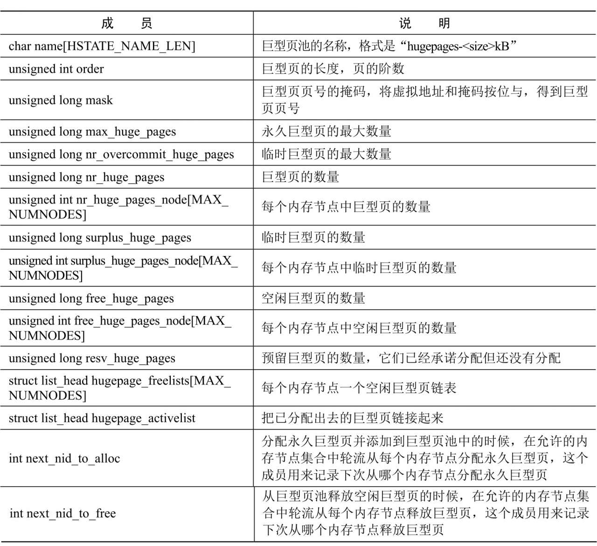

有的**处理器架构**支持多种大页长度, **一种大页长度**对应**一个大页池**.

有一个**默认的大页长度**, 默认**只创建**大页长度是**默认长度的大页池**. 例如 ARM64 架构在页长度为 4KB 的时候支持的大页长度是 1GB、32MB、2MB 和 64KB, **默认的大页长度**是**2MB**, 默认只创建大页长度是 2MB 的**大页池**.

如果需要**创建**大页长度**不是默认长度的大页池**, 可以在引导内核时指定**内核参数** "`hugepagesz=<size>[kKmMgG]`", 长度必须是处理器支持的长度. 可以使用内核参数 "`default_hugepagesz=<size>[kKmMgG]`" 选择默认的大页长度.

```cpp
// mm/hugetlb.c
int hugetlb_max_hstate __read_mostly;
unsigned int default_hstate_idx;
struct hstate hstates[HUGE_MAX_HSTATE];
```

* 全局数组 **hstates** 是**大页池数组**
* 全局变量 `hugetlb_max_hstate` 是**大页池的数量**
* 全局变量 `default_hstate_idx` 是**默认大页池**的**索引**.

**大页池**中的**大页**分为两种.

1) **永久大页**: 永久大页是保留的, 不能有其他用途, **被预先分配到大页池**, 当**进程释放**永久大页的时候, 永久大页被归还到**大页池**.

2) **临时大页**: 也称为**多余的**(`surplus`) 大页, 当永久大页用完的时候, 可以从**页分配器**分配**临时大页**; 进程释放临时大页的时候, **直接释放到页分配器**. 当设备长时间运行后, 内存可能碎片化, 分配临时大页可能失败.

**复合页面**(`compound page`): 复合页面是由两个及以上的**连续普通页面**组成, 与伙伴系统分配出的 `order-N` 的连续页面相比, 复合页面的 meta data 不太一样. 复合页面的**第一个页面**称之为**head page**, **剩下的 pages**称为**tail page**. tail page 中的**第一个 page**的`struct page`又和剩下的 tail page 中的元数据不太一样, 但是所有的 tail page 的 struct page 中的 **mapping 指针**都会指向 **head page**的 **struct page**, 这样就可以通过**任何一个 tail page**找到 head page 了. 具体细节读者可以查看内核源码中 struct page 里的 compound page 部分的定义.

huge page 与 gigantic page 的区别: 页面大小小于 MAX_ORDER 的大页称之为 huge page, 大于等于 MAX_ORDER 的大页称之为 gigantic page, 拿常用的举例, 2MB 是 huge page, 1GB 是 gigantic page. huge page 和 gigantic page 走的是不同的分配路径. huge page 相对较小, 所以通过伙伴系统来分配(注意: 虽然走伙伴系统, 但最终它的元数据设置和普通伙伴系统页面的设置是分开处理的), 而 gigantic page 页面较大, 伙伴系统无法满足分配要求, 所以通过连续内存分配接口 `alloc_contig_range()`(没错, CMA 内存也走这里

大页内存的状态: head page 的 `page.private` 中存放了当前大页的状态. 共四种状态, 如下:

```cpp
HPG_restore_reserve //当大页被用户用 mmap 申请了, 但并未实际使用前, 会处于此状态
HPG_migratable      //若此大页支持迁移, 分配出来时会被设置此标志
HPG_temporary       //临时从伙伴系统中分配出的大页, 典型的应用是作为 migration 的 target page.
                    //后文释放大页的流程中会对它进行判断.
HPG_freed           //当页面为空闲是会被挂载 free list 上, 同时设置此 flag
```

## 7.2. 预先分配永久大页

预先分配指定数量的永久大页到大页池中有两种方法.

1) 最可靠的方法是在**引导内核**时指定**内核参数** "`hugepages=N`" 来分配永久大页, 因为内核初始化的时候**内存还没有碎片化**.

有些处理器架构支持多种大页长度. 如果要分配特定长度的大页, 必须在内核参数 "hugepages" 前面添加选择大页长度的参数
"`hugepagesz=<size>[kKmMgG]`".

2) 通过文件 "`/proc/sys/vm/nr_hugepages`" 指定默认长度的永久大页的数量.

### 7.2.1. 内核参数 hugepages

> hugepagesz=2M hugepages=N hugepagesz=1G hugepages=N

> 1. 会先解析 hugepagesz, 再解析 hugepages, 没有 sz, pages 就是默认 sz 的; 不同 size 的都会调用
>
> 内核参数 "`hugepagesz=N`" 的处理函数是 `hugepagesz_setup`, 核心是调用 `hugetlb_add_hstate(ilog2(size) - PAGE_SHIFT)`, **初始化相应 size 的 hstate**.
>
> 2. 针对 1G 大页从 bootmem 中提前分配内存

由于 `__setup()` 在 `initcall()` 之前执行, 所以下面的命令都在 `hugetlb_init()` 之前执行.

内核参数 "`hugepages=N`" 的处理函数是 `hugetlb_nrpages_setup`, 其代码如下:

```cpp
// mm/hugetlb.c
1   static int __init hugetlb_nrpages_setup(char *s)
2   {
3    unsigned long *mhp;
4    static unsigned long *last_mhp;
5
6    if (!parsed_valid_hugepagesz) {
7         pr_warn("hugepages = %s preceded by "
8               "an unsupported hugepagesz, ignoring\n", s);
9         parsed_valid_hugepagesz = true;
10        return 1;
11   }
12   /*
13    * "! hugetlb_max_hstate"意味着没有解析一个"hugepagesz="参数,
14    * 所以这个"hugepages="参数对应默认的大页池.
15    */
16   else if (!hugetlb_max_hstate)
17        mhp = &default_hstate_max_huge_pages;
18   else
19        mhp = &parsed_hstate->max_huge_pages;
20
21   if (mhp == last_mhp) {
22        pr_warn("hugepages= specified twice without interleaving hugepagesz=,
	ignoring\n");
23        return 1;
24   }
25
26   if (sscanf(s, "%lu", mhp) <= 0)
27        *mhp = 0;
28
29   if (hugetlb_max_hstate && parsed_hstate->order >= MAX_ORDER)
30        hugetlb_hstate_alloc_pages(parsed_hstate);
31
32   last_mhp = mhp;
33
34   return 1;
35  }
36  __setup("hugepages=", hugetlb_nrpages_setup);
```

第 6~10 行代码, 如果**前一个内核参数** "`hugepagesz=`" 指定的**大页长度**是**非法**的, 直接返回.

第 16 行和第 17 行代码, 如果前面**没有内核参数** "`hugepagesz=`", 那么内核参数 "`hugepages=`" 指定的是**默认大页池**的永久大页的**数量**.

第 18 行和第 19 行代码, 如果前面有内核参数 "`hugepagesz=`" 指定**大页长度**, 那么内核参数 "`hugepages=`" 指定**该大小大页**对应的大页池的永久大页的**数量**.

第 26 行代码, 解析并保存内核参数 "`hugepagesz=`" 的值.

第 29 行和第 30 行代码, 如果前面有内核参数 "`hugepagesz=`" 指定大页长度, 并且**大页长度**超过**页分配器**支持的**最大阶数**, 那么需要从**引导内存分配器**分配大页. 如果**大页长度小于页分配器支持的最大阶数**, 那就在**大页子系统初始化**的时候从**页分配器**分配大页.

> 这里并**没有**针对大页长度 order 小于页分配器 order(11, 2M) 这种情况分配页面

函数 `hugetlb_hstate_alloc_pages` 负责**预先分配**指定数量的永久大页, 其代码如下:

```cpp
// mm/hugetlb.c
1   static void __init hugetlb_hstate_alloc_pages(struct hstate *h)
2   {
3    unsigned long i;
4
5    for (i = 0; i < h->max_huge_pages; ++i) {
6         if (hstate_is_gigantic(h)) {
7               if (!alloc_bootmem_huge_page(h))
8                    break;
9         } else if (!alloc_fresh_huge_page(h,
10                          &node_states[N_MEMORY]))
11              break;
12   }
13   h->max_huge_pages = i;
14  }
```

第 6 行和第 7 行代码, 如果**大页长度超过页分配器支持的最大阶数**, 那么从**引导内存分配器**分配大页.

第 9 行代码, 如果**大页长度小于或等于页分配器支持的最大阶数**, 那么从**页分配器**分配大页.

函数 `alloc_bootmem_huge_page` 负责从**引导内存分配器**分配大页, 其代码如下:

```cpp
// mm/hugetlb.c
1   int __weak alloc_bootmem_huge_page(struct hstate *h)
2   {
3    struct huge_bootmem_page *m;
4    int nr_nodes, node;
5
6    for_each_node_mask_to_alloc(h, nr_nodes, node, &node_states[N_MEMORY]) {
7         void *addr;
8
9         addr = memblock_virt_alloc_try_nid_nopanic(
10                   huge_page_size(h), huge_page_size(h),
11                   0, BOOTMEM_ALLOC_ACCESSIBLE, node);
12        if (addr) {
13              m = addr;
14              goto found;
15        }
16   }
17   return 0;
18
19   found:
20    BUG_ON(! IS_ALIGNED(virt_to_phys(m), huge_page_size(h)));
21    /* 先把它们放到私有链表中, 因为 mem_map 还没准备好 */
22    list_add(&m->list, &huge_boot_pages);
23    m->hstate = h;
24    return 1;
25   }
```

第 9 行代码, 从内存节点分配**大页**.

第 22 行代码, 把大页添加到**链表** `huge_boot_pages` 中.

### 7.2.2. HugePage 分配器初始化

> 不是 hugetlbfs 文件系统
>
> 初始化所有大小的 hstate: 初始化 空闲大内存页链表; 针对 2M 大页从页分配器分配内存并初始化; 将大页放到空闲链表; 初始化前面 1G (bootmem) 大页并添加到空闲链表

`hugetlb_init()` 是 Huge Page 初始化入口, 属于 `subsys_initcall()`, 在 `arch_initcall()` 之后, `fs_initcall()` 之前.

HugePages 分配器初始化的调用链为:

```cpp
hugetlb_init()
 ├─ hugetlb_add_hstate(HUGETLB_PAGE_ORDER); // 添加一个大页池 hstate(确保 HPAGE_SIZE 的 hstate 存在), hugepagesz_setup 也会调用
 │  ├─ 	if (size_to_hstate(PAGE_SIZE << order)) { return; } // 一种 page size 的 hstate 只能有一个
 │  ├─ h = &hstates[hugetlb_max_hstate++]; // hstate 增加一个
 │  ├─ h->order = order;
 │  ├─ for(i < MAX_NUMNODES) { INIT_LIST_HEAD(&h->hugepage_freelists[i]); } // 初始化空闲大页链表
 │  ├─ INIT_LIST_HEAD(&h->hugepage_activelist);
 │  ├─ snprintf(h->name, HSTATE_NAME_LEN, "hugepages-%lukB", huge_page_size(h)/1024); // hstate 名字
 │  └─ hugetlb_vmemmap_init(h);
 ├─ hugetlb_init_hstates(); // 初始化所有的 hstates
 │  ├─ for_each_hstate(h) // 遍历所有 hstate
 │  ├─ hugetlb_hstate_alloc_pages(h); // 针对 2M 大页分配内存; 1G 的在之前 parse hugepages 时分配
 │  │  └─ alloc_pool_huge_page(); // 大页 size 小, 从页分配器分配
 │  │     ├─ alloc_fresh_huge_page();
 │  │     │  ├─ struct page *page = alloc_buddy_huge_page(); // 本质是调用__alloc_pages, 直接分配了一个大页(2M/1G), 一共有很多 page 结构体, 返回首个 page 结构体
 │  │     │  └─ prep_new_huge_page(h, page, page_to_nide(page)); // 所有大页都会调用其进行初始化
 │  │     │     ├─ INIT_LIST_HEAD(&page->lru);
; // page->lru 初始化
 │  │     │     ├─ set_compound_page_dtor(page, HUGETLB_PAGE_DTOR); // page[1].compound_dtor = HUGETLB_PAGE_DTOR, 对应的 destructor 函数是 free_huge_page
 │  │     │     ├─ hugetlb_set_page_subpool(page, NULL); // page[1].private=NULL
 │  │     │     ├─ set_hugetlb_cgroup(page, NULL); // 设置 page[2].private 为 NULL
 │  │     │     ├─ set_hugetlb_cgroup_rsvd(page, NULL); // 设置 page[3].private 为 NULL
 │  │     │     ├─ h->nr_huge_pages++; //
 │  │     │     └─ h->nr_huge_pages_node[nid]++; //
 │  │     └─ put_page(page); // 释放给 hugetlb allocator, 会调用上面的 destructor
 │  │        └─ __put_page(page);
 │  │           └─ __put_compound_page(page);
 │  │              └─ destroy_compound_page(page);
 │  │                 └─ compound_page_dtors[page[1].compound_dtor](page); // 调用 free_huge_page
 │  │                    └─ enqueue_huge_page(page); // 把大内存页放置到空闲大内存页链表中
 │  │                       ├─ list_move(&page->lru, &h->hugepage_freelists[nid]); // 把大内存页放置到空闲大内存页链表中
 │  │                       ├─ h->free_huge_pages++; // 增加计数器
 │  │                       └─ h->free_huge_pages_node[nid]++;
 │  └─ hugetlb_vmemmap_init(h);
 ├─ gather_bootmem_prealloc(); // 仅仅处理 bootmem 的大页
 │  ├─ 	list_for_each_entry(&huge_boot_pages) // 遍历 bootmem 的大页
 │  ├─ 	prep_compound_gigantic_page(page, huge_page_order(h)) //
 │  ├─ 	prep_new_huge_page(h, page, page_to_nide(page)); // 所有大页都会调用其进行初始化
 │  └─ put_page(page); // 把大内存页放置到空闲大内存页链表中
 ├─ report_hugepages(); // 输出当前系统支持的不同 Huge Page 大小以及分配页数
 ├─ hugetlb_sysfs_init(); // 在/sys/kernel/mm/hugepages 目录下针对不同大小的 Huge Paeg 创建目录
 ├─ hugetlb_register_all_nodes(); // 处理 NUMA 架构下不同 node 的 Huge Page
 └─ hugetlb_cgroup_file_init(); // 创建/sys/fs/cgroup/hugetlb 下节点: hugetlb.2MB.failcnt、hugetlb.2MB.limit_in_bytes、hugetlb.2MB.max_usage_in_bytes、hugetlb.2MB.usage_in_bytes
```

在内核初始化时, 会调用 `hugetlb_init` 函数对 HugePages 分配器进行初始化, 其实现如下:

```cpp
static int __init hugetlb_init(void)
{
    unsigned long i;

    // 1. 初始化空闲大内存页链表 hugepage_freelists,
    // 内核使用 hugepage_freelists 链表把空闲的大内存页连接起来,
    // 为了分析简单, 我们可以把 MAX_NUMNODES 当成 1
    for (i = 0; i < MAX_NUMNODES; ++i)
        INIT_LIST_HEAD(&hugepage_freelists[i]);

    // 2. max_huge_pages 为系统能够使用的大页内存的数量,
    // 由系统启动项 hugepages 指定,
    // 这里主要申请大内存页, 并且保存到 hugepage_freelists 链表中.
    for (i = 0; i < max_huge_pages; ++i) {
        if (!alloc_fresh_huge_page())
            break;
    }

    max_huge_pages = free_huge_pages = nr_huge_pages = i;

    return 0;
}
```

`hugetlb_init` 函数主要完成**两个工作**:

* 初始化**空闲大内存页链表** `hugepage_freelists[]`, 这个链表保存了系统中能够使用的大内存. 每个 NUMA node 一个链表.
* 为系统**申请空闲的大内存页**, 并且保存到 `hugepage_freelists[]` 链表中.

在 Hugetlb 大页支持中, 同时支持 2MiB 和 1Gig 粒度的大页, 大页的物理内存来自 Buddy 内存分配器分配的复合页, 从 buddy 中分配的大页是特殊复合页构成的大页, 其复合页的析构函数为 `HUGETLB_PAGE_DTOR`. `alloc_fresh_huge_page()` 函数的作用就是从 Buddy 分配器中分配物理大页, 其底层逻辑是: 函数首先调用 hstate_is_gigantic() 函数判断大页是 1Gig 的大页还是 2MiB 的大页, 如果是 1Gig 的大页, 函数调用 alloc_gigantic_page() 函数分配 1Gig 的物理内存; 反之如果 2MiB 的大页, 函数调用 alloc_buddy_huge_page() 函数分配 2MiB 的物理内存. 如果物理内存分配失败, 函数直接返回 NULL; 反之分配成功, 此时大页是 1Gig 的大页, 那么函数调用 prep_compound_gigantic_page() 函数初始化 1Gig 的大页. 函数最后调用 prep_new_huge_page() 函数初始化大页.

分析下 `alloc_fresh_huge_page` 函数是怎么**申请大内存页**的, 其实现如下:

```cpp
static int alloc_fresh_huge_page(void)
{
    static int prev_nid;
    struct page *page;
    int nid;
    ...
    // 1. 申请一个大的物理内存页...
    page = alloc_pages_node(nid, htlb_alloc_mask|__GFP_COMP|__GFP_NOWARN,
                            HUGETLB_PAGE_ORDER);

    if (page) {
        // 2. 设置释放大内存页的回调函数为 free_huge_page
        set_compound_page_dtor(page, free_huge_page);
        ...
        // 3. put_page 函数将会调用上面设置的 free_huge_page 函数把内存页放入到空闲大页链表中
        // put_page 意思是将 page 从 buddy 中释放
        put_page(page);

        return 1;
    }

    return 0;
}
```

所以, `alloc_fresh_huge_page` 函数主要完成三个工作:

* 调用 `alloc_pages_node` 函数**申请一个大内存页**(2MB).
* 设置大内存页的**释放回调函数**为 `free_huge_page`, 当释放大内存页时, 将会调用这个函数进行释放操作.
* 调用 `put_page` 函数**从 buddy 中释放大内存页**, 其将会调用 `free_huge_page` 函数进行相关操作.

接口: put_page()

此接口既可以用来释放 order-0 的页面, 也可以用来释放各种复合页面, 包括普通复合页面、大页、透明大页.

原理: 回看分配大页的流程中, 在设置大页元数据时 `prep_new_huge_page()` -> `set_compound_page_dtor()` 会去初始化大页的析构函数. 而在 put_page() 中, 若大页的 `refcount==0` 时, 则会去调用它的析构函数.

实现: 对大页中的任何一个页面执行 put_page() 最后都是对`page[0]`(即 head page) 的 refcount 减 1, 当 refcount 为 0 时会去调用大页的析构函数去释放大页.

```cpp
put_page
  __put_page  		    //若此次减 1 后 refcount 为 0, 则接着下面的步骤
    __put_single_page	    //普通的 order-0 页面走这里
    __put_compound_page	    //复合页面走这里
      __page_cache_release  //若是 THP 的话先做处理下它的 page[0].lru, 普通大页不需要
      destroy_compound_page //调用复合页面的对应的析构函数 page[1].compound_dtor. 内存回收时也可能调析构函数用来回收 compound page
        free_compound_page  //普通复合页的释放
        free_huge_page      //静态大页的释放, 接下来详细介绍它
        free_transhuge_page //透明大页的释放
```

核心实现:

由于 put_page()可以在中断中调用, 我们知道中断中是不允许特别耗时的操作的, 而释放一个可能达到若干 GB 的大页来说, 当然不会很迅速. 于是 `free_huge_page()` 中就添加了在中断里释放复合页面的额外处理, defer 到延时工作队列里去释放. 判断如下:

```cpp
free_huge_page
  if !in_task
	schedule_work(&free_hpage_work)  //中断中走 workqueue 推迟释放
           __free_huge_page              //workqueue 最终调__free_huge_page
  else
    __free_huge_page                     //进程上下文的话, 直接调__free_huge_page
```

`__free_huge_page()` 的流程

```cpp
__free_huge_page
  hugetlb_set_page_subpool
  page->mapping = NULL
  ClearHPageRestoreReserve
  hugepage_subpool_put_pages
  ClearHPageMigratable
  hugetlb_cgroup_uncharge_page
  hugetlb_cgroup_uncharge_page_rsvd
  if 情况 1: HPageTemporary      //该 hugepage 是 temporary 状态
    list_del(&page->lru)       //将该 hugepage 从 freelist 或 activelist 上直接移除
    update_and_free_page       //释放该 hugepage, 详见下文
  else if 情况 2: surplus_huge_pages_node //当前 node 上有 surplus 不为零
    list_del(&page->lru)                //将该 hugepage 从 freelist 或 activelist 上直接移除
    update_and_free_page                //释放该 hugepage, 详见下文
    h->surplus_huge_pages--		//减少 hstate 中 surplus 的页面和对应 node 的 surplus 的页面数量
    h->surplus_huge_pages_node[nid]--
  else 情况 3: hstate 池中的 page 总数无需改变
    enqueue_huge_page         //将页面加入大页内存池的 free list 上, 并设置页面状态为 HPG_freed


  update_and_free_page          //注意: 此时已经持有 hugetlb_lock 锁
    hstate                      //更新页面数量
    set_compound_page_dtor      //清空析构函数
    set_page_refcounted		//要被释放 head page 的 refcount 为 0, 此时置 1 用来后续释放页面使用
    if gigantic_page
      destroy_compound_gigantic_page //设置所有的 tail page 的 refcount 为 1, 释放时使用; 清空 head page 和 tail page 的成员
      free_gigantic_page             //逐页的释放掉所有的 page
    else buddy_page
  	  __free_pages   //huge page 的话直接走 buddy 释放. Tips: 普通的 order>0 的伙伴系统页面也走这里释放:free_pages->__free_pages
```

以前实现:

那么, 我们来看看 `free_huge_page` 函数是怎么释放大内存页的, 其实现如下:

```cpp
static void free_huge_page(struct page *page)
{
    ...
    enqueue_huge_page(page);     // 把大内存页放置到空闲大内存页链表中
    ...
}

static void enqueue_huge_page(struct page *page)
{
    int nid = page_to_nid(page); // 我们假设这里一定返回 0

    // 把大内存页添加到空闲链表 hugepage_freelists 中
    list_add(&page->lru, &hugepage_freelists[nid]);

    // 增加计数器
    free_huge_pages++;
    free_huge_pages_node[nid]++;
}
```

从上面的实现可知, `enqueue_huge_page` 函数只是简单的把**大内存页**添加到**空闲链表** `hugepage_freelists` 中, 并且增加计数器.

假如我们设置了系统能够使用的大内存页为 100 个, 那么空闲大内存页链表 `hugepage_freelists` 的结构如下图所示:

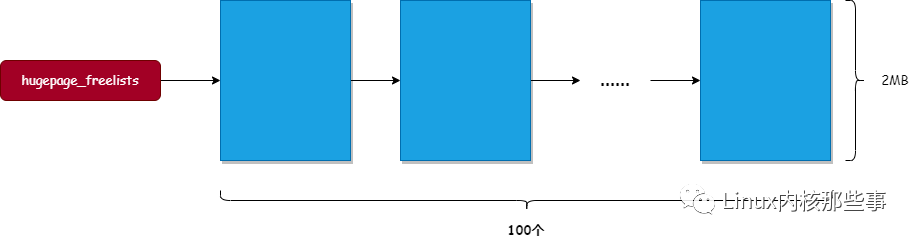

### 7.2.3. 写 nr_hugepages 文件

系统运行起来后, 可以通过 `/proc/sys/vm/nr_hugepages` 设置, 系统根据实际情况分配或释放 HugePages.

> 设置默认大小的大页池的 hugepage 数量:
>
> 当增加 `nr_hugepages`, 系统优先使用 surplus 中页面. 然后才会分配新的 Huge Page 来满足需求. 从页分配器分配大页, surplus 只是调整 hstate 属性
>
> 当减小 `nr_hugepages`, 导致使用中页面大于 `nr_hugepages` 时, 将**使用中的页面**转换成 surplus 页面
> 当减小 nr_hugepaes, 导致使用中页面大于 `nr_hugepages + nr_overcommit_hugepages` 时, 同样会将超出 `nr_hugepages` 的页面转成 surplus 页面. 直到 nr_hugepages + nr_overcommit_hugepages 足够大, 或者释放足够多的 surplus 页面, 否则不会继续申请 surplus 页面.

文件 "`/proc/sys/vm/nr_hugepages`" 的处理函数是 `hugetlb_sysctl_handler`, 最终调用函数 `set_max_huge_pages` 来**增加或减少永久大页**

```cpp
set_max_huge_pages
  ->alloc_pool_huge_page      //若大页内存池中大页不够, 则再分配一个新的大页放入大页内存池中.
    ->alloc_fresh_huge_page   //在指定的 node 上分配一个新的大页
      ->alloc_gigantic_page   //1GB 大页走这里. 基于 CONTIG_ALLOC 或 CMA 内存分配
      ->alloc_buddy_huge_page //2MB 大页走这里. 基于伙伴系统分配
      ->prep_compound_gigantic_page //元数据初始化. 若是 gigantic 页, 设置 first tail_page 的 order,并设置所有 tail_page 指向 head_page.
      ->prep_new_huge_page          //元数据初始化. 1.将 page[0]的 lru 指向自己 2.设置 hugetlb 的析构函数类型 3.设置 page[2]和 page[3]的相关 cgroup 成员 private 变量
      				    //3.拿大页内存池锁 hugetlb_lock, 并更新 hstate 中页面 numbers 以及 设置 page[0]的 private 的状态标志 HPG_freed
```

下面是具体 huge page 和 gigantic page 分配细节:

```cpp
alloc_gigantic_page   //1G 巨页
  ->cma_alloc                  //新加进来的 feature, 通过预留 hugetlb_cma 内存用以分配巨页.
    ->__alloc_contig_pages     //形参 MIGRATE_CMA.
  ->alloc_contig_pages         //若未开启 CONFIG_CMA 或 hugetlb_cma 中的内存用完了则走这里.
    ->1.根据 zonelist 逐个在 zone 上逐个取 1GB 的 pfn range.(注意两点: 1 先在当前 zonelist 上找, 找不到再根据 nodemask 换 zonelist 继续找; 2 migrate_movable 的 fallback 不包含 migrate_cma)
    ->2.找 contig page 需要在 zone 上 1GB 对齐, 然后通过 pfn_range_valid_contig()检查 pfn range 中的 page 是否可用, 不可用换下 1GB pageblock.
    ->3.__alloc_contig_pages   //形参 MIGRATE_MOVABLE. 原理和 memory compaction 一样. 详见下文大图

alloc_buddy_huge_page  //2MB 巨页
  ->__alloc_pages_nodemask
    ->get_page_from_freelist
      ->rmqueue
      ->prep_new_page
        ->post_alloc_hook    //页面基本信息的初始化. 第一个页面的 refcount 初始化为 1,private 初始化为 0. 若设置了 DEBUG_PAGEALLOC, 则检查 page 的 poison 并 unpoison
        ->prep_compound_page //元数据初始化. 第一个 page 设置 PG_head, refcount 保持 1. tail page 的 compound_head 指向 head 并 bit0 置 1, refcount 重置为 0.
        		     //设置 first tail 的 compound_dtor, 设置 first tail 的 compound_order, 设置 first tail 的 compound_nr 的页面总数
```

具体代码如下:

```cpp
// hugetlb_sysctl_handler() -> hugetlb_sysctl_handler_common() -> __nr_hugepages_store_common() -> set_max_huge_pages()
// mm/hugetlb.c
1   static unsigned long set_max_huge_pages(struct hstate *h, unsigned long count,
2                               nodemask_t *nodes_allowed)
3   {
4    unsigned long min_count, ret;
5
6    if (hstate_is_gigantic(h) && ! gigantic_page_supported())
7         return h->max_huge_pages;
8
9    spin_lock(&hugetlb_lock);
#    // 增加永久大页, 如果有 surplus page, 减少 surplug page 属性
10   while (h->surplus_huge_pages && count > persistent_huge_pages(h)) {
11        if (!adjust_pool_surplus(h, nodes_allowed, -1))
12              break;
13   }
14   // 增加永久大页, 分配大页
15   while (count > persistent_huge_pages(h)) {
16         spin_unlock(&hugetlb_lock);
17
18         /* 让出处理器, 避免死锁(soft lockup) */
19         cond_resched();
20         // 1G 大页
21         if (hstate_is_gigantic(h))
22               ret = alloc_fresh_gigantic_page(h, nodes_allowed);
23         else
24               ret = alloc_fresh_huge_page(h, nodes_allowed);
25         spin_lock(&hugetlb_lock);
#          // 上面分配成功会返回 1, 这里不会跳出
#          // 失败了才跳出去
26         if (!ret)
27               goto out;
28
29         /* 去处理信号, 用户可能按下 ctrl+c 组合键 */
30         if (signal_pending(current))
31               goto out;
32   }
33   // 上面分配大页成功也还是会执行这里的代码
34   min_count = h->resv_huge_pages + h->nr_huge_pages - h->free_huge_pages;
35   min_count = max(count, min_count);
36   try_to_free_low(h, min_count, nodes_allowed);
37   while (min_count < persistent_huge_pages(h)) {
38         if (!free_pool_huge_page(h, nodes_allowed, 0))
39               break;
40         cond_resched_lock(&hugetlb_lock);
41   }
42   while (count < persistent_huge_pages(h)) {
43         if (!adjust_pool_surplus(h, nodes_allowed, 1))
44               break;
45   }
46  out:
47   ret = persistent_huge_pages(h);
48   spin_unlock(&hugetlb_lock);
49   return ret;
50  }
```

参数 count 指定**永久大页**的**最大数量**.

第 10~32 行代码, 如果**增加永久大页**的数量, 处理如下:

* 第 10~13 行代码, 如果有**临时大页**, 那么**把临时大页转换为永久大页**. 这里**只是调整**了 `h->surplus_huge_pages` 和 `h->surplus_huge_pages_node[node]` 属性值, 下面的**分配大页代码**还是会执行.

```cpp
static int adjust_pool_surplus(struct hstate *h, nodemask_t *nodes_allowed,
				int delta)
{
	int nr_nodes, node;

	lockdep_assert_held(&hugetlb_lock);
	VM_BUG_ON(delta != -1 && delta != 1);

	if (delta < 0) {
		// 遍历 nodes_allowed 参数指定的 NUMA NODE,
		// 如果某个 node 的 h->surplus_huge_pages_node[node] 存在, 则确定有 surplus page
		for_each_node_mask_to_alloc(h, nr_nodes, node, nodes_allowed) {
			if (h->surplus_huge_pages_node[node])
				goto found;
		}
	} else {
		for_each_node_mask_to_free(h, nr_nodes, node, nodes_allowed) {
			if (h->surplus_huge_pages_node[node] <
					h->nr_huge_pages_node[node])
				goto found;
		}
	}
	return 0;

found:
	h->surplus_huge_pages += delta;
	h->surplus_huge_pages_node[node] += delta;
	return 1;
}
```

* 第`15~32`行代码, **分配大页**. 分配失败的话跳到 out 退出. 分配成功, **继续执行**.

第 34 行开始就是**减小永久大页的数量**的逻辑. (尽管增加永久大页逻辑也会执行到这里).

第 34 行代码, `min_count` 等于(**大页总数** − **空闲大页数量** + **预留大页数量** ), 即 `min_count` 等于以及(**分配出去的大页** + **已经预留的大页**), 可以理解为等于**已经被系统使用的大页**.

> 注意**预留大页数量**包含在空闲大页数量里面, 进程创建内存映射的时候已经申请预留大页, 当 write 才会真正分配.

第 35 行代码, `max(count, min_count)`, **设置值**和**已被使用值**两者取其大.

* 第 36 行代码, **如果支持高端内存区域**, 优先把从低端内存区域分配的**没有预留的空闲大页**归还给**页分配器**.

* 第 37~41 行代码, 如果**系统现有永久大页的数量**超过 `min_count`, 那么把**没有预留的空闲大页**归还给**页分配器**.

* 第 42~45 行代码, 如果**系统现有永久大页**的数量**超过指定的最大数量**, 那么**逐页**把**永久大页**转换为**临时大页**. 同样, 仅仅是调整了属性值.

以上我们可以看到 huge page 的分配走的是伙伴系统. gigantic page 走的是连续内存分配 `__alloc_contig_pages()`.

`__alloc_contig_pages()` 很重要, 涉及的知识点也较多, 这里画了一幅图来说明它的大体流程:

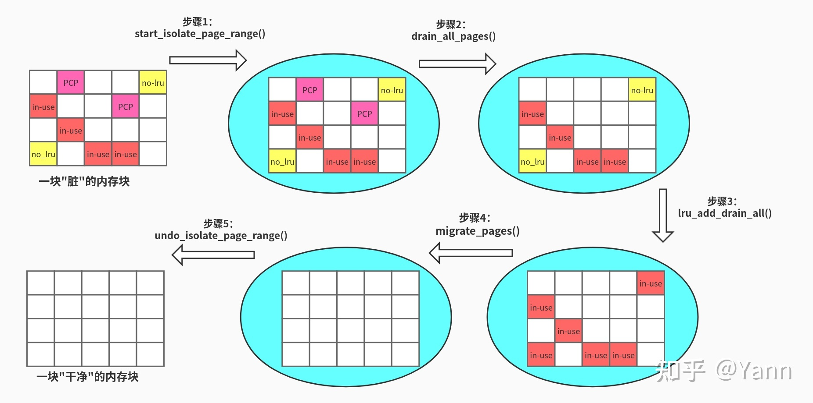

步骤 1: 将目标内存块(内存块的大小是 pageblock 整数倍, 你懂的, 因为内存的迁移属性是按 pageblock 划分的)的迁移属性标记为 `MIGRATE_ISOLATED`, 这样被标记的内存将不会被伙伴系统分配出去, 方便我们后续的迁移工作.

步骤 2: 将 PCP(per-cpu pages)的内存池清空, 即将页面归还给伙伴系统, 并临时关闭了 pcp 功能. ([mm, page_alloc: disable pcplists during memory offline](https://lkml.org/lkml/2020/10/8/359))

步骤 3: 将准备添加到 LRU 链表上, 却还未加入 LRU 的页面(即还待在 pagevec 中的页面)添加到 LRU 上(后面补篇 LRU 的文章, 待填坑). 这是为了后面 `migrate_page()` 迁移做准备, 因为 migrate_page() 需要从 LRU 链表上摘取待迁移的页面, 并 isolate(此 isolate 非迁移属性的 isolate)

步骤 4: 调用 `migrate_pages()`, 将已经有内容的页面(`in-use`)迁移出去. (参考之前的文章[Linux 内存管理: 页面迁移](https://zhuanlan.zhihu.com/p/270366827))

步骤 5: 跟步骤 1 反着来, 恢复内存块的迁移属性. 至此, 我们获得了一块干净且连续的内存.

## 7.3. 写超发 nr_overcommit_hugepages

>设置默认大小的大页池的**属性值**

其实只是设置了 `default_hstate->nr_overcommit_huge_pages` **属性值**, 并**不会预分配**

```cpp
// hugetlb_sysctl_handler() ->  hugetlb_overcommit_handler() ->  proc_hugetlb_doulongvec_minmax() ->  proc_doulongvec_minmax() ->  do_proc_doulongvec_minmax()
// mm/hugetlb.c
#ifdef CONFIG_SYSCTL
int hugetlb_overcommit_handler(struct ctl_table *table, int write,
		void *buffer, size_t *length, loff_t *ppos)
{
	struct hstate *h = &default_hstate;
	unsigned long tmp;
	int ret;

	if (!hugepages_supported())
		return -EOPNOTSUPP;

	tmp = h->nr_overcommit_huge_pages;

	if (write && hstate_is_gigantic(h))
		return -EINVAL;

	ret = proc_hugetlb_doulongvec_minmax(table, write, buffer, length, ppos,
					     &tmp);
	if (ret)
		goto out;

	if (write) {
		spin_lock_irq(&hugetlb_lock);
		h->nr_overcommit_huge_pages = tmp;
		spin_unlock_irq(&hugetlb_lock);
	}
out:
	return ret;
}
#endif /* CONFIG_SYSCTL */
```

## 7.4. 挂载 hugetlbfs 文件系统

> 关联大页池 hstate: super_block -> hugetlbfs_sb_info -> hugepage_subpool | hstate

hugetlbfs 文件系统在初始化的时候, 调用函数 `register_filesystem` 以注册 hugetlbfs 文件系统, hugetlbfs 文件系统的结构体如下:

```cpp
// fs/hugetlbfs/inode.c
static struct file_system_type hugetlbfs_fs_type = {
	.name          = "hugetlbfs",
	.mount         = hugetlbfs_mount,
	.kill_sb       = kill_litter_super,
};
```

挂载 hugetlbfs 文件系统的时候, 挂载函数调用 hugetlbfs 文件系统的挂载函数 `hugetlbfs_mount`, 创建**超级块**和**根目录**, 把**文件系统**和**大页池**关联起来.

如图 3.66 所示, **超级块** `super_block` 中:

* 成员 `s_fs_info` 指向 hugetblfs 文件系统的**私有信息**;
* 成员 `s_blocksize` 是**块长度**, 被设置为**大页的长度**.

图 3.66 hugetlbfs 文件系统关联大页池

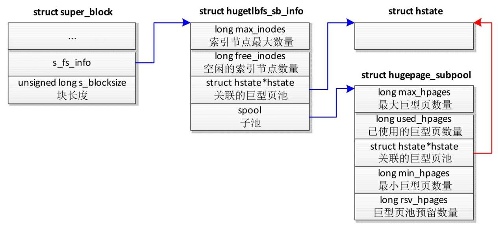

结构体 `hugetlbfs_sb_info` 描述 hugetblfs 文件系统的**私有信息**.

1) 成员 `max_inode` 是允许的**索引节点最大数量**.

2) 成员 `free_inodes` 是**空闲的索引节点数量**.

3) 成员 `hstate` 指向**关联的大页池**.

4) 如果指定了**最大大页数量**或**最小大页数量**, 那么为大页池创建一个**子池**, 成员 spool 指向**子池**.

结构体 `hugepage_subpool` 描述**子池的信息**.

1) 成员 `max_hpages` 是允许的最大大页数量.

2) `used_hpages` 是已使用的大页数量, 包括分配的和预留的.

3) 成员 `hstate` 指向大页池.

4) 成员 `min_hpages` 是最小大页数量.

5) 成员 `rsv_hpages` 是子池向大页池申请预留的大页的数量.

## 7.5. 创建文件

> 创建 inode; 设置 fops 为 `hugetlbfs_file_operations`, 核心是 `hugetlbfs_file_mmap()`

调用系统调用 `open()`, 在 hugetlbfs 文件系统的一个目录下创建一个文件的时候, 系统调用 open 最终调用函数 `hugetlbfs_create()` 为文件**分配索引节点**(结构体 `inode`) 并且初始化.

**索引节点**的成员 `i_fop` 指向 hugetlbfs 文件系统特有的**文件操作集合** `hugetlbfs_file_operations`, 这个文件操作集合的成员 **mmap** 方法是函数 `hugetlbfs_file_mmap()`, 这个函数在**创建内存映射**的时候很关键.

## 7.6. 创建内存映射

> 设置 VM_HUGETLB 标志位; 从 hstate 申请预留

在 hugetlbfs 文件系统中打开文件, 然后**基于这个文件创建内存映射**时, 系统调用 mmap 将会调用函数 `hugetlbfs_file_mmap()`.

```cpp
// fs/hugetlbfs/inode.c
const struct file_operations hugetlbfs_file_operations = {
	.read_iter		= hugetlbfs_read_iter,
	.mmap			= hugetlbfs_file_mmap,
	.fsync			= noop_fsync,
	.get_unmapped_area	= hugetlb_get_unmapped_area,
	.llseek			= default_llseek,
	.fallocate		= hugetlbfs_fallocate,
};
```

> 可以看出 hugetlbfs 文件系统中**文件**只支持 read/mmap/ummap 等操作, **不支持 write**

函数 `hugetlbfs_file_mmap()` 的主要功能如下.

1) 设置虚拟内存区域标志: **标准大页标志** `VM_HUGETLB`; **不允许扩展标志** `VM_DONTEXPAND`.

> 为虚拟内存分区对象设置 `VM_HUGETLB` **标志位**的作用是: 当对**虚拟内存分区**进行**物理内存映射**时, 会进行特殊的处理, 下面将会介绍.

3) 虚拟内存区域的成员 `vm_ops` 指向大页特有的**虚拟内存操作集合** `hugetlb_vm_ops`.

4) 检查文件的偏移是不是大页长度的整数倍.

5) 调用函数 `hugetlb_reserve_pages()`, 向大页池**申请预留大页**. 并**不是真正申请**, **只是预留**.

### 7.6.1. 申请预留大页

> 向大页池**申请预留大页**

函数 `hugetlb_reserve_pages()` 的**主要功能**如下.

1. 如果设置标志位 `VM_NORESERVE` 指定**不需要预留大页**, 直接返回.

2. 如果是**共享映射**, 那么使用**文件的索引节点**的**预留图**(结构体 `resv_map`), 如图 3.67 所示, 在预留图中查看**从文件的起始偏移**到**结束偏移**有**哪些部分**以前**没有预留**, 计算**需要预留的大页的数量 N**.

图 3.67 共享映射的预留图:

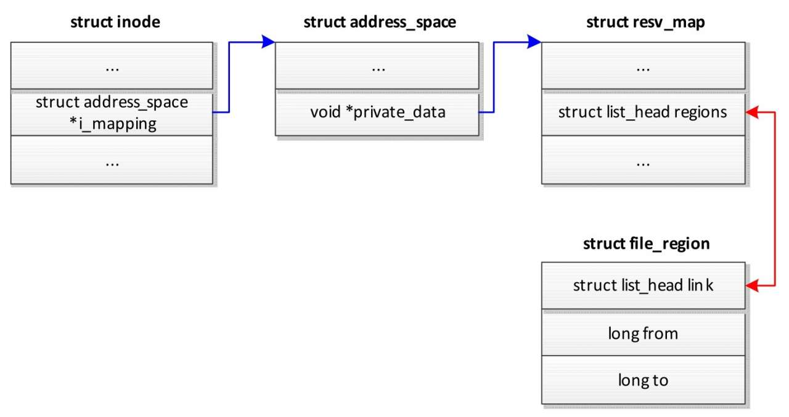

3. 如果是**私有映射**, 那么**创建预留图**, 虚拟内存区域的成员 `vm_private_data` 指向**预留图**, 并且设置标志 `HPAGE_RESV_OWNER` 指明**该虚拟内存区域拥有这个预留**, 如下图所示. 计算**需要预留的大页的数量** N =(文件的结束偏移 − 起始偏移), 偏移的单位是**大页长度**.

图 3.68 私有映射的预留图:

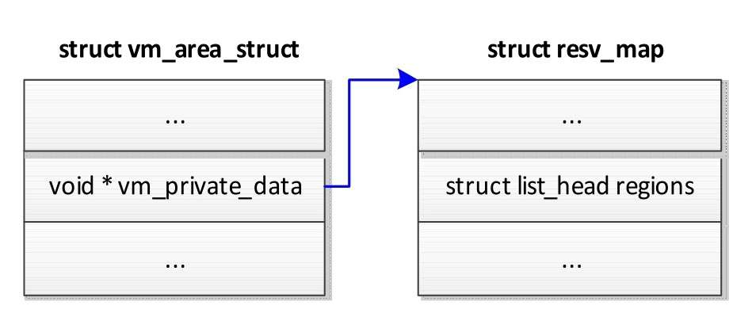

**虚拟内存区域**的成员 `vm_private_data` 的**最低两位**用来存储**标志位**.

* 标志位 `HPAGE_RESV_OWNER`, 值为 1, 指明当前进程是**预留的拥有者**.
* 标志位 `HPAGE_RESV_UNMAPPED`, 值为 2. 对于**私有映射**, 如果创建映射的进程在执行写时复制时分配大页失败, 那么删除所有子进程的映射, 设置该标志, 让**子进程**在发生**页错误异常**时被杀死.

4. 如果文件系统**创建**了**大页子池**, 计算子池需要向大页池申请预留的大页的数量, 否则需要向大页池申请预留的大页的数量是 N.

如果子池以前申请预留的大页数量大于或等于 N, 那么子池不需要向大页池申请预留.

如果子池以前申请预留的大页数量小于 N, 那么子池需要向大页池申请预留的数量等于(N − 子池以前申请预留的大页数量) .

5. 向大页池**申请预留**指定数量的大页.

6. 如果是**共享映射**, 那么在**预留图的区域链表**中增加 1 个 `file_region` 实例, 记录预留区域.

## 7.7. 分配和映射到大页

> 缺页异常: 从 hstate->freelist 真正申请大页; 设置页中间目录项;

使用 mmap 函数映射到 hugetlbfs 文件后, 会返回一个**虚拟内存地址**. 当对这个虚拟内存地址进行**访问**(读写)时, 由于此虚拟内存地址还**没有与物理内存地址进行映射**, 将会触发**缺页异常**, 内核会调用 `do_page_fault` 函数对 缺页异常 进行修复.

整个流程如下图所示:

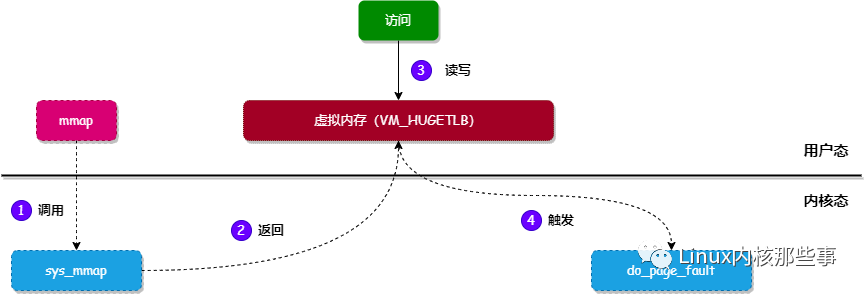

所以, 最终会调用 `do_page_fault` 函数对 缺页异常 进行修复操作.

大页面缺页中断处理函数调用流程:

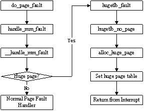

我们来看看 `do_page_fault` 做了什么工作, 实现如下:

```cpp
asmlinkage void
__kprobes do_page_fault(struct pt_regs *regs, unsigned long error_code)
{
    ...
    struct mm_struct *mm;
    struct vm_area_struct *vma;
    unsigned long address;
    ...

    mm = tsk->mm;         // 1. 获取当前进程对应的内存管理对象
    address = read_cr2(); // 2. 获取触发缺页异常的虚拟内存地址

    ...
    vma = find_vma(mm, address); // 3. 通过虚拟内存地址获取对应的虚拟内存分区对象
    ...

    // 4. 调用 handle_mm_fault 函数对异常进行修复
    fault = handle_mm_fault(mm, vma, address, write);
    ...

    return;
}
```

上面代码对 `do_page_fault` 进行了精简, 精简后主要完成 4 个工作:

* 获取当前进程对应的内存管理对象.
* 调用 `read_cr2` 获取触发缺页异常的**虚拟内存地址**.
* 通过触发 缺页异常 的**虚拟内存地址**获取对应的**虚拟内存分区对象**.
* 调用 `handle_mm_fault` 函数对 缺页异常 进行**修复**.

看 `handle_mm_fault` 函数的实现, 代码如下:

```cpp
int handle_mm_fault(struct mm_struct *mm, struct vm_area_struct *vma,
                    unsigned long address, int write_access)
{
    ...
    // 这里就检查了 VM_HUGETLB 标志位
    if (unlikely(is_vm_hugetlb_page(vma))) // 虚拟内存分区是否需要使用 HugePages
        return hugetlb_fault(mm, vma, address, write_access); // 如果使用 HugePages, 就调用 hugetlb_fault 进行处理
    ...
}
```

`hugetlb_fault` 函数主要**对进程的页表进行填充**, 所以我们先来回顾一下 HugePages 对应的页表结构.

以 4KB 为基本分页单位的 64 位 Linux 操作系统来采用**四级页表**管理虚实映射. 如上图 1. **每个页表项**占据 **64 位**(`8 Bytes`), 因此**每个**作为**页表**的**物理页面**可以存放 **512** 个**页表项**, 从而**最末级页表**(`Page table`)所映射的**物理内存大小**为 `512 * 4KB = 2MB`, 依此类推, 在**上一级页表**(`PMD`)中, **每一个 PMD 表项**可映射 **2MB** 的**物理内存**.

当采用 **2MB** 作为**分页**的**基本单位**时, 内核中则设置了三级页表, 如图 2. 在三级页表中, **最末一级页表**为 `PMD` 表, 同样地, **每一个 PMD 表项**指出了一个 **2MB** 的**大页面**, 也即**虚拟地址**的**低 21 位**作为大页面的页内偏移, 而高位则作为大页面的**页面编号**(pfn).

为了能让 MMU 正确地进行虚实地址转换, 必须告知 MMU 哪个**页表项**映射的是 **4KB** 的物理页面, 哪个页表项映射的是 **2MB** 的大页面, 这是通过**页表项**中的标志位 `_PAGE_PSE` 来区分的, 这一般是通过内联函数 `pte_mkhuge()` 设置的.

> PDPTE(PUDE): PS=1, 1G page; PS=0, non-1G page
>
> PDE(PMDE): PS=1, 2M page; PS=0, 4K page

64 位 Linux 操作系统四级页表示意图:

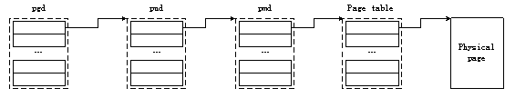

64 位 Linux 操作系统三级页表示意图:

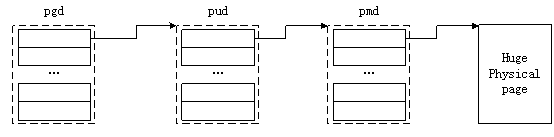

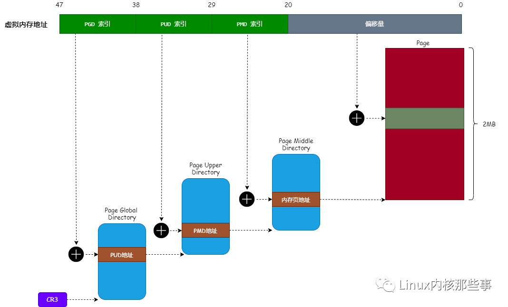

从上图可以看出, 使用 HugePages 后, **页中间目录项** 直接指向**物理内存页**. 所以, `hugetlb_fault` 函数主要就是对 **页中间目录项** 进行填充. 实现如下:

```cpp
int hugetlb_fault(struct mm_struct *mm, struct vm_area_struct *vma,
                  unsigned long address, int write_access)
{
    pte_t *ptep;
    pte_t entry;
    int ret;

    ptep = huge_pte_alloc(mm, address); // 1. 找到虚拟内存地址对应的页中间目录项
    ...
    entry = *ptep;

    if (pte_none(entry)) { // 如果页中间目录项还没进行映射
        // 2. 那么调用 hugetlb_no_page 函数进行映射操作
        ret = hugetlb_no_page(mm, vma, address, ptep, write_access);
        ...
        return ret;
    }
    ...
}
```

对 `hugetlb_fault` 函数进行精简后, 主要完成两个工作:

* 通过触发 缺页异常 的**虚拟内存地址**找到其对应的 **页中间目录项**.
* 发现**页中间目录项**是**空表项**, 调用 `hugetlb_no_page` 函数对 **页中间目录项** 进行**映射操作**.

我们再来看看 `hugetlb_no_page` 函数怎么对 **页中间目录项** 进行填充:

```cpp
static int
hugetlb_no_page(struct mm_struct *mm, struct vm_area_struct *vma,
                unsigned long address, pte_t *ptep, int write_access)
{
    ...
    page = find_lock_page(mapping, idx);
    if (!page) {
        ...
        // 1. 从空闲大内存页链表 hugepage_freelists 中申请一个大内存页
        page = alloc_huge_page(vma, address);
        ...
    }
    ...
    // 2. 通过大内存页的物理地址生成页中间目录项的值
    new_pte = make_huge_pte(vma, page, ((vma->vm_flags & VM_WRITE)
                                            && (vma->vm_flags & VM_SHARED)));

    // 3. 设置页中间目录项的值为上面生成的值
    set_huge_pte_at(mm, address, ptep, new_pte);
    ...
    return ret;
}
```

通过对 `hugetlb_no_page` 函数进行精简后, 主要完成 3 个工作:

* 在文件的**页缓存**中根据**文件的页偏移**查找页.
* 调用 `alloc_huge_page` 函数从**空闲大内存页链表** `hugepage_freelists` 中**申请一个大内存页**. 如果是**共享映射**, 那么把大页加入文件的**页缓存**, 以便和其他进程共享页.
* 通过**大内存页**的**物理地址**生成**页中间目录项的值**.
* 设置页中间目录项的值为上面生成的值.
* 如果第一步在**页缓存**中找到页, 映射是**私有的**, 并且执行写操作, 那么**执行写时复制**.

函数 `alloc_huge_page` 的执行过程如下.

1) 检查**预留图**, 确定进程是否预留过要分配的大页.

2) 如果进程没有预留大页, 检查分配是否超过子池的限制.

3) 从大页池中目标内存节点的空闲链表中分配永久大页.

4) 如果分配永久大页失败, 那么尝试从页分配器分配临时大页.

至此, HugePages 的映射过程已经完成.

还有个问题, 就是 **CPU** 怎么知道 页中间表项 指向的是 页表 还是 大内存页 呢?

这是因为 **页中间表项** 有个 **PSE** 的标志位, 如果将其设置为 1, 那么就表明其指向 大内存页, 否则就指向 页表.

## 7.8. 写时复制

> 分配大页; 复制数据; 修改页表项

假设进程 1 创建了**私有**的**大页映射**, 然后进程 1 分叉生成进程 2 和进程 3. 其中一个进程试图写大页的时候, 触发页错误异常, 大页的页错误处理函数 `hugetlb_fault` 调用函数 `hugetlb_cow` 以执行写时复制.

函数 `hugetlb_cow` 的执行过程如下.

1) 如果**只有一个虚拟页**映射到该**物理页**, 并且是**匿名映射**, 那么不需要复制, 直接修改页表项设置**可写**.

2) 分配大页.

3) 处理分配大页失败的情况.

如果触发页错误异常的进程是创建**私有映射**的**进程**, 那么删除所有子进程的映射, 为子进程的虚拟内存区域的成员 `vm_private_data` 设置标志 `HPAGE_RESV_UNMAPPED`, 让子进程在发生页错误异常的时候被杀死. 如果触发页错误异常的进程不是创建私有映射的进程, 返回错误.

4) 把旧页的数据复制到新页.

5) 修改页表项, 映射到新页, 并且设置可写.

# 8. 性能对比

构建测试用例: 分别在 2MB HugePagemmap() 和 4K 页面内存上映射 256M 内存, 然后每隔 4KB 写一个字节, 再读出进行验证. 最后 munmap() 解除映射.

如此确保每个 256M 空间每个页面都会被申请到, 其中 HugePage 内存每隔 2MB 才会发生缺页异常; 4K 页面每次都会发生缺页异常, 总量是 2MB 的 512 倍.

```cpp
#include <stdlib.h>
#include <stdio.h>
#include <unistd.h>
#include <sys/mman.h>
#include <fcntl.h>
#include <time.h>

#define PAGE_4K (0x1000)
#define LENGTH (256UL*1024*1024)
#define PROTECTION (PROT_READ | PROT_WRITE)

#ifndef MAP_HUGETLB
#define MAP_HUGETLB 0x40000 /* arch specific */
#endif

#define ADDR (void *)(0x0UL)
#define FLAGS_HP (MAP_PRIVATE | MAP_ANONYMOUS | MAP_HUGETLB)
#define FLAGS (MAP_PRIVATE | MAP_ANONYMOUS)

static void write_bytes(char *addr)
{
    unsigned long i;

    for (i = 0; i < LENGTH/PAGE_4K; i++)
        *(addr + PAGE_4K*i) = (char)i;
}

static int read_bytes(char *addr)
{
    unsigned long i;

    for (i = 0; i < LENGTH/PAGE_4K; i++)
        if (*(addr + PAGE_4K*i) != (char)i) {
            printf("Mismatch at %lu\n", i);
            return 1;
        }
    return 0;
}

long int mmap_perf_test(int flags)
{
    void *addr;
    int ret;
    struct timespec time_start, time_end;
    long int duration = 0;

    clock_gettime(CLOCK_REALTIME, &time_start);
    addr = mmap(ADDR, LENGTH, PROTECTION, flags, 0, 0);
    if (addr == MAP_FAILED) {
        perror("mmap");
        exit(1);
    }

    write_bytes(addr);
    ret = read_bytes(addr);
    /* munmap() length of MAP_HUGETLB memory must be hugepage aligned */
    if (munmap(addr, LENGTH)) {
        perror("munmap");
        exit(1);
    }
    clock_gettime(CLOCK_REALTIME, &time_end);
    duration = (time_end.tv_sec - time_start.tv_sec)*1000000000 + (time_end.tv_nsec - time_start.tv_nsec);
    return duration;
}

int main(int argc, char** argv)
{
    long int ret_hp = 0, ret = 0;
    float percentage = 0.0;

    if(argc != 2)
        return -1;

    int count=atoi(argv[1]);

    for(int i = 0; i < count; i++) {
        ret_hp = mmap_perf_test(FLAGS_HP);
        ret = mmap_perf_test(FLAGS);
        percentage = (float)ret_hp/(float)ret*100.0;
        printf("%d, %ld, %ld, %f\n", i+1, ret_hp, ret, percentage);
    }

    return ret;
}
```

分别进行 1 次和连续 50 次对比如下:

```
$ ./cmp_hugepage 1
1, 19186196, 81868224, 23.435461
$ ./cmp_hugepage 1
1, 45560431, 83335020, 54.671406
$ ./cmp_hugepage 1
1, 17648359, 82351069, 21.430639
$ ./cmp_hugepage 1
1, 43837351, 83531347, 52.480125
$ ./cmp_hugepage 1
1, 45677763, 83840517, 54.481728
```

可以看出只执行 1 次, HugePage 上耗时不太稳定. 耗时可能是 20%或 50%左右. (原因细节未继续跟进)

```
$ ./cmp_hugepage 50
1, 18256274, 81718710, 22.340384
2, 15377806, 82897401, 18.550407
3, 14953090, 81918232, 18.253677
...
48, 15206444, 83194584, 18.278166
49, 15137777, 85130700, 17.781807
50, 15088148, 83927648, 17.977566
```

当执行 50 的时候, 第 1 次可能是 20%或 50%, 但是后面基本在 20%左右.

所以说在本 Case 下, 最坏情况 HugePage 领先 4K 50%, 最好领先 80%左右.

通过读取 trace event /sys/kernel/debug/tracing/events/exceptionspage_fault_user, 可以看出缺页异常次数对比.

当执行 256M 4KB 页面, 内核 do_page_fault() 次数为:

```
cat /sys/kernel/debug/tracing/trace | grep 0x4006cd | wc -l
65536
```

当使用 HugePage 后, 内核 do_page_fault()次数为:

```
cat /sys/kernel/debug/tracing/trace | grep 0x4006cd | wc -l
128
```

其中 `0x4006cd` 是写内存的地方:

```cpp
static void write_bytes(char *addr)
{
  4006ac:    55                       push   %rbp
  4006ad:    48 89 e5                 mov    %rsp,%rbp
  4006b0:    48 89 7d e8              mov    %rdi,-0x18(%rbp)
    unsigned long i;

    for (i = 0; i < LENGTH; i++)
  4006b4:    48 c7 45 f8 00 00 00     movq   $0x0,-0x8(%rbp)
  4006bb:    00
  4006bc:    eb 16                    jmp    4006d4 <write_bytes+0x28>
        *(addr + i) = (char)i;
  4006be:    48 8b 55 e8              mov    -0x18(%rbp),%rdx
  4006c2:    48 8b 45 f8              mov    -0x8(%rbp),%rax
  4006c6:    48 01 d0                 add    %rdx,%rax
  4006c9:    48 8b 55 f8              mov    -0x8(%rbp),%rdx
  4006cd:    88 10                    mov    %dl,(%rax)
  ......
}
```

# 9. reference

`Documentation/admin-guide/mm/hugetlbpage.rst`

examples:

* `map_hugetlb`:

  * ``map_hugetlb``: tools/testing/selftests/vm/map_hugetlb.c

  * ``hugepage-shm``: tools/testing/selftests/vm/hugepage-shm.c

  * ``hugepage-mmap``: tools/testing/selftests/vm/hugepage-mmap.c

* `libhugetlbfs` library: https://github.com/libhugetlbfs/libhugetlbfs
