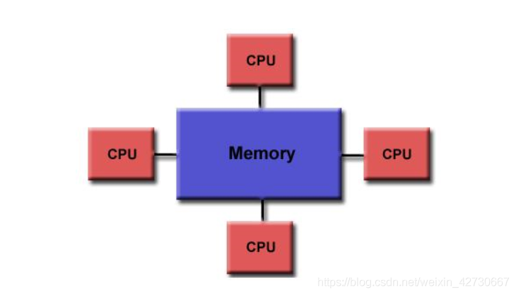
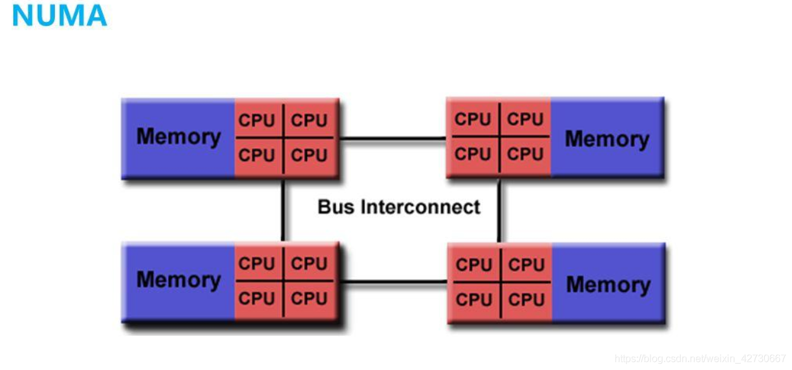

目前多处理器系统有两种体系结构.

(1) 对称多处理器(`Symmetric Multi-Processor`, SMP): 即一致内存访问(Uniform Memory Access, UMA), 所有处理器访问内存花费的时间是相同的. 每个处理器的地位是平等的, **仅**在**内核初始化**的时候**不平等**: "**0 号处理器**作为**引导处理器**负责初始化内核, 其他处理器等待内核初始化完成."

UMA 架构:

UMA 架构的设备中, 有多个 CPU (或者核)共享一块物理内存, **所有 CPU 共享一个内存带宽**, 该结构比较简单, 也是最早期计算机发展模型, 该结构中所有 CPU 都可以访问相同的物理内存, 访问速度相同.

该结构也有明显缺点就是访问内存受限于内存带宽, 所有 CPU 都共享一个内存带宽, 当**所有 CPU 都访问内存时**会导致**性能下降**. FLATMEM 物理内存就是针对此架构涉及, 只需要将所有物理内存组织成一个 mem_map 数组即可.

(2) 非一致内存访问(Non-Uniform Memory Access,NUMA): 指内存被划分成多个内存节点的多处理器系统, 访问一个内存节点花费的时间取决于处理器和内存节点的距离. 每个处理器有一个本地内存节点, 处理器访问本地内存节点的速度比访问其他内存节点的速度快. NUMA 是中高端服务器的主流体系结构.

混合架构/NUMA 架构:

而在 NUMA 架构中为了解决 NUMA 中所有 cpu 受限于一个物理内存带宽问题, 将各个 CPU 拥有自己的本地内存, 访问自己的本地内存速率最快, 而 CPU 之间通过**其他总线**进行相连, 以方便能够访问到其他 CPU 内存. 由于 **NUMA 架构**中 CPU 访问自己的内存速率最快, 所以**申请内存时**优先从**本地内存**中申请, 本地内存不足时再从从其他 CPU 的内存中进行申请.

在实际应用中可以采用**混合体系结构**, 在 **NUMA 节点内部**使用 **SMP 体系**结构.
