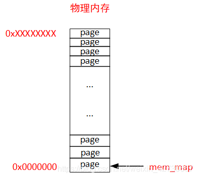
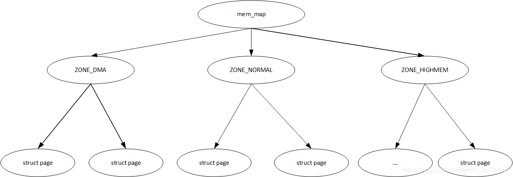
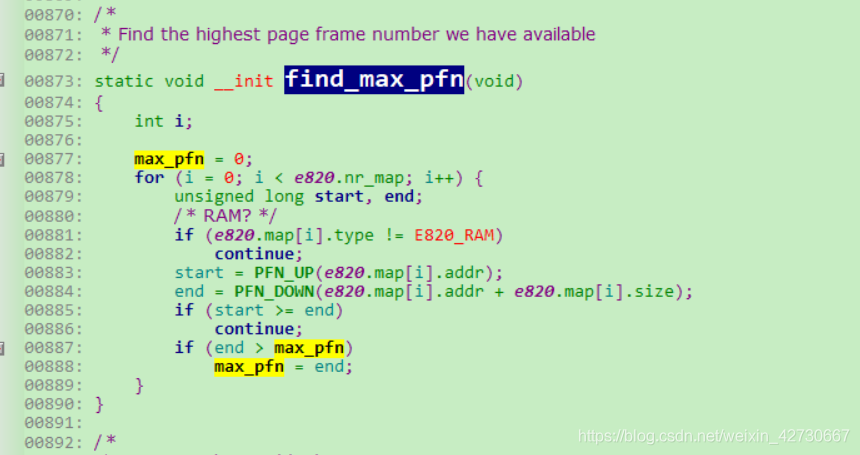
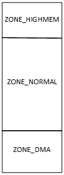
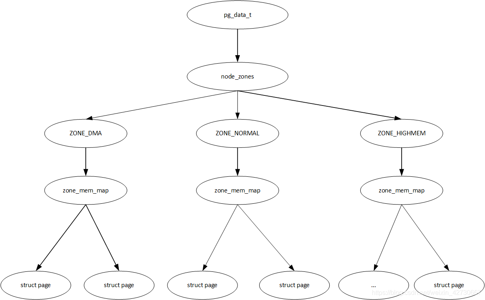
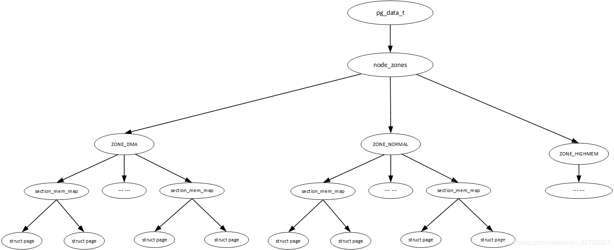
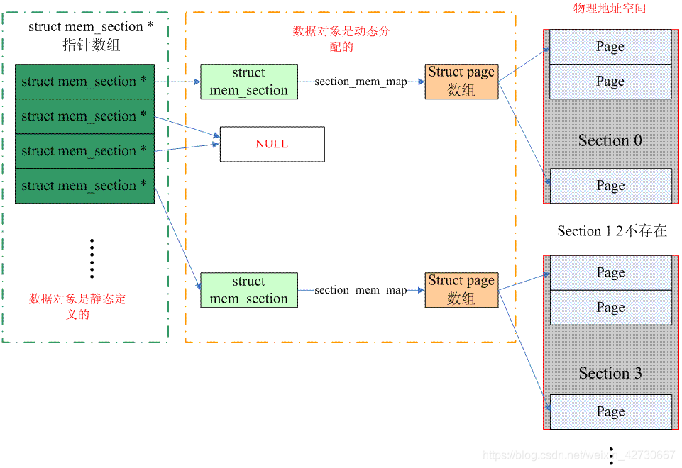
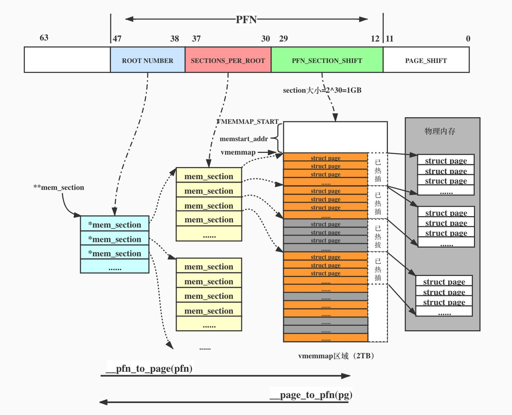
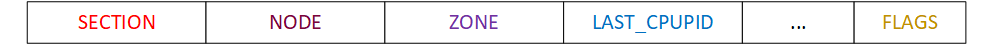
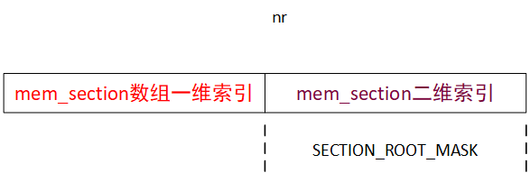

<!-- @import "[TOC]" {cmd="toc" depthFrom=1 depthTo=6 orderedList=false} -->

<!-- code_chunk_output -->

- [1. 背景介绍](#1-背景介绍)
- [2. 三种内存模型](#2-三种内存模型)
- [3. FLAT MEM](#3-flat-mem)
  - [3.1. FLATMEM 模型](#31-flatmem-模型)
    - [3.1.1. 层次划分](#311-层次划分)
    - [3.1.2. page (页)](#312-page-页)
    - [3.1.3. pfn (页帧号)](#313-pfn-页帧号)
    - [3.1.4. 物理地址与 pfn 转换](#314-物理地址与-pfn-转换)
    - [3.1.5. pfn 与 page 转换](#315-pfn-与-page-转换)
    - [3.1.6. mem_map 数组](#316-mem_map-数组)
  - [3.2. ZONE 划分](#32-zone-划分)
  - [3.3. mem_map 数组初始化(鸡和蛋问题)](#33-mem_map-数组初始化鸡和蛋问题)
- [4. DISCONTIG MEM](#4-discontig-mem)
  - [4.1. UMA VS NUMA](#41-uma-vs-numa)
  - [4.2. DISCONTIGMEM 模型](#42-discontigmem-模型)
  - [4.3. pg_data_t 结构](#43-pg_data_t-结构)
    - [4.3.1. NUMA 和 UMA pg_data_t](#431-numa-和-uma-pg_data_t)
      - [4.3.1.1. UMA pg_data_t](#4311-uma-pg_data_t)
      - [4.3.1.2. NUMA pg_data_t](#4312-numa-pg_data_t)
  - [4.4. pfn 与 page 相互转换](#44-pfn-与-page-相互转换)
    - [4.4.1. pfn_to_page](#441-pfn_to_page)
    - [4.4.2. page_to_pfn](#442-page_to_pfn)
  - [4.5. NODE_DATA](#45-node_data)
    - [4.5.1. node_zonelists](#451-node_zonelists)
    - [4.5.2. zone size 计算](#452-zone-size-计算)
- [5. SPARSE MEM](#5-sparse-mem)
  - [5.1. SPARSE 模型](#51-sparse-模型)
    - [5.1.1. section 的概念](#511-section-的概念)
    - [5.1.2. 全局变量 **mem_section](#512-全局变量-mem_section)
    - [5.1.3. 物理页帧号 PFN](#513-物理页帧号-pfn)
    - [5.1.4. vmemmap 区域](#514-vmemmap-区域)
    - [5.1.5. 内存热插拔](#515-内存热插拔)
    - [5.1.6. mem_section 管理](#516-mem_section-管理)
  - [5.2. PAGE 与 PFN 转换](#52-page-与-pfn-转换)
    - [5.2.1. page_to_pfn(classic sparse 方法)](#521-page_to_pfnclassic-sparse-方法)
      - [5.2.1.1. page_to_section(classic sparse 方法)](#5211-page_to_sectionclassic-sparse-方法)
      - [5.2.1.2. __nr_to_section](#5212-__nr_to_section)
      - [5.2.1.3. __section_mem_map_addr](#5213-__section_mem_map_addr)
      - [5.2.1.4. 计算出 pfn](#5214-计算出-pfn)
      - [5.2.1.5. 核心思路](#5215-核心思路)
    - [5.2.2. pfn_to_page](#522-pfn_to_page)
      - [5.2.2.1. __pfn_to_section](#5221-__pfn_to_section)
      - [5.2.2.2. 获取到 section_mem_map](#5222-获取到-section_mem_map)
      - [5.2.2.3. 计算 page](#5223-计算-page)
      - [5.2.2.4. 核心思路](#5224-核心思路)
  - [5.3. vmemmap(sparse vmemmap 方法)](#53-vmemmapsparse-vmemmap-方法)
- [6. reference](#6-reference)

<!-- /code_chunk_output -->

# 1. 背景介绍

内存模型是从**处理器的角度**看到的**物理内存分布情况**, 内核管理不同内存模型的方式存在差异.

> 物理内存, 所以 node, zone, page 都是指物理内存.

我们知道 Linux 中的**物理内存**被**按页框划分**, **每个页框**都会对应**一个 struct page 结构体**存放**元数据**, 也就是说**每块页框大小的内存**都要花费`sizeof(struct page)`个**字节**进行**管理**.

所以系统会有大量的`struct page`, 在 linux 的历史上出现过**三种内存模型**去**管理它们**. 依次是**平坦内存模型**(`flat memory model`)、**不连续内存模型**(`discontiguous memory model`)和**稀疏内存模型**(`sparse memory model`). 新的内存模型的一次次被提出, 无非因为是老的内存模型已不适应计算机硬件的新技术(例如: NUMA 技术、内存热插拔等).

内存模型的**设计原则**主要是权衡以下两点(**空间**与**时间**):
1. 尽量**少的消耗内存**去**管理**众多的`struct page`
2. `pfn_to_page` 和 `page_to_pfn` 的转换效率.

# 2. 三种内存模型

关于三个物理内存模型社区文档有总体说明介绍: [memory-model](https://www.kernel.org/doc/html/latest/vm/memory-model.html)

(1)**平坦内存**(`Flat Memory`): 内存的物理地址空间是**连续**的, **没有空洞**.

Linux 最早使用的内存模型, 那时计算机的内存通常不大. Linux 会使用一个`struct page mem_map[x]`的**数组**根据 PFN 去依次存放**所有的 strcut page**, 且 `mem_map` 也位于**内核空间**的**线性映射区**, 所以根据 PFN(页帧号)即可轻松的找到目标页帧的 strcut page.

(2)**不连续内存**(`Discontiguous Memory`): 内存的物理地址空间**存在空洞**, 这种模型可以高效地处理空洞.

对于**物理地址空间不存在空洞**(holes)的计算机来说, FLATMEM 无疑是最优解. 可物理地址中若是存在空洞的话, FLATMEM 就显得格外的浪费内存, 因为 FLATMEM 会在 `mem_map` 数组中为**所有的物理地址**都创建一个 struct page, 即使大块的物理地址是空洞, 即**不存在物理内存**. 可是为这些空洞这些 struct page 完全是没有必要的, 浪费内存. 为了解决空洞的问题, Linux 社区提出了 DISCONTIGMEM 模型.

> 什么情况会出现内存的物理地址空间存在空洞?系统包含**多块物理内存**, 两块内存的物理地址空间之间存在**空洞**; **一块内存**的物理地址空间也可能存在**空洞**, 可以查看处理器的参考手册获取分配给内存的物理地址空间.

DISCONTIGMEM 是个稍纵即逝的内存模型, 在 SPARSEMEM 出现后即被完全替代, 且当前的 Linux kernel 默认都是使用 `SPARSEMEM`, 所以介绍 DISCONTIGMEM 的意义不大, 感兴趣可以看这篇文章: https://lwn.net/Articles/789304/

(3)**稀疏内存**(`Sparse Memory`): 内存的物理地址空间**存在空洞**. 如果要**支持内存热插拔**, 只能选择稀疏内存模型.

稀疏内存模型是当前内核默认的选择, 从 2005 年被提出后沿用至今, 但中间经过几次优化, 包括: CONFIG_SPARSEMEM_VMEMMAP 和 CONFIG_SPARSEMEM_EXTREME 的引入, 这两个配置通常是被打开的, 下面的原理介绍也会基于它们开启的情况.

首次引入 SPARSEMEM 时的 commit. https://lwn.net/Articles/134804/ 原文中阐明了它的三个优点:

1. 可以解决**内存空洞**导致的内存浪费.
2. 支持**内存的热插拔**(memory hotplug).
3. 支持 nodes 间的 overlap.

# 3. FLAT MEM

## 3.1. FLATMEM 模型

flat 中文意思就是水平、平坦的, 按照字面意思理解该模型即位平坦模型, 它是 linux 最早的模型管理, 一直在早期支撑了 linux 发展, **其他两种内存管理模型**也是在该模型基础上**进化**, 所以要理解 linux 内存管理, 必须要了解此模型, 包括**很多概念**比如 **pfn**, **页**等都是在该模型概念基础上进行提出的.

flat 物理模型其实质就是将整块物理内存划分到一个数组中进行管理, **整块物理内存**划分到**一个数组 mem_map 数组**中实现一个平滑管理.

划分 `mem_map` 数组过程中, 基于空间和效率来讲, 内核整个物理内存划分成一页即 page 为单位进行管理, `mem_map` 数组单位为 `struct page`, 物理内存管理的最小颗粒度即为页, 如下图所示:



上图中有一块物理内存, 物理地址空间为 `0x00000000 ~ 0xxxxxxxxx`, 内核按照页将整个物理内存进行划分, mem_map 为以 struct page 为单位的数组, 首地址指向物理内存的第一页地址.

>物理内存: 即 CPU 通过总线写入到物理内存的总线地址, 操作系统和程序员的视角是无法看到物理地址, 和我们通常 malloc 申请到的内存不一样, malloc 内存申请的为一个虚拟地址即程序员和操作系统看到的地址.
>
>由于物理内存管理是从 32 位系统开始的, 首先以 32 位系统讲解开始, 64 位内存管理思路和 32 位差不多, 只是空间划分有区别
>
>flat 模型在大多数版本中都存在, 为了方便分析该模型排除其他模型干扰, 选取了 2.4.22 内核源码为标准, 主要是《understanding the linux virtual memory manager》(中文《深入理解 Linux 虚拟内存管理》)这本书以该版本为主, 后续可以方便进行持续深入.

### 3.1.1. 层次划分

FLATMEM 物理内存模型按照层次进行如下划分:



* `mem_map`: **整个物理内存**被按照页划分到 `mem_map` **全局数组**中方便查找.
* `ZONE`: 将 `mem_map` 整个物理内存**按照使用用途**划分为 `ZONE_DMA`, `ZONE_NORMAL`、`ZONE_HIGHMEM` 三个区域
* `struct page`: page 是物理内存管理的最小单位, 32 位系统下大小位 4K

整个内存按照上述三个划分层次进行管理.

### 3.1.2. page (页)

整个物理内存管理以 page 为基础, 一个 page 大小被定义成 4K, 在内核中使用 `PAGE_SIZE` 定义了 page 大小, 以 i386 为例, 在 `include\asm-i386\page.h` 定义了 PAGE_SIZE:

```cpp
/* PAGE_SHIFT determines the page size */
#define PAGE_SHIFT	12
#define PAGE_SIZE	(1UL << PAGE_SHIFT)
#define PAGE_MASK	(~(PAGE_SIZE-1))
```

由此可以得到在物理内存的**第一个 page** 的物理地址范围为 `0x0~0x3FF`, **第二个页**的物理地址范围为 `0x400~0x7FF`, ...以此类推.

内核代码中有专有的 `struct page` 数据结构对页进行描述, 2.4 内核版本中对该数据结构定义在 `linux/mm.h` 文件中, 其详细定义如下:

```cpp
typedef struct page {
	struct list_head list;		/* ->mapping has some page lists.
该页面所属的列表, 为了节省空间, 该字段会进行复用, 例如在 slab 中该字段代表指向管理页面 slab 以及高速缓存结构*/
	struct address_space *mapping;	/* The inode (or ...) we belong to.
如果文件或设备已经映射到内存, 它们的索引节点会有一个相关联 的 address_space.如果这个页面属于这个文件, 则该字段会指向这个 address_space.如果页面是匿名的, 且设置了 mapping, 则 address_space 就是交换地址空间的 swapper_space */
	unsigned long index;		/* Our offset within mapping.
该字段有两个用途, 与该页面状态有关. 如果页面是文件映射的一部分, 它就是页面在文件中的偏移. 如果页面是交换高速缓存的一部分, 它就是在交换地址空间 address_space 的偏移量. 此外, 如果包含页面的块被释放以提供给一个特色的进程, 那么被释放的块的顺序存放在 index 中*/
	struct page *next_hash;		/* Next page sharing our hash bucket in
					   the pagecache hash table.
属于一个文件映射并被散列到索引节点及偏移中的页面. 该字段将被共享相同的哈希桶的页面链接在一起*/
	atomic_t count;			/* Usage count, see below. 页面被引用的数目. 如果 count 减到 0, 它就会被释放. 当页面被多个进程使用到, 或者被内核用到的时候, count 就会增大*/
	unsigned long flags;		/* atomic flags, some possibly
					   updated asynchronously 页面的状态*/
	struct list_head lru;		/* Pageout list, eg. active_list;
					   protected by pagemap_lru_lock !! 页面替换策略*/
	struct page **pprev_hash;	/* Complement to *next_hash. */
	struct buffer_head * buffers;	/* Buffer maps us to a disk block. 如何一个页面有相关的块设备缓冲区*/

	/*
	 * On machines where all RAM is mapped into kernel address space,
	 * we can simply calculate the virtual address. On machines with
	 * highmem some memory is mapped into kernel virtual memory
	 * dynamically, so we need a place to store that address.
	 * Note that this field could be 16 bits on x86 ... ;)
	 *
	 * Architectures with slow multiplication can define
	 * WANT_PAGE_VIRTUAL in asm/page.h
	 */
#if defined(CONFIG_HIGHMEM) || defined(WANT_PAGE_VIRTUAL)
	void *virtual;			/* Kernel virtual address (NULL if
					   not kmapped, ie. highmem) */
#endif /* CONFIG_HIGMEM || WANT_PAGE_VIRTUAL */
} mem_map_t;
```

上述各个字段的意义与其内部实现有很大关系, 可以先不必关注细节, 后面再进行详细了解.

### 3.1.3. pfn (页帧号)

在内核源码会经常见到一个 pfn 概念, pfn 即为**页帧号**, 意思表示为**第几页**, 即 `mem_map` 的**数组的索引**. 在内核处理内存单元为 page, 经常使用**页帧号**来**表明处理的为第几页**.

正如上述例子中**第一页**的**物理地址范围**为 `0x0 ~ 0x3FF`, **第二页**物理地址范围为 `0x400~0x7FF`.

### 3.1.4. 物理地址与 pfn 转换

在内核源码处理中经常用到将物理地址与 pfn 之间转换(注意**非虚拟地址**, 后面再讲解虚拟地址转换).

将**一个物理地址**转换成**pfn**只需要进行位移即可, 可以参考 `phys_to_pfn`:

```cpp
#define phys_to_pfn(phys)	((phys) >> PAGE_SHIFT)
```

同样将**pfn**转换成**物理地址**只需要**左移**即可, 2.4.22 内核中暂时没用相关宏, 可以参考如下代码

将 `max_low_pfn` 转换成物理地址:

```cpp
unsigned long memtop = max_low_pfn << PAGE_SHIFT;
```

### 3.1.5. pfn 与 page 转换

pfn 与 page 之间转换比较简单, 需要**使用 mem_map 数组**, 可以参考下述两个宏 `pfn_to_page` 和 `page_to_pfn`:

```cpp
#define pfn_to_page(pfn)	(mem_map + (pfn))
#define page_to_pfn(page)   ((page) - mem_map)
```

### 3.1.6. mem_map 数组

`mem_map` 为**物理内存实际管理数据**, 以 page 为单位, 其数组大小与实际内存有很大关系, 内核中有 `max_pfn` **全局变量**来表示**实际的物理内存最大的页帧号**, 其值在**系统启动过程中**由**实际物理内存计算**得知.

> 这里的实际物理内存是假设一整块连续内存, 不考虑 hole 情况

不同的芯片体系结构计算方法不一样, 以 i386 为用例, 其计算**最大 max_pfn** 函数为 `find_max_pfn()`, 位于 `arch\i386\kernel\setup.c` 文件中, 具体实现如下:



会**遍历所有 RAM 页面**(e820), 从而得到最大 `max_pfn`.

2.4 内核源码中 `mem_map` 定义位于 `mm\memory.c` 文件中;

```cpp
mem_map_t * mem_map;
```

## 3.2. ZONE 划分

> 物理内存划分
> ZONE_DMA	0 ~ 15MB
> ZONE_NORMAL	16MB ~ 895MB
> ZONE_HIGHMEM	896MB ~ 物理内存结束

页(page)是**linux 物理内存管理**的基本单位, 将实际物理内存按照页单位进行一片片切片, 其物理地址从 `0x00000000` 开始, 但是由于早期历史硬件缺陷原因(**早期 DMA**历史硬件缺陷**只能映射**到**物理地址**(`0x0000000~16M`)地址范围, 无法映射到整个物理地址范围, 故**物理地址前 16M 或者 32M**需要**预留给 DMA 使用**.

在一个 32 位 linux 系统中, 一般将**物理内存**按照 ZONE 将其划分三个大的区域 `ZONE_DMA`、`ZONE_NORMAL`、`NOZE_ZONE_HIGHMEM` 三个区域, 如下图:



`ZONE_DMA` 大小**与具体芯片有关系**, 如果使用的 DMA 地址范围是能在 32M 范围, 则可以将 ZONE_DMA 大小设置为 32M. 当然如果在某个开发板中使用的芯片 DMA 硬件没有缺陷, **可以映射**到**全部物理地址范围之内**, 则完全**可以将 DMA 取消掉**, 这意味着 `ZONE_DMA` 划分**不是固定的**, 根据具体所使用的芯片有关.

`ZONE_HIGHMEM` 划分是**由于 32 位系统的限制**(后面可以再进行介绍), 也**不是必须的**, 如果**实际物理内存小于 896M**则**不必划分** `ZONE_HIGHMEM`.

内核代码中有专门的数据结构 `zone_t` 表示详细信息, 2.4 内核源码中该数据结构定义在 `include\linux\mmzone.h` 文件中:

```cpp
typedef struct zone_struct {
	/*
	 * Commonly accessed fields:
	 */
	spinlock_t		lock; //zone 锁, 每个 zone 拥有自己所属的锁
	unsigned long		free_pages; //zone 内空闲的页数量
	unsigned long		pages_min, pages_low, pages_high;//内存管理中三个 water level 管理区极值
	int			need_balance; //该标志位表示是否需要进行页换出 kswapd

	/*
	 * free areas of different sizes
	 */
	free_area_t		free_area[MAX_ORDER];//buddy 算法

	/*
	 * wait_table		-- the array holding the hash table
	 * wait_table_size	-- the size of the hash table array
	 * wait_table_shift	-- wait_table_size
	 * 				== BITS_PER_LONG (1 << wait_table_bits)
	 *
	 * The purpose of all these is to keep track of the people
	 * waiting for a page to become available and make them
	 * runnable again when possible. The trouble is that this
	 * consumes a lot of space, especially when so few things
	 * wait on pages at a given time. So instead of using
	 * per-page waitqueues, we use a waitqueue hash table.
	 *
	 * The bucket discipline is to sleep on the same queue when
	 * colliding and wake all in that wait queue when removing.
	 * When something wakes, it must check to be sure its page is
	 * truly available, a la thundering herd. The cost of a
	 * collision is great, but given the expected load of the
	 * table, they should be so rare as to be outweighed by the
	 * benefits from the saved space.
	 *
	 * __wait_on_page() and unlock_page() in mm/filemap.c, are the
	 * primary users of these fields, and in mm/page_alloc.c
	 * free_area_init_core() performs the initialization of them.
	 */
	wait_queue_head_t	* wait_table;//等待队列哈希表
	unsigned long		wait_table_size;//哈希表大小
	unsigned long		wait_table_shift;//定义一个 long 型所对应的位数减去上述大小的二进制对数

	/*
	 * Discontig memory support fields.
	 */
	struct pglist_data	*zone_pgdat;//归属的父 pgdat
	struct page		*zone_mem_map;//zone 起始 mem_map
	unsigned long		zone_start_paddr;//起始页帧号
	unsigned long		zone_start_mapnr;//起始物理地址

	/*
	 * rarely used fields:
	 */
	char			*name;//zone 名字
	unsigned long		size;//zone 大小
} zone_t;
```

## 3.3. mem_map 数组初始化(鸡和蛋问题)

FLATMEM 内存模型中, **不考虑 NUMA 和内存存在空洞问题**, 只是简单的将**一块物理内存**按照 page 划分到 mem_map 数组中(`mem_map`作为**管理**物理内存结构, **本身占用一定的物理空间**), `mem_map` 数组最初初始化代码为(`mm\numa.c`):

```cpp
#ifndef CONFIG_DISCONTIGMEM

/*
 * This is meant to be invoked by platforms whose physical memory starts
 * at a considerably higher value than 0. Examples are Super-H, ARM, m68k.
 * Should be invoked with paramters (0, 0, unsigned long *[], start_paddr).
 */
void __init free_area_init_node(int nid, pg_data_t *pgdat, struct page *pmap,
	unsigned long *zones_size, unsigned long zone_start_paddr,
	unsigned long *zholes_size)
{
	free_area_init_core(0, &contig_page_data, &mem_map, zones_size,
				zone_start_paddr, zholes_size, pmap);
}

#endif /* !CONFIG_DISCONTIGMEM */
```

`free_area_init_node()` 函数在 FLATMEM 模型中, 其**空洞** `zholes_size` 为**0**(该函数和 DISCONTIGMEM 模型是使用的**同一接口**)

在某些架构内 `mem_map` 数组有可能使用的是 `free_area_init()` 接口函数初始化:

```cpp
void __init free_area_init(unsigned long *zones_size)
{
	free_area_init_core(0, &contig_page_data, &mem_map, zones_size, 0, 0, 0);
}
```

`unsigned long *zones_size`: 表示为**各个 ZONE 具体的实际大小**, 以页为单位.

但是不管使用上述哪两个接口最终都会调用 `free_area_init_core()` 函数, 初始化 `mem_map` 数组.

在 `free_area_init_core()` 函数中, 会首先根据 `zones_size` 大小计算共有**多少个实际物理页**, 然后从 `bootmem`(系统引导区)**申请** `(totalpages + 1) * sizeof(struct page)`实际物理空间, 管理整个物理内存.

在 mem_map 数组建立起来之前, 整个系统内存管理是由 bootmem(系统引导区)进行管理, 申请内存页是从系统引导区中申请. `mem_map` 数组建立之后, kernel 会把**物理内存管理权**由 **bootmem** 转入到 **mem_map** 进行管理.

`free_area_init_core()`: 函数为真正的 mem_map 物理内存初始化函数实施函数 , 是比较关键函数, 整体代码如下:

```cpp
/*
 * Set up the zone data structures:
 *   - mark all pages reserved
 *   - mark all memory queues empty
 *   - clear the memory bitmaps
 */
void __init free_area_init_core(int nid, pg_data_t *pgdat, struct page **gmap,
	unsigned long *zones_size, unsigned long zone_start_paddr,
	unsigned long *zholes_size, struct page *lmem_map)
{
	unsigned long i, j;
	unsigned long map_size;
	unsigned long totalpages, offset, realtotalpages;
	const unsigned long zone_required_alignment = 1UL << (MAX_ORDER-1);

	if (zone_start_paddr & ~PAGE_MASK)
		BUG();

	totalpages = 0;
	for (i = 0; i < MAX_NR_ZONES; i++) {
		unsigned long size = zones_size[i];
		totalpages += size;
	}
	realtotalpages = totalpages;
	if (zholes_size)
		for (i = 0; i < MAX_NR_ZONES; i++)
			realtotalpages -= zholes_size[i];

	printk("On node %d totalpages: %lu\n", nid, realtotalpages);

	/*
	 * Some architectures (with lots of mem and discontinous memory
	 * maps) have to search for a good mem_map area:
	 * For discontigmem, the conceptual mem map array starts from
	 * PAGE_OFFSET, we need to align the actual array onto a mem map
	 * boundary, so that MAP_NR works.
	 */
	map_size = (totalpages + 1)*sizeof(struct page);
	if (lmem_map == (struct page *)0) {
		lmem_map = (struct page *) alloc_bootmem_node(pgdat, map_size);
		lmem_map = (struct page *)(PAGE_OFFSET +
			MAP_ALIGN((unsigned long)lmem_map - PAGE_OFFSET));
	}
	*gmap = pgdat->node_mem_map = lmem_map;
	pgdat->node_size = totalpages;
	pgdat->node_start_paddr = zone_start_paddr;
	pgdat->node_start_mapnr = (lmem_map - mem_map);
	pgdat->nr_zones = 0;

	offset = lmem_map - mem_map;
	for (j = 0; j < MAX_NR_ZONES; j++) {
		zone_t *zone = pgdat->node_zones + j;
		unsigned long mask;
		unsigned long size, realsize;

		zone_table[nid * MAX_NR_ZONES + j] = zone;
		realsize = size = zones_size[j];
		if (zholes_size)
			realsize -= zholes_size[j];

		printk("zone(%lu): %lu pages.\n", j, size);
		zone->size = size;
		zone->name = zone_names[j];
		zone->lock = SPIN_LOCK_UNLOCKED;
		zone->zone_pgdat = pgdat;
		zone->free_pages = 0;
		zone->need_balance = 0;
		if (!size)
			continue;

		/*
		 * The per-page waitqueue mechanism uses hashed waitqueues
		 * per zone.
		 */
		zone->wait_table_size = wait_table_size(size);
		zone->wait_table_shift =
			BITS_PER_LONG - wait_table_bits(zone->wait_table_size);
		zone->wait_table = (wait_queue_head_t *)
			alloc_bootmem_node(pgdat, zone->wait_table_size
						* sizeof(wait_queue_head_t));

		for(i = 0; i < zone->wait_table_size; ++i)
			init_waitqueue_head(zone->wait_table + i);

		pgdat->nr_zones = j+1;

		mask = (realsize / zone_balance_ratio[j]);
		if (mask < zone_balance_min[j])
			mask = zone_balance_min[j];
		else if (mask > zone_balance_max[j])
			mask = zone_balance_max[j];
		zone->pages_min = mask;
		zone->pages_low = mask*2;
		zone->pages_high = mask*3;

		zone->zone_mem_map = mem_map + offset;
		zone->zone_start_mapnr = offset;
		zone->zone_start_paddr = zone_start_paddr;

		if ((zone_start_paddr >> PAGE_SHIFT) & (zone_required_alignment-1))
			printk("BUG: wrong zone alignment, it will crash\n");

		/*
		 * Initially all pages are reserved - free ones are freed
		 * up by free_all_bootmem() once the early boot process is
		 * done. Non-atomic initialization, single-pass.
		 */
		for (i = 0; i < size; i++) {
			struct page *page = mem_map + offset + i;
			set_page_zone(page, nid * MAX_NR_ZONES + j);
			set_page_count(page, 0);
			SetPageReserved(page);
			INIT_LIST_HEAD(&page->list);
			if (j != ZONE_HIGHMEM)
				set_page_address(page, __va(zone_start_paddr));
			zone_start_paddr += PAGE_SIZE;
		}

		offset += size;
		for (i = 0; ; i++) {
			unsigned long bitmap_size;

			INIT_LIST_HEAD(&zone->free_area[i].free_list);
			if (i == MAX_ORDER-1) {
				zone->free_area[i].map = NULL;
				break;
			}

			/*
			 * Page buddy system uses "index >> (i+1)",
			 * where "index" is at most "size-1".
			 *
			 * The extra "+3" is to round down to byte
			 * size (8 bits per byte assumption). Thus
			 * we get "(size-1) >> (i+4)" as the last byte
			 * we can access.
			 *
			 * The "+1" is because we want to round the
			 * byte allocation up rather than down. So
			 * we should have had a "+7" before we shifted
			 * down by three. Also, we have to add one as
			 * we actually _use_ the last bit (it's [0,n]
			 * inclusive, not [0,n[).
			 *
			 * So we actually had +7+1 before we shift
			 * down by 3. But (n+8) >> 3 == (n >> 3) + 1
			 * (modulo overflows, which we do not have).
			 *
			 * Finally, we LONG_ALIGN because all bitmap
			 * operations are on longs.
			 */
			bitmap_size = (size-1) >> (i+4);
			bitmap_size = LONG_ALIGN(bitmap_size+1);
			zone->free_area[i].map =
			  (unsigned long *) alloc_bootmem_node(pgdat, bitmap_size);
		}
	}
	build_zonelists(pgdat);
}
```

该函数主要处理流程解释如下:

1. `zone_start_paddr` 对页管理**开始物理地址**进行检查, 由于物理内存被划分成页管理, 所以开始的物理地址一定是从**页对齐地址**开始, 故要进行**地址页对齐检查**

```cpp
if (zone_start_paddr & ~PAGE_MASK)
		BUG();
```

2. 根据传入的 `zones_size` 数组计算出总共占有的**页数** **totalpages**:

```cpp
	totalpages = 0;
	for (i = 0; i < MAX_NR_ZONES; i++) {
		unsigned long size = zones_size[i];
		totalpages += size;
	}
```

3. 由于 `zones_size` 中**包含内存空洞数目**, 需要计算**减去**各个 ZONE **空洞数目** `zholes_size` . 由于在 flatmem 模式中传入的 zholes_size 为**空**, 故不计算空洞数目:

```cpp
	realtotalpages = totalpages;
	if (zholes_size)
		for (i = 0; i < MAX_NR_ZONES; i++)
			realtotalpages -= zholes_size[i];

	printk("On node %d totalpages: %lu\n", nid, realtotalpages);
```

4. 按照 totalpages 数目, 计算出为了**管理该内存占有的空间大小** `(totalpages + 1)*sizeof(struct page)`, 调用 `alloc_bootmem_node()` 接口申请内存(注意此时内存管理权是 bootmem 负责管理, 这是因为此时 `mem_map` 数组并没有建立起来, buddy 也没有建立起来, 所以不能从 **kmallock** 申请内存, 只能从引导区获取内存, 内存内存管理权限还为内存引导区进行管理)并**初始化 pgdat 数据结构**, 此时 `*gmap = lmem_map`, 即 `mem_map` 的地址为 `lmem_map`, 真正为 mem_map 申请内存:

```cpp
	map_size = (totalpages + 1)*sizeof(struct page);
	if (lmem_map == (struct page *)0) {
		lmem_map = (struct page *) alloc_bootmem_node(pgdat, map_size);
		lmem_map = (struct page *)(PAGE_OFFSET +
			MAP_ALIGN((unsigned long)lmem_map - PAGE_OFFSET));
	}
	*gmap = pgdat->node_mem_map = lmem_map;
	pgdat->node_size = totalpages;
	pgdat->node_start_paddr = zone_start_paddr;
	pgdat->node_start_mapnr = (lmem_map - mem_map);
	pgdat->nr_zones = 0;
```

5: 接下循环来**初始化各个 zone 区域**, 各个 ZONE 区域是挂载到 `zone_t node_zones[MAX_NR_ZONES]` 到 `pg_data_t` 中, 其中 `node_zones` 为各个 ZONE 信息, 在**flat 模型**中 `MAX_NR_ZONES` 为 3 个区域, 分别为 `ZONE_DMA`、`ZONE_NORMAL` 和 `ZONE_HIGHMEM`. zone 初始化主要分为以下几个部分

首先**根据循环**取得相应 `node_zones` 数组的 zone, 初始化 zone 的 name、size 等信息, 其中 `zone_pgdat` **字段**为指向 pddat 回调用于表明属于哪个 pddat(在 **flat** 模型中**只有一个 pgdat**).

lock 为 zone 锁初始化, `free_pages` 代表 **zone 有多少个空闲页**.

```cpp
zone_t *zone = pgdat->node_zones + j;
unsigned long mask;
unsigned long size, realsize;

zone_table[nid * MAX_NR_ZONES + j] = zone;
realsize = size = zones_size[j];
if (zholes_size)
	realsize -= zholes_size[j];

printk("zone(%lu): %lu pages.\n", j, size);
zone->size = size;
zone->name = zone_names[j];
zone->lock = SPIN_LOCK_UNLOCKED;
zone->zone_pgdat = pgdat;
zone->free_pages = 0;
zone->need_balance = 0;
```

初始化 `wait_table`, 稍后详细介绍

```cpp
zone->wait_table_size = wait_table_size(size);
zone->wait_table_shift =
	BITS_PER_LONG - wait_table_bits(zone->wait_table_size);
zone->wait_table = (wait_queue_head_t *)
	alloc_bootmem_node(pgdat, zone->wait_table_size
				* sizeof(wait_queue_head_t));

for(i = 0; i < zone->wait_table_size; ++i)
	init_waitqueue_head(zone->wait_table + i);
```

接下来初始化 zone 区域内著名的**三个 waterlevel**: **pages_min**, **pages_low**, **page_high**, 这三个参数在当 zone **使用的 page** 分别达到上述三个页, 会做出不同的动作, 以**防止内存持续被消耗完毕**

```cpp
		mask = (realsize / zone_balance_ratio[j]);
		if (mask < zone_balance_min[j])
			mask = zone_balance_min[j];
		else if (mask > zone_balance_max[j])
			mask = zone_balance_max[j];
		zone->pages_min = mask;
		zone->pages_low = mask*2;
		zone->pages_high = mask*3;
```

初始化 zone 中的**起始** `mem_map` 以及**开始页帧号**(`zone_start_mapnr`)和**开始实际物理地址**(`zone_start_paddr`)

```cpp
zone->zone_mem_map = mem_map + offset;
zone->zone_start_mapnr = offset;
zone->zone_start_paddr = zone_start_paddr;
```

继续初始化 zone 中每页 page 的信息, 设置每页所属 zone, 将每页使用计数清零等其他信息:

```cpp
		/*
		 * Initially all pages are reserved - free ones are freed
		 * up by free_all_bootmem() once the early boot process is
		 * done. Non-atomic initialization, single-pass.
		 */
		for (i = 0; i < size; i++) {
			struct page *page = mem_map + offset + i;
			set_page_zone(page, nid * MAX_NR_ZONES + j);
			set_page_count(page, 0);
			SetPageReserved(page);
			INIT_LIST_HEAD(&page->list);
			if (j != ZONE_HIGHMEM)
				set_page_address(page, __va(zone_start_paddr));
			zone_start_paddr += PAGE_SIZE;
		}
```

最后最重要的部分初始化 buddy 算法所使用的数据, buddy 算法按照**2 的 n 次方个页**进行管理, 每个级别的 order 有需要申请数量**足够多的 bitmap**来管理所有的内存(具体后面再详细介绍)

```cpp
		offset += size;
		for (i = 0; ; i++) {
			unsigned long bitmap_size;

			INIT_LIST_HEAD(&zone->free_area[i].free_list);
			if (i == MAX_ORDER-1) {
				zone->free_area[i].map = NULL;
				break;
			}

			/*
			 * Page buddy system uses "index >> (i+1)",
			 * where "index" is at most "size-1".
			 *
			 * The extra "+3" is to round down to byte
			 * size (8 bits per byte assumption). Thus
			 * we get "(size-1) >> (i+4)" as the last byte
			 * we can access.
			 *
			 * The "+1" is because we want to round the
			 * byte allocation up rather than down. So
			 * we should have had a "+7" before we shifted
			 * down by three. Also, we have to add one as
			 * we actually _use_ the last bit (it's [0,n]
			 * inclusive, not [0,n[).
			 *
			 * So we actually had +7+1 before we shift
			 * down by 3. But (n+8) >> 3 == (n >> 3) + 1
			 * (modulo overflows, which we do not have).
			 *
			 * Finally, we LONG_ALIGN because all bitmap
			 * operations are on longs.
			 */
			bitmap_size = (size-1) >> (i+4);
			bitmap_size = LONG_ALIGN(bitmap_size+1);
			zone->free_area[i].map =
			  (unsigned long *) alloc_bootmem_node(pgdat, bitmap_size);
		}
```

`mem_map` 初始化完成之后, 就可以通过 kmalloc 从 buddy 中获取到物理页, 物理内存管理权限从引导区中正式接管.

# 4. DISCONTIG MEM

## 4.1. UMA VS NUMA

> 见前一节

DISCONTIGMEM 模型是在 FLATMEM 模型基础上进行了进一步技术演进, 主要是为了解决 NUMA 架构内存管理问题, 在上世纪末随着 NUMA 架构的推进, 越来越多的设备都采用了 NUMA 架构.

UMA 架构:


`FLAT MEM` 物理内存就是针对此架构设计, 只需要将**所有物理内存**组织成一个 `mem_map` 数组即可.

NUMA 架构:


由于 NUMA 架构中 CPU 访问自己的内存速率最快, 所以申请内存时优先从本地内存中申请, 本地内存不足时再从从其他 CPU 的内存中进行申请.

## 4.2. DISCONTIGMEM 模型

了解物理内存模型要从技术演进整体来开, 为了解决什么问题而做出的改进. DISCONTIGMEM 在 FLATMEM 模型基础上**引进**了 `pg_data_t` 结构, 该结构位于 **ZONE 结构之上**, 主要是为了**管理各个节点**, 整体管理架构如下:



**与 FLATMEM 相比**以下显著**变化**:

* `pg_data_t`: **引入** `pg_data` 结构用于管理 NUMA **各个 CPU 内的本地内存**.
* **zone 区域划分**: **每个 CPU 的节点内**的物理内存都按照 **DMA**、**NRORMAL**、**HIGHMEM** 三个区域各自划分, 即**每个节点内都有上述三个区域**
* `mem_map`: 由于各个节点内都有自己的内存, **mem_map 的全局数组**就演变成一个**虚拟的数组**, **各自 ZONE 区域**内有自己的**local mem map**, 相当于将 `mem_map` 进行了更加细粒度的控制
* page: 物理内存函数按照页管理, 并**没有变化**

## 4.3. pg_data_t 结构

`pg_data_t` 结构实质上为一个**单链表结构**, 用于管理**该 CPU 内**的本地内存信息, 并用一个**单向链接**将**其他节点**的 `pg_data_t` 结构链接起来, 结构定义在 linux 2.4.22 版本中定义如下:

```cpp
typedef struct pglist_data {
	zone_t node_zones[MAX_NR_ZONES];
	zonelist_t node_zonelists[GFP_ZONEMASK+1];
	int nr_zones;
	struct page *node_mem_map;
	unsigned long *valid_addr_bitmap;
	struct bootmem_data *bdata;
	unsigned long node_start_paddr;
	unsigned long node_start_mapnr;
	unsigned long node_size;
	int node_id;
	struct pglist_data *node_next;
} pg_data_t;
```

该结构主要成员如下:

* `node_zones`: 该节点内的物理内存 zone 划分
* `node_zonelists`: 申请物理内存时从哪个 zone 区域获取到内存, 该数据通过 zone 区域的排布, 决定优先从哪个 zone 获取到内存
* `nr_zones`: 该节点的 zone 划分数目
* `node_mem_map`: 该节点的物理内存的第一个 page 即 memp_map 指向的第一个物理 page.
* `valid_addr_bitmap`: 用于描述节点中空洞位图,只有在 sparc 和 sparc64 才有效.
* `struct bootmem_data *bdata`:  内存引导区分配的数据内存情况
* `unsigned long node_start_paddr`: 该节点物理内存开始地址
* `unsigned long node_start_mapnr`: 该节点物理内存在 mem_map 的偏移
* `node_size`: 该节点物理内存 page 数目
* `node_id`: 该节点 id
* `struct pglist_data *node_next`: 指向**下一个 pglist_data**, 为一个单向链接结构

### 4.3.1. NUMA 和 UMA pg_data_t

**UMA** 可以认为是 NUMA 的一种特殊形式, 即**只有一个节点**, 这样 NUMA 和 UMA 很多代码处理能实现共用, 这也是 linux 设计原则之一, 尽量将相同的功能抽象成一种公共机制.

#### 4.3.1.1. UMA pg_data_t

**UMA** 的 `pg_data_t` 实际上就是一个 `contig_page_data` 结构, 可以查看 `mm/numa.c` 文件:

```cpp
static bootmem_data_t contig_bootmem_data;
pg_data_t contig_page_data = { bdata: &contig_bootmem_data };
```

代码初始化为:

```cpp
void __init free_area_init_node(int nid, pg_data_t *pgdat, struct page *pmap,
	unsigned long *zones_size, unsigned long zone_start_paddr,
	unsigned long *zholes_size)
{
	free_area_init_core(0, &contig_page_data, &mem_map, zones_size,
				zone_start_paddr, zholes_size, pmap);
}
```

即**只初始化 0 号节点**.

#### 4.3.1.2. NUMA pg_data_t

NUMA 的初始化由于有**多个节点**:

```cpp
void __init free_area_init_node(int nid, pg_data_t *pgdat, struct page *pmap,
	unsigned long *zones_size, unsigned long zone_start_paddr,
	unsigned long *zholes_size)
{
	int i, size = 0;
	struct page *discard;

	if (mem_map == (mem_map_t *)NULL)
		mem_map = (mem_map_t *)PAGE_OFFSET;

	free_area_init_core(nid, pgdat, &discard, zones_size, zone_start_paddr,
					zholes_size, pmap);
	pgdat->node_id = nid;

	/*
	 * Get space for the valid bitmap.
	 */
	for (i = 0; i < MAX_NR_ZONES; i++)
		size += zones_size[i];
	size = LONG_ALIGN((size + 7) >> 3);
	pgdat->valid_addr_bitmap = (unsigned long *)alloc_bootmem_node(pgdat, size);
	memset(pgdat->valid_addr_bitmap, 0, size);
}
```

入参:

* `nid`: 所初始化的 node id
* `pgdat`: 所初始化的 pa_data_t
* `struct page *pmap`: 所初始化节点的 `mem_map`, 如果为 0, 则说明是由本函数来申请相应的 mem_map 内存
* `zone_size`: 为该节点 zone 区域划分各个区域的 zone 大小
* `zone_start_paddr`: 该节点起始物理地址
* `zholes_size`: 该节点每个 zone 的空洞大小.

该函数为初始化一个**节点**的 `pg_data_t` 以及 **zone** 等物理内存管理信息, 关键点:

1. `mem_map` **数组**问题, 由于在 **NUMA** 的结构中物理节点间的内存不再连续, 所以 mem_map 实际上成为了一个以 `PAGE_OFFSET` 为**起始地点**的虚拟数组, **不再占用实际物理内存**, 实际的 mem_map 数组被下发到 zone 中的 mem_map 中
2. 最终初始化调用的和 UMA 函数一样都是 `free_area_init_core` 初始化.
3. 用于计算 `valid_addr_bitmap`.

> PAGE_OFFSET 是内核虚拟地址空间的线性映射区的起始地址, 所以全局 mem_map 是内核虚拟地址空间的线性映射区的虚拟 page 数组

## 4.4. pfn 与 page 相互转换

由于不同的节点由不同的物理内存, 所以在 pfn 与 page 相互转换的过程与 UMA 不同, 必须要先查到**该页**所属的**节点号**, 根据节点内的 `mem_map` 查找到物理内存或者 pfn:

由于不同的芯片架构其实现稍有不一样, 以 x86-64 说明两者之间的转换思路:

### 4.4.1. pfn_to_page

pfn_to_page 宏实现位于 `include\asm-x86_64\mmzone.h` 文件中:

```cpp
#define pfn_to_page(pfn)	virt_to_page(__va((unsigned long)(pfn) << PAGE_SHIFT))
```

上述该宏会调用 `virt_to_page()`. 首先要将传入的**物理页帧号 pfn** 转换成**虚拟地址**, 注意**此时的页帧号**是一个**全局的概念**, 即从 `PAGE_OFFSET` **开始！！！**的**第几页**, 即基于**全局** `mem_map` 数组.

> 所有物理内存都会映射到内核虚拟地址空间的线性映射区

1. 先将**物理页帧号 pfn** 转换成**物理地址**, 进行偏移即可:

```cpp
(unsigned long)(pfn) << PAGE_SHIFT)
```

2. 将**物理地址**转换成**虚拟地址**, 通过 `__va` 宏. 加上 `PAGE_OFFSET` **基址**即可:

```cpp
#define __va(x)            ((void *)((unsigned long)(x) + PAGE_OFFSET))
```

3. 将**虚拟地址**转换成 **page**. 通过 `virt_to_page` 宏实现:

```cpp
#define virt_to_page(kaddr) \
	({ struct page *lmemmap; \
	   unsigned long lpfn = paddr_to_local_pfn(__pa(kaddr),&lmemmap,0); \
	   lmemmap + lpfn;  })
```

传入的 **kaddr** 为 kernel 地址即**虚拟地址**, 需要**查找**到对应的 **node** 以及 node 中的 `mem_map` 还有在该 node 中的 **lpfn**(local page number 即**在该 node 中的物理页帧号**), 最后根据 **lmemap** 和 **lpfn** 查找到**真正的物理页**

* `__pa` 为将 kernel 的**虚拟地址**转换成**物理地址**, 定义如下:

```cpp
#define __pa(x)			(((unsigned long)(x)>=__START_KERNEL_map)?(unsigned long)(x) - (unsigned long)__START_KERNEL_map:(unsigned long)(x) - PAGE_OFFSET)
```

* 调用 `paddr_to_local_pfn` 根据**物理地址**查找到**对应的 locl 帧号**以及 **local mem map**:

```cpp
static inline unsigned long
paddr_to_local_pfn(unsigned long phys_addr, struct page **mem_map, int check)
{
	unsigned long nid;
	if (check) { /* we rely on gcc optimizing this way for most cases */
		unsigned long index = phys_addr >> memnode_shift;
		if (index >= NODEMAPSIZE || memnodemap[index] == 0xff) {
			*mem_map = NULL;
			return BAD_PAGE;
		}
		nid = memnodemap[index];
	} else {
		nid = phys_to_nid(phys_addr);
	}
	plat_pg_data_t *plat_pgdat = plat_node_data[nid];
	unsigned long pfn = phys_addr >> PAGE_SHIFT;
	VIRTUAL_BUG_ON(pfn >= plat_pgdat->end_pfn);
	VIRTUAL_BUG_ON(pfn < plat_pgdat->start_pfn);
	*mem_map = plat_pgdat->gendata.node_mem_map;
	return pfn - plat_pgdat->start_pfn;
}
```

首先调用 `phys_to_nid` 根据**物理地址**查找到相对应的 **node id**, 然后根据 **node id** 查找到 `pg_data` 以及**该物理地址**在该 node 节点中的 **pfn**:

```cpp
pfn - plat_pgdat->start_pfn //将全局 pfn 转成成 局部 node 内部 pfn
```

`phys_to_nid` 根据**物理地址**查找到**对应的 node id**

```cpp

/* VALID_PAGE below hardcodes the same algorithm*/
static inline int phys_to_nid(unsigned long addr)
{
	int nid;
	VIRTUAL_BUG_ON((addr >> memnode_shift) >= NODEMAPSIZE);
	nid = memnodemap[addr >> memnode_shift];
	VIRTUAL_BUG_ON(nid > maxnode);
	return nid;
}
```

### 4.4.2. page_to_pfn

将**物理页**转成成 **pfn**:

```cpp
#define page_to_pfn(page)	({ \
	int nodeid = phys_to_nid(__pa(page));  \
	plat_pg_data_t *nd = PLAT_NODE_DATA(nodeid); \
	(page - nd->gendata.node_mem_map) + nd->start_pfn; \
})
```

首先将调用 `__pa` 转成成**物理地址**, 然后根据物理地址查找到对应的**node id**;

根据获取达到的 **node id** 获取到相**对应的节点** `pg_data_t` 信息, 先计算出**该 page** 在**该节点**的的**局部页帧号**, 最后计算出**全局页帧号**.

每个芯片架构具体实现稍有不同, 但是思路都是一样, 都需要查找到相对应的节点, 以及节点的 pg_data 信息才能进一步转换.

## 4.5. NODE_DATA

`NODE_DATA` **宏**为根据 **node id** 获取到**相应的节点** `pg_data_t`, 不同架构稍有区别:

x86-64 结构如下:

```cpp
/*
 * Return a pointer to the node data for node n.
 */
#define NODE_DATA(n)	(&((PLAT_NODE_DATA(n))->gendata))
```

`PLAT_NODE_DATA` 宏如下:

```cpp
#define PLAT_NODE_DATA(n)		(plat_node_data[(n)])
```

### 4.5.1. node_zonelists

`node_zonelists` 对节点内的几个 zone 分别进行了几种排列组合方式, 用于申请内存时使用哪种排列方式, 当对应的排列方式内第一个 zone 申请不到内存时就会按照当前使用的 zonelist 排列方式从下一个 zone 中获取到内存.

zonelist_t 结构如下:

```cpp
typedef struct zonelist_struct {
	zone_t * zones [MAX_NR_ZONES+1]; // NULL delimited
} zonelist_t
```

build_zonelists()函数为初始化 zonelist 的排列方式, 每种排列方式内都能最大存储 MAX_NR_ZONES+1 zone 排列:

```cpp

/*
 * Builds allocation fallback zone lists.
 */
static inline void build_zonelists(pg_data_t *pgdat)
{
	int i, j, k;

	for (i = 0; i <= GFP_ZONEMASK; i++) {
		zonelist_t *zonelist;
		zone_t *zone;

		zonelist = pgdat->node_zonelists + i;
		memset(zonelist, 0, sizeof(*zonelist));

		j = 0;
		k = ZONE_NORMAL;
		if (i & __GFP_HIGHMEM)
			k = ZONE_HIGHMEM;
		if (i & __GFP_DMA)
			k = ZONE_DMA;

		switch (k) {
			default:
				BUG();
			/*
			 * fallthrough:
			 */
			case ZONE_HIGHMEM:
				zone = pgdat->node_zones + ZONE_HIGHMEM;
				if (zone->size) {
#ifndef CONFIG_HIGHMEM
					BUG();
#endif
					zonelist->zones[j++] = zone;
				}
			case ZONE_NORMAL:
				zone = pgdat->node_zones + ZONE_NORMAL;
				if (zone->size)
					zonelist->zones[j++] = zone;
			case ZONE_DMA:
				zone = pgdat->node_zones + ZONE_DMA;
				if (zone->size)
					zonelist->zones[j++] = zone;
		}
		zonelist->zones[j++] = NULL;
	}
}
```

分别遍历, 最多支持 `GFP_ZONEMASK` 种排列方式, 具体排列方式, 如下:

* 当将 `ZONE_NORMAL` 排列到最前面时, 排列方式 NORMAL、DMA

* 当将 `ZONE_HIGHMEM` 排列到最前面时, 排列方式为 HIGHME、NORMAL、DMA

* 当将 `ZONE_DMA` 排列到最前面时, 排列方式为 DMA

排列最前面意味着申请物理内存时优先从该 ZONE 中获取到内存, 如果获取不到则从排列中的下一个获取.

### 4.5.2. zone size 计算

**各个 zone 的大小**计算不同架构不相同, 下面说明下默认的计算方式在 paging_init() (`arch\sh\mm\init.c`):

```cpp
void __init paging_init(void)
{
	int i;
	pgd_t * pg_dir;

	/* We don't need kernel mapping as hardware support that. */
	pg_dir = swapper_pg_dir;

	for (i=0; i < PTRS_PER_PGD; i++)
		pgd_val(pg_dir[i]) = 0;

	/* Enable MMU */
	ctrl_outl(MMU_CONTROL_INIT, MMUCR);

	/* The manual suggests doing some nops after turning on the MMU */
	asm volatile("nop;nop;nop;nop;nop;nop;");

	mmu_context_cache = MMU_CONTEXT_FIRST_VERSION;
	set_asid(mmu_context_cache & MMU_CONTEXT_ASID_MASK);

 	{
		unsigned long zones_size[MAX_NR_ZONES] = {0, 0, 0};
		unsigned long max_dma, low, start_pfn;

		start_pfn = START_PFN;
		max_dma = virt_to_phys((char *)MAX_DMA_ADDRESS) >> PAGE_SHIFT;
		low = MAX_LOW_PFN;

		if (low < max_dma)
			zones_size[ZONE_DMA] = low - start_pfn;
		else {
			zones_size[ZONE_DMA] = max_dma - start_pfn;
			zones_size[ZONE_NORMAL] = low - max_dma;
		}
		free_area_init_node(0, NODE_DATA(0), 0, zones_size, __MEMORY_START, 0);
#ifdef CONFIG_DISCONTIGMEM
		zones_size[ZONE_DMA] = __MEMORY_SIZE_2ND >> PAGE_SHIFT;
		zones_size[ZONE_NORMAL] = 0;
		free_area_init_node(1, NODE_DATA(1), 0, zones_size, __MEMORY_START_2ND, 0);
#endif
 	}
}
```

UMA 架构中 zone 计算由 `zone_sizes_init` 函数得出:

```cpp
static void __init zone_sizes_init(void)
{
	unsigned long zones_size[MAX_NR_ZONES] = {0, 0, 0};
	unsigned int max_dma, high, low;

	max_dma = virt_to_phys((char *)MAX_DMA_ADDRESS) >> PAGE_SHIFT;
	low = max_low_pfn;
	high = highend_pfn;

	if (low < max_dma)
		zones_size[ZONE_DMA] = low;
	else {
		zones_size[ZONE_DMA] = max_dma;
		zones_size[ZONE_NORMAL] = low - max_dma;
#ifdef CONFIG_HIGHMEM
		zones_size[ZONE_HIGHMEM] = high - low;
#endif
	}
	free_area_init(zones_size);
}
```

# 5. SPARSE MEM

在内核 FLAT 和 DISCONTIGMEM 管理模型中, 其实一直都存在两个问题

* 管理物理内存的**数据结构本身**占用**内存**较多, 不适用于较大内存情况
* 无法解决空洞问题, 不管是 FLAT 还是 SPARCE 模型都**无法**解决**一个节点内的内存空洞问题**, **必须是一段连续空间**, 即 `mem_map` 数组就很大, 即使中间存在黑洞, mem_map 数组必须也得申请, 比较浪费空间

基于上述两个主要问题 linux 物理内存模型技术演进到 SPARCE 模型 本意是稀疏即不再是连续的, space 模式是从 `https://lwn.net/Articles/134804/` 开始引入到内核中, 下面说明了该模型的几个优势:

>
>Sparsemem abstracts the use of discontiguous mem_maps[].This kind of mem_map[] is needed by discontiguous memory machines (like in the old CONFIG_DISCONTIGMEM case) as well as memory hotplug systems.Sparsemem replaces DISCONTIGMEM when enabled, and it is hoped that it can eventually become a complete replacement. A significant advantage over DISCONTIGMEM is that it's completely separated from CONFIG_NUMA.  When producing this patch, it became apparent in that NUMA and DISCONTIG are often confused.
>
>Another advantage is that sparse doesn't require each NUMA node's ranges to be contiguous.  It can handle overlapping ranges between nodes with no problems, where DISCONTIGMEM currently throws away that memory.

如今大部分系统都是采用 SPARCE 模型但是如果不了解前两种模型那么对理解第三种模型意义就显得没有那么深入.

## 5.1. SPARSE 模型

针对 **DISCONTIGMEM** 模型中**一个节点内的 mem_map 数组必须连续**的这一问题 SPARSE 模型对技术提出了演进方案. 将 `ZONE_MEM_MAP` 这一个数组**进一步划分**颗粒度将内存划分为**一段段 SECTION**以**减少**因为**空洞**带来的 `mem_map` 空间浪费.

**物理内存**按照**实际情况**被划分成一段段 section 进行管理. **每个 ZONE** 下面有**若干个 section** 组成一个节点内的 `mem_map`, 即**不再**是**连续**的, **只有**存在**实际物理内存时**才会有**相应的 section**.

在**每个 zone 内**划分 **section mem map**. 其管理框架大概如下:



同时继承了 **DISCONTIGMEM 模型**中**全局 mem_map** 虚拟数组, 在**SPARSE 模型**也有一个**虚拟的全局数组**为 `vmem_map`.

### 5.1.1. section 的概念

SPARSEMEM 内存模型引入了 section 的概念, 可以简单将它理解为 **struct page 的集合**(数组).

内核使用 `struct mem_section` 去描述 section, 定义如下:

```cpp
struct mem_section {
        unsigned long section_mem_map;
        /* See declaration of similar field in struct zone */
        unsigned long *pageblock_flags;
};
```

其中的 `section_mem_map` 成员存放的是 **struct page 数组**的**地址**. 可以参见 `sparse.c::sparse_init_one_section()`.

> 根据下面的注释, 这个字段隐含了当前 section_mem_map 的全局 start_pfn 信息
> `section[i].section_mem_map == mem_map's address - start_pfn`
> 也就是等于这个 section mem_map 在 vmemmap 区域的首地址减去这个 section mem_map 在全局的 start_pfn

**每个 section** 可容纳 `PFN_SECTION_SHIFT` 个 `struct page`, arm64 地址**位宽**为 **48bit** 时定义了**每个 section** 可囊括的地址范围是 **1GB**.

### 5.1.2. 全局变量 **mem_section

内核中用了一个**二级指针** `struct mem_section **mem_section` 去管理 section, 我们可以简单理解为一个**动态的二维数组**.

所谓二维即内核又将 `SECTIONS_PER_ROOT` **个 section** 划分为**一个 ROOT**, ROOT 的**个数不是固定的**, 根据系统**实际的物理地址大小**来分配.

### 5.1.3. 物理页帧号 PFN

SPARSEMEM 将**PFN**拆分成了**三个 level**, 每个 level 分别对应: **ROOT 编号**(`ROOT NUMBER`)、**ROOT 内的 section 偏移**(`SECTIONS_PER_ROOT`)、**section 内的 page 偏移**(`PFN_SECTION_SHIT`). (可以类比多级页表来理解)

### 5.1.4. vmemmap 区域

**vmemmap 区域**是一块**起始地址**是`VMEMMAP_START`, 范围是**2TB**的**虚拟地址区域**, 位于 kernel space. **以 section 为单位**来存放 **strcut page 结构的虚拟地址空间**, 然后**线性映射**到**物理内存**.

### 5.1.5. 内存热插拔

SPARSEMEM 中 **section** 是**最小管理单元**. **内存热插拔**也是**以 section 为单位**, 下图中画的热插拔单位是一个 section(ARM64 是**1GB**), 通常会**大于等于一个 section**.

### 5.1.6. mem_section 管理

整个 `mem_section` 由**全局 mem_section** 进行管理**所有的内存**, 以方便后续进行转换:

```cpp
#ifdef CONFIG_SPARSEMEM_EXTREME
extern struct mem_section **mem_section;
#else
extern struct mem_section mem_section[NR_SECTION_ROOTS][SECTIONS_PER_ROOT];
#endif
```

section 为管理内存的一个基本单位, **所有 section** 都**归属**于 `mem_section`.

`mem_section` 为一个**二维数组**:

* 第一维 index 为 `NR_SECTION_ROOTS`;
* 第二维 index 为 `SECTIONS_PER_ROOT` 以便减少空间浪费.

整个全局 section 分布如下图所示:



一个 64 位系统中的一个虚拟地址被划分为 `SECTION_ROOTS`、`SECTION_PER_ROOT`、`PFN` 以及`页偏移`等. 以下为 arm 64 位的地址划分方法(来自于 https://zhuanlan.zhihu.com/p/220068494 )具体划分如下:

通过下图来可以很好的串联上面几个概念:



整个 PFN 被划分为 `ROOT NUMBER`、`SECTIONS_PER_ROOT` 以及 `PFN_SECTION_SHIT`(即对应的 `mem_section` 内的 PFN). **每种架构不相同**, 其划分**地址范围可能不同**.

## 5.2. PAGE 与 PFN 转换

SPARCE 同样定义了 PAGE 与 PFN 宏如下:

```cpp
#define page_to_pfn __page_to_pfn
#define pfn_to_page __pfn_to_page
```

### 5.2.1. page_to_pfn(classic sparse 方法)

将**相应物理页**转换成 pfn 调用的时 `__page_to_pfn`:

```cpp
/*
 * Note: section's mem_map is encoded to reflect its start_pfn.
 * section[i].section_mem_map == mem_map's address - start_pfn;
 */
#define __page_to_pfn(pg)					\
({	const struct page *__pg = (pg);				\
	int __sec = page_to_section(__pg);			\
	(unsigned long)(__pg - __section_mem_map_addr(__nr_to_section(__sec)));	\
})
```

pg 为指向 section 数组中的 **page 结构体地址**. 具体思路

1. 首先调用 `page_to_section` 将**物理页**转换成 section, 查找到**相应的 section**(先找到**全局索引**, 再拿到 **section**);
2. 然后**根据 section** 获取到**相应的 section 的第一个页的地址**, 即对应**相应的 mem_section** 的 `mem_map` 的**首地址**;
3. 最后根据 page 的地址**减去** `section_mem_map` 的**地址**求出 pfn

#### 5.2.1.1. page_to_section(classic sparse 方法)

得到在全局 `mem_section` 中的**索引信息**(叫做`section nr`). 函数定如下:

```cpp
static inline unsigned long pfn_to_section_nr(unsigned long pfn)
{
	return pfn >> PFN_SECTION_SHIFT;
}
static inline unsigned long section_nr_to_pfn(unsigned long sec)
{
	return sec << PFN_SECTION_SHIFT;
}

set_page_section(page, pfn_to_section_nr(pfn));

static inline void set_page_section(struct page *page, unsigned long section)
{
	page->flags &= ~(SECTIONS_MASK << SECTIONS_PGSHIFT);
	page->flags |= (section & SECTIONS_MASK) << SECTIONS_PGSHIFT;
}

static inline unsigned long page_to_section(const struct page *page)
{
	return (page->flags >> SECTIONS_PGSHIFT) & SECTIONS_MASK;
}
```

可以看到 **section** 可以同时**存储到 page flag 中**. 其 `page->flags` 可以划分以下几个部分:



将`SECTION`、`NODE`等**信息**存储到**flags 中**主要是为了**节省 struct page 内存空间**. 各个段的大小以及位置有相应宏定义:

```cpp

#define SECTIONS_PGOFF		((sizeof(unsigned long)*8) - SECTIONS_WIDTH)
#define NODES_PGOFF		(SECTIONS_PGOFF - NODES_WIDTH)
#define ZONES_PGOFF		(NODES_PGOFF - ZONES_WIDTH)
#define LAST_CPUPID_PGOFF	(ZONES_PGOFF - LAST_CPUPID_WIDTH)
#define KASAN_TAG_PGOFF		(LAST_CPUPID_PGOFF - KASAN_TAG_WIDTH)

/*
 * Define the bit shifts to access each section.  For non-existent
 * sections we define the shift as 0; that plus a 0 mask ensures
 * the compiler will optimise away reference to them.
 */
#define SECTIONS_PGSHIFT	(SECTIONS_PGOFF * (SECTIONS_WIDTH != 0))
#define NODES_PGSHIFT		(NODES_PGOFF * (NODES_WIDTH != 0))
#define ZONES_PGSHIFT		(ZONES_PGOFF * (ZONES_WIDTH != 0))
#define LAST_CPUPID_PGSHIFT	(LAST_CPUPID_PGOFF * (LAST_CPUPID_WIDTH != 0))
#define KASAN_TAG_PGSHIFT	(KASAN_TAG_PGOFF * (KASAN_TAG_WIDTH != 0))

/* NODE:ZONE or SECTION:ZONE is used to ID a zone for the buddy allocator */
#ifdef NODE_NOT_IN_PAGE_FLAGS
#define ZONEID_SHIFT		(SECTIONS_SHIFT + ZONES_SHIFT)
#define ZONEID_PGOFF		((SECTIONS_PGOFF < ZONES_PGOFF)? \
						SECTIONS_PGOFF : ZONES_PGOFF)
#else
#define ZONEID_SHIFT		(NODES_SHIFT + ZONES_SHIFT)
#define ZONEID_PGOFF		((NODES_PGOFF < ZONES_PGOFF)? \
						NODES_PGOFF : ZONES_PGOFF)
#endif

#define ZONEID_PGSHIFT		(ZONEID_PGOFF * (ZONEID_SHIFT != 0))

#define ZONES_MASK		((1UL << ZONES_WIDTH) - 1)
#define NODES_MASK		((1UL << NODES_WIDTH) - 1)
#define SECTIONS_MASK		((1UL << SECTIONS_WIDTH) - 1)
#define LAST_CPUPID_MASK	((1UL << LAST_CPUPID_SHIFT) - 1)
#define KASAN_TAG_MASK		((1UL << KASAN_TAG_WIDTH) - 1)
#define ZONEID_MASK		((1UL << ZONEID_SHIFT) - 1)
```

#### 5.2.1.2. __nr_to_section

根据**相应的 nr** 从**全局** `mem_section` **数组**中查找到相应的 `struct mem_section` 结构:

```cpp
static inline struct mem_section *__nr_to_section(unsigned long nr)
{
#ifdef CONFIG_SPARSEMEM_EXTREME
	if (!mem_section)
		return NULL;
#endif
	if (!mem_section[SECTION_NR_TO_ROOT(nr)])
		return NULL;
	return &mem_section[SECTION_NR_TO_ROOT(nr)][nr & SECTION_ROOT_MASK];
}
```

此时从 page 中查到的 `section nr` 是基于全局 mem_section 数组的一个**全局索引**, 需要将其转换成**二维索引**, 其 **nr 划分**如下:



#### 5.2.1.3. __section_mem_map_addr

获取到 `struct mem_section` 中的 `section_mem_map`:

```cpp
#define SECTION_MAP_LAST_BIT		(1UL<<5)
#define SECTION_MAP_MASK		(~(SECTION_MAP_LAST_BIT-1))

static inline struct page *__section_mem_map_addr(struct mem_section *section)
{
	unsigned long map = section->section_mem_map;
	map &= SECTION_MAP_MASK;
	return (struct page *)map;
}
```

其中 `section_mem_map` 的**基地址**为 **map**, 将其基地址返回

> 即`section[i].section_mem_map == mem_map's address - start_pfn`, 见上面解释

#### 5.2.1.4. 计算出 pfn

最后根据根据 **page 地址**计算出在 mem map 中**pfn**:

```cpp
(__pg - __section_mem_map_addr(__nr_to_section(__sec)))
```

> page 地址, 即 `struct page` 在虚拟地址空间 vmemmap 区域的地址;
> 减去 `section[i].section_mem_map`, 即 `page_addr - mem_map's address + start_pfn` = `section_mem_map` 内的 pfn + 这个 section mem_map 在全局的起始 pfn.
> 从而得到这个 page 的全局 pfn.

#### 5.2.1.5. 核心思路

根据 page 计算出 pfn 核心思路就是: **根据 page 中的 flag** 获取到相**对应的 section**; 然后根据 section 中的 `mem_map` 计算出该 page 的 pfn.

理解 page 中的 flag 划分 以及 nr 的划分非常重要.

注意 `section_mem_map` 字段里面**包含一层转换**, 使转换出的 **pfn** 为**全局 pfn** 而**不是** `section_mem_map` **内**的 pfn.

> 全局 pfn 意思就是 vmemmap 区域中的**第几个** `struct page`.

### 5.2.2. pfn_to_page

根据 pfn 查找到相应 page 实现思路和 `page_to_pfn` 相反根据 pfn 查找到相对应的 mem section 然后根据 pfn 获取到 mem secton 中的物理页

根据 pfn 查找到相应 page 实现思路和 `page_to_pfn` 相反根据 pfn 查找到相对应的 mem section 然后根据 pfn 获取到 mem secton 中的物理页

```cpp
#define __pfn_to_page(pfn)				\
({	unsigned long __pfn = (pfn);			\
	struct mem_section *__sec = __pfn_to_section(__pfn);	\
	__section_mem_map_addr(__sec) + __pfn;		\
})
```

#### 5.2.2.1. __pfn_to_section

`__pfn_to_section` 根据 pfn 查找到相对应的 section:

```cpp
static inline struct mem_section *__pfn_to_section(unsigned long pfn)
{
	return __nr_to_section(pfn_to_section_nr(pfn));
}
```

pfn_to_setion_nr 从 pfn 中获取到 pfn 整个划分如下:


#### 5.2.2.2. 获取到 section_mem_map

```cpp
__section_mem_map_addr(__sec)
```

根据获取到的 mem_section 调用 `__section_mem_map_addr`

#### 5.2.2.3. 计算 page

```cpp
__section_mem_map_addr(__sec) + __pfn
```

获取到 `section_mem_map` 然后根据 pfn 获取到物理页.

#### 5.2.2.4. 核心思路

需要了解 pfn 的划分以及 section_mem_map 的基地址在初始化已经转换为全局不需要先转成 section_mem 内的 index 再转成全局 pfn 只需要转成一次就可以

## 5.3. vmemmap(sparse vmemmap 方法)

上述转换过程可以看出**每次转换**都需要先找到**对应的 mem_section**, 然后找到**对应的 section_mem_map** 转换效率过低. 为了提高转换效率内核中使用 vmemmap **虚拟 mem map 数组**来提高效率, 相当于 DISCONTIGMEM 模型中的全局 mem_map 数组.

引入 vmemap 数组之后转换得到了很大提高之间**查找数组偏移**即可, 代码如下:

```cpp
#define __pfn_to_page(pfn)	(vmemmap + (pfn))
#define __page_to_pfn(page)	(unsigned long)((page) - vmemmap)
```

vmemmap 数组功能需要使用 `CONFIG_SPARSEMEM_VMEMMAP` 宏开启.

# 6. reference

物理内存模型之 FLATMEM(1): https://zhikunhuo.blog.csdn.net/article/details/108549107

Linux 内存管理: SPARSEMEM 模型: https://zhuanlan.zhihu.com/p/220068494

Linux 内存初始化之 sparse 内存模型(二): https://blog.csdn.net/bin_linux96/article/details/83343420

linux 内核那些事之物理内存模型之 SPARSE(3): https://zhikunhuo.blog.csdn.net/article/details/117197315

linux 内核那些事之 Sparse 内存模型初始化: https://zhikunhuo.blog.csdn.net/article/details/117840820

linux 内核那些事之 Sparse vmemmap: https://blog.csdn.net/weixin_42730667/article/details/118582882

https://www.kernel.org/doc/html/v5.3/vm/memory-model.html

《understanding the linux virtual memory manager》
