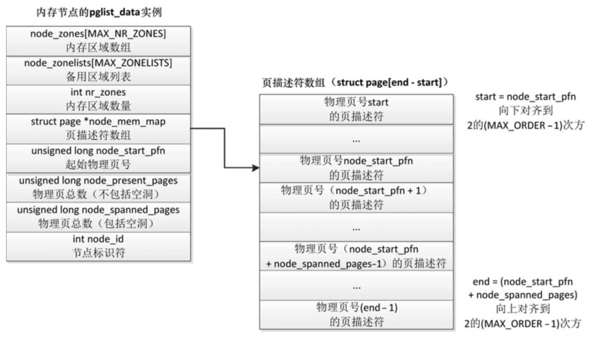

内存管理子系统使用节点(node)、区域(zone)和页(page)三级结构描述物理内存.

# 内存节点

内存节点分两种情况.

(1) NUMA 系统的内存节点, 根据处理器和内存的距离划分.

(2) 在具有不连续内存的 UMA 系统中, 表示比区域的级别更高的内存区域, 根据物理地址是否连续划分, 每块物理地址连续的内存是一个内存节点.

如图 3.16 所示, 内存节点使用一个 `pglist_data` 结构体描述内存布局. 内核定义了宏 `NODE_DATA(nid)`, 它用来获取节点的 `pglist_data` 实例. 对于平坦内存模型, 只有一个 `pglist_data` 实例: `contig_page_data`.

内存节点的 pglist data 实例:



成员 `node_id` 是节点标识符.

成员 `node_zones` 是内存区域数组, 成员 `nr_zones` 是内存节点包含的内存区域的数量.

成员 `node_start_pfn` 是起始物理页号, 成员 `node_present_pages` 是实际存在的物理页的总数, 成员 `node_spanned_pages` 是包括空洞的物理页总数.

成员 `node_mem_map` 指向页描述符数组, 每个物理页对应一个页描述符. 注意: 成员 `node_mem_map` 可能不是指向数组的第一个元素, 因为页描述符数组的大小必须对齐到 2 的 (`MAX_ORDER − 1`) 次方, (`MAX_ORDER − 1`) 是页分配器可分配的最大阶数.

`pglist_data` 结构体的主要成员如下:

```cpp
// include/linux/mmzone.h
typedef struct pglist_data {
	struct zone node_zones[MAX_NR_ZONES]; /* 内存区域数组 */
	struct zonelist node_zonelists[MAX_ZONELISTS]; /* 备用区域列表 */
	int nr_zones; /* 该节点包含的内存区域数量 */
	#ifdef CONFIG_FLAT_NODE_MEM_MAP                     /* 除了稀疏内存模型以外 */
	struct page *node_mem_map; /* 页描述符数组 */
	#ifdef CONFIG_PAGE_EXTENSION
	struct page_ext *node_page_ext; /* 页的扩展属性 */
	#endif
	#endif
	...
	unsigned long node_start_pfn; /* 该节点的起始物理页号 */
	unsigned long node_present_pages; /* 物理页总数 */
	unsigned long node_spanned_pages; /* 物理页范围的总长度, 包括空洞 */
	int node_id; /* 节点标识符 */
	...
} pg_data_t;
```

# 内存区域

内存节点被划分为内存区域, 内核定义的区域类型如下:

```cpp
// include/linux/mmzone.h
enum zone_type {
#ifdef CONFIG_ZONE_DMA
      ZONE_DMA,
#endif
#ifdef CONFIG_ZONE_DMA32
      ZONE_DMA32,
#endif
      ZONE_NORMAL,
#ifdef CONFIG_HIGHMEM
      ZONE_HIGHMEM,
#endif
      ZONE_MOVABLE,
#ifdef CONFIG_ZONE_DEVICE
      ZONE_DEVICE,
#endif
      __MAX_NR_ZONES
};
```

**DMA 区域**(`ZONE_DMA`): DMA 是 "Direct Memory Access" 的缩写, 意思是直接内存访问. 如果有些设备不能直接访问所有内存, 需要使用 DMA 区域. 例如**旧的工业标准体系结构**(`Industry Standard Architecture`, ISA)总线**只能直接访问 16MB 以下的内存**.

**DMA32 区域**(`ZONE_DMA32`): **64 位系统**, 如果既要支持只能直接访问 16MB 以下内存的设备, 又要支持**只能直接访问 4GB 以下内存**的 32 位设备, 那么必须使用 DMA32 区域.

**普通区域**(`ZONE_NORMAL`): **直接映射**到**内核虚拟地址空间**的内存区域, 直译为"普通区域", 意译为"直接映射区域"或"线性映射区域". 内核虚拟地址和物理地址是**线性映射**的关系, 即`虚拟地址 = (物理地址 + 常量)`. 是否需要使用页表映射?不同处理器的实现不同, 例如 ARM 处理器需要使用页表映射, 而 MIPS 处理器不需要使用页表映射.

**高端内存区域**(`ZONE_HIGHMEM`): 这是**32 位**时代的产物, 内核和用户地址空间按 `1:3` 划分, **内核虚拟地址空间只有 1GB**, **不能**把**1GB 以上的物理内存**直接映射到内核地址空间, 把不能直接映射的内存划分到高端内存区域. 通常把 DMA 区域、DMA32 区域和普通区域统称为低端内存区域. 64 位系统的内核虚拟地址空间非常大, 不再需要高端内存区域.

**可移动区域**(`ZONE_MOVABLE`): 它是一个**伪内存区域**, 用来**防止内存碎片**, 后面讲反碎片技术的时候具体描述.

**设备区域**(`ZONE_DEVICE`): 为支持**持久内存**(persistent memory)**热插拔**增加的内存区域.

每个内存区域用一个 zone 结构体描述, 其主要成员如下:

```cpp
// include/linux/mmzone.h
struct zone {
      unsigned long watermark[NR_WMARK];        /* 页分配器使用的水线 */
      ...
      long lowmem_reserve[MAX_NR_ZONES];         /* 页分配器使用, 当前区域保留多少页不能借给
                                                  高的区域类型 */
      ...
      struct pglist_data  *zone_pgdat;          /* 指向内存节点的 pglist_data 实例 */
      struct per_cpu_pageset __percpu *pageset; /* 每处理器页集合 */
      ...
      unsigned long     zone_start_pfn;         /* 当前区域的起始物理页号 */
      unsigned long     managed_pages;          /* 伙伴分配器管理的物理页的数量 */
      unsigned long     spanned_pages;          /* 当前区域跨越的总页数, 包括空洞 */
      unsigned long     present_pages;          /* 当前区域存在的物理页的数量, 不包括空洞 */
      const char        *name;                   /* 区域名称 */
      ...
      struct free_area  free_area[MAX_ORDER];   /* 不同长度的空闲区域 */
      ...
}
```

# 物理页

**每个物理页**对应一个 **page 结构体**, 称为页描述符, 内存节点的 pglist_data 实例的成员 node_mem_map 指向该内存节点包含的所有物理页的页描述符组成的数组.

结构体 page 的成员 flags 的布局如下:

```cpp
| [SECTION] | [NODE] | ZONE | [LAST_CPUPID] | ... | FLAGS |
```

其中, SECTION 是稀疏内存模型中的段编号, NODE 是节点编号, ZONE 是区域类型, FLAGS 是标志位.

内联函数 page_to_nid 用来得到物理页所属的内存节点的编号, page_zonenum 用来得到物理页所属的内存区域的类型.

```cpp
// include/linux/mm.h
static inline int page_to_nid(const struct page *page)
{
      return (page->flags >> NODES_PGSHIFT) & NODES_MASK;
}
static inline enum zone_type page_zonenum(const struct page *page)
{
      return (page->flags >> ZONES_PGSHIFT) & ZONES_MASK;
}
```

头文件 "`include/linux/mm_types.h`" 定义了 page 结构体. 因为物理页的数量很大, 所以在 page 结构体中增加 1 个成员, 可能导致所有 page 实例占用的内存大幅增加. 为了减少内存消耗, 内核努力使 page 结构体尽可能小, 对于不会同时生效的成员, 使用联合体, 这种做法带来的负面影响是 page 结构体的可读性差.