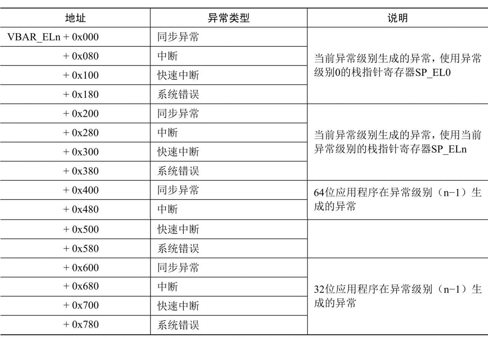

当异常发生的时候, 处理器需要执行异常的处理程序. 存储异常处理程序的内存位置称为异常向量, 通常把所有异常向量存放在一张表中, 称为异常向量表. 对于 ARM64 处理器的异常级别 1,2 和 3, 每个异常级别都有自己的异常向量表, 异常向量表的起始虚拟地址存放在寄存器 VBAR_ELn(向量基准地址寄存器, Vector Based Address Register)中.

每个异常向量表有 16 项, 分为 4 组, 每组 4 项, 每项的长度是 128 字节(可以存放 32 条指令)​. 异常级别 n 的异常向量表如表 4.1 所示.

异常级别 n 的异常向量表:



ARM64 架构内核定义的异常级别 1 的异常向量表如下:

```
    ach/arm64/kernel/entry.S
          .align    11
    ENTRY(vectors)
        ventry el1_sync_invalid    // 异常级别 1 生成的同步异常, 使用栈指针寄存器 SP_EL0
        ventry el1_irq_invalid     // 异常级别 1 生成的中断, 使用栈指针寄存器 SP_EL0
        ventry el1_fiq_invalid     // 异常级别 1 生成的快速中断, 使用栈指针寄存器 SP_EL0
        ventry el1_error_invalid   // 异常级别 1 生成的系统错误, 使用栈指针寄存器 SP_EL0
        ventry el1_sync             // 异常级别 1 生成的同步异常, 使用栈指针寄存器 SP_EL1
        ventry el1_irq              // 异常级别 1 生成的中断, 使用栈指针寄存器 SP_EL1
        ventry el1_fiq_invalid     // 异常级别 1 生成的快速中断, 使用栈指针寄存器 SP_EL1
        ventry el1_error_invalid   // 异常级别 1 生成的系统错误, 使用栈指针寄存器 SP_EL1
        ventry    el0_sync         // 64 位应用程序在异常级别 0 生成的同步异常
        ventry    el0_irq          // 64 位应用程序在异常级别 0 生成的中断
        ventry    el0_fiq_invalid  // 64 位应用程序在异常级别 0 生成的快速中断
        ventry    el0_error_invalid// 64 位应用程序在异常级别 0 生成的系统错误
    #ifdef CONFIG_COMPAT          /* 表示支持执行 32 位程序 */
        ventry    el0_sync_compat  // 32 位应用程序在异常级别 0 生成的同步异常
        ventry    el0_irq_compat   // 32 位应用程序在异常级别 0 生成的中断
        ventry    el0_fiq_invalid_compat // 32 位应用程序在异常级别 0 生成的快速中断
        ventry    el0_error_invalid_compat// 32 位应用程序在异常级别 0 生成的系统错误
    #else
        ventry    el0_sync_invalid // 32 位应用程序在异常级别 0 生成的同步异常
        ventry    el0_irq_invalid  // 32 位应用程序在异常级别 0 生成的中断
        ventry    el0_fiq_invalid  // 32 位应用程序在异常级别 0 生成的快速中断
        ventry    el0_error_invalid// 32 位应用程序在异常级别 0 生成的系统错误
    #endif
    END(vectors)
```

ventry 是一个宏, 参数是跳转标号, 即异常处理程序的标号, 宏的定义如下:

```
    arch/arm64/include/asm/assembler.h
          .macro    ventry    label
        .align 7
        b    \label
        .endm
```

把 "ventry el1_sync" 展开以后是:

```
    .align 7
    b  el1_sync
```

".align 7" 表示把下一条指令的地址对齐到 27, 即对齐到 128;"b el1_sync" 表示跳转到标号 el1_sync. 每个异常向量只有一条指令, 就是跳转到对应的处理程序.

从异常级别 1 的异常向量表可以看出如下内容.

(1) 有些异常向量的跳转标号带有 "invalid"​, 说明内核不支持这些异常, 例如内核不支持 ARM64 处理器的快速中断.

(2) 对于内核模式 (异常级别 1) 生成的异常, Linux 内核选择使用异常级别 1 的栈指针寄存器.

(3) 对于内核模式 (异常级别 1) 生成的同步异常, 入口是 el1_sync.

(4) 如果处理器处在内核模式(异常级别 1)​, 中断的入口是 el1_irq.

(5) 对于 64 位应用程序在用户模式 (异常级别 0) 下生成的同步异常, 入口是 el0_sync.

(6) 如果处理器正在用户模式 (异常级别 0) 下执行 64 位应用程序, 中断的入口是 el0_irq.

(7) 对于 32 位应用程序在用户模式 (异常级别 0) 下生成的同步异常, 入口是 el0_sync_compat.

(8) 如果处理器正在用户模式 (异常级别 0) 下执行 32 位应用程序, 中断的入口是 el0_irq_compat.

在启动过程中, 0 号处理器称为引导处理器, 其他处理器称为从处理器. 引导处理器在函数__primary_switched()中把寄存器 VBAR_EL1 设置为异常级别 1 的异常向量表的起始虚拟地址.

```
    _head()  ->  stext()  ->  __primary_switch()  ->  __primary_switched()
   arch/arm64/kernel/head.S
    __primary_switched:
        …
        adr_l x8, vectors
        msr   vbar_el1, x8        // 把寄存器 VBAR_EL1 设置为异常向量表的起始虚拟地址
        isb
        …
        b  start_kernel
    ENDPROC(__primary_switched)
```

从处理器在函数__secondary_switched()中把寄存器 VBAR_EL1 设置为异常级别 1 的异常向量表的起始虚拟地址.

```
    secondary_entry()  ->  secondary_startup()  ->  __secondary_switched()
   arch/arm64/kernel/head.S
    __secondary_switched:
        adr_l x5, vectors
        msr   vbar_el1, x5
        isb
        …
        b  secondary_start_kernel
    ENDPROC(__secondary_switched)
```
