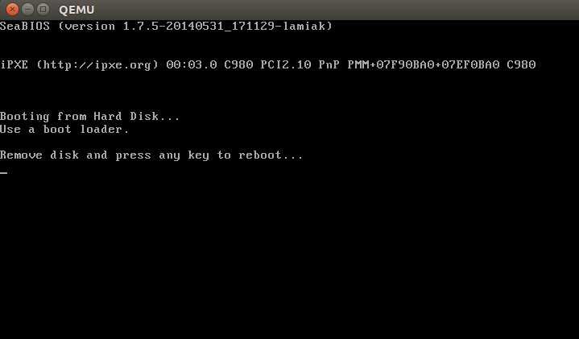

[TOC]

# 0 基本概述

如果看过我在这之前的[文章](http://0xax.blogspot.com/search/label/asm), 你就会知道我已经开始涉足底层的代码编写. 我写了一些关于 Linux x86\_64  汇编的文章. 同时, 我开始深入研究 Linux 源代码. 底层是如何工作的, 程序是如何在电脑上运行的, 它们是如何在内存中定位的, 内核是如何管理进程和内存, 网络堆栈是如何在底层工作的等等, 这些我都非常感兴趣. 因此, 我决定去写另外的一系列文章关于 **x86\_64** 框架的 Linux 内核.

**需要的基础知识**

* 理解 C 代码
* 理解 汇编语言 代码 (AT&T 语法)

我们的文章是基于 Linux 内核 3.18 版本进行的, 如果后续的内核版本有任何改变, 我将作出相应的更新.

# 1 神奇的电源按钮, 接下来会发生什么?

尽管这是一系列关于 Linux 内核的文章, 我们在第一章并不会从内核代码开始.

## 1.1 CPU 寄存器复位与实模式

电脑在你按下**电源开关**的时候, 就开始工作. **主板发送信号**给[电源](https://en.wikipedia.org/wiki/Power_supply), 而**电源**收到信号后会**给电脑供应合适的电量**. 一旦**主板**收到了[电源备妥信号](https://en.wikipedia.org/wiki/Power_good_signal), 它会尝试**启动 CPU**. CPU 则**复位寄存器的所有数据**, 并设置**每个寄存器的预定值**.

[80386](https://en.wikipedia.org/wiki/Intel_80386)
以及后来的 CPUs 在电脑复位后, 在 CPU 寄存器中定义了如下预定义数据:

```
IP          0xfff0
CS selector 0xf000
CS base     0xffff0000
```

处理器开始在[实模式](https://en.wikipedia.org/wiki/Real_mode)工作. 我们需要退回一点去理解在这种模式下的内存分段机制. 从 [8086](https://en.wikipedia.org/wiki/Intel_8086)到现在的 Intel 64 位  CPU, 所有 x86 兼容处理器都支持实模式. 8086 处理器有一个 20 位寻址总线, 这意味着它可以对 0 到 2\^20  位地址空间( 1MB )进行操作. 不过它只有 16 位的寄存器, 所以最大寻址空间是 2\^16 即 0xffff(64KB). 实模式使用[段式内存管理](http://en.wikipedia.org/wiki/Memory_segmentation)来管理整个内存空间. 所有内存被分成固定的 65536 字节(64KB)大小的小块. 由于我们不能用 16 位寄存器寻址大于 64KB 的内存, 一种替代的方法被设计出来了. 一个地址包括两个部分: 数据段起始地址和从该数据段起的偏移量. 为了得到内存中的物理地址, 我们要让**数据段乘 16 并加上偏移量**:

```
PhysicalAddress = Segment * 16 + Offset
```

举个例子, 如果 CS:IP 是 0x2000:0x0010, 则对应的物理地址将会是:

```python
>>> hex((0x2000 << 4) + 0x0010)
'0x20010'
```

不过如果我们使用 16 位 2 进制能表示的最大值进行寻址: 0xffff:0xffff, 根据上面的公式, 结果将会是:

```python
>>> hex((0xffff << 4) + 0xffff)
'0x10ffef'
```

这超出 1MB 65519 字节. 既然实模式下,  CPU 只能访问 1MB 地址空间, `0x10ffef` 变成有 [A20](https://en.wikipedia.org/wiki/A20_line) 缺陷的 `0x00ffef`.

我们了解了实模式和在实模式下的内存寻址方式, 让我们来回头继续来看复位后的寄存器值.

**CS 寄存器**包含**两个部分**: **可视段选择器**和**隐含基址**.  结合之前定义的**CS 基址和 IP 值**, 逻辑地址应该是:

```
0xffff0000:0xfff0
```

这种形式的**起始地址**为**EIP 寄存器里的值**加上**基址地址**:

```python
>>> 0xffff0000 + 0xfff0
'0xfffffff0'
```

## 1.2 BIOS 代码

上面得到的 0xfffffff0 是 4GB \- 16 字节.  这个地方是 [复位向量(Reset vector)](http://en.wikipedia.org/wiki/Reset_vector) .  这是**CPU 在重置后**期望执行的**第一条指令的内存地址**. 它包含一个 [**jump**](http://en.wikipedia.org/wiki/JMP_%28x86_instruction%29) **指令**, 这个指令**通常指向 BIOS 入口点(！！！**). 举个例子, 如果访问 [coreboot](http://www.coreboot.org/) 源代码, 将看到:

```assembly
	.section ".reset", "ax", %progbits
	.code16
.globl	_start
_start:
	.byte  0xe9
	.int   _start16bit - ( . + 2 )
	...
```

上面的跳转指令( [opcode](http://ref.x86asm.net/coder32.html#xE9) - 0xe9)跳转到地址 `_start16bit - ( . + 2)` 去执行代码. **reset 段**是**16 字节代码段**,  起始于地址**0xfffffff0**(**src/cpu/x86/16bit/reset16.ld**), 因此 **CPU 复位**之后, 就会**跳到这个地址来执行相应的代码** :

```
SECTIONS {
	/* Trigger an error if I have an unuseable start address */
 	_bogus = ASSERT(_start16bit >= 0xffff0000, "_start16bit too low. Please report.");
	_ROMTOP = 0xfffffff0;
	. = _ROMTOP;
	.reset . : {
		*(.reset);
		. = 15;
		BYTE(0x00);
	}
}
```

现在**BIOS 已经开始工作**了. 在**初始化和检查硬件**之后, 需要**寻找到一个可引导设备**. **可引导设备列表**存储在在 **BIOS 配置**中, BIOS 将根据其中**配置的顺序**, 尝试从**不同的设备上寻找引导程序**.

## 1.3 可启动设备

对于**硬盘**, BIOS 将尝试**寻找引导扇区**. 如果在硬盘上存在一个**MBR 分区**, 那么**引导扇**区储存在**第一个扇区(512 字节)的头 446 字节**, 引导扇区的最后必须是**0x55 和 0xaa**, 这 2 个字节称为魔术字节(Magic Bytes), 如果 BIOS 看到这 2 个字节, 就知道这个设备是一个可引导设备. 举个例子:

```assembly
;
; Note: this example is written in Intel Assembly syntax
;
[BITS 16]
[ORG  0x7c00]

boot:
    mov al, '!'
    mov ah, 0x0e
    mov bh, 0x00
    mov bl, 0x07

    int 0x10
    jmp $

times 510-($-$$) db 0

db 0x55
db 0xaa
```

构建并运行:

```
nasm -f bin boot.nasm && qemu-system-x86_64 boot
```

这让 [QEMU](http://qemu.org) 使用刚才新建的 boot 二进制文件作为磁盘镜像. 由于这个二进制文件是由上述汇编语言产生, 它满足**引导扇区**(**起始设为 0x7c00, 用 Magic Bytes 结束！！！**)的需求. QEMU 将这个二进制文件作为磁盘镜像的主引导记录(MBR).

将看到:


在这个例子中, 这段代码被执行在**16 位的实模式**, **起始于内存 0x7c00**. 之后调用 [**0x10**](http://www.ctyme.com/intr/rb-0106.htm) **中断**打印 `!` 符号. 用 0 填充剩余的 510 字节并用两个 Magic Bytes 0xaa 和 0x55 结束.

可以使用 `objdump` 工具来查看转储信息:

```
nasm -f bin boot.nasm
objdump -D -b binary -mi386 -Maddr16,data16,intel boot
```

一个**真实的启动扇区**包含了**分区表**, 以及用来**启动系统的指令**, 而不是像我们上面的程序, 只是输出了一个感叹号就结束了.

从**启动扇区的代码被执行**开始, **BIOS**就将**系统的控制权转移给了引导程序**, 让我们继续往下看看引导程序都做了些什么.

**NOTE**: 强调一点, 上面的引导程序是运行在**实模式**下的, 因此 CPU 是使用下面的公式进行**物理地址的计算**的:

```
PhysicalAddress = Segment * 16 + Offset
```

而且正如我前面所说的, 在**实模式**下, CPU 只能使用**16 位的通用寄存器**. 16 位寄存器能够表达的**最大数值是 0xffff**, 所以按照上面的公式计算出的最大物理地址是:

```python
>>> hex((0xffff * 16) + 0xffff)
'0x10ffef'
```

这个地址在 [8086](https://en.wikipedia.org/wiki/Intel_8086) 处理器下, 将**被转换成地址 0x0ffef**, 原因是因为, 8086 cpu 只有**20 位地址线**, 只能表示 `2^20 = 1MB` 的地址, 而上面这个地址已经超出了 1MB 地址的范围, 所以 CPU 就**舍弃了最高位**.

**实模式**下的**1MB 地址空间分配表**:

```
0x00000000 - 0x000003FF - Real Mode Interrupt Vector Table
0x00000400 - 0x000004FF - BIOS Data Area
0x00000500 - 0x00007BFF - Unused
0x00007C00 - 0x00007DFF - Our Bootloader
0x00007E00 - 0x0009FFFF - Unused
0x000A0000 - 0x000BFFFF - Video RAM (VRAM) Memory
0x000B0000 - 0x000B7777 - Monochrome Video Memory
0x000B8000 - 0x000BFFFF - Color Video Memory
0x000C0000 - 0x000C7FFF - Video ROM BIOS
0x000C8000 - 0x000EFFFF - BIOS Shadow Area
0x000F0000 - 0x000FFFFF - System BIOS
```

如果你的记性不错, 在看到这张表的时候, 一定会跳出来一个问题. 在上面的章节中, 我说了 CPU 执行的**第一条指令**是在**地址 0xFFFFFFF0 处**, 这个地址**远远大于 0xFFFFF(1MB**). 那么实模式下的 CPU 是如何访问到这个地址的呢?文档 [coreboot](http://www.coreboot.org/Developer_Manual/Memory_map) 给出了答案:

```
0xFFFE_0000 - 0xFFFF_FFFF: 128 kilobyte ROM mapped into address space
```

**0xFFFFFFF0**这个地址**被映射到了 ROM**, 因此 CPU 执行的第一条指令**来自于 ROM**, 而**不是 RAM**.

# 2 引导程序

## 2.1 概述

在现实世界中, 要启动 Linux 系统, 有**多种引导程序**可以选择. 比如 [GRUB 2](https://www.gnu.org/software/grub/) 和 [syslinux](http://www.syslinux.org/wiki/index.php/The_Syslinux_Project).

Linux 内核通过[**Boot protocol！！！**](http://lxr.free-electrons.com/source/Documentation/x86/boot.txt?v=3.18) 来**定义应该如何实现引导程序**. 在这里我们将只介绍 **GRUB 2**.

## 2.2 引导操作系统的流程

总结:

**BIOS** \-\> **可启动设备**的**启动扇区**(Grub2 的一部分, 必要初始化) \-\> GRUB2 的**core image**(将**GRUB2 的内核代码**和**文件系统驱动**加载到**内存**) \-\> GRUB2 的 core image(**grub\_main**, 初始化**控制台**, 计算**模块基地址**, 设置**root 设备**, 读取**grub 文件**, 加载模块, **置 GRUB 为 normal 模式**) \-\> **grub\_normal\_execute**(列出**操作系统菜单**) \-\> **grub\_menu\_execute\_entry**(调用**grub 的 boot 命令**, 引导 OS)

现在 BIOS 已经选择了一个启动设备, 并且将**控制权转移**给了**启动扇区中的代码**, 在我们的例子中, **启动扇区代码**是[**boot.img**](http://git.savannah.gnu.org/gitweb/?p=grub.git;a=blob;f=grub-core/boot/i386/pc/boot.S;hb=HEAD). 因为这段代码只能占用一个扇区, 因此非常简单, 只做一些**必要的初始化**, 然后就**跳转到 GRUB 2\'s core image**去执行. **Core image 的代码**请参考[diskboot.img](http://git.savannah.gnu.org/gitweb/?p=grub.git;a=blob;f=grub-core/boot/i386/pc/diskboot.S;hb=HEAD), 一般来说, **core image**在**磁盘**上存储在**启动扇区之后到第一个可用分区之前**. core image 的初始化代码会把整个**core image**(包括 **GRUB 2 的内核代码**和**文件系统驱动**) 引导到**内存**中.  **引导完成**之后, [**grub\_main**](http://git.savannah.gnu.org/gitweb/?p=grub.git;a=blob;f=grub-core/kern/main.c)将被调用.

grub\_main 初始化**控制台**, 计算**模块基地址**, 设置**root 设备**, 读取**grub 配置文件**, **加载模块**. 最后, 将 GRUB 置于**normal 模式**, 在这个模式中, **grub\_normal\_execute**(from **grub\-core/normal/main.c**) 将被调用以完成**最后的准备工作**, 然后**显示一个菜单**列出**所有可用的操作系统**. 当某个操作系统被选择之后, **grub\_menu\_execute\_entry**开始执行, 它将调用**GRUB 的 boot 命令**, 来引导被选中的操作系统.

## 2.3 Linux 的 boot protocol

就像**kernel boot protocol 所描述**的, **引导程序(！！！**)必须填充**kernel setup header**(位于**kernel setup code 偏移 0x01f1 处**)的**必要字段**.

**kernel setup header 的定义**开始于 [**arch/x86/boot/header.S**](http://lxr.free-electrons.com/source/arch/x86/boot/header.S?v=3.18):

```assembly
	.globl hdr
hdr:
	setup_sects: .byte 0
	root_flags:  .word ROOT_RDONLY
	syssize:     .long 0
	ram_size:    .word 0
	vid_mode:    .word SVGA_MODE
	root_dev:    .word 0
	boot_flag:   .word 0xAA55
```

**bootloader**必须**填充**在**Linux boot protocol**中**标记为 write 的头信息**, 比如[type\_of\_loader](http://lxr.free-electrons.com/source/Documentation/x86/boot.txt?v=3.18#L354), 这些**头信息可能来自命令行**, 或者通过**计算得到**.

在这里我们不会详细介绍所有的 kernel setup header, 我们将在需要的时候逐个介绍. 不过, 你可以自己通过 [boot protocol](http://lxr.free-electrons.com/source/Documentation/x86/boot.txt?v=3.18#L156) 来了解这些设置.

通过阅读 **kernel boot protocol**, 在**内核被引导入内存**后, **内存使用情况将入下表**所示:

```shell
         | Protected-mode kernel  |
100000   +------------------------+
         | I/O memory hole        |
0A0000   +------------------------+
         | Reserved for BIOS      | Leave as much as possible unused
         ~                        ~
         | Command line           | (Can also be below the X+10000 mark)
X+10000  +------------------------+
         | Stack/heap             | For use by the kernel real-mode code.
X+08000  +------------------------+
         | Kernel setup           | The kernel real-mode code.
         | Kernel boot sector     | The kernel legacy boot sector.
       X +------------------------+
         | Boot loader            | <- Boot sector entry point 0x7C00
001000   +------------------------+
         | Reserved for MBR/BIOS  |
000800   +------------------------+
         | Typically used by MBR  |
000600   +------------------------+
         | BIOS use only          |
000000   +------------------------+

```

所以当 **bootloader 完成任务**, 将**执行权移交给 kernel**, kernel 的代码从**以下地址开始执行**:

```
0x1000 + X + sizeof(KernelBootSector) + 1
个人以为应该是 X + sizeof(KernelBootSector) + 1 因为 X 已经是一个具体的物理地址了, 不是一个偏移
```

上面的公式中, X 是**kernel bootsector**被引导入**内存的位置**. 在我的机器上,  `X` 的值是 `0x10000`, 我们可以通过 memory dump 来检查这个地址:


到这里, 引导程序完成它的使命, 并将控制权移交给了 Linux kernel. 下面我们就来看看**kernel setup code**都做了些什么.

# 3 内核设置

经过上面的一系列操作, 我们终于**进入到内核**了. 不过从技术上说, 内核还没有被运行起来, 因为首先我们需要正确**设置内核**, 启动**内存管理**, **进程管理**等等.

**内核设置代码**的运行起点是 [**arch/x86/boot/header.S**](http://lxr.free-electrons.com/source/arch/x86/boot/header.S?v=3.18) 中定义的[\_start](http://lxr.free-electrons.com/source/arch/x86/boot/header.S?v=3.18#L293) 函数.  在\_**start 函数开始之前**, 还有**很多的代码**, 那这些代码是做什么的呢?

实际上\_**start 开始之前**的代码是**kenerl 自带的 bootloader**. 在**很久以前**, 是可以使用这个 bootloader 来启动 Linux 的. 不过在**新的 Linux** 中, 这个 bootloader 代码已经**不再启动 Linux 内核**, 而只是**输出一个错误信息**.  如果你运行下面的命令, **直接使用 Linux 内核来启动**, 你会看到下图所示的错误:

```
qemu-system-x86_64 vmlinuz-3.18-generic
```



为了能够作为 bootloader 来使用, **header.S**开始处定义了[**MZ**](https://en.wikipedia.org/wiki/DOS_MZ_executable) **魔术数字**, 并且定义了[**PE**](https://en.wikipedia.org/wiki/Portable_Executable) 头, 在**PE 头**中**定义了输出的字符串**:

```assembly
#ifdef CONFIG_EFI_STUB
# "MZ", MS-DOS header
.byte 0x4d
.byte 0x5a
#endif
...
...
...
pe_header:
	.ascii "PE"
	.word 0
```

之所以代码需要这样写, 这个是因为遵从[**UEFI**](https://en.wikipedia.org/wiki/Unified_Extensible_Firmware_Interface) 的**硬件**需要这样的结构**才能正常引导操作系统**.

去除这些作为**bootloader 使用**的代码, **真正的内核代码**就从\_**start**开始了:

```
// header.S line 292
.globl _start
_start:
```

**其他的 bootloader** (grub2 and others) 知道 \_**start 所在的位置**(**从 MZ 头开始偏移 0x200 字节！！！**), 所以这些**bootloader**就会**忽略所有在这个位置前的代码(这些之前的代码位于\.bstext 段中！！！**), 直接跳转到这个位置**启动内核**.

```
//
// arch/x86/boot/setup.ld
//
. = 0;                    // current position
.bstext : { *(.bstext) }  // put .bstext section to position 0
.bsdata : { *(.bsdata) }
```

```assembly
	.globl _start
_start:
	.byte 0xeb
	.byte start_of_setup-1f
1:
	//
	// rest of the header
	//
```

`_start` 开始就是一个 `jmp` 语句(`jmp` 语句的 opcode 是 `0xeb` ), 这个跳转语句是一个短跳转, 跟在后面的是一个相对地址 ( `start_of_setup - 1f ` ). 在汇编代码中 `Nf` 代表了当前代码之后第一个标号为 `N` 的代码段的地址. 回到我们的代码, 在 `_start` 标号之后的第一个标号为 `1` 的代码段中包含了剩下的 setup header 结构. 在标号为 `1` 的代码段结束之后, 紧接着就是标号为 `start_of_setup` 的代码段 (这个代码段位于 `.entrytext` 代码区, 这个代码段中的第一条指令实际上是内核开始执行之后的第一条指令) .

下面让我们来看一下 GRUB2 的代码是如何跳转到 `_start` 标号处的. 从 Linux 内核代码中, 我们知道 `_start` 标号的代码位于偏移 `0x200` 处. 在 GRUB2 的源代码中我们可以看到下面的代码:

```C
  state.gs = state.fs = state.es = state.ds = state.ss = segment;
  state.cs = segment + 0x20;
```

在我的机器上, 因为我的内核代码被加载到了内存地址 `0x10000` 处, 所以在上面的代码执行完成之后 `cs = 0x1020` ( 因此第一条指令的内存地址将是 `cs << 4 + 0 = 0x10200`, 刚好是 `0x10000` 开始后的 `0x200` 处的指令):

```
fs = es = ds = ss = 0x1000
cs = 0x1020
```

从 `start_of_setup` 标号开始的代码需要完成下面这些事情:

* 将所有段寄存器的值设置成一样的内容
* 设置堆栈
* 设置 [bss](https://en.wikipedia.org/wiki/.bss) (静态变量区)
* 跳转到 [main.c](http://lxr.free-electrons.com/source/arch/x86/boot/main.c?v=3.18) 开始执行代码

# 4 段寄存器设置

在代码的一开始, 就将 `ds` 和 `es` 段寄存器的内容设置成一样, 并且使用指令 `sti` 来允许中断发生:

```assembly
	movw	%ds, %ax
	movw	%ax, %es
	sti
```

就像我在上面一节中所写的,  为了能够跳转到 `_start` 标号出执行代码, grub2 将 `cs` 段寄存器的值设置成了 `0x1020`, 这个值和其他段寄存器都是不一样的, 因此下面的代码就是将 `cs` 段寄存器的值和其他段寄存器一致:

```assembly
	pushw	%ds
	pushw	$6f
	lretw
```

上面的代码使用了一个小小的技巧来重置 `cs` 寄存器的内容, 下面我们就来仔细分析.  这段代码首先将 `ds`寄存器的值入栈, 然后将标号为 [6](http://lxr.free-electrons.com/source/arch/x86/boot/header.S?v=3.18#L494) 的代码段地址入栈 , 接着执行 `lretw` 指令, 这条指令, 将把标号为 `6` 的内存地址放入 `ip` 寄存器 ([instruction pointer](https://en.wikipedia.org/wiki/Program_counter)), 将 `ds` 寄存器的值放入 `cs` 寄存器.  这样一来 `ds` 和 `cs` 段寄存器就拥有了相同的值.

# 5 设置堆栈

绝大部分的 setup 代码都是为 C 语言运行环境做准备. 在设置了 ds 和 es 寄存器之后, 接下来 [step](http://lxr.free-electrons.com/source/arch/x86/boot/header.S?v=3.18#L467) 的代码将检查 ss 寄存器的内容, 如果寄存器的内容不对, 那么将进行更正:

```assembly
	movw	%ss, %dx
	cmpw	%ax, %dx
	movw	%sp, %dx
	je	2f
```

当进入这段代码的时候,  **ss 寄存器**的值可能是一下三种情况之一:

- ss 寄存器的值是 0x10000 ( 和其他除了 cs 寄存器之外的所有寄存器的一样)
- ss 寄存器的值不是 0x10000, 但是 CAN\_USE\_HEAP 标志被设置了
- ss 寄存器的值不是 0x10000, 同时 CAN\_USE\_HEAP 标志没有被设置

下面我们就来分析在这三中情况下, 代码都是如何工作的:

- ss 寄存器的值是 0x10000, 在这种情况下, 代码将直接跳转到标号为 `2` 的代码处执行:

```
2: 	andw	$~3, %dx
	jnz	3f
	movw	$0xfffc, %dx
3:  movw	%ax, %ss
	movzwl %dx, %esp
	sti
```

这段代码首先将 `dx` 寄存器的值(就是当前`sp` 寄存器的值)4 字节对齐, 然后检查是否为 0(如果是 0, 堆栈就不对了, 因为堆栈是从大地址向小地址发展的), 如果是 0, 那么就将 `dx` 寄存器的值设置成 `0xfffc` (64KB 地址段的最后一个 4 字节地址). 如果不是 0, 那么就保持当前值不变. 接下来, 就将 `ax` 寄存器的值( 0x10000 )设置到 `ss` 寄存器, 并根据 `dx` 寄存器的值设置正确的 `sp`. 这样我们就得到了正确的堆栈设置, 具体请参考下图:


* 下面让我们来看 `ss` != `ds`的情况, 首先将 setup code 的结束地址 [_end](http://lxr.free-electrons.com/source/arch/x86/boot/setup.ld?v=3.18#L52) 写入 `dx` 寄存器. 然后检查 `loadflags` 中是否设置了 `CAN_USE_HEAP` 标志.    根据 kernel boot protocol 的定义, [loadflags](http://lxr.free-electrons.com/source/arch/x86/boot/header.S?v=3.18#L321) 是一个标志字段. 这个字段的 `Bit 7` 就是 `CAN_USE_HEAP` 标志:

```
Field name:	loadflags

  This field is a bitmask.

  Bit 7 (write): CAN_USE_HEAP
	Set this bit to 1 to indicate that the value entered in the
	heap_end_ptr is valid.  If this field is clear, some setup code
	functionality will be disabled.
```

`loadflags` 字段其他可以设置的标志包括:

```C
#define LOADED_HIGH	    (1<<0)
#define QUIET_FLAG	    (1<<5)
#define KEEP_SEGMENTS	(1<<6)
#define CAN_USE_HEAP	(1<<7)
```

如果 `CAN_USE_HEAP` 被置位, 那么将 `heap_end_ptr` 放入 `dx` 寄存器, 然后加上 `STACK_SIZE` (最小堆栈大小是 512 bytes). 在加法完成之后, 如果结果没有溢出(CF flag 没有置位, 如果置位那么程序就出错了), 那么就跳转到标号为 `2` 的代码处继续执行(这段代码的逻辑在 1 中已经详细介绍了), 接着我们就得到了如下图所示的堆栈:


* 最后一种情况就是 `CAN_USE_HEAP` 没有置位,  那么我们就将 `dx` 寄存器的值加上 `STACK_SIZE`, 然后跳转到标号为 `2` 的代码处继续执行, 接着我们就得到了如下图所示的堆栈:


# 6 BSS 段设置

在我们正式执行 C 代码之前, 我们还有 2 件事情需要完成. 1)设置正确的 [BSS](https://en.wikipedia.org/wiki/.bss)段 ; 2)检查 `magic` 签名. 接下来的代码, 首先检查 `magic` 签名 [setup_sig](http://lxr.free-electrons.com/source/arch/x86/boot/setup.ld?v=3.18#L39), 如果签名不对, 直接跳转到 `setup_bad` 部分执行代码:

```assembly
cmpl	$0x5a5aaa55, setup_sig
jne	setup_bad
```

如果 `magic` 签名是对的,  那么我们只要设置好 `BSS` 段, 就可以开始执行 C 代码了.

BSS 段用来存储那些没有被初始化的静态变量. 对于这个段使用的内存,  Linux 首先使用下面的代码将其全部清零:

```assembly
	movw	$__bss_start, %di
	movw	$_end+3, %cx
	xorl	%eax, %eax
	subw	%di, %cx
	shrw	$2, %cx
	rep; stosl
```

在这段代码中, 首先将 [__bss_start](http://lxr.free-electrons.com/source/arch/x86/boot/setup.ld?v=3.18#L47) 地址放入 `di` 寄存器, 然后将 `_end + 3` (4 字节对齐) 地址放入 `cx`, 接着使用 `xor` 指令将 `ax` 寄存器清零, 接着计算 BSS 段的大小 ( `cx` - `di` ), 然后将大小放入 `cx` 寄存器. 接下来将 `cx` 寄存器除 4, 最后使用 `rep; stosl` 指令将 `ax` 寄存器的值(0)写入 寄存器整个 BSS 段.  代码执行完成之后, 我们将得到如下图所示的 BSS 段:


# 7 跳转到 main 函数

到目前为止, 我们完成了堆栈和 BSS 的设置, 现在我们可以正式跳入 `main()` 函数来执行 C 代码了:

```assembly
	calll main
```

`main()` 函数定义在 [arch/x86/boot/main.c](http://lxr.free-electrons.com/source/arch/x86/boot/main.c?v=3.18), 我们将在下一章详细介绍这个函数做了什么事情.

# 8 结束语

本章到此结束了, 在下一章中我们将详细介绍在 Linux 内核设置过程中调用的第一个 C 代码( `main()` ), 也将介绍诸如 `memset`, `memcpy`, `earlyprintk` 这些底层函数的实现, 敬请期待.

如果你有任何的问题或者建议, 你可以留言, 也可以直接发消息给我[twitter](https://twitter.com/0xAX).

**如果你发现文中描述有任何问题, 请提交一个 PR 到 [linux-insides-zh](https://github.com/MintCN/linux-insides-zh) . **

# 9 相关链接

- [Intel 80386 programmer's reference manual 1986](http://css.csail.mit.edu/6.858/2014/readings/i386.pdf)
- [Minimal Boot Loader for Intel® Architecture](https://www.cs.cmu.edu/~410/doc/minimal_boot.pdf)
- [8086](http://en.wikipedia.org/wiki/Intel_8086)
- [80386](http://en.wikipedia.org/wiki/Intel_80386)
- [Reset vector](http://en.wikipedia.org/wiki/Reset_vector)
- [Real mode](http://en.wikipedia.org/wiki/Real_mode)
- [Linux kernel boot protocol](https://www.kernel.org/doc/Documentation/x86/boot.txt)
- [CoreBoot developer manual](http://www.coreboot.org/Developer_Manual)
- [Ralf Brown's Interrupt List](http://www.ctyme.com/intr/int.htm)
- [Power supply](http://en.wikipedia.org/wiki/Power_supply)
- [Power good signal](http://en.wikipedia.org/wiki/Power_good_signal)