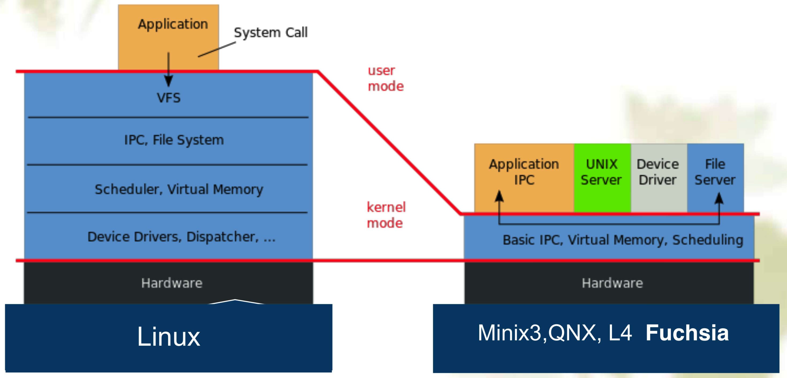
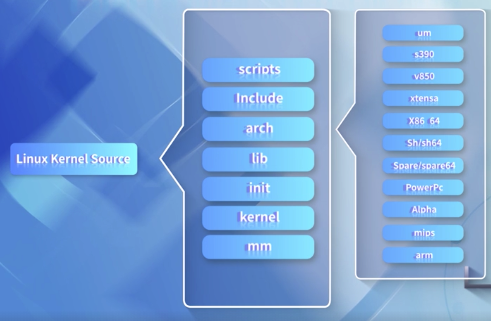
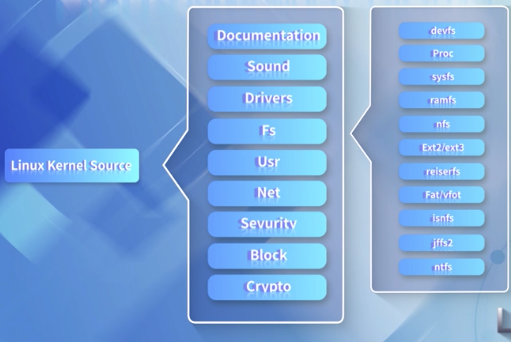
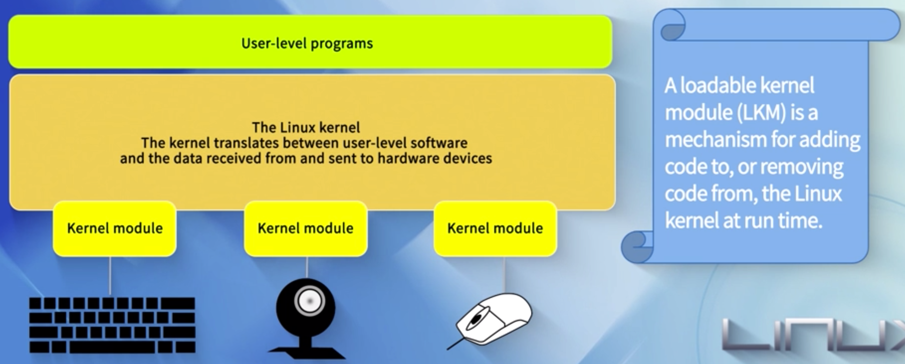
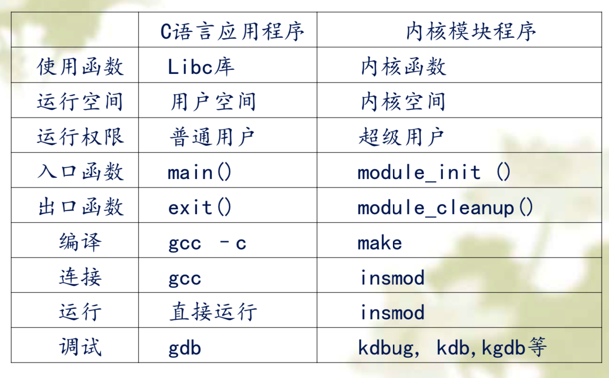

<!-- @import "[TOC]" {cmd="toc" depthFrom=1 depthTo=6 orderedList=false} -->

<!-- code_chunk_output -->

- [1. 单内核与微内核](#1-单内核与微内核)
- [2. Linux 内核源码目录结构](#2-linux-内核源码目录结构)
- [3. 可加载的 Linux 内核模块(LKM)](#3-可加载的-linux-内核模块 lkm)
- [4. Linux 内核模块编程入门](#4-linux-内核模块编程入门)
  - [4.1. 程序](#41-程序)
  - [4.2. 内核模块的 Makefile 文件](#42-内核模块的-makefile-文件)
  - [4.3. 插入删除模块](#43-插入删除模块)
- [5. Linux 内核模块与 C 应用的对比](#5-linux-内核模块与-c-应用的对比)

<!-- /code_chunk_output -->

# 1. 单内核与微内核

Linux 是一个单内核结构



单内核结构, 也就是说操作系统的各个子系统比如说文件系统、内存管理、进程管理以及网络系统、进程通信它们互相之间可以直接调用,

微内核结构, 只有一些核心代码放在微内核里, 比如核心的进程间通信、中断以及调度程序放在微内核, 而其他的比如文件系统、内存管理等可能以服务器的方式放在外部

单内核和微内核在业界一直有争议的, 各有特点.

单内核由于子系统之间能相互调用, 所以它的性能比较高, 但是可维护性比较差;

微内核的内核与服务器之间是一种通信的关系, 比如说当要发出一个请求的时候文件系统可能要和微内核进行通信, 而通信是有代价的, 所以微内核的效率比较低, 但是因为这种架构各个服务器之间相互独立, 它的可维护性比较好, 目前业界比如说 Minix 系统、QNX、L4、 谷歌最新的 FUchsia 操作系统都是微内核.

# 2. Linux 内核源码目录结构

当我们了解 Linux 的内核的时候, 我们直接进入源代码, 这里我们有一个 Linux 内核源码的目录结构





在这个目录下, mm 目录下就存放的是内存管理的代码, fs 目录就是文件系统的代码, ipc 目录下就是进程间通信的代码, 以及驱动程序等等都是以各自目录形式存放在它的目录下, 通过源码目录结构可知它确实是一个单内核的结构

# 3. 可加载的 Linux 内核模块(LKM)

前面提到, 单内核的模块有一个缺点就是可维护性比较差, 当我们想增加一个新功能, 比如要写一个驱动程序、写一个文件系统, 怎么样才能融入到内核里面? 因为 Linux 内核现在非常庞大, 要编译一次内核要花很长时间, 那能不能有种方法, 让我们写的代码, 不需要完全和 Linux 内核捆绑在一起, 所以 Linux 内核提供了一种机制叫做"可加载的 Linux 内核模块(LKM)", 什么意思呢? 就是说在 Linux 内核运行的过程中, 可以把这个模块加载进 Linux 内核, 当不需要这个模块时候, 即使 Linux 内核在运行, 我们可以把这个模块取下来, 即卸载.

A loadable kernel module(LKM) is a mechanism for adding code to, or removing code form, the Linux kernel at run time.



# 4. Linux 内核模块编程入门

## 4.1. 程序

如何编写 Linux 内核模块呢, 我们编写一个 helloworld 这样一个简单程序一样, 看一下如何入门.

```c
// helloworld.c
# include <linux/init.h>
# include <linux/kernel.h>
# include <linux/module.h>

/*
    内核模块初始化函数 lkp_init()
    __init 是用于初始化的修饰符
*/
static int __init lkp_init(void)
{
	printk("<1>Hello, world! From the kernel\n");
	return 0;
}

//内核模块退出函数
/*
    内核模块退出和清理函数 lkp_exit()
    __exit 是用于退出的修饰符
*/
static void __exit lkp_exit(void)
{
	printk("<1>Goodbye, world! Leaving kernel\n");
}

module_init(lkp_init);
module_exit(lkp_exit);

/*
    模块的许可证声明 GPL

*/
MODULE_LICENSE("GPL");
```

在普通用户下, 想要输出的话用 printf, 那么在 Linux 内核下还能用 printf 这个函数吗? 不能再用了, 因为现在已经进入 Linux 内核编程了, **不能再使用库函数**了, 而必须使用**Linux 内核的源代码**, 所以 printf 函数就换成 printk(k 也就是 kernel 的意思), 那输出到什么地方呢? 内核是没有显示终端的, 所以它的输出是输出到日志文件里头, 那这个 printk 函数包含在哪个头文件里面呢? 它有一个头文件叫 kernel.h, 所以要写这个一个内核模块, 第一个要认识的函数就是 printk.

在这里我们看到这个函数, 名字叫`lkp_init`, 名字可以自己取, 函数作用是模块的入口函数, 另一个函数`lkp_exit`, 相当于我们卸载模块的时候, 这个函数才会执行.

`module_init`是用来调用初始化函数, 它的参数是一个函数名, 那么这个函数放在哪一个头文件里, module.h 头文件.

这里还有两个不认识的东西, 就是`__init`和`__exit`, 什么意思呢, `__init`它告诉编译程序, 当这个模块执行完后把这个内存空间回收回来, 所以这两个函数到底什么时候执行呢, 当模块插入进来的时候, 它执行初始化的函数; 当模块卸载的时候, 它执行的是退出函数.

任何模块都要包含的三个头文件:

```c
#include <linux/module.h>
#include <linux/kernel.h>
#include <linux/init.h>
```

* module.h 头文件包含了对模块的版本控制;
* kernel.h 包含了常用的内核函数;
* init.h 包含了宏`__init`和`__exit`, 宏`__init`告诉编译程序相关的函数和变量仅用于初始化, 编译程序将标有`__init`的所有代码存储到特殊的内存段中, 初始化结束就释放这段内存.

在此使用了 printk()函数, 该函数是由内核定义的, 功能与 C 库中的 printf()类似, 它要把打印的日志输出到终端或系统日志. 字符串中的`<1>`是输出的级别, 表示立即在终端输出.

## 4.2. 内核模块的 Makefile 文件

内核模块并不是独立的可执行文件, 但在**内核运行时**其目标文件被链接到内核中.

如何编译内核模块呢, 不能用一般的编译方法, 必须写 Makefile 文件, Makefile 有一定的规则, 但它的**核心思想**是**告诉编译程序**那些**头文件都存放在哪个地方**.

```makefile
#Makefile 文件注意: 假如前面的.c 文件起名为 first.c, 那么这里的 Makefile 文件中的.o 文
#件就要起名为 first.o    只有 root 用户才能加载和卸载模块
obj-m:=helloworld.o                          #产生 helloworld 模块的目标文件
#目标文件  文件  要与模块名字相同

CURRENT_PATH:=$(shell pwd)             #模块所在的当前路径
LINUX_KERNEL:=$(shell uname -r)        #linux 内核代码的当前版本
LINUX_KERNEL_PATH:=/usr/src/linux-headers-$(LINUX_KERNEL)   #linux 内核源代码的绝对路径

all:
	make -C $(LINUX_KERNEL_PATH) M=$(CURRENT_PATH) modules    #编译模块
#[Tab]              内核的路径       当前目录编译完放哪  表明编译的是内核模块

clean:
	make -C $(LINUX_KERNEL_PATH) M=$(CURRENT_PATH) clean      #清理模块
```

在这个文件里面我们看定义了三个变量,

* 一个是路径的变量, 它指明我们当前的路径是什么,
* 第二个变量指明我们内核的版本号
* 第三个变量是内核源代码所在的路径

`obj-m:=`这个赋值语句的含义是说明要使用目标文件 helloworld.o 建议一个模块, 最后生成的模块名为 helloworld.ko. \.o 文件是经过编译和汇编, 而没有经过链接的中间文件.

注: makefile 文件中, 若某一行是命令, 则它必须以一个 Tab 键开头

这里强调下, 在编译 Linux 内核的时候, 一定要明确你在哪个系统下, 我们这种格式指的是在 ubuntu 下, 如果用其他系统就需要特别注意, 所以 Linux 内核模块编译是最容易出错的地方, Makefile 格式也有严格的规定.

## 4.3. 插入删除模块

当将 Linux 内核模块编译好以后, 就可以把它插入到内核里面去,

模块插入命令:

```
$insmod module_example.ko
```

模块删除命令:

```
$rmmod module_example
```

查看模块信息的命令:

```
$dmesg
```

# 5. Linux 内核模块与 C 应用的对比

当我们写一个 Linux 内核模块的时候, 实际上我们在 Linux 内核态下编程, 这和普通用户编程有什么区别?



强调下, 进入 Linux 内核, 相当于进入了一个完全不同的世界了, 虽然用户态下编程的一些经验可以用, 但是有很大的差异性, 这个时候我们一定要对 Linux 内核的源代码逐渐的熟悉,