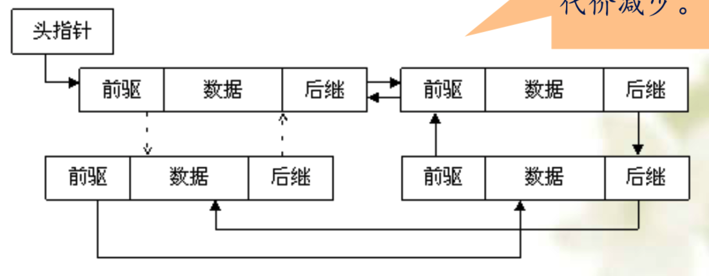
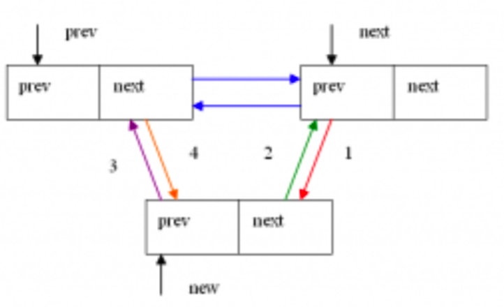
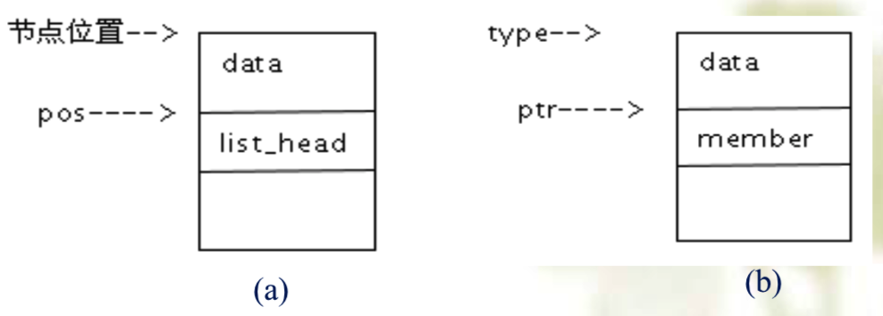
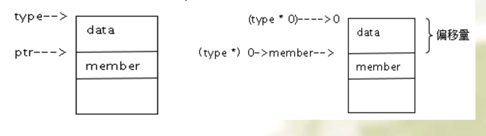

<!-- @import "[TOC]" {cmd="toc" depthFrom=1 depthTo=6 orderedList=false} -->

<!-- code_chunk_output -->

- [1. 链表的演化](#1-链表的演化)
- [2. Linux 内核中链表的定义和使用](#2-linux-内核中链表的定义和使用)
  - [2.1. 链表的初始化](#21-链表的初始化)
  - [2.2. 链表的插入](#22-链表的插入)
  - [2.3. 链表的遍历](#23-链表的遍历)
- [3. Linux 内核代码移植到用户空间](#3-linux-内核代码移植到用户空间)
- [4. 动手实践](#4-动手实践)
- [5. Linux 内核学习指南](#5-linux-内核学习指南)

<!-- /code_chunk_output -->

# 1. 链表的演化

在 C 语言中, 一个基本的双向链表定义如下:

```c
struct my_list{
    void *mydata;
    struct my_list *next;
    struct my_list *prev;
};
```



这个链表画出图来的话是这样的, 它有前驱(prev)和后继(next), 这两个指针可以从两个方向来遍历链表, 从而使得遍历链表的效率得以提升.

为什么要把双链表作为一个重点来介绍呢?

* 实际上, 对一个双链表减少一个指针域, 它自然就退化为一个单链表;

* 如果只能对链表的**首尾进行插入或删除**操作, 它就变成**队列**结构;

* 如果只能对链表的**头进行插入或删除**操作, 它就变成**栈结构**;

* 如果前驱和后继表示左右孩子的话, 它就变成一棵二叉树;

所以 Linux 内核将**循环双链表**作为一个**基本的类型**, Linux 内核源码的很多数据结构里面, 都可以看到这个结构像整型一样来使用

# 2. Linux 内核中链表的定义和使用

Linux 内核对链表的实现方式与众不同, 在**链表中并不包含数据**, 其具体的定义如下:

```c
struct list_head{
    struct list_head *next, *prev;
};
```

这个链表结构常常被嵌入到其他结构中, 比如:

```c
struct my_list{
    void *mydata;
    struct list_head list;
};
```

在这个结构中, 可以看到, list 域隐藏了链表的指针特性

以`struct list_head`为基本对象, 可以对链表进行**插入**、**删除**、**合并**以及**遍历**等各种操作, 这些操作位于**内核的头文件 list.h**中.

这里主要介绍一些链表的基本介绍

## 2.1. 链表的初始化

链表的声明和初始化

如何对链表初始化呢?

`struct list_head`只定义了**链表的头节点**, 并没有专门定义链表头, 那一个链表结构是如何建立起来呢?

内核核代码`list.h`中定义了两个宏:

```c
#define LIST_HEAD_INIT(name) { &(name), &(name) } /*仅初始化*/

#define LIST_HEAD(name) struct list_head name = LIST_HEAD_INIT(name) /*声明并初始化*/
```

当我们调用`LIST_HEAD()`声明一个名为 name 的链表头时, 它的前后指针都初始化指向自己, 这样我们就有了一个**空的链表**.

那如何判断一个链表是否为空, 通过下面这个简单的函数就可以判断一个链表是否为空

```c
static inline int list_empty(const struct list_head *head)
{
    return head->next == head;
}
```

## 2.2. 链表的插入

内核中如何给链表插入一个节点呢?

前面说到, 给链表的头部插入就成为了一个栈; 给链表尾部插入它就成为了一个队列结构. Linux 内核中代码是不是分别实现了这两个函数吗? 实际上 Linux 的实现也比较特殊. 它并没有分别写代码, 而是抽象出了一个通用的插入函数(下面的`__list_add`).

```c
static inline void __list_add(struct list_head *new,
                    struct list_head *prev,
                    struct list_head *next)
{
    next->prev = new;
    new->next = next;
    new->prev = prev;
    prev->next = new;
}
```

这个函数中分别有三个参数, 第一个是要新插入的节点, 第二个参数是前指针, 第三个参数就是后指针. 下图就是在前后节点中间插入一个新节点.



这是一个通用的插入函数, 头插和尾插都直接调用这个函数. 通用函数有三个参数, 头插和尾插是内核对外提供的接口, 是对这个通用函数的一个封装, 均只有两个参数.

在 include/linux/list.h 中增加结点的函数为:

```c
// 头插
static inline void list_add();
// 尾插
static inline void list_add_tail();
```

在内核代码中, `list_add()`和`list_add_tail()`均调用`__list_add()`真
正实现**头插**和**尾插**, 函数名前加**两个下划线**表示**内部函数**.

```c
static inline void list_add(struct list_head *new, struct list_head *head)
{
    __list_add(new, head, head->next);
}
```

该函数向**指定链表**的**head 结点**后**插入 new 结点**. 因为是**循环链表**, 而且**通常没有首尾结点的概念**, 所以可以将任何结点传给 head. 若传最后一个元素给 head, 该函数就可以实现一个栈.

`list_add_tail()`的内核实现:

```c
static inline void list_add_tail(struct list_head *new,
                    struct list_head *head)
{
    __list_add(new, head->prev, head);
}
```

`list_add_tail()`函数向指定链表的**head 结点前插入 new 结点**.

说明: 关于`static inline`关键字.

"static"加在**函数前**, 表示这个函数是**静态函数** , 所谓**静态函数**, 实际上是对**函数作用域的限制**, 指该函数的作用域**仅局限于本文件**. 所以说, static 具有**信息隐藏的作用**.

而关键字"inline"加在函数前, 说明这个函数对**编译程序是可见的**, 也就是说**编译程序**在**调用这个函数时**就**立即展开该函数**.

## 2.3. 链表的遍历


-----------6 22

`list.h`中定义了如下遍历链表的宏:

```c
#define list_for_each(pos, head)\
        for(pos=(head)->next;pos!=(head);\
        pos=pos->next)
```

这个宏很简单, 只要指针不断往下走就可以了, 当头尾相遇遍历结束.

这种链表只是找到了一个结点在链表中的偏移位置 pos,  如下图(a).



那么如何通过 pos 获得**结点的起始地址**, 从而可以引用结点中的域呢? list.h 中定义了晦涩难懂的`list_entry()`宏:

```c
#define list_entry(ptr, type, member) \
((type *)((char *)(ptr)-(unsigned long)(&((type *)0)->member)))
```

这个函数有三个参数, 第一个参数就是**指针 ptr**, 这个指针代表**成员 member 所在的位置**, **type**代表**结构体的类型**, **member**是这个**结构体的一个成员**,

**指针 ptr**指向**结构体 type**中的**成员 member**; 通过指针 ptr,  返回结构体 type 的起始地址, 也就是`list_entry`返回指向 type 类型的指针, 如上图(b).

将宏展开

```c
(
    (type*)
    (
        (char*)(ptr)-
        (unsigned long)(&((type*)0)->member)
    )
)
```



`((type*)0)->member`将 0 地址强制转化为 type 结构的指针, 再访问 type 结构体中的 member 成员,`(&((type*)0)->member)`获得了 member 在 type 结构中的**偏移量**. 其中`(char*)(ptr)`求出的是**ptr 的绝对地址**, 二者相减, 于是得到 type 类型结构体的起始地址.

# 3. Linux 内核代码移植到用户空间

Linux 内核中不仅提供了**双链表的各种接口函数**, 还提供了**哈希表**以及**RCU 锁**的接口函数, 大约**70 个**左右, 这些接口进行适当改造后就可以移植到用户空间来使用, 从而使内核经典的设计理念和代码具有可移植性.

更多的函数和宏的实现请查看`include/linux/list.h`中的代码.

更多函数的分析请参看 Linux 内核之旅: http://www.kerneltravel.net/?page_id=568

# 4. 动手实践

Linux 内核之旅网站: http://www.kerneltravel.net/ , 其中

* 有个栏目是"新手上路", 有一系列入门文章
* "电子杂志"栏目是关于内核研究和学习的资料, 其中第一期"走入 Linux 世界"涉猎了操作系统的来龙去脉后与大家携手步入 Linux 世界. 下载代码, 亲手搭建实验系统.
* 如果你希望从 0 开始写一个自己的操作系统, 请查看毕设项目"hurlex — x86 架构的内核 Demo 实现", 有完整的文档和代码: https://github.com/hurley25/hurlex-doc (完整文档),  https://github.com/hurley25/Hurlex-II (完整代码)

# 5. Linux 内核学习指南

如何学习 Linux 内核呢?

先使用 Linux, 然后产生疑问, 比如说我创建一个进程, 那 Linux 是怎么创建的, 创建以后到底怎么去调度, 这时候就有看源码的想法了, 但是源码太庞大, Linux 源码有几千万, 怎么去看呢?

首先, 先了解 Linux 内核的架构, 先架构后细节, 然后找一个切入点, 进入细节, 但是 Linux 内核源码版本很多, 怎么选择呢? 建议低版本理解原理, 高版本理解实现.

* `Linux 内核之旅`微信平台
* <Linux 操作系统原理应用>这本书录成了全程的讲课视频, 发布在`蓝墨云班课`上, 开设了开放分享班 391045

动手实践并总结, 形成自己的智慧.