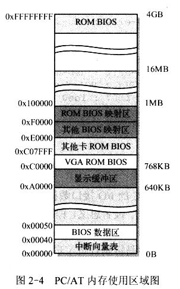
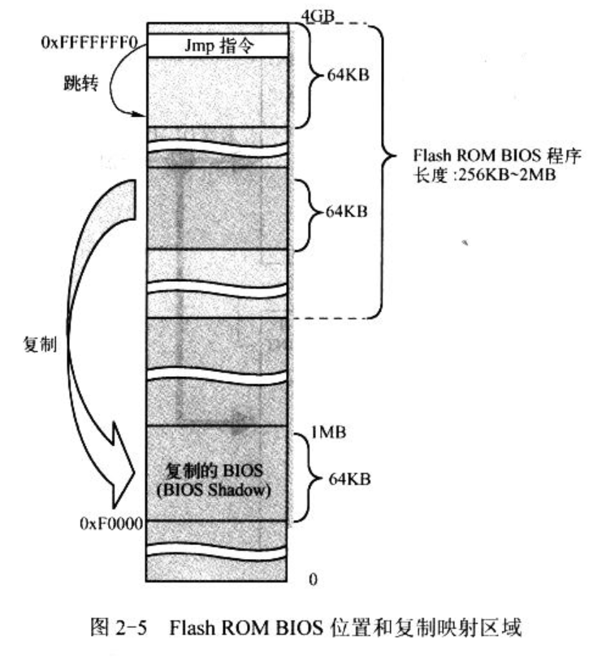

- 主存储器、BIOS 存储器和 CMOS 存储器

    - 主存储器

    - 基本输入/输出程序 BIOS

    - CMOS 存储器

## 1. 主存储器

目前计算机配置大内存和 Intel 32 位 CPU, 即 PC/AT 计算机. 因此 CPU 的物理内存寻址范围已经高达 4GB(通过采用 CPU 的新特性, 系统甚至可以寻址 64GB 的物理内存容量). 但为了与原来的 PC 软件上兼容, 系统 1MB 以下物理内存使用分配上仍然保持与原来 PC 基本一致, 只是原来系统 ROM 中的基本输入输出程序 BIOS 一直处于 CPU 能寻址的内存最高端位置处, 而 BIOS 原来所在的位置将在计算机开机初始化时被用做 BIOS 的影子(shadow)区域, 即 BIOS 代码仍然会被复制到这个区域中. 如图 2-4.

初始化, 物理地址被设置成从地址 0 开始的连续区域. 除了地址从 0xA0000 ~ 0xFFFFF(640KB ~ 1MB, 共 384KB)和 0xFFFE0000 ~ 0xFFFFFFFF(4GB 处的最后 64KB)以外的所有内存都可以做系统内存. 这两个用于 I/O 设备和 BIOS 程序.

## 2. 基本输入/输出程序 BIOS

BIOS(Basic Input/Output System, 基本输入输出系统)全称是 ROM-BIOS.

BIOS 存在 BIOS ROM 芯片中, 用于初始化硬件, 设置 CMOS 参数, 从块设备加载 boot loader(MBR 和 boot sector 中)到内存 0x7c00 地址, 并跳转执行.

BIOS 存在 BIOS ROM 芯片中, 用于开机时执行系统各部分的自检, 建立操作系统需要使用的各种配置表, 如中断向量表、硬盘参数表. 由于 BIOS 提供的服务不具备可重入性(即程序不可并发运行), 因而初始化时利用 BIOS 提供一些系统参数外, Linux 运行时不使用 BIOS 功能.

开机或复位时, CPU 会自动将代码段寄存器 CS 设为 0xF000, 其段基地址设为 0xFFFF0000, 段长度设为 64KB. IP 被设为 0xFFF0, 此时 CPU 代码指针指向 0xFFFFFFF0 处, 即 4GB 最后 64KB 的最后 16B 处. 由上面的 2-4 图, 正是 ROM BIOS 存放的位置, 并且 BIOS 会在这里存放一条跳转指令 JMP, 跳转到 BIOS 代码中 64KB 范围内的某一个指令开始执行. 由于目前 PC/AT 中 BIOS 容量大多有 1MB ~ 2MB, 并存储在闪存(Flash Memory)ROM 中, 因此为能执行或访问 BIOS 中超过 64KB 范围而又远不在 0 ~ 1MB 地址空间中的其他 BIOS 代码或数据. BIOS 程序会首先使用 32 位访问方式把数据段寄存器的访问范围设置位 4GB(而非原来的 64KB), 这样 CPU 就可以在 0 ~ 4GB 范围内执行和操作数据. 此后, BIOS 在执行一些硬件检测和初始化操作之后, 就会把与原来 PC 兼容的 64KB BIOS 代码和数据复制到内存低端 1MB 末端的 64KB 处, 然后跳转到这个地方并让 CPU 真正运行在实地址模式下, 如图 2-5. 最后 BIOS 会从硬件或其他块设备把操作系统引导程序加载到内存 0x7c00 处, 并跳转到这个地方继续执行引导程序.

## 3. CMOS 存储器

CMOS(Complementary Metal Oxide Semiconductor, 互补金属氧化物半导体)存储器容量很少(只有 64B 或 128B), 用来存放计算机的实时时钟信息和系统硬件配置信息. 这部分内存通常和实时时钟芯片(Real Time Chip)做在一块集成电路中. CMOS 内存的地址空间在基本内存地址空间之外, 需要使用 I/O 指令来访问.