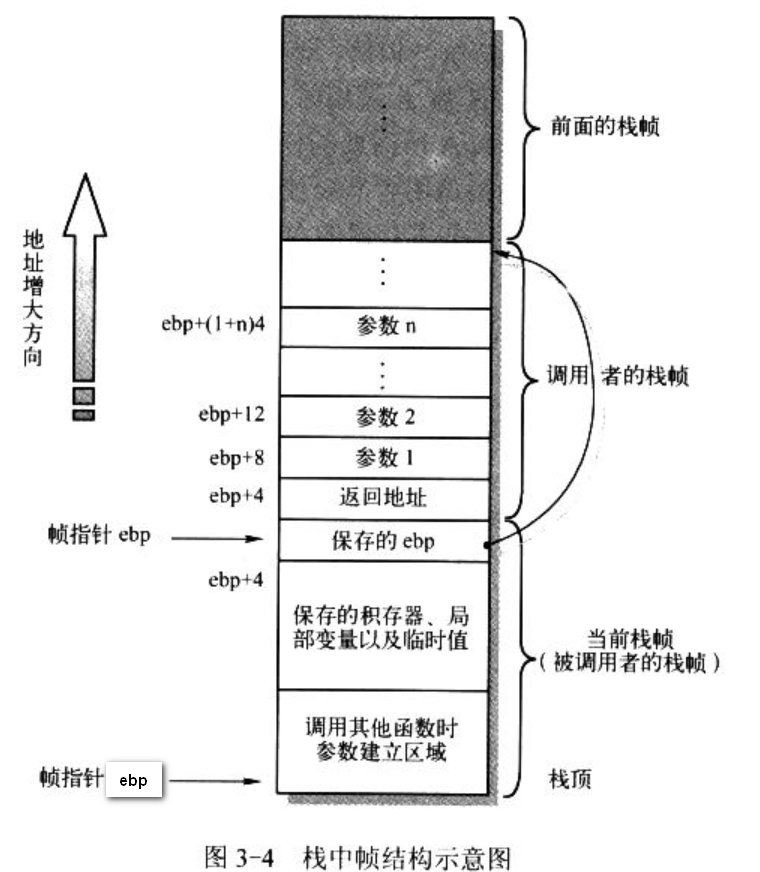

- 3.4　C 与汇编程序的相互调用

    - 3.4.1　C 函数调用机制

    - 3.4.2　在汇编程序中调用 C 函数

    - 3.4.3　在 C 程序中调用汇编函数

## 1. C 函数调用机制

在 Linux 内核程序 boot/head.s 执行完基本初始化操作之后, 就会跳转去执行 init/main.c 程序. 那么汇编是怎么调用执行 C 的呢?首先描述下 C 函数的调用机制、控制权传递方式, 然后说明 head.s 如何跳到 C 程序.

函数调用操作包括从一块代码到另一块代码之间的双向数据传递和执行控制转移. 数据传递通过函数参数和返回值进行. 另外, 在进入函数时需要为函数的局部变量分配空间, 并在退出函数时回收.

Intel 80x86 CPU 为**控制传递**提供了简单的**指令**, 而数据的传递和局部变量存储空间的分配与回收则通过**栈操作**实现.

### 1.1 栈帧结构和控制转移权方式

多数 CPU 上的程序实现使用栈来支持函数调用操作. 栈用来

- 传递函数参数、

- 存储返回信息、

- 临时保存寄存器原有值以备恢复、

- 存储局部数据.

单个函数调用操作所使用的栈部分被称为栈帧(stack frame)结构, 一般结构如图 3-4. 栈帧结构的两端由两个指针指定. 寄存器 ebp 通常用做帧指针(frame pointer), 而 esp 用做栈指针(stack pointer). 在函数执行中, 栈指针 esp 会随着数据的入栈和出栈而移动, 因此函数中对大部分数据的访问都是基于帧指针 ebp 进行.

## 2. 在汇编程序中调用 C 函数

## 3. 在 C 程序中调用汇编函数