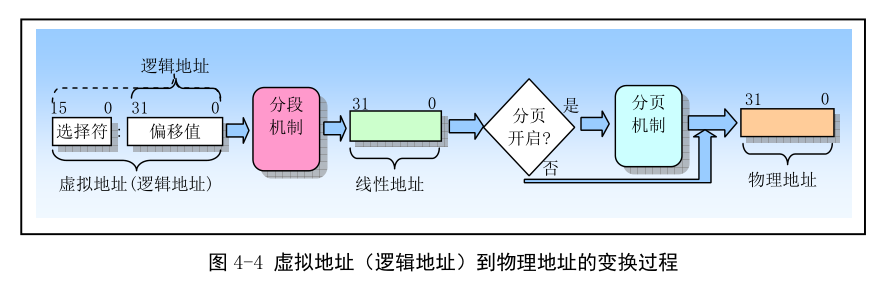
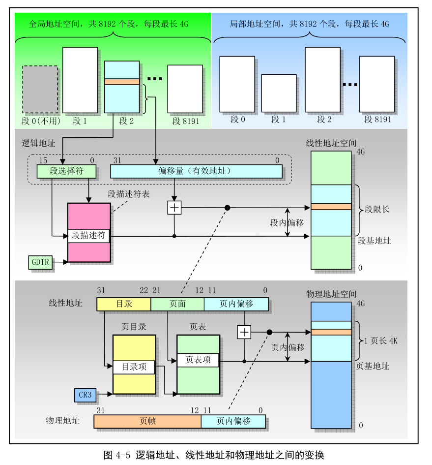

- 4.2 保护模式内存管理
    - 4.2.1 内存寻址
    - 4.2.2 地址变换
    - 4.2.3 保护

具体参考
/Computer_Architecture/x86/X86 段式内存管理与保护模式
/Computer_Architecture/x86/CPU/实模式和保护模式区别及寻址方式

## 1. 内存寻址

内存是指一组有序**字节**组成的数组, **每个字节**有唯一的地址. 内存寻址指对内存中某个指定数据对象的地址进行定位. 这里的数据对象指内存中一个**指定数据类型**的数值或字符串. 80x86 支持多种数据类型: 1 字节、2 字节(1 个字)或 4 字节(双字或长字)的无符号整型数或有符号整型数, 以及多字节字符串等. 通常, 字节中某一位的定位或寻址可**基于字节来寻址**, 因此最小数据类型的寻址是对 1 字节数据(数值或字符)的定位. 通常内存地址从 0 开始编址, 对于 80x86 CPU 来说, 其**地址总线**宽度是 32 位, 因此一共 2\^32 个不同物理地址, 即内存物理地址空间有 4GB, 总可寻址 4GB 的物理内存. 而对于多字节数据类型(例如 2 字节整数数据类型), 在内存中字节相邻存放. 80x86 先存放低值字节, 随后存放高值字节. 因此 80x86 CPU 是一种先存小值(Little Endian)的处理器.

80x86 CPU, 一条指令主要由操作码(Opcode)与操作对象即操作数(Oprand)构成. 操作数可以在寄存器中, 也可以在内存中. 若要定位内存中的操作数, 就要进行内存寻址. 80x86 有许多指令的操作数涉及内存寻址, 并针对寻址对象数据类型的不同, 由很多不同的寻址方案可供选择.

为了进行内存寻址, 80x86 使用了一种称为段(Segment)的寻址方式. 这种寻址技术把**内存空间**分成一个或多个称为段的**线性区域**, 从而对内存中一个数据对象的寻址就需要使用一个段的起始地址(即段地址)和一个段内偏移地址两部分构成. 段地址部分使用 16 位的段选择符指定, 其中**14 位**可以选择 2\^14 即 16384 个段. **段内偏移地址部分**使用**32 位**的值来指定, 因此段内地址可以是 0 ~ 4GB. 即每个段的最大长度可达 4GB. 程序中由 16 位的段和 32 位的偏移构成的 48 位地址或长指计称为一个逻辑地址(虚拟地址). 它唯一确定了一个数据对象的段地址和段内偏移地址·而仅由 32 位偏移地址或指针指定的地址是基于当前段的对象地址.

80x86 为段部分提供了 6 个**存放段选择符**的段寄存器;  CS、 DS、 ES、 SS、 FS 和 GS. 其中 CS 总是用于寻址代码段, 而堆栈段则专门使用 SS 段寄存器. 在任何指定时刻由 CS 寻址的段称为当前代码段. 此时 EIP 寄存器中包含了当前代码段内下一条要执行指令的段内偏移地址. 因此要执行指令的地址可表示成 CS:[EIP]. 后面将说明的段间控制转移指令可以被用来为 CS 和 EIP 赋予新值, 从而可以把执行位置改变到其他的代码段中. 这样. 就实现了在不同段中程序的控制传递.

由**段寄存器 SS**寻址的段称为当前堆栈段. 栈顶由 ESP 寄存器内容指定. 因此堆栈顶处地址是 SS:[ESP].

另外 4 个段寄存器是通用段寄存器. 当指令中没有指定所操作数据的段时, 那么 DS 将是默认的数据段寄存器.

为了指定内存操作数的段内偏移地址, 80x86 指令规定了计算偏移量的很多方式, 称为指令寻址方式. 指令的偏移量由 3 部分相加组成: 基地址寄存器、变址寄存器和一个偏移常量, 三者关系如下:

偏移地址 = 基地址 +(变址×比例因子)+ 偏移量

## 2. 地址变换

任何完整的内存管理系统都至少包含两个关键部分: **保护和地址变换**. 保护措施可以防止一个任务访问另一个任务或操作系统的内存区域. 地址变换可以让 OS 在给任务分配内存时具有灵活性, 并且因为可以让某些物理地址不被任何逻辑地址所映射, 所以在地址变换中同时也提供了内存保护功能.

物理内存是字节的线性数组, 每字节有唯一的物理地址; 程序中的地址是由两部分构成的逻辑地址. 逻辑地址需要地址变换机制变成或映射到物理内存地址上. 内存管理机制就是将逻辑地址转换成物理地址.

为减少确定地址变换所需的信息, 变换或映射通常以**内存块**作为操作单位. 分段和分页机制是两种广泛使用的地址变换技术. 不同在于逻辑地址如何组织成被映射的**内存块**、变换信息如何指定以及编程人员如何操作. 分段和分页操作都使用驻留在内存中的表来指定它们各自的变换信息. 这些表只能由操作系统进行访问, 以防止应用程序擅自修改.

80x86 在从逻辑地址转换成物理地址过程中使用了分段和分页两种机制, 如图 4-4. 第一阶段使用分段将程序逻辑地址变成处理器可寻址的内存空间(线性地址空间)中的地址. 第二阶段使用分页机制把线性地址转换成物理地址. 分段变换机制总是使用的,  分页机制则是供选用的. 若没有启用分页机制, 分段机制产生的线性地址空间就直接映射为处理器的物理地址空间上. **物理地址空间**定义为处理器在**其地址总线**上能够产生的地址范围.

### 2.1 分段机制

分段提供了隔绝各个代码、数据和堆栈区域的机制, 因此**多个程序**(或任务)可以运行在**同一个处理器上**而不干扰.

如图 4-5, 分段提供了一种机制, 用于把处理器可寻址的线性地址空间划分一些较小的称为段的受保护地址空间区域. 段可用来存放程序的代码、数据和堆栈, 或者用来存放系统数据结构(如 TSS 或 LDT). 如果处理器中有多个程序或任务在运行, 那么每个程序可分配各自的一套段. 此时处理器就可以加强这些段之间的界限, 并且确保一个程序不会通过访问另一个程序的段而干扰程序的执行. 分段机制还允许对段进行分类. 这样, 对特定类型段的操作也会受到限制.

一个系统中所有使用的段都包含在处理器线性地址空间中. 为了定位指定段的一个字节, 程序必须提供一个逻辑地址. 该逻辑地址包含一个段选择符和一个偏移量. 段选择符是一个段的唯一标识. 另外, 段选择符提供了段描述符表(如 GDT)中一个数据结构(称为段描述符)的偏移量. 每个段都有一个段描述符. 段描述符指明段的大小、访问权限和段的特权级、段类型和段首字节在线性空间中的位置(称为段的基地址). 基地址加上偏移量构成处理器线性空间中的地址.

线性地址空间和物理地址空间具有相同的结构. 相对于二维逻辑地址空间而言, 它们都是一维地址空间. 虚拟地址(逻辑地址, 程序可见的地址)空间可包含最多 16K(8192 = 2^14 = 2^13 * 2, 2 是因为段选择符标识位有 0 和 1, 分别是全局和局部)个段, 而每个段最长可达 4GB(2^32), 使得虚拟地址(逻辑地址, 程序使用的地址)空间容量达到 64TB(2^46 = 2^14 * 2^32). 线性地址空间和物理地址空间都是 4GB. 实际上, 如果禁用分页机制, 那么线性空间就是物理地址空间.

### 2.2 分页机制

因为多任务系统通常定义的**线性地址空间**比其含有的**物理内存容量大得多**, 所以需要使用某种"虚拟化"线性地址空间的方法, 即使用虚拟存储技术.

**分页支持虚拟存储技术**. 在使用虚拟存储的环境中, 大容量的线性地址空间需要使用小块的物理内存(RAM 或 ROM)以及某些外部存储空间(如大容量硬盘)来模拟. 使用分页时, 每个段被划分成页面(通常每页为 4KB 大小), **页面会被存储于物理内存中或硬盘上**. OS 通过一个页目录和一些页表来留意这些页面. 当程序试图访问一个线性地址, 处理器会使用页目录和页表把线性地址转换成一个物理地址.

若访问的页面不存在, 处理器会产生一个页错误异常以中断程序的执行.

80x86 的分页机制最适合支持虚拟存储技术. **分页机制会使用大小固定的内存块, 而分段管理则使用了大小可变的块来管理内存**.

**段表存储在线性地址空间**, **页表保存在物理地址空间**. 因此段变换表可由分页机制重新定位而无需段机制信息. 段变换机制把虚拟地址(逻辑地址)变换成线性地址, 并且在线性地址空间中访问自己的表. **分页机制在物理内存中访问自己的转换表**.

## 3. 保护

80x86 支持两类保护.

其一是通过给每个任务不同的虚拟地址(逻辑地址)空间来完全隔离各个任务. 通过给每个任务逻辑地址到物理地址不同的变换映射来实现.

另一种是对任务进行操作, 以保护操作系统内存段和处理器特殊系统寄存器不被应用程序访问.

### 3.1 任务之间的保护

在 80x86 中, 每个任务都有自己的段表和页表. 当处理器切换到新任务时, 任务切换的关键部分就是切换到新任务的变换表.

通过在所有任务中安排具有相同的虚拟到物理地址映射部分, 并且把操作系统存储在这个公共的虚拟地址空间部分, 操作系统可以被所有任务共享. 这个所有任务都具有的相同虚拟地址空间部分被称为全局地址空间(Global Address Space). 这也是现代 Linux 操作系统使用虚拟地址空间的方式.

每个任务唯一的虚拟地址空间部分被称为局部地址空间(Local Address Space). 局部地址空间需要私有的代码和数据. 由于每个任务中具有不同的局部地址空间, 因此两个**不同任务**中对**相同虚拟地址**处的引用将转换到**不同的物理地址**处. 这样, OS 可以给每个任务的内存相同的虚拟地址, 但是仍然能隔绝每个任务. 另一方面, 所有任务在全局地址空间中对相同虚拟地址的引用将被转换到同一个物理地址处. 这给公共代码和数据(如操作系统)的共享提供了支持.

### 3.2 特权级保护

一个任务中会定义 4 个特权级(Privilege Levels). 特权级用数字 0 ~ 3 来表示, 其中 0 具有最高特权级; 3 最低特权级. 每个内存段都和一个特权级相关联. 处理器从 CS 寄存器指定的段中取得和执行指令, 当前特权级(Current Privilege Level)即 CPL 就是当前活动代码段的特权级, 并且它定义了当前所执行程序的特权级别. CPL 确定了哪些段能被程序访问.

每当程序试图访问一个段时, 当前特权级会与段的特权级进行比较.

每个特权级都有自己的程序栈, 比避免使用共享栈带来的保护问题. 当程序从一个特权级切换到另一个特权级上执行时, 堆栈段也会随之更换到新级别的堆栈中.