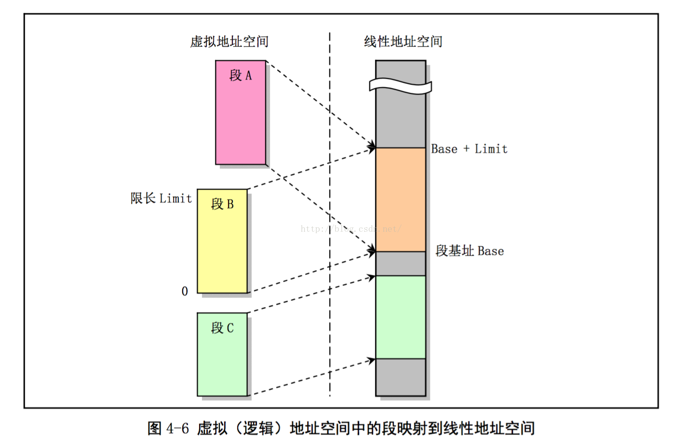
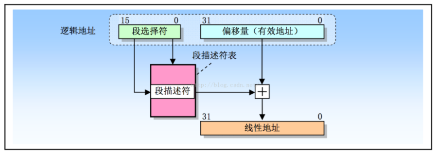
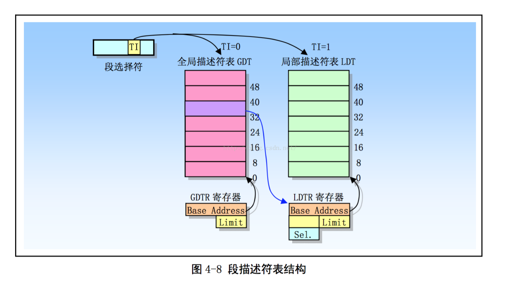
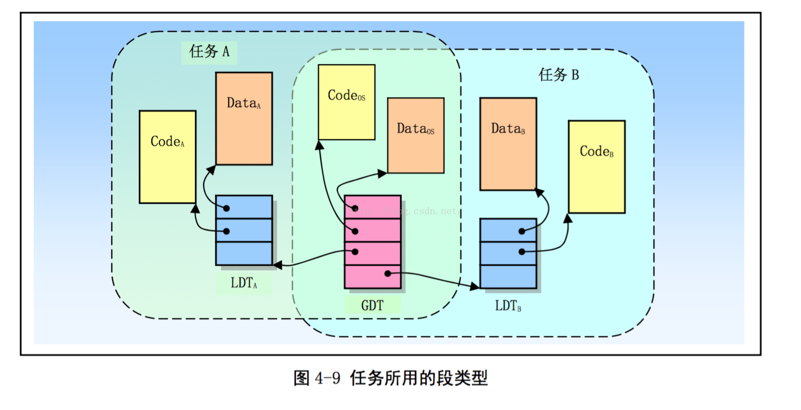
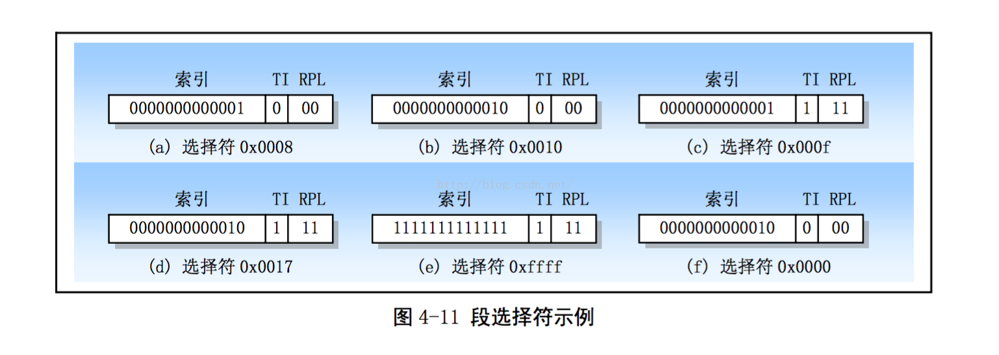
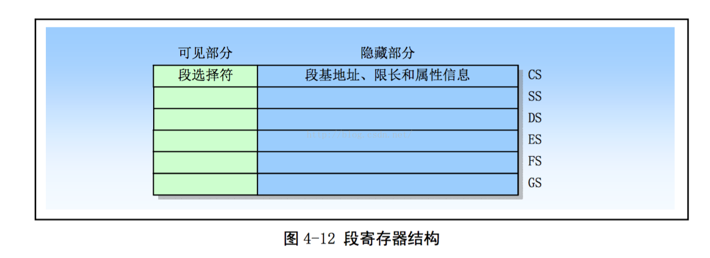

- 4.3 分段机制
    - 4.3.1 段的定义
    - 4.3.2 段描述符表
    - 4.3.3 段选择符
    - 4.3.4 段描述符
    - 4.3.5 代码和数据段描述符类型
    - 4.3.6 系统描述符类型

**分段机制**可用于实现**多种系统设计**. 这些设计范围从使用分段机制的最小功能来保护程序的**平坦模型**, 到使用分段机制创建一个可同时可靠地运行多个程序(或任务)的具有稳固操作环境的**多段模型**.

多段模型能够利用分段机制全部功能提供由硬件增强的代码, 数据结构, 程序和任务的保护措施. 通常, 每个程序(或任务)都是用自己的段描述符以及自己的段. 对程序来说段能够完全是私有的, 或者是程序之间共享的. 对**所有段**以及系统上运行程序各自**执行环境**的**访问**都由**硬件控制**.

**访问检查**不仅能够用来**保护对段界限以外地址的引用**, 而且也能用来在**某些段中防止执行不允许**的操作. 例如, 因为代码段被设计成是只读形式的段, 因此可以用硬件来防止对代码段执行写操作. 段中的访问权限信息也可以用来设置保护环或级别. 保护级别可用于保护操作系统程序不受应用程序非法访问.

## 1. 段的定义

上面说到, 保护模式中的 80x86 提供了 4GB 的**物理地址空间**. 这是处理器在其地址总线上可以寻址的地址空间. 这个地址空间是**平坦的**, 地址范围从 0 到 0xFFFFFFFF. 这个物理地址空间可以映射到**读写内存**、**只读内存**以及**内存映射 I/O**中.

分段机制就是把**虚拟地址空间**中的**虚拟内存**组织成一些长度可变的称为**段**的**内存块单元**. 80386 虚拟地址空间中的虚拟地址(逻辑地址)由一个段部分和一个偏移部分构成. 段是虚拟地址到线性地址转换机制的基础.

每个段由三个参数(段描述符)定义:

- 段基地址(Base address), 指定段在**线性地址**空间中的开始地址. 基地址是线性地址, 对应于段中偏移 0 处.

- 段限长(Limit), 是虚拟地址空间中段内最大可用偏移位置. 它定义了段的长度.

- 段属性(Attributes), 指定段的特性. 例如该段是否可读, 可写或可作为一个程序执行; 段的特权级等.

段限长定义了在虚拟地址空间中段的大小. 段基址和段限长定义了段所映射的线性地址范围或区域. 段内 0 到 limit 的地址范围对应线性地址中年范围 base 到 base + limit .

偏移量**大于**段限长的虚拟地址是无意义的, 如果使用则会导致异常.

另外 , 若访问一个段并**没有得到段属性许可**则也会导致异常. 例如, 如果你试图写一个只读的段, 那么 80386 就会产生一个异常.

另外, 多个段映射到线性地址中的范围**可以部分重叠或者覆盖**, 甚至完全重叠, 如下图所示(一个任务的 Code Segment 和 Data Segment 的段限长相同, 并被映射到线性地址完全相同而重叠的区域上).

段的基地址, 段限长以及段的保护属性存储在一个称为段描述符(Segment Descriptor) 的结构项中. 在逻辑地址到线性地址的转换映射过程中会使用这个段描述符. **段描述符**保存在**内存中**的**段描述符表**中(Descriptor table). 段描述符表是包含段描述符项的一个简单数组.  前面介绍的段选择符即用于通过指定表中一个段描述符的位置来指定相应的段.

即使利用段的最小功能, 使用逻辑地址也能访问处理器地址空间中的每个字节. 逻辑地址由 16 bit 的段选择符和 32 bit 的偏移量组成, 如下图 4-7 所示.

**段选择符**指定字节**所在的段**, 而**偏移量**指定该字节**在段中相对于段基地址**的位置. 处理器(CPU 行为)会把每个逻辑地址转换成线性地址.

线性地址是处理器线性地址空间中的 32 bit 地址.  与物理地址空间类似, **线性地址空间**也是**平坦**的 4GB 地址空间, 地址范围从 0 到 0xFFFFffff. **线性地址空间中含有为系统定义的所有段和系统表**.

也就是说, 分段机制先将所有**线性地址**(不是虚拟地址)分块(这就是**段**, 可能存在覆盖的段), 块大小可变; 应用程序的接触到的是逻辑地址(虚拟地址), 实际上是相应块的偏移地址.

为了把逻辑地址转换为一个 线性地址, **处理器**会执行以下操作:

(1) 使用段选择符中的偏移值(段索引)在 GDT 或 LDT 表中定位相应的段描述符. (仅当一个新的段选择符加载到段寄存器中时才需要这一步).

(2) 利用段描述符检验段的访问权限和范围, 以确保该段是可访问的并且偏移量位于段界限内.

(3) 把段描述符中取得的段基地址加到偏移量上, 最后形成一个线性地址.

如果没有开启分页, 那么处理器直接把线性地址映射到物理地址(即线性地址被送到处理器地址总线上). 如果对线性地址空间进行了分页处理, 那么就会使用二级地址转换把线性地址转换成物理地址.

## 2. 段描述符表

段描述符表是段描述符的一个数组, 如下图所示. 描述符表的长度可变, 最多可以包含 8192(2\^13)个 8 byte 描述符. 有两个描述符表:  全局描述符表 GDT (Global descriptor table); 局部描述符表 LDT (Local descriptor table).

**描述符表**存储在由操作系统维护着的**特殊数据结构**中, 并且由**处理器的内存管理硬件**来引用. 这些特殊结构应该保存在仅仅由**操作系统软件访问的受保护的内存区域**中, 以防止应用程序修改其中的地址转换信息.

虚拟地址空间被分割成大小相等的两半.  一半由 GDT 来映射变换到线性地址, 另一半则由 LDT 来映射. 整个虚拟地址空间共含有 2\^14 个段:  一半空间(即 2\^13 个段) 是由 GDT 映射的全局虚拟地址空间, 另一半是由 LDT 映射的局部虚拟地址空间. 通过指定一个描述符表(GDT 或 LDT)以及表中描述符号, 我们就可以定位一个描述符.

当发生任务切换时, LDT 会更换成新任务 LDT , 但是 GDT 并不会改变. 因此, GDT 所映射的一半虚拟地址空间是系统中所有任务共有的, 但是 LDT 所映射的另一半则在任务切换时被改变. 系统中所有任务共享的段由 GDT 来映射. 这样的段通常包括含有操作系统的段以及所有任务各自的包含 LDT 的 特殊段.  LDT 段可以想象成属于操作系统的数据.

下图 4-9 所示, 一个任务中的段如何能在 GDT 和 LDT 之间分开. 图中共有 6 个段, 分别用于两个应用程序 (A 和 B)以及操作系统. 系统中每个应用程序对应一个任务, 并且每个任务有自己的 LDT.  应用程序 A 在任务 A 中运行, 拥有 LDTa , 用来映射段 Codea 和 Dataa.  类似的, 应用程序 B 在任务 B 中运行, 使用 LDTb 来映射 Codeb 和 Datab 段.  包含操作系统内核的两个段 Codeos 和 Dataos 使用 GDT 来映射, 这样它们可以被两个任务所共享. **两个 LDT 段:  LDTa 和 LDTb 也使用 GDT 来映射. **

当任务 A 在运行时, 可访问的段 包括 LDTa 映射的 Codea 和 Data a 段 , 加上 GDT 映射的操作系统的段 Codeos 和 Dataos.  当任务 B 在运行时, 可访问的段包括 LDTb 映射的 Code b 和 Datab 段, 加上 GDT 映射的段.

这种使用 LDT 来隔离每个应用程序任务的方法, 正是关键保护需求之一.

每个系统必须定义一个 GDT, 并可用于系统中所有程序或者任务. 另外, 可选定义一个或多个 LDT. 例如, 可以为每个运行任务定义一个 LDT, 或者某些或所有任务共享一个 LDT.

**GDT 本身并不是一个段, 而是线性地址空间中的一个数据结构**. GDT 的基线性地址和长度值必须加载进 GDTR 寄存器中. GDT 的基地址应该进行内存 8bit 对齐, 以得到最佳处理器性能. GDT 的限长以字节为单位.  与段类似, 限长值加上基地址可得到最后表中最后一个字节的有效地址. 限长为 0 表示有 1 个有效字节.  因为段描述符总是 8byte 长, 因此 GDT 的限长值 应该设置成总是 8 的倍数 减 1 (即 8N -1);

**处理器并不使用 GDT 中的第一个描述符**. 把这个"空描述符"的段选择符加载进一个数据段寄存器(DS,ES,FS,GS)并不会产生一个异常, 但是若使用这些加载了空描述符的段选择符访问内存时就肯定会产生一般保护性异常. 通过使用这个段选择符初始化段寄存器, 那么意外引用未使用的段寄存器肯定会产生一个异常.

**LDT 表存放在 LDT 类型的系统段中, 此时 GDT 必须含有 LDT 的段描述符**. 如果系统支持多 LDT 的话, 那么每个 LDT 都必须在 GDT 中有一个段描述符和段选择符. 一个 LDT 的段描述符可以存放在 GDT 表的任何地方.

访问 LDT 需使用其段选择符. 为了在访问 LDT 时减少地址转换次数, LDT 的段选择符, 基地址, 段限长以及访问权限需要存放在 LDTR 寄存器中.

当保存 GDTR 寄存器内容时(使用 SGDT 指令), 一个 48bit 的"伪描述符"被存储在内存中. 为了在用户模式(R3)避免对齐检查出错, 伪描述符应该存放在一个奇字地址处(即 地址 MOD 4 =2).  这会让处理器先存放一个对齐的字, 随后是一个对齐的双字(4 byte 对齐处). 用户模式程序通常不会保存伪描述符, 但是可以通过使用这种对齐方式来避免产生一个对齐检查出错的可能性. 当使用 SIDT 指令保存 IDTR 寄存器内容时也需要使用同样的对齐方式. 然而, 当保存 LDTR 或任务寄存器(分别使用 SLTR 或 STR 指令)时, 伪描述符应该存放在双字对齐的地址处(即 地址 MOD 4 = 0).

## 3. 段选择符

段选择符(或称 段选择子) 是段的一个 16 bit 标识符, 如下图.  段选择符并不直接指向段, 而是指向段描述符表中定义段的段描述符. 段选择符 3 个字段内容:

- 请求特权级 RPL(Request Privilege Level);
- 表指示标志 TI (Table Index);
- 索引值(Index).

请求特权级字段 RPL 提供了段保护信息, 将在后面作详细说明. 表索引字段 TI 用来指出包含指定段描述符的段描述符表 GDT 或 LDT . TI = 0 表示描述符在 GDT 中;  TI =1 表示描述符在 LDT 中.  索引字段给出了描述符在 GDT 或 LDT 表中的索引项号. 可见, 选择符通过定位段表中的一个描述符来指定一个段, 并且描述符中包含有访问一个段的所有信息, 例如段的基地址, 段长度和段属性.

另外, 处理器不适用 GDT 表中的第一项. 指向 GDT 该项的选择符(即索引值为 0, TI 标志位 0 的选择符)用作为"空选择符", 见图 4-11(f)所示. 当把空选择符加载到一个段寄存器(除了 CS 和 SS 以外)中时, 处理器并不产生异常. 但是当使用含有空选择符的段寄存器用于访问内存时就会产生异常. 当把空选择符加载到 CS 或 SS 段寄存器中时将会导致一个异常.

对应用程序来说段选择符是作为指针变量的一部分而可见, 但选择符的值通常是由链接编辑器或链接加载程序进行设置或修改, 而非应用程序.

为减少地址转换时间和编程复杂性, 处理器提供可存放最多 6 个段选择符的寄存器(见图 4-12 所示), 即段寄存器. 每个段寄存器支持特定类型的内存引用(代码, 数据, 或堆栈). 原则上执行每个程序都起码需要把有效的段选择符加载到代码段(CS), 数据段(DS), 堆栈段(SS)寄存器中. 处理器还另外提供段.

对于访问某个段的程序, 必须已经把段选择符加载到一个段寄存器中. 因此, 尽管一个系统可以定义很多的段, 但同时只有 6 个段可供立即访问. 若要访问其他段就需要加载这些段的选择符.

另外, 为了避免每次访问内存时都去引用描述符表, 去读和解码一个段描述符, 每个段寄存器都有一个"可见"部分和一个"隐藏"部分(隐藏部分也被称为"描述符缓冲" 或 "影子寄存器"). 当一个段选择符被加载到一个段寄存器可见部分中时, 处理器也同时把段选择符指向的段描述符中的段地址, 段限长以及访问控制信息加载到段寄存器的隐藏部分中. 缓冲在段寄存器(可见和隐藏部分)中的信息使得处理器可以在进行地址转换时不再需要花费时间从段描述符中读取基地址和限长值.

由于影子寄存器含有描述符信息的一个 copy, 因此操作系统必须确保对描述符表的改动应反映在影子寄存器中. 否则描述符表中一个段的基地址或限长被修改过, 但改动却没有反映到影子寄存器中. 处理这种问题最简洁的方法是在对描述符表中描述符作过任何改动之后就立刻加载 6 个段寄存器. 这将把描述符表的相应信息重新加载到影子寄存器中. 为加载段寄存器, 提供了两类加载指令:

- MOV , POP,LDS, LES,LSS,LGS 以及 LFS 指令. 这些指令显式地直接引用段寄存器;

- 隐式加载指令, 例如使用长指针的 CALL ,  JMP 和 RET 指令,  IRET , INTn , INTO 和 INT3 等指令. 这些指令在操作过程中会附带改变 CS 寄存器(和某些其他段寄存器)的内容.