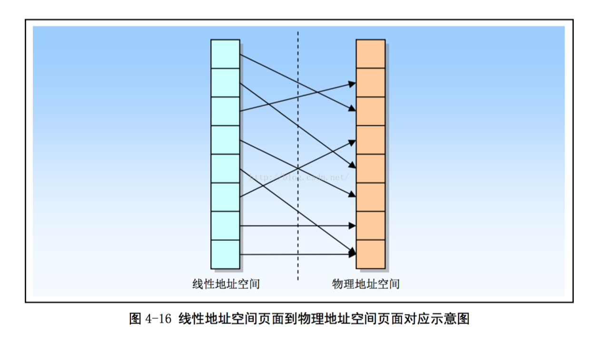
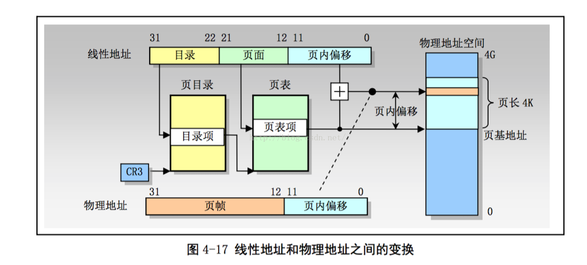
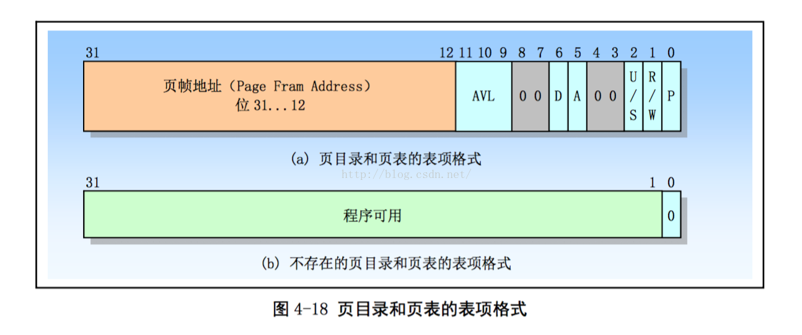

- 4.4 分页机制
    - 4.4.1 页表结构
    - 4.4.2 页表项格式
    - 4.4.3 虚拟存储

处理器分页机制会把线性地址空间(段已经映射到其中)划分成**页面**, 然后这些线性地址空间页面被映射到物理地址空间的页帧(也叫页框)上. 分页机制几种页面级保护措施, 可和分段机制保护机制合用或替代分段机制的保护措施. 例如: 在基于页面的基础上加强读/写保护. 另外, 在页面单元上, 分页机制还提供了用户- 超级用户 两级保护.

**不同叫法的地址**(Address)理解:

虚拟地址(Virtual Address)是指由程序产生的由段选择符和段内偏移地址两个部分组成的地址. 因为这两部分组成的地址并没有直接用来访问物理内存, 而是需要通过分段地址变换机制处理或映射后才对应到物理内存地址上, 因此这种地址被称为虚拟地址. 虚拟地址空间由 GDT 映射的全局地址空间和由 LDT 映射的局部地址空间组成. 选择符的索引部分由 13 bit 表示, 加上区分 GDT 和 LDT 的 1 bit , 因此 Intel 80X86 CPU 可以提供索引 16384 (2 ^ 14)个选择符. 若每个段的长度都取最大值 4GB, 则最大虚拟地址空间范围是  2^14 * 4GB = 64TB.

逻辑地址(Logical Address) 是指由程序产生的与段相关的偏移地址部分. 在 Intel 保护模式下即是指程序执行代码段限长内的偏移地址(假定代码段, 数据段完全一样). 应用程序员仅仅需要与逻辑地址打交道, 而分段和分页机制对他来说是完全透明的, 仅仅由系统编程人员涉及. 不过有些资料并不区分逻辑地址和虚拟地址的概念, 而是将他们统称为逻辑地址.

线性地址(Linear Address) 是虚拟地址到物理地址变换的中间层, 是处理器可以寻址的内存空间(称为线性地址空间)中的地址. 程序代码会产生逻辑地址, 或者说是段中的偏移地址, 加上相应段的基地址就生成了一个线性地址. 如果启用了分页机制, 那么线性地址可以再经过变换以产生一个物理地址. 若没有启动分页机制(PG =1 开启分页), 那么线性地址直接就是物理地址. Intel 80386 的线性地址空间范围是 4GB.

物理地址(Physical Address) 是指出现在 CPU 外部地址总线上的寻址物理内存的地址信号, 是地址变换的最终结果地址. 如果启动了分页机制, 那么线性地址会使用页目录和页表中的项变换成物理地址. 如果没有启动分页机制, 那么线性地址就直接成为了物理地址了.

虚拟存储(或 虚拟内存)(Virtual Memory)是指计算机呈现出要比实际拥有的内存大得多的内存量. 因此它允许程序员编制并允许比实际系统拥有的内存大很多的程序. 这使得许多大型项目也能够在具有有限内存资源的系统上实现. 一个很恰当的比喻是: 你不需要很长的轨道就可以让一列火车从上海开到北京. 你只需要足够长的铁轨(比如说 3 公里)就可以完成这个任务. 采取的方法是把后面的铁轨立刻铺到火车的前面, 只要你的操作足够快并能满足要求, 列车就能像在一条完整的轨道上运行. 这也就是虚拟内存管理需要完成的任务. 在 Linux kernel 中, 给每个程序(进程)都划分了总容量为 64MB 的虚拟内存空间. 因此程序的逻辑地址范围是 0x000 0000 到 0x400 0000.

如上所述, 有时我们也把逻辑地址称为虚拟地址. 因为逻辑地址与虚拟内存空间的概念类似, 并且也是与实际物理内存容量无关.

分段机制在各种可变长度的内存区域上操作. 分页机制对固定大小的内存块(成为页面)进行操作.

分页机制将线性和物理地址空间都划分成页面. 线性地址空间中的任何页面可以被映射到物理地址空间的任何页面上. 图 4-16 说明了分页机制如何把线性和物理地址空间都划分成各个页面, 并且在这两个空间之间提供任意映射. 图中箭头将线性地址空间中的页面与物理地址空间中的页面对应了起来.

80X86 使用 4k(2^12)字节固定大小的页面. 每个页面均为 4KB , 并且对齐于 4K 地址边界处. 这表示分页机制把 2^32 字节(4GB)的线性地址空间划分成 2^20(1MB = 1024 * 1024)个页面. 分页机制通过把线性地址空间中的页面重新定位到物理地址空间中进行操作. 由于 4K 大小的页面作为一个单元进行映射, 并且对齐于 4KB 边界, 因此线性地址的 低 12 bit 可作为页内偏移量直接作为物理地址的低 12 bit.  分页机制执行的重定位功能可以看作是把线性地址的高 20 bit 转换到对应物理地址的高 20bit.

另外, 线性地址到物理地址的转换功能被扩展成允许一个线性地址被标注为无效的, 而非让其产生一个物理地址. 在两种情况下一个页面可以被标注为无效的: A: 操作系统不支持的线性地址; B: 对应在虚拟内存系统中的页面在磁盘上而非在物理内存中. 在第一种情况下, 产生无效地址的程序必须被终止. 在第二种情况下, 该无效地址实际上是请求操作系统虚拟内存管理器把对应页面从磁盘上加载到物理内存中, 以供程序访问. 因为无效页面通常与虚拟存储系统相关, 因此它们被称为不存在的页面, 并且由页表中称为存在(present)的属性来确定.

在保护模式中, 80x86 允许线性地址空间直接映射到大容量的物理内存(例如 4GB 的 RAM)上, 或者(使用分页)间接地映射到较小容量的物理内存和磁盘存储空间中. 这后一种映射线性地址空间的方法被称为虚拟存储或者需求页(Demand-paged)虚拟存储.

当使用分页时, 处理器会把线性地址空间划分成固定大小的页面(长度 4kb), 这些页面可以映射到物理内存中和/或磁盘存储空间中. 当一个程序(或任务)引用内存中的逻辑地址时, 处理器会把该逻辑地址转换成一个线性地址, 然后使用分页机制把该线性地址转换成对应的物理地址.

如果包含线性地址的页面当前不在物理内存中, 处理器就会产生一个页错误异常. 页错误异常的处理程序通常就会让操作系统从磁盘中把相应页面加载到物理内存中(操作过程中可能还会把物理内存中不同的页面写到磁盘上). 当页面加载到物理内存中之后, 从异常处理过程的返回操作会使得导致异常的指令被重新执行. 处理器用于把线性地址转换成物理地址和用于产生页错误异常(若必要的话)的信息包含在存储于内存中的页目录和页表中.

分页与分段最大的不同之处在于分页使用呢了固定长度的页面. 段的长度通常与存放在其中的代码或数据结构具有相同的长度. 与段不同, 页面有固定的长度. 如果仅使用分段地址转换, 那么存储在物理内存中的一个数据结构将包含其所有的部分. 但如果使用了分页, 那么一个数据结构就可以一部分存储于物理内存中, 而另一部分保存在磁盘中.

正如上述, 为了减少地址转换所要求的总线周期数量, 最近访问的页目录和页表会被存放在处理器的缓冲器件中, 该缓冲器件被称为转换查找缓冲区 TLB(Translation Lookaside Buffer). TLB 可以满足大多数读页目录和页表的请求而无需使用总线周期. 只有当 TLB 中不包含要求的页表项是才会使用额外的总线周期从内存中读取页表项, 这通常在一个页表项很长时间没有访问过时才会出现这种情况.

## 1. 页面结构

分页转换功能由驻留在内存中的表来描述, 该表称为页表(page table), 存放在物理地址空间中. 页表可以看作是简单的 2^20 物理地址数组. 线性地址到物理地址的映射功能可以简单地看作是进行数组查找. 线性地址的高 20bit 构成了这个数组的索引值, 用于选择对应页面的物理(基)地址. 线性地址的低 12bit 给出了页面中的偏移量, 加上页面的基地址最终形成对应的物理地址. 由于页面基地址对齐在 4K 边界上, 因此页面基地址的低 12 bit 肯定是 0. 这意味着 高 20 bit 的页面基地址 和 12 bit 偏移量连接组合在一起就能得到对应的物理地址.

页表中每个页表项大小为 32 bit.  由于只需要其中的 20 bit 来存放页面的物理基地址, 因此剩下的 12 bit 可以用于存储诸如页面是否存在等属性信息. 如果线性地址索引的页表项被标注为存在的, 则表示该项即有效, 我们可以从中取得页面的物理地址. 如果项中表明不存在, 那么当访问对应物理页面时就会产生一个异常.

### 1.1 两级页表结构

页表含有 2^20 (1MB)个表项, 而每项占用 4byte . 如果作为一个表来存放的话, 它们最多将占用 4MB 的内存. 因此为了减少内存占用量, 80X86 使用了两级表. 由此, 高 20bit 线性地址到物理地址的转换也被分成两步来进行, 每步使用(转换)其中 10 个 bit.

第一级表称为页目录(page directory). 它被存放在 1 页 4kb 页面中, 具有 2^10 (1kb) 个 4byte 长度的表项. 这些表项指向对应的二级表. 线性地址的最高 10 bit (位 32~22)用作一级表(页目录)中的索引值来选择 2^10 个二级表之一.

第二级表称为页表(page table), 它的长度也是一个 Page, 最多含有 1kb 个 4 byte 的表项. 每个 4byte 表项含有相关页面的 20 bit 物理基地址. 二级页表使用线性地址中间 10bit (位 21~12)作为表项索引值, 以获取含有页面 20 bit 物理基地址. 该 20bit 页面物理基地址和线性地址中的低 12bit (页内偏移)组合在一起就得到了分页转换过程的输出值, 即对应的最终物理地址.

图 4-17 所示出了二级表的查找过程. 其中 CR3 寄存器指定页目录表的基地址. 线性地址的高 10bit 用于索引这个页目录表, 以获得指向相关第二级页表的指针. 线性地址中间 10bit  用于索引二级页表, 以获得物理地址的高 20 bit. 线性地址的低 12 bit 直接作为物理地址低 12 bit, 从而组成一个完整的 32 bit 物理地址.

## 1.2 不存在的页表

通过使用二级表结构, 我们还没有解决需要使用 4MB 内存来存放页表的问题. 实际上, 我们把问题搞得有些复杂了, 因为我们需要另外增加一个页面来存放目录表. 然而, 二级表结构允许页表被分散在内存各个页面中, 而不需要保存在连续的 4MB 内存块中. 另外, 并不需要为不存在的或线性地址空间未使用部分分配二级页表. 虽然目录表页面必须总是存在于物理内存中, 但是二级页表可以在需要时再分配. 这使得页表结构的大小对应于实际使用的线性地址空间大小.

页目录表中每个表项也有一个存在(present)属性, 类似于页表中的表项. 页目录项中的存在属性指明对应的二级页表是否存在. 如果目录表项指明对应的二级页面存在, 那么通过访问二级表, 表查找过程第 2 步将同如上描述继续下去. 如果存在位表明对应的二级表不存在, 那么处理器就会产生一个异常来通知操作系统. 页目录表项中的存在属性使得操作系统可以根据实际使用的线性地址范围来分配二级页表页面.

目录表项中的存在位还可以用于在虚拟内存中存放二级页表. 这意味着在任何时候只有部分二级页表需要存放在物理内存中, 而其余的可保存在磁盘上. 处于物理内存中页表对应的页目录项将被标注为存在, 以表明可用它们进行分页转换. 处于磁盘上的页表对应的页目录项将被标注为不存在. 由于二级页表不存在而产生引发的异常会通知 OS 把缺少的页表从磁盘上加载进屋里内存. 把页表存储在虚拟内存中减少了保存分页转换表所需要的物理内存量.

## 2. 页表项格式

页目录和页表的表项格式见图 4-18 所示. 其中位 31~ 12 含有物理地址的高 20 bit, 用于定位物理地址空间中一个页面(页帧)的物理基地址. 表项的低 12 位含有页属性信息. 这里简要说明其余属性的功能和用途.

- P  :  位 0 是存在(present)标志, 用于指明表项对地址转换是否有效.  P =1 表示有效; P =0 无效. 在页转换过程中, 如果说涉及的页目录或页表的表项无效, 则会产生一个异常. 如果 P =0, 那么除表示表项无效外, 其余比特位可供程序自由使用, 见图 4-18(b)所示. 例如:  操作系统可以使用这些位来保存已存储在磁盘上的页面的序号.

- R/W :  位 1 是读写标志(Read/Write)标志. 如果 等于 1, 表示页面可以被读,写或执行. 如果为 0 表示页面只读或可执行. 当处理器运行在超级用户特权级(R0, R1, R2), 则 R/W 位不起作用. 页目录项中的 R/W 位对其所映射的所有页面起作用.

- U/S : 位 2 是用户/超级用户(User/Supervisor) 标志. 如果为 1, 那么运行在任何特权级上的程序都可以访问该页面. 如果为 0, 那么页面只能被运行在超级用户特权级(R0~R2)上的程序访问. 页目录项中的 U/S 位对其所映射的所有页面起作用.

- A :  位 5 是已访问(Accessed)标志. 当处理器访问页表项映射的页面时, 页表项的这个标志就会被置于 1.当处理器访问页目录表项映射的任何页面时, 页目录表项的这个标志就会被置于 1.处理器值负责设置该标志, 操作系统可通过定期地复位该标志来统计页面的使用情况.

- D :  位 6 是页面已经被修改(Dirty)标志. 当处理器对一个页面执行写操作时, 就会设置对应页表项的 D 标志. 处理器并不会修改页目录项中的 D 标志.

- AVL :  该字段保留专供程序使用. 处理器不会修改这几位, 以后的升级处理器也不会使用.

## 3. 虚拟内存(虚拟存储)

页目录和页表表项中存在标志 P 为使用分页技术的虚拟存储提供了必要的支持. 若线性地址空间中的页面存在于物理内存中, 则对应表项中的标志 P=1, 并且该表项中含有相应物理地址. 页面不在物理内存中的表项其标志 P=0. 如果程序访问物理内存中不存在的页面, 处理器就会产生一个缺页异常. 此时操作系统就可以利用这个异常处理过程把缺少的页面从磁盘上调入物理内存中, 并把相应物理地址存放在表项中. 最后在返回程序重新执行引起异常的指令之前设置标志 P=1.

已访问标志 A 和已修改标志 D 可以用于有效地实现虚拟存储技术. 通过周期性地检查和复位所有 A 标志, 操作系统能够确定哪些页面最近没有访问过. 这些页面可以成为移出到磁盘上的候选者. 假设当一个页面从磁盘上读入内存时, 其脏标志 D =0, 那么当页面再次被移出到磁盘上时, 若 D 标志还是为 0, 则该页面就无需被写入磁盘中. 若此时 D =1, 则说明页面内容已被修改过, 于是就必须将页面写到磁盘上.