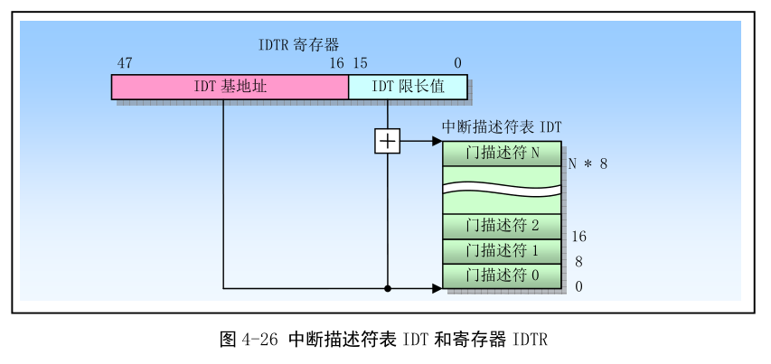
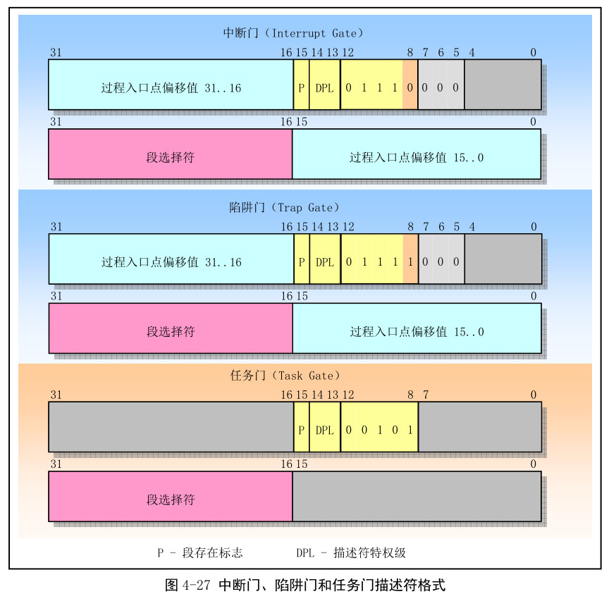
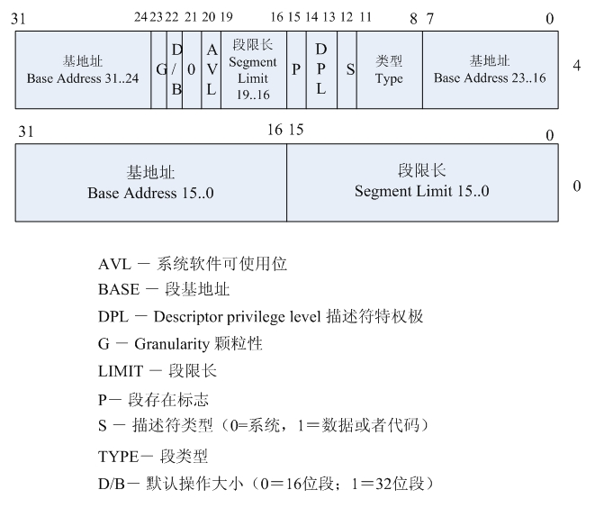
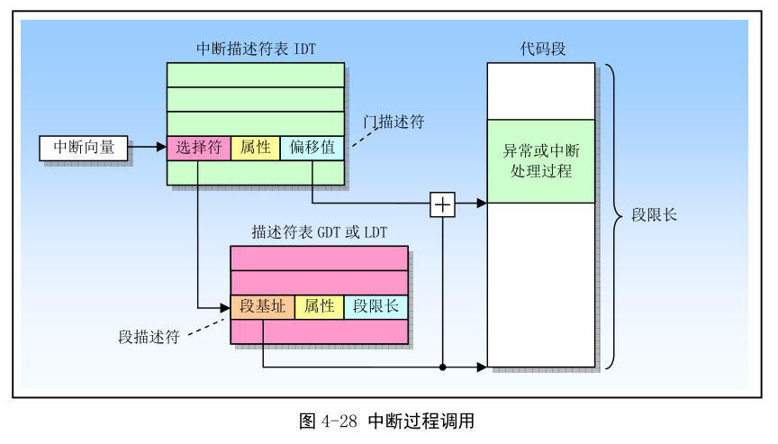
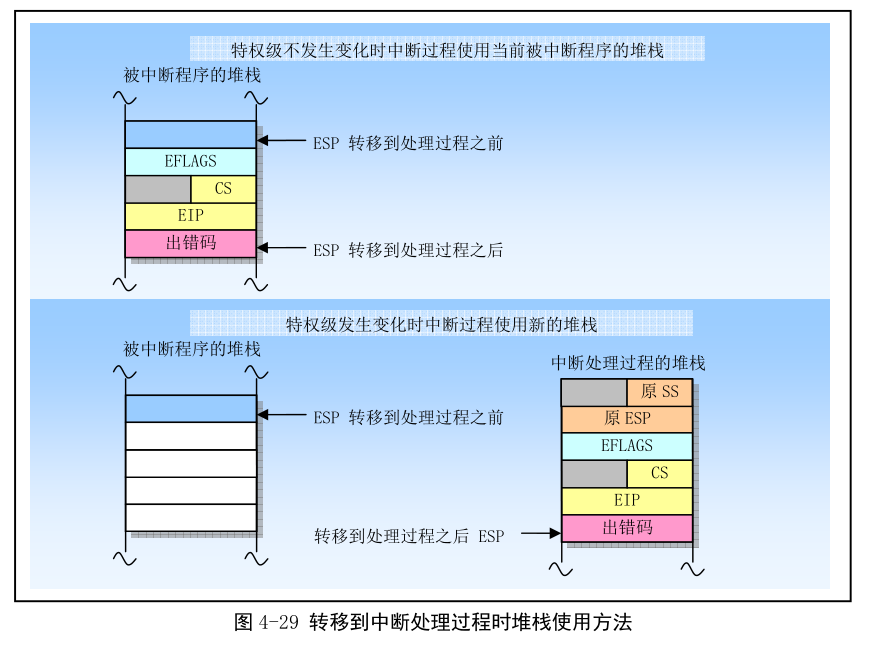
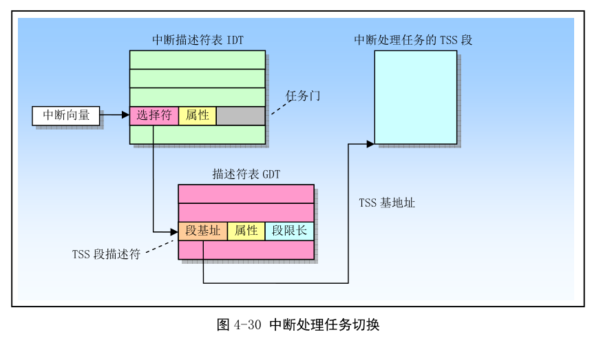

- 4.6 中断和异常处理
    - 4.6.1 异常和中断向量
    - 4.6.2 中断源和异常源
    - 4.6.3 异常分类
    - 4.6.4 程序或任务的重新执行
    - 4.6.5 开启和禁止中断
    - 4.6.6 异常和中断的优先级
    - 4.6.7 中断描述符表
    - 4.6.8 IDT 描述符
    - 4.6.9 异常与中断处理
    - 4.6.10 中断处理任务
    - 4.6.11 错误码

中断(Interrupt)和异常(Exception)指明系统、处理器或当前程序的某处出现一个事件, 该事件需要处理器进行处理. 通常, 这种事件会导致执行控制被强制转移到称为中断处理程序(interrupt handler)或异常处理程序(exception handler)的特殊函数或任务中. 处理器响应中断或异常所采取的行为被称为中断/异常服务(处理).

通常, 中断发生在程序执行的随机时刻, 以响应硬件发出的信号. 系统硬件使用中断来处理外部事件, 例如要求为外部设备提供服务. 当然, 软件也能通过执行 INT n 指令产生中断.

异常发生在处理器执行一条指令后, 检测到一个出错条件时发生, 例如被 0 除出错条件. 处理器可以检测到各种出错条件, 包括违反保护机制、页错误以及机器内部错误.

80x86 的中断和异常可透明地处理. 处理器会挂起、处理中断或异常、恢复.

## 1. 异常和中断向量

异常和中断条件都有一个标识号, 称为向量(vector). 处理器把赋予异常或中断的向量用作中断描述符表 IDT(Interrupt Descriptor Table)中的一个索引号, 来定位一个异常或中断的处理程序入口点位置.

向量号范围是 0 ~ 255. 其中 0 ~ 31 保留用作 80x86 处理器定义的异常和中断.

其他向量可用户自定义, 通常用于外部 I/O 设备, 使得这些设备可通过外部硬件中断机制向处理器发送中断.

## 2. 中断源和异常源

### 2.1 中断源

处理器从两种地方接收中断:

- 外部(硬件产生)的中断;

- 软件产生的中断.

**外部中断通过处理器芯片上两个引脚(INTR 和 NMI)接收**. 当引脚 INTR 接收到外部发生的中断信号时, 处理器会从系统总线上读取**外部中断控制器**(如 8259A)提供的**中断向量号**. 当引脚 NMI(Non Maskable Interrupt)接收到信号时, 产生一个非屏蔽中断. 它使用固定的中断向量号 2. 任何通过处理器 INTR 引脚接收的外部中断被称为可屏蔽硬件中断, 包括中断向量号 0 ~ 255. 标志寄存器 EFLAGS 中 IF 标志可用来屏蔽这些硬件中断.

通过在指令操作数中提供**中断向量号**, **INT n 指令**(这是个指令)可用于软件产生中断. 例如, 指令 INT 0x80 会执行 Linux 的系统中断调用中断 0x80. **向量 0 ~ 255 中**任何一个可用作 INT 指令的**中断号**. 如果使用了处理器预先定义的 NMI 向量, 则处理器的响应将与普通方式产生的不同. 如果 NMI 的向量号 2 用于该 INT 指令, 会调用 NMI 的中断处理器程序, 但此时并不会激活处理器的 NMI 处理硬件.

注意: EFLAGS 中 IF 标志不会屏蔽使用 INT 指令从软件中产生的中断(由此可判断: 软件中断是直接使用向量号, 处理器屏蔽是屏蔽 INTR 引脚).

### 2.2 异常源

处理器接收的异常也有两个来源:

- 处理器检测到的程序错误异常;

- 软件产生的异常.

**在程序或 OS 执行期间, 若处理器检测到程序错误, 就会产生一个或多个异常**. 80x86 处理器为其检测到的每个异常定义了一个向量. 异常可分为故障、陷阱和中止.

指令 INTO、INT3 和 BOUND 指令可用来从软件中产生异常. 这些指令可对指令流中指定点执行的特殊异常条件进行检查. 例如, INT 3 指令会产生一个断点异常.

INT n 指令可用于在软件中模拟指定的异常, 但有个限制. 若 INT 指令中操作数 n 时 80x86 异常的向量号之一, 则处理器会为该向量号产生一个中断, 该中断就会去执行与该向量有关的异常处理程序. 但因为这实际上是一个中断, 处理器不会把一个错误号压入堆栈, 即使硬件产生的该向量相关的中断通常会产生一个错误码. 对于那些会产生错误码的异常, 异常的处理程序会试图从堆栈上弹出错误码. 因此, 如果使用 INT 指令来模拟异常, 处理程序会把 EIP(此时正好处于缺少的错误码位置处)弹出堆栈, 从而会造成返回位置错误.

下表列出 Intel 处理器在保护模式下的中断和异常.

## 3. 异常分类

根据异常被报告的方式以及导致异常的指令是否能被重新执行, 异常可细分为故障(Falut)、陷阱(Trap)和中止(Abort).

- Fault 是一种通常可以被纠正的异常, 并且一旦被纠正程序就可以继续运行. 当出现一个 Fault, 处理器会把机器状态恢复到产生 Fault 的指令之前的状态. 此时异常处理程序的返回地址会指向产生 Fault 的指令, 而不是其后面一条指令. 因此在返回后产生 Fault 的指令将被重新执行.

- Trap 是一个引起陷阱的指令被执行后立刻会报告的异常. Trap 也能让程序或任务连贯地执行. Trap 处理程序的返回地址指向**引起陷阱指令的随后一条指令**, 因此在返回后会执行下一条指令.

- Abort 是一种不会总是报告导致异常的指令的精确位置的异常, 并且不允许导致异常的程序重新继续执行. Abort 用于报告严重错误, 例如硬件错误以及系统表中存在不一致性或非法值.

下表是 Intel 处理器在保护模式下的中断和异常.

## 4. 程序或任务的重新执行

为了让程序或任务在一个异常或中断处理完之后能重新恢复执行, 除了中止(Abort)之外的所有异常都能报告精确的指令位置, 并且所有中断保证是在指令边界上发生.

故障类异常, 处理器产生异常时保存的返回指针指向出错指令. 原出错指令会被重新执行. 通常用于处理访问指令操作数受阻的情况. Fault 最常见一个例子时页面故障(Page-fault)异常. 当引用不在内存中页面上的一个操作数就会出现这种异常. 当发生页面故障, 异常处理程序可以把该页面加载到内存中并通过重新执行出错指令来恢复程序执行. 处理器会保存必要的寄存器和堆栈指针信息, 以使得处理器能返回到执行出错指令之前的状态.

陷阱类异常, 处理器产生异常时保存的返回指针指向**引起陷阱操作的后一条指令**. 若在一条执行控制转移的指令执行期间检测到 Trap, 则返回指令指针会反映出**控制的转移情况**. 例如, 执行 JMP 指令时检测到一个 Trap 异常, 那么返回指令指针会指向 JMP 指令的目标位置, 而非 JMP 指令随后的一条指令.

中止类异常, 通常用于收集异常发生时有关处理器状态的诊断信息, 并尽可能关闭程序和系统.

## 5. 开启和禁止中断

标志寄存器 EFLAGS 的中断允许标志 IF(Interrupt enable Flag)能够禁止为处理器 INTR 引脚上收到的可屏蔽硬件中断提供服务. IF=0 会禁止; IF=1, 发送到 INTR 引脚上的中断信号会被处理器处理.

IF 不会影响发送到 NMI 引脚上的非屏蔽中断, 也不影响处理器产生的异常. 如同 EFLAGS 其他标志一样, 处理器在响应硬件复位操作时会清除 IF 标志(IF=0).

IF 标志可以使用指令 STI 和 CLI 来设置或清除. 只有当程序的 CPL 小于等于 IOPL 时候才会执行这两条指令, 否则将引发一般保护性异常.

IF 标志也会受以下操作影响:

- PUSHF 指令会将 EFLAGS 内容存入堆栈中, 并且可以在那里被修改. 而 POPF 指令可用于把已经修改的标志内容放入 EFLAGS 寄存器中;

- 任务切换时、POPF 和 IRET 指令会加载 EFLAGS 寄存器. 即, 可以修改 IF 标志;

- 当通过中断门处理一个中断, IF 会被自动清除(复位), 从而禁止可屏蔽硬件中断. 但通过陷阱门来处理一个中断, IF 标志不会复位.

## 6. 异常和中断的优先级

如果在一条指令边界有多个异常或中断等待处理时, 处理器会按照一定次序处理. 处理器优先处理最高优先级类中的异常或中断. 低优先级的异常会被丢弃, 低优先级的中断会保持等待. 当中断处理程序返回到产生异常和/或中断的程序或任务时, 被丢弃的异常会重新发生.

## 7. 中断描述符表

中断描述符表(Interrupt Descriptor Table, IDT)将每个**异常或中断向量**分别与**处理过程**联系起来. 与 GDT 和 LDT 表类似, IDT 也是由 8 字节长描述符组成的一个数组. 与 GDT 不同, 表中第 1 项可以包含描述符. 为了构成 IDT 表中的一个索引值, 处理器把异常或中断的向量号乘以 8. 因为最多 256 个中断或异常向量, IDT 可以含有少于 256 个描述符. 不过 IDT 中所有空描述符项应该设置其存在位(标志)为 0.

IDT 表可以驻留在线性地址空间的任何地方, 处理器使用 IDTR 寄存器来定位 IDT 表的位置. 这个寄存器中含有 IDT 表 32 位的基地址和 16 位限长(limit)值. 限长值是以字节为单位的 IDT 表的长度.

IDTR 是 CPU 的寄存器, IDT 存在内存中.

LIDT 和 SIDT 指令分别用于加载和保存 IDTR 寄存器的内容.

- LIDT 指令用于把内存中限长值和基地址操作数加载到 IDTR 寄存器中. 该指令仅能由 CPL 为 0 的代码执行, 通常被用于创建 IDT 时的操作系统初始化代码中.

- SIDT 指令用于把 IDTR 中的基地址和限长内容复制到内存中. 该指令在任何特权级均可使用.

若中断或异常向量引用的描述符超过 IDT 的界限, 处理器会产生一个一般保护性异常.

## 8. IDT 描述符

IDT 表中可以存放三种类型的门描述符: 中断门(Interrupt gate)描述符、陷阱门(Trap gate)描述符、任务门(Task gate)描述符.

下面给出了三种门的描述符的格式. (与 GDT 或者 IDT 中描述符格式大体一致, 参照 Computer_Architecture/x86/CPU/实模式和保护模式区别及寻址方式.md)

中断门和陷阱门含有一个长指针(即段选择符和偏移值), 处理器使用这个长指针把程序执行权转移到代码段中异常或中断的处理过程中. 这两个段的主要区别在于处理器操作 EFLAGS 寄存器 IF 标志上. **IDT 中任务门描述符的格式与 GDT 和 LDT 中任务门的格式相同**. 任务门描述符中含有一个任务 TSS 段的选择符, 该任务用于处理异常或中断.

GDT 中描述符格式如下:

- 中断门描述符(Interrupt-gate descriptor):  用于中断处理, 其类型码为 110, 中断门包含了一个外设中断或故障中断的处理程序所在段的选择子和段内偏移量. 当控制权通过中断门进入中断处理程序时, 处理器清 IF 标志, 即关中断, 以避免嵌套中断的发生. 中断门中的 DPL(Descriptor Privilege Level)为 0, 因此用户态的进程不能访问中断门. 所有的中断处理程序都由中断门激活, 并全部限制在内核态.

- 陷阱门描述符(Trap-gate descriptor): 用于系统调用, 其类型码为 111, 与中断门类似, 其唯一的区别是, 控制权通过陷阱门进入处理程序时维持 IF 标志位不变, 也就是说, 不关中断.

- 任务门描述符(Task-gate descriptor): 主要是 Intel 设置的"任务"切换的手段(和调用门描述符(Call-gate descriptor, 在 GDT 中)一起).

## 9. 异常与中断处理

当响应一个异常或中断时, 处理器使用异常或中断的**向量**作为**IDT 表中的索引**, 若索引值指向中断门或陷阱门, 处理器使用与 CALL 指令操作调用门类似方法调用异常或中断处理程序. 若索引值指向**任务门**, 处理器使用与**CALL 指令(调用)**操作任务门类似方法进行**任务切换(略见下面, 详细见下一章节"任务管理")**, 执行异常或中断的处理任务.

异常或中断门引用运行在当前任务上下文中的异常或中断处理过程(不是任务切换, 任务切换方法那几种), 如图. 门中的段选择符指向 GDT 或当前 LDT 中的可执行代码段描述符. 门描述符中的偏移字段指向异常或中断处理过程的开始处.

当处理器执行异常或中断处理过程调用时会进行以下操作(以下操作不适用任务门, 任务门是任务切换一种方式, 任务切换没有信息压栈):

(1) 如果处理过程将在高特权级(如 0)上执行时就会发生堆栈切换操作, 切换过程如下:

- 处理器从当前执行任务的 TSS 段中得到中断或异常处理过程使用的堆栈的段选择符和栈指针(例如 tss.ss()、tss.esp()). 然后处理器会把被中断程序(或任务)的段选择符和栈指针压入新栈, 如图;

- 接着处理器会把 EFLAGS、CS 和 EIP 寄存器的当前值也压入栈中;

- 如果异常会产生一个错误号, 那么错误号也会被最后压入新栈.

(2) 如果处理过程将在被中断任务同一特权级上运行, 那么:

- 处理器把 EFLAGS、CS 和 EIP 寄存器的当前值保存在当前堆栈上;

- 如果异常会产生一个错误号, 那么该错误号也会被最后压入新栈.

为了从中断处理过程返回, 处理过程必须使用 IRET 指令. IRET 指令与 RET 指令类似, 但 IRET 还会把保存的寄存器内容恢复到 EFLAGS 中. 不过只有当 CPL 是 0 时才会恢复 EFLAGS 中的 IOPL 字段, 并且只有当 CPL 不大于 IOPL 时, IF 标志才会被改变. 如果当调用中断处理过程时发生了堆栈切换, 那么在返回时 IRET 指令会切换到原来的堆栈.

### 9.1 异常和中断处理过程的保护

该特权级保护机制与通过调用门调用普通过程类似. 处理器不允许把控制转移到比 CPL 更低特权级代码段的中断处理过程中, 否则将产生一个一般保护性异常. 另外, 中断和异常的保护机制在以下方面与一般调用门过程不同:

- 因为中断和异常向量没有 RPL, 因此在隐式调用异常和中断处理过程时不会检查 RPL.

- 只有当一个异常或中断是由软中断 INT n、单步中断 INT3 或 INTO 指令产生时, 处理器才会检查中断门或陷阱门中的 DPL. 此时 CPL 必须小于等于门的 DPL.

这个限制可以防止运行在特权级 3 的应用程序使用软件中断访问重要的异常处理程序, 例如页错误处理过程, 假设这些处理过程已被存放在更高特权级的代码段中. 对于硬件产生的中断和处理器检测到的异常, 处理器会忽略中断门和陷阱门中的 DPL.

因为异常和中断通常不会定期发生, 因此这些有关特权级的规则有效地增强了异常和中断处理过程能够运行的特权级限制. 可以使用下面技术之一避免违反特权级保护:

- 异常或中断处理程序可以存放在一个一致性代码段中. 这个技术可以用于只需访问堆栈上数据的处理过程(例如, 除出错异常). 如果处理程序需要数据段中的数据, 那么特权级 3 必须能访问这个数据段. 这样就没保护了.

- 处理过程可以放在具有特权级 0 的非一致代码段中. 这种处理过程总是可以执行的, 而不管被中断程序或任务的当前特权级 CPL.

### 9.2 异常或中断处理过程的标志使用方式

通过**中断门或陷阱门(没有任务门)**访问一个异常或中断处理过程时, 处理器会在把 EFLAGS 寄存器内容保存到堆栈上之后清除 EFLAGS 的 TF 标志. 清除 TF 可以防止指令跟踪影响中断响应. 而随后的 IRET 指令会用堆栈上的内容恢复 EFLAGS 的原 TF 标志.

中断门与陷阱门唯一区别在于处理器器 EFLAGS 寄存器 IF 标志的方法. 当通过中断门访问一个异常或中断处理过程时, 处理器会复位 IF 标志以防止其他中断干扰当前中断处理过程. 随后的 IRET 指令则会用保存在堆栈上的内容恢复 EFLAGS 寄存器的 IF 标志. 而通过陷阱门访问处理过程并不会影响 IF 标志.

### 9.3 执行中断处理过程的任务

**当通过 IDT 表中任务门访问异常或中断处理过程时, 就会导致任务切换**. 从而可以在一个专用任务中执行中断或异常处理过程. IDT 表中的任务门引用 GDT 中 TSS 描述符. 切换到处理过程任务的方法**与普通任务切换一样(下一章 "任务切换")**. **Linux 没有使用这种中断处理方式**.

## 10. 中断处理任务

通过 IDT 中任务门来访问异常或中断处理程序会导致任务切换. 使用单独任务来处理异常或中断好处:

- 被中断程序或任务的完整上下文会被自动保存

- 在处理中, 新 TSS 可以允许处理过程使用新特权级 0 的堆栈. 在当前特权级 0 的堆栈已毁坏时如果发生了一个异常或中断, 那么在为中断过程提供一个新特权级 0 的堆栈条件下, 通过任务门访问中断处理过程能防止系统崩溃

- 通过使用单独 LDT 给中断或异常处理任务独立的地址空间, 可以把它与其他任务隔离.

使用独立任务处理异常或中断的不足: 在任务切换时必须对大量机器状态进行保存, 使得它比中断门的响应速度慢, 导致中断延时增加.

IDT 中任务门引用 GDT 中的 TSS 描述符, 如下图. 切换到句柄任务的过程与普通任务切换相同. 到被中断任务的反向链接会被保存在句柄任务 TSS 的前一任务链接字段中. 如果在一个异常会产生一个错误码, 则该出错码会被复制新任务堆栈上.

当异常或中断句柄任务用于操作系统中时, 实际上有两种分派调度任务的机制: 操作系统软件调度和处理器中断机制的硬件调度. 使用软件调度方法时需要考虑到中断开启时采用中断处理任务.

## 11. 错误码

当异常条件与一个特定的段相关时, 处理器会把一个错误码压入异常处理过程的堆栈上. 错误码格式如图. 错误码很像一个段选择符, 但最低 3 位不是 TI 和 RPL 字段, 而是下面 3 个标志:

- 位 0 是外部事件 EXT(External event)标志. 置位时, 表示执行程序以外的事件造成了异常, 如硬件中断.

- 位 1 是描述符位置 IDT(Description location)标志. 当置位时, 表示错误码索引部分指向 IDT 中的一个门描述符. 当该位复位时, 表示索引部分指向 GDT 或 LDT 中的一个段描述符.

- 位 2 时 GDT/LDT 表选择标志 TI. 只有当位 1 的 IDT=0 时才有用. 当该 TI=1 时, 表示错误码的索引部分指向 LDT 中的一个描述符. 当 TI=0 时, 说明错误码中索引部分指向 GDT 表中的一个描述符.

段选择索引字段提供了错误码引用的 IDT、GDT 或当前 LDT 中段或门描述符的索引值. 空错误码(低 16 位全 0)表示错误不是由于引用某个特定段造成, 或者是在操作中引用了一个空段描述符.

页故障(Page-fault)异常的错误码格式与上面不同, 如图. 只有最低三位有用, 他们的名称与页表项中的最后三位相同(U/S、W/R、P). 如下:

- 位 0(P), 异常是由于页面不存在或违反访问特权. P=0, 表示页不存在; P=1 表示违反页级保护权限.

- 位 1(W/R), 异常由于内存读或写操作引起. W/R=0, 表示由读操作引起; W/R=1, 表示由写操作引起.

- 位 2(U/S), 发生异常时 CPU 执行的代码级别. U/S=0, 表示 CPU 正在执行超级用户代码; U/S=1, 表示 CPU 正在执行一般用户代码.

另外, 处理器还会把引起页面故障异常的线性地址存放到 CR2 中. 页出错异常处理程序可以使用这个地址来定位相关的页目录和页表项.

注意, 错误不会被 IRET 指令自动弹出堆栈, 因此中断处理程序在返回之前必须清除堆栈上的错误码. 另外, 岁晚处理产生的某些异常会产生错误码并会自动保存到处理过程的堆栈中, 但是外部硬件中断或软件执行 INT n 指令产生的异常并不会把错误码压入堆栈中.
