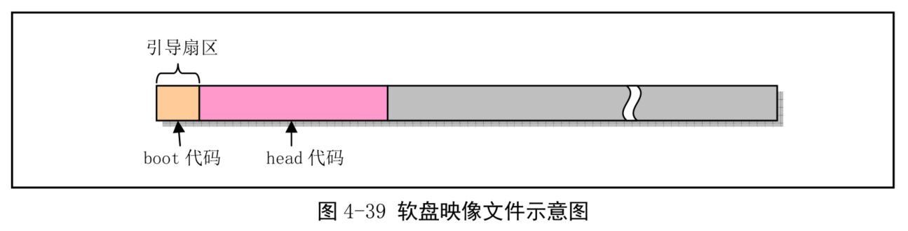
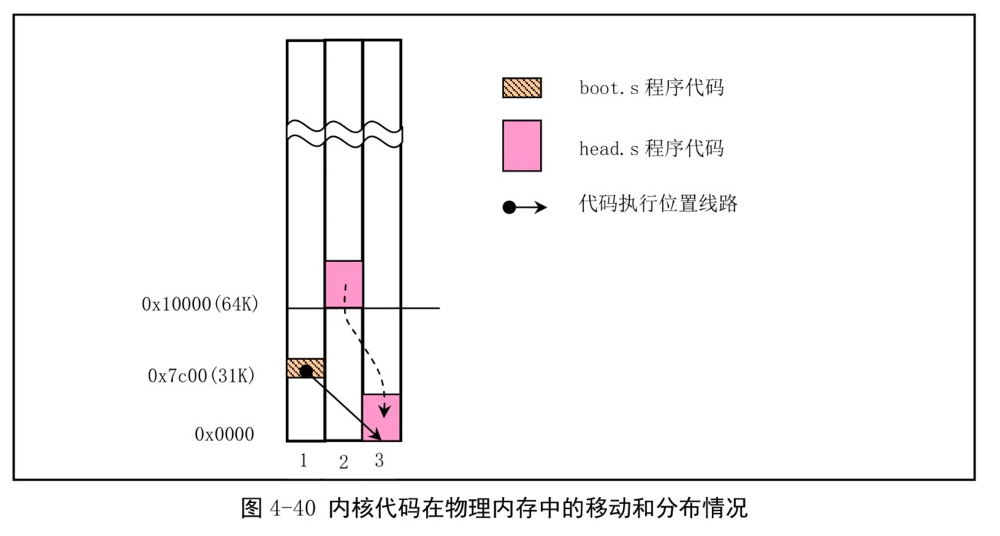
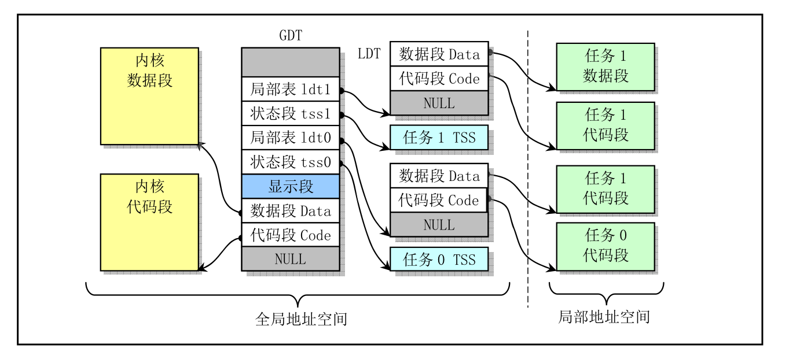
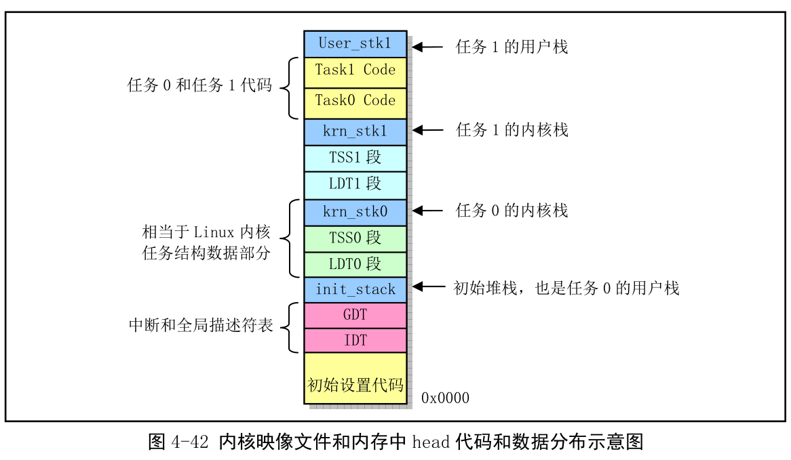
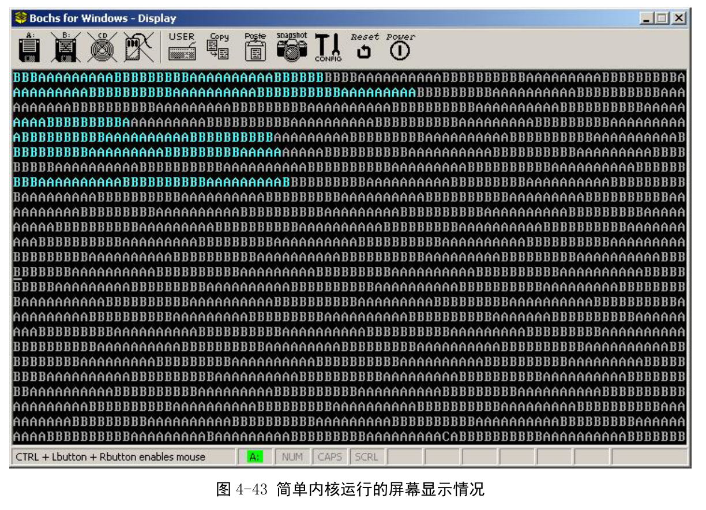

- 4.9 一个简单的多任务内核实例
    - 4.9.1 多任务程序结构和工作原理
    - 4.9.2 引导启动程序 boot.s
    - 4.9.3 多任务内核程序 head.s

该实例包含两个特权级 3 的用户任务和一个系统调用中断过程. 首先说明这个简单内核的基本结构和加载运行的基本原理, 然后描述是如何被加载进机器 RAM 内存中以及两个任务是如何进行切换运行的. 最后给出源码: 启动引导程序 boot.s 和保护模式多任务内核程序 head.s.

## 1. 多任务程序结构和工作原理

2 个文件. 一个是使用 as86 语言编制的引导启动程序 boot.s, 用于上电时从启动盘上把内核代码加载到内存中; 另一个是使用 GNU as 汇编编写的内核程序 head.s, 其中实现了两个运行在特权级 3 上的任务在时钟中断控制下相互切换运行, 并且还实现了在屏幕上显示字符的一个系统调用. 这两个任务分别称为任务 A 和任务 B, 它们会调用显示系统调用在屏幕上分别显示出字符'A'和字符'B', 直到每个 10 毫秒切换到另一个任务. 若要终止该程序, 需要重启机器.

boot.s 编译出来的代码一共 512 字节, 会存放在可启动设备的第一个扇区, 如图. PC 加电后, ROM BIOS 会把启动盘第一个扇区加载到物理内存 0x7c00(31KB)处, 并把执行权转移到 0x7c00 处开始运行 boot 程序代码.

boot 程序的主要功能是把 head 内核代码加载到内存某处, 并在设置好临时 GDT 表等信息后, 把处理器设置为运行在保护模式下, 然后跳转到 head 代码处去运行内核代码. 实际上, boot.s 程序会首先利用 ROM BIOS 中断 int 0x13 把软盘中的 head 代码读入到内存 0x10000(64KB)位置开始处, 然后把这段 head 代码移动到到内存 0 开始处. 最后设置控制器 CR0 中的开启保护运行模式标志, 并跳转到内存 0 处开始执行 head 代码. boot 程序代码在内存中移动 head 代码的示意图如下.

把 head 代码移动到物理内存 0 开始处主要原因是为了设置 GDT 表可以简单点, 因而也能让 head.s 程序尽量短一些. 但是不能让 boot 程序把 head 代码从软盘或映像文件中直接加载到内存 0 处. 因为加载操作需要使用 ROM BIOS 提供的中断过程, 而 BIOS 使用的中断向量表正处于内存 0 开始的地方, 并且在内存 1KB 开始处是 BIOS 程序使用的数据区. 当然也可以把 head 代码加载到内存 0x10000 处就直接跳转到该处运行 head 代码, 使用这种方式的源码可从 oldlinux.org 下载, 见下面说明.

head.s 运行在 32 位保护模式下, 其中主要包括初始化设置的代码、时钟中断 int 0x80 的过程代码、系统调用中断 int 0x80 的过程代码和任务 A 和 B 的代码数据.

其中初始化设置工作主要包括:

1. 重新设置 GDT 表;

2. 设置系统定时器芯片;

3. 重新设置 IDT 表并设置时钟和系统调用中断;

4. 移动到任务 A 中执行.

在虚拟地址空间中 head.s 程序的内核代码和任务代码分配如图. 实际上, 该内核示例中所有代码和数据段都对应到物理内存同一个区域上, 即从物理内存 0 开始的区域. GDT 中全局代码段和数据段描述符的内容都设置为: **基地址位 0x0000; 段限长值 0x07ff. 因为颗粒度为 1(Granularity, 0 表示单位是字节, 1 表示单位是 4KB), 所以实际段长度是 8MB. 而全局显示数据段被设置为: 基地址 0xb8000; 段限长值 0x0002, 所以实际长度为 8KB, 对应到显示内存区域. **(??????)

内核和任务在虚拟地址空间中的分配示意图:

两个任务在 LDT 中代码段和数据段描述符的内容也都设置为基地址 0x0000; 段限长 0x3ff, 实际段长度为 4MB. 因此在线性地址空间中这个"内核"的代码和数据段与任务的代码和数据段都从线性地址 0 开始并且由于没有采用分页机制, 所以直接对应物理地址 0 开始. 在 head 编译出的目标文件中以及最终得到的映像文件中, 代码和数据的组织形式见图:

由于处于特权级 0 的代码不能把控制权转移到特权级 3 的代码中执行, 但中断返回操作是可以的, 因此当初始化 GDT、IDT 和定时芯片结束后, 利用中断返回指令 IRET 来启动运行第一个任务. 具体实现方法是在初始堆栈 init\_stack 中人为设置一个返回环境. 即把任务 0 的 TSS 段选择符加载到任务寄存器 LTR、LDT 段选择符加载到 LDTR 中以后, 把任务 0 的用户栈指针(0x17:init\_stack)和代码指针(0x0f:task0)以及标志寄存器值压栈, 然后执行中断返回指令 IRET. 该指令会弹出堆栈上的堆栈指针作为任务 0 的用户栈指针, 恢复假设的任务 0 的标志寄存器内容, 并且弹出栈中代码指针放入 CS:EIP 寄存器中, 从而开始执行任务 0 的代码, 完成了从特权级 0 的到特权级 3 代码的控制转移.

为每隔 10 毫秒切换运行的任务, head.s 程序中把定时器芯片 8253 的通道 0 设置成每经过 10 毫秒就向中断控制芯片 8259A 发送一个时钟中断请求信号. PC 的 ROM BIOS 开机时已经在 8259A 中把时钟中断请求信号设置成中断向量 8, 因此需要在中断 8 的处理过程中执行任务切换操作. 任务切换实现是查看 current 变量中的当前运行任务号. 若 current 是 0, 就利用任务 1 的 TSS 选择符作为操作数执行远跳转指令, 从而切换到任务 1 中执行, 否则反之.

每个任务执行时, 会首先将一个字符的 ASCII 码放入寄存器 AL 中, 然后调用系统中断调用 int 0x80, 而该系统调用处理过程则会调用一个简单的字符写屏程序, 把寄存器 AL 中字符显示在屏幕上, 同时把字符显示的屏幕下一个位置记录下来, 作为下一个显示字符的屏幕位置. 在显示过一个字符后, 任务代码会使用循环语句延迟一段时间, 然后又跳转到任务代码开始处循环执行, 直到运行了 10 毫秒而发生定时中断, 从而代码会切换到另一个任务. 对于任务 A, 寄存器 AL 中始终存放字符"A", 而任务 B 运行时 AL 中始终存放字符"B". 效果如下图.

图中最下面一行有个字符"C", 这是因为 PC 机偶然产生了一个不是时钟中断和系统调用中断的其他中断. 因为我们在程序中给所有其他中断安装了一个默认中断处理程序. 当出现一个其他中断, 便会运行, 然后退出中断.

## 2. 引导启动程序 boot.s

为了让程序简单, 这个引导启动扇区程序仅能加载长度不超过 16 个扇区的 head 代码, 并且直接使用了 ROM BIOS 默认设置的中断向量号, 即定时中断请求处理的中断号仍是 8. 这与 Linux 系统中使用的是不同的. Linux 会在内核初始化时重新设置 8259A 中断控制芯片, 并把时钟中断请求信号对应到中断 0x20 上, 详细见"内核引导启动程序"章节.

该文件的详细注释见代码.

## 3. 多任务内核 head.s

进入保护模式后, head.s 重新设置了 IDT、GDT 表, 为了与后面 Linux 0.12 源码设置一致.

该文件的详细注释见代码.