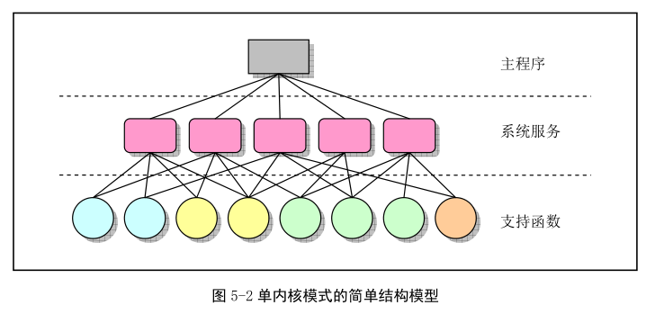

先概要介绍 Linux 内核编制模式和体系结构, 然后详细描述了 Linux 内核源码目录的组织形式以及子目录中各个代码文件的主要功能以及基本调用的层次关系. 接下来, 从源码目录下的第一个文件 Makefile 开始, 对每一行代码详细注释说明.

一个完整的系统主要由 4 部分: 硬件、操作系统内核、操作系统服务和用户应用程序, 如图. 操作系统服务程序是指那些向用户提供的服务被看作操作系统部分功能的程序. Linux 中, 这些包括了 X 窗口系统、shell 命令解释系统以及内核编程接口等系统程序.

本章, 首先基于 Linux 0.12 源码, 简明描述 Linux 内核的基本体系结构、主要构成模块. 然后对源码中出现的几个重要数据结构说明. 最后描述构建 Linux 0.12 内核编译实验环境的方法.

目前, 操作系统的结构模式主要可分为整体式的单内核模式和层次式的微内核模式. Linux 0.12 采用了单内核模式. 单内核模式主要优点时内核代码结构紧凑、执行速度快, 不足时层次结构性不强.

在单内核模式的系统中, 操作系统提供服务流程: **应用主程序使用指定的参数值执行系统调用指令(int x80), 使 CPU 从用户态(User Mode)切换到核心态(Kernel Mode), 然后操作系统根据具体参数值调用特定的系统调用服务程序, 而这些服务程序则根据需要再调用底层的一些支持函数以完成特定功能. 完成服务后, 操作系统又使 CPU 从核心态转回用户态, 从而返回到应用程序中继续执行**.

如下图.

