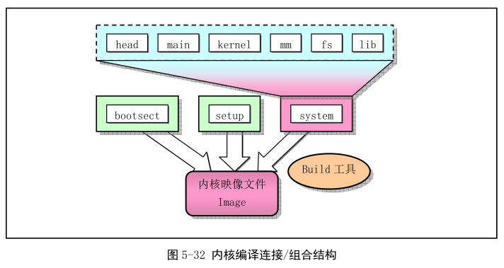

Makefile 文件相当于程序编译中的批处理文件. 是工具程序 make 的输入数据文件. 只要在含有 Makefile 的当前目录中输入 make 命令, 就会自动根据 Makefile 文件中设置进行编译、连接或安装等操作.

## 1. 功能描述

这个 Makefile 文件的主要作用是指示 make 程序最终使用独立编译连接成的 tools/目录中的 build 执行程序将所有内核编译代码连接和合并成一个可运行的内核映像文件 image. 具体是对 boot/中的 bootsect.s、setup.s 使用 8086 汇编器编译, 分别生成各自的执行模块. 再对源码中的其他所有程序使用 GNU 的编译器 gcc/gas 进程编译, 并链接模块 system. 最后用 build 工具将这三块组成成一个内核映像文件 image. build 是由 tools/build.c 源码编译成的一个独立的执行程序, 它本身并没有被编译链接到内核代码中. 基本编译链接、组合结构如图.

## 2. 代码注释

