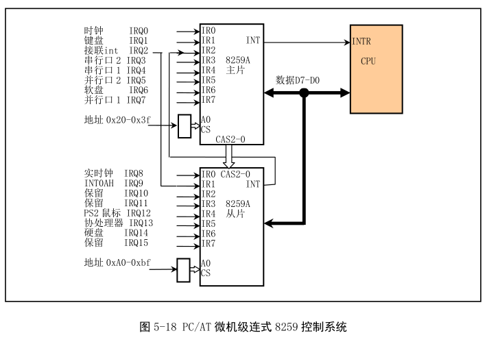
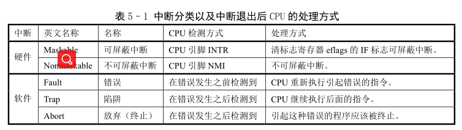
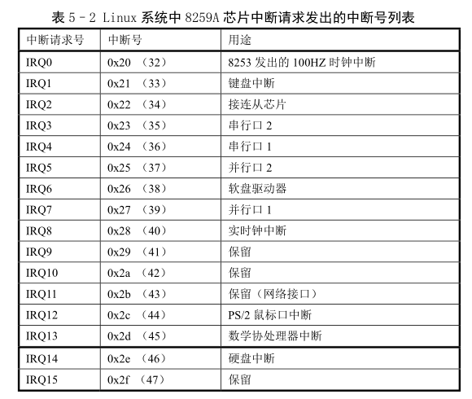

本节介绍中断机制基本原理和相关的可编程控制器硬件逻辑以及 Linux 系统中使用中断的方法. 具体参见第六章 setup.S 程序后的说明.

## 1. 中断操作原理

处理器向输入输出设备提供服务的一种方法是**轮询方式**. 这种方法中处理器顺序查询系统中的每个设备, "询问"是否需要服务. 另一种方法是**在设备需要服务时自己向处理器提出请求**.

在设备向处理器提出服务请求, 处理器会**在执行完当前的一条指令后**立刻应答设备请求, 并转而执行该设备的相关服务程序. 服务程序执行完后, 处理器会接着刚才被中断的程序. 这种处理方式就是中断(Interrupt), 而设备向处理器发出服务请求则称为中断请求(Interrupt Request, IRQ). 相关服务程序叫中断服务程序或中断服务过程(Interrupt Service Routine, ISR).

可编程中断控制器(Programmable Interrupt Controller, PIC)是中断请求的管理者.

- 它通过连接在设备上的引脚接受设备发出的中断服务请求信号. 当设备激活其中断请求 IRQ 信号时, PIC 立刻会检测到. 同时接收到多个中断服务请求, PIC 会进行优先级比较并选出最高优先级的中断请求进行处理. 如果处理器正在执行一个设备的中断服务程序, PIC 还需要把选出的中断请求与正在处理的优先级比较, 并基于该比较结果确定是否向处理器发出一个中断信号.

- 当 PIC 向处理器的 INT 引脚发出一个中断信号时, 处理器会立刻停下正在做的事情并询问 PIC 需要执行哪个中断服务请求.

- PIC 还要通过数据总线发出与中断请求对应的中断号来告知处理器要执行哪个中断服务过程.

- 处理器则根据读取的中断号通过查询中断向量表(或 32 位保护模式下中断描述符表)取得相关的中断向量(即中断服务程序的地址)并开始执行中断服务程序.

- 中断服务程序执行结束, 处理器继续执行被中断信号打断的程序.

上面是外部硬件中断的方式. 还有内部中断(异常)和软中断.

PC/AT 系列共提供 256 个中断的支持, 大部分用于软件中断或异常. 只有很少用于设备.

## 2. 80X86 微机的中断子系统

80X86 组成的微机中采用了 8259A 可编程中断控制器芯片. 每个 8259A 可以管理 8 个中断源. 多片级联, 8259A 最多能管理 64 个中断向量的系统.

两级示意图如下. 其中从芯片的 INT 引脚连接到主芯片的 IRQ2 引脚上, 即 8259A 从芯片发出的中断信号将作为 8259A 主芯片的 IRQ2 输入信号. 主芯片端口基地址是 0x20, 从芯片是 0xA0. IRQ9 引脚的作用与 PC/XT 的 IRQ2 一样, 即 PC/AT 机利用硬件电路把使用 IRQ2 的设备的 IRQ2 引脚重新定向到 PIC 的 IRQ9 上, 并利用 BIOS 中软件把 IRQ9 的中断 int 71 重新定向到了 IRQ2 的中断 int 0x0A 的中断处理过程. 这样一来, 任何使用 IRQ2 的 PC/XT 的 8 位适配卡在 PC/AT 中仍能正常使用, 做到了 PC 系列向下兼容.

在总线控制器控制下, CPU 使用 IN 或 OUT 指令对 8259A 进程编程. 芯片进入操作状态, 可以随时响应外部设备提出的中断请求(IRQ0\~IRQ15), 同时系统还可以使用操作命令字随时修改其中断处理方式. 通过中断判优选择, 芯片将选中当前最高优先级的中断请求作为中断服务对象, 并通过 CPU 引脚 INT 通知 CPU 外中断请求的到来, CPU 响应后, 芯片从数据总线 D7\~D0 将编程设定的当前服务对象的中断号送出, CPU 获得对应的中断向量值, 并执行中断服务程序.

## 3. 中断向量表

80X86 启动时, 处于实模式, ROM BIOS 中程序会在物理内存开始地址 0x0000:0x0000 处初始化并设置中断向量表.

BIOS 初始化时, 设置两个 8259A 芯片支持的 16 个硬件中断向量和和 BIOS 提供的中断号为 0x10\~0x1f 的中断调用功能向量等. 对于没有使用的则填入哑地址.

对于 Linux, 除了刚开始加载内核时需要用到 BIOS 提供的显示和磁盘读操作中断, 内核正常运行之前会在 setup.s 中重新初始化 8259A 芯片并在 head.s 程序中重新设置中断描述符表.

## 4. Linux 内核的中断处理

每个中断由 0\~255 之间一个数字标识. 中断 int0\~int31(0x00\~0x1f), 由 Intel 固定设定或保留, 属于软件中断, 但 Intel 称为异常. 因为这些中断是 CPU 执行指令时探测到的异常引起的. 通常可分为故障(Fault)、陷阱(Traps)和终止(Abort). 其他号用户自己设定.

所有中断分类和执行动作见表 5-1.

Linux 中, 将 int32\~int47(0x20\~02f)对应于 8259A 终端控制芯片发出的硬件中断请求号 IRQ0\~IRQ15(表 5-2), 并把程序编程发出的系统调用接口(system call)中断设为 int128(0x80). 系统调用中断是用户程序使用操作系统资源的唯一界面接口.

系统初始化时, 内核在 head.s 中首先使用一个哑中断向量(中断描述符)对中断描述符表(IDT)中所有 256 个描述符进行默认设置(boot/head.s, 78). 这个哑中断向量指向一个默认的"无中断"处理过程(boot/head.s, 150). 当发生一个这种中断就会显示信息"未知中断(Unknown interrupt)".

这里对所有 256 个项都进行设置, 可以有效防止出现一般保护性错误(A general protection fault)(异常 13). 否则, 若设置的 IDT 少于 256 项, 超过后会产生一般保护性出错(异常 13). 另外, 硬件出现问题没有将设备的向量放到数据总线上, CPU 通常会从数据总线上读入全 1(0xff)作为向量, 因此会去读取 IDT 表中 256 项, 也会出现一般保护性出错.

对于系统需要使用的一些中断, 内核会在其继续初始化过程中(init/main.c)中重新设置中断描述符. 通常, 异常中断处理过程(int0\~int 31)都在 trap.c 的初始化函数中重设(kernel/traps.c, 第 185 行), 而系统调用中断 int128 在调度程序初始化函数中重新设置(kernel/sched.c, 417 行).

另外, 在设置 IDT 时 Linux 内核使用了中断门和陷阱门两种描述符. 区别在于对标志寄存器 EFLAGS 中的中断允许 IF 的影响. 中断门描述符中断会复位 IF 标志, 可以避免其他中断干扰, 随后的中断结束指令 iret 会从堆栈恢复 IF 标志; 陷阱门中断不影响 IF. 参见 11 章对 include/asm/system.h 文件的说明.

## 5. 标志寄存器的中断标志

为避免竞争条件和中断对临界代码区的干扰, Linux 0,12 中内核代码使用了很多 cli 和 sti 指令. cli 复位 CPU 标志寄存器的中断标志, 使不响应外部中断. sti 设置, 允许响应外部中断.