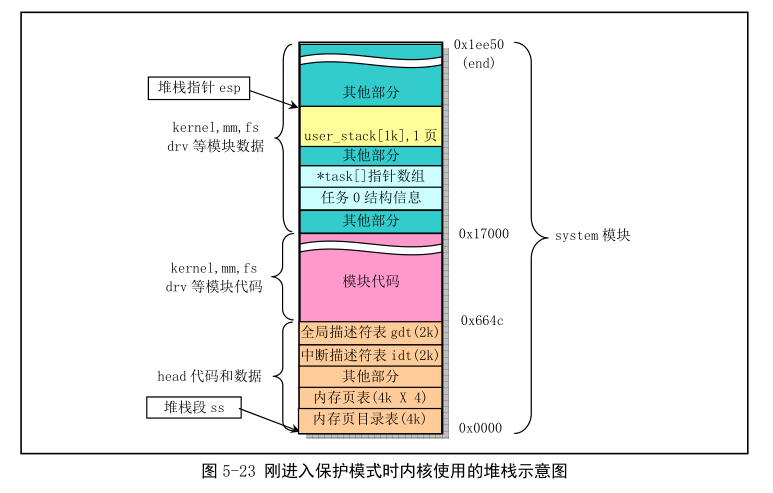
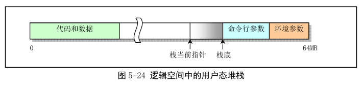
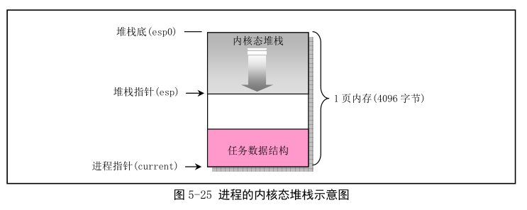
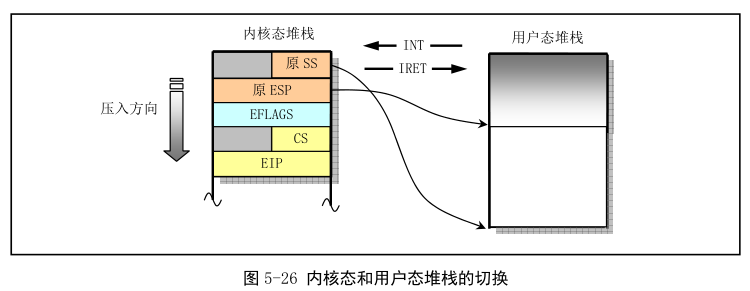

本节概要描述 Linux 内核从开机引导到系统正常运行过程中对堆栈的使用方式.

Linux 0.12 中共用了 4 种堆栈. 第 1 种是系统引导初始化时临时使用的堆栈; 第 2 种是保护模式后提供内核程序初始化使用的堆栈, 位于内核代码地址空间固定位置处. 该堆栈也是任务 0 使用的用户态堆栈; 第 3 种是每个任务通过系统调用, 执行内核程序时使用的堆栈, 任务的内核态堆栈. 每个任务都有自己独立的内核态堆栈; 第 4 种是任务在用户态执行的堆栈, 位于任务(进程)逻辑地址空间近末端处.

## 1. 初始化阶段

(1)开机初始化时(bootsect.S, setup.s)

当 bootsect 代码被 ROM BIOS 加载到物理内存 0x7c00 时, 并没有设置堆栈段. 直到 bootsect 被移动到 0x9000:0 时, 才把堆栈段寄存器 SS 设置为 0x9000, 堆栈指针 esp 设为 0xff00, 参见 boot/bootsect.s 第 61、62 行. setup.s 也沿用了这个. 这就是系统初始化时临时使用的堆栈.

(2)进入保护模式时(head.s)

从 head.s 起, 系统正式在保护模式下运行. 此时堆栈段被设为内核数据段(0x10), 堆栈指针 esp 设置成指向 user\_stack 数组的顶端(head.s, 31 行), 保留 1 页内存(4KB)作为堆栈使用. user\_stack 数组定义在 sched.c 的 67\~72 行, 共 1024 个长字. 它在物理内存位置见下图. 此时该堆栈是内核程序自己使用的堆栈. 其中地址是大约值, 取决于编译时实际设置参数. **这些地址位置从编译内核时生成的 system.map 文件中查到**.



(3)初始化时(main.c)

在 init/main.c 中, 执行 move\_to\_user\_mode()代码把控制权移交给任务 0 之前, 系统一直使用上述堆栈. 而在执行 move\_to\_user\_mode()后, main.c 的代码被"切换"成任务 0 中执行. 通过执行 fork()系统调用, main.c 中 init()将在任务 1 中执行, 并使用任务 1 的堆栈. 而 main()本身则在被"切换"成任务 0 后, 仍然继续使用上述内核程序自己的堆栈作为任务 0 的用户态堆栈.

## 2. 任务的堆栈

每个任务有两个堆栈, 分别用于用户态和内核态程序的执行, 并且分别称为用户态堆栈和内核态堆栈. 除了处于不同 CPU 特权级, 主要区别在于任务的内核态堆栈很小, 所保存的数据量最多不能超过 4096-任务数据结构块个字节, 约 3KB. 而任务的用户态堆栈却可以在用户的 64MB 空间内延伸.

(1)在用户态运行时

除了任务 0 和 1, 每个任务有自己的 64MB 地址空间. 当一个任务(进程)刚被创建时, 它的用户态堆栈指针被设置在其地址空间靠近末端(64MB)部分. 实际上末端先是执行程序的参数和环境变量, 然后是用户堆栈空间. 如下图. 实际使用的物理内存则由 CPU 分页机制确定. 由于 Linux 写时复制(Copy On Write), 因此, 进程创建后, 若该进程以及父进程没有使用堆栈, 则两者共享同一堆栈对应的物理内存页面. 只有当其中一个进程执行堆栈写操作(如 push)内核内存管理才会为写操作进程分配新内存页面. 进程 0 和 1 的用户栈比较特殊.



(2)在内核态运行时

每个任务有自己的内核态堆栈, 用于任务在内核代码中执行. 在线性地址中位置由该任务 TSS 段中 ss0 和 esp0 指定. ss0 是内核态堆栈的段选择符, esp0 是栈底指针. 因此每当任务从用户代码转移到内核代码中执行(纯控制转移, 不涉及任务切换), 任务的内核态栈总是空的. 任务内核态堆栈被设置在位于其任务数据结构(stask\_struct)所在页面的末端(同一页面). 这是 fork()程序在任务 tss 段的内核级堆栈字段(tss.esp0 和 tss.ss0)中设置的, 参见 kernel/fork.c, 92 行:

```
p->tss.esp0 = PAGE_SIZE + (long)p;
p->tss.ss0 = 0x10;  //内核数据段描述符
```

其中, p 是新任务的任务数据结构指针.



为何从主内存区申请的用来保存任务数据结构的一页内存也能被设置成内核数据段中的数据呢, 即 tss.ss0 为何可被设为 0x10?因为用户内核态栈仍属于内核数据空间. 在 head.s 末端, 分别设置了内核代码段和数据段的描述符, 段长度都被设为 16MB. 这个长度是 Linux 0.12 内核所能支持的最大物理内存长度(head.s, 110 行开始的注释). 因此, 内核代码可寻址到整个物理内存范围, 也包括了主内存区. 每当任务执行内核程序而使用其内核栈时, CPU 就会利用 TSS 结构把它的内核态堆栈设为由 tss.ss0 和 tss.esp0 两个值构成. 任务切换时, 旧任务的内核栈指针 esp0 不会被保存. 对 CPU, 这两个值只读. 所以每当一个任务进入内核态执行时, 其内核态堆栈总是空的.

(3)任务 0 和任务 1 的堆栈

任务 0(空闲进程 idle)和任务 1(初始化进程 init)堆栈特殊. **任务 0 和任务 1**的代码段和数据段相同, 限长也都是 640KB, 但**映射到不同线性地址范围**. 任务 0 的段基地址从线性地址 0 开始, 而任务 1 的段基地址从 64MB 开始. 但它们**全映射到物理地址 0\~640KB**. 这个范围也就是内核代码和基本数据所存放的地方.

任务 1 创建时复制任务 0 的用户堆栈, 所以刚开始任务 0 和任务 1 共享使用同一个用户堆栈空间. 但当任务 1 开始运行时, 由于任务 1 映射到 user\_stack[]处的页表项被设为只读, 使得任务 1 在执行堆栈操作时将引起写页面异常, 从而内核会使用写时复制为任务另行分配主内存区页面作为堆栈空间使用. 此时, 任务 1 才开始使用自己独立的用户堆栈内存页面. 所以任务 0 的堆栈需要在任务 1 实际开始使用前保持"干净", 即任务 0 此时不能使用堆栈, 以确保复制的堆栈页面中不含任务 0 的数据.

## 3. 任务内核态堆栈和用户态堆栈之间的切换

Linux 0.12 中, 所有中断服务程序都是内核代码. 若一个中断的产生时任务正在用户代码中执行, 则中断会引起 CPU 特权级从 3 到 0 的变化, 此时 CPU 就会进行用户态堆栈到内核态堆栈的切换操作. CPU 会从当前任务的 TSS 中取得新堆栈的段选择符和偏移值. 因为中断服务程序在内核中, 属于 0 级特权级代码, 所以 48 位内核态堆栈指针会从 TSS 的 ss0 和 esp0 字段获得. 在定位了新堆栈(内核态堆栈)后, CPU 先把原用户态堆栈指针 ss 和 esp 压入内核态堆栈, 然后将 eflags 和返回位置 cs、eip 压入内核态堆栈.

内核的系统调用是个软中断, 所以任务调用系统调用会进入内核并执行内核的中断服务代码. 此时内核代码就会使用该任务的内核态堆栈进行操作(这是常规中断处理过程, 也可以执行任务切换, 这里不会存在任务切换！！！). 内核态和用户态堆栈会发生切换. iret(远跳转返回指令)退出内核返回到用户程序.



**若一个任务正在内核态, 那么 CPU 响应中断就不需要堆栈切换, CPU 仅把 eflags 和 cs、eip 压入当前内核态堆栈, 然后执行中断服务过程**.

