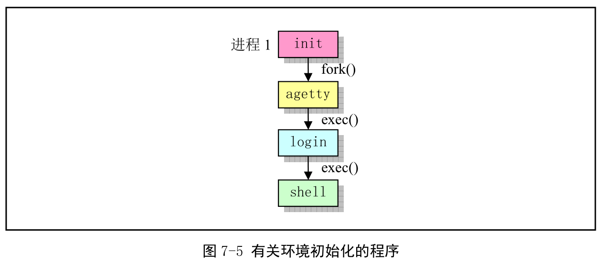

前面 183 行和 200 行, init()函数直接执行了命令解释程序(shell 程序)/bin/sh, 而在实际可用的系统中却不是这样. 为了能具有登录系统的功能和多人使用系统能力, 通常系统在这里或类似地址执行系统环境初始化程序 init.c, 而此程序会根据系统/etc/目录中配置文件的设置信息, **对系统中支持的每个终端设备创建子进程, 并在子进程中运行终端初始化设置程序 agetty(统称 getty 程序), getty 程序会在终端上显示用户登录提示信息"login:". 当用户输入用户名后, getty 被替换成 login 程序. login 在验证了用户输入口令后, 最终调用 shell 程序, 并进入交互界面**.



init 进程主要任务是根据/etc/rc 文件中设置的信息, 执行其中设置的命令, 然后根据/etc/inittab 文件中的信息, 为每个允许登录的终端设备使用 fork()创建一个子进程, 并在每个新子进程中运行 agetty(getty)程序. 而 init 进程则调用 wait(), 等待子进程结束状态. 每当一个子进程结束退出, 根据返回的 pid 知道哪个对应终端子进程结束, 因此就会为相应终端设备再创建一个新子进程, 并在该子进程中重新执行 agetty 程序. 这样, 每个被允许的终端设备都始终有一个对应的进程为其等待处理.

正常情况下, init 确定 agetty 正在工作着以允许用户登录, 并收取孤立进程. 孤立进程是指那些父辈进程已结束的进程; Linux 中所有进程必须属于单棵进程树, 所以孤立进程必须收取. 当系统关闭, init 负责杀死所有其他进程, 卸载所有文件系统以及停止处理器工作, 以及任何它被配置成要做的工作.

getty 主要设置终端类型、属性、速度和线路规格. 它打开并初始化一个 tty 端口, 显示提示信息, 并等待用户键入用户名. 该程序只能由超级用户执行. 通常, 若/etc/issue 文件存在, 则 getty 会首先显示其中的文本信息, 然后显示登录提示信息, 读取用户键入的登录名, 并执行 login 程序.

login 主要用来要求登录用户信息. 根据用户名, 从口令文件 passwd 中取得对应登录项, 然后调用 getpass()以显示"password:"提示信息, 读取密码, 然后使用加密算法加密处理, 并与口令文件中 pw\_passwd 字段比较. 多次密码无效, login 会以出错码 1 退出. 此时父进程 init 的 wait()会返回该退出进程的 pid, 因此会根据记录下来的信息再次创建一个子进程, 并在该子进程中针对该终端设备再次执行 agetty 程序.

正确登录后, login 将当前工作目录修改为口令文件制定的该用户起始工作目录. 并将该终端设备的访问权限修改成用户读/写和组写, 设置进程组 ID. 然后利用得到的信息初始化环境变量信息, 例如起始目录(HOME=)、使用的 shell 程序(SHELL=)、用户名(USER=和 LOGNAME=)和系统执行程序的默认路径序列(PATH=). 接着显示/etc/motd 文件(message-of-the-day)中文本信息, 并检查显示该用户是否有邮件信息. 最后 login 改变用户登录用户的用户 ID 并执行口令文件中该用户项中指定的 shell 程序, 如 bash 或 csh 等.

若口令文件/etc/passwd 该用户项中没有指定使用哪个 shell, 系统则默认使用/bin/sh 程序. 若没有用户起始目录, 系统默认使用根目录/.

登录过程中 login 开始执行 shell 时, 参数 argv[0]第一个字符时'-', 表示该 shell 作为一个登陆 shell 被执行. 此时该 shell 会根据该字符, 执行某些与登陆过程相应的操作. 登陆 shell 会首先从/etc/profile 文件以及.profile 文件读取命令并执行. 若在进入 shell 时设置了 ENV 环境变量, 或在登录 shell 的.profile 文件中设置了该变量, 则 shell 下一步会从该变量命令的文件中读取命令并执行. 因此用户应该把每次登录时都要执行的命令放在.profile 中, 而每次运行 shell 都要执行的命令放在 ENV 变量指定的文件中.

设置 ENV 环境变量的方法是将下列语句放在你起始目录的.profile 文件中:

```
ENV=$HOME/.anyfilename; export ENV
```

执行 shell 时, 除了一些指定的可选项, 如果还指定了命令行参数, 则 shell 会将第一个参数看做时一个脚本文件名并执行其中的命令, 而其余的参数则被看做时 shell 的位置参数($1、$2). 否则 shell 将从其标准输入中读取命令.