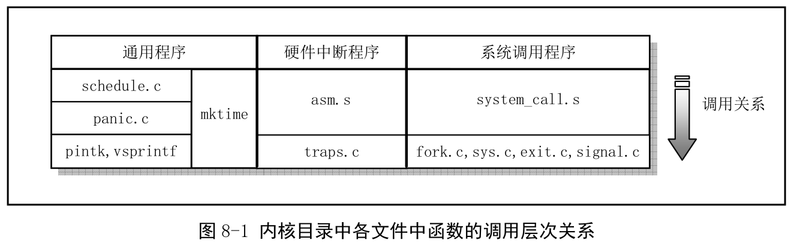
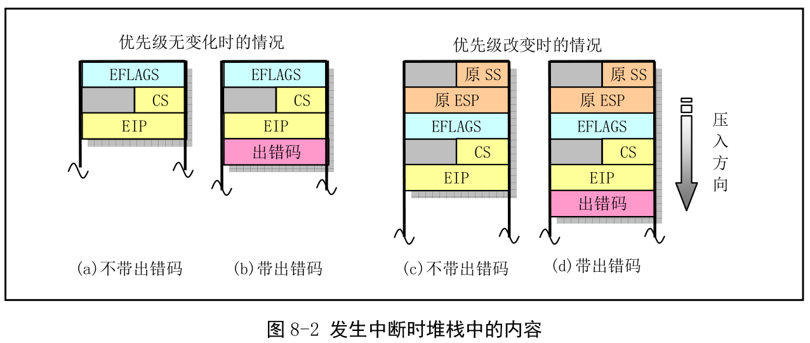
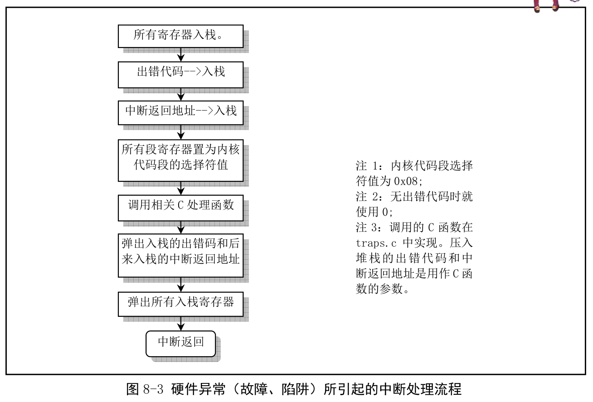

linux/kernel 目录.

该目录下代码从功能上可分为三类, 一类是硬件(异常)中断处理程序文件, 一类是系统调用服务处理程序文件, 还有进程调度等通用功能.

## 1. 中断处理程序

主要两个文件: asm.s 和 traps.c. asm.s 实现大部分硬件异常所引起的中断的汇编语言处理程序. traps.c 则实现了 asm.s 的中断处理过程中调用的 C 函数. 另外几个硬件中断处理过程在文件 sys\_call.s 和 mm/page.s 中实现. 关于 PC 中 825A 可编程中断控制芯片见其他章节.

在用户程序(进程)将控制权交给中断处理程序前, CPU 会首先将至少 12 字节(EFLAGS、CS 和 EIP)信息压入中断处理程序的堆栈中, 即**进程的内核态栈中(这不是任务切换, 只是控制权转移, 详细见 Assembly 相应内容！！！)**. 见图 8-2a 所示, 这与一个远调用(段间子程序调用)类似. CPU 会将代码段选择符 CS 和返回地址的偏移值压入堆栈. 另一个与段间调用相似地方是将信息压入到目的代码(中断处理程序代码)的堆栈上, 而不是被中断代码的堆栈中.

若优先级变化, 例如从用户级改变到内核系统级, CPU 还会将原代码的堆栈段值和堆栈指针压入中断程序的堆栈中. 但内核初始化完成后, 内核代码执行使用的是进程的内核态栈, 而被中断代码的堆栈当然也就是指进程的用户态堆栈了. 所以发生中断时, 中断处理过程使用的是进程的内核态堆栈. 另外, CPU 还总将 EFLAGS 内容压入隧站.

asm.s 主要涉及对 Intel 保留中断 int0\~int16 的处理, 其余保留的中断 int17\~int31 由 Intel 保留. Linux 系统调用中断 int128(0x80)处理将在 kernel/sys\_call.s 给出.

有些异常的中断, CPU 内部产生一个出错码压入堆栈(异常中断 int8 和 int10\~int14), 如图 8-2b, 而其他中断并不带有这个出错码, 因此, asm.s 中会根据是否携带出错码将中断分为两类处理. 但处理流程还是一样.

一个硬件异常引起的中断处理过程如图 8-3.

## 2. 系统调用处理相关程序

Linux 中应用调用内核的功能是通过中断调用 int 0x80 进行的, 寄存器 eax 放调用号, 若带参数, ebx、ecx 和 edx 用于存放调用参数. 因此该中断调用被称为系统调用. 实现系统调用相关文件包括 sys\_call.s、fork.c、signal.c、sys.c 和 exit.c 文件.

sys\_call.s 类似于硬件中断处理中 asm.s 的作用, 另外还对时钟中断和硬盘、软盘中断进行处理. fork.c 提供了两个 C 处理函数: find\_empty\_process()和 copy\_process(). signal.c 还提供了一个处理有关进程信号的函数 do\_gignal(), 在系统调用中断过程中被调用. 另外还有 4 个系统调用 sys\_xxx()函数.

sys.c 和 exit.c 程序实现了一些 sys\_xxx()系统调用函数. 这都是相应系统调用所需的处理函数.

## 3. 其他通用类程序

schedule.c、mktime.c、panic.c、printk.c 和 vsprintf.c.

schedule.c 包含内核的核心调度程序, 用于对进程的执行进行切换或改变执行状态. 另外还有系统时钟中断和软盘驱动器定时函数.

mktime.c 仅有一个内核使用的时间函数 mktime(), 仅在 init/main.c 中被调用一次.

panic.c 包含一个 panic()函数, 用于在内核运行出错时显示出错信息并停机.

printk.c 和 vsprintf.c 是内核显示信息的支持程序, 实现内核专用显示函数 printk()和字符串格式化输出函数 vsprintf().