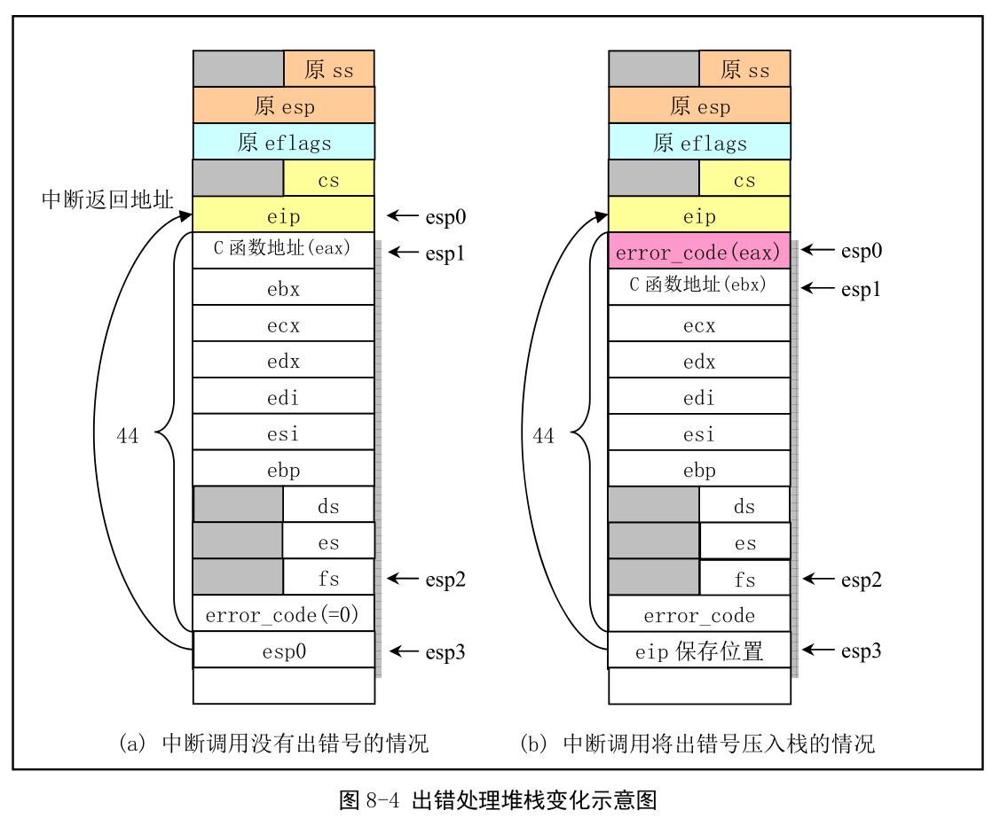

## 1. 功能描述

包括大部分 CPU 探测到的异常故障处理的底层代码, 也包括数学协处理器(FPU)的异常处理. 该程序主要处理方式是在中断处理程序中调用 traps.c 中相应 C 程序, 显示出错位置和出错号, 然后退出中断.

阅读代码结合图 8-4 看当前任务的内核堆栈变化. 图中每行代表 4 个字节. 对不带出错号的, 堆栈指针位置变化参照 8-4a. 开始执行中断程序前, 堆栈指针 esp 指向中断返回地址(图中 esp0). 当把将要调用的 C 函数 do\_divide\_error()或其他 C 函数地址入栈后, 指针位置是 esp1, 此时程序使用交换指令把该函数地址放到 eax 寄存器, , 原来的 eax 则被保存在堆栈上. 此后, 程序将一些寄存器入栈, 堆栈指针处于 esp2. 正式调用 do\_divide\_error()之前, 将原 eip(即堆栈指针 esp0 值)压入堆栈, 放到 esp3 位置, 并在中断返回操作弹出栈上寄存器内容之前, 通过指针加 8 指向 esp2.

对于 CPU 产生错误号的中断过程, 堆栈指针位置变化如图 8-4b.

