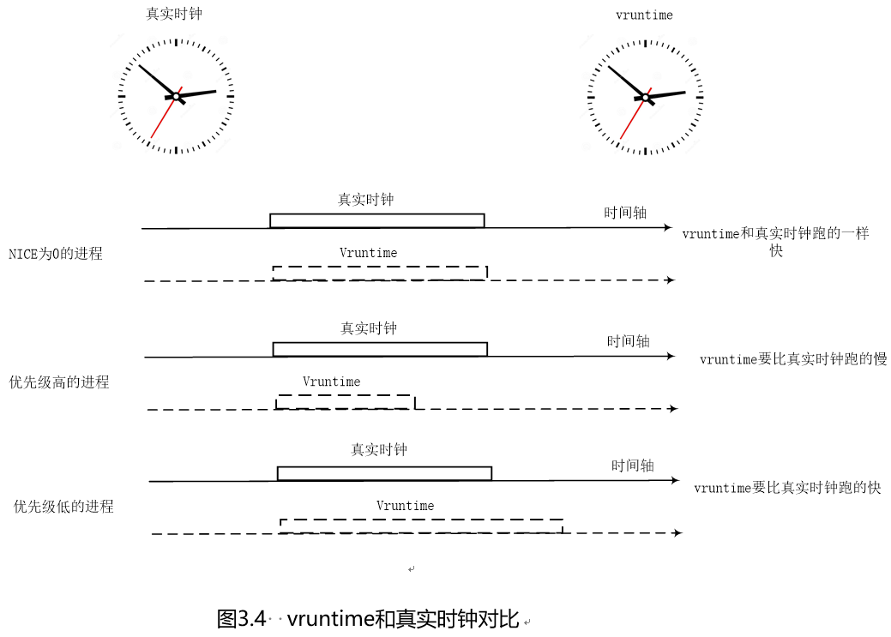
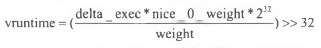
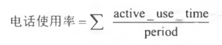
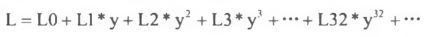
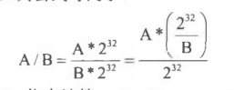
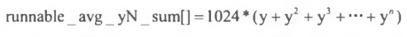
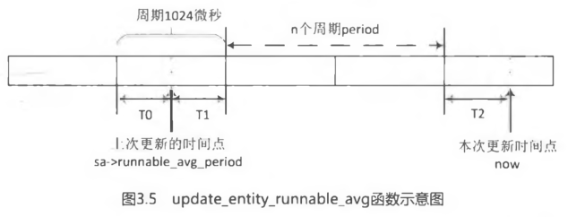
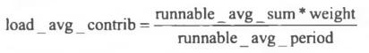
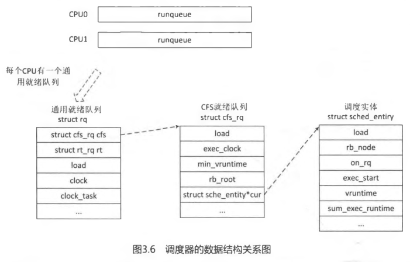

[TOC]

- 1 权重计算

    - 1.1 nice,优先级,权重,vruntime

    - 1.2 CPU 的负载

        - 1.2.1 调度实体类的负载

- 2 进程创建

- 3 进程调度

- 4 scheduler tick

- 5 组调度

- 6 PELT 算法改进

- 7 小结


本节思考题:

4. 请简述对进程调度器的理解, 早期 Linux 内核调度器(包括 0(N)和 0(1))是如何工作的?
5. 请简述进程优先级、nice 值和权重之间的关系.
6. 请简述 CFS 调度器是如何工作的.
7. CFS 调度器中 vruntime 是如何计算的?
8. vmntime 是何时更新的?
9. CFS 调度器中的 min\_vruntime 有什么作用?
10. CFS 调度器对新创建的进程和刚唤醒的进程有何关照?
11. 如何计算普通进程的平均负载 load\_avg\_contrib?runnable\_avg\_sum 和 runnable\_avg\_period 分别是什么含义?
12. 内核代码中定义了若干个表, 请分别说出它们的含义, 比如 prio\_to\_weight、prio\_to\_wmult、runnable\_avg\_yN\_inv、runnable\_avg\_yN\_sum.
13. 如果一个普通进程在就绪队列里等待了很长时间才被调度, 那么它的平均负载该如何计算?

Linux 内核作为一个通用操作系统, 需要兼顾各种**各样类型的进程**, 包括**实时进程、交互式进程、批处理进程**等. 每种类型进程都有其特别的行为特征, 总结如下.

- **交互式进程**: 与人机交互的进程, 和鼠标、键盘、触摸屏等相关的应用, 例如 vim 编辑器等, 它们一直在睡眠同时等待用户召唤它们. 这类进程的特点是系统**响应时间越快越好**, 否则用户就会抱怨系统卡顿.

- **批处理进程**: 此类进程默默地工作和付出, 可能会占用比较**多的系统资源**, 例如编译代码等.

- **实时进程**: 有些应用对**整体时延有严格要求**, 例如现在很火的 VR 设备, 从头部转动到视频显示需要控制到 19 毫秒以内, 否则会使人出现眩晕感. 对于工业控制系统, 不符合要求的时延可能会导致严重的事故.

本节主要讲述**普通进程的调度**, 包括**交互进程**和**批处理进程**等. 在 CFS 调度器出现之前, 早期 Linux 内核中曾经出现过两个调度器, 分别是**0(N)和 0(1)调度器**.

**0(N)调度器**发布于 1992 年, 该调度器算法比较简洁, 从**就绪队列**中比较所有进程的**优先级**, 然后选择一个最高优先级的进程作为下一个调度进程. **每个进程**有一个**固定时间片**, 当进程**时间片使用完**之后, 调度器会**选择下一个调度进程**, 当所有进程都运行一遍后再重新分配时间片. 这个调度器选择下一个调度进程前需要**遍历整个就绪队列**, 花费 0(N)时间.

Linux2.6.23 内核之前有一款名为 0(1)的调度器, 优化了**选择下一个进程的时间**. 它为**每个 CPU 维护一组进程优先级队列, 每个优先级一个队列**, 这样在选择下一个进程时, 只需要**查询优先级队列相应的位图**即可知道哪个队列中有就绪进程, 所以查询时间为常数 0(1).

0(1)调度器在处理某些交互式进程时依然存在问题, 特别是有一些测试场景下导致交互式进程反应缓慢, 另外对 NUMA 支持也不完善, 因此大量难以维护和阅读的代码被加入该调度器中.

后来产生了 CFS 调度算法.**不同进程**采用**不同的调度策略**,目前 Linux 内核中默认实现了**4 种调度策略**,分别是**deadline**、**realtime**、**CFS**和**idle**, 它们分别使用 struct **sched\_class**来定义**调度类**.

**deadline**、**realtime**、**CFS**这三个调度策略对应的调度类**通过进程优先级来区分**的.

- 普通进程的优先级: 100\~139.
- 实时进程的优先级: 0\~99.
- Deadline 进程优先级: -1.

这**4 种调度类**通过**next 指针**串联在一起, **用户空间**程序可以使用调度策略 API 函数(sched\_setscheduler())来**设定用户进程的调度策略**. 其中, SCHED\_NORMAL 和 SCHED\_BATCH 使用 CFS 调度器, SCHED\_FIFO 和 SCHED\_RR 使用 realtime 调度器, SCHED\_IDLE 指 idle 调度, SCHED\_DEADLINE 指 deadline 调度器.

```cpp
[include/uapi/linux/sched.h]
/*
 * Scheduling policies
 */
#define SCHED_NORMAL		0
#define SCHED_FIFO		1
#define SCHED_RR		2
#define SCHED_BATCH		3
/* SCHED_ISO: reserved but not implemented yet */
#define SCHED_IDLE		5
#define SCHED_DEADLINE		6
```

注: sched\_setscheduler(),sched\_getscheduler()---------用户空间程序系统调用 API 设置和获取内核调度器的调度策略和参数.

# 1 权重计算

## 1.1 nice,优先级,权重,vruntime

内核使用 0〜139 的数值表示进程的优先级, **数值越低优先级越高**. 优先级 0〜99 给**实时进程**使用, 100〜139 给**普通进程**使用. 另外在**用户空间**有一个传统的**变量 nice(用户空间的一个值！！！**)值映射到**普通进程的优先级(只是普通进程,也就是 CFS 调度策略对应的进程！！！**), 即 100〜139.

进程 PCB 描述符 struct task\_struct 数据结构中有 3 个成员描述**进程的优先级**.

```cpp
[include/linux/sched.h]

struct task_struct {
    ...
    int prio;
    int static_prio;
    int normal_prio;
    unsigned int rt_priority;
    ...
};
```

static\_prio 是**静态优先级**, 在**进程启动时分配**. 内核**不存储 nice 值**, 取而代之的是**static\_prio**. 内核中的**宏 NICE\_TO\_PRIO**()实现由**nice 值转换成 static\_prio(差值是 120**). 它之所以被称为静态优先级是因为它**不会随着时间而改变**, 用户可以**通过 nice 或 sched\_setscheduler 等系统调用来修改该值**.

```cpp
[include/linux/sched/prio.h]
#define MAX_NICE	19
#define MIN_NICE	-20
#define NICE_WIDTH	(MAX_NICE - MIN_NICE + 1)

#define MAX_USER_RT_PRIO	100
#define MAX_RT_PRIO		MAX_USER_RT_PRIO

// MAX_PRIO = 140
#define MAX_PRIO		(MAX_RT_PRIO + NICE_WIDTH)
//DEFAULT_PRIO = 120
#define DEFAULT_PRIO		(MAX_RT_PRIO + NICE_WIDTH / 2)
/*
 * Convert user-nice values [ -20 ... 0 ... 19 ]
 * to static priority [ MAX_RT_PRIO..MAX_PRIO-1 ],
 * and back.
 */
#define NICE_TO_PRIO(nice)	((nice) + DEFAULT_PRIO)
#define PRIO_TO_NICE(prio)	((prio) - DEFAULT_PRIO)
```

normal\_prio 是**基于 static\_prio 和调度策略**计算出来的优先级, 在创建进程时会**继承父进程的 normal\_prio**. 对于**普通进程**来说, **normal\_prio 等同于 static\_prio**, 对于**实时进程**, 会根据**rt\_priority**重新计算 normal\_prio, 详见 effective_prio()函数.

prio 保存着进程的**动态优先级**, 是**调度类**考虑的优先级, 有些情况下需要暂时提高进程优先级, 例如实时互斥量等.

rt\_priority 是**实时进程**的优先级.

内核使用 struct load\_weight 数据结构来记录**调度实体的权重信息**(weight).

```cpp
[include/linux/sched.h]
struct load_weight {
	unsigned long weight;
	u32 inv_weight;
};
```

其中, weight 是**调度实体的权重**, inv\_weight 是 inverse weight 的缩写, 它是权重的一个中间计算结果, 稍后会介绍如何使用. 调度实体的数据结构中己经内嵌了 struct load\_weight 结构体, 用于描述调度实体的权重.

```cpp
[include/linux/sched.h]
struct sched_entity {
	struct load_weight	load;		/* for load-balancing */
	...
}
```

因此代码中经常通过**p\->se.load**来获取**进程 p 的权重信息**.

**nice 值**的范围是**从\-20〜19(nice 值转 priority 是 120,也可见 nice 值对应的是普通进程的,不是实时进程或 deadline 进程或 idle 进程！！！**),进程**默认的 nice 值为 0**. 这些值含义类似级别, 可以理解成有**40 个等级**, nice 值**越高**, 则优先级**越低(优先级数值越大,nice 值和优先级值线性关系**), 反之亦然. 例如一个**CPU 密集型的应用**程序**nice 值从 0 增加到 1**, 那么它**相对于其他 nice 值为 0**的应用程序将**减少 10%的 CPU 时间**. 因此进程**每降低一个 nice 级别**, **优先级**则**提高一个级别**, 相应的进程**多获得 10%的 CPU 时间**; 反之每提升一个 nice 级别,优先级则降低一个级别, 相应的进程少获得 10%的 CPU 时间. 为了**计算方便**, 内核约定**nice 值为 0 的权重值为 1024**,其他**nice 值对应的权重值**可以通过**查表的方式**来获取, 内核**预先计算好了一个表 prio\_to\_weight**[40], **表下标对应 nice 值**[\-20〜19].

```cpp
[kernel/sched/sched.h]
static const int prio_to_weight[40] = {
 /* -20 */     88761,     71755,     56483,     46273,     36291,
 /* -15 */     29154,     23254,     18705,     14949,     11916,
 /* -10 */      9548,      7620,      6100,      4904,      3906,
 /*  -5 */      3121,      2501,      1991,      1586,      1277,
 /*   0 */      1024,       820,       655,       526,       423,
 /*   5 */       335,       272,       215,       172,       137,
 /*  10 */       110,        87,        70,        56,        45,
 /*  15 */        36,        29,        23,        18,        15,
};
```

前文所述的**10%**的影响是**相对及累加**的, 例如一个进程增加了 10%的 CPU 时间, 则另外一个进程减少 10%,那么差距大约是 20%,因此这里使用一个系数 1.25 来计算的. 举个例子, **进程 A 和进程 B**的**nice 值都为 0**,那么**权重值都是 1024**,它们获得**CPU 的时间都是 50%**,计算公式为 1024/(1024+1024)=50%. 假设进程 A 增加一个 nice 值, 即 nice=1, 进程 B 的 nice 值不变, 那么**进程 B**应该获得 55%的 CPU 时间, 进程 A 应该是 45%. 我们利用 prio\_to\_weight[]表来计算, 进程 A=820/(1024+820)=45%,而进程 B=1024/(1024+820)=55%,注意是近似等于.

内核中还提供另外一个表 prio\_to\_wmult[40], 也是预先计算好的.

```cpp
[kernel/sched/sched.h]
static const u32 prio_to_wmult[40] = {
 /* -20 */     48388,     59856,     76040,     92818,    118348,
 /* -15 */    147320,    184698,    229616,    287308,    360437,
 /* -10 */    449829,    563644,    704093,    875809,   1099582,
 /*  -5 */   1376151,   1717300,   2157191,   2708050,   3363326,
 /*   0 */   4194304,   5237765,   6557202,   8165337,  10153587,
 /*   5 */  12820798,  15790321,  19976592,  24970740,  31350126,
 /*  10 */  39045157,  49367440,  61356676,  76695844,  95443717,
 /*  15 */ 119304647, 148102320, 186737708, 238609294, 286331153,
};
```

prio\_to\_wmult[]表的计算公式如下:


其中, inv\_weight 是 inverse weight 的缩写, 指**权重被倒转**了, 作用是为后面计算方便.

内核提供**一个函数**来查询这两个表, 然后把值存放在 p->se.load 数据结构中, 即 struct load\_weight 结构中.

```cpp
[kernel/sched/core.c]
static void set_load_weight(struct task_struct *p)
{
	int prio = p->static_prio - MAX_RT_PRIO;
	struct load_weight *load = &p->se.load;

	/*
	 * SCHED_IDLE tasks get minimal weight:
	 */
	if (p->policy == SCHED_IDLE) {
		load->weight = scale_load(WEIGHT_IDLEPRIO);
		load->inv_weight = WMULT_IDLEPRIO;
		return;
	}

	load->weight = scale_load(prio_to_weight[prio]);
	load->inv_weight = prio_to_wmult[prio];
}
```

prio\_to\_wmult[]表有什么用途呢?

在 CFS 调度器中有一个计算**虚拟时间**的核心函数**calc\_delta\_fair**(),它的计算公式为:


其中, **vruntime**表示**进程虚拟的运行时间**, delta\_exec 表示**实际运行时间**, nice\_0\_weight 表示 nice 为 0 的权重值, weight 表示**该进程的权重值**.

vruntime 该如何理解呢?如图 3.4 所示, 假设系统中只有 3 个进程 A、B 和 C,它们的 NICE 都为 0, 也就是**权重值都是 1024**. 它们分配到的**运行时间相同**, 即都应该分配到 1/3 的运行时间. 如果 A 、B 、C 三个进程的权重值不同呢?



**CFS 调度器**抛弃以前**固定时间片**和**固定调度周期**的算法, 而采用**进程权重值的比重来量化和计算实际运行时间**. 另外引入**虚拟时钟**的概念, 每个进程的**虚拟时间**是**实际运行时间相对 NICE 值为 0 的权重的比例值**. 进程按照各自**不同的速率比**在**物理时钟节拍内前进**.

- **NICE 值小**的进程, **优先级高**且**权重大**,**vruntime**值**越小**,其**虚拟时钟**比真实时钟**跑得慢**, 但是可以获得**比较多的运行时间**;
- 反之, **NICE 值大**的进程, 优先级低, 权重也低, **vruntime**值**越大**,其虚拟时钟比真实时钟跑得快, 反而获得比较少的运行时间.

**CFS 调度器**总是选择**虚拟时钟跑得慢**的进程, 它像一个**多级变速箱**, **NICE 为 0**的进程是**基准齿轮**, 其他各个进程在不同的变速比下相互追赶, 从而达到公正公平(**具体原因计算参照后面！！！**).

假设某个进程 nice 值为 1, 其权重值为 820,delta\_exec=10ms, 导入公式计算 vruntime=(10\*1024)/820, 这里会涉及浮点运算. 为了计算高效, 函数**calc\_delta\_fair**()的计算方式变成**乘法和移位**运行公式如下(**函数真实的计算过程如下！！！**):

>vruntime = (delta\_exec \* nice\_0\_weight \* inv\_weight) >> shift

把 inv\_weight 带入计算公式后, 得到如下计算公式:



这里巧妙地运用**prio\_to\_wmult**[]表**预先做了除法**, 因此**实际的计算**只有**乘法和移位**操作, 2\^32 是为了预先做除法和移位操作. calc\_delta\_fair()函数等价于如下代码片段:

```cpp
[kernel/sched/fair.c]
static inline u64 calc_delta_fair(u64 delta, struct sched_entity *se)
{
	if (unlikely(se->load.weight != NICE_0_LOAD))
		delta = __calc_delta(delta, NICE_0_LOAD, &se->load);

	return delta;
}

static u64 __calc_delta(u64 delta_exec, unsigned long weight, struct load_weight *lw)
{
	u64 fact = scale_load_down(weight);
	int shift = WMULT_SHIFT;

	__update_inv_weight(lw);

	if (unlikely(fact >> 32)) {
		while (fact >> 32) {
			fact >>= 1;
			shift--;
		}
	}

	/* hint to use a 32x32->64 mul */
	fact = (u64)(u32)fact * lw->inv_weight;

	while (fact >> 32) {
		fact >>= 1;
		shift--;
	}

	return mul_u64_u32_shr(delta_exec, fact, shift);
}
```

以上讲述了进程权重、优先级和 vruntime 的计算方法.

## 1.2 CPU 的负载

下面来关注**CPU 的负载计算问题**.

计算一个**CPU 的负载(负载!!!**), 最简单的方法是计算 CPU 上**就绪队列上所有进程的权重**. 仅考虑优先级权重是**有问题的**, 因为没有考虑该**进程的行为**, 有的进程使用的**CPU 是突发性的**, 有的是**恒定的**, 有的是**CPU 密集型**, 也有的是**IO 密集型**. **进程调度(调度时候,不是计算负载！！！**)考虑**优先级权重**的方法可行, 但是如果延伸到**多 CPU 之间的负载均衡**就显得不准确了, 因此从 Linux3.8 内核 05 以后进程的负载计算**不仅考虑权重**, 而且跟踪**每个调度实体的负载情况**, 该方法称为**PELT(Pre-entity Load Tracking**,详见详见 https://lwn.net/Articles/531853/ ).

CPU 负载计算从两方面考虑:

- CPU 的就绪队列上的**所有进程的权重**
- CPU 上**每个调度实体**的负载

### 1.2.1 调度实体类的负载

**调度实体**数据结构**sched\_entity**中有一个**struct sched\_avg**用于描述**进程的负载**.

```cpp
[include/linux/sched.h]
// 负载类
struct sched_avg {
	/*
	 * These sums represent an infinite geometric series and so are bound
	 * above by 1024/(1-y).  Thus we only need a u32 to store them for all
	 * choices of y < 1-2^(-32)*1024.
	 */
	// runnable 状态总时间
	u32 runnable_avg_sum;
	// fork 后的系统中所有时间
	u32 runnable_avg_period;
	// 用于计算时间间隔
	u64 last_runnable_update;
	s64 decay_count;
	// 负载的贡献值
	unsigned long load_avg_contrib;
};

[include/linux/sched.h]
// 调度实体类
struct sched_entity {
...
// 注意在 SMP 情况下才有用
#ifdef CONFIG_SMP
	/* Per-entity load-tracking */
	struct sched_avg	avg;
#endif
};
```

注: SMP 情况下,进程的负载才考虑.

**runnable\_avg\_sum**表示该**调度实体**在**就绪队列**里(**se->on_rq=1,调度实体的 on\_rq 属性值为 1 代表在就绪队列！！！**)**可运行状态(runnable,包括就绪态和运行态时间！！！**)的**总时间**. **调度实体**在**就绪队列**中的时间包括两部分, 一是**正在运行的时间**, 称为 running 时间, 二是在就绪队列中**等待的时间**. **runnable**包括上述**两部分时间**. 在后续 Linux 内核版本演变中, 会计算**进程运行的时间(running time**), 但在 Linux 4.0 内核中暂时还没有严格区分. 进程**进入就绪队列时(调用 enqueue\_emity), on\_rq 会设置为 1**,但是该进程**因为睡眠等原因退出就绪队列时(调用 dequeue\_entity())on\_rq 会被清 0**, 因此 runnable\_avg\_sum 就是统计进程在就绪队列的时间(注意该时间不完全等于进程运行的时间, 因为还包括在就绪队列里**排队的时间**).

runnable\_avg\_period 可以理解为该**调度实体**在**系统中的总时间**, 之所以称为 period 是因为**以 1024 微秒为一个周期 period**, **last\_runnable\_update**用于**计算时间间隔**.当**一个进程 fork**出来之后, 对于该进程来说, 无论它**是否在就绪队列**中, 还是**被踢出就绪队列, runnable\_avg\_period—直在递增(fork 出来后就开始增加！！！**).

考虑到**历史数据**对负载的影响, 采用**衰减系数**来**计算平均负载**.

- runnable\_avg\_sum: 调度实体在就绪队列里可运行状态下总的衰减累加时间.
- runnable\_avg\_period: 调度实体在系统中总的衰减累加时间.

**load\_avg\_contrib**是**进程平均负载的贡献度**, 后续会详细讲述该值如何计算.

对于那些**长时间不活动**而突然**短时间访问 CPU**的进程或者**访问磁盘被阻塞等待**的进程, 它们的 load\_avg\_contrib 要比**CPU 密集型**的进程小很多, 例如做矩阵乘法运算的密集型进程. 对于前者, runnable\_avg\_sum 时间要远远小于 runnable\_avg\_period 可获得的时间, 对于后者, 它们几乎是相等的.

下面用经典的电话亭例子来说明问题. 假设现在有一个**电话亭(好比是 CPU**),有 4 个人要打电话(好比是**进程**), 电话管理员(好比是**内核调度器**)按照最简单的规则轮流给每个打电话的人分配 1 分钟的时间, 时间截止马上把电话亭使用权给下一个人, 还需要继续打电话的人只能到后面排队(好比是**就绪队列**). 那么管理员如何判断**哪个人是电话的重度使用者**呢?可以使用如下式:



电话的使用率计算公式就是每个分配到电话的使用者**使用电话的时间除以分配时间**. 使用电话的时间和分配到时间是不一样的, 例如在分配到的 1 分钟时间里, 一个人查询电话本用了 20 秒, 打电话只用了 40 秒, 那么 active\_use\_time 是 40 秒, period 是 60 秒. 因此电话管理员通过计算一段统计时间里的每个人的电话平均使用率便可知道哪个人是电话重度使用者.

类似的情况有很多, 例如现在很多人都是低头族, 即手机重度使用者, 现在你要比较在过去 24 小时内身边的人谁是最严重的低头族. 那么以 1 小时为一个 period, 统计过去 24 个 period 周期内的手机使用率相加, 再比较大小, 即可知道哪个人是最严重的低头族. **runnable\_avg\_period 好比是 period 的总和**, **runnable\_avg\_sum 好比是一个人在每个 period 里使用手机的时间总和**.

**cfs\_rq**数据结构中的成员**runnable\_load\_avg**用于累加在该**就绪队列**上**所有调度实体**的**load\_avg\_contrib 总和**, 它在 SMP 负载均衡调度器中用于**衡量 CPU 是否繁忙**. 另外内核还记录阻塞睡眠进程负载, 当一个进程睡眠时, 它的负载会记录在**blocked\_load_avg**成员中.

如果一个长时间运行的 CPU 密集型的进程突然不需要 CPU 了, 那么尽管它之前是一个很占用 CPU 的进程, 此刻该进程的负载是比较小的.

我们把**1 毫秒**(准确来说是**1024 微秒**, 为了方便移位操作)的时间跨度算成**一个周期**, 称为**period**, 简称 PI. 一个**调度实体**(可以是一个**进程**, 也可以是一个**调度组**)在一个 PI 周期内对**系统负载的贡献**除了**权重**外, 还有在 PI 周期内**可运行的时间**(runnablejime), 包括运行时间和等待 CPU 时间. 一个理想的计算方式是: 统计**多个实际的 PI 周期**, 并使用一个**衰减系数**来计算**过去的 PI 周期**对负载的贡献. 假设 Li 是一个调度实体在第 i 个周期内的负载贡献, 那么**一个调度实体的负载总和**计算公式如下:



这个公式用于计算**调度实体**的**最近的负载**, **过去的负载也是影响因素**, 它是一个**衰减因子**. 因此调度实体的负载需要**考虑时间的因素**, 不能只考虑当前的负载, 还要考虑其**在过去一段时间的表现**. **衰减**的意义类似于信号处理中的采样, **距离当前时间点越远, 衰减系数越大, 对总体影响越小**. 其中, y 是一个预先选定好的衰减系数, **y\^32 约等于 0.5**,因此统计**过去第 32 个周期**的负载可以被简单地认为**负载减半**.

该计算公式还有简化计算方式, 内核不需要使用数组来存放**过去 PI 个周期的负载贡献**, 只需要用**过去周期贡献总和乘以衰减系数 y**, 并**加上当前时间点的负载 L0**即可. 内核定义了**表 runnable\_avg\_yN\_inv**[]来方便使用**衰减因子**

```cpp
[kernel/sched/fair.c]
/* Precomputed fixed inverse multiplies for multiplication by y^n */
static const u32 runnable_avg_yN_inv[] = {
	0xffffffff, 0xfa83b2da, 0xf5257d14, 0xefe4b99a, 0xeac0c6e6, 0xe5b906e6,
	0xe0ccdeeb, 0xdbfbb796, 0xd744fcc9, 0xd2a81d91, 0xce248c14, 0xc9b9bd85,
	0xc5672a10, 0xc12c4cc9, 0xbd08a39e, 0xb8fbaf46, 0xb504f333, 0xb123f581,
	0xad583ee9, 0xa9a15ab4, 0xa5fed6a9, 0xa2704302, 0x9ef5325f, 0x9b8d39b9,
	0x9837f050, 0x94f4efa8, 0x91c3d373, 0x8ea4398a, 0x8b95c1e3, 0x88980e80,
	0x85aac367, 0x82cd8698,
};
```

为了处理器计算方便, 该表对应的因子乘以 2\^32,计算完成后再右移 32 位. 在处理器中, **乘法运算比浮点运算快得多**, 其公式等同于:



其中, 除以 2\^32 可以用右移 32 位来计算. **runnable\_avg\_yN\_inv**[]相当于提前计算了公式中的(**2\^32)/B**的值. runnable\_avg\_yN\_inv[]表包括**32 个下标**, 对应**过去 0〜32 毫秒的负载贡献的衰减因子**.

举例说明, 假设**当前进程的负载贡献度是 100**,要求计算过去第 32 毫秒的负载. 首先查表得到过去 32 毫秒时间周期的衰减因子: runnable\_avg\_yN\_inv[31]. 计算公式为: **Load = (100 \* runnable\_avg\_yN\_inv[31] >> 32)(过去第 32 毫秒的负载,这是计算方式！！！**), 最后计算结果为 51.

下面是我换算后的衰减因子.runnable\_avg\_yN\_inv[]是为了 CPU 计算方便然后乘以了 2\^32. 由 runnable\_avg\_yN\_inv[]推导回 runnable\_avg\_yN\_org[], 计算公式可以是: ((1000 \* runnable\_avg\_yN\_inv[]>>32)/1000.

```cpp
[kernel/sched/fair.c]
衰减因子: (只保留小数点 3 位数)
static const u32 runnable_avg_yN_org[] = {
    0.999, 0.978, 0.957, 0.937, 0.917, 0.897,
    0.878, 0.859, 0.840, 0.822, 0x805, 0.787,
    ...
    ...
    ...
    0.522, 0.510,
};
```

内核中的**decay\_load**()函数用于计算**第 n 个周期的衰减值**.

```cpp
[kernel/sched/fair.c]
/*
 * Approximate:
 *   val * y^n,    where y^32 ~= 0.5 (~1 scheduling period)
 */
static __always_inline u64 decay_load(u64 val, u64 n)
{
	unsigned int local_n;

	if (!n)
		return val;
	else if (unlikely(n > LOAD_AVG_PERIOD * 63))
		return 0;

	/* after bounds checking we can collapse to 32-bit */
	local_n = n;

	/*
	 * As y^PERIOD = 1/2, we can combine
	 *    y^n = 1/2^(n/PERIOD) * y^(n%PERIOD)
	 * With a look-up table which covers y^n (n<PERIOD)
	 *
	 * To achieve constant time decay_load.
	 */
	if (unlikely(local_n >= LOAD_AVG_PERIOD)) {
		val >>= local_n / LOAD_AVG_PERIOD;
		local_n %= LOAD_AVG_PERIOD;
	}

	val *= runnable_avg_yN_inv[local_n];
	/* We don't use SRR here since we always want to round down. */
	return val >> 32;
}
```

**参数 val 表示 n 个周期后的负载值**, n 表示第 n 个周期, 其计算公式, 即第 n 个周期的衰减值为 val\*y\^n, 计算 y\^n 釆用查表的方式, 因此**计算公式**变为:

>(**val \* runnable\_avg\_yN\_inv[n]) >> 32**

因为定义了**32 毫秒的衰减系数为 1/2**,每增加 32 毫秒都要衰减 1/2,因此如果 period 太大, 衰减后值会变得很小几乎等于 0. 所以函数代码中, 当 period 大于 2016 就直接等于 0. 处理 period 值在 32\~2016 范围的情况, 每增加 32 毫秒就要衰减 1/2,相当于右移一位, 见代码.

**runnable\_avg\_yN\_inv**[]表为了**避免 CPU 做浮点运算**, 把实际的一组浮点类型数值乘以 2\^32,CPU 做**乘法和移位要比浮点运算快得多**.

为了计算更加方便, 内核又维护了一个表 runnable\_avg\_yN\_sum[], 己预先计算好如下公式的值.



其中, n 取 1〜32. 为什么系数是 1024 呢?因为内核的 runnable\_avg\_yN\_sum[]表通常用于**计算时间的衰减**, 准确地说是周期 period, **一个周期是 1024 微秒**. 例如 n= 2 时, sum = 1024\*( runnable\_avg\_yN[1] + runnable\_avg\_yN[2]) = 1024 X (0.978 + 0.957) = 1981.44, 即约等于 runnable\_avg\_yN\_sum[2], 详见 runnable\_avg\_yN\_sum[]表.

```cpp
[kernel/sched/fair.c]
/*
 * Precomputed \Sum y^k { 1<=k<=n }.  These are floor(true_value) to prevent
 * over-estimates when re-combining.
 */
static const u32 runnable_avg_yN_sum[] = {
	    0, 1002, 1982, 2941, 3880, 4798, 5697, 6576, 7437, 8279, 9103,
	 9909,10698,11470,12226,12966,13690,14398,15091,15769,16433,17082,
	17718,18340,18949,19545,20128,20698,21256,21802,22336,22859,23371,
};
```

\_\_compute\_runnable\_contrib()会**使用该表**来计算**连续 n 个 PI 周期**的**负载累计贡献值**.

```cpp
[kernel/sched/fair.c]
static u32 __compute_runnable_contrib(u64 n)
{
	u32 contrib = 0;

	if (likely(n <= LOAD_AVG_PERIOD))
		return runnable_avg_yN_sum[n];
	else if (unlikely(n >= LOAD_AVG_MAX_N))
		return LOAD_AVG_MAX;

	/* Compute \Sum k^n combining precomputed values for k^i, \Sum k^j */
	do {
		contrib /= 2; /* y^LOAD_AVG_PERIOD = 1/2 */
		contrib += runnable_avg_yN_sum[LOAD_AVG_PERIOD];

		n -= LOAD_AVG_PERIOD;
	} while (n > LOAD_AVG_PERIOD);

	contrib = decay_load(contrib, n);
	return contrib + runnable_avg_yN_sum[n];
}
```

\_\_compute\_runnable\_contrib()函数中的参数**n 表示 PI 周期的个数**. 如果 n 小于等于 LOAD\_AVG\_PERIOD(32 个周期), 那么直接查表 runnable\_avg\_yN\_sum[]取值, 如果 n 大于等于 LOAD\_AVG\_MAX\_N(345 个周期), 那么直接得到极限值 LOAD\_AVG\_MAX(47742). 如果 n 的范围为 32〜345,那么每次递进 32 个衰减周期进行计算, 然后把不能凑成 32 个周期的单独计算并累加, 见 do\-while 代码.

下面来看计算负载中的一个重要函数\_\_update\_entity\_runnable\_avg().

```cpp
[kernel/sched/fair.c]
static __always_inline int __update_entity_runnable_avg(u64 now,
							struct sched_avg *sa,
							int runnable)
{
	u64 delta, periods;
	u32 runnable_contrib;
	int delta_w, decayed = 0;

	delta = now - sa->last_runnable_update;
	/*
	 * This should only happen when time goes backwards, which it
	 * unfortunately does during sched clock init when we swap over to TSC.
	 */
	if ((s64)delta < 0) {
		sa->last_runnable_update = now;
		return 0;
	}

	/*
	 * Use 1024ns as the unit of measurement since it's a reasonable
	 * approximation of 1us and fast to compute.
	 */
	delta >>= 10;
	if (!delta)
		return 0;
	sa->last_runnable_update = now;

	/* delta_w is the amount already accumulated against our next period */
	delta_w = sa->runnable_avg_period % 1024;
	if (delta + delta_w >= 1024) {
		/* period roll-over */
		decayed = 1;

		/*
		 * Now that we know we're crossing a period boundary, figure
		 * out how much from delta we need to complete the current
		 * period and accrue it.
		 */
		delta_w = 1024 - delta_w;
		if (runnable)
			sa->runnable_avg_sum += delta_w;
		sa->runnable_avg_period += delta_w;

		delta -= delta_w;

		/* Figure out how many additional periods this update spans */
		periods = delta / 1024;
		delta %= 1024;
        // 重点 1
		sa->runnable_avg_sum = decay_load(sa->runnable_avg_sum,
						  periods + 1);
		// 重点 2
		sa->runnable_avg_period = decay_load(sa->runnable_avg_period,
						     periods + 1);

		/* Efficiently calculate \sum (1..n_period) 1024*y^i */
		// 重点 3
		runnable_contrib = __compute_runnable_contrib(periods);
		if (runnable)
			sa->runnable_avg_sum += runnable_contrib;
		sa->runnable_avg_period += runnable_contrib;
	}

	/* Remainder of delta accrued against u_0` */
	if (runnable)
		sa->runnable_avg_sum += delta;
	sa->runnable_avg_period += delta;

	return decayed;
}
```

\_\_update\_entity\_runnable\_avg()函数**参数 now 表示当前的时间点**, 由**就绪队列 rq->clock\_task**得到, sa 表示该**调度实体**的 struct sched\_avg 数据结构, runnable 表示该进程是否在就绪队列上接受调度(se\->on\_rq).

delta 表示**上一次更新到本次更新的时间差**, 单位是**纳秒**. delta 时间**转换成微秒**, 注意这里为了计算效率右移 10 位, 相当于除以 1024. runnable\_avg\_period 记录上一次更新时的总周期数(一个周期是 1 毫秒, 准确来说是 1024 微秒), 第 28 行代码, delta\_w 是上一次总周期数中不能凑成一个周期(1024 微秒)的剩余的时间, 如图 3.5 所示的 T0 时间. 第 29〜59 行代码, 表示如果上次剩余 delta\_w 加上本次时间差 delta 大于一个周期, 那么就要进行衰减计算. 第 62〜64 行 代 码 , 如果不能凑成一个周期, 不用衰减计算, 直接累加 runnable\_avg\_sum 和 runnable\_avg\_period 的值, 最后返回是否进行了衰减运算.



下面来看衰减计算的情况, 第 38 行代码计算的 delta\_w 是图 3.5 中的 T1, 这部分时间是上次更新中不满一个周期的剩余时间段, 将直接累加到 runnable\_avg\_sum 和 runnable\_avg\_period 中. 第 46 行代码, periods 是指本次更新与上次更新经历周期 period 的个数, 第 47 行代码, delta 如图 3.5 中的 T2 时间段. 第 49〜51 行代码, 分别对调度实体的 mnnable\_avg\_sum 和 runnable\_avg\_period 执行衰减计算, 为什么要单独执行衰减计算呢?因为这时的 sa->runnable\_avg\_sum 和 sa\->runnable\_avg\_period 的值己经是 periods 个周期之前的值. 第 55 行代码, 计算调度实体在 periods 周期内的累加衰减值. 第 56〜58 行代码, 把之前的两个计算值累加. 第 61〜64 行代码, 把 T2 时间段也添力上. \_\_update\_entity\_runnable\_avg()函数的计算公式可以简单归纳如下:


其中, period 是指上一次统计到当前统计经历的周期个数, prev\_avg\_sum 是指上一次统计时 runnable\_avg\_sum 值在 period+1 个周期的衰减值, decay 指 period 个周期的衰减值和. runnable\_avg\_period 计算方法类似. 如果一个进程在就绪队列里等待了很长时间才被调度, 那么该如何计算它的负载呢?假设该进程等待了 1000 个 period, 即 1024 毫秒, 之前 sa\->runnable\_avg\_sum 和 sa\->runnable\_avg\_period 值为 48000, 唤醒之后在\_\_update\_entity\_runnable\_avg()函数中的第 49〜51 行代码, 因为 period 值很大, decay\_load()函数计算结果为 0, 相当于 sa\->runnable\_avg\_sum 和 sa\->runnable\_avg\_period 值被清 0 了. 第 55 行代码, \_\_compute\_runnable\_contrib()函数计算整个时间的负载贡献值, 因 为 period 大于 LOAD\_AVG\_MAX\_N, 直接返回 LOAD\_AVG\_M A X . 当 period 比较大时, 衰减后的可能变成 0, 相当于之前的统计值被清 0 了.

```cpp
[kernel/sched/fair.c]
/* Update a sched_entity's runnable average */
static inline void update_entity_load_avg(struct sched_entity *se,
					  int update_cfs_rq)
{
	struct cfs_rq *cfs_rq = cfs_rq_of(se);
	long contrib_delta;
	u64 now;

	/*
	 * For a group entity we need to use their owned cfs_rq_clock_task() in
	 * case they are the parent of a throttled hierarchy.
	 */
	if (entity_is_task(se))
		now = cfs_rq_clock_task(cfs_rq);
	else
		now = cfs_rq_clock_task(group_cfs_rq(se));

	if (!__update_entity_runnable_avg(now, &se->avg, se->on_rq))
		return;

	contrib_delta = __update_entity_load_avg_contrib(se);

	if (!update_cfs_rq)
		return;

	if (se->on_rq)
		cfs_rq->runnable_load_avg += contrib_delta;
	else
		subtract_blocked_load_contrib(cfs_rq, -contrib_delta);
}
```

update\_entity\_load\_avg()函数计算**进程最终**的**负载贡献度 load\_avg\_contrib**.

首先**通过\_\_update\_entity\_runnable\_avg**()函数计算**runnable\_avg\_sum 这个可运行时间的累加值**. 注意\_\_update\_entity\_runnable\_avg()函数如果**返回 0**,表示上次更新到本次更新的时间间隔不足 1024 微秒, 不做衰减计算, 那么**本次不计算负载贡献度**. 然后通过\_\_update\_entity\_load\_avg\_contrib()函数**计算本次更新的贡献度**, 最后**累加**到**CFS 运行队列**的 cfs\_rq->runnable\_load\_avg 中.

```cpp
[kernel/sched/fair.c]
static inline void __update_task_entity_contrib(struct sched_entity *se)
{
	u32 contrib;

	/* avoid overflowing a 32-bit type w/ SCHED_LOAD_SCALE */
	contrib = se->avg.runnable_avg_sum * scale_load_down(se->load.weight);
	contrib /= (se->avg.runnable_avg_period + 1);
	se->avg.load_avg_contrib = scale_load(contrib);
}
```

load\_avg\_contrib 的计算公式如下:



可见**一个调度实体的平均负载**和以下 3 个因素相关.

- 调度实体的**权重值 weight**.
- 调度实体的**可运行状态**下的总衰减累加时间 runnnable\_avg\_sum.
- 调度实体在调度器中的总衰减累加时间 runnable\_avg\_period.

runnable\_avg\_sum 越接近 runnable\_avg\_period, 则平均负载越大, 表示该调度实体一直在占用 CPU.

# 2 进程创建

进程的创建通过 do\_fork()函数来完成, **do\_fork**()在执行过程中就参与了**进程调度相关的初始化**.

## 2.1 进程调度相关的初始化

**进程调度**有一个非常重要的数据结构 struct sched\_entity, 称为**调度实体**, 该数据结构描述进程作为一个调度实体参与调度所需要的所有信息, 例如**load**表示该调度实体的**权重**, **run\_node**表示该调度实体**在红黑树中的节点**, on\_rq 表示该调度实体是否在就绪队列中接受调度, vruntime 表示虚拟运行时间. exec\_start、sum\_exec\_runtime 和 prev\_sum\_exec\_runtime 是计算虚拟时间需要的信息, **avg 表示该调度实体的负载信息**.

```cpp
[include/linux/sched.h]

struct sched_entity {
    // 权重
	struct load_weight	load;		/* for load-balancing */
	// 该调度实体在红黑树中的节点
	struct rb_node		run_node;
	struct list_head	group_node;
	// 是否在就绪队列中接受调度
	unsigned int		on_rq;

	u64			exec_start;
	u64			sum_exec_runtime;
	// 虚拟运行时间
	u64			vruntime;
	u64			prev_sum_exec_runtime;

	u64			nr_migrations;

#ifdef CONFIG_SCHEDSTATS
	struct sched_statistics statistics;
#endif

#ifdef CONFIG_FAIR_GROUP_SCHED
	int			depth;
	struct sched_entity	*parent;
	/* rq on which this entity is (to be) queued: */
	struct cfs_rq		*cfs_rq;
	/* rq "owned" by this entity/group: */
	struct cfs_rq		*my_q;
#endif

#ifdef CONFIG_SMP
	/* Per-entity load-tracking */
	struct sched_avg	avg;
#endif
};
```

\_\_sched\_fork()函数会把**新创建进程**的**调度实体**se 相关成员**初始化为 0**,因为这些值**不能复用父进程**, 子进程将来要加入调度器中参与调度, 和父进程"分道扬镳".

```cpp
[do_fork()->sched_fork()->_sched_fork()]
[kernel/sched/core.c]
static void __sched_fork(unsigned long clone_flags, struct task_struct *p)
{
	p->on_rq			= 0;

	p->se.on_rq			= 0;
	p->se.exec_start		= 0;
	p->se.sum_exec_runtime		= 0;
	p->se.prev_sum_exec_runtime	= 0;
	p->se.nr_migrations		= 0;
	p->se.vruntime			= 0;
#ifdef CONFIG_SMP
	p->se.avg.decay_count		= 0;
#endif
	INIT_LIST_HEAD(&p->se.group_node);
}
```

继续看 sched\_fork()函数, 设置子进程运行状态为 TASK\_RUNNING, 这里不是真正开始运行, 因为还没添加到调度器里.

```cpp
[do_fork() ->sched_fork()]

[kernel/sched/core.c]
int sched_fork(unsigned long clone_flags, struct task_struct *p)
{
	unsigned long flags;
	int cpu = get_cpu();
    // 重点 1
	__sched_fork(clone_flags, p);
	p->state = TASK_RUNNING;
	p->prio = current->normal_prio;

	if (dl_prio(p->prio)) {
		put_cpu();
		return -EAGAIN;
	} else if (rt_prio(p->prio)) {
		p->sched_class = &rt_sched_class;
	} else {
		p->sched_class = &fair_sched_class;
	}

	if (p->sched_class->task_fork)
		p->sched_class->task_fork(p);
	set_task_cpu(p, cpu);
	put_cpu();
	return 0;
}
```

根据新进程的优先级确定相应的调度类.**每个调度类**都定义了一套操作方法集, 调用**CFS 调度器**的**task\_fork**方法做一些**fork 相关的初始化**.

**CFS 调度器调度类**定义的操作方法集如下:

```cpp
[kernel/sched/fair.c]
/*
 * All the scheduling class methods:
 */
const struct sched_class fair_sched_class = {
	.next			= &idle_sched_class,
	.enqueue_task		= enqueue_task_fair,
	.dequeue_task		= dequeue_task_fair,
	.yield_task		= yield_task_fair,
	.yield_to_task		= yield_to_task_fair,

	.check_preempt_curr	= check_preempt_wakeup,

	.pick_next_task		= pick_next_task_fair,
	.put_prev_task		= put_prev_task_fair,

#ifdef CONFIG_SMP
	.select_task_rq		= select_task_rq_fair,
	.migrate_task_rq	= migrate_task_rq_fair,

	.rq_online		= rq_online_fair,
	.rq_offline		= rq_offline_fair,

	.task_waking		= task_waking_fair,
#endif

	.set_curr_task          = set_curr_task_fair,
	.task_tick		= task_tick_fair,
	.task_fork		= task_fork_fair,

	.prio_changed		= prio_changed_fair,
	.switched_from		= switched_from_fair,
	.switched_to		= switched_to_fair,

	.get_rr_interval	= get_rr_interval_fair,

	.update_curr		= update_curr_fair,

#ifdef CONFIG_FAIR_GROUP_SCHED
	.task_move_group	= task_move_group_fair,
#endif
};
```

task\_fork 方法实现在 kernel/fair.c 文件中.

```cpp
[do_fork()->sched_fork()->task_fork_fair()]
[kernel/sched/fair.c]
static void task_fork_fair(struct task_struct *p)
{
	struct cfs_rq *cfs_rq;
	struct sched_entity *se = &p->se, *curr;
	int this_cpu = smp_processor_id();
	struct rq *rq = this_rq();
	unsigned long flags;

	raw_spin_lock_irqsave(&rq->lock, flags);

	update_rq_clock(rq);

	cfs_rq = task_cfs_rq(current);
	curr = cfs_rq->curr;

	/*
	 * Not only the cpu but also the task_group of the parent might have
	 * been changed after parent->se.parent,cfs_rq were copied to
	 * child->se.parent,cfs_rq. So call __set_task_cpu() to make those
	 * of child point to valid ones.
	 */
	rcu_read_lock();
	// 重点
	__set_task_cpu(p, this_cpu);
	rcu_read_unlock();

    // 重点
	update_curr(cfs_rq);

	if (curr)
		se->vruntime = curr->vruntime;
	place_entity(cfs_rq, se, 1);

	if (sysctl_sched_child_runs_first && curr && entity_before(curr, se)) {
		/*
		 * Upon rescheduling, sched_class::put_prev_task() will place
		 * 'current' within the tree based on its new key value.
		 */
		swap(curr->vruntime, se->vruntime);
		resched_curr(rq);
	}

	se->vruntime -= cfs_rq->min_vruntime;

	raw_spin_unlock_irqrestore(&rq->lock, flags);
}
```

task\_fork\_fair()函数的参数 p 表示新创建的进程. 进程**task\_struct**数据结构中内嵌了**调度实体 struct sched\_entity**结构体, 因此由**task\_struct 可以得到该进程的调度实体**.

smp\_processor\_id()从**当前进程 thread\_info**结构中的**cpu 成员获取当前 CPU id**. 系统中**每个 CPU**有一个**就绪队列(runqueue**), 它是 Per\-CPU 类型, 即**每个 CPU**有一个**struct rq**数据结构. **this\_rq**()可以获取**当前 CPU 的就绪队列数据结构 struct rq**.

```cpp
[kernel/sched/sched.h]
DECLARE_PER_CPU_SHARED_ALIGNED(struct rq, runqueues);

#define cpu_rq(cpu)		(&per_cpu(runqueues, (cpu)))
#define this_rq()		this_cpu_ptr(&runqueues)
#define task_rq(p)		cpu_rq(task_cpu(p))
#define cpu_curr(cpu)		(cpu_rq(cpu)->curr)
#define raw_rq()		raw_cpu_ptr(&runqueues)
```

**struct rq**数据结构是描述**CPU 的通用就绪队列**, rq 数据结构中记录了一个就绪队列所需要的全部信息, 包括一个**CFS 调度器就绪队列数据结构 struct cfs\_rq**、一个**实时进程调度器就绪队列数据结构 struct rt\_rq**和一个**deadline 调度器就绪队列数据结构 struct dl\_rq**, 以及**就绪队列的权重 load**等信息.

struct rq 重要的数据结构定义如下:

```cpp
[kernel/sched/sched.h]
// 就绪队列,每个 CPU 有一个
struct rq {
	unsigned int nr_running;
	// 就绪队列的权重
	struct load_weight load;
	unsigned long nr_load_updates;
	u64 nr_switches;

    // CFS 调度器就绪队列
	struct cfs_rq cfs;
	// 实时进程调度器就绪队列
	struct rt_rq rt;
	// deadline 调度器就绪队列
	struct dl_rq dl;

	struct task_struct *curr, *idle, *stop;
	u64 clock;
	// 每次滴答 tick 到来时候更新,可以用于计算实际运行时间 delta_exec
	u64 clock_task;

	int cpu;
	int online;
    ...
};
```

struct cfs\_rq 是 CFS 调度器就绪队列的数据结构, 定义如下:

```cpp
[include/1inux/sched.h]
struct cfs_rq {
	struct load_weight load;
	unsigned int nr_running, h_nr_running;

	u64 exec_clock;
	u64 min_vruntime;
	struct sched_entity *curr, *next, *last, *skip;

	unsigned long runnable_load_avg, blocked_load_avg;
    ...
};
```

内核中调度器相关数据结构的关系如图 3.6 所示, 看起来很复杂, 其实它们是有关联的.



回到 task\_fork\_fair()函数中, se 表示新进程的调度实体, 由**current 变量(当前进程 task\_struct 数据结构！！！**)通过函数**task\_cfs\_rp**()取得**当前进程对应的 CFS 调度器就绪队列的数据结构(cfs\_rq** ). 调度器代码中经常有类似的转换, 例如取出当前 CPU 的通用就绪队列 struct rq 数据结构, 取出当前进程对应的通用就绪队列, 取出当前进程对应的 CFS 调度器就绪队列等.

task\_cfs\_rq()函数可以取出**当前进程对应的 CFS 就绪队列**:

```cpp
#define task_thread_info(task)  ((struct thread_info *)(task)->stack)

static inline unsigned int task_cpu(const struct task_struct *p)
{
    return task_thread_info(p)->cpu;
}

#define cpu_rq(cpu)  (&per_cpu(runqueues, (cpu)))
#define task_rq(p)  cpu_rq(task_cpu(p))

static inline struct cfs_rq *task_cfs_rq(struct task_struct *p)
{
    return &task_rq(p)->cfs;
}
```

task\_fork\_fair()函数**中\_\_set\_task\_cpu**()把**当前 CPU**绑定到**该进程中(struct task\_struct 中的 stack<struct ehread\_info>的成员 cpu！！！**), p\->wake\_cpu 在后续唤醒该进程时会用到这个成员.

```cpp
[kernel/sched/sched.h]
static inline void __set_task_cpu(struct task_struct *p, unsigned int cpu)
{
	set_task_rq(p, cpu);
#ifdef CONFIG_SMP
	smp_wmb();
	// 当前 CPU 绑定到该进程中
	task_thread_info(p)->cpu = cpu;
	p->wake_cpu = cpu;
#endif
}
```

update\_curr()函数是 CFS 调度器中**比较核心的函数(该函数很重要！！！**).

```cpp
[kernel/sched/fair.c]
static void update_curr(struct cfs_rq *cfs_rq)
{
	struct sched_entity *curr = cfs_rq->curr;
	// 获取当前 CPU 的通用就绪队列保存的 clock_task 值,
	// 该变量在每次时钟滴答(tick)到来时更新.
	u64 now = rq_clock_task(rq_of(cfs_rq));
	u64 delta_exec;

	if (unlikely(!curr))
		return;
    // 上一次调用 update_curr()函数到现在的时间差,即实际运行的时间.
    // 权重大的
    // 权重值大的后期该值会变大
	delta_exec = now - curr->exec_start;
	if (unlikely((s64)delta_exec <= 0))
		return;
    // 开始执行时间设为现在
	curr->exec_start = now;
	curr->sum_exec_runtime += delta_exec;

	// 虚拟运行时间不断增加
	curr->vruntime += calc_delta_fair(delta_exec, curr);
	update_min_vruntime(cfs_rq);
    ...
}
```

update\_curr()函数的参数是**当前进程对应的 CFS 就绪队列**, **curr 指针指向的调度实体是当前进程, 即父进程**. 这个函数主要更新的就是**当前进程(父进程！！！)结构体**相关成员.

rq\_clock\_task()获取当前**就绪队列(每个 CPU 对应的通用就绪队列)保存的 clock\_task**值, 该变量在**每次时钟滴答**(tick)到来时更新.

calc\_delta\_fair()函数计算过程:


**delta\_exec**计算该进程从**上次调用 update\_curr()函数到现在的时间差(实际运行的时间！！！**).

calc\_delta\_fair()使用 delta\_exec 时间差来计算**该进程的虚拟时间 vruntime**.

```cpp
[kernel/sched/fair.c]
static inline u64 calc_delta_fair(u64 delta, struct sched_entity *se)
{
	if (unlikely(se->load.weight != NICE_0_LOAD))
		delta = __calc_delta(delta, NICE_0_LOAD, &se->load);

	return delta;
}
```

调度实体 struct sched\_entity 数据结构中有一个成员 weight,用于记录该进程的权重. calc\_delta\_fair()首先判断该调度实体的权重是否为 NICE\_0\_LOAD,如果是, 则直接使用该 delta 时间. NICE\_0\_LOAD 类似参考权重, \_\_calc\_delta()利用参考权重来计算虚拟时间. 把 nice 值为 0 的进程作为一个参考进程, 系统上所有的进程都以此为参照物, 根据参考进程权重和权重的比值作为速率向前奔跑. nice 值范围是\-20〜19,**nice 值越大, 优先级越低. 优先级越低的进程, 其权重也越低**. 因此按照 vruntime 的计算公式, **进程权重小**, 那么**vruntime 值反而越大**; 反之, 进程优先级高, **权重也大, vruntime 值反而越小**.

**CFS**总是在**红黑树中选择 vruntime 最小的进程进行调度**, 优先级高的进程总会被优先选择, 随着**vruntime 增长(权限级高的后期 vruntime 值会变大), 优先级低的进程也会有机会运行**.

回到 task\_fork\_fair()函数中的 place\_entity()函数.

```cpp
[kernel/sched/fair.c]
static void
place_entity(struct cfs_rq *cfs_rq, struct sched_entity *se, int initial)
{
	u64 vruntime = cfs_rq->min_vruntime;

	/*
	 * The 'current' period is already promised to the current tasks,
	 * however the extra weight of the new task will slow them down a
	 * little, place the new task so that it fits in the slot that
	 * stays open at the end.
	 */
	// 重点 1
	if (initial && sched_feat(START_DEBIT))
	    // vruntime 增加了一个惩罚值
		vruntime += sched_vslice(cfs_rq, se);

	/* sleeps up to a single latency don't count. */
	if (!initial) {
		unsigned long thresh = sysctl_sched_latency;

		/*
		 * Halve their sleep time's effect, to allow
		 * for a gentler effect of sleepers:
		 */
		if (sched_feat(GENTLE_FAIR_SLEEPERS))
			thresh >>= 1;

		vruntime -= thresh;
	}

	/* ensure we never gain time by being placed backwards. */
	se->vruntime = max_vruntime(se->vruntime, vruntime);
}
```

place\_entity()参数 cfs\_rq 指**父进程对应的 cfs 就绪队列**, se 是**新进程的调度实体**, initial 值为 1. **每个 cfs\_rq 就绪队列**中都有一个成员**min\_vruntime**. min\_vruntime 其实是**单步递增**的, 用于**跟踪整个 CFS 就绪队列中红黑树里的最小 vruntime 值**.

重点 1 处, 如果当前进程用于 fork 新进程, 那么这里会对新进程的 vruntime 做一些惩罚, 因为**新创建了一个进程**导致**CFS 运行队列的权重**发生了变化. **惩罚值**通过**sched\_vslice**()函数来计算.

```cpp
[kernel/sched/fair.c]
unsigned int sysctl_sched_latency = 6000000ULL;
static unsigned int sched_nr_latency = 8;
/*
 * Minimal preemption granularity for CPU-bound tasks:
 * (default: 0.75 msec * (1 + ilog(ncpus)), units: nanoseconds)
 */
unsigned int sysctl_sched_min_granularity = 750000ULL;
unsigned int normalized_sysctl_sched_min_granularity = 750000ULL;

static u64 __sched_period(unsigned long nr_running)
{
	u64 period = sysctl_sched_latency;
	unsigned long nr_latency = sched_nr_latency;

	if (unlikely(nr_running > nr_latency)) {
		period = sysctl_sched_min_granularity;
		period *= nr_running;
	}

	return period;
}
```

首先, \_\_sched\_period()函数会计算**CFS 就绪队列中**的**一个调度周期的长度**, 可以理解为**一个调度周期的时间片**, 它根据**当前运行的进程数目(调度周期时间片根据运行的进程数目确定！！！**)来计算. CFS 调度器有一个默认调度时间片, 默认值为 6 毫秒, 详见 sysctl\_sched\_latency 变量. 当运行中的进程数目大于 8 时, 按照进程最小的**调度延时**(sysctl\_sched\_min\_granularity, 0.75 毫秒)乘以**进程数目**来计算调度周期时间片, 反之用系统默认的调度时间片, 即 sysctl\_sched\_latency.

```cpp
[kernel/sched/fair.c]
static u64 sched_slice(struct cfs_rq *cfs_rq, struct sched_entity *se)
{
    // 一个调度周期的时间片
	u64 slice = __sched_period(cfs_rq->nr_running + !se->on_rq);

	for_each_sched_entity(se) {
		struct load_weight *load;
		struct load_weight lw;

		cfs_rq = cfs_rq_of(se);
		load = &cfs_rq->load;

		if (unlikely(!se->on_rq)) {
			lw = cfs_rq->load;

			update_load_add(&lw, se->load.weight);
			load = &lw;
		}
		slice = __calc_delta(slice, se->load.weight, load);
	}
	return slice;
}
```

sched\_slice()根据**当前进程的权重**来计算在 CFS 就绪队列**总权重**中可以**瓜分到的调度时间**.

```cpp
[kernel/sched/fair.c]
static u64 sched_vslice(struct cfs_rq *cfs_rq, struct sched_entity *se)
{
	return calc_delta_fair(sched_slice(cfs_rq, se), se);
}
```

sched\_vslice()根据 sched\_slice()计算得到的**当前进程的调度时间**来计算可以得到**多少虚拟时间**.

回到 place\_entity()函数, **新创建的进程(initial 为 1**)会得到惩罚, **惩罚的时间(vruntime 增加的值**)根据**新进程的权重**由 sched\_vslice()函数计算**虚拟时间**. 最后新进程调度实体的虚拟时间是在调度实体的**实际虚拟时间**和 CFS 运行队列中**min\_vruntime**中取**最大值**, 详细见代码.

```cpp
static void task_fork_fair(struct task_struct *p)
{
    ...
    place_entity(cfs_rq, se, 1);
    ...
    se->vruntime -= cfs_rq->min_vruntime;
    ...
}
```

回到 task\_fork\_fair()函数, 为何通过 place\_entity()函数计算得到的**se\->vruntime(新进程的调度实体对应的 vruntime**)要**减去 min\_vruntime**呢?难道不用担心该**vruntime 变得很小**会**恶意占用调度器**吗?**新进程还没有加入到调度器**中, **加入调度器时**会重新**增加 min\_vruntime**值. 换个角度来思考, 新进程在 place\_entity()函数中得到了一定的惩罚, 惩罚的虚拟时间由 sched\_vslice()计算, 在某种程度上也是为了防止新进程恶意占用 CPU 时间.

再回到 do\_fork()函数中, 新进程创建完成后需要由**wake\_up\_new\_task**()把它**加入到调度器**中.

```cpp
[do_fork()->wake_up_new_task()]
[kernel/sched/core.c]
void wake_up_new_task(struct task_struct *p)
{
	unsigned long flags;
	struct rq *rq;

	raw_spin_lock_irqsave(&p->pi_lock, flags);
#ifdef CONFIG_SMP
	/*
	 * Fork balancing, do it here and not earlier because:
	 *  - cpus_allowed can change in the fork path
	 *  - any previously selected cpu might disappear through hotplug
	 */
	// 重点 1
	set_task_cpu(p, select_task_rq(p, task_cpu(p), SD_BALANCE_FORK, 0));
#endif

	/* Initialize new task's runnable average */
	init_task_runnable_average(p);
	rq = __task_rq_lock(p);
	// 重点 2
	activate_task(rq, p, 0);
	p->on_rq = TASK_ON_RQ_QUEUED;
	trace_sched_wakeup_new(p, true);
	check_preempt_curr(rq, p, WF_FORK);
#ifdef CONFIG_SMP
	if (p->sched_class->task_woken)
		p->sched_class->task_woken(rq, p);
#endif
	task_rq_unlock(rq, p, &flags);
}
```

在前文中**sched\_fork()函数(copy\_process()中调用的**)己经设置了**父进程的 CPU**到**子进程 thread_info->cpu**中, 为何这里要重新设置呢?因为在**fork 新进程的过程**中, **cpus\_allowed**有可能发生变化, 另外一个原因是**之前选择的 CPU 有可能被关闭**了, 因此重新选择 CPU. **select\_task\_rq**()函数会调用**CFS 调度类**的**select\_task\_rq**()方法来选择一个合适的调度域中**最悠闲的 CPU**. select\_task\_rq()方法将在第 3.3 节中再详细介绍.

activate\_task()调用 enqueue\_task()函数.

```cpp
[kernel/sched/core.c]
void activate_task(struct rq *rq, struct task_struct *p, int flags)
{
	if (task_contributes_to_load(p))
		rq->nr_uninterruptible--;

	enqueue_task(rq, p, flags);
}

static void enqueue_task(struct rq *rq, struct task_struct *p, int flags)
{
	update_rq_clock(rq);
	p->sched_class->enqueue_task(rq, p, flags);
}
```

update\_rq\_clock()更新 rq->clock\_task.

```cpp
[kernel/sched/fair.c]
static void
enqueue_task_fair(struct rq *rq, struct task_struct *p, int flags)
{
	struct cfs_rq *cfs_rq;
	struct sched_entity *se = &p->se;

    // 重点 1
	for_each_sched_entity(se) {
		if (se->on_rq)
			break;
		cfs_rq = cfs_rq_of(se);
		// 重点 2
		enqueue_entity(cfs_rq, se, flags);

		/*
		 * end evaluation on encountering a throttled cfs_rq
		 *
		 * note: in the case of encountering a throttled cfs_rq we will
		 * post the final h_nr_running increment below.
		*/
		if (cfs_rq_throttled(cfs_rq))
			break;
		cfs_rq->h_nr_running++;

		flags = ENQUEUE_WAKEUP;
	}

	for_each_sched_entity(se) {
		cfs_rq = cfs_rq_of(se);
		cfs_rq->h_nr_running++;

		if (cfs_rq_throttled(cfs_rq))
			break;

		update_cfs_shares(cfs_rq);
		// 重点 3
		update_entity_load_avg(se, 1);
	}

	if (!se) {
		update_rq_runnable_avg(rq, rq->nr_running);
		add_nr_running(rq, 1);
	}
	hrtick_update(rq);
}
```

eriqueue\_task\_fair()把新进程添加到 CFS 就绪队列中.

重点 1 处,for 循环对于**没有定义 FAIR\_GROUP\_SCHED**的系统来说, 其实是**调度实体 se**.

重点 2,enqueue\_entity()把**调度实体 se**添加到**cfs\_rq 就绪队列**中.

重点 3 处,update\_rq\_runnable\_avg()更新该**调度实体的负载 load\_avg\_contrib**和**就绪队列的负载 runnable\_load\_avg**.

下面来看 enqueue\_entity() 函数.

```cpp
[kernel/sched/fair.c]
static void
enqueue_entity(struct cfs_rq *cfs_rq, struct sched_entity *se, int flags)
{
	/*
	 * Update the normalized vruntime before updating min_vruntime
	 * through calling update_curr().
	 */
	// 重点 1
	if (!(flags & ENQUEUE_WAKEUP) || (flags & ENQUEUE_WAKING))
		se->vruntime += cfs_rq->min_vruntime;

	/*
	 * Update run-time statistics of the 'current'.
	 */
	// 重点 2
	update_curr(cfs_rq);
	// 重点 3
	enqueue_entity_load_avg(cfs_rq, se, flags & ENQUEUE_WAKEUP);
	account_entity_enqueue(cfs_rq, se);
	update_cfs_shares(cfs_rq);

    // 重点 4
	if (flags & ENQUEUE_WAKEUP) {
		place_entity(cfs_rq, se, 0);
		enqueue_sleeper(cfs_rq, se);
	}

	update_stats_enqueue(cfs_rq, se);
	check_spread(cfs_rq, se);
	if (se != cfs_rq->curr)
	    // 重点 5
		__enqueue_entity(cfs_rq, se);
	// 重点 6
	se->on_rq = 1;

	if (cfs_rq->nr_running == 1) {
		list_add_leaf_cfs_rq(cfs_rq);
		check_enqueue_throttle(cfs_rq);
	}
}
```

重点 1 处,**新进程**是刚创建的, 因此该进程的**vruntime 要加上 min\_vruntime**. 回想之前在**task\_fork\_fair**()函数里**vruntime 减去 min\_vruntime**, 这里又添加回来, 因为 task\_fork\_fair()只是创建进程还没有把该进程添加到调度器, 这期间 min\_vnmtime 已经发生变化, 因此添加上 min\_vruntime 是比较准确的.

重点 2 处,update\_curr()更新**当前进程的 vruntime(父进程！！！**)和该 CFS 就绪队列的 min\_vruntime.

重点 3 处,计算该调度实体 se(新进程)的平均负载 load\_avg\_contrib, 然后添加到整个 CFS 就绪队列的总平均负载 cfs\_rq->runnable\_load\_avg 中.

重点 4 处,处理**刚被唤醒的进程**, place\_entity()对**唤醒进程**有一定的补偿, 最多可以补偿一个调度周期的一半(默认值 sysctl\_sched\_latency/2, 3 毫秒), 即**vruntime 减去半个调度周期时间**.

重点 5 处,\_\_enqueue\_emity()把该**调度实体添加到 CFS 就绪队列的红黑树**中.

重点 6 处,设置该调度实体的 on\_rq 成员为 1, 表示**已经在 CFS 就绪队列中**. se->on\_rq 经常会被用到, 例如 update\_entity\_load\_avg()函数.

```cpp
[kernel/sched/fair.c]
static void __enqueue_entity(struct cfs_rq *cfs_rq, struct sched_entity *se)
{
	struct rb_node **link = &cfs_rq->tasks_timeline.rb_node;
	struct rb_node *parent = NULL;
	struct sched_entity *entry;
	int leftmost = 1;

	/*
	 * Find the right place in the rbtree:
	 */
	while (*link) {
		parent = *link;
		entry = rb_entry(parent, struct sched_entity, run_node);
		/*
		 * We dont care about collisions. Nodes with
		 * the same key stay together.
		 */
		if (entity_before(se, entry)) {
			link = &parent->rb_left;
		} else {
			link = &parent->rb_right;
			leftmost = 0;
		}
	}

	/*
	 * Maintain a cache of leftmost tree entries (it is frequently
	 * used):
	 */
	if (leftmost)
		cfs_rq->rb_leftmost = &se->run_node;

	rb_link_node(&se->run_node, parent, link);
	rb_insert_color(&se->run_node, &cfs_rq->tasks_timeline);
}
```

# 3 进程调度

\_\_schedule()是调度器的核心函数, 其作用是让调度器选择和切换到一个合适进程运行. **调度的时机**可以分为如下 3 种.

- 阻塞操作: 互斥量(mutex)、信号量(semaphore)、等待队列(waitqueue) 等
- 在**中断返回前**和**系统调用返回用户空间**时, 去检查**TIF\_NEED\_RESCHED**标志位以判断是否需要调度.
- 将要被**唤醒的进程(Wakeups**)不会马上调用 schedule()要求被调度, 而是会**被添加到 CFS 就绪队列**中, 并且设置**TIF\_NEED\_RESCHED**标志位. 那么**唤醒进程什么时候被调度**呢?这要根据内核**是否具有可抢占功能(CONFIG\_PREEMPT=y**)分两种情况.

如果**内核可抢占**, 则:

- 如果唤醒动作发生在**系统调用**或者**异常处理**上下文中, 在下一次调用**preempt\_enable**()时会检查是否需要抢占调度;
- 如果唤醒动作发生在**硬中断处理**上下文中, 硬件中断处理**返回前夕**会检查是否要抢占当前进程.

如果内核**不可抢占**, 则:

- 当前进程调用 cond\_resched()时会检查是否要调度;
- 主动调度调用 schedule();
- **系统调用**或者**异常处理返回用户空间**时;
- **中断处理**完成**返回用户空间**时.

前文提到的**硬件中断返回前夕**和**硬件中断返回用户空间前夕**是两个不同的概念. **前者**是每次硬件中断返回前夕都会检查是否有进程需要被抢占调度, 不管**中断发生点是在内核空间, 还是用户空间**; 后者是只有**中断发生点在用户空间**才会检查.

```cpp
[kernel/sched/core.c]
static void __sched __schedule(void)
{
	struct task_struct *prev, *next;
	unsigned long *switch_count;
	struct rq *rq;
	int cpu;

	preempt_disable();
	cpu = smp_processor_id();
	rq = cpu_rq(cpu);
	rcu_note_context_switch();
	prev = rq->curr;

	schedule_debug(prev);

	if (sched_feat(HRTICK))
		hrtick_clear(rq);

	/*
	 * Make sure that signal_pending_state()->signal_pending() below
	 * can't be reordered with __set_current_state(TASK_INTERRUPTIBLE)
	 * done by the caller to avoid the race with signal_wake_up().
	 */
	smp_mb__before_spinlock();
	raw_spin_lock_irq(&rq->lock);

	rq->clock_skip_update <<= 1; /* promote REQ to ACT */

	switch_count = &prev->nivcsw;
	// 重点 1
	if (prev->state && !(preempt_count() & PREEMPT_ACTIVE)) {
		if (unlikely(signal_pending_state(prev->state, prev))) {
			prev->state = TASK_RUNNING;
		} else {
			deactivate_task(rq, prev, DEQUEUE_SLEEP);
			prev->on_rq = 0;

			/*
			 * If a worker went to sleep, notify and ask workqueue
			 * whether it wants to wake up a task to maintain
			 * concurrency.
			 */
			if (prev->flags & PF_WQ_WORKER) {
				struct task_struct *to_wakeup;

				to_wakeup = wq_worker_sleeping(prev, cpu);
				if (to_wakeup)
					try_to_wake_up_local(to_wakeup);
			}
		}
		switch_count = &prev->nvcsw;
	}

	if (task_on_rq_queued(prev))
		update_rq_clock(rq);

	next = pick_next_task(rq, prev);
	clear_tsk_need_resched(prev);
	clear_preempt_need_resched();
	rq->clock_skip_update = 0;

	if (likely(prev != next)) {
		rq->nr_switches++;
		rq->curr = next;
		++*switch_count;

		rq = context_switch(rq, prev, next); /* unlocks the rq */
		cpu = cpu_of(rq);
	} else
		raw_spin_unlock_irq(&rq->lock);

	post_schedule(rq);

	sched_preempt_enable_no_resched();
}
```

\_\_schedule()函数调用**pick\_next\_task**()让进程调度器从**就绪队列**中选择一个**最合适的进程 next**,然后**context\_switch**()切换到 next 进程运行.

prev 指当前进程. **thread\_info**数据结构中的**preempt\_count**成员用于判断当前**进程是否可以被抢占**, preempt\_count 的**低 8 位**用于存放**抢占引用计数(preemption count**),除此之外, 还有一个比特位用于**PREEMPT\_ACTIVE**,它只有在**内核抢占调度中会被置位**, 详见**preempt\_schedule**()函数.

```cpp
[preempt_schedule() -> preempt_schedule_common()]
[kernel/sched/core.c]
static void __sched notrace preempt_schedule_common(void)
{
	do {
	    // preempt_count 中比特位 PREEMPT_ACTIVE 置位
		__preempt_count_add(PREEMPT_ACTIVE);
		// 调度
		__schedule();
		// preempt_count 中比特位 PREEMPT_ACTIVE 清除
		__preempt_count_sub(PREEMPT_ACTIVE);

		/*
		 * Check again in case we missed a preemption opportunity
		 * between schedule and now.
		 */
		barrier();
	} while (need_resched());
}
```

重点 1 处判断语句基于以下两种情况来考虑.

- 把**不处于正在运行状态**下的**当前进程清除出就绪队列**. **TASK\_RUNNING 的状态值为 0**, 其他状态值都非 0.
- 中断返回前夕的抢占调度的情况.

如果**当前进程在之前发生过抢占调度 preempt\_schedule**(), 那么在 preempt\_schedule()->\_\_schedule()时它不应该被清除出运行队列. 为什么这里做这样的判断呢?下面以**睡眠等待**函数 wait\_event()为例, 当前进程调用 wait_event 函数, 当条件(condition)不满足时, 就会把当前进程加入到**睡眠等待队列 wq**中, 然后**schedule()调度其他进程**直到满足 condition.

wait\_event()函数等价于如下代码片段:

```cpp
0 #define __wait_event (wq, condition) \
1 do {  \
2     DEFINE_WAIT(_wait);
3 for (;;) {  \
4           wait->private = current; \
5           list_add(&_wait->task_list, &wq->task_list); \
6           set_current_state(TASK_UNINTERRUPTIBLE); \
7           if (condition)  \  < = 发生中断
8           break;  \
9           schedule();  \
10 }  \
llset_current_state(TASK_RUNNING); \
121ist_del_init (&_wait->task_list); \
13} while (0)
```

这里需要考虑以下两种情况.

- 进程 p 在 for 循环中等待 condition 条件发生, 另外一个进程 A 设置 condition 条件来唤醒进程 p, 假设系统中只触发一次 condition 条件. 第 6 行代码设置当前进程 p 的状态为 TASKJJNINTERRUPTIBLE 之后发生了一个中断, 并且中断处理返回前夕判断当前进程 p 是可被抢占的. 如果当前进程 p 的 thread\_info 的 preempt\_count 中没有置位 PREEMPT\_ACTIVE,那么根据_schedule()函数中第 23〜31 行代码的判断逻辑, 当前进程会被清除出运行队列. 如果此后再也没有进程来唤醒进程 P, 那么进程 p 再也没有机会被唤醒了.