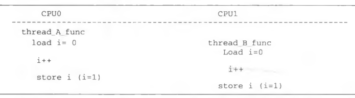
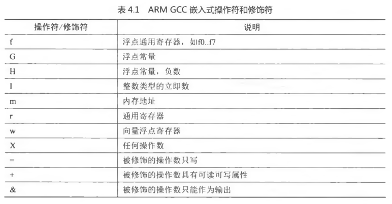
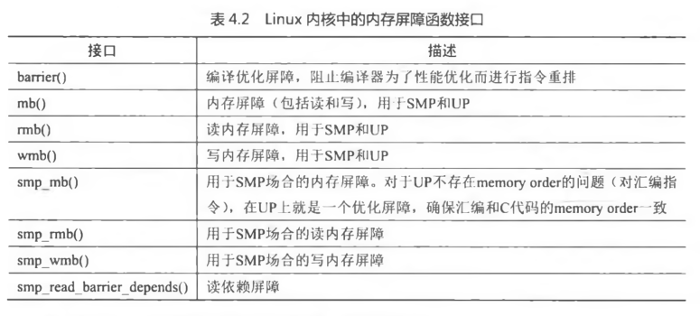
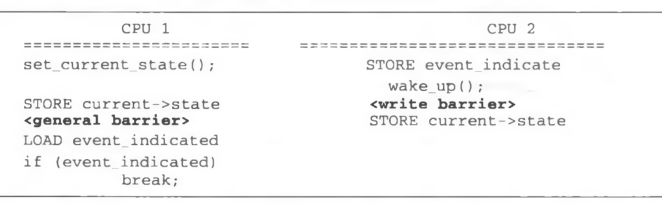

<!-- @import "[TOC]" {cmd="toc" depthFrom=1 depthTo=6 orderedList=false} -->

<!-- code_chunk_output -->

- [1 原子操作](#1-原子操作)
- [2 内存屏障](#2-内存屏障)
- [3 总结](#3-总结)

<!-- /code_chunk_output -->


思考题:

1. 在 ARM 处理器中, 如何实现独占访问内存?
2. atomic\_cmpxchg()和 atomic\_xchg()分别表示什么含义?

# 1 原子操作

原子操作是指保证**指令以原子的方式执行**, 执行过程不会被打断.

如下, 假设线程 A 和线程 B 都尝试进行操作, 请问线程 A 和 B 函数执行完后, i 的值是多少?

```c++
static int i =0;
//线程 A 函数
void thread_A_func()
{
    i++;
}

// 线程 B 函数

void thread_A_func()
{
    i++;
}
```

可能是 2, 也可能不是.



上面执行看, 最终可能等于 1. 变量 i 是一个临界资源, CPU0 和 CPU1 都可能同时访问, 发生并发访问. 从 CPU 角度看, 变量 i 是静态全局变量存储在数据段中, 首先**读取变量值到通用寄存器(！！！不是说将变量先缓存到本地变量, 操作完再协会内存, 而是直接操作！！！然后因为 CPU 是先存到内部寄存器再操作！！！**)中, 然后在通用寄存器里做 i\+\+运算, 最后将寄存器数值写回变量 i 所在内存中. 多处理器架构中, 上述动作可能同时. 若**线程 B 函数**在某个**中断处理**函数中, **单处理器架构**上仍然可能会发生并发访问.

上述例子, 使用加锁方式, 比如 spinlock 保证 i\+\+操作的原子性, 但加锁开销较大, 这里浪费. Linux 提供了**atomic\_t 类型的原子变量**, 该实现依赖不同的体系结构. atomic\_t 类型的具体定义为:

```c
[include/linux/types.h]
typedef struct {
	int counter;
} atomic_t;
```

Linux 提供了很多**原子变量操作函数**.

```c
[include/asm-generic/atomic.h]

#define ATOMIC_INIT(i) 声明一个原子变量并初始化为 i
#define atomic_read(v) 读取原子变量的值
#define atomic_set(v,i ) 设置变量 v 的值为 i
#define atomic_inc(v)  原子地给 v 加 1
#define atomic_dec(v)  原子地给 v 减 1
#define atomic_add(i,v) 原子地给 v 增加 i
#define atomic_inc_and_test (v) 原子地给 v 加 1 ,  结果为 0 返回 true, 否则返回 false
#define atomic_dec_and_test(v) 原子地给 v 减 1, 结果为 0 返回 true, 否则返回 false
#define atomic_inc_return(v) 原子地给 v 加 1 并且返回最新 v 的值
#define atomic_dec_return(v) 原子地给 v 减 1 并且返回最新 v 的值
#define atomic_add_negative(i,v) 给原子变量 v 增加 i ,  然后判断 v 的最新值是否为负数
#define atoinic_cmpxchg(v, old, new) 比较 old 和原子变量 v 的值, 如果相等则把 new 赋值给 V,  返回原子变量 v 的旧值
#define atomic_xchg(v, new) 把 new 赋值给原子变量 v,  返回原子变量 v 的旧值
```

上面函数在内核中很常见, 特别是对一些引用计数进行操作, 例如 struct page 的\_count 和\_mapcount 引用计数. atomic\_cmpxchg()和 atomic_xchg()在**MCS 锁**的实现中起到非常重要的作用.

x86 中实现 atomic\_add()函数. 带**lock 前缀**的**指令执行前**会**完成之前的读写**操作.

```c
/**
 * atomic_add - add integer to atomic variable
 * @i: integer value to add
 * @v: pointer of type atomic_t
 *
 * Atomically adds @i to @v.
 */
static inline void atomic_add(int i, atomic_t *v)
{
	asm volatile(LOCK_PREFIX "addl %1,%0"
		     : "+m" (v->counter)
		     : "ir" (i));
}
```
```
/* Atomic operations are already serializing on x86 */
#define smp_mb__before_atomic_dec()	barrier()
#define smp_mb__after_atomic_dec()	barrier()
#define smp_mb__before_atomic_inc()	barrier()
#define smp_mb__after_atomic_inc()	barrier()
```

**x86**的**atomic 操作**大多使用**原子指令**或者**带 lock 前缀**的指令. 带 lock 前缀的**指令执行前**会**完成之前的读写操作**, 对于**原子操作**来说不会受之前对同一位置的读写操作, 所以这里只是用**空操作 barrier()代替**. barrier()的作用相当于告诉编译器这里有一个**内存屏障**, **放弃在寄存器中的暂存值**, 重新**从内存中读入**.

下面来看在 ARM32 架构中如何实现 atomic\_add()函数.

```c++
#define ATOMIC_OP(op, c_op, asm_op)					\
static inline void atomic_##op(int i, atomic_t *v)			\
{									\
	unsigned long tmp;						\
	int result;							\
									\
	prefetchw(&v->counter);						\
	__asm__ __volatile__("@ atomic_" #op "\n"			\
"1:	ldrex	%0, [%3]\n"						\
"	" #asm_op "	%0, %0, %4\n"					\
"	strex	%1, %0, [%3]\n"						\
"	teq	%1, #0\n"						\
"	bne	1b"							\
	: "=&r" (result), "=&r" (tmp), "+Qo" (v->counter)		\
	: "r" (&v->counter), "Ir" (i)					\
	: "cc");							\
}

static inline void atomic_add(int i, atomic_t *v)			\
{									\
	unsigned long tmp;						\
	int result;							\
									\
	prefetchw(&v->counter);						\
	__asm__ __volatile__("@ atomic_add "\n"			\
"1:	ldrex	%0, [%3]\n"						\
"	add	%0, %0, %4\n"					\
"	strex	%1, %0, [%3]\n"						\
"	teq	%1, #0\n"						\
"	bne	1b"							\
	: "=&r" (result), "=&r" (tmp), "+Qo" (v->counter)		\
	: "r" (&v->counter), "Ir" (i)					\
	: "cc");							\
}
```

**ARM**使用**ldrex**和**strex 指令**来保证 add 操作的原子性, 指令后缀 ex 表示 exclusive. 这两条指令的格式如下.

```assembly
ldrex Rt, [Rn]      ;把 Rn 寄存器指向内存地址的内容加载到 Rt 寄存器中
strex Rd, Rt, [Rn]  ;把 Rt 寄存器的值保存到 Rn 寄存器指向的内存地址中, Rd 保存更新的结果, 0 表示更新成功, 1 表示失败.
```

**ARM**处理器核心中有**Local monitor**和 Global monitor 来实现 ldrex 和 strex 指令的独占访问. 第 5 行代码, **prefetchw**提前把**原子变量的值**加载到**cache**中, 以便提高性能. 第 6〜14 行代码, **GCC 嵌入式汇编**, GCC 嵌入式汇编的格式如下.

```assembly
__asm__ __volatile__(指令部: 输出部: 输入部: 损坏部)
```

GCC 嵌入汇编在处理**变量和寄存器**的问题上提供了一个模板和一些约束条件. 在**指令部**中**数字加上前缀**%, 例如%0、%1 等 , 表示需要**使用寄存器**的样板操作数. 指令部用到几个不同的操作数就说明有几个变量需要和寄存器结合. 指令部后面的**输出部**, 用于规定**对输出变量的约束条件**. 每个输出约束(constraint)通常以号开头, 接着是一个字母表示对操作数类型的说明, 然后是关于变量结合的约束.

例如%0 操作数对应"=&r" (result) , 指的是函数里的**result 变量**. 其中"&"表示该操作符只能用作输出, "= "表示该操作符只写. ％1 操作数对应"=&r"(tmp), 指的是函数里的 tmp 变量. %2 操作数是"+Qo"(v->counter),指的是原子变量 v->counter, "+ ''表示该操作符具有可读可写属性. "r"表示使用一个通用寄存器.

**输入部**有两个操作数, ％3 操作数对应"r"(&v->counter), 指的是原子变量 v->counter 的地址, ％4 操作数对应"Ir"(i), 指的是函数的参数 i.

**损坏部**一般以"**memory**"结束. "memory"强制**gcc 编译器**假设**RAM 所有内存单元**均**被汇编指令修改**, 这样**cpu**中的**registers**和**cache**中已缓存的内存单元中的**数据将作废(！！！**). cpu 将不得不在需要的时候**重新读取内存中的数据**. 这就**阻止**了 cpu 又将**registers, cache 中的数据**用于去**优化指令**, 而避免去访问内存. 目的是**防止编译乱序(！！！**). "cc"表示 condition register, **状态寄存器标志位**.

第 6 行代码, \_\_volatile\_\_**防止编译器优化**. 其中"@"符号标识是**注释**. 这里首先使用 ldrex 指令把原子变量 v->counter 的值加载到 result 变量中, 然后在 result 变量中增加 i 值, 使用 strex 指令把 result 变量的值存放到原子变量 v->counter 中, 其中变量 tmp 保存着 strex 指令更新后的结果. 最后比较该结果是否为 0 , 为 0 则表示 strex 指令更新成功. 如果不为 0 , 那么跳转到标签"1"处重新再来一次.

ARM GCC 嵌入式操作符和修饰符如表 4.1 所示.



# 2 内存屏障

程序在运行时的**实际内存访问顺序**和**程序代码编写的访问顺序**不一致, 会导致**内存乱序访问**. 内存乱序访问的出现是为了提高**程序运行时的性能**.

**内存乱序访问**主要发生在如下两个阶段.

(1)编译时, **编译器优化**导致内存乱序访问.

(2)运行时, **多 CPU 间**交互引起的内存乱序访问.

编译器了解底层 CPU 的思维逻辑, 因此它会在翻译成汇编时进行优化. 例如内存访问指令的重新排序, 提高指令级并行效率. 然而, 这些优化可能会违背程序员原始的代码逻辑, 导致发生一些错误. **编译时的乱序访问(！！！**)可以通过**barrier()函数**来规避.

```
[include/linux/compiler-gcc.h]
#define barrier() __asm__ __volatile__ ("" ::: "memory")
```

barrier()函数告诉编译器, 不要为了性能优化而将这些代码重排.

第 1 章中己经介绍过 ARM 体系结构中的如下 3 条内存屏障指令.

- **数据存储**屏障**DMB(Data Memory Barrier**).

**数据存储器隔离**. DMB 指令保证: 仅当所有在它前面的**存储器访问操作(存取**)都执行完毕后, 才**提交**(commit)在它后面的**存取访问操作指令**. 当位于此指令前的所有内存访问均完成时, DMB 指令才会完成.

- **数据同步**屏障**DSB(Data Synchronization Barrier**).

**数据同步隔离**. 比 DMB 要严格一些, 仅当所有在它前面的**存储访问操作指令**都执行完毕后, 才会**执行**在它后面的指令, 即**任何指令都要等待 DSB 前面的存储访问完成**. 位于**此指令前**的**所有缓存**, 如**分支预测**和**TLB**(**Translation Look\-aside Buffer**)维护操作全部完成.

- **指令同步**屏障**ISB(Instruction Synchronization Barrier**).

**指令同步隔离**. 它最严格, **冲洗流水线(Flush Pipeline**)和**预取 buffers(pretcLbuffers**)后, 才会从**cache**或者**内存**中**预取 ISB 指令之后的指令(！！！**). **ISB 通常用来保证上下文切换的效果(！！！**), 例如更改 ASID(Address Space Identifier)、TLB 维护操作和 C15 寄存器的修改等.

下面来介绍 Linux 内核中的**内存屏障接口函数**, 如表 4.2 所示.



在 x86 Linux 中内存屏障函数实现如下.

```c
[arch/x86/include/asm/barrier.h]

#ifdef CONFIG_X86_32 // 32 位

#define mb() alternative("lock; addl $0,0(%%esp)", "mfence", X86_FEATURE_XMM2)
#define rmb() alternative("lock; addl $0,0(%%esp)", "lfence", X86_FEATURE_XMM2)
#define wmb() alternative("lock; addl $0,0(%%esp)", "sfence", X86_FEATURE_XMM)

#else               // 64 位
#define mb() 	asm volatile("mfence" ::: "memory")
#define rmb()	asm volatile("lfence" ::: "memory")
#define wmb()	asm volatile("sfence" ::: "memory")
#endif

#ifdef CONFIG_X86_PPRO_FENCE
#define dma_rmb()	rmb()      // DMA 读内存屏障, 读操作
#else
#define dma_rmb()	barrier()  // DMA 读内存屏障, 不让重排
#endif

#define dma_wmb()	barrier()  // DMA 写内存屏障, 不让重排

#ifdef CONFIG_SMP
#define smp_mb()	mb()        // SMP 屏障, 读写操作
#define smp_rmb()	dma_rmb()   // SMP 读内存屏障, DMA 的读内存屏障
#define smp_wmb()	barrier()   // SMP 写屏障, 不让重排
#define set_mb(var, value) do { (void)xchg(&var, value); } while (0)

#else /* !SMP */
#define smp_mb()	barrier()
#define smp_rmb()	barrier()
#define smp_wmb()	barrier()
#define set_mb(var, value) do { var = value; barrier(); } while (0)
#endif /* SMP */
```

sfence: 在**sfence 指令前**的**写操作**当必须在**sfence 指令后**的**写操作前完成**.
lfence: 在**lfence 指令前**的**读操作**当必须在**lfence 指令后**的**读操作前完成**.
mfence: 在**mfence 指令前**的**读写操作**当必须在**mfence 指令后**的**读写操作前完成**.

在**ARM** Linux 中内存屏障函数实现如下.

```c
[arch/arm/include/asm/barrier.h]

#ifdef CONFIG_ARCH_HAS_BARRIERS
#include <mach/barriers.h>
#elif defined(CONFIG_ARM_DMA_MEM_BUFFERABLE) || defined(CONFIG_SMP)

#define mb()		do { dsb(); outer_sync(); } while (0)  //读写内存屏障, 数据同步屏障指令
#define rmb()		dsb()     // 读内存屏障, 数据同步屏障指令
#define wmb()		do { dsb(st); outer_sync(); } while (0)   //写内存屏障, 数据同步屏障指令
#define dma_rmb()	dmb(osh)  // DMA 读内存屏障, 数据存储屏障指令, 也就是读操作的
#define dma_wmb()	dmb(oshst) // DMA 写内存屏障, 数据存储屏障指令

#else

#define mb()		barrier()
#define rmb()		barrier()
#define wmb()		barrier()
#define dma_rmb()	barrier()
#define dma_wmb()	barrier()

#endif

#ifndef CONFIG_SMP

#define smp_mb()	barrier()
#define smp_rmb()	barrier()
#define smp_wmb()	barrier()

#else

#define smp_mb()	dmb(ish)
#define smp_rmb()	smp_mb()
#define smp_wmb()	dmb(ishst)

#endif
```

在 Linux 内核中有很多使用内存屏障指令的例子, 下面举两个例子来介绍.

例 1: 一个**网卡驱动**中**发送数据包**. **网络数据包**写入**buffer**后交给**DMA 引擎负责发送**, **wmb**()保证在**DMA 传输之前(！！！**), 数据被**完全写入到 buffer**中.

```c
[drivers\net\ethernet\realtek\8139too.c]

static netdev_tx_t rtl8139_start_xmit (struct sk_buff *skb,
					     struct net_device *dev)
{
	skb_copy_and_csum_dev(skb, tp->tx_buf[entry]);
	/*
	 * Writing to TxStatus triggers a DMA transfer of the data
	 * copied to tp->tx_buf[entry] above. Use a memory barrier
	 * to make sure that the device sees the updated data.
	 */
	wmb();  // 写内存屏障
	RTL_W32_F (TxStatus0 + (entry * sizeof (u32)),
		   tp->tx_flag | max(len, (unsigned int)ETH_ZLEN));
	...
}
```

例 2: Linux 内核里面的**睡眠和唤醒 API**也运用了**内存屏障指令**, 通常一个**进程**因为**等待某些事件**需要**睡眠**, 例如调用`wait_even()`. **睡眠者代码片段(！！！**)如下:

```cpp
for (;;) {
    set_current_state(TASK_UNINTERRUPTIBLE);
    if (event_indicated)
        break;
    schedule();
}
```

其中, `set_current_state()`在**修改进程的状态**时隐含插入了**内存屏障函数 smp\_mb**().

```cpp
[include/linux/sched.h]
#define set_current_state(state_value)  \
    set_mb(current->state, (state_value))

[arch/arm/include/asm/barrier.h]
#define set_mb(var, value)  do { var = value; smp_mb(); } while (0)
```

唤醒者通常会调用`wake_up()`, 在**修改 task 状态之前**也隐含地插入内存屏障函数 smp\_wmb().

```c
[wake_up() -> autoremove_wake_function() -> try_to_wake_up()]
wake_up(): kernel/sched/wait.c
try_to_wake_up(): kernel/sched/core.c

static int
try_to_wake_up(struct task_struct *p, unsigned int state, int wake_flags)
{
	/*
	 * If we are going to wake up a thread waiting for CONDITION we
	 * need to ensure that CONDITION=1 done by the caller can not be
	 * reordered with p->state check below. This pairs with mb() in
	 * set_current_state() the waiting thread does.
	 */
	smp_rmb();  // 读屏障, DMB 数据存储屏障指令

	return success;
}
```

在**SMP**的情况下来观察**睡眠者**和**唤醒者**之间的关系如下.



- **睡眠者**: **CPU1**在**更改当前进程 current\->state**后, 插入一个**内存屏障指令**, 保证**加载唤醒标记**load event\_indicated**不会出现**在**修改 current\->state 之前(！！！编译优化导致**).
- **唤醒者**: CPU2 在**store 唤醒标记操作**和把**进程状态修改成 RUNNING 的 store 操作**之间插入了**写屏障**, 保证**唤醒标记 event indicated 的修改**能被**其他 CPU 看到(！！！运行时多 CPU 交互引起**).

# 3 总结

原子操作保证**指令以原子的方式执行**(不是代码编写, 而是由于 CPU 的行为导致, 先加载变量到本地寄存器再操作再写内存). **x86**的**atomic 操作**通常通过**原子指令**或**lock 前缀**实现.

内存屏障是程序在运行时的实际内存访问顺序和程序代码编写的访问顺序不一致, 会导致内存乱序访问. 分为**编译时编译器优化**和**运行时多 CPU 间交互**.

- 编译优化使用**barrier**()**防止编译优化**

```c
[include/linux/compiler-gcc.h]
#define barrier() __asm__ __volatile__ ("" ::: "memory")
```

"memory"强制**gcc 编译器**假设 RAM**所有内存单元均被汇编指令修改**, 这样**cpu 中的 registers 和 cache**中已缓存的内存单元中的**数据将作废(！！！**). **cpu**将不得不在需要的时候**重新读取内存中的数据**. 这就阻止了 cpu 又将 registers, cache 中的数据用于去优化指令, 而避免去访问内存. 目的是**防止编译乱序(！！！**).

- x86 提供了三个指令: sfence(该指令前的写操作必须在该指令后的写操作前完成), lfence(读操作), mfence(读写操作)