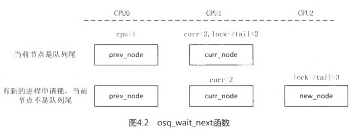
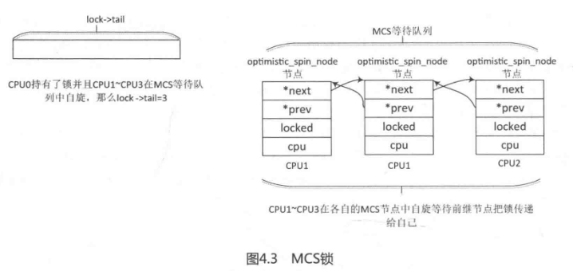

<!-- @import "[TOC]" {cmd="toc" depthFrom=1 depthTo=6 orderedList=false} -->

<!-- code_chunk_output -->

- [0 概述和历史](#0-概述和历史)
- [1 Mutex 互斥体的数据结构](#1-mutex-互斥体的数据结构)
- [2 MCS 锁机制](#2-mcs-锁机制)
  - [2.1 OSQ 锁的数据结构](#21-osq-锁的数据结构)
  - [2.2 MCS 锁初始化](#22-mcs-锁初始化)
  - [2.3 申请 MCS 锁](#23-申请-mcs-锁)
  - [2.4 释放 MCS 锁](#24-释放-mcs-锁)
- [3 Mutex 锁的实现](#3-mutex-锁的实现)
  - [3.1 Mutex 锁初始化](#31-mutex-锁初始化)
  - [3.2 Mutex 锁申请](#32-mutex-锁申请)
    - [3.2.1 慢车道\_\_mutex\_lock\_slowpath()申请](#321-慢车道__mutex_lock_slowpath申请)
  - [3.3 mutex 释放锁](#33-mutex-释放锁)
- [4 小结](#4-小结)
  - [4.1 MCS 锁](#41-mcs-锁)
  - [4.2 Mutex 锁](#42-mutex-锁)

<!-- /code_chunk_output -->


思考如下问题.

- Linux 内核已经实现了信号量机制, 为何要单独设置一个**Mutex 机制**呢?
- 请简述**MCS 锁**机制的实现原理.
- 在编写内核代码时, 该如何选择**信号量**和**Mutex**?

# 0 概述和历史

在**Linux 内核**中, **除信号量以外**, 还有一个类似的实现叫作**互斥体 Mutex**. **信号量**是在**并行处理环境**中对**多个处理器**访问**某个公共资源**进行**保护的机制**, **Mutex**用于**互斥操作**.

信号量根据**初始化 count 的大小**, 可以分为**计数信号量**和**互斥信号量**. 根据操作系统书籍上著名的**洗手间理论**, **信号量**相当于一个可以**同时容纳 N 个人的洗手间**, 只要人不满就可以进去, 如果人满了就要在外面等待.  Mutex 类似街社的**移动洗手间**, 每次只能**一个人进去**, 里面的人出来后才能让排队中的下一个人使用. 那既然**Mutex 类似 count 计数等于 1 的信号量(！！！**), 为什么内核社区要重新开发 Mutex, 而不是复用信号量的机制呢?

Mutex 最早是在 Linux 2.6.16 中由 RedHat 公司的资源内核专家 Ingo Molnar 设计和实现的. 信号量的 count 成员可以初始化为 1, 并且 DOWN 和 UP 操作也可以实现类似 Mutex 的作用, 那为什么要单独实现 Mutex 机制呢?在设计之初, Ingo Molnar 解释信号量在 Linux 内核中的实现没有任何问题, 但是**Mutex 的语义**相对于信号量要**简单轻便一些**, 在锁争用激烈的测试场景下, **Mutex 比信号量执行速度更快**, 可扩展性更好, 另外**Mutex 数据结构的定义比信号量小**, 这些都是在 Mutex 设计之初 Ingo Molnar 提到的优点. Mutex 上的一些优化方案己经移植到了读写信号量中, 例如自旋等待已应用在读写信号量上.

# 1 Mutex 互斥体的数据结构

下面来看**Mutex 数据结构**的定义.

```c
[include/linux/mutex.h]
struct mutex {
	/* 1: unlocked, 0: locked, negative: locked, possible waiters */
	atomic_t		count;
	spinlock_t		wait_lock;
	struct list_head	wait_list;
#if defined(CONFIG_MUTEX_SPIN_ON_OWNER)
	struct task_struct	*owner;
#endif
#ifdef CONFIG_MUTEX_SPIN_ON_OWNER
	struct optimistic_spin_queue osq; /* Spinner MCS lock */
#endif
};
```

- count: **原子计数**, **1**表示**没人持有锁**; **0**表示**锁被持有**; **负数**表示**锁被持有**且**有人在等待队列中等待**.
- wait\_lock: **spinlock 锁**, 用于**保护 wait\_list 睡眠等待队列**.
- wait\_list: 用于管理所有**在该 Mutex 上睡眠的进程**, 没有成功获取锁的进程会睡眠在此链表上.
- owner: 要打开**CONFIG\_MUTEX\_SPIN\_ON\_OWNER(一般都会开启**)选项才会有 owner, 用于指向**锁持有者的 task\_struct 数据结构**.
- osq: 用于实现**MCS 锁机制**, 对应的那个 MCS 锁.

**Mutex**实现了**自旋等待的机制(optimistic spinning**), 准确地说, 应该是**Mutex**比读写**信号量**更早地实现了自旋等待机制.

**自旋等待机制**的核心原理是当发现**持有锁者正在临界区执行**并且**没有其他优先级高的进程**要被调度(need\_resched)时, 那么**当前等待进程**坚信锁持有者会很快离开临界区并释放锁, 因此与其睡眠等待不如乐观地自旋等待, 以**减少睡眠唤醒的开销**.

在实现**自旋等待机制**时, 内核实现了一套**MCS 锁机制**来保证**只有一个人自旋等待(！！！)持锁者释放锁**.

# 2 MCS 锁机制

**MCS 锁**是一种**自旋锁的优化方案**, 它是由两个发明者 Mellor\-Crummey 和 Scott 的名字来命名的. 自旋锁是 Linux 内核使用**最广泛的一种锁机制(！！！**).在 Linux 2.6.25 内核中**自旋锁**已经采用**排队自旋算法**进行优化, 以**解决早期自旋锁争用不公平**的问题. 但是在**多处理器和 NUMA 系统**中, **排队自旋锁**仍然存在一个**比较严重的问题**. 假设在一个锁争用激烈的系统中, **所有自旋等待锁的线程**都在**同一个共享变量**上**自旋**, **申请和释放锁**都在**同一个变量**上修改, 由**cache 一致性原理(例如 MESI 协议**)导致**参与自旋的 CPU**中的**cache line 变得无效**. 在锁争用激烈过程中, 导致严重的**CPU 高速缓存行颠簸现象(CPU cache line bouncing**)现象, 即**多个 CPU 上的 cache line 反复失效**, 大大降低系统整体性能.

**MCS 算法**可以解决自旋锁遇到的问题, 显著**减少 CPU cache line bouncing 问题(！！！**).

MCS 算法的核心思想是**每个锁的申请者**只在**本地 CPU**的**变量上自旋**, 而**不是全局的变量**. 虽然 MCS 算法的设计是**针对自旋锁**的, 但是目前 Linux 4.0 内核中依然**没有把 MCS 算法用在自旋锁**上, 其中一个很重要的原因是**MCS 算法的实现**需要**比较大的数据结构**, 而**spinlock**常常嵌入到系统中一些比较**关键的数据结构**中, 例如物理页面数据结构 struct page, 这类数据结构对**大小相当敏感**, 因此目前**MCS 算法**只用在**读写信号量**和**Mutex 的自旋等待机制(！！！**)中.

Linux 内核版本的**MCS 锁**最早是由社区专家 Waiman Long 在 Linux 3.10 中实现的, 后来经过其他的社区专家的不断优化后成为现在的**osq\_lock**, 可以说**OSQ 锁**是**MCS 锁机制**的**一个具体的实现**, 本节内容混用了这两个概念.

## 2.1 OSQ 锁的数据结构

MCS 锁本质上是一种**基于链表结构的自旋锁(！！！**), OSQ 锁的实现需要**两个数据结构**.

```c
[include/linux/osq_lock.h]
struct optimistic_spin_node {
	struct optimistic_spin_node *next, *prev;
	int locked; /* 1 if lock acquired */
	int cpu; /* encoded CPU # + 1 value */
};

struct optimistic_spin_queue {
	/*
	 * Stores an encoded value of the CPU # of the tail node in the queue.
	 * If the queue is empty, then it's set to OSQ_UNLOCKED_VAL.
	 */
	atomic_t tail;
};
```

**每个 MCS 锁**有一个**optimistic\_spin\_queue(！！！**)数据结构, 该数据结构只有一个成员**tail, 初始化为 0**, 指向**链表尾部的 CPU 编号\<MCS 重新编的**\>.

struct optimistic\_spin\_node 数据结构表示**本地 CPU 上的节点(！！！**), 它可以组织成一个**双向链表(！！！**), 包含**next 和 prev 指针**, lock 成员用于表示**加锁状态**, cpu 成员用于**重新编码 CPU 编号**, 表示该 node 是在**哪个 CPU 上**. 也就是说**MCS 链表是通过 Per\-CPU 的 optimistic\_spin\_node 实现的！！！**

**struct optimistic\_spin\_node**数据结构会定义成**per\-CPU 变量(！！！**), 即**每个 CPU 有一个 node 结构(！！！**).

```c
[kernel/locking/osq_lock.c]
static DEFINE_PER_CPU_SHARED_ALIGNED(struct optimistic_spin_node, osq_node);
```

## 2.2 MCS 锁初始化

MCS 锁在**osq\_lock\_init**()函数中初始化, 例如**Mutex 初始化**时会**初始化一个 MCS 锁(配置了 CONFIG\_MUTEX\_SPIN\_ON\_OWNER**), 详见\_\_mutex\_init()函数中的**osq\_lock\_init**()函数.

```c
[kernel/locking/mutex.c]
void
__mutex_init(struct mutex *lock, const char *name, struct lock_class_key *key)
{
	atomic_set(&lock->count, 1);
	spin_lock_init(&lock->wait_lock);
	INIT_LIST_HEAD(&lock->wait_list);
	mutex_clear_owner(lock);
#ifdef CONFIG_MUTEX_SPIN_ON_OWNER
	osq_lock_init(&lock->osq);
#endif

	debug_mutex_init(lock, name, key);
}
EXPORT_SYMBOL(__mutex_init);

[include/linux/osq_lock.h]
static inline void osq_lock_init(struct optimistic_spin_queue *lock)
{
	atomic_set(&lock->tail, OSQ_UNLOCKED_VAL);
}
```

## 2.3 申请 MCS 锁

**osq\_lock**()函数用于**申请 MCS 锁**, 下面来看该函数是如何实现的.

参数就是**想要申请的 MCS 锁对应的 optimistic\_spin\_queue**, 总结:

(1) 获取**当前进程所在 CPU**的 struct optimistic\_spin\_node 节点(这是 Per\-CPU 的)

(2) 给当前 CPU 编号, 0 表示没有 CPU, 1 表示 CPU0, 类推

(3) 将**lock\-\>tail 设置为当前 CPU 编号**

(4) **原有 tail**等于 OSQ\_UNLOCKED\_VAL(也就是**0**)那么说明**没有 CPU 持锁**, 直接**退出返回 True**

(5) 通过获得原有 tail 的 CPU 节点 optimistic\_spin\_node(这是 Per\-CPU 的)

(6) 将当前 optimistic\_spin\_node 节点加入 MCS 链表(通过 Per\-CPU 的 optimistic\_spin\_node 实现)

(7) while 循环, 查询当前 optimistic\_spin\_node 节点的 locked 是否是 1(因为前继节点释放锁会将其下一节点的 locked 设为 1, 然后释放锁), 如果是 1, 说明前继节点释放了锁, 那么当前进程退出自旋, 直接退出返回 True

(8) while 循环, 判断不为 1, 当前进程自旋等待: 里面判断下是否需要重新调度(更高优先级进程抢占或被调度器要求调度), 是的话放弃自旋等待, 退出 MCS 链表, 删除 MCS 链表节点, 退出返回 False

```c
[kernel/locking/osq_lock.c]
bool osq_lock(struct optimistic_spin_queue *lock)
{
    // 位置 1
	struct optimistic_spin_node *node = this_cpu_ptr(&osq_node);
	struct optimistic_spin_node *prev, *next;
	// 位置 2
	int curr = encode_cpu(smp_processor_id());
	int old;

	node->locked = 0;
	node->next = NULL;
	node->cpu = curr;
    // 位置 3
	old = atomic_xchg(&lock->tail, curr);
	if (old == OSQ_UNLOCKED_VAL)
		return true;
```

位置 1, node 指向**当前 CPU**的 struct optimistic\_spin\_node 节点.

位置 2, struct optimistic\_spin\_node 数据结构中**cpu 成员**用于表示**CPU 编号**, 它的**编号方式和 CPU 编号方式不太一样**, **0 表示没有 CPU** , **1 表示 CPU0**, 以此类推.

位置 3, 使用**原子交换函数 atomic\_xchg**()交换**全局 lock->tail 和当前 CPU 编号**, 如果**lock->tail 的旧值等于初始化值 OSQ\_UNLOCKED\_VAL**(值为 0), 说明还**没有人持有锁**, 那么让**lock\->tail 等于当前 CPU 编号**表示**当前 CPU 成功持有了锁**, 这是最快捷的方式. 如果 lock\->tail 的旧值**不等于**OSQ\_UNLOCICED\_VAL, 获取锁失败. 下面看看**如果没能成功获取锁**的情况, 即**lock\->tail 的值指向其他 CPU 编号**, 说明**有人持有了该锁**.

```c
[osq_lock()]
    prev = decode_cpu(old);
    // 位置 1
	node->prev = prev;
	ACCESS_ONCE(prev->next) = node;

    // 位置 2
	while (!ACCESS_ONCE(node->locked)) {
		/*
		 * If we need to reschedule bail... so we can block.
		 */
		// 位置 3
		if (need_resched())
			goto unqueue;

		cpu_relax_lowlatency();
	}
	return true;
```

之前获取锁失败, 变量 old 的值(**lock->tail 的旧值**)指向某个 CPU 编号, 那么**decode\_cpu**()函数返回的是**变量 old 指向的 CPU 所属的节点**.

位置 1 后两行代码, 把**当前 curr\_node 节点**插入**MCS 链表**中, **当前节点**curr\_node\->prev 指向**前继节点**, 而前继节点 prev\_node\->next 指向当前节点.

位置 2, **while 循环**一直**查询当前节点 curr\_node->locked 是否变成了 1**, 因为**前继节点 prev\_node 释放锁**时会把它的**下一个节点中的 locked 成员设置为 1(！！！**), 然后才能成功**释放锁**. 在理想情况下, **前继节点释放锁**, 那么**当前进程也退出自旋**, 返回 true.

位置 3, 在**自旋等待过程**中, 如果有**更高优先级进程抢占**或者**被调度器要求调度出去**, 那应该**放弃自旋等待**, **退出 MCS 链表(！！！**), 跳转到 unqueue 标签处处理**MCS 链表删除节点**的情况. unqueue 标签处是异常情况处理, 正常情况是要在 while 循环中等待锁.

OSQ 锁的实现比较复杂的原因在于**OSQ 锁**必须要处理**need\_resched**()的异常情况, 否则可以设计得很简洁.

unqueue 标签处实现**删除链表操作**, 这里仅仅使用了原子比较交换指令, 并没有使用其他的锁, 这是无锁并发编程的精髓体现.

```c
[osq_lock()]
unqueue:
	/*
	 * Step - A  -- stabilize @prev
	 *
	 * Undo our @prev->next assignment; this will make @prev's
	 * unlock()/unqueue() wait for a next pointer since @lock points to us
	 * (or later).
	 */

	for (;;) {
	    // 位置 1
		if (prev->next == node &&
		    cmpxchg(&prev->next, node, NULL) == node)
			break;

		/*
		 * We can only fail the cmpxchg() racing against an unlock(),
		 * in which case we should observe @node->locked becomming
		 * true.
		 */
		// 位置 2
		if (smp_load_acquire(&node->locked))
			return true;

		cpu_relax_lowlatency();

		/*
		 * Or we race against a concurrent unqueue()'s step-B, in which
		 * case its step-C will write us a new @node->prev pointer.
		 */
		// 位置 3
		prev = ACCESS_ONCE(node->prev);
	}

	/*
	 * Step - B -- stabilize @next
	 *
	 * Similar to unlock(), wait for @node->next or move @lock from @node
	 * back to @prev.
	 */

	next = osq_wait_next(lock, node, prev);
	if (!next)
		return false;

	/*
	 * Step - C -- unlink
	 *
	 * @prev is stable because its still waiting for a new @prev->next
	 * pointer, @next is stable because our @node->next pointer is NULL and
	 * it will wait in Step-A.
	 */

	ACCESS_ONCE(next->prev) = prev;
	ACCESS_ONCE(prev->next) = next;

	return false;
```

删除 MCS 链表节点分为 3 步.

(1) 解除前继节点(prev\_node)的 next 指针的指向.

(2) 解除当前节点(curr\_node)的 next 指针的指向, 并且找出当前节点下一个确定的节点 next\_node.

(3) 让前继节点 prev\_node\->next 指向 next\_node, next\_node\->prev 指针指向 prev\_node.

位置 1, prev\_node 节点是之前获取的前继节点. 如果前继节点的 next 指针指向当前节点, 说明这期间还没有人来修改链表, 接着用 cmpxchg()函数原子地判断前继节点的 next 指针是否指向当前节点. 如果是, 则把 prev\->next 指针指向 NULL, 并且判断返回的前继节点的 next 指针是否指向当前节点. 如果上述判断都正确, 那么就达到步 骤 (1 ) 解除前继节点 next 指针指向的目的了.

位置 2, 如果上述原子比较并交换指令判断失败, 说明这期间有人修改了 MCS 链表. 利用这个间隙, smp\_load\_acquire()宏再一次判断当前节点是否持有了锁. smp\_load\_acquire()宏定义如下:

```c
[arch/arm/include/asm/barrier.h]
#define smp_load_acquire(p)						\
({									\
	typeof(*p) ___p1 = ACCESS_ONCE(*p);				\
	compiletime_assert_atomic_type(*p);				\
	smp_mb();							\
	___p1;								\
})
```

ACCESS\_ONCE()宏使用 volatile 关键字强制重新加载 p 的值, smp\_mb()保证内存屏障之前的读写指令都执行完毕. 如果这时判断当前节点 curr\_node->locked 为 1, 说明当前节点持有了锁, 返回 true. 读者可能会有疑问, 为什么当前节点莫名其妙地持有了锁呢?这是前继节点释放锁并且把锁传递给当前节点的.

位置 3, 之前 cmpxchg()判断失败说明当前节点的前继节点 prev\_node 发生了变化, 这里重新加载新的前继节点, 继续下一次循环.

步骤(1)是处理前继节点 prev\_node 的 next 指针指向问题, 步骤(2)处理当前节点 curr\_node 的 next 指针指向问题, 关键实现是在 osq\_wait\_next()函数里.

```c
[osq_lock() ->osci_wait_next()]
[kernel/locking/osq_lock.c]

static inline struct optimistic_spin_node *
osq_wait_next(struct optimistic_spin_queue *lock,
	      struct optimistic_spin_node *node,
	      struct optimistic_spin_node *prev)
{
	struct optimistic_spin_node *next = NULL;
	int curr = encode_cpu(smp_processor_id());
	int old;

	old = prev ? prev->cpu : OSQ_UNLOCKED_VAL;

	for (;;) {
	    // 位置 1
		if (atomic_read(&lock->tail) == curr &&
		    atomic_cmpxchg(&lock->tail, curr, old) == curr) {
			break;
		}
        // 位置 2
		if (node->next) {
			next = xchg(&node->next, NULL);
			if (next)
				break;
		}

		cpu_relax_lowlatency();
	}

	return next;
}
```

变量 curr 指当前进程所在的 CPU 编号, 变量 old 指前继节点 prev\_node 所在的 CPU 编号. 如果前继节点为空, 那么 old 值为 0.

位置 1, 判断当前节点 curr\_node 是否为 MCS 链表中的最后一个节点, 如果是, 说明当前节点是队列尾, 即没有后继节点, 直接返回 next 为 NULL. 为什么利用原子地判断 lock\->tail 值是否等于 curr 即可判断当前节点是否在队列尾呢?

如图 4.2 所示, 如果当前节点 curr\_node 是 MCS 链表的队列尾, curr 值和 lock\->tail 值相等. 如果在这期间有人正在申请锁, 那么 curr 值为 2, 但是 lock\->tail 值会变成其他值, 这是 osq\_lock()函数的第 11 行代码中的 atomic\_xchg()函数修改了 lock\->tail 值. 如图 4.2 所示, CPU2 加入该锁的争斗, lock\->tail=3.



位置 2, 如果当前节点 curr\_node 有后继节点, 那么把当前节点 curr\_node\->next 指针设置为 NULL, 解除当前节点 next 指针的指向, 并且返回后继节点 next\_node, 这样就完成了步骤(2)的目标. 第 23 行的 cpu\_relax\_lowlatency()函数在 ARM 中是一条 barrier()指令.

步骤(3), 后继节点 next\_node 的 prev 指针指向前继节点 prev\_node, 前继节点 prev\_node 的 next 指针指向后继节点 next\_node, 这样就完成了当前节点 curr\_node 脱离 MCS 链表的操作. 最后返回 false, 因为没有成功获取锁.

如图 4.3 所示是 MCS 锁的架构图.



## 2.4 释放 MCS 锁

总结:

(1) lock\-\>tail 刚好是当前 CPU 编号, 说明没人竞争锁, 直接将 lock\-\>tail 设为 0, 退出

(2) 后继节点存在, 将后继节点的 next\_node\-\>locked 设为 1, 相当于传递锁

(3) 后继节点为空, 说明有人擅自离队, 那么重新确定或等待后继节点

接下来看 MCS 锁是如何解锁的.

```c
[kernel/locking/osq_lock.c]
void osq_unlock(struct optimistic_spin_queue *lock)
{
	struct optimistic_spin_node *node, *next;
	int curr = encode_cpu(smp_processor_id());

	/*
	 * Fast path for the uncontended case.
	 */
	// 位置 1
	if (likely(atomic_cmpxchg(&lock->tail, curr, OSQ_UNLOCKED_VAL) == curr))
		return;

	/*
	 * Second most likely case.
	 */
	node = this_cpu_ptr(&osq_node);
	next = xchg(&node->next, NULL);
	if (next) {
		ACCESS_ONCE(next->locked) = 1;
		return;
	}

	next = osq_wait_next(lock, node, NULL);
	if (next)
		ACCESS_ONCE(next->locked) = 1;
}
```

位置 1, 如果 lock\->tail 保存的 CPU 编号正好是当前进程的 CPU 编号, 说明没有人来竞争该锁, 那么直接把 lock->tail 设置为 0 释放锁, 这是最理想的情况, 代码中把此情况描述为"fastpath"快车道. 注意此处依然要使用原子比较交换函数 atomic\_cmpxchg().

下面进入慢车道, 首先当前节点的 next 指针指向 NULL. 如果当前节点有后继节点, 那么把后继节点 next\_node->locked 成员设置为 1 , 相当于把锁传递给后继节点, 这里相当于告诉后继节点, 锁己经传递给你了.

如果后继节点 next\_node 为空, 说明在执行 osq\_unlock()期间有人擅自离队, 那么只能调用 osq\_wait\_next()函数来确定或者等待确定的后继节点, 也许当前节点就在队列尾, 当然也会有"后继无人"的情况.

# 3 Mutex 锁的实现

## 3.1 Mutex 锁初始化

**Mutex 锁的初始化**有两种方式, 一种是**静态使用 DEFINE\_MUTEX 宏**, 另一种是在内核代码中**动态使用 mutex\_init()函数**.

```c
[include/linux/mutex.h]
#define DEFINE_MUTEX(mutexname) \
	struct mutex mutexname = __MUTEX_INITIALIZER(mutexname)

#define __MUTEX_INITIALIZER(lockname) \
		{ .count = ATOMIC_INIT(1) \
		, .wait_lock = __SPIN_LOCK_UNLOCKED(lockname.wait_lock) \
		, .wait_list = LIST_HEAD_INIT(lockname.wait_list)
		}
```

## 3.2 Mutex 锁申请

传参是 mutex 锁, 总结:

(1) 如果 mutex\->count 减 1**等于 0**, 说明没人持有锁, 直接**申请成功(快车道**)

(2) 如果小于 0, 说明已经被人持有, 慢车道申请

(3) 如果最终拿到锁后, 设置**mutex\-\>owner 为当前进程(释放时候会置位 NULL, 就是根据这个判断是否释放锁**)

(4) 退出

看**mutex\_lock**()函数是如何实现的.

```c
[kernel/locking/mutex.c]
void __sched mutex_lock(struct mutex *lock)
{
	might_sleep();
	/*
	 * The locking fastpath is the 1->0 transition from
	 * 'unlocked' into 'locked' state.
	 */
	__mutex_fastpath_lock(&lock->count, __mutex_lock_slowpath);
	// 位置 1
	mutex_set_owner(lock);
}
EXPORT_SYMBOL(mutex_lock);
```

进入申请 Mutex 锁的快车道的条件是**count 计数原子地减 1 后等于 0**. 如果 count 计数原子地减 1 之后**小于 0**, 说明该锁**己经被人持有**, 那么要进入**慢车道\_\_mutex\_lock\_slowpath**().

位置 1, mutex\_set\_owner()和读写信号量一样, 在**成功持有锁**之后要设置**lock\->owner**指向**当前进程的 task\_struct**数据结构.

### 3.2.1 慢车道\_\_mutex\_lock\_slowpath()申请

总结:

(1) 关**内核抢占**

(2) 自旋等待获取锁**成功**, **打开抢占**, **退出**

(2.1) 锁持有者没有正在运行(锁持有者在临界区执行时被调度出去了, 也就是睡眠了, 即 on\_cpu=0), 不符合自旋等待条件; 或调度器需要调度其他进程(need\_resched()), 当前进程也只能被迫退出自旋等待, 去(2.5)

(2.2) 申请 OSQ 锁(即 MCS 锁), 因为多人参与自旋等待导致 CPU cache line bouncing(CPU 高速缓存行颠簸), 这里将所有等待 Mutex 的参与者放入 OSQ 锁队列, 只有第一个等待者才参与自旋等待, 如果申请失败, 去(2.5)

(2.3) while 循环自旋

(2.3.1) 通过 lock\-\>owner 获取当前锁持有者进程

(2.3.2) 自旋等待锁持有者尽快释放锁: 1)while 循环: 判断锁持有者是否正在运行, 若(锁持有者释放锁, 即 lock\-\>owner 不指向锁持有者<即**锁持有者变化**了>, 跳出当前循环, 去2)步骤); 若(锁持有者在临界区执行时被调度出去了, 也就是睡眠了, 即 on\_cpu=0), 跳出当前循环, 去2); 若调度器需要调度其他进程(need\_resched()), 跳出当前循环,去2)步骤. 2)返回 lock\-\>owner == NULL(1)里面的锁持有者变化, 但是不是给当前进程, 其他用了); **只有释放锁才为 true**. 如果返回 false(非释放锁退出), 跳出(**2.3)循环**, 去(2.4) ; 否则继续(为 NULL, 释放了锁)

(2.3.3) **持有者已经释放了锁**, 当前进程获取锁: 判断 lock\-\>count 是否为 1, 1 的话将 count 设为 0, 成功获得锁, **设置 lock\-\>owner 为当前进程**, 释放 OSQ 锁, **完全退出**; 不为 1, 继续

(2.3.4) owner 为 NULL 并且调度器需要调度, 跳出(2.3)循环, 退出自旋等待, 去(2.4); 当前进程是实时进程, 跳出循环, 退出自旋等待, 去(2.4)

(2.4) 释放 OSQ 锁

(2.5) 自旋等待获锁失败, 如果调度器需要调度, 让出 CPU, 当前进程进入睡眠状态, 返回 false

(3) **自旋等待获取锁失败**, 再尝试获取一次, 成功, 去(7) , 否则继续

(4) 将**当前进程的 struct mutex\_waiter(每次申请都会有一个**)加入**mutex 等待队列 wait\_list**, 这里是**先进先出队列**

(5) 循环: 尝试获取锁, 获取失败, 让出 CPU, 进入睡眠态; 睡眠进程被唤醒之后成功获取了锁, 退出当前循环, 或者收到异常信号

(6) 成功获取锁而退出循环, 设置当前进程为运行态, 并从等待队列出列, 如果等待队列没有睡眠等待, 设置 lock\-\>count 为 0(表明锁正被人持有且队列无人)

(7) 既然成功获取锁, 设置 owner 位当前进程, 并打开内核抢占, 退出

\_\_mutex\_lock\_slowpath()函数调用\_\_mutex\_lock\_common()来实现.

```c
[mutex_lock() -> __mutex_lock_common()]
[kernel/locking/mutex.c]
static __always_inline int __sched
__mutex_lock_common(struct mutex *lock, long state, unsigned int subclass,
		    struct lockdep_map *nest_lock, unsigned long ip,
		    struct ww_acquire_ctx *ww_ctx, const bool use_ww_ctx)
{
	struct task_struct *task = current;
	struct mutex_waiter waiter;
	unsigned long flags;
	int ret;
    // 位置 1
	preempt_disable();
    // 位置 2
	if (mutex_optimistic_spin(lock, ww_ctx, use_ww_ctx)) {
		/* got the lock, yay! */
		preempt_enable();
		return 0;
	}
    ...
}
```

位置 1, 关闭内核抢占

位置 2, mutex\_optimistic\_spin()函数实现**自旋等待机制**, 这里的实现与读写信号量一样. 该函数比较长, 简化后的代码片段如下:

```c
[mutex_lock() -> __mutex_lock_common() -> mutex_optimistic_spin()]
[kernel/locking/mutex.c]
static bool mutex_optimistic_spin(struct mutex *lock,
				  struct ww_acquire_ctx *ww_ctx, const bool use_ww_ctx)
{
	struct task_struct *task = current;
    // 位置 1
	if (!mutex_can_spin_on_owner(lock))
		goto done;
    // 位置 2
	if (!osq_lock(&lock->osq))
		goto done;
    // 位置 3
	while (true) {
		struct task_struct *owner;

		owner = ACCESS_ONCE(lock->owner);
		// 位置 4
		if (owner && !mutex_spin_on_owner(lock, owner))
			break;

		/* Try to acquire the mutex if it is unlocked. */
		// 位置 5
		if (mutex_try_to_acquire(lock)) {
			mutex_set_owner(lock);
			osq_unlock(&lock->osq);
			return true;
		}
        // 位置 6
		if (!owner && (need_resched() || rt_task(task)))
			break;

		cpu_relax_lowlatency();
	}

	osq_unlock(&lock->osq);
done:
    // 位置 7
	if (need_resched()) {
		schedule_preempt_disabled();
	}
	return false;
}
```

位置 1, mutex\_can\_spin\_on\_owner()函数与之前读写信号量中的 rwsem\_can\_spin\_on\_owner()实现类似, 下面是 mutex\_can\_spin\_on\_owner()的实现

```c
[mutex_lock() -> mutex_optimistic_spin() -> mutex_can_spin_on_owner()]
[kernel/locking/mutex.c]
static inline int mutex_can_spin_on_owner(struct mutex *lock)
{
	struct task_struct *owner;
	int retval = 1;

	if (need_resched())
		return 0;
    //位置 1
	rcu_read_lock();
	owner = ACCESS_ONCE(lock->owner);
	if (owner)
		retval = owner->on_cpu;
	// 位置 2
	rcu_read_unlock();
	return retval;
}
```

当**进程持有 Mutex 锁**时, **lock\-\>owner**指向**该进程的 task\_struct**数据结构, **task\_struct\-\>on\_cpu 为 1**表示**锁持有者正在运行**, 也就是**正在临界区中执行**, 因为**锁持有者释放该锁**后 lock\-\>owner 指向**NULL**.

位置 1 和位置 2 代码使用了**RCU 机制**来**构造一个读临界区**, 主要是为了**保护 ower 指针指向的 struct task\_struct**数据结构**不会因为进程被杀**之后**导致访问 ower 指针出错**, **RCU 读临界区**可以**保护 ower 指向的 task\_struct**数据结构**在读临界区内不会被释放**. 后续在第 4.7 节中会详细介绍 RCU 的使用.

回到 mutex\_optimistic\_spin()函数中, 位置 1, **返回 0**说明**锁持有者并没有正在运行(锁持有者在临界区执行时被调度出去了, 也就是睡眠了, 即 on_cpu=0**), 不符合自旋等待机制的条件. 在读写信号量中曾介绍过, **自旋等待**的条件是**持有锁者正在临界区执行**, 自旋等待才有价值.

位置 2, 获取一个**OSQ 锁**来进行保护, OSQ 锁是自旋锁的一种优化方案, 为什么要申请 MCS 锁呢?因为接下来要**自旋等待该锁尽快释放**, 因此不希望有其他人参与进来一起自旋等待, **多人参与自旋等待**会导致严重的**CPU 高速缓存行颠簸(CPU cacheline bouncing**). 这里把**所有在等待 Mutex(！！！**)的参与者**放入 OSQ 锁的队列(！！！**)中, **只有队列的第一个等待者**可以参与**自旋等待**.

位置 3, **while 循环**会**一直自旋**并且**判断锁持有者是否释放了锁**. 其中位置 4 代码中的 **mutex\_spin\_on\_owner**() 函数一直**自旋等待锁持有者尽快释放锁**.

```c
[mutex_lock() -> mutex_optimistic_spin() -> mutex_spin_on_owner()]
static noinline
int mutex_spin_on_owner(struct mutex *lock, struct task_struct *owner)
{
	rcu_read_lock();
	while (owner_running(lock, owner)) {
	    // 位置 1
		if (need_resched())
			break;

		cpu_relax_lowlatency();
	}
	rcu_read_unlock();
	return lock->owner == NULL;
}
```

为什么 mutex\_spin\_on\_owner()函数可以**判断持有锁者是否释放了锁**?在 mutex\_lock()函数位置 1 中, 即**成功获取了锁之后**, 会**设置 lock\-\>owner**指向**持有锁的进程的 task\_struct**数据结构, 当**释放锁时会把 lock\-\>owner 设置为 NULL**.

```c
[kernel/locking/mutex.c]
static inline bool owner_running(struct mutex *lock, struct task_struct *owner)
{
	if (lock->owner != owner)
		return false;

	barrier();
	return owner->on_cpu;
}
```

所以在**owner\_running**()函数里只要**判断 lock\-\>owner**是否还指向**持有锁的 struct task\_struct**数据结构即可知道**是否释放了锁**. 另外如果 lock\-\>owner 还指向锁持有者的 struct task\_struct 结构, 那么该函数返回持有锁者的 task\_struct\-\>on\_cpu 值.

回到 mutex\_spin\_on\_owner()函数中, owner\_running()函数返回**false**, 那么**当前进程**就**没有必要在 while 循环里一直监视持有锁者**的情况了.

有**两种情况**导致**退出自旋**,

- 一是**锁持有者释放了锁**, 即**lock\->owner 不指向锁持有者**或者**锁持有者发生了变化(！！！**);
- 二是**锁持有者没有释放锁**, 但是**锁持有者**在**临界区执行时被调度出去**了, 也就是**睡眠**了, 即**on\_cpu=0**.

在这两种情况下, **当前进程**都应该**积极主动退出自旋等待机制**. 除此之外, 如果这个过程中**调度器需要调度其他进程(！！！**), 那么**当前进程**也只能被迫**退出自旋等待**, 见位置 1 代码中的 need\_resched()函数.

mutex\_spin\_on\_owner()函数返回一个判断值, 即**lock\-\>owner==NULL**, **持有锁者释放锁**, **返回 true**.

回到 mutex\_optimistic\_spin()函数的位置 5 代码, 既然**持有锁者己经释放了锁**, 那么**当前进程**调用**mutex\_try\_to\_acquire**()函数去尝试**获取该锁**.

```c
static inline int mutex_is_locked(struct mutex *lock)
{
    return atomic_read (&lock->count) !=1 ;
}

static inline bool mutex_try_to_acquire (struct mutex *lock)
{
    return !mutex_is_locked (lock) &&
        (atomic_cmpxchg (&lock->count, 1, 0) == 1);
}
```

mutex\_try\_to\_acquire()函数首先读取**原子变量 lock\-\>count**的值, 判断**是否为 1**, 如果是 1, 那么使用 atomic\_cmpxchg()函数把 count 设置为 0, **成功获取了锁**.

mutex\_try\_to\_acquire()函数为什么首先调用 atomic\_read()原子读函数去判断 lock->count 是否为 1, 再调用 atomic\_cmpxchg()函数去原子比较判断呢?为什么不直接调用 atomic\_cmpxchg()函数呢?首先 atomic\_read()函数只是一个简单的读内存, 而 atomic\_cmpxchg()或 atomic\_xchg()函数是 read\-modify\-write 指令, 比 atomic\_read()函数执行时间要长得多, 并且导致很多 cache 一致性问题. 因此在调用 atomic\_cmpxchg()或 atomic\_xchg()函数之前, 首先调用 atomic\_read()函数进行读操作, 可以避免大量不必要的 cache—致性的带宽.

**获取锁后**需要调用 mutex\_set\_owner()函数把**owner**指向为**当前进程的 task\_struct**数据结构, 因为后续也可能有其他申请者要自旋等待, 然后返回 true.

如果**获取锁失败**, 那只能**继续 while 循环**. 位置 6 代码是**异常情况**, **owner 为 NULL**, 也有可能是**持有锁者**在**成功获取锁**和**设置 owner**的间隙中**被抢占调度**, 另外如果**当前进程**是**实时进程**或者**当前进程需要被调度**, 那么也要**退出自旋等待**.

**cpu\_relax\_lowlatency**()函数内置了**内存屏障指令**, 保证每次 while 循环时都能重新加载变量的值.

位置 7 代码, 处理**自旋失败**的情况, 如果这时调度器需要调度, 那就调用 schedule\_preempt\_disabled()**让出 CPU, 最后返回 false**.

回到\_\_mutex\_lock\_common()主函数中, mutex\_optimistic\_spin()函数返回 true, 表示成功获取了锁, 打开内核抢占并成功返回.

下面来看**自旋等待失败**的情况, 继续看\_\_mutex\_lock\_common()主函数.

```c
    spin_lock_mutex(&lock->wait_lock, flags);
    // 位置 1
	if (!mutex_is_locked(lock) && (atomic_xchg(&lock->count, 0) == 1))
		goto skip_wait;

	/* add waiting tasks to the end of the waitqueue (FIFO): */
	// 位置 2
	list_add_tail(&waiter.list, &lock->wait_list);
	waiter.task = task;
    // 位置 3
	for (;;) {
		if (atomic_read(&lock->count) >= 0 &&
		    (atomic_xchg(&lock->count, -1) == 1))
			break;

		if (unlikely(signal_pending_state(state, task))) {
			ret = -EINTR;
			goto err;
		}

		__set_task_state(task, state);

		/* didn't get the lock, go to sleep: */
		spin_unlock_mutex(&lock->wait_lock, flags);
		schedule_preempt_disabled();
		spin_lock_mutex(&lock->wait_lock, flags);
	}
	__set_task_state(task, TASK_RUNNING);

	mutex_remove_waiter(lock, &waiter, current_thread_info());
	/* set it to 0 if there are no waiters left: */
	if (likely(list_empty(&lock->wait_list)))
		atomic_set(&lock->count, 0);

skip_wait:
    // 位置 4
	mutex_set_owner(lock);
	spin_unlock_mutex(&lock->wait_lock, flags);
	preempt_enable();
	return 0;

err:
	...
	return ret;
}
```

位置 1 代码, **再尝试一次获取锁**, 也许可以幸运地成功获取锁, 那就不需要走**睡眠唤醒的慢车道**了. 位置 2 代码, 和读写信号量一样, 有一个**struct mutex\_waiter**数据结构的 waiter, 把**waiter 加入 mutex 等待队列 wait\_list**中, 这里实现的是**先进先出队列**.

位置 3 的 for 循环中, **每次循环首先尝试是否可以获取锁**, 如果**获取失败**, 那么只能调用**schedule\_preempt\_disabled**()函数**让出 CPU**, 当前进程进入**睡眠状态**. 注意 atomic\_xchg()把 count 值设置为-1,在后面代码中会判断等待队列中是否还有等待者.

**退出 for 循环**的条件是**睡眠进程被唤醒之后成功获取了锁**, 另外一个是**异常情况**, 即收到**异常信号**.

如果是**成功获取锁而退出 for**循环, 那么将设置当前进程为**可运行状态 TASK\_RUNNING**, 并从**等待队列中出列**. 如果**等待队列**中**没有人在睡眠等待**, 那么把**count 值设置为 0(表明锁正被人持有且等待队列没人**).

位置 4, 既然当前进程**成功获取了锁**, 那就设置**owner 为当前进程**, 并且**打开内核抢占**, 然后成功返回.

## 3.3 mutex 释放锁

总结:

(1) 清除 owner

(2) count 加 1 后大于 0, 说明队列没人, 成功(快车道)

(3) 先释放锁, 将 clock\-\>count 设为 1, 然后唤醒等待队列第一位的 waiter

下面来看 mutex\_unlock()函数是如何解锁的.

```c
void __sched mutex_unlock(struct mutex *lock)
{
#ifndef CONFIG_DEBUG_MUTEXES
	mutex_clear_owner(lock);
#endif
	__mutex_fastpath_unlock(&lock->count, __mutex_unlock_slowpath);
}
EXPORT_SYMBOL(mutex_unlock);
```

首先调用**mutex\_clear\_owner**()清除**lock\-\>owner 的指向**. 解锁和加锁一样有快车道和慢车道之分, 解锁的**快车道**是如果**count 原子加 1 后大于 0**, 说明**等待队列中没有人**, 那么就**解锁成功**, 否则只能进入**慢车道函数\_\_mutex\_unlock\_slowpath**().

```c
static inline void
__mutex_unlock_common_slowpath(struct mutex *lock, int nested)
{
	unsigned long flags;
    // 位置 1
	if (__mutex_slowpath_needs_to_unlock())
		atomic_set(&lock->count, 1);

	spin_lock_mutex(&lock->wait_lock, flags);

	if (!list_empty(&lock->wait_list)) {
		/* get the first entry from the wait-list: */
		struct mutex_waiter *waiter =
				list_entry(lock->wait_list.next,
					   struct mutex_waiter, list);

		wake_up_process(waiter->task);
	}

	spin_unlock_mutex(&lock->wait_lock, flags);
}
```

位置 1 代码, 出于对性能的考虑, 首先释放锁, 然后去唤醒等待队列中的 waiters, 这样有机会让其他人可以抢先获得锁. 接下来去唤醒等待队列中的 waiters, 注意**只唤醒在等待队列**中排在**第一位的 waiter**.

# 4 小结

## 4.1 MCS 锁

传统自旋等待锁, 在多 CPU 和 NUMA 系统, 所有自旋等待锁在同一个共享变量自旋, 对同一个变量修改, 由 cache 一致性原理(例如 MESI)导致参与自旋的 CPU 中的 cache line 变的无效, 从而导致 CPU 高速缓存行颠簸现象(CPU cache line bouncing), 即多个 CPU 上的 cache line 反复失效.

MCS 减少 CPU cache line bouncing, 核心思想是每个锁的申请者只在本地 CPU 的变量上自旋, 而不是全局的变量.

```c
[include/linux/osq_lock.h]
// Per-CPU 的, 表示本地 CPU 节点
struct optimistic_spin_node {
	struct optimistic_spin_node *next, *prev; // 双向链表
	int locked; /* 1 if lock acquired */ // 加锁状态, 1 表明当前能申请
	int cpu; /* encoded CPU # + 1 value */ // CPU 编号, 0 表示没有 CPU, 1 表示 CPU0, 类推
};
// 一个 MCS 锁一个
struct optimistic_spin_queue {
	/*
	 * Stores an encoded value of the CPU # of the tail node in the queue.
	 * If the queue is empty, then it's set to OSQ_UNLOCKED_VAL.
	 */
	atomic_t tail;
};
```

初始化: osq\_lock\_init()

申请 MCS 锁: osq\_lock()

- 给当前进程所在 CPU 编号, 将 lock\-\>tail 设为当前 CPU 编号, 如果原有 tail 是 0, 表明没有 CPU, 那直接申请成功
- 通过原有 tail 获得前继 node, 然后将当前 node 节点加入 MCS 链表
- 循环自旋等待, 判断当前 node 的 locked 是否是 1, 1 的话说明前继释放了锁, 申请成功, 退出; 不是 1, 判断是否需要重新调度(抢占或调度器要求), 是的话放弃自旋等待, 退出 MCS 链表, 删除 MCS 链表节点, 申请失败


释放 MCS 锁: osq\_unlock()

- lock\-\>tail 是当前 CPU, 说明没人竞争, 直接设 tail 为 0, 退出
- 当前节点的后继节点存在, 设置后继 node 的 locked 为 1, 相当于传递锁

## 4.2 Mutex 锁

```c
[include/linux/mutex.h]
struct mutex {
	/* 1: unlocked, 0: locked, negative: locked, possible waiters */
	// 1 表示没人持有锁; 0 表示锁被持有; 负数表示锁被持有且有人在等待队列中等待
	atomic_t		count;
	// 保护 wait_list 睡眠等待队列
	spinlock_t		wait_lock;
	// 所有在该 Mutex 上睡眠的进程
	struct list_head	wait_list;
#if defined(CONFIG_MUTEX_SPIN_ON_OWNER)
    // 锁持有者的 task_struct
	struct task_struct	*owner;
#endif
#ifdef CONFIG_MUTEX_SPIN_ON_OWNER
    // MCS 锁
	struct optimistic_spin_queue osq; /* Spinner MCS lock */
#endif
};
```

初始化: 静态 DEFINE\_MUTEX 宏, 动态使用 mutex\_init()函数

申请 Mutex 锁:

- mutex\-\>count 减 1 等于 0, 说明没人持有锁, 直接申请成功, 设置 owner 为当前进程, 退出
- 申请 OSQ 锁, 减少 CPU cache line bouncing, 会将所有等待 Mutex 的参与者放入 OSQ 锁队列, 只有第一个等待者才参与自旋等待
- while 循环自旋等待锁持有者释放, 这中间1)锁持有者变化 2)锁持有进程被调度出去, 即睡眠(task\-\>on\_cpu=0), 3)调度器需要调度其他进程(need\_resched())都会**退出循环**, 但**不是锁持有者释放了锁(lock\-\>owner 不是 NULL**); 如果是锁持有者释放了锁(lock\-\>owner 是 NULL), 当前进程获取锁, 设置 count 为 0, 释放 OSQ 锁, 申请成功, 退出.
- 上面自旋等待获取锁失败, 再尝试一次申请, 不成功的话只能走睡眠唤醒的慢车道.
- 将当前进程的 waiter 进入 mutex 等待队列 wait\_list
- 循环: 获取锁, 失败则让出 CPU, 进入睡眠态, 成功则退出循环, 收到异常信号也会退出循环
- 成功获取锁退出循环的话, 设置进程运行态, 从等待队列出列, 如果等待队列为空, 设置 lock\-\>count 为 0(表明锁被人持有且队列无人)
- 设置 owner 为当前进程

释放 Mutex 锁:

- 清除 owner
- count 加 1 若大于 0, 说明队列没人, 成功
- 释放锁, 将 count 设为 1, 然后唤醒队列第一个进程(waiter\-\>task)

从 **Mutex**实现细节的分析可以知道, **Mutex**比**信号量**的实现要**高效很多**.

- Mutex**最先**实现**自旋等待机制**.
- Mutex 在**睡眠之前尝试获取锁**.
- Mutex 实现**MCS 锁**来**避免多个 CPU 争用锁**而导致**CPU 高速缓存行颠簸**现象.

正是因为**Mutex**的**简洁性**和**高效性**, 因此**Mutex 的使用场景**比**信号量**要**更严格**, 使用 Mutex 需要注意的**约束条件**如下.

- **同一时刻**只有**一个线程**可以持有 Mutex.
- 只有**锁持有者可以解锁**. 不能在一个进程中持有 Mutex, 而在另外一个进程中释放它. 因此 Mutex**不适合内核同用户空间复杂的同步场景(！！！**), 信号量和读写信号量比较适合.
- **不允许递归地加锁和解锁**.
- 当**进程持有 Mutex**时, 进程**不可以退出(！！！**).
- Mutex 必须使用**官方 API 来初始化**.
- Mutex 可以**睡眠**, 所以**不允许**在**中断处理程序**或者**中断下半部**中使用, 例如 tasklet、定时器等.

在实际工程项目中, 该**如何选择 spinlock、信号量和 Mutex**呢?

在**中断上下文**中毫不犹豫地使用**spinlock**, 如果**临界区**有**睡眠、隐含睡眠的动作**及**内核 API**, 应**避免选择 spinlock**. 在**信号量**和**Mutex**中该如何选择呢?除非代码场景**不符合上述 Mutex 的约束**中有某一条, **否则都优先使用 Mutex**.