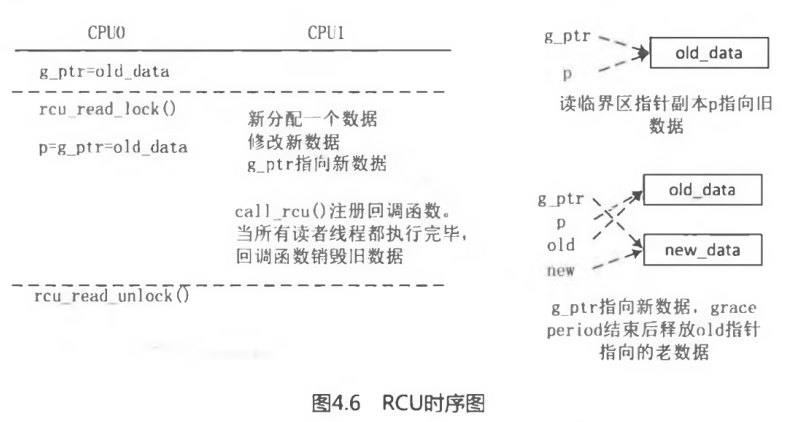
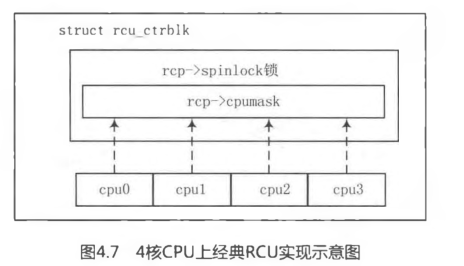
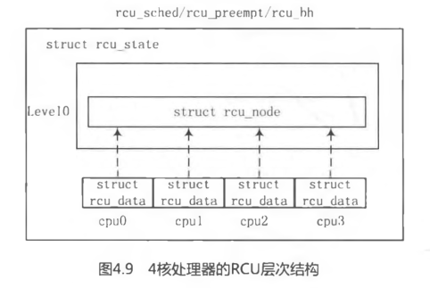
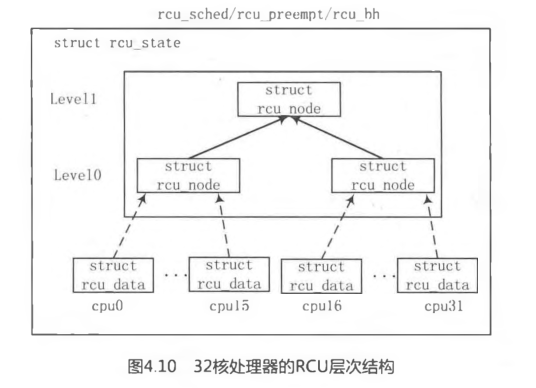
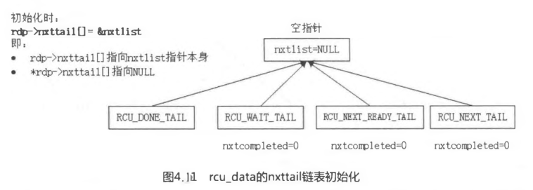
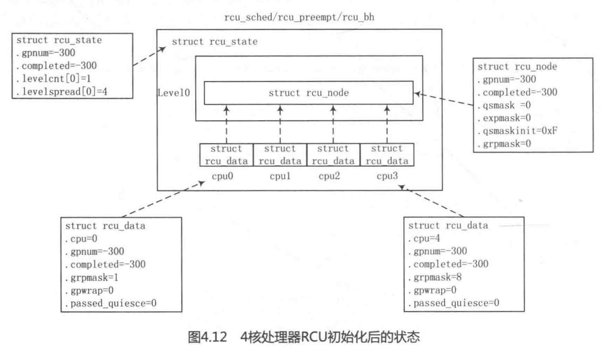
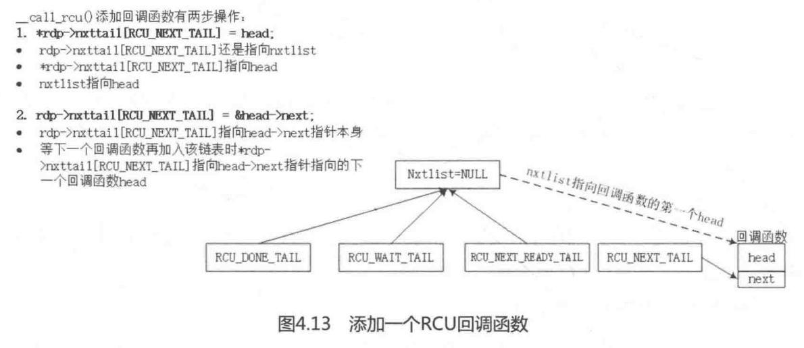
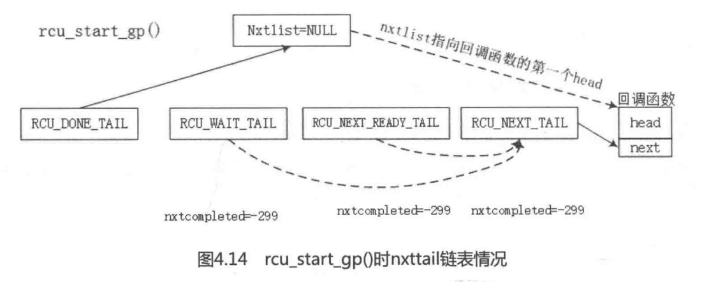
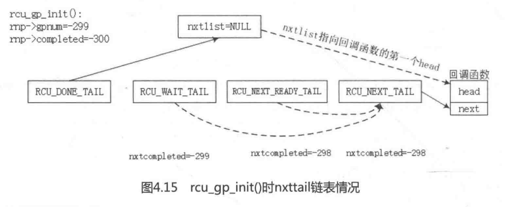
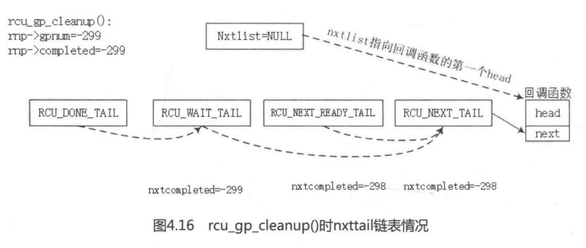

<!-- @import "[TOC]" {cmd="toc" depthFrom=1 depthTo=6 orderedList=false} -->

<!-- code_chunk_output -->

- [0 概述](#0-概述)
- [1 经典 RCU 和 Tree RCU](#1-经典-rcu-和-tree-rcu)
- [2 Tree RCU 设计](#2-tree-rcu-设计)
  - [2.1 初始化 RCU 层次结构](#21-初始化-rcu-层次结构)
    - [2.1.1 RCU 层次结构概述](#211-rcu-层次结构概述)
    - [2.1.2 rcu\_state 初始化](#212-rcu_state-初始化)
    - [2.1.3 内核启动 RCU 初始化](#213-内核启动-rcu-初始化)
      - [2.1.3.1 初始化每个 CPU 的 rcu\_data](#2131-初始化每个-cpu-的-rcu_data)
      - [2.1.3.2 每个 rcu\_state 初始化一个内核线程](#2132-每个-rcu_state-初始化一个内核线程)
  - [2.2 开启一个 GP](#22-开启一个-gp)
    - [2.2.1 写者程序注册 RCU 回调函数](#221-写者程序注册-rcu-回调函数)
    - [2.2.2 时钟中断处理当前 CPU 的 rcu\_data 上事件](#222-时钟中断处理当前-cpu-的-rcu_data-上事件)
    - [2.2.3 软中断处理函数](#223-软中断处理函数)
  - [2.3 初始化一个 GP](#23-初始化一个-gp)
  - [2.4 检测 quiescent state](#24-检测-quiescent-state)
  - [2.5 GP 结束](#25-gp-结束)
  - [2.6 回调函数](#26-回调函数)
- [3 小结](#3-小结)
  - [3.1 背景和原理](#31-背景和原理)
  - [3.2 操作接口](#32-操作接口)
  - [3.3 基本概念](#33-基本概念)
  - [3.4 Linux 实现](#34-linux-实现)
    - [3.4.1 相关数据结构定义](#341-相关数据结构定义)
    - [3.4.2 内核启动进行 RCU 初始化](#342-内核启动进行-rcu-初始化)
    - [3.4.3 开启一个 GP](#343-开启一个-gp)
    - [3.4.4 初始化一个 GP](#344-初始化一个-gp)
    - [3.4.5 检测 QS](#345-检测-qs)
    - [3.4.6 GP 结束](#346-gp-结束)
    - [3.4.7 回调函数](#347-回调函数)

<!-- /code_chunk_output -->


在阅读本节前请思考如下小问题.

- RCU 相比读写锁有哪些优势?
- 请解释 Quiescent State 和 Grace Period.
- 请简述 RCU 实现的基本原理.
- 在大型系统中, 经典 RCU 遇到了什么问题? Tree RCU 又是如何解决该问题的?
- 在 RCU 实现中, 为什么要使用 ULONG\_CMP\_GE()和 ULONG\_CMP\_LT()宏来比较两个数的大小, 而不直接使用大于号或者小于号来比较?
- 请简述一个 Grace Period 的生命周期及其状态机的变化.

# 0 概述

RCU 全称**read\-copy\-update**, 是 Linux 内核中一种重要的**同步机制**.

Linux 内核中己经有
了**原子操作**、**spinlock**、**读写 spinlock**、**读写信号量**、**mutex**等锁机制, 为什么要单独设计一个比它们实现要复杂得多的新机制呢?

回忆**spinlock**、**读写信号量**和**mutex**的实现, 它们都使用了**原子操作指令**, 即**原子地访问内存**, **多 CPU**争用**共享的变量**会让**cache—致性变得很糟(！！！**), 使得**性能下降**.

以**读写信号量**为例, 除了**上述缺点**外, 读写信号量还有一个**致命弱点**, 它**只允许多个读者同时存在**, 但是**读者和写者不能同时存在(！！！**).

那么**RCU 机制要实现的目标**是, 希望**读者线程(！！！)没有同步开销**, 或者说**同步开销变得很小**, 甚至可以忽略不计, **不需要额外的锁**, 不需要使用**原子操作**指令和**内存屏障**, 即可**畅通无阻地访问(！！！**); 而把需要**同步的任务**交给**写者线程(！！！**), **写者线程**等待**所有读者线程**完成后才会把**旧数据销毁**. 在 RCU 中, 如果有**多个写者(！！！**)同时存在, 那么需要**额外的保护机制(！！！**).

RCU 机制的**原理**可以概括为**RCU 记录**了**所有指向共享数据的指针的使用者**, 当要**修改**该共享数据时, 首先**创建一个副本**, 在**副本中修改**. **所有读访问线程**都离开读临界区之后, **指针**指向新的**修改后副本的指针**, 并且**删除旧数据**.

RCU 的一个重要的应用场景是**链表**, 有效地**提高遍历读取数据的效率**. **读取链表**成员数据时通常只需要**rcu\_read\_lock**(), 允许**多个线程(！！！)同时读取该链表**, 并且允许**一个线程(！！！**)同时**修改链表**. 那为什么这个过程能**保证链表访问的正确性**呢?

在**读者遍历链表**时, 假设**另外一个线程删除了一个节点**. **删除线程**会把这个**节点从链表中移出**, 但**不会直接销毁**它. RCU 会等到**所有读线程读取**完成后, 才会**销毁**这个节点.

RCU 提供的接口如下.

- rcu\_read\_lock()/rcu\_read\_unlock(): 组成一个**RCU 读临界**.
- rcu\_dereference(): 用于获取**被 RCU 保护的指针**(RCU protected pointer), **读者线程**要访问**RCU 保护的共享数据**, 需要使用**该函数创建一个新指针(！！！**), 并且**指向 RCU 被保护的指针**.
- rcu\_assign\_pointer(): 通常用在**写者线程**. 在**写者线程**完成新数据的**修改**后, 调用该接口可以让**被 RCU 保护的指针**指向**新创建的数据**, 用 RCU 的术语是发布(Publish) 了更新后的数据.
- synchronize\_rcu(): 同步等待**所有现存的读访问完成**.
- call\_rcu(): 注册一个**回调函数(！！！**), 当**所有**现存的**读访问完成**后, 调用这个回调函数**销毁旧数据**.

下面通过一个 RCU 简单的例子来理解上述接口的含义, 该例子来源于内核源代码中 Documents/RCU/whatisRCU.txt , 并且省略了一些异常处理情况.

```c
[RCU 的一个简单例子]
#include <linux/kernel.h>
#include <linux/module.h>
#include <linux/init.h>
#include <linux/slab.h>
#include <linux/spinlock.h>
#include <linux/rcupdate.h>
#include <linux/kthread.h>
#include <linux/delay.h>

struct foo {
	int a;
	struct rcu_head rcu;
};

static struct foo *g_ptr;

static void myrcu_reader_thread(void *data) //读者线程
{
    struct foo *p = NULL;

    while(1){
        msleep(200);
        // 重点 1
        rcu_read_lock();
        // 重点 2
        p = rcu_dereference(g_ptr);
        if(p)
            printk("%s: read a=%d\n", __func__, p->a);
        // 重点 3
        rcu_read_unlock();
    }
}

static void myrcu_del(struct rcu_head *rh)
{
    struct foo *p = container_of(rh, struct foo, rcu);
    printk ("%s: a=%d\n", __func__, p->a);
    kfree(p);
}

static void myrcu_writer_thread(void *p)    //写者线程
{
    struct foo *mew;
    struct foo *old;
    int value = (unsigned long)p;

    while(1){
        msleep(400);
        struct foo *new_ptr = kmalloc(sizeof(struct foo), GFP_KERNEL);
        old = g_ptr;
        printk("%s: write to new %d\n", __func__, value);
        *new_ptr = *old;
        new_ptr->a = value;
        // 重点
        rcu_assign_pointer(g_ptr, new_ptr);
        // 重点
        call_rcu(&old->rcu, myrcu_del);
        value++;
    }
}

static int __init my_test_init(void){
    struct task_struct *reader_thread;
    struct task_struct *writer_thread ;
    int value = 5;

    printk("figo: my module init\n");
    g_ptr = kzalloc(sizeof (struct foo), GFP_KERNEL);

    reader_thread = kthread_run(myrcu_reader_thread, NULL, "rcu_reader");
    writer_thread = kthread_run(myrcu_writer_thread, (void *)(unsigned long)value, "rcu_writer")
    return 0;
}

static void __exit my_test_exit(void)
{
    printk("goodbye\n");
    if(g_ptr)
        kfree(g_ptr);
}
MODULE_LICENSE("GPL");
module_init(my_test_init);
```

该例子的目的是通过 RCU 机制保护**my\_test\_init**()**分配的共享数据结构 g\_ptr**, 另外创建了一个读者线程和一个写者线程来模拟同步场景.

对于**读者线程**myrcu\_reader\_thread:

- 通过**rcu\_read\_lock**()和**rcu\_read\_unlock**()来构建一个**读者临界区**.
- 调用 rcu\_dereference()获取**被保护数据 g\_ptr 指针**的一个**副本(！！！**), 即**指针 p**, 这时**p 和 g\_ptr**都指向**旧的被保护数据**.
- 读者线程每隔 200 毫秒读取一次被保护数据.

对于**写者线程**myrcu\_writer\_thread:

- 分配一个**新的保护数据 new\_ptr**, 并修改相应数据.
- **rcu\_assign\_pointer**()让 g\_ptr 指向**新数据**.
- call\_rcu()注册一个**回调函数(！！！**), 确保**所有对旧数据的引用都执行完成**之后, 才调用回调函数来删除旧数据 old\_data.
- 写者线程每隔 400 毫秒修改被保护数据.

上述过程如图 4.6 所示.



在所有的**读访问完成**之后, 内核可以释放旧数据, 对于**何时释放旧数据**, 内核提供了**两个 API 函数**: synchronize\_rcu()和 call\_rcu().

# 1 经典 RCU 和 Tree RCU

本章重点介绍**经典 RCU**和**Tree RCU 的实现**, **可睡眠**和**可抢占 RCU**留给读者自行阅读.

RCU 里有两个很重要的概念, 分别是**宽限期(Grace Period, GP**)和**静止状态(Quiescent State, QS**).

- Grace Period, **宽限期**. GP 有**生命周期**, 有**开始**和**结束**之分. 在**GP 开始那一刻**算起, 当**所有处于读者临界区**的 CPU 都**离开**了临界区, 也就是**都至少发生了一次 Quiescent State**, 那么认为**一个 GP 可以结束**了. GP**结束**后, RCU 会调用注册的**回调函数**, 例如销毁旧数据等.
- Quiescent State, **静止状态**. 在 RCU 设计中, 如果**一个 CPU 处于 RCU 读者临界区**中, 说明它的状态是**活跃**的; 相反, 如果在**时钟 tick**中检测到该 CPU 处于**用户模式或 idle 模式(！！！**), 说明该 CPU 已经**离开了读者临界区**, 那么它是**静止状态**. 在**不支持抢占的 RCU 实现(！！！**)中, 只要检测到 CPU 有**上下文切换**, 就可以知道**离开了读者临界区**.

RCU 在 Linux 2.5 内核开发时己经加入到 Linux 内核, 但是在**Linux 2.6.29 之前**的 RCU 通常被称为**经典 RCU(Classic RCU**). 经典 RCU 在**大型系统**中遇到了**性能问题**, 后来在 Linux **2.6.29**中 IBM 的内核专家 Paul E.McKenney 提出了**Tree RCU**的实现, Tree RCU 也被称为**Hierarchical RCU**.

经典 RCU 实现在超级大系统中遇到了问题, 特别是**有些系统**的**CPU 核心超过了 1024 个**, 甚至达到**4096**个. **经典 RCU**在判断**是否完成一次 GP**时采用**全局的 cpumask 位图(！！！**), 每个比特位表示一个 CPU, 那么在 1024 个 CPU 核心的系统中, cpumask 位图就有 1024 个比特位. **每个 CPU**在**GP 开始**时要**设置位图中对应的比特位**, **GP 结束**时要**清相应的比特位**. **全局的 cpumask 位图**会导致**很多 CPU 竞争使用**, 那么**需要 spinlock 锁来保护位图(！！！**). 这样导致该**锁争用变得很惨烈**, 惨烈程度随着**CPU 的个数线性递增(！！！**). 以 4 核处理器为例, 经典 RCU 的实现如图 4.7 所示.



**Tree RCU**实现巧妙地解决了**cpumask 位图竞争锁**的问题. 以上述的 4 核处理器为例, 假设 Tree RCU 把**两个 CPU**分成**1 个 rcu\_node 节点**, 这样**4 个 CPU**被分配到**两个 rcu\_node**节点上, 另外还有**1 个根 rcu\_node**节点来**管理这两个 rcu\_node 节点**. 如图 4.8 所示, 节点 1 管理 cpuO 和 cpul, 节点 2 管理 cpu2 和 cpu3, 而节点 0 是根节点, 管理节点 1 和节点 2. **每个节点**只需要**两个比特位的位图(！！！**)就可以**管理各自的 CPU**或者节点, **每个节点(！！！**)都有**各自的 spinlock 锁(！！！**)来**保护相应的位图**.


注意: **CPU 不算层次 level！！！**

假设**4 个 CPU**都经历过**一个 QS 状态**, 那么**4 个 CPU**首先在**Level 0 层级**的**节点 1**和**节点 2**上**修改位图**. 对于**节点 1**或者**节点 2**来说, **只有两个 CPU 来竞争锁**, 这比经典 RCU 上的锁争用要减少一半. 当**Level 0**上**节点 1**和**节点 2**上**位图都被清除干净后(！！！**), 才会清除**上一级节点的位图**, 并且**只有最后清除节点的 CPU(！！！**)才有机会去**尝试清除上一级节点的位图(！！！**). 因此对于节点 0 来说, 还是两个 CPU 来争用锁. 整个过程都是只有两个 CPU 去争用一个锁, 比经典 RCU 实现要减少一半. 这类似于足球比赛, 进入四强的 4 只队伍被分成上下半区, 每个半区有两只球队, 只有半决赛获胜的球队才能进入决赛.

Tree RCU 为了实现**分层的结构**, 定义了**3 个很重要的数据结构**, 分别是**struct rcu\_data**、**struct rcu\_node**和**struct rcu\_state**, 另外还维护了一个比较隐晦的**状态机(！！！**).

```c
[kernel/rcu/tree.h]
struct rcu_data {
	unsigned long	completed;
	unsigned long	gpnum;
	bool		passed_quiesce;
	bool		qs_pending;
	struct rcu_node *mynode;
	unsigned long grpmask;
	struct rcu_head *nxtlist;
	struct rcu_head **nxttail[RCU_NEXT_SIZE];
	unsigned long	nxtcompleted[RCU_NEXT_SIZE];
	int cpu;
	struct rcu_state *rsp;
	...
};
```

struct **rcu\_data**数据结构定义成**Per\-CPU 变量**, 每个 CPU 有一个独立的 struct rcu\_data, 有如下的重要的成员.

注意: **CPU 不算层次 level！！！**

- gpnum: RCU 内部对 GP 的一个**计数**. 系统初始化时该值从\-300 开始计数, 每当**新建一个 GP**, 该值会**加 1**.
- completed: 当**GP 完成**时, 该成员会**加 1**. 系统初始化时, completed 和 gpnum 成员都等于\-300, 从这**两个成员值的变化**可以窥探出**GP 状态机的运行状态**.
- passed\_quiesce: 当在**时钟 tick 处理函数**中检测到**rcu\_data 对应的 CPU**完成一次**Quiescent State**时, 该成员**设置为 true**.
- qs\_pending: 表示 CPU 正在**等待 Quiescent State**.
- mynode: 指向**父节点 rcu\_node**.
- grpmask: **父节点 rcu\_node**中有一个**qsmark 位图(！！！**). 该**位图中每个比特位**代表一个**子节点**或**对应的 rcu\_data**. grpmask 代表**在 qsmark 位图**中的**相应的比特位**.
- nxtlist 和 nxttail: 组成一个**多层次的链表(！！！**).
- cpu: 指**该 rcu\_data 所属的 CPU ID**.
- rsp: 指向**rcu\_state**数据结构.

```c
[kernel/rcu/tree.h]
struct rcu_node {
	raw_spinlock_t lock;
	unsigned long gpnum;
	unsigned long completed;
	unsigned long qsmask;
	unsigned long qsmaskinit;
	unsigned long grpmask;
	int	grplo;
	int	grphi;
	u8	level;
	struct rcu_node *parent;
	...
} ____cacheline_internodealigned_in_smp;
```

struct rcu\_node 是**Tree RCU**中重要的**组成节点**, 它有**根节点(Root Node**)和**叶节点**之分. 如果**Tree RCU 只有一层**, 那么**根节点**下面**直接管理着一个或多个 rcu\_data**;如果 Tree RCU 有**多层**结构, 那么**根节点管理着多个叶节点**, **最底层的叶节点**管理者**一个或多个 rcu_data**.

- lock: rcu\_node 节点**内部的 spinlock 锁**, 用于**该节点所管辖**的**rcu\_data 或叶节点之间的互斥操作(！！！**).
- gpnum: 表示**当前 GP**在**该节点的计数**. 系统初始化为\-300, 每当开始一个 GP, 该值会增加 1.
- completed: 表示**该节点上一次 GP 完成**时的计数. 系统**初始化**时, 和 gpnum—样为-300. 当**一个 GP 完成**时, **completed 才会加 1**.
- qsmark: 该**节点**用于管理**所属的 rcu\_data 或子节点的位图(！！！**). **每个比特位**表示**一个 rcu\_data**或**子节点**. 每当**rcu\_data 或子节点**完成了**Quiescent State 状态**, 相应的**比特位会被清除**.
- qsmaskinit: 每个 GP 初始化时, qsmaskinit 等于 qsmark 的初始值.
- grpmask: 对应**其父节点中的 qsmark 位图相应比特位**.
- grplo: 该节点**最少管理 CPU**或**子节点**的数量.
- grphi: 该节点最多管理 CPU 或子节点的数量.
- level: 表示该节点在 Tree RCU 中的**第几层**, **根节点在第 0 层**.
- parent: 指向**父节点**.

```c
[kernel/rcu/tree.h]
struct rcu_state {
	struct rcu_node node[NUM_RCU_NODES];
	struct rcu_node *level[RCU_NUM_LVLS];
	u32 levelcnt[MAX_RCU_LVLS + 1];
	u8 levelspread[RCU_NUM_LVLS];
	struct rcu_data __percpu *rda;
	void (*call)(struct rcu_head *head,
		     void (*func)(struct rcu_head *head));
	unsigned long gpnum;
	unsigned long completed;
	struct task_struct *gp_kthread;
	wait_queue_head_t gp_wq;
	short gp_state;
	const char *name;
	struct list_head flavors;
	...
};
```

RCU 系统支持**多个不同类型的 RCU 状态**, 例如 rcu\_sched\_state、rcu\_bh\_state 和 rcu\_preempt\_state, 它们分别使用 struct rcu\_state 数据结构来描述这些状态. **每种 RCU 类型**都有**独立的层次结构(！！！**), 即**根节点和 rcu\_data**数据结构.

- node: **所有的 rcu\_node**节点都存放到**此数组**中, 方便进行**全部的节点扫描**, 例如 rcu\_for\_each\_node\_breadth\_first()宏.
- level: **指针数组**, 每个成员指向 Tree RCU**每一层**中的**第一个 rcu\_node 节点**.
- levelcnt: **数组**, **每一层**包含**rcu\_node 节点的个数**.
- levelspread: **数组**, **每一层**管理可以管理的**CPU 或子节点的个数**.
- rda: 指向**rcu\_data 的 Per\-CPU 变量**.
- **call**: 指向 RCU 的 call\_rcu\_sched()、call\_rcu\_bh()和 call\_rcu()函数.
- gpnum、completed: 与 rcu\_node 和 rcu\_data 数据结构中的成员含义类似.
- gp\_kthread: **RCU 内核线程**, 处理函数为**rcu\_gp\_kthread**().
- gp\_wq: 在 RCU**内核线程**中管理**睡眠唤醒的等待队列**.
- gp\_state: 管理**RCU 内核线程睡眠唤醒的状态**.
- name: 该 rcu\_state 的名字.
- flavors: 几个独立的 rcu\_state 串成一个链表.

# 2 Tree RCU 设计

## 2.1 初始化 RCU 层次结构

### 2.1.1 RCU 层次结构概述

Tree RCU 根据**CPU 数量的大小**按照**树形结构**来组成其层次结构, 称为**RCU Hierarchy**. 内核中有**两个宏**帮助构建 RCU 层次结构, 其中**CONFIG\_RCU\_FANOUT\_LEAF**表示一个**子叶子的 CPU 数量(！！！**), **CONFIG\_RCU\_FANOUT**表示**每个层数**最多支持的**叶子数量**, **MAX\_RCU_LVLS**等于 4 表示**内核最多支持 4 层结构(！！！**).

**三个维度(！！！**): **每个叶子的 CPU 数量**, **每层的最多叶子数量**, **最多层数**; **CPU 不算 level 层次！！！**

```c
[arch/arm/configs/vexpress_defconfig]
CONFIG_RCU_FANOUT=32
CONFIG_RCU_FANOUT_LEAF=16

[kernel/rcu/tree.h]
#define MAX_RCU_LVLS 4
#define RCU_FANOUT_1	      (CONFIG_RCU_FANOUT_LEAF)
#define RCU_FANOUT_2	      (RCU_FANOUT_1 * CONFIG_RCU_FANOUT)
#define RCU_FANOUT_3	      (RCU_FANOUT_2 * CONFIG_RCU_FANOUT)
#define RCU_FANOUT_4	      (RCU_FANOUT_3 * CONFIG_RCU_FANOUT)

#if NR_CPUS <= RCU_FANOUT_1
#  define RCU_NUM_LVLS	      1
#  define NUM_RCU_LVL_0	      1
#  define NUM_RCU_LVL_1	      (NR_CPUS)
#  define NUM_RCU_LVL_2	      0
#  define NUM_RCU_LVL_3	      0
#  define NUM_RCU_LVL_4	      0
#elif NR_CPUS <= RCU_FANOUT_2
#  define RCU_NUM_LVLS	      2
#  define NUM_RCU_LVL_0	      1
#  define NUM_RCU_LVL_1	      DIV_ROUND_UP(NR_CPUS, RCU_FANOUT_1)
#  define NUM_RCU_LVL_2	      (NR_CPUS)
#  define NUM_RCU_LVL_3	      0
#  define NUM_RCU_LVL_4	      0
#elif NR_CPUS <= RCU_FANOUT_3
#  define RCU_NUM_LVLS	      3
#  define NUM_RCU_LVL_0	      1
#  define NUM_RCU_LVL_1	      DIV_ROUND_UP(NR_CPUS, RCU_FANOUT_2)
#  define NUM_RCU_LVL_2	      DIV_ROUND_UP(NR_CPUS, RCU_FANOUT_1)
#  define NUM_RCU_LVL_3	      (NR_CPUS)
#  define NUM_RCU_LVL_4	      0
#elif NR_CPUS <= RCU_FANOUT_4
#  define RCU_NUM_LVLS	      4
#  define NUM_RCU_LVL_0	      1
#  define NUM_RCU_LVL_1	      DIV_ROUND_UP(NR_CPUS, RCU_FANOUT_3)
#  define NUM_RCU_LVL_2	      DIV_ROUND_UP(NR_CPUS, RCU_FANOUT_2)
#  define NUM_RCU_LVL_3	      DIV_ROUND_UP(NR_CPUS, RCU_FANOUT_1)
#  define NUM_RCU_LVL_4	      (NR_CPUS)
#else
# error "CONFIG_RCU_FANOUT insufficient for NR_CPUS"
#endif /* #if (NR_CPUS) <= RCU_FANOUT_1 */
```

假设**CONFIG\_RCU\_FANOUT\_LEAF 等于 16**, **CONFIG\_RCU\_FANOUT 等于 32**, 那么可计算出**该系统 RCU 最大支持**的**CPU 个数为 524288**, 这已经远远大于一般超级系统的 CPU 个数.

以 ARM Vexpress 平台为例, 最多支持 4 个 Cortex A9, 那么它的 RCU 层次结构如图 4.9 所示, 系统**只有一个层级**即 Level 0, 并且**Level 0**层级中**只需要一个 struct rcu\_node(！！！**)节点就可以容纳**4 个 struct rcu\_data(！！！**)数据结构. struct **rcu\_data**数据结构是**Per\-CPU 变量**, 每个 CPU 有一个独立的 struct rcu\_data 数据结构, 其中**mynode(！！！**)成员指向所属的**struct rcu\_node**节点.

**系统初始化 3 个独立的 struct rcu\_state(！！！**)用于不同的场景, 分别为**rcu\_sched\_state**、**rcu\_bh\_state**和**rcu\_preempt\_state**. **每个 struct rcu\_state(！！！**)都有**一套上述的 RCU 层次结构(！！！**).

- **普通进程上下文**的 RCU 使用**rcu\_sched\_state**状态;
- **软中断上下文**则使用**rcu\_bh\_state**;
- 如果系统配置了**CONFIG\_PREEMPT\_RCU**, 那么系统**默认使用 rcu\_preempt\_state**, 它在**read\_lock**期间**允许其他进程抢占**.



下面以两个层级的 RCU 结构为例, 假设在一个 32 核的处理器中, CONFIG\_RCU\_FANOUT\_LEAF 等于 16, CONFIG\_RCU\_FANOUT 等 32, 该处理器的 RCU 层次结构如图 4.10 所示.



在**32 核处理器**中, 层次结构分成两层, **Level 0**包括**两个 struct rcu\_node(！！！**), 其中**每个 struct rcu\_node**管理**16 个 struct rcu\_data(！！！**)数据结构, 分别表示**16 个 CPU 的独立 struct rcu\_data**数据结构; 在**Level 1**层级, 有**一个 struct rcu\_node(！！！**)节点**管理**着**Level 0 层级**的**两个 rcu\_node**节点, **Level 1**层级中的**rcu\_node**节点称为**根节点**, **Level 0**层级的**两个 rcu\_node**节点是**叶节点**.

下面以 4 核处理器为例, 详细介绍系统第一个 GP 的生命周期.

### 2.1.2 rcu\_state 初始化

**struct rcu\_state**数据结构釆用**静态初始化**的方式, 由**RCU\_STATE\_INITIALIZER**()来初始化一些重要的成员.

```c
[kernel/rcu/tree.c]
#define RCU_STATE_INITIALIZER(sname, sabbr, cr) \
DEFINE_RCU_TPS(sname) \
struct rcu_state sname##_state = { \
	.level = { &sname##_state.node[0] }, \
	.call = cr, \
	.fqs_state = RCU_GP_IDLE, \
	.gpnum = 0UL - 300UL, \
	.completed = 0UL - 300UL, \
	.orphan_lock = __RAW_SPIN_LOCK_UNLOCKED(&sname##_state.orphan_lock), \
	.orphan_nxttail = &sname##_state.orphan_nxtlist, \
	.orphan_donetail = &sname##_state.orphan_donelist, \
	.barrier_mutex = __MUTEX_INITIALIZER(sname##_state.barrier_mutex), \
	.onoff_mutex = __MUTEX_INITIALIZER(sname##_state.onoff_mutex), \
	.name = RCU_STATE_NAME(sname), \
	.abbr = sabbr, \
}; \
DEFINE_PER_CPU_SHARED_ALIGNED(struct rcu_data, sname##_data)
```

其中**gpnum 和 completed 初始化为(0UL \- 300UL**). 读者可以会有疑问, 这两个成员定义为**unsigned long 类型**, 为什么这里初始化为 0UL \- 300UL 呢?unsigned long 类型为什么定义负数?

以**32 位 CPU**为例, **unsigned long 类型**的**最大值是 ULONG\_MAX(\~0UL**), 即**0xffff,ffff**. 如果用**有符号类型**来表示就**是\-1** , 所以(0UL \- 300UL)用**无符号类型**来表示是 4294966996,用十六进制来表示是 0xfffffed4, **用有符号类型来表示是\-300**. gpnum 和 completed 成员在**RCU 系统**中会**一直在增长**, 也就是**初始化**的 0xfffffed4(**有符号类型等于\-300**)一直**增长到**(**有符号类型等于\-1**),然后变成 0x0, 然后一直增长到然后又从 0x0 开始增长, 一直循环下去. 有符号类型变量有溢出问题, 所以这里都使用无符号类型变量. 为了描述方便和读者容易理解, 抛开溢出问题, 本章假设 gpnum 和 completed 是**有符号类型**变量, **初始值从\-300**开始, 虽然这样表述不准确.

### 2.1.3 内核启动 RCU 初始化

**RCU 的初始化**在**内核启动**时会调用**rcu\_init**()函数, **RCU 层次结构**的构建在**rcu\_init\_geometry**()和 **rcu\_init\_one**()函数中实现.

```c
[start_kernel()->rcu_init()]
[kernel/rcu/tree.c]
void __init rcu_init(void)
{
	int cpu;

	rcu_init_geometry();
	// 初始化 rcu_bh_state
	rcu_init_one(&rcu_bh_state, &rcu_bh_data);
	// 初始化 rcu_sched_state
	rcu_init_one(&rcu_sched_state, &rcu_sched_data);
	// 初始化 rcu_preempt_state
	__rcu_init_preempt();
	// 注册 softirq 回调
	open_softirq(RCU_SOFTIRQ, rcu_process_callbacks);
    // 注册 CPU Notifier 子系统
	cpu_notifier(rcu_cpu_notify, 0);
	// 注册 PM Notifier 子系统
	pm_notifier(rcu_pm_notify, 0);
	// 位置 1
	for_each_online_cpu(cpu)
		rcu_cpu_notify(NULL, CPU_UP_PREPARE, (void *)(long)cpu);
}
```

这里会初始化**3 个 rcu\_state**, 分别是**rcu\_sched\_state**、**rcu\_bh\_state**和**rcu\_preempt\_state**.

在**rcu\_init\_one**()函数里, 除了构建**rcu\_state**、**rcu\_node**和**rcu\_data**之间的**树形结构**关系外, 还会初始化一些**关键的数据结构成员**.

```c
# 4 核处理器, 假设叶节点 CPU 个数是 16
rnp->gpnum = rsp->gpnum = -300
rnp->completed = rsp->completed = -300
rnp->grplo =0
rnp->grphi=3
rnp->level =0
rnp->qsmask =0
rnp->qsmaskinit=l
rnp->grpmask =0
```

另外还单独注册了一个**SoftIRQ 回调函数！！！rcu\_process\_callbacks**().

此外, 还注册了**CPU Notifier**和**PM Notifier 子系统**.

位置 1 代码, 给系统中**每个 online 的 CPU**都发送一个**CPU\_UP\_PREPARE 事件**到**CPU Notifier 子系统**中, 在**回调函数 rcu\_cpu\_notify**()中处理该事件.

```c
[kernel/rcu/tree.c]
static int rcu_cpu_notify(struct notifier_block *self,
				    unsigned long action, void *hcpu)
{
	long cpu = (long)hcpu;
	struct rcu_data *rdp = per_cpu_ptr(rcu_state_p->rda, cpu);
	struct rcu_node *rnp = rdp->mynode;
	struct rcu_state *rsp;

	switch (action) {
	case CPU_UP_PREPARE:
	case CPU_UP_PREPARE_FROZEN:
	    // 位置 1
		rcu_prepare_cpu(cpu);
		...
		break;
	case CPU_ONLINE:
	case CPU_DOWN_FAILED:
		break;
	...
	default:
		break;
	}
	return NOTIFY_OK;
}
```

**rcu\_cpu\_notify**()函数主要为了**支持 CPU 热插拔**. 对于**CPU\_UP\_PREPARE 事件**的具体响应在**rcu\_prepare\_cpu**()函数中.

```c
[kernel/rcu/tree.c]
static void rcu_prepare_cpu(int cpu)
{
	struct rcu_state *rsp;

	for_each_rcu_flavor(rsp)
		rcu_init_percpu_data(cpu, rsp);
}
```

**for\_each\_rcu\_flavor**()遍历系统中**所有的 struct rcu\_state**数据结构.

**rcu\_init\_percpu\_data**()函数**初始化每个 CPU(！！！)上的 struct rcu\_data**数据结构.

**rcu\_state(不是 Per\-CPU, 每个都自有层次结构, 即有自己的节点和 rcu\_data), 这里相当于遍历所有 rcu\_state, 初始化其中的 Per\-CPU rcu\_data**.

#### 2.1.3.1 初始化每个 CPU 的 rcu\_data

删除了关中断和锁相关代码的函数代码片段如下.

```c
[rcu_cpu_notify() -> rcu_prepare_cpu() ->rcu_init_percpu_data()]
[kernel/rcu/tree.c]
static void
rcu_init_percpu_data(int cpu, struct rcu_state *rsp)
{
	unsigned long mask;
	struct rcu_data *rdp = per_cpu_ptr(rsp->rda, cpu);
	struct rcu_node *rnp = rcu_get_root(rsp);
    ...
    // 位置 1
	init_callback_list(rdp);  /* Re-enable callbacks on this CPU. */
	rnp = rdp->mynode;
	mask = rdp->grpmask;
	do {
		rnp->qsmaskinit |= mask;
		mask = rnp->grpmask;
		if (rnp == rdp->mynode) {
			rdp->gpnum = rnp->completed;
			rdp->completed = rnp->completed;
			rdp->passed_quiesce = 0;
		}
		rnp = rnp->parent;
	} while (rnp != NULL && !(rnp->qsmaskinit & mask));
	...
}
```

首先, 位置 1 代码中的**init\_callback\_list**()函数**初始化 struct rcu\_data**数据结构中**nxttail\[\]成员**, 它是一个**二级指针数组**, 在初始化时把 nxtlist 指针本身的地址赋值给 nxttail\[\]成员, 如图 4.11 所示.

```c
[kernel/rcu/tree.c]
static void init_callback_list(struct rcu_data *rdp)
{
	int i;

	rdp->nxtlist = NULL;
	for (i = 0; i < RCU_NEXT_SIZE; i++)
		rdp->nxttail[i] = &rdp->nxtlist;
}
```



接下来初始化 rcu\_data 几个重要的成员, 其中 rcu\_data\-\>gpnum = rdp\-\>completed = mp\-\>completed = \-300,且 rdp\-\>passed\_quiesce= 0.

整个 RCU 数据结构初始化的效果如图 4.12 所示.



#### 2.1.3.2 每个 rcu\_state 初始化一个内核线程

总结: 设置当前 rcu\_state 的 GP 状态是"reqwait", **睡眠等待**, 直到**rsp\-\>gp\_flags**设置为**RCU\_GP\_FLAG\_INIT**, 即收到**初始化一个 GP 的请求**, 被唤醒后, 就会调用 rcu\_gp\_init()去初始化一个 GP, 详见下面

另外在**系统初始化**时为**每个 rcu\_state**分别**初始化了一个内核线程(！！！**), 内核线程的**名字以 rcu\_state 的名字**命名. 内核线程的执行函数是 rcu\_gp\_kthread().

```c
[kernel/rcu/tree.c]
static int __noreturn rcu_gp_kthread(void *arg)
{
	int fqs_state;
	int gf;
	unsigned long j;
	int ret;
	struct rcu_state *rsp = arg;
	struct rcu_node *rnp = rcu_get_root(rsp);

	for (;;) {

		/* Handle grace-period start. */
		for (;;) {
			trace_rcu_grace_period(rsp->name,
					       ACCESS_ONCE(rsp->gpnum),
					       TPS("reqwait"));
			rsp->gp_state = RCU_GP_WAIT_GPS;
			// 位置 1
			wait_event_interruptible(rsp->gp_wq,
						 ACCESS_ONCE(rsp->gp_flags) &
						 RCU_GP_FLAG_INIT);
			/* Locking provides needed memory barrier. */
			// 位置 2
			if (rcu_gp_init(rsp))
				break;
			cond_resched_rcu_qs();
			ACCESS_ONCE(rsp->gp_activity) = jiffies;
			WARN_ON(signal_pending(current));
			trace_rcu_grace_period(rsp->name,
					       ACCESS_ONCE(rsp->gpnum),
					       TPS("reqwaitsig"));
		}
        ...
        /* Handle grace-period end. */
		rcu_gp_cleanup(rsp);
	}
    ...
}
```

该内核线程**创建并运行**之后, 会在**wait\_event\_interruptible**()函数中**睡眠等待**, 唤醒的条件是**rsp\-\>gp\_flags**要设置**RCU\_GP\_FLAG\_INIT**标志位, 这是**初始化一个 GP 的请求(！！！**), 稍后会介绍.

## 2.2 开启一个 GP

### 2.2.1 写者程序注册 RCU 回调函数

总结:

(1) 参数: rcu\_head(每个 RCU 保护的数据都会内嵌一个), 回调函数指针(GP 结束<读者执行完>, 被调用销毁)

(2) 将**rcu\_head**加入到**本地 rcu\_data 的 nxttail 链表**

**RCU 写者程序(！！！**)通常需要调用**call\_rcu**()、**call\_rcu\_bh**()或**call\_rcu\_sched**()等函数来**通知 RCU**系统**注册一个 RCU 回调函数(！！！**). 这三个接口分别对应三种 state.

```c
[kernel/rcu/tree_plugin.h]
void call_rcu(struct rcu_head *head, void (*func)(struct rcu_head *rcu))
{
	__call_rcu(head, func, &rcu_preempt_state, -1, 0);
}
EXPORT_SYMBOL_GPL(call_rcu);
```

核心函数在\_\_call\_rcu()中, 代码片段如下:

```c
[call_rcu() -> __call_rcu()]
[kernel/rcu/tree.c]
static void
__call_rcu(struct rcu_head *head, void (*func)(struct rcu_head *rcu),
	   struct rcu_state *rsp, int cpu, bool lazy)
{
	unsigned long flags;
	struct rcu_data *rdp;

	head->func = func;
	head->next = NULL;

	local_irq_save(flags);
	rdp = this_cpu_ptr(rsp->rda);

	ACCESS_ONCE(rdp->qlen) = rdp->qlen + 1;

	smp_mb();  /* Count before adding callback for rcu_barrier(). */
	*rdp->nxttail[RCU_NEXT_TAIL] = head;
	rdp->nxttail[RCU_NEXT_TAIL] = &head->next;

	/* Go handle any RCU core processing required. */
	__call_rcu_core(rsp, rdp, head, flags);
	local_irq_restore(flags);
}
```

\_\_call\_rcu()函数的第一个参数 head 指**rcu\_head**数据结构, 通常**被 RCU 保护的数据结构**都**内嵌一个 struct rcu\_head(！！！**)结构; 第二个参数是**回调函数指针**, 等**之前的 RCU 读者都执行完成**后, 即**宽限期结束**之后**调用该回调函数来做销毁动作**; 第三个参数是指在**哪个 rcu\_state**上执行.

这里核心操作是把**head**加入到**本地 rcu\_data(！！！)的 nxttail 链表(！！！**)中, 其中, **nxtlist**指向**第一个加入链表的回调函数 head 指针(！！！**), **nxttail[RCU\_NEXT\_TAIL**]指针指向**head\-\>next 指针本身的地址**, 因此下一个回调函数再加入时, \***nxttail[RCU\_NEXT\_TAIL**]指针指向**head\->next**指向的成员, 如图 4.13 所示.



### 2.2.2 时钟中断处理当前 CPU 的 rcu\_data 上事件

总结: 每次**时钟中断**处理函数**tick\_periodic**(), 检查**本地 CPU**上**所有的 rcu\_state(！！！**)对应的**rcu\_data**成员**nxttail 链表有没有写者注册的回调函数**, 有的话**触发一个软中断 raise\_softirq**().

在系统**每次时钟中断(！！！)处理函数 tick\_periodic**()中, 会调用**rcu\_check\_callbacks**()函数去检查**当前 CPU(！！！**)上的 rcu\_data 是否有待处理的事情.

```c
[tick_handle_periodic () ->tick_periodic() ->update_process_times() ->rcu_check_callbacks()]
[kernel/rcu/tree.c]
void rcu_check_callbacks(int user)
{
	trace_rcu_utilization(TPS("Start scheduler-tick"));
	...
	if (rcu_pending())
		invoke_rcu_core();
	...
	trace_rcu_utilization(TPS("End scheduler-tick"));
}
```

**rcu\_check\_callbacks**()函数会做很多检查, 现在**暂时只关注 rcu\_pending**()函数做哪些检查. rcu\_pending()函数会检查**本地 CPU**上**所有的 rcu\_state**对应的**rcu\_data 上有没有事情需要处理**, 并内部调用\_\_rcu\_pending()来实现. \_\_rcu\_pending()函数里也做很多检查, 我们暂时只关注和创建新 GP 相关的.

```c
[rcu_pending() -> __rcu_pending()]
[kernel/rcu/tree.c]
static int __rcu_pending(struct rcu_state *rsp, struct rcu_data *rdp)
{
	struct rcu_node *rnp = rdp->mynode;

	rdp->n_rcu_pending++;
	...
	/* Has RCU gone idle with this CPU needing another grace period? */
	if (cpu_needs_another_gp(rsp, rdp)) {
		rdp->n_rp_cpu_needs_gp++;
		return 1;
	}
    ...
	return 0;
}
```

cpu\_needs\_another\_gp()函数会检查当前**是否需要开启一个新的 GP**.

```c
[rcu_pending() -> __rcu_pending() -> cpu_needs_another_gp()]
[kernel/rcu/tree.c]
static int
cpu_needs_another_gp(struct rcu_state *rsp, struct rcu_data *rdp)
{
	int i;

	...
	if (*rdp->nxttail[RCU_NEXT_READY_TAIL])
		return 1;  /* Yes, this CPU has newly registered callbacks. */
	...
	return 0; /* No grace period needed. */
}
```

**cpu\_needs\_another\_gp**()函数同样会做很多检查, 目前只关注 nxttail[RCU\_NEXT\_READY\_TAIL]这一项. 在链表初始化时, nxttail[RCU\_NEXT\_READY\_TAIL]指向 nxtlist 指针本身的地址, 所以这里\*rdp\->nxttail[RCU\_NEXT\_READY\_TAIL\]相当于 nxtlist 链表头指向的内容, 表示 nxttail[RCU\_NEXT\_TAIL]链表有**新的 RCU 回调函数注册**, 返回 true.

回到**rcu\_check\_callbacks**()函数中, rcu\_pending()返回 true, 说明有事情需要处理, 调用**invoke\_rcu\_core**()去**触发一个 RCU 软中断(！！！**), raise\_softirq(). 之前**内核初始化已经注册了软中断**.

### 2.2.3 软中断处理函数

总结, 针对**每一个 rcu\_state(！！！**):

(1) 检查 rcu\_data 成员**nxttail 链表有没有写者注册的回调函数**, 有的话, 开启一个 GP, 继续

(2) 调整链表; 设置 rsp\-\>gp\_flags 标志位为 RCU\_GP\_FLAG\_INIT

(3) **rcu\_gp\_kthread\_wake()唤醒 rcu\_state 对应的内核线程(！！！**), 现在的状态变成了"**newreq**", 表示**有一个新的 GP 请求**

**RCU 软中断**的处理函数是**rcu\_process\_callbacks()函数**, 内部调用\_\_rcu\_process\_callbacks()函数去**处理每个 rcu\_state 的状况(！！！**).

```c
[kernel/rcu/tree.c]
static void
__rcu_process_callbacks(struct rcu_state *rsp)
{
	unsigned long flags;
	bool needwake;
	struct rcu_data *rdp = raw_cpu_ptr(rsp->rda);

	WARN_ON_ONCE(rdp->beenonline == 0);

	/* Update RCU state based on any recent quiescent states. */
	// 位置 1
	rcu_check_quiescent_state(rsp, rdp);

	/* Does this CPU require a not-yet-started grace period? */
	local_irq_save(flags);
	// 位置 2
	if (cpu_needs_another_gp(rsp, rdp)) {
		raw_spin_lock(&rcu_get_root(rsp)->lock); /* irqs disabled. */
		// 位置 3
		needwake = rcu_start_gp(rsp);
		raw_spin_unlock_irqrestore(&rcu_get_root(rsp)->lock, flags);
		if (needwake)
		    // 唤醒内核线程
			rcu_gp_kthread_wake(rsp);
	} else {
		local_irq_restore(flags);
	}
}
```

位置 1, rcu\_check\_quiescent\_state()会检查**RCU 的 quiescent state**, 目前在此场景下 GP 还没有开始, 我们暂时忽略它.

位置 2 的 if 中代码, 这里才是真正需要**建立一个 GP 的时刻**, cpu\_needs\_another\_gp()函数会检查**nxttail**\[RCU\_NEXT\_TAIL\]链表中**是否注册了回调函数**.

位置 3 代码, 调用**rcu\_start\_gp**()尝试去**开启一个 GP**.

```c
[kernel/rcu/tree.c]
static bool rcu_start_gp(struct rcu_state *rsp)
{
	struct rcu_data *rdp = this_cpu_ptr(rsp->rda);
	struct rcu_node *rnp = rcu_get_root(rsp);
	bool ret = false;

	ret = rcu_advance_cbs(rsp, rnp, rdp) || ret;
	ret = rcu_start_gp_advanced(rsp, rnp, rdp) || ret;
	return ret;
}
```

rcu\_advance\_cbs()函数是**妥善处理 rcu\_data 中 nxttail 链表**的函数. 刚**初始化**时, **rcu\_data**数据结构中的**nxtcompleted[]值都为 0**.

```c
[kernel/rcu/tree.c]
static bool rcu_advance_cbs(struct rcu_state *rsp, struct rcu_node *rnp,
			    struct rcu_data *rdp)
{
	int i, j;

	/* If the CPU has no callbacks, nothing to do. */
	if (!rdp->nxttail[RCU_NEXT_TAIL] || !*rdp->nxttail[RCU_DONE_TAIL])
		return false;

	for (i = RCU_WAIT_TAIL; i < RCU_NEXT_TAIL; i++) {
		if (ULONG_CMP_LT(rnp->completed, rdp->nxtcompleted[i]))
			break;
		rdp->nxttail[RCU_DONE_TAIL] = rdp->nxttail[i];
	}
	/* Clean up any sublist tail pointers that were misordered above. */
	for (j = RCU_WAIT_TAIL; j < i; j++)
		rdp->nxttail[j] = rdp->nxttail[RCU_DONE_TAIL];

	/* Copy down callbacks to fill in empty sublists. */
	for (j = RCU_WAIT_TAIL; i < RCU_NEXT_TAIL; i++, j++) {
		if (rdp->nxttail[j] == rdp->nxttail[RCU_NEXT_TAIL])
			break;
		rdp->nxttail[j] = rdp->nxttail[i];
		rdp->nxtcompleted[j] = rdp->nxtcompleted[i];
	}

	/* Classify any remaining callbacks. */
	return rcu_accelerate_cbs(rsp, rnp, rdp);
}
```

rcu\_accelerate\_cbs()函数也用于处理 rcu\_data 中 nxttail 链表

```c
[kernel/rcu/tree.c]
static bool rcu_accelerate_cbs(struct rcu_state *rsp, struct rcu_node *rnp,
			       struct rcu_data *rdp)
{
	unsigned long c;
	int i;
	bool ret;

	/* If the CPU has no callbacks, nothing to do. */
	if (!rdp->nxttail[RCU_NEXT_TAIL] || !*rdp->nxttail[RCU_DONE_TAIL])
		return false;

	c = rcu_cbs_completed(rsp, rnp);
	for (i = RCU_NEXT_TAIL - 1; i > RCU_DONE_TAIL; i--)
		if (rdp->nxttail[i] != rdp->nxttail[i - 1] &&
		    !ULONG_CMP_GE(rdp->nxtcompleted[i], c))
			break;

	if (++i >= RCU_NEXT_TAIL)
		return false;

	for (; i <= RCU_NEXT_TAIL; i++) {
		rdp->nxttail[i] = rdp->nxttail[RCU_NEXT_TAIL];
		rdp->nxtcompleted[i] = c;
	}
	/* Record any needed additional grace periods. */
	ret = rcu_start_future_gp(rnp, rdp, NULL);

	/* Trace depending on how much we were able to accelerate. */
	if (!*rdp->nxttail[RCU_WAIT_TAIL])
		trace_rcu_grace_period(rsp->name, rdp->gpnum, TPS("AccWaitCB"));
	else
		trace_rcu_grace_period(rsp->name, rdp->gpnum, TPS("AccReadyCB"));
	return ret;
}
```

上面使用了两个特别的宏————ULONG\_CMP\_GE()和 ULONG\_CMP\_LT().

```c
[include/linux/rcupdate.h]
#define ULONG_CMP_GE(a, b) (ULONG_MAX / 2 >= (a) - (b))
#define ULONG_CMP_LT(a, b) (ULONG_MAX / 2 < (a) - (b))
```

ULONG\_CMP\_GE(a, b)用于判断 a 是否大于等于 b, 为什么这里不直接使用 a>=b 的表达式来判断呢?前文有提到过, RCU 数据结构中有一些无符号类型的变量, 例如 gpnum 和 completed 是一直增长的, 因此这里要很小心地处理溢出的问题. 例如 b=0xffff\_ffff, a=0, 那么直观感觉是 b\>a. 但是如果 a 是从加 1 后溢出便回滚到 0, 那应该是 a\>b. ULONG\_MAX/2 相当于 0xffff\_ffff 右移一位后等于 0x7fff\_ffff, 它等于有符号类型变量的最大值, 那么 ULONG\_CMP\_GE(a, b)宏等价于 a\-b <= 0x7fff\_ffff. 如果 a \- b 等于一个正数, 那么说明 a\> b. 上面的例子中, b =0xffff\_ffff, a = 0, 那么 a\-b = 0\-0xffff\_ffff=0xl, 符合我们的预期.

同样的道理, ULONG\_CMP\_LT(a, b)用于判断 a 是否小于 b. ULONG\_CMP\_LT(a, b)宏等同于 a\-b\> 0x7fff\_ffff, 0x7fff\_ffff 再加 1 将变成 0x8000\_0000,即有符号类型的最大负数值.

请读者自行阅读上述 rcu\_advance\_cbs()和 rcu\_accelerate\_cbs()函数, 这里需要根据 rdp\-〉nxttail\[\]指针指向、rdp\-\>nxtcompleted\[\]值和**GP 的状态调整 nxttail 链表**. 下面给出执行完 rcu\_advance\_cbs()后 rdp\-〉nxttail 链表的情况, 如图 4.14 所不.



**rcu\_start\_gp\_advanced**()函数**设置 rsp\-\>gp\_flags 标志位为 RCU\_GP\_FLAG\_INIT**, 稍后会去**唤醒 RCU 内核线程**. 从 trace\_rcu\_grace\_period()函数可以看到现在的状态变成了"**newreq**", 表示有一个新的 GP 请求.

```c
[kernel/rcu/tree.c]
static bool
rcu_start_gp_advanced(struct rcu_state *rsp, struct rcu_node *rnp,
		      struct rcu_data *rdp)
{
	if (!rsp->gp_kthread || !cpu_needs_another_gp(rsp, rdp)) {
		return false;
	}
	ACCESS_ONCE(rsp->gp_flags) = RCU_GP_FLAG_INIT;
	trace_rcu_grace_period(rsp->name, ACCESS_ONCE(rsp->gpnum),
			       TPS("newreq"));

	return true;
}
```

回到\_\_rcu\_process\_callbacks()函数的位置 3, **needwake**表示**需要唤醒 RCU 内核线程**, 调用**rcu\_gp\_kthread\_wake**()函数去唤醒它.

## 2.3 初始化一个 GP

RCU 内核线程就会继续执行, 继续上面初始化后的动作, 执行里面的**rcu\_gp\_init**(), 去真正初始化 GP, 这个线程是 rcu\_state 的

总结:

(1) 当前 rcu\_state 的 rsp\-\>completed 和 rsp\-\>gpnum 不相等, 说明当前已经有一个 GP 在运行, 不能开启一个新的, 返回

(2) 对**当前 rcu\_state**的**rsp\-\>gpnum 加 1**, 标记状态变成"**newreq\->start**".

(3) 遍历**当前 rcu\_state**的**所有节点 rcu\_node**, 对节点 node 相关变量赋值

```c
# "start"状态下的 rsp、rnp 和 rdp 中关键变量的值变化情况
rsp->gpnum = -299
rsp->completed=-300
rnp->qsmask = rnp->qsmaskinit=0xF
rnp->gpnum=-299 // 重点
rnp->completed = -300
rdp->gpnum=-300 // 重点
rdp->completed =-300
```

(4) 对于**当前正在执行的 CPU 对应的节点 rcu\_node**

- 若**rdp\-\>completed**等于**rnp\-\>completed**(当前 CPU 的 completed 等于对应节点的 completed), 说明**当前 CPU 完成一次 QS**;
- 不相等, 说明要开启一个 GP,  将**所有节点 rcu\_node\-\>gpnum**赋值为**rsp\-\>gpnum**, 即让这两个相等, rdp\-\>passed\_quiesce 值初始化为 0, rdp\-\>qs\_pending 初始化为 1, 现在状态变成"**newreq\-\>start\-\>cpustart**".

```c
# "cpustart"状态下的 rsp、rnp 和 rdp 中关键变量的值变化情况
rsp->gpnum = -299
rsp->completed=-300
rnp->qsmask = rnp->qsmaskinit=0xF
rnp->gpnum=-299
rnp->completed = -300
rdp->gpnum=-299  // 重点
rdp->completed =-300
rdp->passed_quiesce = 0
rdp->gpwrap = false
```

(5) 初始化 GP 后, 将进入**fqswait 状态**, 继续**睡眠等待**, 两个条件可唤醒:

- **rsp\-\>gp\_flags**状态标志位被设置为**RCU\_GP\_FLAG\_FQS**, 即有**强制处理 quiescent state 请求**;
- **rnp\-\>qsmask(这个 rnp 是当前 rcu\_state 的 Tree RCU 的 root 根节点！！！**)被清 0(以 4 核为例, 创建 GP 时 rnp\-\>qsmask 是 0xF, 每个比特位代表一个 CPU 的 rcu\_data, 被清零说明 4 个 CPU 都经历了 quiescent state).

刚才己**唤醒了 RCU 内核线程**, 在内核线程处理函数**rcu\_gp\_kthread**()中的第 20 行代码**rcu\_gp\_init**()函数才是**真正去初始化一个 GP**.

```c
[rcu_gp_kthread() ->rcu_gp_init()]
static int rcu_gp_init(struct rcu_state *rsp)
{
	struct rcu_data *rdp;
	struct rcu_node *rnp = rcu_get_root(rsp);

	raw_spin_lock_irq(&rnp->lock);
	smp_mb__after_unlock_lock();
	// 位置 1
	ACCESS_ONCE(rsp->gp_flags) = 0; /* Clear all flags: New grace period. */
    // 位置 2
	if (WARN_ON_ONCE(rcu_gp_in_progress(rsp))) {
		raw_spin_unlock_irq(&rnp->lock);
		return 0;
	}

	/* Record GP times before starting GP, hence smp_store_release(). */
	// 位置 3
	smp_store_release(&rsp->gpnum, rsp->gpnum + 1);
	// 位置 4
	trace_rcu_grace_period(rsp->name, rsp->gpnum, TPS("start"));
	raw_spin_unlock_irq(&rnp->lock);
	mutex_lock(&rsp->onoff_mutex);
	smp_mb__after_unlock_lock(); /* ->gpnum increment before GP! */
	// 位置 5
	rcu_for_each_node_breadth_first(rsp, rnp) {
		raw_spin_lock_irq(&rnp->lock);
		smp_mb__after_unlock_lock();
		rdp = this_cpu_ptr(rsp->rda);
		rnp->qsmask = rnp->qsmaskinit;
		ACCESS_ONCE(rnp->gpnum) = rsp->gpnum;
		WARN_ON_ONCE(rnp->completed != rsp->completed);
		ACCESS_ONCE(rnp->completed) = rsp->completed;
		// 位置 6
		if (rnp == rdp->mynode)
			(void)__note_gp_changes(rsp, rnp, rdp);
		trace_rcu_grace_period_init(rsp->name, rnp->gpnum,
					    rnp->level, rnp->grplo,
					    rnp->grphi, rnp->qsmask);
		raw_spin_unlock_irq(&rnp->lock);
		cond_resched_rcu_qs();
		ACCESS_ONCE(rsp->gp_activity) = jiffies;
	}

	mutex_unlock(&rsp->onoff_mutex);
	return 1;
}
```

位置 1 代码, 首先把 rsp->gp\_flags 标志位清 0.

位置 2 代码, rcu\_gp\_in\_progress()函数判断**rsp\-\>completed 和 rsp\-\>gpnum**是否相等, 如果**不相等**, 说明当前**有一个 GP 正在执行**中, 那么**不能开启一个新的 GP**.

位置 3 代码, 对**rsp\-\>gpnum**变量进行**加 1 操作**, 使用 smp\_store\_release()原子操作, 它在修改变量之前插入 smp\_mb()指令以便保证之前的读写操作己经完成. 这时**rsp\-〉gpnum 值**从**初始化的\-300**变**成\-299**.

位置 4 代码, trace\_rcu\_grace\_period()函数标记现在的**状态**转变为"**newreq\->start**".

位置 5 整个, 遍历**当前 rcu\_state**中**所有的 rcu\_node**节点, 然后对 rcu\_node 节点的相关变量进行赋值.

```c
[kernel/rcu/tree.h]
#define rcu_for_each_node_breadth_first(rsp, rnp) \
	for ((rnp) = &(rsp)->node[0]; \
	     (rnp) < &(rsp)->node[rcu_num_nodes]; (rnp)++)
```
rcu\_for\_each\_node\_breadth\_first()从**rcu\_node 根节点开始遍历**. 下面列举出"**start"状态**下 rcu\_state、rcu\_node 和 rcu\_data 数据结构中关键成员变量的变化情况.

```c
# "start"状态下的 rsp、rnp 和 rdp 中关键变量的值变化情况
rsp->gpnum = -299
rsp->completed=-300
rnp->qsmask = rnp->qsmaskinit=0xF
rnp->gpnum=-299 // 重点
rnp->completed = -300
rdp->gpnum=-300 // 重点
rdp->completed =-300
```

位置 6 两行, rdp\-\>mynode 指向 rcu\_data 所属的父节点 rcu\_node. \_\_**note\_gp\_changes**()函数用于**记录一个 GP 的开始和结束**. 注意 rcu\_for\_each\_node\_breadth\_first()会**遍历所有的 rcu node**, 但是**只有在执行 rcu\_gp\_kthread 线程的 CPU**上才会调用\_\_**note\_gp\_changes**(), 其他 CPU 则不会调用这个函数.

```c
[rcu_gp_kthread()->rcu_gp_init() -> __note_gp_changes()]
static bool __note_gp_changes(struct rcu_state *rsp, struct rcu_node *rnp,
			      struct rcu_data *rdp)
{
	bool ret;

	/* Handle the ends of any preceding grace periods first. */
	if (rdp->completed == rnp->completed &&
	    !unlikely(ACCESS_ONCE(rdp->gpwrap))) {

		/* No grace period end, so just accelerate recent callbacks. */
		// 位置 1
		ret = rcu_accelerate_cbs(rsp, rnp, rdp);

	} else {
		ret = rcu_advance_cbs(rsp, rnp, rdp);
		rdp->completed = rnp->completed;
		trace_rcu_grace_period(rsp->name, rdp->gpnum, TPS("cpuend"));
	}
    // 位置 2
	if (rdp->gpnum != rnp->gpnum || unlikely(ACCESS_ONCE(rdp->gpwrap))) {
		rdp->gpnum = rnp->gpnum;
		trace_rcu_grace_period(rsp->name, rdp->gpnum, TPS("cpustart"));
		rdp->passed_quiesce = 0;
		rdp->rcu_qs_ctr_snap = __this_cpu_read(rcu_qs_ctr);
		rdp->qs_pending = !!(rnp->qsmask & rdp->grpmask);
		ACCESS_ONCE(rdp->gpwrap) = false;
	}
	return ret;
}
```

**rdp\-\>completed 等于 rnp\-\>completed**, 说明当前**CPU**己经**完成了一次 Quiescent State 状态**.

\_\_note\_gp\_changes()函数会在**一个 GP 开始和结束时被调用到**, GP 结束时调用\_\_note\_gp\_changes()函数, rnp\-\>completed 和 rdp\-\>completed 的值不一样, 稍后讲解 rcu\_gp\_cleanup()时会看到这个变化.

言归正传, 位置 1 代码中的 rcu\_accelerate\_cbs()函数也用于处理 nxttail 链表, 如图 4.15 所示.

把 rdp\-\>completed 赋值为 rnp\-\>completed 并不是说明 GP 还没有开始, 而是当前 CPU 己经进入了 Quiescent state, 不需要再处理 quiescent state 的检测. 注意 rcu\_fbr\_each\_node\_breadth\_first()会遍历所有的 rcu node, 但是只有在执行了 rcu\_gp\_init()函数的 CPU 上才会去调用\_\_note\_gp\_changes(), 因为执行 rcu\_gp\_init()的线程本身不会使用 RCU, 因此可以安全地认为它在 Quiescent state 中.



位置 2, **rdp\-\>completed 不等于 rnp\-\>completed**, 说明要开启一个新的 GP, 因为 rnp\-\>completed 的值在**rcu\_gp\_init**()中被原子的加 1, 而 rdp\-\>completed 值却还没被修改过. 把**rdp\-\>completed 值**赋值等于**rnp\-\>completed**, rdp\-\>passed\_quiesce 值初始化为 0, rdp\->qs\_pending 初始化为 1, 现在状态变成"newreq\->start\-\>cpustart".

```c
# "cpustart"状态下的 rsp、rnp 和 rdp 中关键变量的值变化情况
rsp->gpnum = -299
rsp->completed=-300
rnp->qsmask = rnp->qsmaskinit=0xF
rnp->gpnum=-299
rnp->completed = -300
rdp->gpnum=-299  // 重点
rdp->completed =-300
rdp->passed_quiesce = 0
rdp->gpwrap = false
```

回到 rcu\_gp\_kthread()函数中, rcu\_gp\_init()函数初始化完成后, 将退出当前 for 循环, 进入下一个 for 循环中.

```c
[rcu_gp_kthread()]
static int __noreturn rcu_gp_kthread(void *arg)
{
    ...
        /* Handle quiescent-state forcing. */
        // 第二个 for 循环
		for (;;) {
			if (!ret)
				rsp->jiffies_force_qs = jiffies + j;
			trace_rcu_grace_period(rsp->name,
					       ACCESS_ONCE(rsp->gpnum),
					       TPS("fqswait"));
			rsp->gp_state = RCU_GP_WAIT_FQS;
			ret = wait_event_interruptible_timeout(rsp->gp_wq,
					((gf = ACCESS_ONCE(rsp->gp_flags)) &
					 RCU_GP_FLAG_FQS) ||
					(!ACCESS_ONCE(rnp->qsmask) &&
					 !rcu_preempt_blocked_readers_cgp(rnp)),
					j);
			/* Locking provides needed memory barriers. */
			/* If grace period done, leave loop. */
			if (!ACCESS_ONCE(rnp->qsmask) &&
			    !rcu_preempt_blocked_readers_cgp(rnp))
				break;
			...
		}
```

RCU 内核线程处理函数 rcu\_gp\_kthread()中第二个 for 循环会进入"**fqswait"状态**, wait\_event\_interruptible\_timeout()让**该线程进入睡眠等待**, 被唤醒的条件有**两个**, 一是**rsp\-\>gp\_flags**状态标志位被**设置为 RCU\_GP\_FLAG\_FQS**, 即有**强制处理 quiescent state 请求**; 二是**rnp\-\>qsmask 被清 0(这个 rnp 是当前 rcu\_state 的 Tree RCU 的 root 根节点！！！**). 以 4 核处理器为例, **创建 GP**时 rnp\-\>qsmask 值为**0xF**, **每个比特位**代表一个 CPU 上的**rcu\_data**数据结构, 该值被**清 0**, 表明**4 个 CPU**都经历过了**quiescent state**.

## 2.4 检测 quiescent state

时钟中断处理函数中**update\_process\_times**()

总结:

(1) **rcu\_sched**和**rcu\_bh 类型**的**RCU**, **当前 CPU**处于**usermode**或处于**idle 线程(从 idle 切过来的**)中, 离开了 RCU 临界区, 即经历了 quiescent state.

(2) 现在**没有处于 softirq 上下文**中, 对于**rcu\_bh 类型**的 RCU 来说, 也是


**时钟中断处理函数**会调用**update\_process\_times**()函数判断**当前 CPU**是否经过了一个**quiescent state**.

```c
[tick_handle_periodic() ->tick_periodic() ->update_process_times() ->update_process_times()]
[kernel/time/timer.c]
void update_process_times(int usertick)
{
    struct task_struct *p = current;
    ...
    rcu_check_callbacks(user_tick);
    scheduler_tick();
}
```

update\_process\_times()函数的参数**user\_tick**通过 user\_mode()宏判断当前是否在 usermode.

```c
[kernel/rcu/tree.c]
void rcu_check_callbacks(int user)
{
	trace_rcu_utilization(TPS("Start scheduler-tick"));
	if (user || rcu_is_cpu_rrupt_from_idle()) {
		rcu_sched_qs();
		rcu_bh_qs();
    // 位置 1
	} else if (!in_softirq()) {
		rcu_bh_qs();
	}
	rcu_preempt_check_callbacks();
	// 位置 2
	if (rcu_pending())
		invoke_rcu_core();
	trace_rcu_utilization(TPS("End scheduler-tick"));
}
```

如何检测一个 CPU 是否已经经历过了 quiescent state? 对于**rcu\_sched**和**rcu\_bh 类型**的**RCU**来说, 当在**时钟 tick 处理函数**中, 检测到**当前 CPU**处于**usermode**或处于**idle 线程**中, 说明从**开始一个 GP**到**当前时刻**, 当前**CPU 己经离开了 RCU 临界区**, 即经历过了 quiescent state.

位置 1 代码, 如果现在**没有处于 softirq 上下文**中, 对于**rcu\_bh 类型**的 RCU 来说, 也经历过了一个 quiescent state.

```c
void rcu_sched_qs(void)
{
	if (!__this_cpu_read(rcu_sched_data.passed_quiesce)) {
		__this_cpu_write(rcu_sched_data.passed_quiesce, 1);
	}
}
```

**rcu\_sched\_qs**()函数会往**本地 CPU**的**rcu\_sched\_data**中的**passed\_quiesce 成员写 1**, 表示该 CPU 经历过了一个**quiescent state**.

回到 rcu\_check\_callbacks()函数中位置 2 代码, **rcu\_pending()函数判断是否需要触发 RCU 软中断**.

```c
[kernel/rcu/tree.c]
static int __rcu_pending(struct rcu_state *rsp, struct rcu_data *rdp)
{
	struct rcu_node *rnp = rdp->mynode;

	/* Is the RCU core waiting for a quiescent state from this CPU? */
	if (rcu_scheduler_fully_active &&
	    rdp->qs_pending && !rdp->passed_quiesce &&
	    rdp->rcu_qs_ctr_snap == __this_cpu_read(rcu_qs_ctr)) {
		rdp->n_rp_qs_pending++;
	} else if (rdp->qs_pending &&
		   (rdp->passed_quiesce ||
		    rdp->rcu_qs_ctr_snap != __this_cpu_read(rcu_qs_ctr))) {
		rdp->n_rp_report_qs++;
		return 1;
	}

	...
}
```

因为 rdp\-\>passed\_quiesce 被设置为 1, 所以 rdp\->n\_rp\_report\_qs\+\+, 并且返回 true, 因此它会触发 RCU 软中断.

在 RCU 软中断处理函数\_\_rcu\_process\_callbacks(), 先来看 rcu\_check\_quiescent\_state()如何更新 RCU 的 quiescent states.

```c

```

首先 note\_gp\_changes()函数会检查本地 CPU 的 rcu\_data 和对应的 rcu\_node 节点上的重要成员的变量.

```c
```

note\_gp\_changes()函数根据本地 CPU 对应的 rcu\_data 和对应的 rcu\_node 节点上的 gpnum 和 completed 值来判断 G P 的状态是否有改变, 这里要分如下两种情况来看.

........

rcu\_report\_qs\_mp()函数中的 for 循环会遍历整个 rcu\_node 层次结构, 从**本地 CPU 对应的 rcu\_node 开始**向上遍历. 注意**遍历方向是从下向上**, 而**不会遍历同 level 的所有 rcu\_node 节点**. 其中, 参数 mask 指**本地 CPU 对应的 rcu\_data**数据结构中**grpmask 成员**. **rcu\_node**数据结构也有一个成员**qsmask**来描述它管辖的**CPU 或子节点的 cpumask 位图**. 第 9 行代码, 如果 CPU 对应的 rnp\-\>qsmask 比特位己经被清 0 , 说明之前执行过这部分代码了, 直接返回. 第 15 行代码, **清除 rnp\-\>qsmask 位图**中**当前 CPU 对应的比特位**. 第 16〜21 行代码, 清除了**本地 CPU 对应的比特位**后, **rnp\-\>qsmask 还有比特位存在**, 说明 rcu\_node 节点上还有其他 CPU 对应的 rcu\_data 还没有完成 quiescent state 状态, 只能**直接返回**. 这里必须要等待该 rcu\_node 节点上所有 CPU 都完成了 quiescent state, 并且**清除完 rnp\-\>qsmask 位图**, 才能**向上遍历上一级的 rcu\_node 节点**.

程序运行到第 22 行代码, 说明**这一层的 rcu\_node 中的 qsmask 位图**都己清除干净, 那么就要剑指**上一级 rcu\_node**了. **rcu\_node 中的 grpmask 成员**, 和 rcu\_data 数据结构中的 grpmask 成员含义相同, 都是指**在父节点的位图中所在的比特位**. 第 28 行代码, 获取当前 rcu\_node 节点的父节点, 然后继续一直按照上述逻辑清除父节点 rcu\_node\-\>qsmask 位图.

代码表示一直遍历到该 Tree RCU 树形结构的根节点, 且根节点的 rcu\_node\-\>qsmask 位图被清除干净才会退出 for 循环. 注意这里**只有清除完成根节点的 rcu\_node\-\>qsmask 位图**并且安全退出 for 循环, 才有机会执行 rcu\_report\_qs\_rsp()函数, 其他情况都是直接退出该函数.

```c
static void rcu_report_qs_rsp(struct rcu_state *rsp, unsigned long flags)
	__releases(rcu_get_root(rsp)->lock)
{
	WARN_ON_ONCE(!rcu_gp_in_progress(rsp));
	raw_spin_unlock_irqrestore(&rcu_get_root(rsp)->lock, flags);
	rcu_gp_kthread_wake(rsp);
}
```

rcu\_report\_qs\_rsp() 函数首先通过 rcu\_gp\_in\_progress()判断当前是否处于 GP 的执行过程中, 判断条件是 rsp\-\>completed 是否等于 rsp\-\>gpnum . 如果不相等, 说明正在一个 GP 的执行过程中, WARN\_ON\_ONCE() 是比较弱的 debug 语句, 然后调用**rcu\_gp\_kthread\_wake**()函数去**唤醒 RCU 内核线程**.

## 2.5 GP 结束

接着上面的 RCU 内核线程执行, 由于**Tree RCU 根节点**的**rnp\-\>qsmask 被清除干净**了, 所以被唤醒, 继续执行 rcu\_gp\_cleanup().

总结:

(1) 从根节点遍历整个 Tree, 每个节点 rcu\_node\->completed 都设置成 rsp\-\>gpnum

(2) 对于当前 CPU 的 rdp\-\>completed 赋值为 rnp\-\>completed, 标记 GP 状态为"cpuend"

(3) **rsp\-\>completed**值也设置成与**rsp\-\>gpnum 一样**, 把状态标记为"end", 最后把**rsp\-\>fqs\_state**的状态设置为**初始值 RCU\_GP\_IDLE**, 一个 GP 的生命周期真正己经完成了

回到 RCU 内核线程的处理函数**rcu\_gp\_kthread**()函数中, 之前该内核线程被阻塞在**wait\_event\_interruptible\_timeout**()函数中, 现在**调用 rcu\_gp\_kthread\_wake**()函数去唤醒它.

由于**Tree RCU 根节点**的**rnp\-\>qsmask 被清除干净**了, 所以**内核线程**也很快**退出了第 2 个 for 循环**, 最后运行到 rcu\_gp\_kthread()函数中的最后一步**rcu\_gp\_cleanup**()中.

```c
[rcu_gp_kthread()]
static int __noreturn rcu_gp_kthread(void *arg)
{
    ...
    for(;;){
        for(;;){

        }

        for(;;){

        }

        /* Handle grace-period end. */
        // 第三步
		rcu_gp_cleanup(rsp);
    }

}

static void rcu_gp_cleanup(struct rcu_state *rsp)
{
	unsigned long gp_duration;
	bool needgp = false;
	int nocb = 0;
	struct rcu_data *rdp;
	struct rcu_node *rnp = rcu_get_root(rsp);

	raw_spin_lock_irq(&rnp->lock);
	smp_mb__after_unlock_lock();
	raw_spin_unlock_irq(&rnp->lock);
    // 位置 1
	rcu_for_each_node_breadth_first(rsp, rnp) {
		raw_spin_lock_irq(&rnp->lock);
		smp_mb__after_unlock_lock();
		// 位置 2
		ACCESS_ONCE(rnp->completed) = rsp->gpnum;
		rdp = this_cpu_ptr(rsp->rda);
		// 位置 3
		if (rnp == rdp->mynode)
			needgp = __note_gp_changes(rsp, rnp, rdp) || needgp;
		/* smp_mb() provided by prior unlock-lock pair. */
		raw_spin_unlock_irq(&rnp->lock);
		cond_resched_rcu_qs();
	}
	rnp = rcu_get_root(rsp);
	raw_spin_lock_irq(&rnp->lock);
	smp_mb__after_unlock_lock(); /* Order GP before ->completed update. */

	/* Declare grace period done. */
	// 位置 4
	ACCESS_ONCE(rsp->completed) = rsp->gpnum;
	trace_rcu_grace_period(rsp->name, rsp->completed, TPS("end"));
	rsp->fqs_state = RCU_GP_IDLE;
	raw_spin_unlock_irq(&rnp->lock);
}
```

位置 1, rcu\_for\_each\_node\_breadth\_first()函数**从 rcu\_node 根节点开始遍历整个 RCU 树形结构**.

位置 2 代码, **每个 rcu\_node\-\>completed**成员都设置成**rsp\-\>gpnum 一样的值**, 在此场景中, rcu\_node\-\>completed = rsp\-\>gpnum = \-299.

位置 3, 对于**当前 CPU 对应的 rcu\_node 节点**, 需要调用\_\_note\_gp\_changes()函数做一些清理工作.

```c
[kernel/rcu/tree.c]
static bool __note_gp_changes(struct rcu_state *rsp, struct rcu_node *rnp,
			      struct rcu_data *rdp)
{
	bool ret;

	/* Handle the ends of any preceding grace periods first. */
	if (rdp->completed == rnp->completed &&
	    !unlikely(ACCESS_ONCE(rdp->gpwrap))) {
        ...
	} else {
	    // 位置 1
		ret = rcu_advance_cbs(rsp, rnp, rdp);
		// 位置 2
		rdp->completed = rnp->completed;
		trace_rcu_grace_period(rsp->name, rdp->gpnum, TPS("cpuend"));
	}

	if (rdp->gpnum != rnp->gpnum || unlikely(ACCESS_ONCE(rdp->gpwrap))) {
		rdp->gpnum = rnp->gpnum;
		trace_rcu_grace_period(rsp->name, rdp->gpnum, TPS("cpustart"));
		...
	}
	return ret;
}
```

注意这时**rdp\-\>completed=\-300**, 而**rnp\-\>completed=\-299**, 因此这里会运行到位置 1 代码中. 首先调用 rcu\_advance\_cbs()函数来处理 nxttail 链表的情况, rcu\_advance\_cbs()函数之前己经介绍过, 这次的情况如图 4.16 所示.

位置 2 代码把**rdp\-\>completed**赋值为**rnp\-\>completed**, 即值为\-299,最后 trace\_rcu\_grace\_period()标记 GP 状态为"cpuend".

回到 rcu\_gp\_cleanup()函数的位置 4 代码, 这里才真正**标记一个 GP 的结束**, **rsp\-\>completed**值也设置成与**rsp\-\>gpnum 一样**, 等于\-299. trace\_rcu\_grace\_period()**把状态标记为"end**", 最后把**rsp\-\>fqs\_state**的状态设置为**初始值 RCU\_GP\_IDLE**, 因此一个 GP 的生命周期己经完成了.

从代码中的**trace 功能定义**的状态来看, **一个 GP 需要经历的状态转换**为: "**newreq \-\> start \-\> cpustart \-\> fqswait \-\> cpuend \-\>end**".



## 2.6 回调函数

当整个 GP 结束之后, 就到了 RCU 最后一步, 即调用回调函数来做一些销毁动作, 调用回调函数还是在 RCU 软中断中触发.

.......

# 3 小结

## 3.1 背景和原理

spinlock、读写信号量和 mutex 的实现, 它们都使用了原子操作指令, 即原子地访问内存, 多 CPU 争用共享的变量会让 cache 一致性变得很糟(！！！), 使得性能下降. 读写信号量还有一个致命缺点, 只允许多个读者同时存在, 但读者和写者不能同时存在.

RCU 实现目标是, 读者线程没有同步开销(不需要额外的锁, 不需要使用原子操作指令和内存屏障); 同步任务交给写者线程, 写者线程等所有读者线程完成把旧数据销毁, 多个写者则需要额外保护机制.

原理: RCU 记录所有指向共享数据的指针的使用者, 当修改该共享数据时, 首先创建一个副本, 在副本中修改. 所有读访问线程都离开读临界区之后, 指针指向新的修改后副本的指针, 并且删除旧数据.

## 3.2 操作接口

接口如下:

- rcu\_read\_lock()/rcu\_read\_unlock(): 组成一个**RCU 读临界**.
- rcu\_dereference(): 用于获取**被 RCU 保护的指针**(RCU protected pointer), **读者线程**要访问**RCU 保护的共享数据**, 需要使用**该函数创建一个新指针**, 并且**指向 RCU 被保护的指针**.
- rcu\_assign\_pointer(): 通常用在**写者线程**. 在**写者线程**完成新数据的**修改**后, 调用该接口可以让**被 RCU 保护的指针**指向**新创建的数据**, 用 RCU 的术语是发布(Publish) 了更新后的数据.
- synchronize\_rcu(): 同步等待**所有现存的读访问完成**.
- call\_rcu(): 注册一个**回调函数(！！！**), 当**所有**现存的**读访问完成**后, 调用这个回调函数**销毁旧数据**.

可以看上面的使用例子

## 3.3 基本概念

Grace Period, 宽限期: **GP 开始**到**所有读者临界区的 CPU 离开**算一个 GP, GP 结束调用回调函数

Quiescent State, 静止状态: 一个 CPU 处于读者临界区, 说明活跃, 离开读者临界区, 静止态

经典 RCU 使用全局 cpumask 位图, 每个比特一个 CPU. 每个 CPU 在 GP 开始设置对应比特, 结束清相应比特. 多 CPU 会竞争使用, 需要使用 spinlock, CPU 越多竞争越惨烈.

Tree RCU 解决 cpumask 位图竞争问题.


以 4 核处理器为例, 假设 Tree RCU 把**两个 CPU**分成**1 个 rcu\_node 节点**, 这样**4 个 CPU**被分配到**两个 rcu\_node**节点上, 另外还有**1 个根 rcu\_node**节点来**管理这两个 rcu\_node 节点**. 如图 4.8 所示, **节点 1**管理**cpuO**和**cpul**, 节点 2 管理 cpu2 和 cpu3, 而节点 0 是根节点, 管理节点 1 和节点 2. **每个节点**只需要**两个比特位的位图(！！！**)就可以**管理各自的 CPU**或者节点, **每个节点(！！！**)都有**各自的 spinlock 锁(！！！**)来**保护相应的位图**.

注意: **CPU 不算层次 level！！！**

假设**4 个 CPU**都经历过**一个 QS 状态**, 那么**4 个 CPU**首先在**Level 0 层级**的**节点 1**和**节点 2**上**修改位图**. 对于**节点 1**或者**节点 2**来说, **只有两个 CPU 来竞争锁**, 这比经典 RCU 上的锁争用要减少一半. 当**Level 0**上**节点 1**和**节点 2**上**位图都被清除干净后(！！！**), 才会清除**上一级节点的位图**, 并且**只有最后清除节点的 CPU(！！！**)才有机会去**尝试清除上一级节点的位图(！！！**). 因此对于节点 0 来说, 还是两个 CPU 来争用锁. 整个过程都是只有两个 CPU 去争用一个锁, 比经典 RCU 实现要减少一半.

## 3.4 Linux 实现

### 3.4.1 相关数据结构定义

Tree RCU 实现, 定义了 3 个很重要的数据结构, 分别是 struct rcu\_data、struct rcu\_node 和 struct rcu\_state, 另外还维护了一个比较隐晦的状态机(！！！).

- struct rcu\_data 数据结构定义成 Per\-CPU 变量. gpnum 和 completed 用于 GP 状态机的运行状态, 初始两个都等于\-300, 新建一个 GP, gpnum 加 1; GP 完成, completed 加 1. passed\_quiesce(bool): 当时钟 tick 检测到 rcu\_data 对应的 CPU 完成一次 Quiescent State, 设这个为 true. qs\_pending(bool): CPU 正等待 QS.
- struct rcu\_node 是 Tree RCU 中的组成节点, 它有根节点(Root Node)和叶节点之分. 如果 Tree RCU 只有一层, 那么根节点下面直接管理着一个或多个 rcu\_data;如果 Tree RCU 有多层结构, 那么根节点管理着多个叶节点, **最底层的叶节点**管理者**一个或多个 rcu\_data**.
- RCU 系统支持多个不同类型的 RCU 状态, 使用 struct rcu\_state 数据结构来描述这些状态. 每种 RCU 类型都有独立的层次结构(！！！), 即根节点和 rcu\_data 数据结构. 也有 gpnum 和 completed.

Tree 通过三个维度确定层次关系: **每个叶子的 CPU 数量(CONFIG\_RCU\_FANOUT\_LEAF**), 每层的最多叶子数量(CONFIG\_RCU\_FANOUT), 最多层数(MAX\_RCU\_LVLS 宏定义, 是 4, CPU 不算 level 层次！！！)


在**32 核处理器**中, 层次结构分成两层, **Level 0**包括**两个 struct rcu\_node(！！！**), 其中**每个 struct rcu\_node**管理**16 个 struct rcu\_data(！！！**)数据结构, 分别表示**16 个 CPU 的独立 struct rcu\_data**数据结构; 在**Level 1**层级, 有**一个 struct rcu\_node(！！！**)节点**管理**着**Level 0 层级**的**两个 rcu\_node**节点, **Level 1**层级中的**rcu\_node**节点称为**根节点**, **Level 0**层级的**两个 rcu\_node**节点是**叶节点**.

### 3.4.2 内核启动进行 RCU 初始化


(1) 初始化 3 个 rcu\_state, rcu\_sched\_state(普通进程上下文的 RCU)、rcu\_bh\_state(软中断上下文)和 rcu\_preempt\_state(系统配置了 CONFIG\_PREEMPT\_RCU, 默认使用这个)

(2) 注册一个 SoftIRQ 回调函数

(3) 初始化每个 rcu\_state 的层次结构和相应的 Per\-CPU 变量 rcu\_data

(4) 为每个 rcu\_state 初始化一个内核线程, 以 rcu\_state 命名

### 3.4.3 开启一个 GP

1. **写者程序注册 RCU 回调函数**:

**RCU 写者程序(！！！**)通常需要调用**call\_rcu**()、**call\_rcu\_bh**()或**call\_rcu\_sched**()等函数来**通知 RCU**系统**注册一个 RCU 回调函数(！！！**). 对应上面的三种 state.

- 参数: rcu_head(每个 RCU 保护的数据都会内嵌一个), 回调函数指针(GP 结束<读者执行完>, 被调用销毁)

- 将 rcu\_head 加入到本地 rcu\_data 的 nxttail 链表

2. 总结: 每次**时钟中断**处理函数**tick\_periodic**(), 检查**本地 CPU**上**所有的 rcu\_state(！！！**)对应的**rcu\_data**成员**nxttail 链表有没有写者注册的回调函数**, 有的话**触发一个软中断 raise\_softirq**().

3. **软中断处理函数**, 针对**每一个 rcu\_state(！！！**): 检查 rcu\_data 成员 nxttail 链表**有没有写者注册的回调函数**, 有的话, 调整链表, 设置**rsp\->gp\_flags**标志位为**RCU\_GP\_FLAG\_INIT**, rcu\_gp\_kthread\_wake()唤醒**rcu\_state 对应的内核线程(！！！**), 现在的状态变成了"**newreq**", 表示有**一个新的 GP 请求**, **rcu\_gp\_kthread\_wake**()唤醒**rcu\_state 对应的内核线程(！！！**)

### 3.4.4 初始化一个 GP

RCU 内核线程就会继续执行, 继续上面初始化后的动作, 执行里面的**rcu\_gp\_init**(), 去真正初始化一个 GP, 这个线程是 rcu\_state 的

(1) 当前 rcu\_state 的 rsp\-\>completed 和 rsp\-\>gpnum 不相等, 说明当前已经有一个 GP 在运行, 不能开启一个新的, 返回

(2) 将 rsp\-\>gpnum 加 1

(3) 遍历所有 node, 将所有 node 的 gpnum 赋值为 rsp\-\>gpnum

(4) 对于当前 CPU 对应的节点 rcu\_node,

- 若 rdp\-\>completed 等于 rnp\-\>completed(当前 CPU 的 completed 等于对应节点的 completed), 说明当前 CPU 完成一次 QS;
- 不相等, 说明要开启一个 GP, 将**所有节点 rcu\_node\-\>gpnum**赋值为**rsp\-\>gpnum**, rdp\-\>passed\_quiesce 值初始化为 0, rdp\-\>qs\_pending 初始化为 1, 现在状态变成"**newreq\-\>start\-\>cpustart**".

(5) 初始化 GP 后, 进入 fswait 状态, 继续睡眠等待

### 3.4.5 检测 QS

时钟中断处理函数判断当前 CPU 是否经过了一个 quiescent state, 即退出了 RCU 临界区, 退出后自下往上清理 Tree RCU 的 qsmask 位图, 直到根节点 rcu\_node\-\>qsmask 位图清理后, 唤醒 RCU 内核线程

### 3.4.6 GP 结束

接着上面的 RCU 内核线程执行, 由于**Tree RCU 根节点**的**rnp\-\>qsmask 被清除干净**了.

(1) 将**所有节点(！！！CPU 的不是节点)rcu\_node**\->completed 都设置成 rsp\-\>gpnum, 当前 CPU 的 rdp\-\>completed 赋值为 rnp\-\>completed, GP 状态"cpuend"

(2) **rsp\-\>completed**值也设置成与**rsp\-\>gpnum 一样**, 把状态标记为"end", 最后把**rsp\-\>fqs\_state**的状态设置为**初始值 RCU\_GP\_IDLE**, 一个 GP 的生命周期真正完成

### 3.4.7 回调函数

整个 GP 结束, RCU 调用回调函数做一些销毁动作, 还是在**RCU 软中断中触发**.

从代码中的**trace 功能定义**的状态来看, **一个 GP 需要经历的状态转换**为: "**newreq \-\> start \-\> cpustart \-\> fqswait \-\> cpuend \-\>end**".

总结 Tree RCU 的实现中有如下几点需要大家再仔细体会.

- Tree RCU 为了避免**修改 CPU 位图带来的锁争用**, 巧妙设置了树形的层次结构, **rcu\_data**、**rcu\_node**和**rcu\_state**这 3 个数据结构组成一棵完美的树.
- Tree RCU 的实现维护了一个**状态机**, 这个状态机若隐若现, 只有把**trace 功能打开**了才能感觉到该状态机的存在, trace 函数是 trace\_rcu\_grace\_period().
- 维护了一些以 rcu\_data\-\>nxttail\[\]二级指针为首的链表, 该链表的实现很巧妙地运用了二级指针的指向功能.
- rcu\_data、rcu\_node 和 rcu\_state 这 3 个数据结构中的 gpnum、completed、grpmask、passed\_quiesce、qs\_pending、qsmask 等成员, 正是这些成员的值的变化推动了 Tree RCU 状态机的运转.

RCU 很复杂, 例如中断/NMI 对 RCU 的处理、可睡眠 RCU、可抢占 RCU 等内容都没有提及到. 可以参考《Is Parallel Programming Hard, And, If So, What Can You Do About It?》(中文名《深入理解并行编程》)