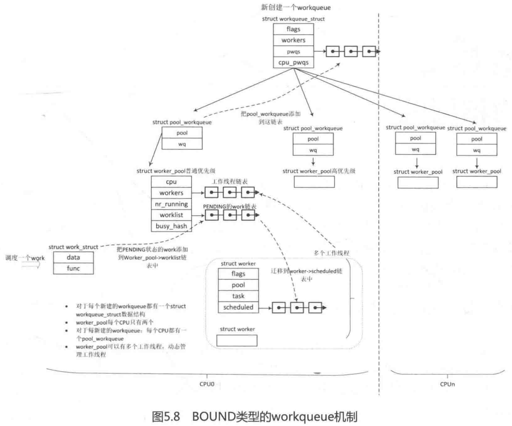

<!-- @import "[TOC]" {cmd="toc" depthFrom=1 depthTo=6 orderedList=false} -->

<!-- code_chunk_output -->

- [0 历史和原理概述](#0-历史和原理概述)
- [1 初始化工作队列](#1-初始化工作队列)
  - [1.1 工作任务 struct work\_struct](#11-工作任务-struct-work_struct)
  - [1.2 工作线程 struct worker](#12-工作线程-struct-worker)
  - [1.3 工作线程池 struct worker\_pool](#13-工作线程池-struct-worker_pool)
  - [1.4 连接 workqueue(工作队列)和 worker\-pool(工作线程池)的桥梁 struct pool\_workqueue](#14-连接-workqueue工作队列和-worker-pool工作线程池的桥梁-struct-pool_workqueue)
  - [1.5 工作队列 struct workqueue\_struct](#15-工作队列-struct-workqueue_struct)
  - [1.6 数据结构关系图](#16-数据结构关系图)
  - [1.7 系统初始化几个默认的 workqueue](#17-系统初始化几个默认的-workqueue)
    - [1.7.1 create\_worker()创建工作线程](#171-create_worker创建工作线程)
- [2 创建工作队列 workqueue](#2-创建工作队列-workqueue)
  - [2.1 \_\_alloc\_workqueue\_key 创建工作队列](#21-__alloc_workqueue_key-创建工作队列)
    - [2.1.1 pool\_workqueue 分配以及初始化函数 alloc\_and\_link\_pwqs()](#211-pool_workqueue-分配以及初始化函数-alloc_and_link_pwqs)
      - [2.1.1.1 BOUND 类型的 workqueue](#2111-bound-类型的-workqueue)
      - [2.1.1.2 ORDERED 类型和 UNBOUND 类型的 workqueue](#2112-ordered-类型和-unbound-类型的-workqueue)
- [3 调度一个 work](#3-调度一个-work)
  - [3.1 初始化一个 work](#31-初始化一个-work)
  - [3.2 schedule\_work()调度 work](#32-schedule_work调度-work)
  - [3.3 工作线程处理函数 worker\_thread()](#33-工作线程处理函数-worker_thread)
- [4 取消一个 work](#4-取消一个-work)
- [5 和调度器的交互](#5-和调度器的交互)
- [6 小结](#6-小结)
  - [6.1 背景和原理](#61-背景和原理)
  - [6.2 数据结构](#62-数据结构)

<!-- /code_chunk_output -->


思考题:

- workqueue 是运行在中断上下文, 还是进程上下文?其回调函数允许睡眠吗?
- 旧版本(Linux 2.6.25)的 workqueue 机制在实际过程中遇到了哪些问题和挑战?
- CMWQ 机制如何动态管理工作线程池的线程呢?
- 如果有多个 work 挂入一个工作线程中执行, 当某个 work 的回调函数执行了阻塞操作, 那么剩下的 work 该怎么办?

# 0 历史和原理概述

工作队列机制(workqueue)是除了软中断和 tasklet 以外最常用的一种下半部机制. 工作队列的**基本原理**是把**work(需要推迟执行的函数**)交由一个**内核线程**来执行, 它总是在**进程上下文**中执行. 工作队列的优点是利用**进程上下文**来执行**中断下半部操作**, 因此工作队列允许**重新调度**和**睡眠**, 是异步执行的**进程上下文**, 另外它还能解决**软中断**和**tasklet**执行时间过长导致**系统实时性下降**等问题.

当驱动程序或者内核子系统在进程上下文中有异步执行的工作任务时, 可以使用**work item**来描述工作任务, 包括该工作任务的执行回调函数, **把 work item 添加到一个队列**中, 然后**一个内核线程**会去执行这个**工作任务的回调函数**. 这里**work item 被称为工作**, **队列被称为 workqueue**, 即工作队列, **内核线程被称为 worker**.

工作队列最早是在 Linux 2.5.x 内核开发期间被引入的机制, 早期的工作队列的设计比较简单, 由**多线程(Multi threaded, 每个 CPU 默认一个工作线程**)和**单线程(Single threaded, 用户可以自行创建工作线程**)组成. 在长期测试中发现如下问题:

- **内核线程数量太多**. 虽然系统中有默认的一套工作线程(kevents), 但是有很多驱动和子系统喜欢自行创建工作线程, 例如调用 create\_workqueue()函数, 这样在大型系统(CPU 数量比较多的机器)中可能内核启动结束之后就耗尽了系统 PID 资源.
- **并发性比较差**. Multi threaded 的工作线程和 CPU 是一一绑定的, 例如 CPU0 上的某个工作线程有 A 、B 和 C 三个 work. 假设执行 work A 上回调函数时发生了睡眠和调度, CPU0 就会调度出去执行其他的进程, 对 于 B 和 C 来说, 它们只能等待 CPU0 重新调度执行该工作线程, 尽管其他 CPU 比较空闲, 也没有办法迁移到其他 CPU 上执行.
- **死锁问题**. 系统有一个默认的工作队列 kevents, 如果有很多 work 运行在默认的工作队列 kevents 上, 并且它们有一些数据上依赖关系, 那么很有可能会产生死锁. 解决办法是为每一个有可能产生死锁的 work 创建一个专职的工作线程, 这样又回到问题 1 了.

为此社区专家 Tejun Heo 在 Linux 2.6.36 中提出了一套解决方案**concurrency\-managed workqueues(CMWQ**).

执行**work 任务的线程**称为**worker**或**工作线程**. **工作线程**会**串行化地执行**挂入到队列中**所有的 work**. 如果队列中**没有 work**, 那么该**工作线程**就会变成**idle 状态**.

为了管理众多**工作线程**, CMWQ 提出了**工作线程池(worker\-pool**)概念, worker\-pool 有**两种**, 一是**BOUND 类型**的, 可以理解为**Per\-CPU 类型**, 每个 CPU 都有 worker\-pool; 另一种是**UNBOUND 类型**的, 即不和具体 CPU 绑定. 这**两种 worker\-pool**都会定义**两个线程池**, 一个给**普通优先级的 work**使用, 另一个给**高优先级的 work**使用. 这些工作线程池中的**线程数量**是**动态分配**和管理的, 而不是固定的. 当**工作线程睡眠**时, 会去检查是否需要唤醒更多的工作线程, 如有需要, 会去**唤醒同一个工作线程池中 idle 状态**的工作线程.

# 1 初始化工作队列

## 1.1 工作任务 struct work\_struct

**workqueue**机制**最小的调度单元是 work item**, 有的书中称为工作任务, 由 struct work\_struct 数据结构来抽象和描述, 本章简称为 work 或工作任务.

```c
[include/linux/workqueue.h]
struct work_struct {
	atomic_long_t data;
	struct list_head entry;
	work_func_t func;
};
```

struct work\_struct 数据结构定义比较简单.

- data 成员包括**两部分**, **低比特位部分**是 work 的**标志位**, **剩余的比特位**通常用于存放**上一次运行的 worker\_pool**的**ID 号**或**pool\_workqueue 的指针**,存放的内容由**WORK\_STRUCT\_PWQ 标志位来决定**.
- func 是工作任务的处理函数
- entry 用于把**work 挂到其他队列**上.

## 1.2 工作线程 struct worker

**work**运行在**内核线程**中, 这个**内核线程在代码中被称为 worker**, 类似流水线中的工人, work 类似工人的工作, 本章简称为**工作线程或 worker**.

**工作线程**用**struct worker**数据结构来描述:

```c
[kernel/workqueue_internal.h]
struct worker {
	/* on idle list while idle, on busy hash table while busy */
	union {
		struct list_head	entry;	/* L: while idle */
		struct hlist_node	hentry;	/* L: while busy */
	};

	struct work_struct	    *current_work;	/* L: work being processed */
	work_func_t		        current_func;	/* L: current_work's fn */
	struct pool_workqueue	*current_pwq;   /* L: current_work's pwq */
	struct list_head	    scheduled;	    /* L: scheduled works */
    struct list_head	    node;		    /* A: anchored at pool->workers */
						                    /* A: runs through worker->node */
	struct task_struct	    *task;		    /* I: worker task */
	struct worker_pool	    *pool;		    /* I: the associated pool */
	int			            id;		        /* I: worker id */
    ...
};
```

- current\_work: 当前**正在处理的 work**.
- current\_func: 当前**正在执行的 work 回调函数**.
- current\_pwq: 当前**work 所属的 pool\_workqueue**.
- scheduled: 所有被调度并正**准备执行的 work 都挂入该链表**中.
- task: 该**工作线程**的 task\_struct 数据结构.
- pool: 该工作线程所属的**worker\_pool**.
- id: 工作线程的**ID 号**.
- node: 可以把该 worker 挂入到**worker\_pool\->workers 链表**中.

## 1.3 工作线程池 struct worker\_pool

CMWQ 提出了**工作线程池**概念, 代码中使用 struct worker\_pool 数据结构来抽象和描述, 本章简称 worker\-pool 或者工作线程池.

简化后的**struct worker\_pool**数据结构如下:

```c
[kernel/workqueue.c]
struct worker_pool {
	spinlock_t		lock;		/* the pool lock */
	int			    cpu;		/* I: the associated cpu */
	int			    node;		/* I: the associated node ID */
	int			    id;		    /* I: pool ID */
	unsigned int	flags;		/* X: flags */

	struct list_head	worklist;	/* L: list of pending works */
	int			        nr_workers;	/* L: total number of workers */
	int			        nr_idle;	/* L: currently idle ones */

	struct list_head	idle_list;	/* X: list of idle workers */
	struct list_head	workers;	/* A: attached workers */
	struct workqueue_attrs	*attrs;		/* I: worker attributes */
	atomic_t		nr_running ____cacheline_aligned_in_smp;
	struct rcu_head		rcu;
	...
} ____cacheline_aligned_in_smp;
```

- lock: 用于**保护 worker\-pool 的自旋锁**.
- cpu: 对应**BOUND 类型**的**workqueue**来说, cpu 表示**绑定的 CPU ID**, 对应**UNBOUND 类型**, 该**值为\-1**.
- node: 对于**UNBOUND 类型的 workqueue**, node 表示该**worker\-pool 所属内存节点的 ID**编号.
- id: 该**worker\-pool 的 ID 号**.
- worklist: **pending 状态**的**work**会挂入**该链表**中.
- nr\_workers: **工作线程的数量**.
- nr\_idle: 处于**idle 状态**的**工作线程的数量**.
- idle\_list: 处于**idle 状态**的**工作线程(！！！**)会挂入**该链表**中.
- workers: 该 worker\-pool 管理的**工作线程**会挂入**该链表**中.
- attrs: **工作线程的属性**.
- nr\_running: **统计计数**, 用于管理**worker**的**创建和销毁**, 表示**正在运行中的 worker 数量**. 在**进程调度器**中**唤醒进程时(try\_to\_wake\_up**()), **其他 CPU**有可能会**同时访问该成员**, 该成员**频繁在多核之间读写**, 因此让**该成员独占一个缓冲行(！！！**), 避免**多核 CPU**在**读写该成员**时引发其他临近的成员"颠簸"现象, 这也是所谓的"**缓存行伪共享**"的问题.
- rcu: RCU 锁.

**worker\-pool 是 Per\-CPU**概念, 每个 CPU 都有 worker\-pool, 准确来说**每个 CPU 有两个 worker\-pool**, 一个用于**普通优先级的工作线程**, 另一个用于**高优先级的工作线程**.

```c
[kernel/workqueue.c]
/* the per-cpu worker pools */
static DEFINE_PER_CPU_SHARED_ALIGNED(struct worker_pool [NR_STD_WORKER_POOLS],
				     cpu_worker_pools);
```

## 1.4 连接 workqueue(工作队列)和 worker\-pool(工作线程池)的桥梁 struct pool\_workqueue

CMWQ 还定义了一个**pool\_workqueue**的数据结构, 它是**连接 workqueue 和 worker\-pool 的枢纽**.

```c
[kernel/workqueue.c]
struct pool_workqueue {
	struct worker_pool	    *pool;		/* I: the associated pool */
	struct workqueue_struct *wq;		/* I: the owning workqueue */
	int			            nr_active;	/* L: nr of active works */
	int			            max_active;	/* L: max active works */
	struct list_head	    delayed_works;	/* L: delayed works */
	struct rcu_head		    rcu;
	...
} __aligned(1 << WORK_STRUCT_FLAG_BITS);
```

其中, **WORK\_STRUCT\_FLAG\_BITS 为 8**, 因此 pool\_workqueue 数据结构是按照**256Byte 对齐**的, 这样方便把该**数据结构指针的 bit[8:31]位存放到 work\->data**中, work\->data 字段的**低 8 位**用于存放一些**标志位**, 见 set\_work\_pwq()和 get\_work\_pwq()函数.

- pool: 指向**worker\-pool 指针**.
- wq: 指向**所属的工作队列**.
- nr\_active: **活跃的 work 数量**.
- max\_active: **活跃的 work 最大数量**.
- delayed\_works: 链表头, 被**延迟执行的 works 可以挂入该链表**.
- rcu: rcu 锁.

## 1.5 工作队列 struct workqueue\_struct

系统中**所有的工作队列**, 包括系统**默认的工作队列**, 例如 system\_wq 或 system\_highpri\_wq 等, 以及驱动开发者新创建的工作队列, 它们**共享一组 worker\-pool**. 而对于**BOUND 类型的工作队列**, **每个 CPU**只有**两个工作线程池**, **每个工作线程池**可以和**多个 workqueue**对应, **每个 workqueue**也**只能对应这几个工作线程池**.

**工作队列**由 struct **workqueue\_struct**数据结构来描述:

```c
[kernel/workqueue.c]
struct workqueue_struct {
	struct list_head	pwqs;		/* WR: all pwqs of this wq */
	struct list_head	list;		/* PL: list of all workqueues */

	struct list_head	maydays;	/* MD: pwqs requesting rescue */
	struct worker		*rescuer;	/* I: rescue worker */

	struct workqueue_attrs	*unbound_attrs;	/* WQ: only for unbound wqs */
	struct pool_workqueue	*dfl_pwq;	/* WQ: only for unbound wqs */

	char			name[WQ_NAME_LEN]; /* I: workqueue name */

	/* hot fields used during command issue, aligned to cacheline */
	unsigned int		flags ____cacheline_aligned; /* WQ: WQ_* flags */
	struct pool_workqueue __percpu *cpu_pwqs; /* I: per-cpu pwqs */
	...
};
```

- pwqs: **所有的 pool\-workqueue**数据结构都**挂入链表**中.
- list: **链表节点**. 系统定义一个**全局的链表 workqueues**, **所有的 workqueue**挂入**该链表**.
- maydays: **所有 rescue 状态**下的**pool\-workqueue**数据结构**挂入该链表**.
- rescuer: **rescue 内核线程**. **内存紧张**时**创建新的工作线程**可能会失败, 如果**创建 workqueue**时设置了**WQ\_MEM\_RECLAIM**标志位, 那么**rescuer 线程会接管这种情况**.
- unbound attrs: **UNBOUND 类型属性**.
- dfl\_pwq: 指向**UNBOUND 类型的 pool\_workqueue**.
- name: 该**workqueue 的名字**.
- flags: 标志位经常被**不同 CPU 访问**, 因此要和**cache line 对齐**. 标志位包括 WQ\_UNBOUND、WQ\_HIGHPRI、WQ\_FREEZABLE 等.
- cpu\_pwqs: 指向**Per\-CPU 类型**的**pool workqueue**.

## 1.6 数据结构关系图

**一个 work 挂入 workqueue**中, 最终还要**通过 worker\-pool**中的**工作线程来处理其回调函数**, worker-pool 是**系统共享的(！！！**), 因此**workqueue**需要查找到一个**合适的 worker\-pool**, 然后从 worker\-pool 中分派一个**合适的工作线程**, pool\_workqueue 数据结构在其中起到**桥梁**作用. 这有些类似 IT 类公司的人力资源池的概念, 具体关系如图 5.7 所示.


- **work\_struct**结构体代表的是**一个任务**, 它指向一个待异步执行的函数, 不管驱动还是子系统什么时候要执行这个函数, 都必须把**work**加入到一个**workqueue**.

- **worker**结构体代表一个**工作者线程(worker thread**), 它主要**一个接一个的执行挂入到队列中的 work**, 如果没有 work 了, 那么工作者线程就挂起, 这些工作者线程被 worker\-pool 管理.

对于**驱动和子系统**的开发人员来说, 接触到的**只有 work**, 而背后的处理机制是管理 worker\-pool 和处理挂入的 work.

- **worker\_pool**结构体用来**管理 worker**, 对于**每一种 worker pool**都分**两种情况**: 一种是处理**普通 work**, 另一种是处理**高优先级的 work**.

- **workqueue\_struct**结构体代表的是**工作队列**, 工作队列分**unbound workqueue**和**bound workqueue**. bound workqueue 就是**绑定到 cpu**上的, **挂入到此队列中的 work**只会在**相对应的 cpu**上运行. **unbound workqueue 不绑定到特定的 cpu**, 而且**后台线程池的数量也是动态**的, 具体**workqueue 关联到哪个 worker pool**, 这是由**workqueue\_attrs 决定**的.

## 1.7 系统初始化几个默认的 workqueue

总结:

(1) 创建一个**pool\_workqueue 结构的 slab 缓存对象**, workqueue 针对 NUMA 系统做一些初始化

(2) 为**所有可用 CPU(！！！包括离线的！！！**)创建**两个工作线程池**struct worker\_pool(**普通优先级**的和**高优先级**的)并初始化

(3) 为**每个在线 CPU(！！！**)的**每个工作线程池(每个 CPU 有两个**)分别创建**一个工作线程**(调用**create\_worker**(), 详细见下面)

(4) 创建**UNBOUND 类型**和**ordered 类型**的**workqueue 属性**, 分别是**两个**, 对应**普通优先级**和**高优先级**, 可以供后续使用

(5) 调用**alloc\_workqueue**(), 创建几个**默认的 workqueue**

在**系统启动**时, 会通过**init\_workqueues**()函数来**初始化几个系统默认的 workqueue**.

```c
[kernel/workqueue.c]
// per cpu 的 pool 数目
NR_STD_WORKER_POOLS	= 2,		/* # standard pools per cpu */

/* I: attributes used when instantiating standard unbound pools on demand */
static struct workqueue_attrs *unbound_std_wq_attrs[NR_STD_WORKER_POOLS];

/* I: attributes used when instantiating ordered pools on demand */
static struct workqueue_attrs *ordered_wq_attrs[NR_STD_WORKER_POOLS];

static int __init init_workqueues(void)
{
	int std_nice[NR_STD_WORKER_POOLS] = { 0, HIGHPRI_NICE_LEVEL };
	int i, cpu;
    // 位置 1
	pwq_cache = KMEM_CACHE(pool_workqueue, SLAB_PANIC);

	cpu_notifier(workqueue_cpu_up_callback, CPU_PRI_WORKQUEUE_UP);
	hotcpu_notifier(workqueue_cpu_down_callback, CPU_PRI_WORKQUEUE_DOWN);
    // 位置 2
	wq_numa_init();

	/* initialize CPU pools */
	// 位置 3
	for_each_possible_cpu(cpu) {
		struct worker_pool *pool;

		i = 0;
		// 位置 4
		for_each_cpu_worker_pool(pool, cpu) {
			BUG_ON(init_worker_pool(pool));
			pool->cpu = cpu;
			cpumask_copy(pool->attrs->cpumask, cpumask_of(cpu));
			pool->attrs->nice = std_nice[i++];
			pool->node = cpu_to_node(cpu);

			/* alloc pool ID */
			mutex_lock(&wq_pool_mutex);
			BUG_ON(worker_pool_assign_id(pool));
			mutex_unlock(&wq_pool_mutex);
		}
	}

	/* create the initial worker */
	// 位置 5
	for_each_online_cpu(cpu) {
		struct worker_pool *pool;

		for_each_cpu_worker_pool(pool, cpu) {
			pool->flags &= ~POOL_DISASSOCIATED;
			BUG_ON(!create_worker(pool));
		}
	}
    // 位置 6
	/* create default unbound and ordered wq attrs */
	for (i = 0; i < NR_STD_WORKER_POOLS; i++) {
		struct workqueue_attrs *attrs;

		BUG_ON(!(attrs = alloc_workqueue_attrs(GFP_KERNEL)));
		attrs->nice = std_nice[i];
		unbound_std_wq_attrs[i] = attrs;

		BUG_ON(!(attrs = alloc_workqueue_attrs(GFP_KERNEL)));
		attrs->nice = std_nice[i];
		attrs->no_numa = true;
		ordered_wq_attrs[i] = attrs;
	}
    // 位置 7
	system_wq = alloc_workqueue("events", 0, 0);
	system_highpri_wq = alloc_workqueue("events_highpri", WQ_HIGHPRI, 0);
	system_long_wq = alloc_workqueue("events_long", 0, 0);
	system_unbound_wq = alloc_workqueue("events_unbound", WQ_UNBOUND,
					    WQ_UNBOUND_MAX_ACTIVE);
	system_freezable_wq = alloc_workqueue("events_freezable",
					      WQ_FREEZABLE, 0);
	system_power_efficient_wq = alloc_workqueue("events_power_efficient",
					      WQ_POWER_EFFICIENT, 0);
	system_freezable_power_efficient_wq = alloc_workqueue("events_freezable_power_efficient",
					      WQ_FREEZABLE | WQ_POWER_EFFICIENT,
					      0);
	return 0;
}
early_initcall(init_workqueues);
```

位置 1, 创建一个**pool\_workqueue**数据结构的**slab 缓存对象**.

位置 2, **workqueue**考虑了**NUMA 系统**情况的一些特殊处理.

位置 3, 为系统中**所有可用的 CPU**(cpu\_possible\_mask) 分别**创建 struct worker\_pool 数据结构**.

位置 4, for\_each\_cpu\_worker\_pool()为**每个 CPU**创建**两个 worker\_pool**, 一个是**普通优先级**的工作线程池, 另一个是**高优先级**的工作线程池, **init\_worker\_pool**()函数用于**初始化一个 worker\_pool**. 这里初始化的都是 BOUND 类型的 worker\_pool, 所以 worker\_pool\-\>cpu 都相应设置了; node 都设置成为了当前 cpu 所属的内存节点

注意位置 4 的**for\_each\_cpu\_worker\_pool**宏**遍历 CPU 中两个 worker\_pool**:

```c
[kernel/workqueue.c]
#define for_each_cpu_worker_pool(pool, cpu)				\
	for ((pool) = &per_cpu(cpu_worker_pools, cpu)[0];		\
	     (pool) < &per_cpu(cpu_worker_pools, cpu)[NR_STD_WORKER_POOLS]; \
	     (pool)++)
```

位置 5, 为系统每一个**在线(online)CPU**中的**每个 worker\_pool**分别**创建一个工作线程**.

位置 6, 创建**UNBOUND 类型**和**ordered 类型的 workqueue 属性**, **ordered 类型**的**workqueue**表示**同一个时刻只能有一个 work item 在运行(！！！**).

位置 7 到最后, **创建系统默认的 workqueue**, 这里使用**创建工作队列**的 API 函数**alloc\_workqueue**().

- **普通优先级 BOUND 类型**的**工作队列 system\_wq**, 名称为"**events**", 可以理解为**默认工作队列**.
- **高优先级 BOUND 类型**的工作队列**system\_highpri\_wq** , 名称为"**events\_highpri**".
- **UNBOUND 类型**的工作队列**system\_unbound\_wq**, 名称为"**system\_unbound\_wq**".
- **Freezable 类型**的工作队列**system\_freezable\_wq**, 名称为"**events\_freezable**".
- **省电类型**的工作队列**system\_freezable\_wq**, 名称为 "**events\_power\_efficient**".

### 1.7.1 create\_worker()创建工作线程

总结:

(1) 获取一个**ID**

(2) **工作线程池对应的内存节点**分配一个**worker**

(3) 在**工作线程池对应的内存节点**上创建一个**内核线程给分配的 worker**, 执行函数为**worker\_thread**, 参数为**worker(struct worker**), 内核线程名字是"**kworker/u \+ CPU\_ID \+ : \+ worker\_idH**", 高优先级的才有 H, UNBOUND 类型的才有 u

(4) 设置**线程(worker\->task\->flags**)的**PF\_NO\_SETAFFINITY**标志位, **防止修改 CPU 亲和性**

(5) 将创建的**worker 挂到 worker\_pool**: **线程池**如果**没有绑定到某个 CPU**, 那么设置**worker 不绑定 CPU**, 可在任意 CPU 上运行; 将**worker**加到**工作线程池的 workers 链表**

(6) 使**worker 进入 idle 状态**

(7) **唤醒 worker 的内核线程**

(8) 返回该 worker

上面位置 5, 会为**每个 online 的 CPU**的**每个 worker\_pool**分别创建**一个工作线程**.

下面来看**create\_worker**()函数是如何创建工作线程的.

```c
[init_workqueues()->create_worker()]
static struct worker *create_worker(struct worker_pool *pool)
{
	struct worker *worker = NULL;
	int id = -1;
	char id_buf[16];
    // 位置 1
	/* ID is needed to determine kthread name */
	id = ida_simple_get(&pool->worker_ida, 0, 0, GFP_KERNEL);
    // 位置 2
	worker = alloc_worker(pool->node);

	worker->pool = pool;
	worker->id = id;
    // 位置 3
	if (pool->cpu >= 0)
		snprintf(id_buf, sizeof(id_buf), "%d:%d%s", pool->cpu, id,
			 pool->attrs->nice < 0  ? "H" : "");
	else
		snprintf(id_buf, sizeof(id_buf), "u%d:%d", pool->id, id);
    // 位置 4
	worker->task = kthread_create_on_node(worker_thread, worker, pool->node,
					      "kworker/%s", id_buf);

	set_user_nice(worker->task, pool->attrs->nice);

	/* prevent userland from meddling with cpumask of workqueue workers */
	// 位置 5
	worker->task->flags |= PF_NO_SETAFFINITY;

	/* successful, attach the worker to the pool */
	// 位置 6
	worker_attach_to_pool(worker, pool);

	/* start the newly created worker */
	spin_lock_irq(&pool->lock);
	// 位置 7
	worker->pool->nr_workers++;
	// 位置 8
	worker_enter_idle(worker);
	// 位置 9
	wake_up_process(worker->task);
	spin_unlock_irq(&pool->lock);

	return worker;
}
```

位置 1, 通过**IDA 子系统**获取一个**ID 号**.

位置 2, 在**worker\_pool**对应的**内存节点中分配一个 worker**数据结构.

位置 3 到位置 4 之间, **pool\->cpu \>= 0**, 表示**BOUND 类型的工作线程**. worker 的名字一般是 "**kworker/ \+ CPU\_ID \+ worker\_id**", 如果属于**高优先级**类型的 workqueue, 即**nice 值小于 0**, 那么还要**加上"H**".  **pool\->cpu \< 0**, 表示**UNBOUND 类型的工作线程**, 名字为"**kworker/u + CPU\_ID + worker\_id**".

位置 4, 通过**kthread\_create\_on\_node**()函数在**工作线程池对应的 node！！！**中**创建一个内核线程用于 worker**, 在这个内存节点上分配该内核线程相关的 struct task\_struct 等数据结构.

注意, **线程执行函数为 worker\_thread！！！worker(struct worker)是执行函数的参数, 在工作线程池对应的 node 上创建, 线程名是位置 3 设置的！！！**

位置 5, 设置**工作线程(task 的 flags！！！**)的**PF\_NO\_SETAFFINITY**标志位, **防止用户程序修改其 CPU 亲和性**. 在**位置 6**代码中会设置**这个 worker 允许运行的 cpumask(！！！**).

位置 6, **worker\_attach\_to\_pool**()函数把刚分配的**工作线程**挂入**worker\_pool**中.

```c
[create_worker() ->worker_attach_to_pool()]
static void worker_attach_to_pool(struct worker *worker,
				   struct worker_pool *pool)
{
	mutex_lock(&pool->attach_mutex);
	set_cpus_allowed_ptr(worker->task, pool->attrs->cpumask);

	if (pool->flags & POOL_DISASSOCIATED)
		worker->flags |= WORKER_UNBOUND;

	list_add_tail(&worker->node, &pool->workers);
	mutex_unlock(&pool->attach_mutex);
}
```

**worker\_attach\_to\_pool**()函数最主要的工作是将**该 worker 工作线程**加入**worker\_pool\->workers 链表**中.

**POOL\_DISASSOCIATED**是**worker\-pool(工作线程池使用的！！！)内部使用的标志位**, **一个线程池**可以是**associated**状态或**disassociated**状态. associated 状态的**线程池**表示有**绑定到某个 CPU**上, disassociated 状态的**线程池**表示**没有绑定某个 CPU**, 也有可能是**绑定的 CPU 被 offline(！！！**)了, 因此可以在**任意 CPU 上运行(！！！**).

回到 create\_worker()函数中, 位置 7 代码中的**nr\_workers**统计该**worker\_pool 中的工作线程的个数**. 注意这里 nr\_workers 变量需要用**spinlock 锁**来保护, 因为**每个 worker\_pool**定义了一个**timer**, 用于**动态删除过多的空闲的 worker(！！！**), 见**idle\_worker\_timeout**()函数.

位置 8, worker\_enter\_idle()函数**让该工作线程进入 idle 状态**.

位置 9, wake\_up\_process()函数**唤醒该工作线程**.

# 2 创建工作队列 workqueue

创建工作队列 API 有很多, 并且基本上和旧版本的 workqueue 兼容.

```c
[include/linux/workqueue.h]
#define alloc_workqueue(fmt, flags, max_active, args...)		\
	__alloc_workqueue_key((fmt), (flags), (max_active),		\
			      NULL, NULL, ##args)

#define alloc_ordered_workqueue(fmt, flags, args...)			\
	alloc_workqueue(fmt, WQ_UNBOUND | __WQ_ORDERED | (flags), 1, ##args)

#define create_workqueue(name)						\
	alloc_workqueue("%s", WQ_MEM_RECLAIM, 1, (name))
#define create_freezable_workqueue(name)				\
	alloc_workqueue("%s", WQ_FREEZABLE | WQ_UNBOUND | WQ_MEM_RECLAIM, \
			1, (name))
#define create_singlethread_workqueue(name)				\
	alloc_ordered_workqueue("%s", WQ_MEM_RECLAIM, name)
```

最常见是**alloc\_workqueue**(), 有 3 个参数, 分别是**name, flags 和 max\_active**. 其他 API 和该 API 类似, **只是调用的 flags 不相同(！！！**).

(1) **WQ\_UNBOUND**: **工作任务 work**会加入**UNBOUND 工作队列**中, UNBOUND 工作队列的**工作线程没有绑定到具体的 CPU**上. UNBOUND 类型的 work**不需要额外的同步管理**, UNBOUND 工作线程池会尝试尽快执行它的 work. **这类 work 会牺牲一部分性能**(局部原理带来的性能提升), 但是比较适用于如下场景.

- **一些应用**会**在不同的 CPU 上跳跃**, 这样如果**创建 Bound 类型的工作队列**, 会创建**很多没用的工作线程**.
- **长时间运行**的**CPU 消耗类型的应用**(标记**WQ\_CPU\_INTENSIVE 标志位**)通常会创建 UNBOUND 类型的 workqueue, **进程调度器**会管理这类工作线程在**哪个 CPU**上运行.

(2) **WQ\_FREEZABLE**: 一个标记着 WQ\_FREEZABLE 的工作队列会参与到**系统的 suspend 过程**中, 这会让**工作线程**处理完成**当前所有的 work**才完成**进程冻结**, 并且这个过程**不会再新开始一个 work**的执行, 直到**进程被解冻**.

(3) **WQ\_MEM\_RECLAIM**: 当**内存紧张**时, 创建**新的工作线程可能会失败**, 系统还有一个**rescuer 内核线程**会去接管这种情况.

(4) **WQ\_HIGHPRI**: 属于**高优先级的 worker\-pool**, 即比较**低的 nice 值**.

(5) **WQ\_CPU\_INTENSIVE**: 属于**特别消耗 CPU 资源**的一类 work, 这类 work 的执行会得到**系统进程调度器的监管**. 排在这类 work 后面的**non\-CPU\-intensive 类型**的 work 可能会**推迟执行**.

(6) \_\_**WQ\_ORDERED**: 表示**同一个时间只能执行一个 work item**.

参数**max\_active**也值得关注, 它决定**每个 CPU 最多可以有多少个 work**挂入一个**工作队列**中. 例如**max\_active=16**, 说明**每个 CPU 最多可以有 16 个 work**挂入到**工作队列中执行(！！！**).

- 通常对于**BOUND 类型**的工作队列, **max\_active**最大可以是**512**, 如果**max\_active**参数传入**0**, 则表示指定为**256**.
- 对于**UNBOUND 类型**工作队列, max\_active 可以取**512**和**4 \* num\_possible\_cpus**()之间的**最大值**.

通常建议**驱动开发**者使用**max\_active=0**作为参数, 有些驱动开发者希望使用一个**严格串行执行**的**工作队列**, **alloc\_ordered\_workqueue**()API 可以满足这方面的需求, 这里使用**max\_active=1**和**WQ\_UNBOUND**的组合, **同一时刻只有一个 work 可以执行**.

## 2.1 \_\_alloc\_workqueue\_key 创建工作队列

总结:

(1) 分配一个 workqueue\_struct 并初始化

(2) 对于 UNBOUND 类型, 创建一个 UNBOUND 类型的 workqueue 属性

(3) BOUND 类型的 workqueue,

```c
[kernel/workqueue.c]
struct workqueue_struct *__alloc_workqueue_key(const char *fmt,
					       unsigned int flags,
					       int max_active,
					       struct lock_class_key *key,
					       const char *lock_name, ...)
{
	size_t tbl_size = 0;
	va_list args;
	struct workqueue_struct *wq;
	struct pool_workqueue *pwq;

	/* see the comment above the definition of WQ_POWER_EFFICIENT */
	// 位置 1
	if ((flags & WQ_POWER_EFFICIENT) && wq_power_efficient)
		flags |= WQ_UNBOUND;

	/* allocate wq and format name */
	if (flags & WQ_UNBOUND)
		tbl_size = nr_node_ids * sizeof(wq->numa_pwq_tbl[0]);
    // 位置 2
	wq = kzalloc(sizeof(*wq) + tbl_size, GFP_KERNEL);
	if (!wq)
		return NULL;
    // 位置 3
	if (flags & WQ_UNBOUND) {
		wq->unbound_attrs = alloc_workqueue_attrs(GFP_KERNEL);
		if (!wq->unbound_attrs)
			goto err_free_wq;
	}

	va_start(args, lock_name);
	vsnprintf(wq->name, sizeof(wq->name), fmt, args);
	va_end(args);

	max_active = max_active ?: WQ_DFL_ACTIVE;
	max_active = wq_clamp_max_active(max_active, flags, wq->name);

	/* init wq */
	wq->flags = flags;
	wq->saved_max_active = max_active;
	mutex_init(&wq->mutex);
	atomic_set(&wq->nr_pwqs_to_flush, 0);
	INIT_LIST_HEAD(&wq->pwqs);
	INIT_LIST_HEAD(&wq->flusher_queue);
	INIT_LIST_HEAD(&wq->flusher_overflow);
	INIT_LIST_HEAD(&wq->maydays);

	lockdep_init_map(&wq->lockdep_map, lock_name, key, 0);
	INIT_LIST_HEAD(&wq->list);

	if (alloc_and_link_pwqs(wq) < 0)
		goto err_free_wq;
```

位置 1, **WQ\_POWER\_EFFICIENT**标志位考虑**系统的功耗**问题.

- 对于**BOUND 类型的 workqueue**, 它是**Per\-CPU 类型**的, 会**利用 cache 的局部性原理来提高性能**. 也就是说, 它**不会从这个 CPU 迁移**到另外一个 CPU, 也**不希望进程调度器来打扰**它们.
- 设置成**UNBOUND 类型的 workqueue**后, 究竟选择**哪个 CPU 上唤醒**交由**进程调度器决定**.

**Per\-CPU 类型**的**workqueue**会让**idle 状态的 CPU 从 idle 状态唤醒**, 从而增加了功耗. 如果系统配置了**CONNG\_WQ\_POWER\_EFFICIENT\_DEFAULT 选项**, 那么创建**workqueue**会把标记了**WQ\_POWER\_EFFIOENT**的**workqueue**设置成**UNBOUND 类型**, 这样**进程调度器**就可以参与**选择 CPU**来执行.

```c
[kernel/workqueue.c]
#ifdef CONFIG_WQ_POWER_EFFICIENT_DEFAULT
static bool wq_power_efficient = true;
#else
static bool wq_power_efficient;
#endif
```

位置 2 以及后面, 是分配一个**workqueue\_struct**数据结构并初始化.

位置 3, 对于**UNBOUND 类型**, 创建一个 UNBOUND 类型的**workqueue 属性**

### 2.1.1 pool\_workqueue 分配以及初始化函数 alloc\_and\_link\_pwqs()

接下来看**pool\_workqueue 分配**以及初始化

#### 2.1.1.1 BOUND 类型的 workqueue

总结:

(1) 给**每个 CPU**分配一个**Per\-CPU**的**pool\_workqueue**

(2) **遍历每个 CPU**, 通过 CPU 的这个**pool\_workqueue**将**系统静态定义的 Per\-CPU 类型的高优先级 worker\_pool(也就是 init\_workqueues()初始化的)**和**传入的 workqueue 连接**起来, 并将**这个 pool\_workqueue**添加到传入的**workqueue\->pwqs 链表**.

```c
[alloc_workqueue() ->alloc_and_link_pwqs()]
[kernel/workqueue.c]
static int alloc_and_link_pwqs(struct workqueue_struct *wq)
{
	bool highpri = wq->flags & WQ_HIGHPRI;
	int cpu, ret;
    // 位置 1
	if (!(wq->flags & WQ_UNBOUND)) {
	    // 为每个 CPU 分配一个 Per-CPU 类型的 pool_workqueue
		wq->cpu_pwqs = alloc_percpu(struct pool_workqueue);
		// 遍历所有可用 CPU
		for_each_possible_cpu(cpu) {
		    // 得到当前 CPU 的 pool_workqueue
			struct pool_workqueue *pwq =
				per_cpu_ptr(wq->cpu_pwqs, cpu);
			// 得到当前 CPU 的 worker_pool
			struct worker_pool *cpu_pools =
				per_cpu(cpu_worker_pools, cpu);
            // 通过当前 CPU 的 pool_workqueue 将当前 CPU 的高优先级 worker_pool 和传入的 workqueue 连接起来
			init_pwq(pwq, wq, &cpu_pools[highpri]);

			mutex_lock(&wq->mutex);
			// 将当前 CPU 的 pool_workqueue 加到传入的 workqueue->pwqs 链表
			link_pwq(pwq);
			mutex_unlock(&wq->mutex);
		}
		return 0;
	// 位置 2
	} else if (wq->flags & __WQ_ORDERED) {
		ret = apply_workqueue_attrs(wq, ordered_wq_attrs[highpri]);
		/* there should only be single pwq for ordering guarantee */
		WARN(!ret && (wq->pwqs.next != &wq->dfl_pwq->pwqs_node ||
			      wq->pwqs.prev != &wq->dfl_pwq->pwqs_node),
		     "ordering guarantee broken for workqueue %s\n", wq->name);
		return ret;
	// 位置 3
	} else {
		return apply_workqueue_attrs(wq, unbound_std_wq_attrs[highpri]);
	}
}
```

位置 1 的整个 if, 处理**BOUND 类型的 workqueue**. 给**每个 CPU**分配一个**Per\-CPU**的**pool\_workqueue**, **遍历每个 CPU**, 通过 CPU 的这个**pool\_workqueue**将**系统静态定义的 Per\-CPU 类型的高优先级的 worker\_pool(也就是 init\_workqueues()初始化的)**和**传入的 workqueue 连接**起来, 并将**这个 pool\_workqueue**添加到传入的**workqueue\->pwqs 链表**.

cpu\_pwqs 是一个 Per\-CPU 类型的指针, **alloc\_percpu**()为**每个 CPU 分配一个 Per\-CPU 类型的 pool\_workqueue**数据结构.

**cpu\_worker\_pools**是**系统静态定义的 Per\-CPU 类型**的**worker\_pool 数据结构**, **wq\->cpu\_pwqs**是**动态分配**的**Per\-CPU 类型的 pool\_workqueue**数据结构.

**init\_pwq**()函数把**这两个数据结构连接起来**, 即**pool\_workqueue\->pool**指向**worker\_pool**数据结构, **pool\_workqueue\->wq**指向**workqueue\_struct**数据结构.

**link\_pwq()函数**主要是把**pool\_workqueue**添加到**workqueue\_struct\->pwqs 链表**中.

位置 2 和位置 3 处理**ORDERED 类型**和**UNBOUND 类型**的 workqueue

#### 2.1.1.2 ORDERED 类型和 UNBOUND 类型的 workqueue

总结:

都通过调用**apply\_workqueue\_attrs**()函数来实现, 出入的 workqueue\_attrs 属性参数不同, 一个是**ordered\_wq\_attrs[highpri**], 一个是**unbound\_std\_wq\_attrs[highpri**], 这两个不同之处在于属性里面的 no\_numa 在 ordered 中是 true, 这些都是在**系统初始化 init\_workqueues()阶段完成**的

(1) 通过系统全局哈希表 unbound\_pool\_hash(管理所有 UNBOUND 类型的 work\_pool)根据属性查找 worker\_pool, 找到将其引用计数加 1, 并返回, 没有的话重新分配并初始化一个(创建 pool, 为 pool 创建一个工作线程 worker<会唤醒线程>), 将新 pool 加入哈希表

(2) 分配一个**pool\_workqueue**

(3) 初始化该 pwq, 将 worker\_pool 和 workqueue\_struct 连接起来, 为 pool\_workqueue 初始化一个工作 work(通过 INIT\_WORK()), 回调函数是 pwq\_unbound\_release\_workfn(), 该 work 执行: 从 work 中找到相应的 pwq, 该 work 只对 UNBOUND 类型的 workqueue 有效, 如果 work\-\>pwq\-\>wq\-\>pwqs(所有 pool\_workqueue 都在这个链表)中当前 pool\_workqueue 是最后一个, 释放 pool\_workqueue 相关结构

执行代码片段如下:

```c
[alloc_workqueue() -> alloc_and_link_pwqs() -> apply_workqueue_attrs()]
int apply_workqueue_attrs(struct workqueue_struct *wq,
			  const struct workqueue_attrs *attrs)
{
	struct workqueue_attrs *new_attrs, *tmp_attrs;
	struct pool_workqueue **pwq_tbl, *dfl_pwq;
	int node, ret;
    // 分配 pool_workqueue
	pwq_tbl = kzalloc(nr_node_ids * sizeof(pwq_tbl[0]), GFP_KERNEL);

	mutex_lock(&wq_pool_mutex);
    // 查找或新建一个 pool_workqueue
	dfl_pwq = alloc_unbound_pwq(wq, new_attrs);

	for_each_node(node) {
		dfl_pwq->refcnt++;
		pwq_tbl[node] = dfl_pwq;
	}

	mutex_unlock(&wq_pool_mutex);

    mutex_lock(&wq->mutex);

	/* save the previous pwq and install the new one */
	for_each_node(node)
		pwq_tbl[node] = numa_pwq_tbl_install(wq, node, pwq_tbl[node]);

	/* @dfl_pwq might not have been used, ensure it's linked */
	link_pwq(dfl_pwq);
	swap(wq->dfl_pwq, dfl_pwq);

	mutex_unlock(&wq->mutex);

	/* put the old pwqs */
	for_each_node(node)
	    // 位置 1
		put_pwq_unlocked(pwq_tbl[node]);
	put_pwq_unlocked(dfl_pwq);

	put_online_cpus();
	ret = 0;
	return ret;
}
```

首先分配一个**pool\_workqueue**数据结构, 然后调用**alloc\_unbound\_pwq**()来**查找或新建一个 pool\_workqueue**.

```c
[apply_workqueue_attrs() ->alloc_unbound_pwq()]
[kernel/workqueue.c]
static struct pool_workqueue *alloc_unbound_pwq(struct workqueue_struct *wq,
					const struct workqueue_attrs *attrs)
{
	struct worker_pool *pool;
	struct pool_workqueue *pwq;
    // 查找相同属性的 worker_pool
	pool = get_unbound_pool(attrs);
    // 给 pool_workqueue 分配内存
	pwq = kmem_cache_alloc_node(pwq_cache, GFP_KERNEL, pool->node);
	init_pwq(pwq, wq, pool);
	// 返回 pool_workqueue
	return pwq;
}
```

首先通过**get\_unbound\_pool**()去系统中**查找有没有相同属性的 worker\_pool**.

```c
[kernel/workqueue.c]
static struct worker_pool *get_unbound_pool(const struct workqueue_attrs *attrs)
{
    // 根据 attrs 计算对应的散列值
	u32 hash = wqattrs_hash(attrs);
	struct worker_pool *pool;
	int node;

	/* do we already have a matching pool? */
	// 从全局散列表 unbound_pool_hash 中, 根据 attrs 对比找到存在的 worker_pool, 找到就返回
	hash_for_each_possible(unbound_pool_hash, pool, hash_node, hash) {
		if (wqattrs_equal(pool->attrs, attrs)) {
			pool->refcnt++;
			return pool;
		}
	}
    // 走到这一步说明没有找到存在的 worker_pool, 那么下面就得新创建一个
	/* nope, create a new one */
	// 创建一个 worker_pool
	pool = kzalloc(sizeof(*pool), GFP_KERNEL);

    lockdep_set_subclass(&pool->lock, 1);   /* see put_pwq() */
    // copy 属性给 worker_pool
    copy_workqueue_attrs(pool->attrs, attrs);

    /*
     * no_numa isn't a worker_pool attribute, always clear it.  See
     * 'struct workqueue_attrs' comments for detail.
     */
    pool->attrs->no_numa = false;

	if (worker_pool_assign_id(pool) < 0)
		goto fail;

	/* create and start the initial worker */
	// 创建工作者线程
	if (!create_worker(pool))
		goto fail;

	/* install */
	// 加入到全局 unbound_pool_hash 散列表中
	hash_add(unbound_pool_hash, &pool->hash_node, hash);

	return pool;
fail:
	if (pool)
		put_unbound_pool(pool);
	return NULL;
}
```

系统定义了一个**哈希表 unbound\_pool\_hash(！！！**), 用于**管理系统中所有的 UNBOUND 类型的 worker\_pool**, 通过**wqattrs\_equal**()判断系统中**是否己经有了类型相关的 worker\_pool**, **wqattrs\_equal**()函数首先会**比较 nice 值**, 然后**比较 cpumask 位图是否一致**.

如果哈希表有**worker\_pool**, 那将**该 pool 引用计数加 1**, 并**返回该 pool**

如果哈希表**没有**, 那就**重新分配和初始化一个(创建 pool, 为该 pool 创建一个 worker<会唤醒线程>, 将当前 pool 加入到哈希表**), 最后**返回新建的 pool**.

回到**alloc\_unbound\_pwq**()函数中, 找到**worker\_pool**后**还需要一个连接器 pool\_workqueue**, 最后通过**init\_pwq**()函数把**worker\_pool**和**workqueue\_struct 串联**起来.

回到 apply\_workqueue\_attrs()函数中的 numa\_pwq\_tbl\_install()函数.

```c
[kernel/workqueue.c]
static struct pool_workqueue *numa_pwq_tbl_install(struct workqueue_struct *wq,
						   int node,
						   struct pool_workqueue *pwq)
{
	struct pool_workqueue *old_pwq;

	lockdep_assert_held(&wq->mutex);

	/* link_pwq() can handle duplicate calls */
	link_pwq(pwq);

	old_pwq = rcu_access_pointer(wq->numa_pwq_tbl[node]);
	rcu_assign_pointer(wq->numa_pwq_tbl[node], pwq);
	return old_pwq;
}
```

**link\_pwq**()把找到的**pool\_workqueue**添加到**workqueue\_struct\->pwqs 链表**中.

接下来利用**RCU 锁机制**来保护**pool\_workqueue 数据结构**, 首先 old\_pwq 和 pwq\_tbl\[node\]指向 wq\->numa\_pwq\_tbl\[node\]中旧的数据, rcu\_assign\_pointer()之后 wq\->numa\_pwq\_tbl[node]指针指向新的数据. 那 RCU 什么时候会删除旧数据呢?看 apply\_workqueue\_attrs()函数位置 1 处的代码, 其中参数**pwq\_tbl\[node\]指向旧数据**.

```c
[put_pwq_unlocked() ->put_pwq()]
[kernel/workqueue.c]
static void put_pwq(struct pool_workqueue *pwq)
{
	lockdep_assert_held(&pwq->pool->lock);
	if (likely(--pwq->refcnt))
		return;
	if (WARN_ON_ONCE(!(pwq->wq->flags & WQ_UNBOUND)))
		return;

	schedule_work(&pwq->unbound_release_work);
}
```

当**pool\_workqueue\->refcnt 成员计数小于 0**时, 会通过**schedule\_work**()调度一个系统**默认的 work**, **每个 pool\_workqueue 有初始化一个 work！！！**, 见**init\_pwq()函数**.

```c
[kernel/workqueue.c]
static void init_pwq(struct pool_workqueue *pwq, struct workqueue_struct *wq,
		     struct worker_pool *pool)
{
	BUG_ON((unsigned long)pwq & WORK_STRUCT_FLAG_MASK);

	memset(pwq, 0, sizeof(*pwq));

	pwq->pool = pool;
	pwq->wq = wq;
	pwq->flush_color = -1;
	pwq->refcnt = 1;
	INIT_LIST_HEAD(&pwq->delayed_works);
	INIT_LIST_HEAD(&pwq->pwqs_node);
	INIT_LIST_HEAD(&pwq->mayday_node);
	INIT_WORK(&pwq->unbound_release_work, pwq_unbound_release_workfn);
}
```

直接看**该 work**的回调函数**pwq\_unbound\_release\_workfn**()

```c
[put_pwq_unlocked() ->put_pwq() ->pwq_unbound_release_workfn()]
[kernel/workqueue.c]
static void pwq_unbound_release_workfn(struct work_struct *work)
{
	struct pool_workqueue *pwq = container_of(work, struct pool_workqueue,
						  unbound_release_work);
	struct workqueue_struct *wq = pwq->wq;
	struct worker_pool *pool = pwq->pool;
	bool is_last;

	if (WARN_ON_ONCE(!(wq->flags & WQ_UNBOUND)))
		return;

	mutex_lock(&wq->mutex);
	list_del_rcu(&pwq->pwqs_node);
	is_last = list_empty(&wq->pwqs);
	mutex_unlock(&wq->mutex);

	mutex_lock(&wq_pool_mutex);
	put_unbound_pool(pool);
	mutex_unlock(&wq_pool_mutex);

	call_rcu_sched(&pwq->rcu, rcu_free_pwq);

	/*
	 * If we're the last pwq going away, @wq is already dead and no one
	 * is gonna access it anymore.  Free it.
	 */
	if (is_last) {
		free_workqueue_attrs(wq->unbound_attrs);
		kfree(wq);
	}
}
```

首先从**work**中找到 pool\_workqueue**数据结构指针 pwq**, 注意该**work 只对 UNBOUND 类型的 workqueue 有效**. 当有需要释放 pool\_workqueue 数据结构时, 会调用 call\_rcu\_sched()来对旧数据进行保护, 让所有访问该旧数据的读临界区都经历过了 Grace Period 之后才会释放旧数据.

# 3 调度一个 work

## 3.1 初始化一个 work

初始化一个 work: 宏 INIT\_WORK(work, func)

Linux 内核推荐**驱动开发**者使用**默认的 workqueue**, 而**不是新创建 workqueue**. 要使用**系统默认的 workqueue**, 首先需要**初始化一个 work**, 内核提供了**相应的宏 INIT\_WORK**().

```c
[include/linux/workqueue.h]
#define INIT_WORK(_work, _func)						\
	__INIT_WORK((_work), (_func), 0)

#define __INIT_WORK(_work, _func, _onstack)				\
	do {								\
		__init_work((_work), _onstack);				\
		(_work)->data = (atomic_long_t) WORK_DATA_INIT();	\
		INIT_LIST_HEAD(&(_work)->entry);			\
		(_work)->func = (_func);				\
	} while (0)
```

struct work\_struct 数据结构不复杂, 主要是对 data、entry 和回调函数 func 的赋值. **data 成员**被划分成**两个域**, **低比特位域**用于存放**work 相关的 flags**, **高比特位域**用于存放**上次执行该 work 的 worker\_pool 的 ID 号**或**保存上一次 pool\_workqueue 数据结构指针**.

```c
[include/linux/workqueue.h]
enum {
	WORK_STRUCT_PENDING_BIT	= 0,	/* work item is pending execution */
	WORK_STRUCT_DELAYED_BIT	= 1,	/* work item is delayed */
	WORK_STRUCT_PWQ_BIT	= 2,	/* data points to pwq */
	WORK_STRUCT_LINKED_BIT	= 3,	/* next work is linked to this one */
	WORK_STRUCT_COLOR_SHIFT	= 4,	/* color for workqueue flushing */
	WORK_STRUCT_COLOR_BITS	= 4,
    ...
	WORK_OFFQ_FLAG_BITS	= 1,
	...
};
```

以 32bit 的 CPU 来说, 当**data 字段**包含**WORK\_STRUCT\_PWQ\_BIT 标志位**时, 表示**高比特位域**保存着**上一次 pool\_workqueue 数据结构指针**, 这时**低 8 位**用于存放一些标志位. 当**data 字段没有包含 WORK\_STRUCT\_PWQ\_BIT 标志位**时, 表示其**高比特位域**存放**上次执行该 work 的 worker\_pool 的 ID 号**, **低 5 位**用于存放一些**标志位**, 见 get\_work\_pool()函数.

常见的标志位如下.

- WORK\_STRUCT\_PENDING\_BIT: 表示该 work 正在 pending 执行, 已经在工作队列中.
- WORK\_STRUCT\_DELAYED\_BIT: 表示该 work 被延迟执行了.
- WORK\_STRUCT\_PWQ\_BIT: 表示 work 的 data 成员指向 pwqs 数据结构的指针, 其中 pwqs 需要按照 256Byte 对齐, 这样 pwqs 指针的低 8 位可以忽略, 只需要其余的比特位就可以找回 pwqs 指针.  struct pool\_workqueue 数据结构按照 256Byte 对齐.
- WORK\_STRUCT\_LINKED\_BIT: 表示下一个 work 连接到该 work 上.

## 3.2 schedule\_work()调度 work

总结:

调度一个 work: schedule\_work(work\_struct), 将 work 挂入**系统默认的 BOUND 类型**的 workqueue 工作队列**system\_wq**

(2) 关闭本地中断

(3) work 已经有 WORK\_STRUCT\_PENDING\_BIT 标志位, 说明该 work 正在 pending 执行, 已经在队列中, 不用重复添加, 恢复本地中断并返回, 否则设置该标志位, 继续

(4) 找到一个合适的 pool\_workqueue. 优先选择**本地 CPU**或**本地 CPU 的 node 节点**对应的 pool\_workqueue, 如果该 work 上次执行的 worker\_pool 和刚选择的 pwq\-\>pool 不等, 并且**该 work**正在其上次执行的**工作线程池**中**运行**, 而且**运行这个 work 的 worker**对应的**pwq**对应的**workqueue**等于**调度传入的 workqueue**(**worker\-\>current\_pwq\->wq == wq**), 则优先选择这个正在运行的 worker\->current\_pwq. 利用其缓存热度.

(5) 判断当前 pool\_workqueue 活跃的 work 数量, 少于最高限值, 加入 pwq\-\>pool\-\>worklist(pool 的 pending 链表), 否则加入 pwq\-\>delayed\_works(pwq 的被延迟执行的 works 链表)

(6) 当前 pwq\-\>pool 工作线程池存在 pending 状态的 work 并且 pool 中正运行的 worker 数量为 0 的话, 找到 pool 中第一个 idle 的 worker 并唤醒 worker\-\>task

**初始化完一个 work**后, 就可以**调用 schedule\_work**()函数来**把 work 挂入系统的默认的 workqueue**中.

```c
[include/linux/workqueue.h]
static inline bool schedule_work(struct work_struct *work)
{
	return queue_work(system_wq, work);
}
```

**schedule\_work**()函数把**work 挂入系统默认 BOUND 类型的工作队列 system\_wq**中, 该工作队列是在 init\_workqueues()时创建的.

```c
[schedule_work() - >queue_work()]
[include/linux/workqueue.h]
static inline bool queue_work(struct workqueue_struct *wq,
			      struct work_struct *work)
{
	return queue_work_on(WORK_CPU_UNBOUND, wq, work);
}
```

**queue\_work\_on**()有**3 个参数**, 其中**WORK\_CPU\_UNBOUND**表示**不绑定到任何 CPU**上, **建议使用本地 CPU**. WORK\_CPU\_UNBOUND 宏容易让人产生混淆, 其定义为 NR\_CPUS. **wq 指工作队列**, **work 是新创建的工作**.

```c
[schedule_work() ->queue_work() ->queue_work_on()]
[kernel/workqueue.c]
bool queue_work_on(int cpu, struct workqueue_struct *wq,
		   struct work_struct *work)
{
	bool ret = false;
	unsigned long flags;

	local_irq_save(flags);

	if (!test_and_set_bit(WORK_STRUCT_PENDING_BIT, work_data_bits(work))) {
		__queue_work(cpu, wq, work);
		ret = true;
	}

	local_irq_restore(flags);
	return ret;
}
EXPORT_SYMBOL(queue_work_on);
```

把**work 加入工作队列**中是在**关闭本地中断下运行**的. 如果**开中断**, 那么有可能在**处理中断返回时调度其他进程**, **其他进程**有可能调用**cancel\_delayed\_work**()把 PENDING 位偷走, 这种情况在稍后介绍 cancel\_delayed\_work()时再详细描述.

如果该 work 己经设置**WORK\_STRUCT\_PENDING\_BIT 标志位**, 说明该**work 己经在工作队列**中, 不需要重复添加.

test\_and\_set\_bit()函数设置 WORK\_STRUCT\_PENDING\_BIT 标志位并**返回旧值**.

```c
[schedule_work() ->queue_work() ->queue_work_on() ->__queue_work()]
[kernel/workqueue.c]
static void __queue_work(int cpu, struct workqueue_struct *wq,
			 struct work_struct *work)
{
	struct pool_workqueue *pwq;
	struct worker_pool *last_pool;
	struct list_head *worklist;
	unsigned int work_flags;
	unsigned int req_cpu = cpu;
    // 位置 1
	WARN_ON_ONCE(!irqs_disabled());

	debug_work_activate(work);

	/* if draining, only works from the same workqueue are allowed */
	if (unlikely(wq->flags & __WQ_DRAINING) &&
	    WARN_ON_ONCE(!is_chained_work(wq)))
		return;
```

位置 1 代码要判断**当前运行状态**是否处于**关中断**状态, 为什么\_\_queue\_work()要运行在关中断的状态下呢?读者可以先思考一下, 这个问题稍后讲述 cancel\_work\_sync()函数时再详细介绍.

\_\_WQ\_DRAINING 标志位表示要销毁 workqueue, 那么挂入 workqueue 中所有的 work 都要处理完毕才能把这个 workqueue 销毁. 在销毁过程中, —般不允许再有新的 work 加入队列中, 有一种特例情况是正在清空 work 时又触发了一个 queue work 操作, 这种情况被称为 chained work.

```c
[__queue_work() ]
retry:
	if (req_cpu == WORK_CPU_UNBOUND)
		cpu = raw_smp_processor_id();

	/* pwq which will be used unless @work is executing elsewhere */
	// 位置 4
	if (!(wq->flags & WQ_UNBOUND))
		pwq = per_cpu_ptr(wq->cpu_pwqs, cpu);
	else
		pwq = unbound_pwq_by_node(wq, cpu_to_node(cpu));
    // 位置 2
	last_pool = get_work_pool(work);
	if (last_pool && last_pool != pwq->pool) {
		struct worker *worker;

		spin_lock(&last_pool->lock);

		worker = find_worker_executing_work(last_pool, work);

		if (worker && worker->current_pwq->wq == wq) {
			pwq = worker->current_pwq;
		} else {
			/* meh... not running there, queue here */
			spin_unlock(&last_pool->lock);
			spin_lock(&pwq->pool->lock);
		}
	} else {
		spin_lock(&pwq->pool->lock);
	}
    // 位置 3
	if (unlikely(!pwq->refcnt)) {
		if (wq->flags & WQ_UNBOUND) {
			spin_unlock(&pwq->pool->lock);
			cpu_relax();
			goto retry;
		}
		/* oops */
		WARN_ONCE(true, "workqueue: per-cpu pwq for %s on cpu%d has 0 refcnt",
			  wq->name, cpu);
	}
```

**pool\_workqueue**数据结构是**桥梁枢纽**, 想把 work 加入到 workqueue 中, 首先需要找到**一个合适的 pool\_workqueue 枢纽**. 对于**BOUND 类型**的**workqueue**, 直接使用**本地 CPU 对应的 pool\_workqueue**枢纽; 如果是**UNOUND 类型的 workqueue**, 调用**unbound\_pwq\_by\_node**()函数来寻找**本地 node 节点**对应的**UNBOUND 类型的 pool\_workqueue**.

```c
[kernel/workqueue.c]
static struct pool_workqueue *unbound_pwq_by_node(struct workqueue_struct *wq,
						  int node)
{
	return rcu_dereference_raw(wq->numa_pwq_tbl[node]);
}
```

对于**UNBOUND 类型**的**workqueue**, **workqueue\_struct**数据结构中的**numa\_pwq\_tbl**\[\]数组存放着**每个系统 node 节点(！！！**)对应的 U**NBOUND 类型的 pool\_workqueue**枢纽.

位置 2 整块代码, **每个 work\_struct**数据结构的**data 成员**可以用于记录**worker\_pool 的 ID 号**, 那么**get\_work\_pool**()函数可以用于查询**该 work 上一次**是在**哪个 worker\_pool**中运行的.

```c
[kernel/workqueue.c]
static struct worker_pool *get_work_pool(struct work_struct *work)
{
	unsigned long data = atomic_long_read(&work->data);
	int pool_id;

	pool_id = data >> WORK_OFFQ_POOL_SHIFT;
	if (pool_id == WORK_OFFQ_POOL_NONE)
		return NULL;

	return idr_find(&worker_pool_idr, pool_id);
}
```

位置 2 代码, 返回**该 work 上一次运行的 worker\_pool**. 这里有一种情况, 就是发现**上一次运行的 worker\_pool**和**这一次运行该 work 的 pwq\->pool 不一致**. 例如**上一次是在 CPU0**对应的 worker\_pool, 这一次是在**CPU1**上的 worker\_pool, 这种情况下就要考查**work 是不是正运行在 CPU0 的 worker\_pool 中的某个工作线程**里. 如果**是**, 那么这次 work 应该**继续添加到 CPU0 上的 worker\_pool**上. find\_worker\_executing\_work()判断一个 work 是否在某个 worker\_pool 上正在运行, 如果是, 则返回这个正在执行的工作线程, 这样可以**利用其缓存热度**.

```c
static struct worker *find_worker_executing_work(struct worker_pool *pool,
						 struct work_struct *work)
{
	struct worker *worker;

	hash_for_each_possible(pool->busy_hash, worker, hentry,
			       (unsigned long)work)
		if (worker->current_work == work &&
		    worker->current_func == work->func)
			return worker;

	return NULL;
}
```

到了位置 3 代码处, 这时**pool\_workqueue 应该已确定**, 要么是位置 4 代码通过**本地 CPU 或 node 节点找到了 pool\_workqueue**; 要么是**上一次的 last pool\_workqueue**. 但是对于**UNBOUND 类型**的**workqueue**来说, 对 UNBOUND 类型的 pool\_workqueue 的释放是异步的, 因此这里有一个**refcnt 计数成员**, 当 pool\_workqueue\->refcnt 减少到 0 时, 说明该 pool\_workqueue 己经被释放, 那么只能跳转到 retry 标签处**重新选择 pool\_workqueue**. 接下来继续看\_\_queue\_work()函数.

```c
[__queue_work()]
    // 位置 5
	if (likely(pwq->nr_active < pwq->max_active)) {
		trace_workqueue_activate_work(work);
		pwq->nr_active++;
		worklist = &pwq->pool->worklist;
	} else {
		work_flags |= WORK_STRUCT_DELAYED;
		worklist = &pwq->delayed_works;
	}

	insert_work(pwq, work, worklist, work_flags);

	spin_unlock(&pwq->pool->lock);
}
```

位置 5 代码, 判断**当前的 pool\_workqueue 活跃的 work 数量**, 如果**少于最高限值**, 就**加入 pending 链表 worker\_pool\-\>worklist**中, 否则**加入 pool\_workqueue\-\>delayed\_works 链表(被延迟执行的 works**)中.

```c
[__queue_work() -> insert_work()]
static void insert_work(struct pool_workqueue *pwq, struct work_struct *work,
			struct list_head *head, unsigned int extra_flags)
{
	struct worker_pool *pool = pwq->pool;

	/* we own @work, set data and link */
	// 位置 1
	set_work_pwq(work, pwq, extra_flags);
	// 位置 2
	list_add_tail(&work->entry, head);
	// 位置 3
	get_pwq(pwq);
    // 位置 4
	smp_mb();
    // 位置 5
	if (__need_more_worker(pool))
		wake_up_worker(pool);
}
```

位置 1, set\_work\_pwq()是设置 work\_struct 数据结构中的 data 成员, 把 pwq 指针的值和一些 flags 设置到 data 成员中, 方便下一次再调用 queue\_work()函数把该 work 重新加入时, 可以很方便地知道本次使用哪个 pool\_workqueue, 见 get\_work\_pwq()函数.

位置 2, 将 work 加入 worker_pool 相应的链表中.

位置 3 代码, get\_pwq()增加 pool\_workqueue \-\>refcnt 成员引用计数, 它和 put\_pwq()是配对使用的.

位置 4 代码, smp\_mb()内存屏障指令保证 wake\_up\_worker()唤醒 worker 时, 在\_\_schedule()\-\>wq\_worker\_sleeping()函数中看到这里的 list\_add\_tail()添加链表己经完成. 另外也保证位置 5 代码的\_\_need\_more\_worker()函数去读取 worker\_pool\->nr\_running 成员时, list\_add\_tail()添加链表己经完成.

位置 5, 判断**当前 pwq\-\>pool 工作线程池**是否需要**更多工作线程 worker**(**pool**中存在**pending 状态的 work**并且 pool 中正在运行的 worker 数量为 0), 是的话, 找到 pool 中第一个 idle 的 worker 并唤醒 worker\-\>task

至此, 驱动开发者调用 schedule\_work()函数己经把 work 加入 workqueue 中, 虽然函数名叫作 schedule\_work, 但并**没有开始实质调度 work 执行**, 它**只是把 work**加入**workqueue**的**PENDING 链表**中而己.

- 加入 workqueue 的 PENDING 链表是**关中断**的环境下进行的.
- 设置**work\-\>data**成员的**WORK\_STRUCT\_PENDING\_BIT 标志位**.
- 寻找**合适的 pool\_workqueue**. 优先选择**本地 CPU**或**本地 CPU 的 node 节点**对应的 pool\_workqueue, 如果该 work 上次执行的 worker\_pool 和刚选择的 pwq\-\>pool 不等, 并且**该 work**正在其上次执行的**工作线程池**中**运行**, 而且**运行这个 work 的 worker**对应的**pwq**对应的**workqueue**等于**调度传入的 workqueue**(**worker\-\>current\_pwq\->wq == wq**), 则优先选择这个正在运行的 worker\->current\_pwq. 利用其缓存热度.
- 找到**pool\_workqueue**, 也就找到**对应的 worker\_pool**和**对应的 PENDING 链表**.
- 小心处理 SMP 并发情况.

## 3.3 工作线程处理函数 worker\_thread()

接下来看工作线程是如何处理 work 的.

........

worker\_thread()中第 39 行中的 keep\_eorking()函数, 其实是控制活跃工作线程数量的.

```c
static bool keep_working(struct worker_pool *pool)
{
	return !list_empty(&pool->worklist) &&
		atomic_read(&pool->nr_running) <= 1;
}
```

这里判断条件比较简单, 如果**pool\-\>worklist**中**还有工作需要处理**且**工作线程池**有**活跃的线程小于等于 1**, 那么**保持当前工作线程继续工作**, 此功能可以**防止工作线程泛滥**. 为什么**限定活跃的工作线程数量小于等于 1**呢?在一个 CPU 上限定一个活跃工作线程的方法比较简单, 当然这里没有考虑 CPU 上线程工作池的负载情况(例如一个 CPU 上有 5 个任务, 假设它们的权重都是 1024,其中 3 个 work 类型任务, 那么这 3 个 work 分布在 3 个线程和在 1 个线程中运行, 哪种方式能够最快执行完成?).

简化后的代码逻辑如下:

```c
worker_thread()
{
recheck:
    if(不需要更多的工作线程?)
        goto 睡眠;

    if(需要创建更多的工作线程? && 创建线程)
        goto recheck;

    do{
        处理工作;
    }(还有工作待完成 && 活跃的工作线程 <= 1)

睡眠:
    schedule();
}
```

至此一个 work 的执行过程已介绍完毕, 对工作线程 worker 总结如下.

- **动态地创建**和**管理**一个**工作线程池**中的**工作线程**. 假如发现有**PENDING 的 work**且**当前工作池**中**没有正在运行的工作线程**(worker\_pool\-\>nr\_running = 0), 那就**唤醒 idle 状态的线程**, 否则就**动态创建一个工作线程**.
- 如果发现**一个 work**己经在**同一个工作池**的**另外一个工作线程执行**了, 那就**不处理该 work**.
- 动态管理**活跃工作线程数量**, 见 keep\_working()函数.

# 4 取消一个 work

# 5 和调度器的交互

**CMWQ 机制**会**动态地调整一个线程池中工作线程的执行情况**, **不会**因为**某一个 work 回调函数**执行了**阻塞操作**而**影响到整个线程池中其他 work**的执行.

假设**某个 work 的回调函数 func**()中执行了**睡眠操作**, 例如调用**wait\_event\_interruptible**()函数去**睡眠**, 在 wait\_event\_interruptible()函数中会**设置当前进程的 state 为 TASK\_INTERRUPTIBLE**,然后**执行 schedule**()切换进程.

```c
[kernel/sched/core.c]
static void __sched __schedule(void)
{
    ...
	if (prev->state && !(preempt_count() & PREEMPT_ACTIVE)) {
		if (unlikely(signal_pending_state(prev->state, prev))) {
			prev->state = TASK_RUNNING;
		} else {
			deactivate_task(rq, prev, DEQUEUE_SLEEP);
			prev->on_rq = 0;

			/*
			 * If a worker went to sleep, notify and ask workqueue
			 * whether it wants to wake up a task to maintain
			 * concurrency.
			 */
			// 位置 1
			if (prev->flags & PF_WQ_WORKER) {
				struct task_struct *to_wakeup;
                // 重点
				to_wakeup = wq_worker_sleeping(prev, cpu);
				if (to_wakeup)
					try_to_wake_up_local(to_wakeup);
			}
		}
		switch_count = &prev->nvcsw;
	}
	...
}
```

在\_\_schedule()函数中, **prev 指当前进程**, 即**执行 work 的工作线程**, 它的**state 状态为 TASK\_INTERRUPTIBLE(其值为 1**), 另外**这次调度不是中断返回前的抢占调度**, preempt\_count 也没有设置 PREEMPT\_ACTIVE,因此会运行到位置 1 代码处.

当**一个工作线程要被调度器换出**时, 调用**wq\_worker\_sleeping**()看看**是否需要唤醒同一个线程池中的其他内核线程**.

```c
[kernel/workqueue.c]
struct task_struct *wq_worker_sleeping(struct task_struct *task, int cpu)
{
	struct worker *worker = kthread_data(task), *to_wakeup = NULL;
	struct worker_pool *pool;

	pool = worker->pool;

	if (atomic_dec_and_test(&pool->nr_running) &&
	    !list_empty(&pool->worklist))
		to_wakeup = first_idle_worker(pool);
	return to_wakeup ? to_wakeup->task : NULL;
}
```

**当前的工作线程马上要被换出(睡眠**), 因此先把**worker\_pool->nr\_running 引用计数减 1**, 然后判断该计数是否为 0, 为 0 则说明**当前线程池也没有活跃的工作线程**. **没有活跃的工作线程**且**当前线程池的等待队列中还有 work**需要处理, 那么就**必须要去找一个 idle 的工作线程来唤醒**它. first\_idle\_worker()函数比较简单, 从 pool->idle\_list 链表中取一个 idle 的工作线程即可.

找到一个**idle 工作线程**, 调用**try\_to\_wake\_up\_local**()去**唤醒 idle 工作线程**.

在唤醒一个工作线程时, 需要增加 worker\_pool-> nr\_running 引用计数来告诉 workqueue 机制现在**有一个工作线程要被唤醒**了.

```c
[__schedule() ->try_to_wake_up_local() ->ttwu_activate()]
[kernel/sched/core.c]
static void ttwu_activate(struct rq *rq, struct task_struct *p, int en_flags)
{
	activate_task(rq, p, en_flags);
	p->on_rq = TASK_ON_RQ_QUEUED;

	/* if a worker is waking up, notify workqueue */
	if (p->flags & PF_WQ_WORKER)
		wq_worker_waking_up(p, cpu_of(rq));
}
```

wq\_worker\_waking\_up()函数增加 pool\->nr\_running 引用计数, 表示有一个工作线程马上就会被唤醒, 可以投入工作了.

```c
[kernel/workqueue.c]
void wq_worker_waking_up(struct task_struct *task, int cpu)
{
	struct worker *worker = kthread_data(task);

	if (!(worker->flags & WORKER_NOT_RUNNING)) {
		WARN_ON_ONCE(worker->pool->cpu != cpu);
		atomic_inc(&worker->pool->nr_running);
	}
}
```

worker\_pool\->nr\_running 引用计数在 workqueue 机制中起到非常重要的作用, 它是 workqueue 机制和进程调度器之间的桥梁枢纽. 下面来看引用计数:

```c
[kernel/workqueue.c]
struct worker_pool {
    atomic_t		nr_running ____cacheline_aligned_in_smp;
	...
}____cacheline_aligned_in_smp;
```

**worker\_pool**数据结构按照**cacheline 对齐**, 而**nr\_running 成员**也是要求和**cacheline 对齐**, 因为**系统上每个 CPU 都有可能访问到这个变量**, 例如前面看到的 schedule()函数和 try\_to\_wake\_up()函数, 把这个成员放到单独一个 cacheline 中, 有利于提高效率.

- **工作线程进入执行**时会增加 nr\_running 计数, 见 worker\_thread()\-〉worker\_clr\_flags()函数.
- 工作线程**退出执行**时会减少 nr\_running 计数, 见 worker\_thread()\-〉worker\_set\_flags()函数.
- **工作线程进入睡眠**时会减少 nr\_running 计数, 见\_\_schedule()函数.
- 工作线程**被唤醒时**会增加 nr\_running 计数, 见 ttwu\_activate()函数.

# 6 小结

## 6.1 背景和原理

工作队列的基本原理是把 work(需要推迟执行的函数)交由一个**内核线程**来执行, 它总是在**进程上下文**中执行. 工作队列的优点是利用进程上下文来执行中断下半部操作, 因此工作队列允许**重新调度**和**睡眠**, 是**异步执行的进程上下文**, 另外它还能解决**软中断**和**tasklet**执行**时间过长**导致系统**实时性下降**等问题.

早起 workqueue 比较简单, 由多线程(Multi threaded, 每个 CPU 默认一个工作线程)和单线程(Single threaded, 用户可以自行创建工作线程)组成. 容易导致1)内核线程数量太多 2)并发性差(工作线程和 CPU 是绑定的) 3)死锁(同一个队列上的数据有依赖容易死锁)

concurrency\-managed workqueues(CMWQ): BOUND 类型(Per\-CPU, 每个 CPU 一个)和 UNBOUND 类型, **每种**都有**两个工作线程池(worker\-pool**): 普通优先级的工作(work)使用和高优先级的工作(work)使用. 工作线程池(worker\-pool)中线程数量是动态管理的. 工作线程睡眠时, 检查是否需要唤醒更多工作线程, 有需要则唤醒同一个工作线程池中 idle 状态的工作线程.

## 6.2 数据结构

工作任务 struct work\_struct

```c
[include/linux/workqueue.h]
struct work_struct {
    //低比特位是标志位, 剩余存放上一次运行的 worker_pool 的 ID 或 pool_workqueue 的指针(由 WORK_STRUCT_PWQ 标志位来决定)
	atomic_long_t data;
	// 把 work 挂到其他队列上
	struct list_head entry;
	// 工作任务处理函数
	work_func_t func;
};
```

工作线程 struct worker

```c
[kernel/workqueue_internal.h]
struct worker {
	/* on idle list while idle, on busy hash table while busy */
	union {
		struct list_head	entry;	/* L: while idle */
		struct hlist_node	hentry;	/* L: while busy */
	};
    // 正在被处理的 work
	struct work_struct	    *current_work;	/* L: work being processed */
	// 正在执行的 work 回调函数
	work_func_t		        current_func;	/* L: current_work's fn */
	// 当前 work 所属的 pool_workqueue
	struct pool_workqueue	*current_pwq;   /* L: current_work's pwq */
	// 所有被调度并正准备执行的 work 都挂入该链表
	struct list_head	    scheduled;	    /* L: scheduled works */
    // 挂入到 worker_pool->workers 链表
    struct list_head	    node;		    /* A: anchored at pool->workers */
						                    /* A: runs through worker->node */
	// 工作线程的 task_struct
	struct task_struct	    *task;		    /* I: worker task */
	// 该工作线程所属的 worker_pool
	struct worker_pool	    *pool;		    /* I: the associated pool */
	// 该工作线程的 ID 号
	int			            id;		        /* I: worker id */
    ...
};
```

工作线程池 struct worker\_pool

```c
[kernel/workqueue.c]
struct worker_pool {
    // 保护 worker-pool 的自旋锁
	spinlock_t		lock;		/* the pool lock */
	// BOUND 类型的 workqueue, cpu 表示绑定的 CPU ID; UNBOUND 类型, 该值为-1
	int			    cpu;		/* I: the associated cpu */
	// UNBOUND 类型的 workqueue, 表示该 worker-pool 所属内存节点的 ID 编号
	int			    node;		/* I: the associated node ID */
	// ID 号
	int			    id;		    /* I: pool ID */
	unsigned int	flags;		/* X: flags */
    // pending 状态的 work 会挂入该链表
	struct list_head	worklist;	/* L: list of pending works */
	// 工作线程的数量
	int			        nr_workers;	/* L: total number of workers */
	// idle 状态的工作线程的数量
	int			        nr_idle;	/* L: currently idle ones */
    // idle 状态的工作线程挂入该链表
	struct list_head	idle_list;	/* X: list of idle workers */
	// 被管理的工作线程会挂入该链表
	struct list_head	workers;	/* A: attached workers */
	// 工作线程的属性
	struct workqueue_attrs	*attrs;		/* I: worker attributes */
	// 正在运行中的 worker 数量
	atomic_t		nr_running ____cacheline_aligned_in_smp;
	// rcu 锁
	struct rcu_head		rcu;
	...
} ____cacheline_aligned_in_smp;
```

连接**workqueue(工作队列**)和**worker\_pool(工作线程池**)的桥梁**struct pool\_workqueue**

```c
[kernel/workqueue.c]
struct pool_workqueue {
    // worker_pool 指针
	struct worker_pool	    *pool;		/* I: the associated pool */
	// 工作队列
	struct workqueue_struct *wq;		/* I: the owning workqueue */
	// 活跃的 work 数量
	int			            nr_active;	/* L: nr of active works */
	// 活跃的 work 最大数量
	int			            max_active;	/* L: max active works */
	// 被延迟执行的 works 挂入该链表
	struct list_head	    delayed_works;	/* L: delayed works */
	struct rcu_head		    rcu;
	...
} __aligned(1 << WORK_STRUCT_FLAG_BITS);
```

工作队列 struct workqueue\_struct

```c
[kernel/workqueue.c]
struct workqueue_struct {
    // 所有的 pool-workqueue 数据结构都挂入链表
	struct list_head	pwqs;		/* WR: all pwqs of this wq */
	// 链表节点. 当前 workqueue 挂入全局的链表 workqueues
	struct list_head	list;		/* PL: list of all workqueues */
    // 所有 rescue 状态下的 pool-workqueue 数据结构挂入该链表
	struct list_head	maydays;	/* MD: pwqs requesting rescue */
	// rescue 内核线程. 创建 workqueue 时设置 WQ_MEM_RECLAIM, 那么内存紧张而创建新的工作线程失败会被该线程接管
	struct worker		*rescuer;	/* I: rescue worker */
    // UNBOUND 类型属性
	struct workqueue_attrs	*unbound_attrs;	/* WQ: only for unbound wqs */
	// UNBOUND 类型的 pool_workqueue
	struct pool_workqueue	*dfl_pwq;	/* WQ: only for unbound wqs */
    // workqueue 的名字
	char			name[WQ_NAME_LEN]; /* I: workqueue name */

	/* hot fields used during command issue, aligned to cacheline */
	unsigned int		flags ____cacheline_aligned; /* WQ: WQ_* flags */
	//Per-CPU 类型的 pool_workqueue
	struct pool_workqueue __percpu *cpu_pwqs; /* I: per-cpu pwqs */
	...
};
```

关系图:

**一个 work 挂入 workqueue**中, 最终还要**通过 worker\-pool**中的**工作线程来处理其回调函数**, worker-pool 是**系统共享的(！！！**), 因此**workqueue**需要查找到一个**合适的 worker\-pool**, 然后从 worker\-pool 中分派一个**合适的工作线程**, pool\_workqueue 数据结构在其中起到**桥梁**作用. 这有些类似 IT 类公司的人力资源池的概念, 具体关系如图 5.7 所示.


- **work\_struct**结构体代表的是**一个任务**, 它指向一个待异步执行的函数, 不管驱动还是子系统什么时候要执行这个函数, 都必须把**work**加入到一个**workqueue**.

- **worker**结构体代表一个**工作者线程(worker thread**), 它主要**一个接一个的执行挂入到队列中的 work**, 如果没有 work 了, 那么工作者线程就挂起, 这些工作者线程被 worker\-pool 管理.

对于**驱动和子系统**的开发人员来说, 接触到的**只有 work**, 而背后的处理机制是管理 worker\-pool 和处理挂入的 work.

- **worker\_pool**结构体用来**管理 worker**, 对于**每一种 worker pool**都分**两种情况**: 一种是处理**普通 work**, 另一种是处理**高优先级的 work**.

- **workqueue\_struct**结构体代表的是**工作队列**, 工作队列分**unbound workqueue**和**bound workqueue**. bound workqueue 就是**绑定到 cpu**上的, **挂入到此队列中的 work**只会在**相对应的 cpu**上运行. **unbound workqueue 不绑定到特定的 cpu**, 而且**后台线程池的数量也是动态**的, 具体**workqueue 关联到哪个 worker pool**, 这是由**workqueue\_attrs 决定**的.

系统初始化阶段(init\_workqueue()): 为**所有 CPU(包括离线**的)创建**两个工作线程池 worker\_pool**(普通优先级和高优先级); 为每个在线 CPU 的每个工作线程池(每个 CPU 有两个)创建一个工作线程(create\_worker); 创建 UNBOUND 类型和 ordered 类型的 workqueue 属性, 分别两个, 对应普通优先级和高优先级, 供后续使用; alloc\_workqueue()创建几个默认的 workqueue

- **普通优先级 BOUND 类型**的**工作队列 system\_wq**, 名称为"**events**", 可以理解为**默认工作队列**.
- **高优先级 BOUND 类型**的工作队列**system\_highpri\_wq** , 名称为"**events\_highpri**".
- **UNBOUND 类型**的工作队列**system\_unbound\_wq**, 名称为"**system\_unbound\_wq**".
- **Freezable 类型**的工作队列**system\_freezable\_wq**, 名称为"**events\_freezable**".
- **省电类型**的工作队列**system\_freezable\_wq**, 名称为 "**events\_power\_efficient**".

创建工作线程 worker(参数是 worker\_pool): 获取一个 ID; 工作线程池对应的内存节点分配一个 worker; 在工作线程池对应的 node 创建一个内核线程, 名字("**kworker/u \+ CPU\_ID \+ : \+ worker\_idH**", 高优先级的才有 H, UNBOUND 类型的才有 u); 设置线程(worker->task->flags)的 PF\_NO\_SETAFFINITY 标志位(防止修改 CPU 亲和性); 工作线程池没有绑定到 CPU 上, 那么设置 worker 标志位不绑定 CPU; 将 worker 加到工作线程池的 workers 链表; 使 worker 进入 idle 状态; 唤醒 worker 的内核线程; 返回该 worker

**创建工作队列 workqueue**: API 很多, 3 个参数 name, flags 和 max\_active.

(1) **分配一个 workqueue\_struct**并初始化, 对于 UNBOUND 类型, 创建一个 UNBOUND 类型的 workqueue 属性

(2) **分配 pool\_workqueue**并初始化 alloc\_and\_link\_pwqs()

BOUND 类型的 workqueue:

- 给**每个 CPU**分配一个 Per\-CPU 的**pool\_workqueue**,
- 遍历每个 CPU, 通过**这个 pwq**将系统静态定义的 Per\-CPU 类型的**高优先级的 worker\_pool**(也就是 init\_workqueues()初始化的)和**workqueue**连接起来, 并将这个 pool\_workqueue 添加到传入的 workqueue\-\>pwqs 链表.

UNBOUND 类型和 ORDERED 类型的 workqueue: 都是调用 apply\_workqueue\_attrs 实现, 不同在于传入的属性一个是 ordered\_wq\_attrs[highpri], 一个是 unbound\_std\_wq\_attrs[highpri], 这两个不同在于属性里面的 no\_numa 在 ordered 中是 true, 这两个属性系统初始化阶段完成的.

- 通过系统**全局哈希表 unbound\_pool\_hash**(管理所有 UNBOUND 类型的 work\_pool)根据属性查找**worker\_pool**, 找到将其引用计数加 1, 并返回, 没有的话重新分配并初始化一个(创建 pool, 为 pool 创建一个**工作线程 worker**<会唤醒线程>), 将新 pool 加入哈希表
- 分配一个 pool\_workqueue
- 初始化该 pwq, 将 worker\_pool 和 workqueue\_struct 连接起来, 为 pool\_workqueue 初始化一个**工作 work**(通过 INIT\_WORK()), 回调函数是 pwq\_unbound\_release\_workfn(), 该 work 执行: 从 work 中找到相应的 pwq, 该 work 只对 UNBOUND 类型的 workqueue 有效, 如果 work\-\>pwq\-\>wq\-\>pwqs(所有 pool\_workqueue 都在这个链表)中当前 pool\_workqueue 是最后一个, 释放 pool\_workqueue 相关结构

**初始化一个 work**: 宏 INIT\_WORK(work, func)

**调度一个 work**: schedule\_work(work\_struct), 将 work 挂入系统默认的 BOUND 类型的 workqueue 工作队列 system\_wq, queue\_work(workqueue, work)

(1) 关中断

(2) 设置 work 标志位 WORK\_STRUCT\_PENDING\_BIT, 已经有说明正在 pending, 已经在队列中, 不用重复添加

(3) 找一个合适的 pool\_workqueue. 优先本地 CPU 或本地 CPU 的 node 节点对应的 pwq, 如果该 work**上次执行的 worker\_pool**和刚选择的 pwq\-\>pool 不等, 并且**该 work**正在其**上次执行的工作线程池中运行**, 而且运行**这个 work 的 worker 对应的 pwq**对应的 workqueue 等于调度**传入的 workqueue**(worker\-\>current\_pwq\-\>wq == wq), 则优先选择这个正在运行的 worker\-\>current\_pwq. 利用其**缓存热度**.

(4) 判断当前 pwq 活跃的 work 数量, 少于最高限值, 加入 pwq\-\>pool\-\>worklist(pool 的 pending 链表), 否则加入 pwq\-\>delayed\_works(pwq 的被延迟执行的 works 链表)

(5) 当前 pwq\-\>pool 工作线程池存在 pending 状态的 work 并且 pool 中正运行的 worker 数量为 0 的话, 找到 pool 中第一个 idle 的 worker 并唤醒 worker\-\>task

(6) 开中断

工作线程处理函数 worker\_thread():

```c
worker_thread()
{
recheck:
    if(不需要更多的工作线程?)
        goto 睡眠;

    if(需要创建更多的工作线程? && 创建线程)
        goto recheck;

    do{
        处理工作;
    }(还有工作待完成 && 活跃的工作线程 <= 1) // 这儿就是 keep_working(pool)

睡眠:
    schedule();
}
```

- 动态地创建和管理一个工作线程池中的工作线程. 假如发现有 PENDING 的 work 且当前工作池中没有正在运行的工作线程(worker\_pool\-\>nr\_running = 0), 那就唤醒 idle 状态的线程, 否则就动态创建一个工作线程.
- 如果发现一个 work 己经在同一个工作池的另外一个工作线程执行了, 那就不处理该 work.
- 动态管理活跃工作线程数量, 见 keep\_working()函数. 如果 pool\-\>worklist 中还有工作需要处理且工作线程池中活跃的线程小于等于 1, 那么保持当前工作线程继续工作, 此功能可以防止工作线程泛滥. 也就是限定活跃的工作线程数量小于等于 1.

和调度器交互:

CMWQ 机制会动态地调整一个线程池中工作线程的执行情况, 不会因为某一个 work 回调函数执行了阻塞操作而影响到整个线程池中其他 work 的执行.

某个 work 的回调函数 func()中执行了睡眠操作(设置当前进程 state 为 TASK\_INTERRUPTIBLE, 然后执行 schedule()切换), 在**schedule**()中, 判断**进程的 flags 是否有 PF\_WQ\_WORKER(属于 worker 线程**), 有的话:

(1) 将**当前 worker 的 worker\_pool 中 nr\_running 引用计数减 1**, 如果为 0 则说明**当前线程池没有活跃的工作线程**, 而**当前线程池的等待队列 worklist**有 work, 那么从**pool\-\>idle\_list**链表**拿一个 idle 的工作线程**

(2) 唤醒该工作线程, 增加 worker\_pool 中 nr\_running 引用计数

- **工作线程进入执行**时会增加 nr\_running 计数, 见**worker\_thread**()\-〉worker\_clr\_flags()函数.
- 工作线程**退出执行**时会减少 nr\_running 计数, 见 worker\_thread()\-〉worker\_set\_flags()函数.
- **工作线程进入睡眠**时会减少 nr\_running 计数, 见\_\_**schedule**()函数.
- 工作线程**被唤醒时**会增加 nr\_running 计数, 见 ttwu\_activate()函数.

在驱动开发中使用 workqueue 是比较简单的, 特别是**使用系统默认的工作队列 system\_wq**, 步骤如下.

- 使用**INIT\_WORK**()宏声明一个 work 和该 work 的回调函数.
- **调度一个 work**: **schedule\_work**().
- **取消一个 work**: **cancel\_work\_sync**()

此外, 有的驱动程序还**自己创建一个 workqueue**, 特别是**网络子系统**、**块设备子系统**等.

- 使用**alloc\_workqueue**()创建**新的 workqueue**.
- 使用**INIT\_WORK**()宏声明一个**work**和**该 work 的回调函数**.
- 在**新 workqueue**上**调度一个 work**: **queue\_work**()
- **flush workqueue**上**所有 work**: flush\_workqueue()

Linux 内核还提供一个**workqueue 机制**和**timer 机制**结合的**延时机制 delayed\_work**

要**理解 CMWQ 机制**, 首先要明白旧版本的 workqueue 机制遇到了哪些问题, 其次要清楚 CMWQ 机制中几个重要数据结构的关系. **CMWQ 机制**把**workqueue**划分为**BOUND 类型**和**UNBOUND 类型**.

如图 5.8 所示是**BOUND 类型 workqueue 机制**的架构图, 对于**BOUND 类型的 workqueue**归纳如下.

- **每个**新建的 workqueue, 都有一个 struct **workqueue\_struct**数据结构来描述.
- 对于**每个新建的(！！！)workqueue**, **每个 CPU**有**一个 pool\_workqueue(！！！**)数据结构来**连接 workqueue**和**worker\_pool**.
- **每个 CPU 只有两个 worker\_pool**数据结构来描述**工作池**, 一个用于**普通优先级工作线程**, 另一个用于**高优先级工作线程**.
- **worker\_pool**中可以有**多个工作线程**, 动态管理工作线程.
- **worker\_pool**和**workqueue**是**1:N(！！！**)的关系, 即**一个 worker\_pool**可以对应**多个 workqueue**.
- pool\_workqueue 是 worker\_pool 和 workqueue 之间的桥梁枢纽.
- **worker\_pool(！！！**)和**worker 工作线程(！！！**)也是**1:N(！！！**)的关系.



**BOUND 类型的 work**是在**哪个 CPU**上运行的呢?有几个 API 接口可以把**一个 work**添加到**workqueue**上运行, 其中**schedule\_work**()函数**倾向于使用本地 CPU**, 这样有利于利用**CPU 的局部性原理**提高效率, 而**queue\_work\_on**()函数可以**指定 CPU**的.

对于**UNBOUND 类型的 workqueue**来说, 其**工作线程没有绑定到某个固定的 CPU**上. 对于**UMA**机器, 它可以在**全系统的 CPU**内运行; 对于**NUMA**机器, **每一个 node**节点**创建一个 worker\_pool**.

在**驱动开发**中, **UNBOUND 类型**的**workqueue 不太常用**, 举一个典型的例子, Linux 内核中有一个**优化启动时间(boot time**)的新接口 Asynchronous functioncalls, 实现是在 kernel/asyn.c 文件中. 对于一些**不依赖硬件时序**且不需要串行执行的初始化部分, 可以采用这个接口, 现在电源管理子系统中有一个选项可以把一部分外设在 suspend/resume 过程中的操作用异步的方式来实现, 从而优化其 suspend/resume 时间, 详见 kemel/power/main.c 中关于"pm\_async\_enabled" 的实现.

对于**长时间占用 CPU 资源**的一些负载(标记**WQ\_CPU\_INTENSIVE**), Linux 内核倾向于**使用 UNBOUND 类型的 workqueue**, 这样可以利用**系统进程调度器**来优化选择在哪个 CPU 上运行, 例如**drivers/md/raid5.c**驱动.

如下动态管理技术值得读者仔细品味.

- 动态管理**工作线程数量**, 包括**动态创建工作线程**和**动态管理活跃工作线程**等.
- 动态**唤醒工作线程**.